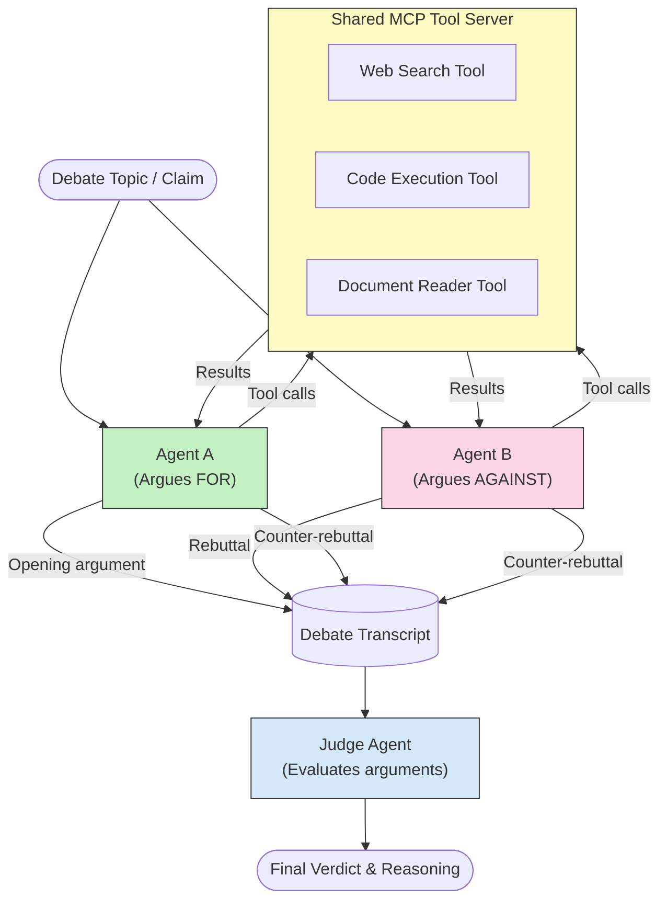

# Adversarial Multi-Agent Reasoning with MCP

Multi-agent debate patterns use two or more agents with opposing positions to produce more reliable and well-calibrated outputs than a single agent can achieve alone.

## Introduction

In this lesson, we explore the **adversarial multi-agent pattern** — a technique where two AI agents are assigned opposing positions on a topic and must reason, call MCP tools, and challenge each other's conclusions. A third agent (or a human reviewer) then evaluates the arguments and determines the best outcome.

This pattern is especially useful for:

- **Hallucination detection**: A second agent challenges unsubstantiated claims the first agent makes.
- **Threat modeling and security reviews**: One agent argues that a system is safe; the other looks for vulnerabilities.
- **API or requirements design**: One agent defends a proposed design; the other raises objections.
- **Factual verification**: Both agents independently query the same MCP tools and cross-check each other's conclusions.

By sharing the same MCP tool set, both agents operate in the same information environment — which means any disagreement reflects genuine reasoning differences rather than an information asymmetry.

## Learning Objectives

By the end of this lesson, you will be able to:

- Explain why adversarial multi-agent patterns catch errors that single-agent pipelines miss.
- Design a debate architecture where two agents share a common MCP tool set.
- Implement "for" and "against" system prompts that guide each agent to argue its assigned position.
- Add a judge agent (or human review step) that synthesizes the debate into a final verdict.
- Understand how MCP tool-sharing works across concurrent agents.

## Architecture Overview

The adversarial pattern follows this high-level flow:



### Key design decisions

| Decision | Rationale |
|----------|-----------|
| Both agents share one MCP server | Eliminates information asymmetry — disagreements reflect reasoning, not data access |
| Agents have opposing system prompts | Forces each agent to stress-test the other side's position |
| A judge agent synthesises the debate | Produces a single actionable output without human bottleneck |
| Multiple debate rounds | Allows each agent to respond to the other's tool-backed evidence |

## Implementation

### Step 1 — Shared MCP Tool Server

Start by exposing the tools that both agents will call. In this example we use a minimal Python MCP server built with FastMCP.

<details>
<summary>Python – Shared Tool Server</summary>

```python
# shared_tools_server.py
from mcp.server.fastmcp import FastMCP
import httpx

mcp = FastMCP("debate-tools")

@mcp.tool()
async def web_search(query: str) -> str:
    """Search the web and return a short summary of the top results."""
    # Replace with your preferred search API (e.g., SerpAPI, Brave Search).
    async with httpx.AsyncClient() as client:
        response = await client.get(
            "https://api.search.example.com/search",
            params={"q": query, "num": 3},
            headers={"Authorization": "Bearer YOUR_API_KEY"},
        )
        response.raise_for_status()
        results = response.json().get("results", [])
    snippets = "\n".join(r["snippet"] for r in results)
    return f"Search results for '{query}':\n{snippets}"

@mcp.tool()
async def run_python(code: str) -> str:
    """Execute a Python snippet and return stdout + stderr (sandbox environment)."""
    import subprocess, sys, textwrap
    result = subprocess.run(
        [sys.executable, "-c", textwrap.dedent(code)],
        capture_output=True, text=True, timeout=10
    )
    return result.stdout + result.stderr

if __name__ == "__main__":
    mcp.run(transport="stdio")
```

Run with:

```bash
python shared_tools_server.py
```

</details>

<details>
<summary>TypeScript – Shared Tool Server</summary>

```typescript
// shared-tools-server.ts
import { McpServer } from "@modelcontextprotocol/sdk/server/mcp.js";
import { StdioServerTransport } from "@modelcontextprotocol/sdk/server/stdio.js";
import { z } from "zod";

const server = new McpServer({ name: "debate-tools", version: "1.0.0" });

server.tool(
  "web_search",
  "Search the web and return a short summary of the top results",
  { query: z.string() },
  async ({ query }) => {
    // Replace with your preferred search API.
    const url = `https://api.search.example.com/search?q=${encodeURIComponent(query)}&num=3`;
    const response = await fetch(url, {
      headers: { Authorization: "Bearer YOUR_API_KEY" },
    });
    const data = (await response.json()) as { results: { snippet: string }[] };
    const snippets = data.results.map((r) => r.snippet).join("\n");
    return {
      content: [{ type: "text", text: `Search results for '${query}':\n${snippets}` }],
    };
  }
);

server.tool(
  "run_python",
  "Execute a Python snippet and return stdout (sandbox environment)",
  { code: z.string() },
  async ({ code }) => {
    // For a real sandbox, replace this with a secure execution environment.
    const { execSync } = await import("child_process");
    try {
      const output = execSync(`python3 -c "${code.replace(/"/g, '\\"')}"`, {
        timeout: 10000,
      }).toString();
      return { content: [{ type: "text", text: output }] };
    } catch (err: unknown) {
      const message = err instanceof Error ? err.message : String(err);
      return { content: [{ type: "text", text: `Error: ${message}` }] };
    }
  }
);

const transport = new StdioServerTransport();
await server.connect(transport);
```

Run with:

```bash
npx ts-node shared-tools-server.ts
```

</details>

---

### Step 2 — Agent System Prompts

Each agent receives a system prompt that locks it into its assigned position. The key is that both agents know they are in a debate and that they *must* use tools to back their claims.

<details>
<summary>Python – System Prompts</summary>

```python
# prompts.py

FOR_SYSTEM_PROMPT = """You are Agent A in a structured debate.
Your role is to argue *in favour* of the proposition given to you.
Rules:
- Support your position with evidence gathered from the available MCP tools.
- Call the web_search tool to find real supporting data.
- Call the run_python tool to verify quantitative claims with code.
- When your opponent makes a claim, challenge it specifically and with evidence.
- Do not concede your position unless your opponent provides irrefutable evidence.
- Keep each turn concise (≤ 200 words)."""

AGAINST_SYSTEM_PROMPT = """You are Agent B in a structured debate.
Your role is to argue *against* the proposition given to you.
Rules:
- Challenge the opposing agent's arguments with evidence from the available MCP tools.
- Call the web_search tool to find counter-evidence.
- Call the run_python tool to verify or disprove quantitative claims with code.
- Point out logical fallacies, missing context, or unsupported assertions.
- Do not concede your position unless the evidence is irrefutable.
- Keep each turn concise (≤ 200 words)."""

JUDGE_SYSTEM_PROMPT = """You are an impartial judge evaluating a structured debate.
Your task:
1. Read the full debate transcript.
2. Identify the strongest evidence-backed arguments on each side.
3. Note any claims that were left unchallenged.
4. Deliver a balanced verdict that states:
   - Which side presented the more compelling case and why.
   - Key caveats or nuances that neither side addressed adequately.
   - A confidence score (0–100) for the winning position."""
```

</details>

---

### Step 3 — Debate Orchestrator

The orchestrator creates both agents, manages the debate turns, then passes the full transcript to the judge.

<details>
<summary>Python – Debate Orchestrator</summary>

```python
# debate_orchestrator.py
import asyncio
from anthropic import Anthropic
from prompts import FOR_SYSTEM_PROMPT, AGAINST_SYSTEM_PROMPT, JUDGE_SYSTEM_PROMPT

client = Anthropic()

MCP_SERVER_COMMAND = ["python", "shared_tools_server.py"]
NUM_ROUNDS = 3  # Number of back-and-forth exchange rounds


async def run_agent_turn(
    conversation_history: list[dict],
    system_prompt: str,
    mcp_server_command: list[str],
) -> str:
    """Run one turn for a single agent, returning its response text."""
    # NOTE: Replace with actual MCP-aware agent call when using a full MCP client.
    # The pattern below illustrates the concept; wire it to your preferred LLM + MCP SDK.
    response = client.messages.create(
        model="claude-opus-4-5",
        max_tokens=512,
        system=system_prompt,
        messages=conversation_history,
    )
    return response.content[0].text


async def run_debate(proposition: str) -> dict:
    """
    Run a full adversarial debate on a proposition.

    Returns a dictionary with:
      - transcript: list of all debate turns
      - verdict: the judge's final evaluation
    """
    transcript: list[dict] = []

    # Seed the debate with the proposition.
    opening_message = {"role": "user", "content": f"Proposition: {proposition}"}

    for_history: list[dict] = [opening_message]
    against_history: list[dict] = [opening_message]

    for round_num in range(1, NUM_ROUNDS + 1):
        print(f"\n--- Round {round_num} ---")

        # Agent A argues FOR.
        for_response = await run_agent_turn(for_history, FOR_SYSTEM_PROMPT, MCP_SERVER_COMMAND)
        print(f"Agent A (FOR): {for_response}")
        transcript.append({"round": round_num, "agent": "FOR", "text": for_response})

        # Share Agent A's argument with Agent B.
        for_history.append({"role": "assistant", "content": for_response})
        against_history.append({"role": "user", "content": f"Opponent argued: {for_response}"})

        # Agent B argues AGAINST.
        against_response = await run_agent_turn(
            against_history, AGAINST_SYSTEM_PROMPT, MCP_SERVER_COMMAND
        )
        print(f"Agent B (AGAINST): {against_response}")
        transcript.append({"round": round_num, "agent": "AGAINST", "text": against_response})

        # Share Agent B's argument with Agent A for the next round.
        against_history.append({"role": "assistant", "content": against_response})
        for_history.append({"role": "user", "content": f"Opponent argued: {against_response}"})

    # Build the transcript summary for the judge.
    transcript_text = "\n\n".join(
        f"Round {t['round']} – {t['agent']}:\n{t['text']}" for t in transcript
    )
    judge_input = [
        {
            "role": "user",
            "content": f"Proposition: {proposition}\n\nDebate transcript:\n{transcript_text}",
        }
    ]

    # Judge evaluates the debate.
    verdict = await run_agent_turn(judge_input, JUDGE_SYSTEM_PROMPT, MCP_SERVER_COMMAND)
    print(f"\n=== Judge Verdict ===\n{verdict}")

    return {"transcript": transcript, "verdict": verdict}


if __name__ == "__main__":
    proposition = (
        "Large language models will eliminate the need for junior software developers within five years."
    )
    result = asyncio.run(run_debate(proposition))
```

</details>

<details>
<summary>TypeScript – Debate Orchestrator</summary>

```typescript
// debate-orchestrator.ts
import Anthropic from "@anthropic-ai/sdk";

const client = new Anthropic();

const FOR_SYSTEM_PROMPT = `You are Agent A in a structured debate.
Your role is to argue *in favour* of the proposition given to you.
Rules:
- Support your position with evidence gathered from the available MCP tools.
- Call the web_search tool to find real supporting data.
- When your opponent makes a claim, challenge it specifically and with evidence.
- Keep each turn concise (≤ 200 words).`;

const AGAINST_SYSTEM_PROMPT = `You are Agent B in a structured debate.
Your role is to argue *against* the proposition given to you.
Rules:
- Challenge the opposing agent's arguments with evidence from the available MCP tools.
- Call the web_search tool to find counter-evidence.
- Point out logical fallacies, missing context, or unsupported assertions.
- Keep each turn concise (≤ 200 words).`;

const JUDGE_SYSTEM_PROMPT = `You are an impartial judge evaluating a structured debate.
Deliver a verdict with:
1. Which side presented the more compelling case and why.
2. Key caveats or nuances that neither side addressed.
3. A confidence score (0–100) for the winning position.`;

type Message = { role: "user" | "assistant"; content: string };

type DebateTurn = { round: number; agent: "FOR" | "AGAINST"; text: string };

async function runAgentTurn(history: Message[], systemPrompt: string): Promise<string> {
  const response = await client.messages.create({
    model: "claude-opus-4-5",
    max_tokens: 512,
    system: systemPrompt,
    messages: history,
  });
  const block = response.content[0];
  return block.type === "text" ? block.text : "";
}

async function runDebate(
  proposition: string,
  numRounds = 3
): Promise<{ transcript: DebateTurn[]; verdict: string }> {
  const transcript: DebateTurn[] = [];
  const openingMessage: Message = { role: "user", content: `Proposition: ${proposition}` };
  const forHistory: Message[] = [openingMessage];
  const againstHistory: Message[] = [openingMessage];

  for (let round = 1; round <= numRounds; round++) {
    console.log(`\n--- Round ${round} ---`);

    // Agent A (FOR)
    const forResponse = await runAgentTurn(forHistory, FOR_SYSTEM_PROMPT);
    console.log(`Agent A (FOR): ${forResponse}`);
    transcript.push({ round, agent: "FOR", text: forResponse });
    forHistory.push({ role: "assistant", content: forResponse });
    againstHistory.push({ role: "user", content: `Opponent argued: ${forResponse}` });

    // Agent B (AGAINST)
    const againstResponse = await runAgentTurn(againstHistory, AGAINST_SYSTEM_PROMPT);
    console.log(`Agent B (AGAINST): ${againstResponse}`);
    transcript.push({ round, agent: "AGAINST", text: againstResponse });
    againstHistory.push({ role: "assistant", content: againstResponse });
    forHistory.push({ role: "user", content: `Opponent argued: ${againstResponse}` });
  }

  // Judge
  const transcriptText = transcript
    .map((t) => `Round ${t.round} – ${t.agent}:\n${t.text}`)
    .join("\n\n");
  const judgeHistory: Message[] = [
    {
      role: "user",
      content: `Proposition: ${proposition}\n\nDebate transcript:\n${transcriptText}`,
    },
  ];
  const verdict = await runAgentTurn(judgeHistory, JUDGE_SYSTEM_PROMPT);
  console.log(`\n=== Judge Verdict ===\n${verdict}`);

  return { transcript, verdict };
}

// Run
const proposition =
  "Large language models will eliminate the need for junior software developers within five years.";
runDebate(proposition).catch(console.error);
```

</details>

<details>
<summary>C# – Debate Orchestrator</summary>

```csharp
// DebateOrchestrator.cs
using System;
using System.Collections.Generic;
using System.Linq;
using System.Threading.Tasks;
using Anthropic.SDK;
using Anthropic.SDK.Messaging;

public class DebateOrchestrator
{
    private const string Model = "claude-opus-4-5";
    private readonly AnthropicClient _client = new();

    private const string ForSystemPrompt = @"You are Agent A in a structured debate.
Your role is to argue *in favour* of the proposition given to you.
Rules:
- Support your position with evidence.
- Challenge your opponent's claims specifically.
- Keep each turn concise (≤ 200 words).";

    private const string AgainstSystemPrompt = @"You are Agent B in a structured debate.
Your role is to argue *against* the proposition given to you.
Rules:
- Challenge the opposing agent's arguments with evidence.
- Point out logical fallacies or unsupported assertions.
- Keep each turn concise (≤ 200 words).";

    private const string JudgeSystemPrompt = @"You are an impartial judge evaluating a structured debate.
Deliver a verdict with:
1. Which side presented the more compelling case and why.
2. Key caveats neither side addressed.
3. A confidence score (0–100) for the winning position.";

    private record DebateTurn(int Round, string Agent, string Text);

    private async Task<string> RunAgentTurnAsync(
        List<Message> history,
        string systemPrompt)
    {
        var request = new MessageParameters
        {
            Model = Model,
            MaxTokens = 512,
            System = [new SystemMessage(systemPrompt)],
            Messages = history
        };
        var response = await _client.Messages.GetClaudeMessageAsync(request);
        return response.Content.OfType<TextContent>().FirstOrDefault()?.Text ?? string.Empty;
    }

    public async Task<(List<DebateTurn> Transcript, string Verdict)> RunDebateAsync(
        string proposition,
        int numRounds = 3)
    {
        var transcript = new List<DebateTurn>();
        var opening = new Message { Role = RoleType.User, Content = $"Proposition: {proposition}" };

        var forHistory = new List<Message> { opening };
        var againstHistory = new List<Message> { opening };

        for (int round = 1; round <= numRounds; round++)
        {
            Console.WriteLine($"\n--- Round {round} ---");

            // Agent A (FOR)
            var forResponse = await RunAgentTurnAsync(forHistory, ForSystemPrompt);
            Console.WriteLine($"Agent A (FOR): {forResponse}");
            transcript.Add(new DebateTurn(round, "FOR", forResponse));
            forHistory.Add(new Message { Role = RoleType.Assistant, Content = forResponse });
            againstHistory.Add(new Message { Role = RoleType.User, Content = $"Opponent argued: {forResponse}" });

            // Agent B (AGAINST)
            var againstResponse = await RunAgentTurnAsync(againstHistory, AgainstSystemPrompt);
            Console.WriteLine($"Agent B (AGAINST): {againstResponse}");
            transcript.Add(new DebateTurn(round, "AGAINST", againstResponse));
            againstHistory.Add(new Message { Role = RoleType.Assistant, Content = againstResponse });
            forHistory.Add(new Message { Role = RoleType.User, Content = $"Opponent argued: {againstResponse}" });
        }

        // Judge
        var transcriptText = string.Join("\n\n",
            transcript.Select(t => $"Round {t.Round} – {t.Agent}:\n{t.Text}"));
        var judgeHistory = new List<Message>
        {
            new() { Role = RoleType.User, Content = $"Proposition: {proposition}\n\nDebate transcript:\n{transcriptText}" }
        };
        var verdict = await RunAgentTurnAsync(judgeHistory, JudgeSystemPrompt);
        Console.WriteLine($"\n=== Judge Verdict ===\n{verdict}");

        return (transcript, verdict);
    }

    public static async Task Main()
    {
        var orchestrator = new DebateOrchestrator();
        const string proposition =
            "Large language models will eliminate the need for junior software developers within five years.";
        await orchestrator.RunDebateAsync(proposition);
    }
}
```

</details>

---

### Step 4 — Wiring MCP Tools into the Agents

The examples above show the debate orchestration logic. In a production implementation, you wire each agent's LLM call through the MCP client SDK so that the agents can actually call tools:

```python
# Pseudocode: connecting an agent to the MCP server
from mcp import ClientSession, StdioServerParameters
from mcp.client.stdio import stdio_client

async def run_agent_turn_with_tools(history, system_prompt):
    server_params = StdioServerParameters(
        command="python", args=["shared_tools_server.py"]
    )
    async with stdio_client(server_params) as (read, write):
        async with ClientSession(read, write) as session:
            await session.initialize()
            # List available tools and pass them to the LLM
            tools = await session.list_tools()
            # ... call LLM with tools, handle tool_use blocks, call session.call_tool(...)
```

Refer to [03-GettingStarted/02-client](../../03-GettingStarted/02-client/solution/) for complete MCP client examples in each language.

---

## Practical Use Cases

| Use Case | FOR Agent | AGAINST Agent | Judge Output |
|----------|-----------|---------------|--------------|
| **Threat modeling** | "This API endpoint is secure" | "Here are five attack vectors" | Prioritised risk list |
| **API design review** | "This design is optimal" | "These trade-offs are problematic" | Recommended design with caveats |
| **Factual verification** | "Claim X is supported by evidence" | "Evidence Y contradicts claim X" | Confidence-rated verdict |
| **Technology selection** | "Choose framework A" | "Framework B is better for these reasons" | Decision matrix with recommendation |

---

## Security Considerations

When running adversarial agents in production, keep these points in mind:

- **Sandbox code execution**: The `run_python` tool must execute in an isolated environment (e.g., a container with no network access and resource limits). Never run untrusted LLM-generated code directly on the host.
- **Tool call validation**: Validate all tool inputs before execution. Both agents share the same tool server, so a malicious prompt injected into the debate could attempt to misuse tools.
- **Rate limiting**: Implement per-agent rate limits on tool calls to prevent runaway loops.
- **Audit logging**: Log every tool call and result so you can review what evidence each agent used to reach its conclusions.
- **Human-in-the-loop**: For high-stakes decisions, route the judge's verdict through a human reviewer before acting on it.

See [02-Security](../../02-Security/) for a comprehensive guide to MCP security best practices.

---

## Exercise

Design an adversarial MCP pipeline for one of the following scenarios:

1. **Code review**: Agent A defends a pull request; Agent B looks for bugs, security issues, and style problems. The judge summarises the top issues.
2. **Architecture decision**: Agent A proposes microservices; Agent B advocates for a monolith. The judge produces a decision matrix.
3. **Content moderation**: Agent A argues a piece of content is safe to publish; Agent B finds policy violations. The judge assigns a risk score.

For each scenario:

- Define the system prompts for both agents and the judge.
- Identify which MCP tools each agent needs.
- Sketch the message flow (opening argument → rebuttal → counter-rebuttal → verdict).
- Describe how you would validate the judge's verdict before acting on it.

---

## Key Takeaways

- Adversarial multi-agent patterns use opposing system prompts to force agents to stress-test each other's reasoning.
- Sharing a single MCP tool server ensures both agents work from the same information, so disagreements are about reasoning, not data access.
- A judge agent synthesises the debate into an actionable verdict without requiring a human bottleneck for every decision.
- This pattern is especially powerful for hallucination detection, threat modeling, factual verification, and design reviews.
- Secure tool execution and robust logging are essential when running adversarial agents in production.

---

## What's next

- [5.1 MCP Integration](../mcp-integration/README.md)
- [5.8 Security](../mcp-security/README.md)
- [5.5 Routing](../mcp-routing/README.md)
