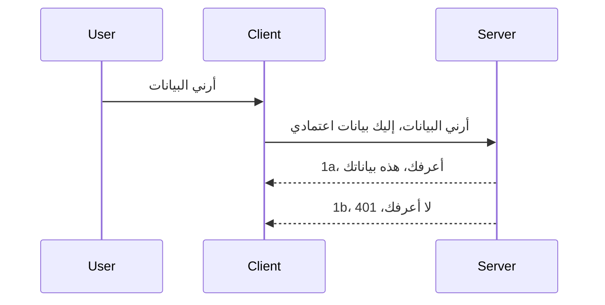

# المصادقة البسيطة

تدعم حزم MCP SDKs استخدام OAuth 2.1 والذي، لنكون منصفين، هو عملية معقدة تشمل مفاهيم مثل خادم المصادقة، خادم الموارد، إرسال بيانات الاعتماد، الحصول على رمز، تبديل الرمز برمز حامل حتى تتمكن أخيرًا من الحصول على بيانات الموارد الخاصة بك. إذا لم تكن معتادًا على OAuth وهو شيء رائع لتطبيقه، فمن الأفضل أن تبدأ بمستوى أساسي من المصادقة وتبني تدريجيًا نحو أمان أفضل وأفضل. لهذا السبب يوجد هذا الفصل، ليبنيك نحو مصادقة أكثر تقدمًا.

## المصادقة، ماذا نعني؟

المصادقة هي اختصار للمصادقة والتفويض. الفكرة هي أننا بحاجة إلى القيام بشيئين:

- **المصادقة**، وهي عملية معرفة ما إذا سمحنا لشخص ما بدخول منزلنا، أي أن لديه الحق في "التواجد هنا" أي الوصول إلى خادم الموارد الخاص بنا حيث توجد ميزات خادم MCP الخاص بنا.
- **التفويض**، وهو عملية معرفة ما إذا كان يجب أن يحصل المستخدم على حق الوصول إلى هذه الموارد المحددة التي يطلبها، على سبيل المثال هذه الطلبات أو هذه المنتجات، أو ما إذا كان مسموحًا له بقراءة المحتوى ولكن ليس بحذفه كمثال آخر.

## بيانات الاعتماد: كيف نخبر النظام من نحن

حسنًا، يبدأ معظم مطوري الويب بالتفكير في توفير بيانات اعتماد للخادم، عادة سر يقول إذا ما كان مسموحًا لهم بالتواجد هنا "المصادقة". عادة ما تكون هذه البيانات مشفرة بقاعدة64 من اسم المستخدم وكلمة المرور أو مفتاح API يحدد مستخدمًا معينًا بشكل فريد.

يشمل ذلك إرسالها عبر رأس يسمى "Authorization" كالتالي:

```json
{ "Authorization": "secret123" }
```

يشار عادة إلى هذا باسم المصادقة الأساسية. كيف تسير العملية العامة بعد ذلك هو بالشكل التالي:


الآن بعد أن فهمنا كيف تعمل من منظور التدفق، كيف ننفذها؟ حسنًا، تحتوي معظم خوادم الويب على مفهوم يسمى الوسيط (middleware)، وهو قطعة كود تعمل كجزء من الطلب يمكنها التحقق من بيانات الاعتماد، وإذا كانت صحيحة يمكنها السماح للطلب بالمرور. إذا لم يكن لدى الطلب بيانات اعتماد صحيحة، فستحصل على خطأ مصادقة. دعنا نرى كيف يمكن تنفيذ ذلك:

**بايثون**

```python
class AuthMiddleware(BaseHTTPMiddleware):
    async def dispatch(self, request, call_next):

        has_header = request.headers.get("Authorization")
        if not has_header:
            print("-> Missing Authorization header!")
            return Response(status_code=401, content="Unauthorized")

        if not valid_token(has_header):
            print("-> Invalid token!")
            return Response(status_code=403, content="Forbidden")

        print("Valid token, proceeding...")
       
        response = await call_next(request)
        # أضف أي رؤوس مخصصة أو قم بتغيير الرد بطريقة ما
        return response


starlette_app.add_middleware(CustomHeaderMiddleware)
```

هنا لدينا:

- أنشأنا وسيطًا يسمى `AuthMiddleware` حيث يتم استدعاء طريقة `dispatch` الخاصة به بواسطة خادم الويب.
- أضفنا الوسيط إلى خادم الويب:

    ```python
    starlette_app.add_middleware(AuthMiddleware)
    ```

- كتبنا منطق التحقق الذي يفحص إذا كان رأس Authorization موجودًا وإذا كان السر المرسل صحيحًا:

    ```python
    has_header = request.headers.get("Authorization")
    if not has_header:
        print("-> Missing Authorization header!")
        return Response(status_code=401, content="Unauthorized")

    if not valid_token(has_header):
        print("-> Invalid token!")
        return Response(status_code=403, content="Forbidden")
    ```

    إذا كان السر موجودًا وصحيحًا، نسمح للطلب بالمرور عن طريق استدعاء `call_next` وإرجاع الرد.

    ```python
    response = await call_next(request)
    # إضافة أي رؤوس مخصصة أو تغيير في الاستجابة بطريقة ما
    return response
    ```

كيف تعمل هي أنه إذا تم إجراء طلب ويب تجاه الخادم، سيتم استدعاء الوسيط وبناءً على تنفيذه، إما يسمح للطلب بالمرور أو يعيد خطأ يشير إلى أن العميل غير مسموح له بالاستمرار.

**تايب سكريبت**

هنا ننشئ وسيطًا باستخدام الإطار الشائع Express ونعترض الطلب قبل أن يصل إلى خادم MCP. إليك الكود لذلك:

```typescript
function isValid(secret) {
    return secret === "secret123";
}

app.use((req, res, next) => {
    // ١. هل يوجد ترويسة تفويض؟
    if(!req.headers["Authorization"]) {
        res.status(401).send('Unauthorized');
    }
    
    let token = req.headers["Authorization"];

    // ٢. التحقق من الصلاحية.
    if(!isValid(token)) {
        res.status(403).send('Forbidden');
    }

   
    console.log('Middleware executed');
    // ٣. يمرر الطلب إلى الخطوة التالية في سلسلة المعالجة.
    next();
});
```

في هذا الكود:

1. نتحقق مما إذا كان رأس Authorization موجودًا في المقام الأول، إن لم يكن نرسل خطأ 401.
2. نضمن أن بيانات الاعتماد/الرمز المميز صحيحة، إن لم يكن نرسل خطأ 403.
3. أخيرًا تمرير الطلب في مسار الطلب وإرجاع المورد المطلوب.

## تمرين: تنفيذ المصادقة

لنأخذ معرفتنا ونحاول تنفيذها. هنا الخطة:

الخادم

- إنشاء خادم ويب ونسخة MCP.
- تنفيذ وسيط للخادم.

العميل

- إرسال طلب ويب، مع بيانات الاعتماد، عبر رأس.

### -1- إنشاء خادم ويب ونسخة MCP

في خطوتنا الأولى، نحتاج لإنشاء نسخة خادم الويب وخادم MCP.

**بايثون**

هنا ننشئ نسخة خادم MCP، ننشئ تطبيق ويب Starlette ونستضيفه باستخدام uvicorn.

```python
# إنشاء خادم MCP

app = FastMCP(
    name="MCP Resource Server",
    instructions="Resource Server that validates tokens via Authorization Server introspection",
    host=settings["host"],
    port=settings["port"],
    debug=True
)

# إنشاء تطبيق ويب starlette
starlette_app = app.streamable_http_app()

# تقديم التطبيق عبر uvicorn
async def run(starlette_app):
    import uvicorn
    config = uvicorn.Config(
            starlette_app,
            host=app.settings.host,
            port=app.settings.port,
            log_level=app.settings.log_level.lower(),
        )
    server = uvicorn.Server(config)
    await server.serve()

run(starlette_app)
```

في هذا الكود:

- إنشاء خادم MCP.
- بناء تطبيق ويب ستارليت من خادم MCP، `app.streamable_http_app()`.
- استضافة وتشغيل تطبيق الويب باستخدام uvicorn `server.serve()`.

**تايب سكريبت**

هنا ننشئ نسخة خادم MCP.

```typescript
const server = new McpServer({
      name: "example-server",
      version: "1.0.0"
    });

    // ... إعداد موارد الخادم، الأدوات، والتعليمات ...
```

يجب أن يحدث إنشاء خادم MCP هذا داخل تعريف مسار POST /mcp، لذا دعنا ننقل الكود أعلاه كما يلي:

```typescript
import express from "express";
import { randomUUID } from "node:crypto";
import { McpServer } from "@modelcontextprotocol/sdk/server/mcp.js";
import { StreamableHTTPServerTransport } from "@modelcontextprotocol/sdk/server/streamableHttp.js";
import { isInitializeRequest } from "@modelcontextprotocol/sdk/types.js"

const app = express();
app.use(express.json());

// خريطة لتخزين وسائل النقل حسب معرف الجلسة
const transports: { [sessionId: string]: StreamableHTTPServerTransport } = {};

// التعامل مع طلبات POST للتواصل من العميل إلى الخادم
app.post('/mcp', async (req, res) => {
  // التحقق من وجود معرف الجلسة
  const sessionId = req.headers['mcp-session-id'] as string | undefined;
  let transport: StreamableHTTPServerTransport;

  if (sessionId && transports[sessionId]) {
    // إعادة استخدام وسيلة النقل الموجودة
    transport = transports[sessionId];
  } else if (!sessionId && isInitializeRequest(req.body)) {
    // طلب تهيئة جديد
    transport = new StreamableHTTPServerTransport({
      sessionIdGenerator: () => randomUUID(),
      onsessioninitialized: (sessionId) => {
        // تخزين وسيلة النقل حسب معرف الجلسة
        transports[sessionId] = transport;
      },
      // الحماية من إعادة ربط DNS معطلة افتراضيًا للحفاظ على التوافق الخلفي. إذا كنت تُشغّل هذا الخادم
      // محليًا، تأكد من تعيين:
      // تمكين حماية إعادة ربط DNS: true،
      // المضيفون المسموحون: ['127.0.0.1']،
    });

    // تنظيف وسيلة النقل عند الإغلاق
    transport.onclose = () => {
      if (transport.sessionId) {
        delete transports[transport.sessionId];
      }
    };
    const server = new McpServer({
      name: "example-server",
      version: "1.0.0"
    });

    // ... إعداد موارد الخادم، الأدوات، والتنبيهات ...

    // الاتصال بخادم MCP
    await server.connect(transport);
  } else {
    // طلب غير صالح
    res.status(400).json({
      jsonrpc: '2.0',
      error: {
        code: -32000,
        message: 'Bad Request: No valid session ID provided',
      },
      id: null,
    });
    return;
  }

  // التعامل مع الطلب
  await transport.handleRequest(req, res, req.body);
});

// معالج قابل لإعادة الاستخدام لطلبات GET و DELETE
const handleSessionRequest = async (req: express.Request, res: express.Response) => {
  const sessionId = req.headers['mcp-session-id'] as string | undefined;
  if (!sessionId || !transports[sessionId]) {
    res.status(400).send('Invalid or missing session ID');
    return;
  }
  
  const transport = transports[sessionId];
  await transport.handleRequest(req, res);
};

// التعامل مع طلبات GET لإشعارات الخادم إلى العميل عبر SSE
app.get('/mcp', handleSessionRequest);

// التعامل مع طلبات DELETE لإنهاء الجلسة
app.delete('/mcp', handleSessionRequest);

app.listen(3000);
```

الآن ترى كيف تم نقل إنشاء خادم MCP داخل `app.post("/mcp")`.

لننتقل إلى الخطوة التالية وهي إنشاء الوسيط لنتمكن من التحقق من بيانات الاعتماد الواردة.

### -2- تنفيذ وسيط للخادم

لننتقل إلى جزء الوسيط التالي. هنا سننشئ وسيطًا يبحث عن بيانات اعتماد في رأس `Authorization` ويتحقق من صحتها. إذا كانت مقبولة، ينتقل الطلب ليقوم بما يحتاج (مثل سرد الأدوات، قراءة مورد أو أي وظيفة MCP طلبها العميل).

**بايثون**

لإنشاء الوسيط، نحتاج لإنشاء فئة ترث من `BaseHTTPMiddleware`. هناك جزأين مهمين:

- الطلب `request`، نقرأ منه معلومات الرأس.
- `call_next` هو النداء الذي نحتاج لاستدعائه إذا جلب العميل بيانات اعتماد نقبلها.

أولًا، نحتاج لمعالجة حالة فقدان رأس `Authorization`:

```python
has_header = request.headers.get("Authorization")

# لا يوجد رأس، فشل مع 401، وإلا انتقل إلى التالي.
if not has_header:
    print("-> Missing Authorization header!")
    return Response(status_code=401, content="Unauthorized")
```

هنا نرسل رسالة 401 غير مصرح بها لأن العميل يفشل في المصادقة.

بعد ذلك، إذا تم تقديم بيانات اعتماد، نحتاج للتحقق من صحتها كالتالي:

```python
 if not valid_token(has_header):
    print("-> Invalid token!")
    return Response(status_code=403, content="Forbidden")
```

لاحظ كيف نرسل رسالة 403 ممنوع أعلاه. لنر الوسيط الكامل أدناه الذي ينفذ كل ما ذكرناه:

```python
class AuthMiddleware(BaseHTTPMiddleware):
    async def dispatch(self, request, call_next):

        has_header = request.headers.get("Authorization")
        if not has_header:
            print("-> Missing Authorization header!")
            return Response(status_code=401, content="Unauthorized")

        if not valid_token(has_header):
            print("-> Invalid token!")
            return Response(status_code=403, content="Forbidden")

        print("Valid token, proceeding...")
        print(f"-> Received {request.method} {request.url}")
        response = await call_next(request)
        response.headers['Custom'] = 'Example'
        return response

```

رائع، ولكن ماذا عن دالة `valid_token`؟ ها هي أدناه:

```python
# لا تستخدم للإنتاج - قم بتحسينه !!
def valid_token(token: str) -> bool:
    # إزالة بادئة "Bearer "
    if token.startswith("Bearer "):
        token = token[7:]
        return token == "secret-token"
    return False
```

من الواضح أن هذا يجب أن يتحسن.

مهم: يجب ألا تحتفظ أبدًا بأسرار كهذه في الكود. من المثالي أن تستخرج القيمة للمقارنة من مصدر بيانات أو من موفر هوية (IDP) أو من الأفضل ترك IDP يقوم بالتحقق.

**تايب سكريبت**

لتنفيذ هذا مع Express، نحتاج لاستدعاء الطريقة `use` التي تأخذ دوال وسيط.

نحتاج إلى:

- التفاعل مع متغير الطلب لفحص بيانات الاعتماد المرسلة في خاصية `Authorization`.
- التحقق من صحة بيانات الاعتماد، وإذا كانت صحيحة نسمح للطلب بالاستمرار وتنفيذ طلب MCP الخاص بالعميل (مثل سرد الأدوات، قراءة الموارد أو أي شيء متعلق بـ MCP).

هنا، نتحقق إذا كان رأس `Authorization` موجودًا وإن لم يكن، نوقف الطلب من المرور:

```typescript
if(!req.headers["authorization"]) {
    res.status(401).send('Unauthorized');
    return;
}
```

إذا لم يُرسل الرأس في المقام الأول، تحصل على 401.

بعد ذلك، نتحقق مما إذا كان بيانات الاعتماد صحيحة، إذا لم تكن صحيحة نوقف الطلب مرة أخرى ولكن برسالة مختلفة قليلاً:

```typescript
if(!isValid(token)) {
    res.status(403).send('Forbidden');
    return;
} 
```

لاحظ كيف تحصل الآن على خطأ 403.

ها هو الكود الكامل:

```typescript
app.use((req, res, next) => {
    console.log('Request received:', req.method, req.url, req.headers);
    console.log('Headers:', req.headers["authorization"]);
    if(!req.headers["authorization"]) {
        res.status(401).send('Unauthorized');
        return;
    }
    
    let token = req.headers["authorization"];

    if(!isValid(token)) {
        res.status(403).send('Forbidden');
        return;
    }  

    console.log('Middleware executed');
    next();
});
```

قمنا بإعداد خادم الويب لقبول وسيط لفحص بيانات الاعتماد التي يأمل العميل أن يرسلها لنا. ماذا عن العميل نفسه؟

### -3- إرسال طلب ويب مع بيانات اعتماد عبر الرأس

نحتاج للتأكد أن العميل يمرر بيانات الاعتماد عبر الرأس. بما أننا سنستخدم عميل MCP للقيام بذلك، نحتاج لمعرفة كيف يتم ذلك.

**بايثون**

بالنسبة للعميل، نحتاج لتمرير رأس ببيانات الاعتماد كالتالي:

```python
# لا تقم بتثبيت القيمة بشكل صلب، اجعلها على الأقل في متغير بيئة أو تخزين أكثر أمانًا
token = "secret-token"

async with streamablehttp_client(
        url = f"http://localhost:{port}/mcp",
        headers = {"Authorization": f"Bearer {token}"}
    ) as (
        read_stream,
        write_stream,
        session_callback,
    ):
        async with ClientSession(
            read_stream,
            write_stream
        ) as session:
            await session.initialize()
      
            # مطلوب، ما تريد أن يتم في العميل، مثل سرد الأدوات، استدعاء الأدوات، إلخ.
```

لاحظ كيف نملأ خاصية `headers` كالتالي ` headers = {"Authorization": f"Bearer {token}"}`.

**تايب سكريبت**

يمكننا حل هذا بخطوتين:

1. ملء كائن إعدادات ببيانات الاعتماد.
2. تمرير كائن الإعدادات إلى الناقل.

```typescript

// لا تقم بترميز القيمة بشكل ثابت كما هو موضح هنا. على الأقل اجعلها كمتغير بيئي واستخدم شيئًا مثل dotenv (في وضع التطوير).
let token = "secret123"

// تعريف كائن خيارات نقل العميل
let options: StreamableHTTPClientTransportOptions = {
  sessionId: sessionId,
  requestInit: {
    headers: {
      "Authorization": "secret123"
    }
  }
};

// مرر كائن الخيارات إلى النقل
async function main() {
   const transport = new StreamableHTTPClientTransport(
      new URL(serverUrl),
      options
   );
```

هنا ترى كيف اضطررنا لإنشاء كائن `options` ووضع رؤوسنا تحت خاصية `requestInit`.

مهم: كيف نحسن ذلك من هنا؟ حسنًا، التنفيذ الحالي به بعض المشكلات. أولاً، تمرير بيانات الاعتماد بهذه الطريقة محفوف بالمخاطر ما لم يكن لديك HTTPS على الأقل. حتى مع ذلك، يمكن سرقة بيانات الاعتماد لذا تحتاج إلى نظام يمكن من خلاله سحب الرموز بسهولة وإضافة تحقق إضافي مثل من أين يأتي الطلب في العالم، هل يحدث الطلب بشكل مفرط (سلوك بوت) وباختصار، هناك العديد من المخاوف.

مع ذلك، يجب القول، بالنسبة لواجهات API البسيطة جدًا حيث لا تريد لأي شخص أن ينادي واجهتك بدون أن يكون مصادقًا، ما لدينا هنا هو بداية جيدة.

مع ذلك، دعنا نحاول تعزيز الأمان قليلاً باستخدام تنسيق موحد مثل رموز الويب JSON Web Token، المعروفة أيضًا بـ JWT أو رموز "JOT".

## رموز الويب JSON، JWT

نحن نحاول تحسين الأشياء من إرسال بيانات اعتماد بسيطة جدًا. ما هي التحسينات الفورية التي نحصل عليها عند تبني JWT؟

- **تحسينات الأمان**. في المصادقة الأساسية، ترسل اسم المستخدم وكلمة المرور كرقة مشفرة بالقاعدة64 (أو ترسل مفتاح API) مرارًا وتكرارًا مما يزيد من الخطر. مع JWT، ترسل اسم المستخدم وكلمة المرور وتحصل على رمز مميز في المقابل وهو أيضًا مقيد بالوقت مما يعني أنه سينتهي صلاحيته. يتيح JWT استخدام تحكم دقيق في الوصول باستخدام الأدوار، النطاقات والصلاحيات.
- **عدم الاعتماد على الحالة وقابلية التوسع**. JWTs مكتفية ذاتيًا، تحمل كل معلومات المستخدم وتلغي الحاجة لتخزين جلسة على جانب الخادم. يمكن التحقق من الرمز محليًا.
- **التشغيل البيني والاتحاد**. تعتبر JWT مركزية في Open ID Connect وتستخدم مع موفري هوية معروفين مثل Entra ID، Google Identity و Auth0. كما تمكن من استخدام تسجيل الدخول الموحد والمزيد مما يجعلها بمستوى مؤسسي.
- **التجزئة والمرونة**. يمكن استخدام JWTs مع بوابات API مثل Azure API Management، NGINX وأكثر. كما يدعم سيناريوهات المصادقة واستخدامات الاتصال بين الخادم والخدمة بما في ذلك التمثيل والتفويض.
- **الأداء والتخزين المؤقت**. يمكن تخزين JWTs مؤقتًا بعد فك التشفير مما يقلل الحاجة إلى التحليل. هذا يساعد خصوصًا مع التطبيقات ذات الحركة العالية حيث يحسن الإنتاجية ويقلل من العبء على البنية التحتية التي تختارها.
- **ميزات متقدمة**. كما يدعم الاستعراض (التحقق من الصحة على الخادم) والسحب (جعل الرمز غير صالح).

مع كل هذه المزايا، لنرَ كيف يمكننا نقل تنفيذنا للمرحلة التالية.

## تحويل المصادقة الأساسية إلى JWT

التغييرات التي نحتاج لإجرائها على المستوى العالي هي:

- **تعلم كيفية بناء رمز JWT** وجعله جاهزًا للإرسال من العميل إلى الخادم.
- **التحقق من صحة رمز JWT**، وإذا كان صحيحًا، السماح للعميل بالحصول على مواردنا.
- **تخزين الرمز بأمان**. كيفية تخزين هذا الرمز.
- **حماية المسارات**. نحتاج لحماية المسارات، وفي حالتنا، حماية المسارات وميزات MCP المحددة.
- **إضافة رموز تحديث**. التأكد من إنشاء رموز قصيرة العمر ولكن مع وجود رموز تحديث طويلة العمر يمكن استخدامها للحصول على رموز جديدة إذا انتهت صلاحيته. كما التأكد من وجود نقطة تحديث واستراتيجية تدوير.

### -1- بناء رمز JWT

أولًا، يحتوي رمز JWT على الأجزاء التالية:

- **الرأس**، الخوارزمية المستخدمة ونوع الرمز.
- **المحتوى**، المطالبات، مثل sub (المستخدم أو الكيان الذي يمثل الرمز. في سيناريو المصادقة عادة هو معرف المستخدم)، exp (تاريخ الانتهاء) role (الدور)
- **التوقيع**، موقّع باستخدام سر أو مفتاح خاص.

لهذا، نحتاج لبناء الرأس، والمحتوى والرمز المشفر.

**بايثون**

```python

import jwt
import jwt
from jwt.exceptions import ExpiredSignatureError, InvalidTokenError
import datetime

# المفتاح السري المستخدم لتوقيع JWT
secret_key = 'your-secret-key'

header = {
    "alg": "HS256",
    "typ": "JWT"
}

# معلومات المستخدم ومطالباته ووقت انتهاء الصلاحية
payload = {
    "sub": "1234567890",               # الموضوع (معرّف المستخدم)
    "name": "User Userson",                # مطالبة مخصصة
    "admin": True,                     # مطالبة مخصصة
    "iat": datetime.datetime.utcnow(),# تم الإصدار في
    "exp": datetime.datetime.utcnow() + datetime.timedelta(hours=1)  # انتهاء الصلاحية
}

# ترميزه
encoded_jwt = jwt.encode(payload, secret_key, algorithm="HS256", headers=header)
```

في الكود أعلاه:

- عرفنا رأسًا باستخدام HS256 كخوارزمية والنوع ليكون JWT.
- بنينا محتوى يحتوي على موضوع أو معرف المستخدم، اسم المستخدم، دور، متى صدر ومتى ينتهي صلاحيته مما يطبق جانب التقييد الزمني الذي ذكرناه سابقًا.

**تايب سكريبت**

هنا نحتاج إلى بعض التبعيات التي ستساعدنا في بناء رمز JWT.

التبعيات

```sh

npm install jsonwebtoken
npm install --save-dev @types/jsonwebtoken
```

الآن بعد أن وضعنا ذلك، لننشئ الرأس والمحتوى ومن خلالها ننشئ الرمز المشفر.

```typescript
import jwt from 'jsonwebtoken';

const secretKey = 'your-secret-key'; // استخدم متغيرات البيئة في الإنتاج

// تعريف الحمولة
const payload = {
  sub: '1234567890',
  name: 'User usersson',
  admin: true,
  iat: Math.floor(Date.now() / 1000), // تم الإصدار في
  exp: Math.floor(Date.now() / 1000) + 60 * 60 // ينتهي خلال ساعة واحدة
};

// تعريف الرأس (اختياري، مكتبة jsonwebtoken تضبط القيم الافتراضية)
const header = {
  alg: 'HS256',
  typ: 'JWT'
};

// إنشاء الرمز المميز
const token = jwt.sign(payload, secretKey, {
  algorithm: 'HS256',
  header: header
});

console.log('JWT:', token);
```

هذا الرمز:

موقع باستخدام HS256
صالح لمدة ساعة واحدة
يتضمن مطالبات مثل sub، name، admin، iat، و exp.

### -2- التحقق من صحة الرمز

نحتاج أيضًا للتحقق من صحة الرمز، وهذا شيء يجب القيام به على الخادم للتأكد مما يرسله العميل صحيح. هناك العديد من الفحوص التي يجب إجراؤها هنا من التحقق من الهيكل حتى صحته. يُشجع أيضًا على إضافة فحوص أخرى لمعرفة إذا ما كان المستخدم موجودًا في النظام وكيفية حقوقه.

للتحقق من الرمز، نحتاج لفك تشفيره لنتمكن من قراءته ثم نبدأ بفحص صحته:

**بايثون**

```python

# فك وترميز JWT والتحقق منه
try:
    decoded = jwt.decode(token, secret_key, algorithms=["HS256"])
    print("✅ Token is valid.")
    print("Decoded claims:")
    for key, value in decoded.items():
        print(f"  {key}: {value}")
except ExpiredSignatureError:
    print("❌ Token has expired.")
except InvalidTokenError as e:
    print(f"❌ Invalid token: {e}")

```

في هذا الكود، نستدعي `jwt.decode` باستخدام الرمز، مفتاح السر والخوارزمية المختارة كمدخلات. لاحظ كيف نستخدم بناء try-catch لأن فشل التحقق يؤدي إلى رفع خطأ.

**تايب سكريبت**

هنا نحتاج لاستدعاء `jwt.verify` للحصول على نسخة مفككة من الرمز يمكننا تحليلها. إذا فشل هذا الاستدعاء، فهذا يعني أن هيكل الرمز غير صحيح أو لم يعد صالحًا.

```typescript

try {
  const decoded = jwt.verify(token, secretKey);
  console.log('Decoded Payload:', decoded);
} catch (err) {
  console.error('Token verification failed:', err);
}
```

ملاحظة: كما ذكرنا سابقًا، يجب إجراء فحوص إضافية للتأكد من أن هذا الرمز يشير إلى مستخدم في نظامنا والتأكد من أن المستخدم لديه الحقوق التي يدعيها.

بعد ذلك، لننظر في إدارة الوصول المبنية على الدور، المعروفة أيضًا باسم RBAC.
## إضافة التحكم في الوصول بناءً على الدور

الفكرة هي أننا نريد التعبير عن أن الأدوار المختلفة تمتلك أذونات مختلفة. على سبيل المثال، نفترض أن المدير يمكنه فعل كل شيء وأن المستخدم العادي يمكنه القراءة/الكتابة وأن الضيف يمكنه القراءة فقط. لذلك، هنا بعض مستويات الأذونات الممكنة:

- Admin.Write  
- User.Read  
- Guest.Read  

لننظر كيف يمكننا تنفيذ مثل هذا التحكم باستخدام الميدلوير. يمكن إضافة الميدلوير لكل مسار وكذلك لجميع المسارات.

**بايثون**

```python
from starlette.middleware.base import BaseHTTPMiddleware
from starlette.responses import JSONResponse
import jwt

# لا تحتفظ بالسر في الشيفرة مثل هذا، فهذا لغرض العرض فقط. اقرأه من مكان آمن.
SECRET_KEY = "your-secret-key" # ضع هذا في متغير البيئة
REQUIRED_PERMISSION = "User.Read"

class JWTPermissionMiddleware(BaseHTTPMiddleware):
    async def dispatch(self, request, call_next):
        auth_header = request.headers.get("Authorization")
        if not auth_header or not auth_header.startswith("Bearer "):
            return JSONResponse({"error": "Missing or invalid Authorization header"}, status_code=401)

        token = auth_header.split(" ")[1]
        try:
            decoded = jwt.decode(token, SECRET_KEY, algorithms=["HS256"])
        except jwt.ExpiredSignatureError:
            return JSONResponse({"error": "Token expired"}, status_code=401)
        except jwt.InvalidTokenError:
            return JSONResponse({"error": "Invalid token"}, status_code=401)

        permissions = decoded.get("permissions", [])
        if REQUIRED_PERMISSION not in permissions:
            return JSONResponse({"error": "Permission denied"}, status_code=403)

        request.state.user = decoded
        return await call_next(request)


```
  
هناك بعض الطرق المختلفة لإضافة الميدلوير كما يلي:

```python

# البديل 1: إضافة وسيط برمجي أثناء بناء تطبيق ستارليت
middleware = [
    Middleware(JWTPermissionMiddleware)
]

app = Starlette(routes=routes, middleware=middleware)

# البديل 2: إضافة وسيط برمجي بعد بناء تطبيق ستارليت بالفعل
starlette_app.add_middleware(JWTPermissionMiddleware)

# البديل 3: إضافة وسيط برمجي لكل مسار
routes = [
    Route(
        "/mcp",
        endpoint=..., # المعالج
        middleware=[Middleware(JWTPermissionMiddleware)]
    )
]
```
  
**تايبسكريبت**

يمكننا استخدام `app.use` وميدلوير يعمل لكل الطلبات.

```typescript
app.use((req, res, next) => {
    console.log('Request received:', req.method, req.url, req.headers);
    console.log('Headers:', req.headers["authorization"]);

    // 1. تحقق مما إذا تم إرسال رأس التفويض

    if(!req.headers["authorization"]) {
        res.status(401).send('Unauthorized');
        return;
    }
    
    let token = req.headers["authorization"];

    // 2. تحقق مما إذا كانت الرمز صالحًا
    if(!isValid(token)) {
        res.status(403).send('Forbidden');
        return;
    }  

    // 3. تحقق مما إذا كان مستخدم الرمز موجودًا في نظامنا
    if(!isExistingUser(token)) {
        res.status(403).send('Forbidden');
        console.log("User does not exist");
        return;
    }
    console.log("User exists");

    // 4. تحقق من أن الرمز يحتوي على الأذونات الصحيحة
    if(!hasScopes(token, ["User.Read"])){
        res.status(403).send('Forbidden - insufficient scopes');
    }

    console.log("User has required scopes");

    console.log('Middleware executed');
    next();
});

```
  
هناك عدة أشياء يمكننا أن نسمح لميدلويرنا بها ويجب أن يقوم بها، وهي:

1. التحقق إذا كان ترويسة التفويض موجودة  
2. التحقق من صلاحية التوكن، ندعو إلى `isValid` وهي دالة كتبناها تتحقق من سلامة وصلاحية توكن JWT.  
3. التحقق من وجود المستخدم في نظامنا، ويجب أن نتحقق من ذلك.

   ```typescript
    // المستخدمون في قاعدة البيانات
   const users = [
     "user1",
     "User usersson",
   ]

   function isExistingUser(token) {
     let decodedToken = verifyToken(token);

     // TODO، تحقق مما إذا كان المستخدم موجودًا في قاعدة البيانات
     return users.includes(decodedToken?.name || "");
   }
   ```
  
   في الأعلى، أنشأنا قائمة `users` بسيطة جدًا، والتي من المفترض أن تكون في قاعدة بيانات بالطبع.

4. بالإضافة إلى ذلك، يجب أن نتحقق أيضًا من أن التوكن يحتوي على الأذونات المناسبة.

   ```typescript
   if(!hasScopes(token, ["User.Read"])){
        res.status(403).send('Forbidden - insufficient scopes');
   }
   ```
  
   في هذا الكود أعلاه من الميدلوير، نتحقق من أن التوكن يحتوي على إذن User.Read، إذا لم يكن كذلك نرسل خطأ 403. أدناه دالة مساعدة `hasScopes`.

   ```typescript
   function hasScopes(scope: string, requiredScopes: string[]) {
     let decodedToken = verifyToken(scope);
    return requiredScopes.every(scope => decodedToken?.scopes.includes(scope));
  }  
   ```

Have a think which additional checks you should be doing, but these are the absolute minimum of checks you should be doing.

Using Express as a web framework is a common choice. There are helpers library when you use JWT so you can write less code.

- `express-jwt`, helper library that provides a middleware that helps decode your token.
- `express-jwt-permissions`, this provides a middleware `guard` that helps check if a certain permission is on the token.

Here's what these libraries can look like when used:

```typescript
const express = require('express');
const jwt = require('express-jwt');
const guard = require('express-jwt-permissions')();

const app = express();
const secretKey = 'your-secret-key'; // put this in env variable

// Decode JWT and attach to req.user
app.use(jwt({ secret: secretKey, algorithms: ['HS256'] }));

// Check for User.Read permission
app.use(guard.check('User.Read'));

// multiple permissions
// app.use(guard.check(['User.Read', 'Admin.Access']));

app.get('/protected', (req, res) => {
  res.json({ message: `Welcome ${req.user.name}` });
});

// Error handler
app.use((err, req, res, next) => {
  if (err.code === 'permission_denied') {
    return res.status(403).send('Forbidden');
  }
  next(err);
});

```
  
الآن رأيت كيف يمكن استخدام الميدلوير لكل من المصادقة والتفويض، ولكن ماذا عن MCP، هل يغير طريقتنا في عمل المصادقة؟ لنكتشف في القسم التالي.

### -3- إضافة RBAC إلى MCP

لقد شاهدت حتى الآن كيف يمكن إضافة RBAC عبر الميدلوير، ومع ذلك، بالنسبة لـ MCP لا توجد طريقة سهلة لإضافة RBAC لكل ميزة على حدة في MCP، فماذا نفعل؟ ببساطة، علينا إضافة كود كهذا يتحقق في هذه الحالة ما إذا كان العميل لديه الحقوق لاستدعاء أداة محددة:

لديك عدة خيارات مختلفة لكيفية تحقيق RBAC لكل ميزة، إليك بعضها:

- إضافة تحقق لكل أداة، مورد، موجه تحتاج فيه للتحقق من مستوى الإذن.

   **بايثون**

   ```python
   @tool()
   def delete_product(id: int):
      try:
          check_permissions(role="Admin.Write", request)
      catch:
        pass # فشل العميل في التفويض، ارفع خطأ التفويض
   ```
  
   **تايبسكريبت**

   ```typescript
   server.registerTool(
    "delete-product",
    {
      title: Delete a product",
      description: "Deletes a product",
      inputSchema: { id: z.number() }
    },
    async ({ id }) => {
      
      try {
        checkPermissions("Admin.Write", request);
        // يجب القيام به، إرسال المعرف إلى productService والنقطة البعيدة
      } catch(Exception e) {
        console.log("Authorization error, you're not allowed");  
      }

      return {
        content: [{ type: "text", text: `Deletected product with id ${id}` }]
      };
    }
   );
   ```
  

- استخدام نهج الخادم المتقدم ومعالجات الطلبات لتقليل عدد الأماكن التي تحتاج إلى القيام بالتحقق فيها.

   **بايثون**

   ```python
   
   tool_permission = {
      "create_product": ["User.Write", "Admin.Write"],
      "delete_product": ["Admin.Write"]
   }

   def has_permission(user_permissions, required_permissions) -> bool:
      # user_permissions: قائمة الأذونات التي يمتلكها المستخدم
      # required_permissions: قائمة الأذونات المطلوبة للأداة
      return any(perm in user_permissions for perm in required_permissions)

   @server.call_tool()
   async def handle_call_tool(
     name: str, arguments: dict[str, str] | None
   ) -> list[types.TextContent]:
    # افترض أن request.user.permissions هي قائمة الأذونات للمستخدم
     user_permissions = request.user.permissions
     required_permissions = tool_permission.get(name, [])
     if not has_permission(user_permissions, required_permissions):
        # أطلق الخطأ "ليس لديك إذن لاستدعاء الأداة {name}"
        raise Exception(f"You don't have permission to call tool {name}")
     # استمر وقم باستدعاء الأداة
     # ...
   ```   
     

   **تايبسكريبت**

   ```typescript
   function hasPermission(userPermissions: string[], requiredPermissions: string[]): boolean {
       if (!Array.isArray(userPermissions) || !Array.isArray(requiredPermissions)) return false;
       // إرجع صحيح إذا كان لدى المستخدم إذن واحد على الأقل مطلوب
       
       return requiredPermissions.some(perm => userPermissions.includes(perm));
   }
  
   server.setRequestHandler(CallToolRequestSchema, async (request) => {
      const { params: { name } } = request;
  
      let permissions = request.user.permissions;
  
      if (!hasPermission(permissions, toolPermissions[name])) {
         return new Error(`You don't have permission to call ${name}`);
      }
  
      // استمر..
   });
   ```
  
   ملاحظة، ستحتاج إلى التأكد من أن الميدلوير يعيّن التوكن المفكك إلى خاصية المستخدم في الطلب لتبسيط الكود أعلاه.

### خلاصة

الآن بعد أن ناقشنا كيفية إضافة دعم RBAC بشكل عام ولـ MCP بشكل خاص، حان الوقت لتجربة تنفيذ الحماية بنفسك لضمان فهم المفاهيم المقدمة لك.

## المهمة 1: بناء خادم mcp وعميل mcp باستخدام المصادقة الأساسية

هنا ستأخذ ما تعلمته في إرسال بيانات الاعتماد عبر الترويسات.

## الحل 1

[الحل 1](./code/basic/README.md)

## المهمة 2: ترقية الحل من المهمة 1 لاستخدام JWT

خذ الحل الأول ولكن هذه المرة، دعنا نحسنه.

بدلاً من استخدام المصادقة الأساسية، دعنا نستخدم JWT.

## الحل 2

[الحل 2](./solution/jwt-solution/README.md)

## التحدي

أضف RBAC لكل أداة كما وصفنا في قسم "إضافة RBAC إلى MCP".

## الملخص

نأمل أنك تعلمت الكثير في هذا الفصل، من عدم وجود حماية على الإطلاق، إلى الحماية الأساسية، إلى JWT وكيف يمكن إضافته إلى MCP.

لقد بنينا أساسًا قويًا باستخدام JWTs مخصصة، ولكن مع توسعنا، نتحول نحو نموذج هوية معتمد على المعايير. اعتماد موفر هوية مثل Entra أو Keycloak يتيح لنا تفويض إصدار التوكن والتحقق وإدارة دورة الحياة إلى منصة موثوقة – مما يحررنا للتركيز على منطق التطبيق وتجربة المستخدم.

لهذا، لدينا فصل أكثر [تقدمًا عن Entra](../../05-AdvancedTopics/mcp-security-entra/README.md)

## ما التالي

- التالي: [إعداد مضيفي MCP](../12-mcp-hosts/README.md)

---

<!-- CO-OP TRANSLATOR DISCLAIMER START -->
**إخلاء المسؤولية**:  
تمت ترجمة هذا المستند باستخدام خدمة الترجمة الآلية [Co-op Translator](https://github.com/Azure/co-op-translator). بينما نسعى لتحقيق الدقة، يرجى العلم أن الترجمات الآلية قد تحتوي على أخطاء أو عدم دقة. يجب اعتبار المستند الأصلي بلغته الأصلية المصدر الموثوق. للمعلومات الحساسة، يُنصح بالاستعانة بترجمة بشرية محترفة. نحن غير مسؤولين عن أي سوء فهم أو تفسير خاطئ ناتج عن استخدام هذه الترجمة.
<!-- CO-OP TRANSLATOR DISCLAIMER END -->