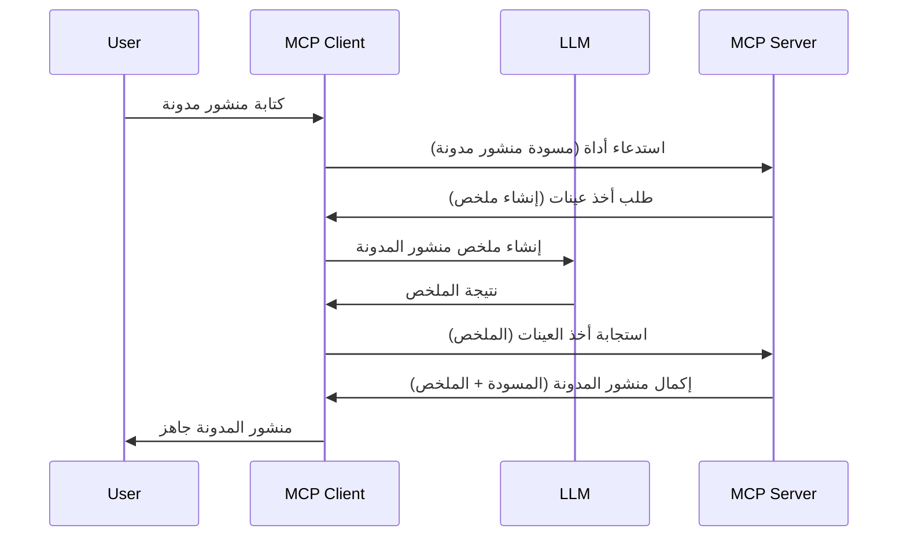

# أخذ عينات - تفويض الميزات إلى العميل

في بعض الأحيان، تحتاج إلى تعاون عميل MCP وخادم MCP لتحقيق هدف مشترك. قد يكون لديك حالة حيث يتطلب الخادم مساعدة من نموذج لغة كبير (LLM) الذي يوجد على العميل. في هذه الحالة، فإن أخذ العينات هو ما يجب استخدامه.

لنستعرض بعض حالات الاستخدام وكيفية بناء حل يتضمن أخذ العينات.

## نظرة عامة

في هذا الدرس، نركز على شرح متى وأين يجب استخدام أخذ العينات وكيفية تكوينه.

## أهداف التعلم

في هذا الفصل، سنقوم بـ:

- شرح ما هو أخذ العينات ومتى يجب استخدامه.
- توضيح كيفية تكوين أخذ العينات في MCP.
- تقديم أمثلة على أخذ العينات أثناء العمل.

## ما هو أخذ العينات ولماذا نستخدمه؟

أخذ العينات هو ميزة متقدمة تعمل بالطريقة التالية:


### طلب أخذ العينات

حسنًا، الآن لدينا رؤية شاملة لسيناريو معقول، دعونا نتحدث عن طلب أخذ العينات الذي يرسله الخادم إلى العميل. إليك كيف يمكن أن يبدو هذا الطلب بصيغة JSON-RPC:

```json
{
  "jsonrpc": "2.0",
  "id": 1,
  "method": "sampling/createMessage",
  "params": {
    "messages": [
      {
        "role": "user",
        "content": {
          "type": "text",
          "text": "Create a blog post summary of the following blog post: <BLOG POST>"
        }
      }
    ],
    "modelPreferences": {
      "hints": [
        {
          "name": "claude-3-sonnet"
        }
      ],
      "intelligencePriority": 0.8,
      "speedPriority": 0.5
    },
    "systemPrompt": "You are a helpful assistant.",
    "maxTokens": 100
  }
}
```

هناك بعض النقاط الجديرة بالذكر هنا:

- الموجه (prompt)، تحت content -> text، هو الموجه الخاص بنا وهو تعليمات لنموذج اللغة الكبير لتلخيص محتوى تدوينة المدونة.

- **modelPreferences**. هذا القسم هو مجرد تفضيل، توصية بتكوين استخدام نموذج اللغة الكبير. يمكن للمستخدم اختيار اتباع هذه التوصيات أو تغييرها. في هذه الحالة هناك توصيات على النموذج المستخدم وأولوية السرعة والذكاء.
- **systemPrompt**، هو الموجه النظامي العادي الخاص بك الذي يعطي نموذج اللغة الكبير شخصية ويحتوي على تعليمات توجيهية.
- **maxTokens**، هي خاصية أخرى تُستخدم لتحديد عدد الرموز الموصى بها لاستخدامها لهذه المهمة.

### استجابة أخذ العينات

هذه الاستجابة هي التي يرسلها عميل MCP في النهاية إلى خادم MCP وهي نتيجة استدعاء العميل لنموذج اللغة الكبير، وانتظار تلك الاستجابة ثم بناء هذه الرسالة. إليك كيف يمكن أن تبدو بصيغة JSON-RPC:

```json
{
  "jsonrpc": "2.0",
  "id": 1,
  "result": {
    "role": "assistant",
    "content": {
      "type": "text",
      "text": "Here's your abstract <ABSTRACT>"
    },
    "model": "gpt-5",
    "stopReason": "endTurn"
  }
}
```

لاحظ كيف أن الاستجابة هي ملخص لتدوينة المدونة تمامًا كما طلبنا. كما لاحظ كيف أن النموذج المستخدم `model` ليس ما طلبناه بل "gpt-5" بدلاً من "claude-3-sonnet". هذا لتوضيح أن المستخدم يمكن أن يغير رأيه في ما يستخدم وأن طلب أخذ العينات هو مجرد توصية.

حسنًا، الآن بعد أن فهمنا التدفق الأساسي، والمهمة المفيدة لاستخدامها "إنشاء تدوينة + ملخص"، لنرى ما نحتاج إلى فعله لتشغيلها.

### أنواع الرسائل

رسائل أخذ العينات ليست مقصورة على النص فقط، بل يمكنك أيضًا إرسال صور وصوت. إليك كيف يبدو JSON-RPC مختلفًا:

**نص**

```json
{
  "type": "text",
  "text": "The message content"
}
```

**محتوى الصورة**

```json
{
  "type": "image",
  "data": "base64-encoded-image-data",
  "mimeType": "image/jpeg"
}
```

**محتوى الصوت**

```json
{
  "type": "audio",
  "data": "base64-encoded-audio-data",
  "mimeType": "audio/wav"
}
```

> ملاحظة: لمزيد من المعلومات التفصيلية عن أخذ العينات، راجع [التوثيق الرسمي](https://modelcontextprotocol.io/specification/2025-06-18/client/sampling)

## كيفية تكوين أخذ العينات في العميل

> ملاحظة: إذا كنت تبني خادم فقط، فلست بحاجة إلى القيام بالكثير هنا.

في العميل، تحتاج إلى تحديد الميزة التالية على النحو التالي:

```json
{
  "capabilities": {
    "sampling": {}
  }
}
```

سيتم اختيار هذا عند تهيئة العميل المختار مع الخادم.

## مثال عملي لأخذ العينات - إنشاء تدوينة مدونة

دعونا نبرمج خادم أخذ عينات معًا، سنحتاج إلى القيام بما يلي:

1. إنشاء أداة على الخادم.
1. يجب أن تُنشئ الأداة طلب أخذ عينات.
1. يجب أن تنتظر الأداة رد طلب أخذ العينات من العميل.
1. وبعد ذلك يجب إصدار نتيجة الأداة.

لنرى الكود خطوة بخطوة:

### -1- إنشاء الأداة

**python**

```python
@mcp.tool()
async def create_blog(title: str, content: str, ctx: Context[ServerSession, None]) -> str:
    """Create a blog post and generate a summary"""

```

### -2- إنشاء طلب أخذ عينات

وسع أداتك بالكود التالي:

**python**

```python
post = BlogPost(
        id=len(posts) + 1,
        title=title,
        content=content,
        abstract=""
    )

prompt = f"Create an abstract of the following blog post: title: {title} and draft: {content} "

result = await ctx.session.create_message(
        messages=[
            SamplingMessage(
                role="user",
                content=TextContent(type="text", text=prompt),
            )
        ],
        max_tokens=100,
)

```

### -3- الانتظار للرد وإرجاعه

**python**

```python
post.abstract = result.content.text

posts.append(post)

# إرجاع المنتج الكامل
return json.dumps({
    "id": post.title,
    "abstract": post.abstract
})
```

### -4- الكود الكامل

**python**

```python
from starlette.applications import Starlette
from starlette.routing import Mount, Host

from mcp.server.fastmcp import Context, FastMCP

from mcp.server.session import ServerSession
from mcp.types import SamplingMessage, TextContent

import json


from uuid import uuid4
from typing import List
from pydantic import BaseModel


mcp = FastMCP("Blog post generator")

# app = FastAPI()

posts = []

class BlogPost(BaseModel):
    id: int
    title: str
    content: str
    abstract: str

posts: List[BlogPost] = []

@mcp.tool()
async def create_blog(title: str, content: str, ctx: Context[ServerSession, None]) -> str:
    """Create a blog post and generate a summary"""

    post = BlogPost(
        id=len(posts) + 1,
        title=title,
        content=content,
        abstract=""
    )

    prompt = f"Create an abstract of the following blog post: title: {title} and draft: {content} "

    result = await ctx.session.create_message(
        messages=[
            SamplingMessage(
                role="user",
                content=TextContent(type="text", text=prompt),
            )
        ],
        max_tokens=100,
    )

    post.abstract = result.content.text

    posts.append(post)

    # إرجاع المنشور الكامل للمدونة
    return json.dumps({
        "id": post.title,
        "abstract": post.abstract
    })

if __name__ == "__main__":
    print("Starting server...")
    # mcp.run()
    mcp.run(transport="streamable-http")

# تشغيل التطبيق باستخدام: python server.py
```

### -5- اختبار ذلك في Visual Studio Code

لاختبار هذا في Visual Studio Code، قم بما يلي:

1. شغّل الخادم في الطرفية
1. أضفه إلى *mcp.json* (وتأكد من تشغيله) مثلًا هكذا:

   ```json
   "servers": {
      "blog-server": {
        "type": "http",
        "url": "http://localhost:8000/mcp"
      }
   }
   ```

1. اكتب موجهًا:

   ```text
   create a blog post named "Where Python comes from", the content is "Python is actually named after Monty Python Flying Circus"
   ```

1. اسمح بتنفيذ أخذ العينات. في المرة الأولى التي تجرب فيها هذا، ستظهر لك نافذة حوار إضافية ستحتاج إلى الموافقة عليها، ثم سترى النافذة العادية التي تطلب منك تشغيل أداة.

1. تفقد النتائج. سترى النتائج بشكل جميل معروض في GitHub Copilot Chat ولكن يمكنك أيضًا تفحص الرد الخام بصيغة JSON.

**مكافأة**. أدوات Visual Studio Code توفر دعمًا رائعًا لأخذ العينات. يمكنك تكوين الوصول إلى أخذ العينات على الخادم المثبت لديك من خلال التنقل كالتالي:

1. انتقل إلى قسم الإضافات.
1. اختر أيقونة الترس الخاصة بالخادم المثبت في قسم "MCP SERVERS - INSTALLED".
1. اختر "Configure Model Access"، هنا يمكنك اختيار النماذج التي يسمح لـ GitHub Copilot باستخدامها عند إجراء أخذ العينات. يمكنك أيضًا رؤية جميع طلبات أخذ العينات التي حدثت مؤخرًا باختيار "Show Sampling requests".

## الواجب

في هذا الواجب، ستقوم ببناء أخذ عينات مختلف قليلاً وهو تكامل أخذ عينات يدعم توليد وصف المنتج. إليك سيناريو الحالة:

**السيناريو**: عامل المكتب الخلفي في متجر إلكتروني يحتاج للمساعدة، يستغرق وقتًا طويلاً جدًا لتوليد أوصاف المنتجات. لذلك، ستقوم ببناء حل حيث يمكنك استدعاء أداة "create_product" مع "title" و "keywords" كوسيطات، ويجب أن تنتج منتجًا كاملاً يتضمن حقل "description" الذي يتم تعبئته بواسطة نموذج اللغة الكبير على العميل.

نصيحة: استخدم ما تعلمته سابقًا لبناء هذا الخادم وأداته باستخدام طلب أخذ العينات.

## الحل

[الحل](./solution/README.md)

## النقاط الرئيسية

أخذ العينات هي ميزة قوية تسمح للخادم بتفويض المهام إلى العميل عندما يحتاج إلى مساعدة نموذج لغة كبير.

## القادم

- [الفصل 4 - التنفيذ العملي](../../04-PracticalImplementation/README.md)

---

<!-- CO-OP TRANSLATOR DISCLAIMER START -->
**إخلاء المسؤولية**:  
تمت ترجمة هذا المستند باستخدام خدمة الترجمة بالذكاء الاصطناعي [Co-op Translator](https://github.com/Azure/co-op-translator). بينما نسعى لتحقيق الدقة، يرجى العلم أن الترجمات الآلية قد تحتوي على أخطاء أو عدم دقة. يجب اعتبار المستند الأصلي بلغته الأصلية هو المصدر الرسمي والمعتمد. بالنسبة للمعلومات الحساسة، يُنصح بالترجمة الاحترافية البشرية. نحن غير مسؤولين عن أي سوء فهم أو تفسير خاطئ ناتج عن استخدام هذه الترجمة.
<!-- CO-OP TRANSLATOR DISCLAIMER END -->