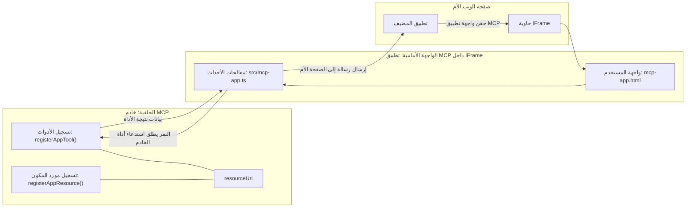

# تطبيقات MCP

تطبيقات MCP هي نموذج جديد في MCP. الفكرة هي أنك لا تستجيب فقط بالبيانات من استدعاء أداة، بل تقدم أيضًا معلومات حول كيفية التفاعل مع هذه المعلومات. هذا يعني أن نتائج الأدوات يمكن أن تحتوي الآن على معلومات واجهة المستخدم. لماذا نرغب في ذلك؟ حسنًا، فكر في كيفية قيامك بالأشياء اليوم. من المحتمل أنك تستهلك نتائج خادم MCP بوضع نوع من الواجهة الأمامية أمامه، وهذا هو الكود الذي تحتاج إلى كتابته وصيانته. في بعض الأحيان هذا ما تريده، ولكن في أحيان أخرى سيكون من الرائع لو يمكنك فقط جلب مقطع من المعلومات المتكاملة التي تحتوي على كل شيء من البيانات إلى واجهة المستخدم.

## نظرة عامة

يقدم هذا الدرس إرشادات عملية حول تطبيقات MCP، وكيفية البدء بها وكيفية دمجها في تطبيقات الويب الموجودة لديك. تطبيقات MCP هي إضافة جديدة جدًا إلى معيار MCP.

## أهداف التعلم

بنهاية هذا الدرس، ستكون قادرًا على:

- شرح ماهية تطبيقات MCP.
- متى تستخدم تطبيقات MCP.
- بناء ودمج تطبيقات MCP الخاصة بك.

## تطبيقات MCP - كيف تعمل

الفكرة في تطبيقات MCP هي تقديم استجابة تعتبر في الأساس مكونًا يتم عرضه. يمكن أن يحتوي مثل هذا المكون على مرئيات وتفاعلية، مثل نقرات الأزرار، إدخال المستخدم والمزيد. لنبدأ بجانب الخادم وخادم MCP الخاص بنا. لإنشاء مكون تطبيق MCP، تحتاج إلى إنشاء أداة وأيضًا مورد التطبيق. هذان الجزآن متصلان بواسطة resourceUri.

إليك مثال. دعنا نحاول تصور ما هو متضمن وما هي الأجزاء التي تفعل ماذا:

```text
server.ts -- responsible for registering tools and the component as a UI component
src/
  mcp-app.ts -- wiring up event handlers
mcp-app.html -- the user interface
```

هذا الرسم التصويري يوضح هندسة إنشاء مكون ومنطقه.


دعنا نحاول بعد ذلك وصف المسؤوليات لكل من الخلفية والواجهة الأمامية على التوالي.

### الخلفية

هناك أمران نحتاج إلى تحقيقهما هنا:

- تسجيل الأدوات التي نريد التفاعل معها.
- تعريف المكون.

**تسجيل الأداة**

```typescript
registerAppTool(
    server,
    "get-time",
    {
      title: "Get Time",
      description: "Returns the current server time.",
      inputSchema: {},
      _meta: { ui: { resourceUri } }, // يربط هذه الأداة بمورد واجهة المستخدم الخاصة بها
    },
    async () => {
      const time = new Date().toISOString();
      return { content: [{ type: "text", text: time }] };
    },
  );

```

الكود السابق يصف السلوك، حيث يكشف عن أداة تسمى `get-time`. لا تأخذ مدخلات لكنها في النهاية تنتج الوقت الحالي. لدينا القدرة على تعريف `inputSchema` للأدوات التي تحتاج إلى قبول إدخال من المستخدم.

**تسجيل المكون**

في نفس الملف، نحتاج أيضًا إلى تسجيل المكون:

```typescript
const resourceUri = "ui://get-time/mcp-app.html";

// سجّل المورد، والذي يعيد ملفات HTML/JavaScript المجمعة لواجهة المستخدم.
registerAppResource(
  server,
  resourceUri,
  resourceUri,
  { mimeType: RESOURCE_MIME_TYPE },
  async () => {
    const html = await fs.readFile(path.join(DIST_DIR, "mcp-app.html"), "utf-8");

    return {
    contents: [
        { uri: resourceUri, mimeType: RESOURCE_MIME_TYPE, text: html },
    ],
    };
  },
);
```

لاحظ كيف نذكر `resourceUri` لربط المكون بأدواته. من المثير للاهتمام أيضًا رد الاتصال حيث نقوم بتحميل ملف الواجهة وإرجاع المكون.

### واجهة المكون الأمامية

تمامًا مثل الخلفية، هناك جزآن هنا:

- واجهة أمامية مكتوبة بلغة HTML خام.
- كود يتعامل مع الأحداث وما يجب القيام به، مثل استدعاء الأدوات أو إرسال رسائل إلى النافذة الأصل.

**واجهة المستخدم**

لنلق نظرة على واجهة المستخدم.

```html
<!-- mcp-app.html -->
<!DOCTYPE html>
<html lang="en">
  <head>
    <meta charset="UTF-8" />
    <title>Get Time App</title>
  </head>
  <body>
    <p>
      <strong>Server Time:</strong> <code id="server-time">Loading...</code>
    </p>
    <button id="get-time-btn">Get Server Time</button>
    <script type="module" src="/src/mcp-app.ts"></script>
  </body>
</html>
```

**ربط الأحداث**

الجزء الأخير هو ربط الأحداث. هذا يعني تحديد أي جزء من واجهة المستخدم يحتاج إلى معالجات أحداث وماذا نفعل إذا تم إثارة الأحداث:

```typescript
// mcp-app.ts

import { App } from "@modelcontextprotocol/ext-apps";

// احصل على مراجع العناصر
const serverTimeEl = document.getElementById("server-time")!;
const getTimeBtn = document.getElementById("get-time-btn")!;

// أنشئ مثيل التطبيق
const app = new App({ name: "Get Time App", version: "1.0.0" });

// تعامل مع نتائج الأدوات من الخادم. ضع قبل `app.connect()` لتجنب
// فقدان نتيجة الأداة الأولية.
app.ontoolresult = (result) => {
  const time = result.content?.find((c) => c.type === "text")?.text;
  serverTimeEl.textContent = time ?? "[ERROR]";
};

// اربط زر النقر
getTimeBtn.addEventListener("click", async () => {
  // تتيح `app.callServerTool()` للواجهة طلب بيانات جديدة من الخادم
  const result = await app.callServerTool({ name: "get-time", arguments: {} });
  const time = result.content?.find((c) => c.type === "text")?.text;
  serverTimeEl.textContent = time ?? "[ERROR]";
});

// الاتصال بالمضيف
app.connect();
```

كما ترى من الأعلى، هذا كود عادي لربط عناصر DOM بالأحداث. من الجدير بالذكر استدعاء `callServerTool` الذي يستدعي أداة في الخلفية.

## التعامل مع إدخال المستخدم

حتى الآن، رأينا مكونًا يحتوي على زر عند النقر عليه يستدعي أداة. لنر إذا يمكننا إضافة المزيد من عناصر واجهة المستخدم مثل حقل إدخال ونرى إذا يمكننا إرسال معطيات إلى أداة. دعنا ننفذ وظيفة الأسئلة المتكررة (FAQ). إليك كيف يجب أن تعمل:

- يجب أن يكون هناك زر وعنصر إدخال يكتب فيه المستخدم كلمة مفتاحية للبحث مثلًا "الشحن". يجب أن يستدعي هذا أداة في الخلفية تقوم بالبحث في بيانات الأسئلة المتكررة.
- أداة تدعم بحث الأسئلة المتكررة المذكور.

لنضف الدعم اللازم للخلفية أولاً:

```typescript
const faq: { [key: string]: string } = {
    "shipping": "Our standard shipping time is 3-5 business days.",
    "return policy": "You can return any item within 30 days of purchase.",
    "warranty": "All products come with a 1-year warranty covering manufacturing defects.",
  }

registerAppTool(
    server,
    "get-faq",
    {
      title: "Search FAQ",
      description: "Searches the FAQ for relevant answers.",
      inputSchema: zod.object({
        query: zod.string().default("shipping"),
      }),
      _meta: { ui: { resourceUri: faqResourceUri } }, // يربط هذه الأداة بمورد واجهة المستخدم الخاصة بها
    },
    async ({ query }) => {
      const answer: string = faq[query.toLowerCase()] || "Sorry, I don't have an answer for that.";
      return { content: [{ type: "text", text: answer }] };
    },
  );
```

ما نراه هنا هو كيفية تعبئة `inputSchema` وإعطاؤه مخطط `zod` هكذا:

```typescript
inputSchema: zod.object({
  query: zod.string().default("shipping"),
})
```

في المخطط أعلاه نعلن أن لدينا معامل إدخال يسمى `query` وأنه اختياري مع قيمة افتراضية "shipping".

حسنًا، لننتقل إلى *mcp-app.html* لنرى واجهة المستخدم التي نحتاج إلى إنشائها لذلك:

```html
<div class="faq">
    <h1>FAQ response</h1>
    <p>FAQ Response: <code id="faq-response">Loading...</code></p>
    <input type="text" id="faq-query" placeholder="Enter FAQ query" />
    <button id="get-faq-btn">Get FAQ Response</button>
  </div>
```

رائع، الآن لدينا عنصر إدخال وزر. لنذهب إلى *mcp-app.ts* بعد ذلك لربط هذه الأحداث:

```typescript
const getFaqBtn = document.getElementById("get-faq-btn")!;
const faqQueryInput = document.getElementById("faq-query") as HTMLInputElement;

getFaqBtn.addEventListener("click", async () => {
  const query = faqQueryInput.value;
  const result = await app.callServerTool({ name: "get-faq", arguments: { query } });
  const faq = result.content?.find((c) => c.type === "text")?.text;
  faqResponseEl.textContent = faq ?? "[ERROR]";
});
```

في الكود أعلاه قمنا بـ:

- إنشاء مراجع لعناصر واجهة المستخدم التفاعلية.
- التعامل مع نقرة الزر لتحليل قيمة عنصر الإدخال واستدعاء `app.callServerTool()` مع `name` و `arguments` حيث يرسل الأخير `query` كقيمة.

ما يحدث فعليًا عند استدعاء `callServerTool` هو أنه يرسل رسالة إلى النافذة الأصل وهذه النافذة تنتهي باستدعاء خادم MCP.

### جربه

بعد تجربته يجب أن نرى التالي:


وهنا حيث نجربه بإدخال مثل "warranty"


لتشغيل هذا الكود، توجه إلى [قسم الكود](./code/README.md)

## الاختبار في Visual Studio Code

لدى Visual Studio Code دعم ممتاز لتطبيقات MCP وهو بالتأكيد من أسهل الطرق لاختبار تطبيقات MCP الخاصة بك. لاستخدام Visual Studio Code، أضف تسجيل خادم إلى *mcp.json* هكذا:

```json
"my-mcp-server-7178eca7": {
    "url": "http://localhost:3001/mcp",
    "type": "http"
  }
```

ثم ابدأ الخادم، يجب أن تكون قادرًا على التواصل مع تطبيق MCP الخاص بك عبر نافذة الدردشة بشرط أن يكون GitHub Copilot مثبتًا لديك.

يمكنك تحفيزه عبر الأمر، مثل "#get-faq":


ومثلما شغلته عبر متصفح الويب، يتم عرضه بنفس الطريقة هكذا:


## الواجب

أنشئ لعبة حجر ورقة مقص. يجب أن تتألف من:

واجهة المستخدم:

- قائمة منسدلة بها خيارات
- زر لإرسال الاختيار
- تسمية تعرض من اختار ماذا ومن فاز

الخادم:

- يجب أن يحتوي على أداة حجر ورقة مقص تأخذ "choice" كمدخل. يجب أيضًا أن تعرض اختيار الكمبيوتر وتحدد الفائز

## الحل

[الحل](./assignment/README.md)

## الملخص

تعلمنا عن هذا النموذج الجديد تطبيقات MCP. إنه نموذج جديد يسمح لخوادم MCP بأن يكون لها رأي ليس فقط في البيانات ولكن أيضًا في كيفية تقديم هذه البيانات.

بالإضافة إلى ذلك، تعلمنا أن هذه التطبيقات مستضافة داخل إطار IFrame وللتواصل مع خوادم MCP يحتاجون إلى إرسال رسائل إلى تطبيق الويب الأصلي. هناك عدة مكتبات متاحة لكل من جافاسكريبت العادية وReact والمزيد التي تجعل هذا الاتصال أسهل.

## النقاط الرئيسية التي تم تعلمها

إليك ما تعلمته:

- تطبيقات MCP هو معيار جديد يمكن أن يكون مفيدًا عندما تريد شحن كل من البيانات وميزات واجهة المستخدم.
- هذه الأنواع من التطبيقات تعمل في إطار IFrame لأسباب أمنية.

## ما التالي

- [الفصل 4](../../04-PracticalImplementation/README.md)

---

<!-- CO-OP TRANSLATOR DISCLAIMER START -->
**إخلاء مسؤولية**:  
تمت ترجمة هذا المستند باستخدام خدمة الترجمة الآلية [Co-op Translator](https://github.com/Azure/co-op-translator). بينما نسعى لتحقيق الدقة، يُرجى العلم أن الترجمات الآلية قد تحتوي على أخطاء أو عدم دقة. يجب اعتبار النسخة الأصلية من الوثيقة بلغتها الأصلية المصدر المعتمد. للمعلومات الحساسة، يُنصح بالترجمة الاحترافية البشرية. نحن غير مسؤولين عن أي سوء فهم أو تحريف ينشأ عن استخدام هذه الترجمة.
<!-- CO-OP TRANSLATOR DISCLAIMER END -->