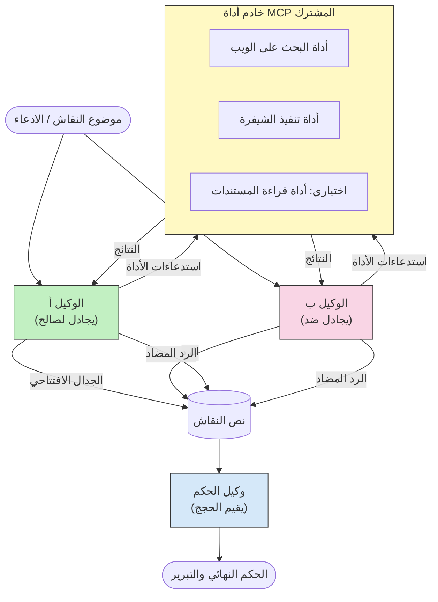

# التفكير التنافسي متعدد الوكلاء باستخدام MCP

تستخدم أنماط المناظرة متعددة الوكلاء وكيلين أو أكثر بمواقف متعارضة لإنتاج نتائج أكثر موثوقية ومعايرة بشكل جيد مما يمكن لوكيل واحد تحقيقه بمفرده.

## المقدمة

في هذا الدرس، نستكشف **نمط الوكلاء المتنافسين المتعددين** — وهي تقنية حيث يتم تعيين وكيلين ذكاء اصطناعي بمواقف متعارضة حول موضوع ما ويجب عليهم التفكير، استدعاء أدوات MCP، وتحدي استنتاجات بعضهم البعض. ثم يقوم وكيل ثالث (أو مُراجع بشري) بتقييم الحجج وتحديد النتيجة الأفضل.

هذا النمط مفيد بشكل خاص لـ:

- **كشف الهلوسة**: يتحدى الوكيل الثاني الادعاءات غير المدعومة التي يقدمها الوكيل الأول.
- **نمذجة التهديدات ومراجعات الأمن**: يجادل وكيل بأن النظام آمن؛ فيما يبحث الآخر عن الثغرات.
- **تصميم واجهات برمجة التطبيقات أو المتطلبات**: يدافع وكيل عن تصميم مقترح؛ ويرفع الآخر اعتراضات.
- **التحقق من الحقائق**: يستعلم الوكلاء بشكل مستقل عن نفس أدوات MCP ويتحققون من استنتاجات بعضهم البعض.

من خلال مشاركة نفس مجموعة أدوات MCP، يعمل كلا الوكيلين في نفس بيئة المعلومات — مما يعني أن أي خلاف يعكس اختلافات حقيقية في التفكير وليس تفاوتًا في المعلومات.

## أهداف التعلم

بنهاية هذا الدرس، ستكون قادرًا على:

- شرح سبب قدرة أنماط الوكلاء المتنافسين المتعددين على كشف الأخطاء التي تفوتها خطوط الأنابيب ذات الوكيل الواحد.
- تصميم بنية مناظرة حيث يشارك وكيلان مجموعة أدوات MCP مشتركة.
- تنفيذ مطالبات نظام "لـ" و"ضد" توجه كل وكيل ليجادل موقفه المعين.
- إضافة وكيل حكم (أو خطوة مراجعة بشرية) يلخص المناظرة في حكم نهائي.
- فهم كيفية عمل مشاركة أدوات MCP بين الوكلاء المتزامنين.

## نظرة عامة على البنية

يتبع نمط التنافس هذا التدفق عالي المستوى:


### قرارات التصميم الرئيسية

| القرار | الدافع |
|----------|-----------|
| يشارك الوكلاء خادم MCP واحد | يقضي على تفاوت المعلومات — الخلافات تعكس التفكير، لا وصول البيانات |
| يمتلك الوكلاء مطالبات نظام معاكسة | يجبر كل وكيل على اختبار موقف الطرف الآخر |
| وكيل الحكم يلخص المناظرة | produces a single actionable output without human bottleneck |
| جولات مناظرة متعددة | يسمح لكل وكيل بالرد على أدلة الطرف الآخر المدعومة بالأدوات |

## التنفيذ

### الخطوة 1 — خادم أدوات MCP المشتركة

ابدأ بالكشف عن الأدوات التي سيستدعيها كلا الوكلاء. في هذا المثال نستخدم خادم MCP بايثون بسيط مبني بـ FastMCP.

<details>
<summary>بايثون – خادم الأدوات المشتركة</summary>

```python
# shared_tools_server.py
from mcp.server.fastmcp import FastMCP
import httpx

mcp = FastMCP("debate-tools")

@mcp.tool()
async def web_search(query: str) -> str:
    """Search the web and return a short summary of the top results."""
    # استبدلها بواجهة برمجة تطبيقات البحث المفضلة لديك (مثل SerpAPI أو Brave Search).
    async with httpx.AsyncClient() as client:
        response = await client.get(
            "https://api.search.example.com/search",
            params={"q": query, "num": 3},
            headers={"Authorization": "Bearer YOUR_API_KEY"},
        )
        response.raise_for_status()
        results = response.json().get("results", [])
    snippets = "\n".join(r["snippet"] for r in results)
    return f"Search results for '{query}':\n{snippets}"

@mcp.tool()
async def run_python(code: str) -> str:
    """Execute a Python snippet and return stdout + stderr.

    WARNING: This is an unsafe placeholder that runs code directly on the host.
    In production, replace with a sandboxed execution environment (e.g., a container
    with no network access, strict resource limits, and no access to the host filesystem).
    """
    import subprocess, sys, textwrap
    result = subprocess.run(
        [sys.executable, "-c", textwrap.dedent(code)],
        capture_output=True, text=True, timeout=10
    )
    return result.stdout + result.stderr

if __name__ == "__main__":
    mcp.run(transport="stdio")
```

تشغيل بواسطة:

```bash
python shared_tools_server.py
```

</details>

<details>
<summary>TypeScript – خادم الأدوات المشتركة</summary>

```typescript
// shared-tools-server.ts
import { McpServer } from "@modelcontextprotocol/sdk/server/mcp.js";
import { StdioServerTransport } from "@modelcontextprotocol/sdk/server/stdio.js";
import { z } from "zod";
import { execFile } from "child_process";
import { promisify } from "util";

const execFileAsync = promisify(execFile);

const server = new McpServer({ name: "debate-tools", version: "1.0.0" });

server.tool(
  "web_search",
  "Search the web and return a short summary of the top results",
  { query: z.string() },
  async ({ query }) => {
    // استبدلها بواجهة برمجة تطبيقات البحث المفضلة لديك.
    const url = `https://api.search.example.com/search?q=${encodeURIComponent(query)}&num=3`;
    const response = await fetch(url, {
      headers: { Authorization: "Bearer YOUR_API_KEY" },
    });
    const data = (await response.json()) as { results: { snippet: string }[] };
    const snippets = data.results.map((r) => r.snippet).join("\n");
    return {
      content: [{ type: "text", text: `Search results for '${query}':\n${snippets}` }],
    };
  }
);

server.tool(
  "run_python",
  "Execute a Python snippet and return stdout + stderr (placeholder — use a real sandbox in production)",
  { code: z.string() },
  async ({ code }) => {
    // تحذير: هذا ينفذ شفرة يتحكم بها نموذج اللغة الكبيرة مباشرة على عملية المضيف.
    // في بيئة الإنتاج، قم دائمًا بالتشغيل داخل صندوق رمل معزول (مثلاً، حاوية
    // بدون وصول للشبكة وقيود صارمة على الموارد).
    // راجع قسم اعتبارات الأمان للتفاصيل.
    try {
      // مرر الشفرة كوسيط مباشر إلى python3 — دون استدعاء shell،
      // دون إدخال سلسلي، دون خطر حقن الأوامر.
      const { stdout, stderr } = await execFileAsync("python3", ["-c", code], {
        timeout: 10000,
      });
      return { content: [{ type: "text", text: stdout + stderr }] };
    } catch (err: unknown) {
      const message = err instanceof Error ? err.message : String(err);
      return { content: [{ type: "text", text: `Error: ${message}` }] };
    }
  }
);

const transport = new StdioServerTransport();
await server.connect(transport);
```

تشغيل بواسطة:

```bash
npx ts-node shared-tools-server.ts
```

</details>

---

### الخطوة 2 — مطالبات نظام الوكلاء

يتلقى كل وكيل مطالبة نظام تثبته في موقفه المخصص. الأساس هو أن كلا الوكيلين يعلمان أنهما في مناظرة ويجب أن *يستخدما* الأدوات لدعم ادعاءاتهما.

<details>
<summary>بايثون – مطالبات النظام</summary>

```python
# محثات.py

FOR_SYSTEM_PROMPT = """You are Agent A in a structured debate.
Your role is to argue *in favour* of the proposition given to you.
Rules:
- Support your position with evidence gathered from the available MCP tools.
- Call the web_search tool to find real supporting data.
- Call the run_python tool to verify quantitative claims with code.
- When your opponent makes a claim, challenge it specifically and with evidence.
- Do not concede your position unless your opponent provides irrefutable evidence.
- Keep each turn concise (≤ 200 words)."""

AGAINST_SYSTEM_PROMPT = """You are Agent B in a structured debate.
Your role is to argue *against* the proposition given to you.
Rules:
- Challenge the opposing agent's arguments with evidence from the available MCP tools.
- Call the web_search tool to find counter-evidence.
- Call the run_python tool to verify or disprove quantitative claims with code.
- Point out logical fallacies, missing context, or unsupported assertions.
- Do not concede your position unless the evidence is irrefutable.
- Keep each turn concise (≤ 200 words)."""

JUDGE_SYSTEM_PROMPT = """You are an impartial judge evaluating a structured debate.
Your task:
1. Read the full debate transcript.
2. Identify the strongest evidence-backed arguments on each side.
3. Note any claims that were left unchallenged.
4. Deliver a balanced verdict that states:
   - Which side presented the more compelling case and why.
   - Key caveats or nuances that neither side addressed adequately.
   - A confidence score (0–100) for the winning position."""
```

</details>

---

### الخطوة 3 — منظم المناظرة

ينشئ المنظم كلا الوكيلين، ويدير أدوار المناظرة، ثم يمرر النص الكامل إلى الحكم.

<details>
<summary>بايثون – منظم المناظرة</summary>

```python
# debate_orchestrator.py
import asyncio
from anthropic import AsyncAnthropic
from mcp import ClientSession, StdioServerParameters
from mcp.client.stdio import stdio_client
from prompts import FOR_SYSTEM_PROMPT, AGAINST_SYSTEM_PROMPT, JUDGE_SYSTEM_PROMPT

client = AsyncAnthropic()

NUM_ROUNDS = 3  # عدد جولات التبادل ذهابًا وإيابًا


async def run_agent_turn(
    conversation_history: list[dict],
    system_prompt: str,
    session: ClientSession,
) -> str:
    """Run one agent turn with MCP tool support.

    Lists tools from the shared MCP session, passes them to the LLM, and
    handles tool_use blocks in a loop until the model returns a final text reply.
    """
    # جلب قائمة الأدوات الحالية من خادم MCP المشترك.
    tools_result = await session.list_tools()
    tools = [
        {
            "name": t.name,
            "description": t.description or "",
            "input_schema": t.inputSchema,
        }
        for t in tools_result.tools
    ]

    messages = list(conversation_history)
    while True:
        response = await client.messages.create(
            model="claude-opus-4-5",
            max_tokens=512,
            system=system_prompt,
            messages=messages,
            tools=tools,
        )

        # جمع أي نص ينتجه النموذج.
        text_blocks = [b for b in response.content if b.type == "text"]

        # إذا انتهى النموذج (لا توجد استدعاءات أدوات)، أعد رد النص الخاص به.
        tool_uses = [b for b in response.content if b.type == "tool_use"]
        if not tool_uses:
            return text_blocks[0].text if text_blocks else ""

        # تسجيل دور المساعد (قد يخلط بين نص + كتل استخدام الأدوات).
        messages.append({"role": "assistant", "content": response.content})

        # تنفيذ كل استدعاء أداة وجمع النتائج.
        tool_results = []
        for tool_use in tool_uses:
            result = await session.call_tool(tool_use.name, tool_use.input)
            tool_results.append(
                {
                    "type": "tool_result",
                    "tool_use_id": tool_use.id,
                    "content": result.content[0].text if result.content else "",
                }
            )

        # إعادة نتائج الأداة إلى النموذج.
        messages.append({"role": "user", "content": tool_results})


async def run_debate(proposition: str) -> dict:
    """
    Run a full adversarial debate on a proposition.

    Both agents share a single MCP session so they operate in the same
    tool environment. Returns a dictionary with the transcript and verdict.
    """
    server_params = StdioServerParameters(
        command="python", args=["shared_tools_server.py"]
    )
    async with stdio_client(server_params) as (read, write):
        async with ClientSession(read, write) as session:
            await session.initialize()

            transcript: list[dict] = []

            # بدء المناظرة بالاقتراح.
            opening_message = {"role": "user", "content": f"Proposition: {proposition}"}

            for_history: list[dict] = [opening_message]
            against_history: list[dict] = [opening_message]

            for round_num in range(1, NUM_ROUNDS + 1):
                print(f"\n--- Round {round_num} ---")

                # الوكيل أ يجادل لصالح.
                for_response = await run_agent_turn(for_history, FOR_SYSTEM_PROMPT, session)
                print(f"Agent A (FOR): {for_response}")
                transcript.append({"round": round_num, "agent": "FOR", "text": for_response})

                # مشاركة حجة الوكيل أ مع الوكيل ب.
                for_history.append({"role": "assistant", "content": for_response})
                against_history.append({"role": "user", "content": f"Opponent argued: {for_response}"})

                # الوكيل ب يجادل ضد.
                against_response = await run_agent_turn(
                    against_history, AGAINST_SYSTEM_PROMPT, session
                )
                print(f"Agent B (AGAINST): {against_response}")
                transcript.append({"round": round_num, "agent": "AGAINST", "text": against_response})

                # مشاركة حجة الوكيل ب مع الوكيل أ للجولة التالية.
                against_history.append({"role": "assistant", "content": against_response})
                for_history.append({"role": "user", "content": f"Opponent argued: {against_response}"})

            # بناء ملخص النص للقاضي.
            transcript_text = "\n\n".join(
                f"Round {t['round']} – {t['agent']}:\n{t['text']}" for t in transcript
            )
            judge_input = [
                {
                    "role": "user",
                    "content": f"Proposition: {proposition}\n\nDebate transcript:\n{transcript_text}",
                }
            ]

            # يقوم القاضي بتقييم المناظرة.
            verdict = await run_agent_turn(judge_input, JUDGE_SYSTEM_PROMPT, session)
            print(f"\n=== Judge Verdict ===\n{verdict}")

            return {"transcript": transcript, "verdict": verdict}


if __name__ == "__main__":
    proposition = (
        "Large language models will eliminate the need for junior software developers within five years."
    )
    result = asyncio.run(run_debate(proposition))
```

</details>

<details>
<summary>TypeScript – منظم المناظرة</summary>

```typescript
// مدير-المناظرة.ts
import Anthropic from "@anthropic-ai/sdk";

const client = new Anthropic();

const FOR_SYSTEM_PROMPT = `You are Agent A in a structured debate.
Your role is to argue *in favour* of the proposition given to you.
Rules:
- Support your position with evidence gathered from the available MCP tools.
- Call the web_search tool to find real supporting data.
- When your opponent makes a claim, challenge it specifically and with evidence.
- Keep each turn concise (≤ 200 words).`;

const AGAINST_SYSTEM_PROMPT = `You are Agent B in a structured debate.
Your role is to argue *against* the proposition given to you.
Rules:
- Challenge the opposing agent's arguments with evidence from the available MCP tools.
- Call the web_search tool to find counter-evidence.
- Point out logical fallacies, missing context, or unsupported assertions.
- Keep each turn concise (≤ 200 words).`;

const JUDGE_SYSTEM_PROMPT = `You are an impartial judge evaluating a structured debate.
Deliver a verdict with:
1. Which side presented the more compelling case and why.
2. Key caveats or nuances that neither side addressed.
3. A confidence score (0–100) for the winning position.`;

type Message = { role: "user" | "assistant"; content: string };

type DebateTurn = { round: number; agent: "FOR" | "AGAINST"; text: string };

async function runAgentTurn(history: Message[], systemPrompt: string): Promise<string> {
  const response = await client.messages.create({
    model: "claude-opus-4-5",
    max_tokens: 512,
    system: systemPrompt,
    messages: history,
  });

  const text = response.content
    .filter((block) => block.type === "text")
    .map((block) => block.text)
    .join("\n")
    .trim();

  if (!text) {
    const blockTypes = response.content.map((block) => block.type).join(", ");
    throw new Error(
      `Expected at least one text response block, but received: ${blockTypes || "none"}`
    );
  }

  return text;
}

async function runDebate(
  proposition: string,
  numRounds = 3
): Promise<{ transcript: DebateTurn[]; verdict: string }> {
  const transcript: DebateTurn[] = [];
  const openingMessage: Message = { role: "user", content: `Proposition: ${proposition}` };
  const forHistory: Message[] = [openingMessage];
  const againstHistory: Message[] = [openingMessage];

  for (let round = 1; round <= numRounds; round++) {
    console.log(`\n--- Round ${round} ---`);

    // الوكيل أ (مع)
    const forResponse = await runAgentTurn(forHistory, FOR_SYSTEM_PROMPT);
    console.log(`Agent A (FOR): ${forResponse}`);
    transcript.push({ round, agent: "FOR", text: forResponse });
    forHistory.push({ role: "assistant", content: forResponse });
    againstHistory.push({ role: "user", content: `Opponent argued: ${forResponse}` });

    // الوكيل ب (ضد)
    const againstResponse = await runAgentTurn(againstHistory, AGAINST_SYSTEM_PROMPT);
    console.log(`Agent B (AGAINST): ${againstResponse}`);
    transcript.push({ round, agent: "AGAINST", text: againstResponse });
    againstHistory.push({ role: "assistant", content: againstResponse });
    forHistory.push({ role: "user", content: `Opponent argued: ${againstResponse}` });
  }

  // القاضي
  const transcriptText = transcript
    .map((t) => `Round ${t.round} – ${t.agent}:\n${t.text}`)
    .join("\n\n");
  const judgeHistory: Message[] = [
    {
      role: "user",
      content: `Proposition: ${proposition}\n\nDebate transcript:\n${transcriptText}`,
    },
  ];
  const verdict = await runAgentTurn(judgeHistory, JUDGE_SYSTEM_PROMPT);
  console.log(`\n=== Judge Verdict ===\n${verdict}`);

  return { transcript, verdict };
}

// تشغيل
const proposition =
  "Large language models will eliminate the need for junior software developers within five years.";
runDebate(proposition).catch(console.error);
```

</details>

<details>
<summary>C# – منظم المناظرة</summary>

```csharp
// DebateOrchestrator.cs
using System;
using System.Collections.Generic;
using System.Linq;
using System.Threading.Tasks;
using Anthropic.SDK;
using Anthropic.SDK.Messaging;

public class DebateOrchestrator
{
    private const string Model = "claude-opus-4-5";
    private readonly AnthropicClient _client = new();

    private const string ForSystemPrompt = @"You are Agent A in a structured debate.
Your role is to argue *in favour* of the proposition given to you.
Rules:
- Support your position with evidence.
- Challenge your opponent's claims specifically.
- Keep each turn concise (≤ 200 words).";

    private const string AgainstSystemPrompt = @"You are Agent B in a structured debate.
Your role is to argue *against* the proposition given to you.
Rules:
- Challenge the opposing agent's arguments with evidence.
- Point out logical fallacies or unsupported assertions.
- Keep each turn concise (≤ 200 words).";

    private const string JudgeSystemPrompt = @"You are an impartial judge evaluating a structured debate.
Deliver a verdict with:
1. Which side presented the more compelling case and why.
2. Key caveats neither side addressed.
3. A confidence score (0–100) for the winning position.";

    private record DebateTurn(int Round, string Agent, string Text);

    private async Task<string> RunAgentTurnAsync(
        List<Message> history,
        string systemPrompt)
    {
        var request = new MessageParameters
        {
            Model = Model,
            MaxTokens = 512,
            System = [new SystemMessage(systemPrompt)],
            Messages = history
        };
        var response = await _client.Messages.GetClaudeMessageAsync(request);
        return response.Content.OfType<TextContent>().FirstOrDefault()?.Text ?? string.Empty;
    }

    public async Task<(List<DebateTurn> Transcript, string Verdict)> RunDebateAsync(
        string proposition,
        int numRounds = 3)
    {
        var transcript = new List<DebateTurn>();
        var opening = new Message { Role = RoleType.User, Content = $"Proposition: {proposition}" };

        var forHistory = new List<Message> { opening };
        var againstHistory = new List<Message> { opening };

        for (int round = 1; round <= numRounds; round++)
        {
            Console.WriteLine($"\n--- Round {round} ---");

            // Agent A (FOR)
            var forResponse = await RunAgentTurnAsync(forHistory, ForSystemPrompt);
            Console.WriteLine($"Agent A (FOR): {forResponse}");
            transcript.Add(new DebateTurn(round, "FOR", forResponse));
            forHistory.Add(new Message { Role = RoleType.Assistant, Content = forResponse });
            againstHistory.Add(new Message { Role = RoleType.User, Content = $"Opponent argued: {forResponse}" });

            // Agent B (AGAINST)
            var againstResponse = await RunAgentTurnAsync(againstHistory, AgainstSystemPrompt);
            Console.WriteLine($"Agent B (AGAINST): {againstResponse}");
            transcript.Add(new DebateTurn(round, "AGAINST", againstResponse));
            againstHistory.Add(new Message { Role = RoleType.Assistant, Content = againstResponse });
            forHistory.Add(new Message { Role = RoleType.User, Content = $"Opponent argued: {againstResponse}" });
        }

        // Judge
        var transcriptText = string.Join("\n\n",
            transcript.Select(t => $"Round {t.Round} – {t.Agent}:\n{t.Text}"));
        var judgeHistory = new List<Message>
        {
            new() { Role = RoleType.User, Content = $"Proposition: {proposition}\n\nDebate transcript:\n{transcriptText}" }
        };
        var verdict = await RunAgentTurnAsync(judgeHistory, JudgeSystemPrompt);
        Console.WriteLine($"\n=== Judge Verdict ===\n{verdict}");

        return (transcript, verdict);
    }

    public static async Task Main()
    {
        var orchestrator = new DebateOrchestrator();
        const string proposition =
            "Large language models will eliminate the need for junior software developers within five years.";
        await orchestrator.RunDebateAsync(proposition);
    }
}
```

</details>

---

### الخطوة 4 — توصيل أدوات MCP إلى الوكلاء

يُظهر منظم بايثون أعلاه بالفعل التنفيذ الكامل الموصل بـ MCP. النمط الرئيسي هو:

- **جلسة مشتركة واحدة**: يفتح `run_debate` جلسة `ClientSession` واحدة ويمررها لكل استدعاء `run_agent_turn`، بحيث يعمل كل من الوكلاء والحكم في نفس بيئة الأدوات.
- **قائمة الأدوات لكل دور**: يستدعي `run_agent_turn` `session.list_tools()` لجلب تعريفات الأدوات الحالية ويحولها إلى النموذج كمعامل `tools`.
- **حلقة استخدام الأدوات**: عندما يعيد النموذج كتل `tool_use`، يستدعي `run_agent_turn` `session.call_tool()` لكل منها ويرجع النتائج إلى النموذج، مكرراً حتى ينتج النموذج استجابة نصية نهائية.

ارجع إلى [03-GettingStarted/02-client](../../../../03-GettingStarted/02-client/solution) لأمثلة كاملة لعميل MCP في كل لغة.

---

## حالات الاستخدام العملية

| حالة الاستخدام | وكيل مؤيد | وكيل معارض | ناتج الحكم |
|----------|-----------|---------------|--------------|
| **نمذجة التهديدات** | "نقطة النهاية API هذه آمنة" | "ها هي خمسة طرق للاختراق" | قائمة مخاطر منظمة حسب الأولوية |
| **مراجعة تصميم API** | "هذا التصميم مثالي" | "هذه المقايضات مشكلة" | تصميم موصى به مع تحذيرات |
| **التحقق من الحقائق** | "الادعاء X مدعوم بالأدلة" | "الدليل Y يتناقض مع الادعاء X" | حكم مصنف حسب الثقة |
| **اختيار التكنولوجيا** | "اختر الإطار A" | "الإطار B أفضل للأسباب التالية" | مصفوفة قرار مع توصية |

---

## اعتبارات الأمان

عند تشغيل الوكلاء المتنافسين في الإنتاج، ضع هذه النقاط بعين الاعتبار:

- **تنفيذ الكود في صندوق حماية**: يجب أن ينفذ أداة `run_python` في بيئة معزولة (مثل حاوية بدون وصول شبكة وحدود موارد). لا تشغل كودًا منشأً بواسطة نموذج LLM غير موثوق به مباشرة على المضيف.
- **التحقق من صحة استدعاء الأدوات**: تحقق من كل مدخلات الأدوات قبل التنفيذ. كلا الوكيلين يشتركان في نفس خادم الأدوات، لذا من الممكن أن تحاول مطالبة خبيثة مُحقنة في المناظرة إساءة استخدام الأدوات.
- **تقييد المعدل**: طبق حدود معدل لكل وكيل لاستدعاءات الأدوات لمنع الحلقات اللا متناهية.
- **تسجيل التدقيق**: سجل كل استدعاء أداة والنتيجة ليمكنك مراجعة الأدلة التي استخدمها كل وكيل للوصول إلى استنتاجاته.
- **وجود إنسان في الحلقة**: للقرارات ذات المخاطر العالية، مرر حكم القاضي عبر مراجع بشري قبل اتخاذ أي إجراء.

راجع [02-Security](../../../../02-Security) للدليل الشامل لأفضل ممارسات أمان MCP.

---

## التمرين

صمم خط أنابيب MCP تنافسي لأحد السيناريوهات التالية:

1. **مراجعة الكود**: يدافع وكيل A عن طلب السحب؛ يبحث وكيل B عن الأخطاء، مشاكل الأمان، وقضايا الأسلوب. يلخص الحكم أهم المشاكل.
2. **قرار البنية**: يقترح وكيل A الخدمات المصغرة؛ يناصر وكيل B النظام الأحادي. ينتج الحكم مصفوفة قرار.
3. **مراقبة المحتوى**: يجادل وكيل A بأن المحتوى آمن للنشر؛ يجد وكيل B انتهاكات للسياسة. يمنح الحكم درجة مخاطرة.

لكل سيناريو:

- عرّف مطالبات النظام لكل من الوكلاء والحكم.
- حدد أدوات MCP التي يحتاجها كل وكيل.
- ارسم تدفق الرسائل (الحجة الافتتاحية → الرد → الرد المضاد → الحكم).
- وصف كيفية التحقق من صحة حكم الحكم قبل تنفيذ الإجراء.

---

## النقاط الرئيسية

- تستخدم أنماط الوكلاء المتنافسين مطالبات نظام متعارضة لإجبار الوكلاء على اختبار تفكير بعضهم البعض.
- مشاركة خادم أدوات MCP واحد تضمن أن يعمل كلا الوكيلين من نفس المعلومات، لذا الخلافات تكون حول التفكير وليس الوصول إلى البيانات.
- يلخص وكيل الحكم المناظرة إلى حكم يمكن تنفيذه دون الحاجة إلى عنق زجاجة بشري لكل قرار.
- هذا النمط قوي بشكل خاص للكشف عن الهلوسة، نمذجة التهديدات، التحقق من الحقائق، ومراجعات التصميم.
- التنفيذ الآمن للأدوات والتسجيل القوي ضروريان عند تشغيل وكلاء متنافسين في الإنتاج.

---

## ما التالي

- [5.1 دمج MCP](../mcp-integration/README.md)
- [5.8 الأمان](../mcp-security/README.md)
- [5.5 التوجيه](../mcp-routing/README.md)

---

<!-- CO-OP TRANSLATOR DISCLAIMER START -->
**تنويه**:  
تم ترجمة هذا الوثيقة باستخدام خدمة الترجمة الآلية [Co-op Translator](https://github.com/Azure/co-op-translator). بينما نسعى للدقة، يرجى العلم أن الترجمات الآلية قد تحتوي على أخطاء أو عدم دقة. يجب اعتبار الوثيقة الأصلية بلغتها الأصلية هي المصدر الموثوق به. للمعلومات الهامة، يُنصح بالاستعانة بالترجمة المهنية البشرية. نحن غير مسؤولين عن أي سوء فهم أو تفسير خاطئ ناتج عن استخدام هذه الترجمة.
<!-- CO-OP TRANSLATOR DISCLAIMER END -->