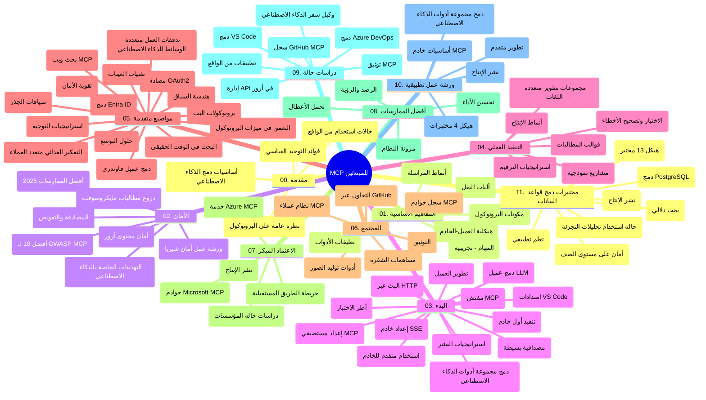

# بروتوكول سياق النموذج (MCP) للمبتدئين - دليل الدراسة

يوفر هذا الدليل الدراسي نظرة عامة على هيكل المحتوى ومستودع "بروتوكول سياق النموذج (MCP) للمبتدئين". استخدم هذا الدليل للتنقل في المستودع بكفاءة والاستفادة القصوى من الموارد المتاحة.

## نظرة عامة على المستودع

بروتوكول سياق النموذج (MCP) هو إطار عمل موحد للتفاعلات بين نماذج الذكاء الاصطناعي وتطبيقات العملاء. تم إنشاؤه في الأصل بواسطة Anthropic، ويُدار الآن من قبل مجتمع MCP الأوسع من خلال المنظمة الرسمية على GitHub. يقدم هذا المستودع منهجًا شاملاً مع أمثلة عملية على الشيفرة بـ C# و Java و JavaScript و Python و TypeScript، مصممًا لمطوري الذكاء الاصطناعي، ومهندسي الأنظمة، ومهندسي البرمجيات.

## خريطة منهج الدراسة البصرية

## هيكل المستودع

تم تنظيم المستودع في أحد عشر قسمًا رئيسيًا، كل منها يركز على جوانب مختلفة من MCP:

1. **المقدمة (00-Introduction/)**
   - نظرة عامة على بروتوكول سياق النموذج
   - لماذا يعتبر التوحيد مهمًا في مسارات الذكاء الاصطناعي
   - حالات استخدام عملية وفوائد

2. **المفاهيم الأساسية (01-CoreConcepts/)**
   - هيكلية العميل-الخادم
   - مكونات البروتوكول الرئيسية
   - أنماط الرسائل في MCP

3. **الأمن (02-Security/)**
   - التهديدات الأمنية في أنظمة تعتمد على MCP
   - أفضل الممارسات لتأمين التنفيذات
   - استراتيجيات المصادقة والتفويض
   - **توثيق أمني شامل**:
     - أفضل ممارسات أمان MCP لعام 2025
     - دليل تنفيذ أمان محتوى Azure
     - ضوابط وتقنيات أمان MCP
     - مرجع سريع لأفضل ممارسات MCP
   - **مواضيع أمنية رئيسية**:
     - هجمات حقن الأوامر وتسريب الأدوات
     - اختطاف الجلسة ومشاكل الوكيل المرتبك
     - ثغرات تمرير الرموز الأمنية
     - الأذونات المفرطة وضوابط الوصول
     - أمن سلسلة التوريد لمكونات الذكاء الاصطناعي
     - دمج Microsoft Prompt Shields

4. **البدء (03-GettingStarted/)**
   - إعداد البيئة والتكوين
   - إنشاء خوادم وعملاء MCP أساسيين
   - التكامل مع التطبيقات الموجودة
   - يشمل أجزاء لـ:
     - تنفيذ أول خادم
     - تطوير العميل
     - دمج عميل LLM
     - دمج مع VS Code
     - خادم الأحداث المرسلة (SSE)
     - استخدام الخادم المتقدم
     - البث عبر HTTP
     - دمج أدوات AI Toolkit
     - استراتيجيات الاختبار
     - إرشادات النشر

5. **التنفيذ العملي (04-PracticalImplementation/)**
   - استخدام SDKs عبر لغات برمجة مختلفة
   - تقنيات تصحيح الأخطاء والاختبار والتحقق
   - صياغة قوالب الأوامر وقوائم العمل القابلة لإعادة الاستخدام
   - مشاريع نموذجية مع أمثلة تنفيذ

6. **الموضوعات المتقدمة (05-AdvancedTopics/)**
   - تقنيات هندسة السياق
   - دمج عامل Foundry
   - تدفقات عمل الذكاء الاصطناعي متعددة الوسائط
   - عروض توضيحية لمصادقة OAuth2
   - إمكانيات البحث في الوقت الحقيقي
   - البث في الوقت الحقيقي
   - تنفيذ سياقات الجذر
   - استراتيجيات التوجيه
   - تقنيات العينات
   - أساليب التوسع
   - اعتبارات أمنية
   - دمج أمان Entra ID
   - دمج البحث على الويب
   - الاستدلال العدائي متعدد الوكلاء (أنماط النقاش)

7. **مساهمات المجتمع (06-CommunityContributions/)**
   - كيفية المساهمة بالكود والتوثيق
   - التعاون عبر GitHub
   - تحسينات مدفوعة من المجتمع وردود الفعل
   - استخدام عملاء MCP المتنوعين (Claude Desktop, Cline, VSCode)
   - العمل مع خوادم MCP شعبية بما في ذلك إنشاء الصور

8. **دروس من التبني المبكر (07-LessonsfromEarlyAdoption/)**
   - تنفيذات وقصص نجاح من العالم الحقيقي
   - بناء ونشر حلول تعتمد على MCP
   - الاتجاهات وخارطة الطريق المستقبلية
   - **دليل خوادم MCP من مايكروسوفت**: دليل شامل لـ 10 خوادم MCP جاهزة للإنتاج من مايكروسوفت تشمل:
     - خادم Microsoft Learn Docs MCP
     - خادم Azure MCP (أكثر من 15 موصلًا متخصصًا)
     - خادم GitHub MCP
     - خادم Azure DevOps MCP
     - خادم MarkItDown MCP
     - خادم SQL Server MCP
     - خادم Playwright MCP
     - خادم Dev Box MCP
     - خادم Azure AI Foundry MCP
     - خادم Microsoft 365 Agents Toolkit MCP

9. **أفضل الممارسات (08-BestPractices/)**
   - ضبط وتحسين الأداء
   - تصميم أنظمة MCP مقاومة للأخطاء
   - استراتيجيات الاختبار والمرونة

10. **دراسات حالة (09-CaseStudy/)**
    - **سبع دراسات حالة شاملة** تظهر تنوع MCP عبر سيناريوهات مختلفة:
    - **وكلاء السفر باستخدام Azure AI**: تنظيم متعدد العملاء مع Azure OpenAI و AI Search
    - **تكامل Azure DevOps**: أتمتة عمليات سير العمل مع تحديثات بيانات YouTube
    - **استرجاع الوثائق في الوقت الحقيقي**: عميل Python على وحدة التحكم مع بث HTTP
    - **مولد خطة دراسة تفاعلية**: تطبيق ويب Chainlit مع ذكاء اصطناعي محادثي
    - **توثيق داخل المحرر**: دمج VS Code مع سير عمل GitHub Copilot
    - **إدارة API لـ Azure**: دمج API المؤسسي مع إنشاء خادم MCP
    - **سجل GitHub MCP**: تطوير النظام البيئي ومنصة دمج وكلائية
    - أمثلة تنفيذ تشمل التكامل المؤسسي، إنتاجية المطور، وتطوير النظام البيئي

11. **ورشة عمل تطبيقية (10-StreamliningAIWorkflowsBuildingAnMCPServerWithAIToolkit/)**
    - ورشة عمل شاملة تجمع MCP مع AI Toolkit
    - بناء تطبيقات ذكية تجمع بين نماذج الذكاء الاصطناعي والأدوات الواقعية
    - وحدات عملية تغطي الأساسيات، تطوير الخادم المخصص، واستراتيجيات النشر للإنتاج
    - **هيكل المختبر**:
      - المختبر 1: أساسيات خادم MCP
      - المختبر 2: تطوير خادم MCP المتقدم
      - المختبر 3: دمج AI Toolkit
      - المختبر 4: النشر والتوسع للإنتاج
    - نهج التعلم المعتمد على المختبر مع تعليمات خطوة بخطوة

12. **مختبرات دمج قواعد بيانات MCP Server (11-MCPServerHandsOnLabs/)**
    - **مسار تعلم شامل من 13 مختبرًا** لبناء خوادم MCP جاهزة للإنتاج مع دمج PostgreSQL
    - **تنفيذ تحليلات البيع بالتجزئة الواقعية** باستخدام حالة استخدام Zava Retail
    - **أنماط المؤسسات** تشمل أمان مستوى الصف (RLS)، البحث الدلالي، والوصول متعدد المستأجرين للبيانات
    - **هيكل المختبر الكامل**:
      - **المختبرات 00-03: الأساسيات** - مقدمة، الهيكلية، الأمان، إعداد البيئة
      - **المختبرات 04-06: بناء خادم MCP** - تصميم قاعدة البيانات، تنفيذ الخادم، تطوير الأدوات
      - **المختبرات 07-09: الميزات المتقدمة** - البحث الدلالي، الاختبار وتصحيح الأخطاء، التكامل مع VS Code
      - **المختبرات 10-12: الإنتاج وأفضل الممارسات** - النشر، المراقبة، التحسين
    - **التقنيات المغطاة**: إطار FastMCP، PostgreSQL، Azure OpenAI، تطبيقات الحاويات Azure، Application Insights
    - **نتائج التعلم**: خوادم MCP جاهزة للإنتاج، أنماط دمج قواعد البيانات، تحليلات مدعومة بالذكاء الاصطناعي، أمان المؤسسات

## موارد إضافية

يتضمن المستودع موارد داعمة:

- **مجلد الصور**: يحتوي على الرسوم التوضيحية المستخدمة في كافة أجزاء المنهج
- **الترجمات**: دعم متعدد اللغات مع ترجمات مؤتمتة للتوثيق
- **موارد MCP الرسمية**:
  - [توثيق MCP](https://modelcontextprotocol.io/)
  - [مواصفات MCP](https://spec.modelcontextprotocol.io/)
  - [مستودع MCP على GitHub](https://github.com/modelcontextprotocol)

## كيفية استخدام هذا المستودع

1. **التعلم التسلسلي**: اتبع الفصول بالترتيب (من 00 إلى 11) لتجربة تعلم منظمة.
2. **التركيز على لغة معينة**: إذا كنت مهتمًا بلغة برمجة معينة، استكشف مجلدات العينات لتنفيذات بلغتك المفضلة.
3. **التنفيذ العملي**: ابدأ بقسم "البدء" لإعداد بيئتك وإنشاء أول خادم وعميل MCP.
4. **الاستكشاف المتقدم**: بمجرد أن تتقن الأساسيات، اغمر نفسك في الموضوعات المتقدمة لتوسيع معارفك.
5. **المشاركة المجتمعية**: انضم إلى مجتمع MCP عبر مناقشات GitHub وقنوات Discord للتواصل مع الخبراء والمطورين الآخرين.

## عملاء وأدوات MCP

يغطي المنهج عملاء وأدوات MCP المتنوعة:

1. **العملاء الرسميون**:
   - Visual Studio Code
   - MCP في Visual Studio Code
   - Claude Desktop
   - Claude في VSCode
   - Claude API

2. **عملاء المجتمع**:
   - Cline (قائم على الطرفية)
   - Cursor (محرر الشيفرة)
   - ChatMCP
   - Windsurf

3. **أدوات إدارة MCP**:
   - MCP CLI
   - MCP Manager
   - MCP Linker
   - MCP Router

## خوادم MCP الشهيرة

يقدم المستودع خوادم MCP متنوعة، منها:

1. **خوادم MCP الرسمية من مايكروسوفت**:
   - خادم Microsoft Learn Docs MCP
   - خادم Azure MCP (أكثر من 15 موصلًا متخصصًا)
   - خادم GitHub MCP
   - خادم Azure DevOps MCP
   - خادم MarkItDown MCP
   - خادم SQL Server MCP
   - خادم Playwright MCP
   - خادم Dev Box MCP
   - خادم Azure AI Foundry MCP
   - خادم Microsoft 365 Agents Toolkit MCP

2. **الخوادم المرجعية الرسمية**:
   - نظام الملفات
   - Fetch
   - الذاكرة
   - التفكير المتسلسل

3. **إنشاء الصور**:
   - Azure OpenAI DALL-E 3
   - Stable Diffusion WebUI
   - Replicate

4. **أدوات التطوير**:
   - Git MCP
   - التحكم عبر الطرفية
   - مساعد الشيفرة

5. **خوادم متخصصة**:
   - Salesforce
   - Microsoft Teams
   - Jira & Confluence

## المساهمة

يرحب هذا المستودع بالمساهمات من المجتمع. راجع قسم مساهمات المجتمع للحصول على إرشادات حول كيفية المساهمة بفاعلية في نظام MCP البيئي.

----

*تم تحديث هذا الدليل الدراسي آخر مرة في 5 فبراير 2026، ويعكس أحدث مواصفات MCP بتاريخ 2025-11-25 ويوفر نظرة عامة على المستودع حتى ذلك التاريخ. قد يتم تحديث محتويات المستودع بعد هذا التاريخ.*

---

<!-- CO-OP TRANSLATOR DISCLAIMER START -->
**إخلاء المسؤولية**:  
تمت ترجمة هذا المستند باستخدام خدمة الترجمة بالذكاء الاصطناعي [Co-op Translator](https://github.com/Azure/co-op-translator). بينما نسعى لتحقيق الدقة، يُرجى العلم بأن الترجمات الآلية قد تحتوي على أخطاء أو عدم دقة. يجب اعتبار المستند الأصلي بلغته الأصلية المصدر الموثوق. للمعلومات الحساسة، يُنصح بالاعتماد على الترجمة البشرية المحترفة. نحن غير مسؤولين عن أي سوء فهم أو تفسير خاطئ ينشأ عن استخدام هذه الترجمة.
<!-- CO-OP TRANSLATOR DISCLAIMER END -->