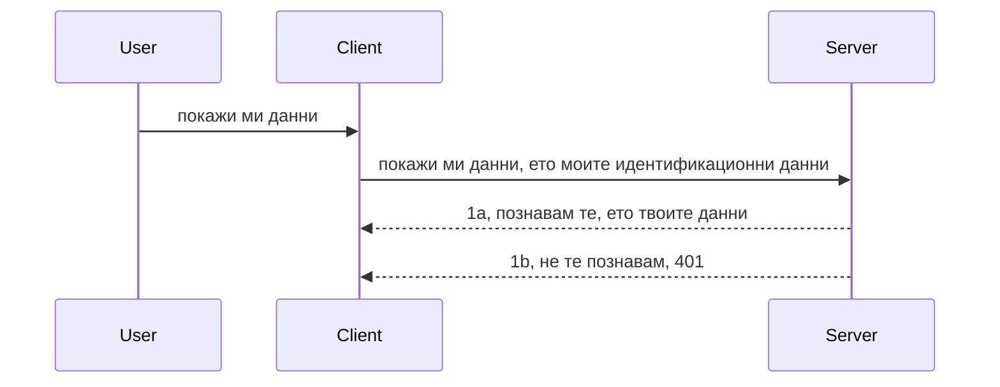

# Просто удостоверяване

MCP SDK-та поддържат използването на OAuth 2.1, което, честно казано, е доста сложен процес, включващ концепции като сървър за удостоверяване, сървър за ресурси, изпращане на идентификационни данни, получаване на код, разменяне на кода за токен за достъп, докато накрая можете да получите данните на ресурса си. Ако не сте свикнали с OAuth, което е страхотно нещо за внедряване, е добра идея да започнете с някакво базово ниво на удостоверяване и да надграждате към все по-добра сигурност. Затова съществува тази глава – да ви изгради за по-напреднало удостоверяване.

## Удостоверяване, какво имаме предвид?

Удостоверяването е съкращение от authentication и authorization. Идеята е, че трябва да направим две неща:

- **Authentication (удостоверяване)**, което е процесът на установяване дали позволяваме на даден човек да влезе в нашата къща, че има право да бъде "тук", т.е. да има достъп до нашия сървър за ресурси, където живеят функциите на нашия MCP сървър.
- **Authorization (упълномощаване)**, е процесът на определяне дали потребителят трябва да има достъп до тези конкретни ресурси, които иска, например тези поръчки или тези продукти, или дали му е разрешено да чете съдържанието, но не и да изтрива, като друг пример.

## Идентификационни данни: как казваме на системата кой сме ние

Повечето уеб разработчици започват да мислят в термини на предоставяне на идентификатор на сървъра, обикновено тайна, която казва дали им е разрешено да бъдат тук ("Authentication"). Тази идентификационна информация обикновено е base64 кодирана версия на потребителско име и парола или API ключ, който уникално идентифицира конкретен потребител.

Това включва изпращането ѝ чрез хедър, наречен "Authorization", по следния начин:

```json
{ "Authorization": "secret123" }
```

Обикновено това се нарича basic authentication. Как работи общият поток е по следния начин:


Сега, след като разбираме как работи от гледна точка на поток, как го внедряваме? Повечето уеб сървъри имат концепция, наречена middleware, част код, който се изпълнява като част от заявката и може да провери идентификационните данни и ако са валидни, позволи заявката да премине. Ако заявката няма валидни идентификационни данни, получавате грешка за удостоверяване. Нека видим как може да се реализира това:

**Python**

```python
class AuthMiddleware(BaseHTTPMiddleware):
    async def dispatch(self, request, call_next):

        has_header = request.headers.get("Authorization")
        if not has_header:
            print("-> Missing Authorization header!")
            return Response(status_code=401, content="Unauthorized")

        if not valid_token(has_header):
            print("-> Invalid token!")
            return Response(status_code=403, content="Forbidden")

        print("Valid token, proceeding...")
       
        response = await call_next(request)
        # добавете всякакви потребителски заглавки или направете някаква промяна в отговора
        return response


starlette_app.add_middleware(CustomHeaderMiddleware)
```

Тук имаме:

- Създаден middleware, наречен `AuthMiddleware`, чиито метод `dispatch` се извиква от уеб сървъра.
- Добавен middleware към уеб сървъра:

    ```python
    starlette_app.add_middleware(AuthMiddleware)
    ```

- Написана логика за валидиране, която проверява дали хедърът Authorization е наличен и дали изпратената тайна е валидна:

    ```python
    has_header = request.headers.get("Authorization")
    if not has_header:
        print("-> Missing Authorization header!")
        return Response(status_code=401, content="Unauthorized")

    if not valid_token(has_header):
        print("-> Invalid token!")
        return Response(status_code=403, content="Forbidden")
    ```

    ако тайната е налична и валидна, позволява заявката да премине чрез извикване на `call_next` и връща отговора.

    ```python
    response = await call_next(request)
    # добавете всякакви клиентски заглавки или променете по някакъв начин отговора
    return response
    ```

Как работи: ако бъде направена уеб заявка към сървъра, middleware-ът ще бъде извикан и според имплементацията си ще позволи заявката да премине или ще върне грешка, която указва, че клиентът не е позволен да продължи.

**TypeScript**

Тук създаваме middleware с популярния framework Express и прихващаме заявката преди да достигне MCP сървъра. Ето кода:

```typescript
function isValid(secret) {
    return secret === "secret123";
}

app.use((req, res, next) => {
    // 1. Присъства ли Authorization хедър?
    if(!req.headers["Authorization"]) {
        res.status(401).send('Unauthorized');
    }
    
    let token = req.headers["Authorization"];

    // 2. Проверка на валидността.
    if(!isValid(token)) {
        res.status(403).send('Forbidden');
    }

   
    console.log('Middleware executed');
    // 3. Предава заявката на следващата стъпка в процеса на заявката.
    next();
});
```

В този код:

1. Проверяваме дали хедърът Authorization действително присъства, ако не, връщаме грешка 401.
2. Уверяваме се, че идентификационната информация/токенът е валиден, ако не, връщаме грешка 403.
3. Накрая пропускаме заявката по веригата и връщаме поискания ресурс.

## Упражнение: Реализирайте удостоверяване

Нека приложим знанията си. Планът е следният:

Сървър

- Създайте уеб сървър и MCP инстанция.
- Реализирайте middleware за сървъра.

Клиент

- Изпратете уеб заявка с идентификационни данни чрез хедър.

### -1- Създайте уеб сървър и MCP инстанция

В първата стъпка трябва да създадем инстанция на уеб сървъра и MCP сървъра.

**Python**

Тук създаваме инстанция на MCP сървъра, създаваме starlette уеб приложение и го хостваме чрез uvicorn.

```python
# създаване на MCP сървър

app = FastMCP(
    name="MCP Resource Server",
    instructions="Resource Server that validates tokens via Authorization Server introspection",
    host=settings["host"],
    port=settings["port"],
    debug=True
)

# създаване на starlette уеб приложение
starlette_app = app.streamable_http_app()

# обслужване на приложението чрез uvicorn
async def run(starlette_app):
    import uvicorn
    config = uvicorn.Config(
            starlette_app,
            host=app.settings.host,
            port=app.settings.port,
            log_level=app.settings.log_level.lower(),
        )
    server = uvicorn.Server(config)
    await server.serve()

run(starlette_app)
```

В този код:

- Създаваме MCP сървъра.
- Конструираме starlette уеб приложението от MCP сървъра, `app.streamable_http_app()`.
- Хостваме и обслужваме уеб приложението с uvicorn `server.serve()`.

**TypeScript**

Тук създаваме MCP сървър инстанция.

```typescript
const server = new McpServer({
      name: "example-server",
      version: "1.0.0"
    });

    // ... настройване на сървърни ресурси, инструменти и подкани ...
```

Създаването на MCP сървъра трябва да стане в дефиницията на POST /mcp рут, така че нека преместим горния код така:

```typescript
import express from "express";
import { randomUUID } from "node:crypto";
import { McpServer } from "@modelcontextprotocol/sdk/server/mcp.js";
import { StreamableHTTPServerTransport } from "@modelcontextprotocol/sdk/server/streamableHttp.js";
import { isInitializeRequest } from "@modelcontextprotocol/sdk/types.js"

const app = express();
app.use(express.json());

// Карта за съхранение на транспорта по идентификатор на сесията
const transports: { [sessionId: string]: StreamableHTTPServerTransport } = {};

// Обработка на POST заявки за комуникация от клиент към сървър
app.post('/mcp', async (req, res) => {
  // Проверка за съществуващ идентификатор на сесия
  const sessionId = req.headers['mcp-session-id'] as string | undefined;
  let transport: StreamableHTTPServerTransport;

  if (sessionId && transports[sessionId]) {
    // Преизползване на съществуващ транспорт
    transport = transports[sessionId];
  } else if (!sessionId && isInitializeRequest(req.body)) {
    // Ново инициализационно искане
    transport = new StreamableHTTPServerTransport({
      sessionIdGenerator: () => randomUUID(),
      onsessioninitialized: (sessionId) => {
        // Съхраняване на транспорта по идентификатор на сесията
        transports[sessionId] = transport;
      },
      // Защитата срещу DNS препращане е изключена по подразбиране за обратна съвместимост. Ако стартирате този сървър
      // локално, уверете се, че сте задали:
      // enableDnsRebindingProtection: true,
      // allowedHosts: ['127.0.0.1'],
    });

    // Почистване на транспорта при затваряне
    transport.onclose = () => {
      if (transport.sessionId) {
        delete transports[transport.sessionId];
      }
    };
    const server = new McpServer({
      name: "example-server",
      version: "1.0.0"
    });

    // ... настройка на сървърни ресурси, инструменти и подсказки ...

    // Свързване със сървъра MCP
    await server.connect(transport);
  } else {
    // Невалидна заявка
    res.status(400).json({
      jsonrpc: '2.0',
      error: {
        code: -32000,
        message: 'Bad Request: No valid session ID provided',
      },
      id: null,
    });
    return;
  }

  // Обработка на заявката
  await transport.handleRequest(req, res, req.body);
});

// Повторно използваем обработчик за GET и DELETE заявки
const handleSessionRequest = async (req: express.Request, res: express.Response) => {
  const sessionId = req.headers['mcp-session-id'] as string | undefined;
  if (!sessionId || !transports[sessionId]) {
    res.status(400).send('Invalid or missing session ID');
    return;
  }
  
  const transport = transports[sessionId];
  await transport.handleRequest(req, res);
};

// Обработка на GET заявки за уведомления от сървър към клиент чрез SSE
app.get('/mcp', handleSessionRequest);

// Обработка на DELETE заявки за прекратяване на сесията
app.delete('/mcp', handleSessionRequest);

app.listen(3000);
```

Сега виждате как създаването на MCP сървъра е преместено вътре в `app.post("/mcp")`.

Нека преминем към следващата стъпка - създаване на middleware, за да валидираме входящите идентификационни данни.

### -2- Имплементиране на middleware за сървъра

Следва middleware частта. Тук ще създадем middleware, който проверява идентификационна информация в хедъра `Authorization` и я валидира. Ако е приемлива, заявката ще продължи да изпълнява необходимото (например изброяване на инструменти, четене на ресурс или каквато и да е функционалност на MCP, която клиентът иска).

**Python**

За да създадем middleware, трябва да дефинираме клас, който наследява от `BaseHTTPMiddleware`. Има две важни неща:

- Заявката `request`, от която четем информацията в хедъра.
- `call_next` – callback, който трябва да извикаме, ако клиентът е донесъл приемлива идентификационна информация.

Първо, трябва да обработим случая, когато хедърът `Authorization` липсва:

```python
has_header = request.headers.get("Authorization")

# няма наличен хедър, неуспех с 401, в противен случай продължи.
if not has_header:
    print("-> Missing Authorization header!")
    return Response(status_code=401, content="Unauthorized")
```

Тук изпращаме съобщение 401 unauthorized, понеже клиентът не преминава удостоверяването.

След това, ако е подадена идентификационна информация, трябва да проверим нейната валидност по следния начин:

```python
 if not valid_token(has_header):
    print("-> Invalid token!")
    return Response(status_code=403, content="Forbidden")
```

Забележете как тук изпращаме съобщение 403 forbidden. Ето пълния middleware, имплементиращ всичко гореизброено:

```python
class AuthMiddleware(BaseHTTPMiddleware):
    async def dispatch(self, request, call_next):

        has_header = request.headers.get("Authorization")
        if not has_header:
            print("-> Missing Authorization header!")
            return Response(status_code=401, content="Unauthorized")

        if not valid_token(has_header):
            print("-> Invalid token!")
            return Response(status_code=403, content="Forbidden")

        print("Valid token, proceeding...")
        print(f"-> Received {request.method} {request.url}")
        response = await call_next(request)
        response.headers['Custom'] = 'Example'
        return response

```

Страхотно, но какво е с функцията `valid_token`? Ето я по-долу:

```python
# НЕ използвайте за продукция - подобрете го !!
def valid_token(token: str) -> bool:
    # премахнете префикса "Bearer "
    if token.startswith("Bearer "):
        token = token[7:]
        return token == "secret-token"
    return False
```

Ясно е, че това би трябвало да се подобри.

ВАЖНО: Никога не бива да имате такива тайни в кода. Идеално е да взимате стойността, с която се сравнява, от база данни или от IDP (identity service provider) или още по-добре, IDP-то да прави валидацията.

**TypeScript**

За да го направим с Express трябва да извикаме метода `use`, който приема middleware функции.

Трябва да:

- Взаимодействаме със заявката, за да проверим подадения идентификатор в свойството `Authorization`.
- Валидация на идентификатора и, ако е валидна, да пуснем заявката да продължи и MCP заявката на клиента да направи това, което трябва (например изброяване на инструменти, четене на ресурс или друго MCP-функционалност).

Тук проверяваме дали хедърът `Authorization` е наличен и ако не е, спираме заявката:

```typescript
if(!req.headers["authorization"]) {
    res.status(401).send('Unauthorized');
    return;
}
```

Ако хедърът не е изпратен първоначално, получавате 401 грешка.

След това проверяваме дали идентификационната информация е валидна, ако не, отново спираме заявката, но с различно съобщение:

```typescript
if(!isValid(token)) {
    res.status(403).send('Forbidden');
    return;
} 
```

Вижте как получавате грешка 403.

Ето пълния код:

```typescript
app.use((req, res, next) => {
    console.log('Request received:', req.method, req.url, req.headers);
    console.log('Headers:', req.headers["authorization"]);
    if(!req.headers["authorization"]) {
        res.status(401).send('Unauthorized');
        return;
    }
    
    let token = req.headers["authorization"];

    if(!isValid(token)) {
        res.status(403).send('Forbidden');
        return;
    }  

    console.log('Middleware executed');
    next();
});
```

Настроили сме уеб сървъра да приема middleware, който проверява идентификационната информация, която клиентът се надява да изпрати. А какво със самия клиент?

### -3- Изпратете уеб заявка с идентификационни данни през хедър

Трябва да се уверим, че клиентът подава идентификационната информация чрез хедъра. Тъй като ще използваме MCP клиент за това, трябва да разберем как става.

**Python**

За клиента трябва да подадем хедър с идентификационните данни по този начин:

```python
# НЕ закодирайте стойността, поне я дръжте в променлива на средата или по-сигурно хранилище
token = "secret-token"

async with streamablehttp_client(
        url = f"http://localhost:{port}/mcp",
        headers = {"Authorization": f"Bearer {token}"}
    ) as (
        read_stream,
        write_stream,
        session_callback,
    ):
        async with ClientSession(
            read_stream,
            write_stream
        ) as session:
            await session.initialize()
      
            # TODO, какво искате да се направи в клиента, напр. изброяване на инструменти, извикване на инструменти и т.н.
```

Вижте как попълваме свойството `headers` така: ` headers = {"Authorization": f"Bearer {token}"}`.

**TypeScript**

Можем да го решим в две стъпки:

1. Попълване на конфигурационен обект с нашите идентификационни данни.
2. Предаване на конфигурационния обект на транспорта.

```typescript

// НЕ закодирайте стойността твърдо, както е показано тук. Най-малкото я имайте като променлива на средата и използвайте нещо като dotenv (в режим на разработка).
let token = "secret123"

// дефинирайте обект с опции за клиентски транспорт
let options: StreamableHTTPClientTransportOptions = {
  sessionId: sessionId,
  requestInit: {
    headers: {
      "Authorization": "secret123"
    }
  }
};

// предайте обекта с опции на транспорта
async function main() {
   const transport = new StreamableHTTPClientTransport(
      new URL(serverUrl),
      options
   );
```

Тук виждате горе как създадохме обект `options` и поставихме хедърите му под свойството `requestInit`.

ВАЖНО: Как да го подобрим? Настоящата имплементация има някои проблеми. Първо, подаването на идентификатор по този начин е рисковано, освен ако поне не използвате HTTPS. Дори и тогава идентификаторът може да бъде откраднат, затова ви трябва система, където лесно да анулирате токена и да добавите допълнителни проверки като откъде по света идва, дали заявките са прекалено чести (поведение на бот), с други думи, има много важни въпроси.

Трябва да се каже, че за много прости API-та, където не искате никой да извиква вашия API без удостоверяване, това, което имаме тук, е добро начало.

С това казано, нека опитаме да направим сигурността по-силна, като използваме стандартизиран формат като JSON Web Token, известен също като JWT или "JOT" токени.

## JSON Web Tokens, JWT

Опитваме се да подобрим нещата от много простите идентификационни данни. Какви са непосредствените подобрения при приемането на JWT?

- **Подобрения в сигурността**. В basic auth изпращате потребителско име и парола като base64 кодирано във всеки токен (или изпращате API ключ) многократно, което увеличава риска. С JWT изпращате вашето потребителско име и парола и получавате токен обратно, като освен това е времево ограничен, т.е. изтича. JWT ви позволява лесно да използвате фино настройван достъп чрез роли, обхвати и разрешения.
- **Безсървърност и скалируемост**. JWT са самостоятелни, съдържат цялата информация за потребителя и премахват нуждата от сървърно хранилище на сесии. Токените могат да се валидират локално.
- **Съвместимост и федерация**. JWT е в центъра на Open ID Connect и се използва с известни доставчици на идентичност като Entra ID, Google Identity и Auth0. Тези токени позволяват Single Sign-On и много други функции, правейки ги подходящи за корпоративни среди.
- **Модулност и гъвкавост**. JWT могат да се използват с API Gateway-та като Azure API Management, NGINX и други. Поддържа сценарии за удостоверяване и комуникация сървър-сървър, включително имперсонация и делегация.
- **Производителност и кеширане**. JWT могат да се кешират след разкодиране, което намалява нуждата от повторно парсване. Това помага при приложения с висок трафик, като подобрява пропускателната способност и намалява натоварването на инфраструктурата.
- **Разширени функции**. Поддържа и introspection (проверка на валидността на сървъра) и revocation (анулиране на токен).

С всички тези предимства, нека видим как можем да отнесем нашата имплементация на следващото ниво.

## Превръщане на basic auth в JWT

Така, промените на високо ниво, които трябва да направим са:

- **Да се научим да създаваме JWT токен** и да го подготвим за изпращане от клиента към сървъра.
- **Да валидираме JWT токен** и при успех да позволим на клиента да има достъп до нашите ресурси.
- **Сигурно съхранение на токена**. Как съхраняваме този токен.
- **Защита на маршрутите**. Трябва да защитим маршрутите, в нашия случай – защитаваме конкретни маршрути и MCP функции.
- **Добавяне на refresh токени**. Осигуряваме създаването на токени, които са краткосрочни, но и дългосрочни refresh токени, които могат да се използват за вземане на нови токени при изтичане. Също така осигуряваме начална точка за refresh и стратегия за ротация.

### -1- Създаване на JWT токен

JWT токенът има следните части:

- **хедър** – алгоритъм и тип токен.
- **payload** – твърдения (claims), като sub (потребителят или субектът, който токенът представя. В сценарий за удостоверяване това обикновено е userid), exp (кога изтича), role (ролята).
- **подпис** – подписан с тайна или частен ключ.

За това трябва да конструираме хедъра, пейлода и кодиран токен.

**Python**

```python

import jwt
import jwt
from jwt.exceptions import ExpiredSignatureError, InvalidTokenError
import datetime

# Секретен ключ, използван за подписване на JWT
secret_key = 'your-secret-key'

header = {
    "alg": "HS256",
    "typ": "JWT"
}

# информацията за потребителя и неговите твърдения и време на изтичане
payload = {
    "sub": "1234567890",               # Субект (потребителско ID)
    "name": "User Userson",                # Потребителско твърдение
    "admin": True,                     # Потребителско твърдение
    "iat": datetime.datetime.utcnow(),# Издадено на
    "exp": datetime.datetime.utcnow() + datetime.timedelta(hours=1)  # Изтича
}

# кодирам го
encoded_jwt = jwt.encode(payload, secret_key, algorithm="HS256", headers=header)
```

В горния код:

- Дефинирахме хедър, използващ HS256 като алгоритъм и тип JWT.
- Конструирахме пейлоуд, който съдържа subject или user id, потребителско име, роля, кога е издаден и кога изтича, като по този начин имплементираме времевия аспект, който споменахме.

**TypeScript**

Тук имаме нужда от някои зависимости, които ще ни помогнат да конструираме JWT токен.

Зависимости

```sh

npm install jsonwebtoken
npm install --save-dev @types/jsonwebtoken
```

След като ги имаме, нека създадем хедъра, пейлода и така да изработим кодиран токен.

```typescript
import jwt from 'jsonwebtoken';

const secretKey = 'your-secret-key'; // Използвайте променливи на средата в продукция

// Определете полезния товар
const payload = {
  sub: '1234567890',
  name: 'User usersson',
  admin: true,
  iat: Math.floor(Date.now() / 1000), // Издаден на
  exp: Math.floor(Date.now() / 1000) + 60 * 60 // Изтича след 1 час
};

// Определете заглавката (по избор, jsonwebtoken задава подразбирания)
const header = {
  alg: 'HS256',
  typ: 'JWT'
};

// Създайте токена
const token = jwt.sign(payload, secretKey, {
  algorithm: 'HS256',
  header: header
});

console.log('JWT:', token);
```

Този токен е:

Подписан с HS256  
Валиден 1 час  
Включва твърдения като sub, name, admin, iat и exp.

### -2- Валидация на токен

Ще трябва и да валидираме токен, нещо, което трябва да правим на сървъра, за да сме сигурни, че клиентът ни изпраща валидна информация. Има много проверки – от валидиране на структура до валидност. Препоръчително е да добавите и проверки, които потвърждават, че потребителят съществува във вашата система и има съответните права.

За да валидираме, трябва да разкодираме токена, за да можем да го прочетем и после да започнем проверки на валидността му:

**Python**

```python

# Декодирайте и проверете JWT
try:
    decoded = jwt.decode(token, secret_key, algorithms=["HS256"])
    print("✅ Token is valid.")
    print("Decoded claims:")
    for key, value in decoded.items():
        print(f"  {key}: {value}")
except ExpiredSignatureError:
    print("❌ Token has expired.")
except InvalidTokenError as e:
    print(f"❌ Invalid token: {e}")

```

В този код извикваме `jwt.decode` с токена, тайната и избрания алгоритъм като вход. Забележете, че използваме try-catch конструкция, тъй като неуспешната валидация води до вдигане на грешка.

**TypeScript**

Тук трябва да извикаме `jwt.verify`, за да получим разбит токен, който можем да анализираме. Ако тази операция се провали, това означава, че структурата на токена е неправилна или вече не е валиден.

```typescript

try {
  const decoded = jwt.verify(token, secretKey);
  console.log('Decoded Payload:', decoded);
} catch (err) {
  console.error('Token verification failed:', err);
}
```

ЗАБЕЛЕЖКА: както споменахме, трябва да направим и допълнителни проверки, за да се уверим, че този токен се отнася за потребител във вашата система и че той има права, които претендира.

Следващата тема е контрол на достъпа, базиран на роли, известен като RBAC.
## Добавяне на контрол за достъп базиран на роли

Идеята е, че искаме да изразим, че различните роли имат различни разрешения. Например, предполагаме, че администраторът може да прави всичко, обикновеният потребител може да чете/пише, а гостът може само да чете. Следователно, ето някои възможни нива на разрешения:

- Admin.Write 
- User.Read
- Guest.Read

Нека видим как можем да реализираме такъв контрол чрез middleware. Middlewares могат да бъдат добавяни за конкретен маршрут, както и за всички маршрути.

**Python**

```python
from starlette.middleware.base import BaseHTTPMiddleware
from starlette.responses import JSONResponse
import jwt

# НЕ поставяйте тайната в кода, това е само за демонстрационни цели. Четете я от сигурно място.
SECRET_KEY = "your-secret-key" # поставете това в променлива на средата
REQUIRED_PERMISSION = "User.Read"

class JWTPermissionMiddleware(BaseHTTPMiddleware):
    async def dispatch(self, request, call_next):
        auth_header = request.headers.get("Authorization")
        if not auth_header or not auth_header.startswith("Bearer "):
            return JSONResponse({"error": "Missing or invalid Authorization header"}, status_code=401)

        token = auth_header.split(" ")[1]
        try:
            decoded = jwt.decode(token, SECRET_KEY, algorithms=["HS256"])
        except jwt.ExpiredSignatureError:
            return JSONResponse({"error": "Token expired"}, status_code=401)
        except jwt.InvalidTokenError:
            return JSONResponse({"error": "Invalid token"}, status_code=401)

        permissions = decoded.get("permissions", [])
        if REQUIRED_PERMISSION not in permissions:
            return JSONResponse({"error": "Permission denied"}, status_code=403)

        request.state.user = decoded
        return await call_next(request)


```

Има няколко различни начина за добавяне на middleware, както е показано по-долу:

```python

# Вариант 1: добавяне на middleware по време на създаване на starlette приложението
middleware = [
    Middleware(JWTPermissionMiddleware)
]

app = Starlette(routes=routes, middleware=middleware)

# Вариант 2: добавяне на middleware след като starlette приложението вече е създадено
starlette_app.add_middleware(JWTPermissionMiddleware)

# Вариант 3: добавяне на middleware за всеки маршрут
routes = [
    Route(
        "/mcp",
        endpoint=..., # обработващ функция
        middleware=[Middleware(JWTPermissionMiddleware)]
    )
]
```

**TypeScript**

Можем да използваме `app.use` и middleware, който ще се изпълнява за всички заявки.

```typescript
app.use((req, res, next) => {
    console.log('Request received:', req.method, req.url, req.headers);
    console.log('Headers:', req.headers["authorization"]);

    // 1. Проверете дали е изпратен заглавният ред за упълномощаване

    if(!req.headers["authorization"]) {
        res.status(401).send('Unauthorized');
        return;
    }
    
    let token = req.headers["authorization"];

    // 2. Проверете дали маркерът е валиден
    if(!isValid(token)) {
        res.status(403).send('Forbidden');
        return;
    }  

    // 3. Проверете дали потребителят на маркера съществува в нашата система
    if(!isExistingUser(token)) {
        res.status(403).send('Forbidden');
        console.log("User does not exist");
        return;
    }
    console.log("User exists");

    // 4. Проверете дали маркерът има правилните разрешения
    if(!hasScopes(token, ["User.Read"])){
        res.status(403).send('Forbidden - insufficient scopes');
    }

    console.log("User has required scopes");

    console.log('Middleware executed');
    next();
});

```

Има доста неща, които можем да позволим на нашия middleware и които middleware ТОТРЯБВА да прави, а именно:

1. Проверка дали има Authorization header
2. Проверка дали токенът е валиден, извикваме `isValid`, който е метод, който написахме и който проверява интегритета и валидността на JWT токена.
3. Верифициране, че потребителят съществува в нашата система, това трябва да проверим.

   ```typescript
    // потребители в базата данни
   const users = [
     "user1",
     "User usersson",
   ]

   function isExistingUser(token) {
     let decodedToken = verifyToken(token);

     // ЗАДАЧА, провери дали потребителят съществува в базата данни
     return users.includes(decodedToken?.name || "");
   }
   ```

   По-горе създадохме много прост списък `users`, който очевидно трябва да бъде в база данни.

4. Освен това трябва да проверим и дали токенът има правилните разрешения.

   ```typescript
   if(!hasScopes(token, ["User.Read"])){
        res.status(403).send('Forbidden - insufficient scopes');
   }
   ```

   В горния код от middleware проверяваме дали токенът съдържа разрешението User.Read, ако не, изпращаме грешка 403. По-долу е помощният метод `hasScopes`.

   ```typescript
   function hasScopes(scope: string, requiredScopes: string[]) {
     let decodedToken = verifyToken(scope);
    return requiredScopes.every(scope => decodedToken?.scopes.includes(scope));
  }
   ```

Have a think which additional checks you should be doing, but these are the absolute minimum of checks you should be doing.

Using Express as a web framework is a common choice. There are helpers library when you use JWT so you can write less code.

- `express-jwt`, helper library that provides a middleware that helps decode your token.
- `express-jwt-permissions`, this provides a middleware `guard` that helps check if a certain permission is on the token.

Here's what these libraries can look like when used:

```typescript
const express = require('express');
const jwt = require('express-jwt');
const guard = require('express-jwt-permissions')();

const app = express();
const secretKey = 'your-secret-key'; // put this in env variable

// Decode JWT and attach to req.user
app.use(jwt({ secret: secretKey, algorithms: ['HS256'] }));

// Check for User.Read permission
app.use(guard.check('User.Read'));

// multiple permissions
// app.use(guard.check(['User.Read', 'Admin.Access']));

app.get('/protected', (req, res) => {
  res.json({ message: `Welcome ${req.user.name}` });
});

// Error handler
app.use((err, req, res, next) => {
  if (err.code === 'permission_denied') {
    return res.status(403).send('Forbidden');
  }
  next(err);
});

```

Сега сте видели как middleware може да се използва както за автентикация, така и за авторизация, но какво да кажем за MCP, променя ли то начина, по който правим автентикация? Нека разберем в следващия раздел.

### -3- Добавяне на RBAC към MCP

Досега видяхте как можете да добавите RBAC чрез middleware, но за MCP няма лесен начин да добавите RBAC по функционалност за MCP, какво правим тогава? Просто трябва да добавим код като този, който проверява в този случай дали клиентът има права да извика конкретен инструмент:

Имате няколко различни варианта как да постигнете RBAC на ниво функционалност, ето някои от тях:

- Добавете проверка за всеки инструмент, ресурс, подсказка, където трябва да проверите нивото на разрешение.

   **python**

   ```python
   @tool()
   def delete_product(id: int):
      try:
          check_permissions(role="Admin.Write", request)
      catch:
        pass # клиентът не успя да се упълномощи, вдигнете грешка за упълномощаване
   ```

   **typescript**

   ```typescript
   server.registerTool(
    "delete-product",
    {
      title: Delete a product",
      description: "Deletes a product",
      inputSchema: { id: z.number() }
    },
    async ({ id }) => {
      
      try {
        checkPermissions("Admin.Write", request);
        // направи, изпрати id към productService и remote entry
      } catch(Exception e) {
        console.log("Authorization error, you're not allowed");  
      }

      return {
        content: [{ type: "text", text: `Deletected product with id ${id}` }]
      };
    }
   );
   ```


- Използвайте усъвършенстван подход с обработващи заявките сървъри, така че да минимизирате колко на брой места трябва да направите проверката.

   **Python**

   ```python
   
   tool_permission = {
      "create_product": ["User.Write", "Admin.Write"],
      "delete_product": ["Admin.Write"]
   }

   def has_permission(user_permissions, required_permissions) -> bool:
      # потребителски_разрешения: списък с разрешения, които потребителят има
      # необходими_разрешения: списък с разрешения, необходими за инструмента
      return any(perm in user_permissions for perm in required_permissions)

   @server.call_tool()
   async def handle_call_tool(
     name: str, arguments: dict[str, str] | None
   ) -> list[types.TextContent]:
    # Предполага се, че request.user.permissions е списък с разрешения за потребителя
     user_permissions = request.user.permissions
     required_permissions = tool_permission.get(name, [])
     if not has_permission(user_permissions, required_permissions):
        # Вдигни грешка "Нямате разрешение да използвате инструмента {name}"
        raise Exception(f"You don't have permission to call tool {name}")
     # продължи и извикай инструмента
     # ...
   ```   
   

   **TypeScript**

   ```typescript
   function hasPermission(userPermissions: string[], requiredPermissions: string[]): boolean {
       if (!Array.isArray(userPermissions) || !Array.isArray(requiredPermissions)) return false;
       // Върнете true, ако потребителят има поне едно от необходимите разрешения
       
       return requiredPermissions.some(perm => userPermissions.includes(perm));
   }
  
   server.setRequestHandler(CallToolRequestSchema, async (request) => {
      const { params: { name } } = request;
  
      let permissions = request.user.permissions;
  
      if (!hasPermission(permissions, toolPermissions[name])) {
         return new Error(`You don't have permission to call ${name}`);
      }
  
      // продължавай..
   });
   ```

   Забележка: ще трябва да се уверите, че вашият middleware задава декодирания токен в свойството user на заявката, за да е опростен горния код.

### Обобщение

Сега, след като обсъдихме как да добавим поддръжка за RBAC като цяло и за MCP в частност, е време да опитате да реализирате сигурност сами, за да сте сигурни, че сте разбрали представените концепции.

## Задача 1: Изградете mcp сървър и mcp клиент с базова автентикация

Тук ще приложите наученото по отношение на изпращането на идентификационни данни през хедъри.

## Решение 1

[Решение 1](./code/basic/README.md)

## Задача 2: Актуализирайте решението от Задача 1 да използва JWT

Вземете първото решение, но този път да го подобрим.

Вместо Basic Auth, нека използваме JWT.

## Решение 2

[Решение 2](./solution/jwt-solution/README.md)

## Предизвикателство

Добавете RBAC на ниво инструмент, както описахме в раздела "Добавяне на RBAC към MCP".

## Обобщение

Надявам се, че сте научили много в тази глава — от липса на сигурност, през базова сигурност, до JWT и как може да бъде добавен към MCP.

Изградихме стабилна основа с персонализирани JWT, но с разрастването ни се движим към модел на идентичност, базиран на стандарти. Използването на IdP като Entra или Keycloak ни позволява да изнесем издаването, валидирането и управлението на живота на токените на доверена платформа — освобождавайки ни да се фокусираме върху логиката на приложението и потребителското изживяване.

За това имаме по- [напреднала глава за Entra](../../05-AdvancedTopics/mcp-security-entra/README.md)

## Какво следва

- Следва: [Настройване на MCP хостове](../12-mcp-hosts/README.md)

---

<!-- CO-OP TRANSLATOR DISCLAIMER START -->
**Отказ от отговорност**:  
Този документ е преведен с помощта на AI преводаческа услуга [Co-op Translator](https://github.com/Azure/co-op-translator). Въпреки че се стремим към точност, моля имайте предвид, че автоматизираните преводи могат да съдържат грешки или неточности. Оригиналният документ на неговия роден език трябва да се счита за авторитетен източник. За критична информация се препоръчва професионален човешки превод. Ние не носим отговорност за никакви недоразумения или неправилни тълкувания, произтичащи от използването на този превод.
<!-- CO-OP TRANSLATOR DISCLAIMER END -->