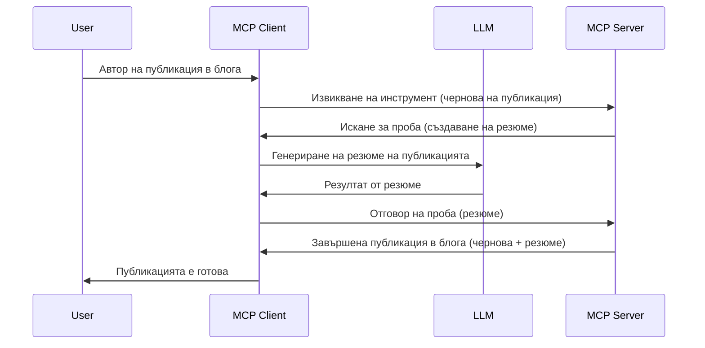

# Sampling - делегиране на функции към Клиента

Понякога е необходимо MCP Клиентът и MCP Сървърът да си сътрудничат за постигане на обща цел. Може да имате случай, при който Сървърът изисква помощ от LLM, който се намира на клиента. За тази ситуация sampling е това, което трябва да използвате.

Нека разгледаме някои случай на използване и как да изградим решение, включващо sampling.

## Обзор

В този урок се фокусираме върху обяснението кога и къде да използваме Sampling и как да го конфигурираме.

## Цели на обучението

В тази глава ще:

- Обясним какво е Sampling и кога да го използваме.
- Покажем как да конфигурираме Sampling в MCP.
- Представим примери за действие на Sampling.

## Какво е Sampling и защо да го използваме?

Sampling е усъвършенствана функция, която работи по следния начин:


### Sampling заявка

Добре, сега имаме обща представа за достоверен сценарий, нека поговорим за sampling заявката, която сървърът изпраща обратно към клиента. Ето как може да изглежда такава заявка в JSON-RPC формат:

```json
{
  "jsonrpc": "2.0",
  "id": 1,
  "method": "sampling/createMessage",
  "params": {
    "messages": [
      {
        "role": "user",
        "content": {
          "type": "text",
          "text": "Create a blog post summary of the following blog post: <BLOG POST>"
        }
      }
    ],
    "modelPreferences": {
      "hints": [
        {
          "name": "claude-3-sonnet"
        }
      ],
      "intelligencePriority": 0.8,
      "speedPriority": 0.5
    },
    "systemPrompt": "You are a helpful assistant.",
    "maxTokens": 100
  }
}
```

Има няколко неща, които си заслужава да се отбележат:

- Prompt, под content -> text, е нашата заявка, която е инструкция за LLM да обобщи съдържанието на блог поста.

- **modelPreferences**. Тази секция е точно това, предпочитание, препоръка каква конфигурация да се използва с LLM. Потребителят може да избере дали да следва тези препоръки или да ги промени. В този случай има препоръки за модела, който да се използва, както и за приоритет на скоростта и интелигентността.
- **systemPrompt**, това е вашата нормална системна заявка, която дава на вашия LLM личност и съдържа инструкции за насоки.
- **maxTokens**, това е друго свойство, което се използва за указване колко токена се препоръчва да се използват за тази задача.

### Sampling отговор

Този отговор е това, което MCP Клиентът в крайна сметка изпраща обратно към MCP Сървъра и е резултат от извикването на LLM от страна на клиента, чакайки този отговор и след това конструирайки това съобщение. Ето как може да изглежда в JSON-RPC:

```json
{
  "jsonrpc": "2.0",
  "id": 1,
  "result": {
    "role": "assistant",
    "content": {
      "type": "text",
      "text": "Here's your abstract <ABSTRACT>"
    },
    "model": "gpt-5",
    "stopReason": "endTurn"
  }
}
```

Обърнете внимание, че отговорът е абстракт на блог поста, точно както поискахме. Също така забележете как използваният `model` не е този, който поискахме, а "gpt-5" вместо "claude-3-sonnet". Това показва, че потребителят може да промени решението си какво да използва и че вашата sampling заявка е препоръка.

Добре, сега когато разбираме основния поток и полезната задача, за която да се използва – "създаване + абстракт на блог пост", нека видим какво трябва да направим, за да го осъществим.

### Типове съобщения

Sampling съобщенията не са ограничени само до текст, но можете да изпращате и изображения и аудио. Ето как JSON-RPC изглежда различно:

**Текст**

```json
{
  "type": "text",
  "text": "The message content"
}
```

**Съдържание на изображение**

```json
{
  "type": "image",
  "data": "base64-encoded-image-data",
  "mimeType": "image/jpeg"
}
```

**Аудио съдържание**

```json
{
  "type": "audio",
  "data": "base64-encoded-audio-data",
  "mimeType": "audio/wav"
}
```

> NOTE: за по-подробна информация за Sampling, вижте [официалната документация](https://modelcontextprotocol.io/specification/2025-06-18/client/sampling)

## Как да конфигурирате Sampling в Клиента

> Забележка: ако създавате само сървър, не е нужно да правите много тук.

В клиент трябва да посочите следната функция по следния начин:

```json
{
  "capabilities": {
    "sampling": {}
  }
}
```

Това ще бъде разпознато, когато избраният клиент започне с сървъра.

## Пример за Sampling в действие - Създаване на блог пост

Нека програмираме сървър за sampling заедно, ще трябва да направим следното:

1. Създадем инструмент на Сървъра.
1. Този инструмент трябва да създаде sampling заявка.
1. Инструментът трябва да изчака отговор на sampling заявката от клиента.
1. След това трябва да бъде произведен резултатът от инструмента.

Нека видим кода стъпка по стъпка:

### -1- Създайте инструмента

**python**

```python
@mcp.tool()
async def create_blog(title: str, content: str, ctx: Context[ServerSession, None]) -> str:
    """Create a blog post and generate a summary"""

```

### -2- Създайте sampling заявка

Разширете вашия инструмент със следния код:

**python**

```python
post = BlogPost(
        id=len(posts) + 1,
        title=title,
        content=content,
        abstract=""
    )

prompt = f"Create an abstract of the following blog post: title: {title} and draft: {content} "

result = await ctx.session.create_message(
        messages=[
            SamplingMessage(
                role="user",
                content=TextContent(type="text", text=prompt),
            )
        ],
        max_tokens=100,
)

```

### -3- Изчакайте отговора и върнете отговора

**python**

```python
post.abstract = result.content.text

posts.append(post)

# върнете завършения продукт
return json.dumps({
    "id": post.title,
    "abstract": post.abstract
})
```

### -4- Цял код

**python**

```python
from starlette.applications import Starlette
from starlette.routing import Mount, Host

from mcp.server.fastmcp import Context, FastMCP

from mcp.server.session import ServerSession
from mcp.types import SamplingMessage, TextContent

import json


from uuid import uuid4
from typing import List
from pydantic import BaseModel


mcp = FastMCP("Blog post generator")

# app = FastAPI()

posts = []

class BlogPost(BaseModel):
    id: int
    title: str
    content: str
    abstract: str

posts: List[BlogPost] = []

@mcp.tool()
async def create_blog(title: str, content: str, ctx: Context[ServerSession, None]) -> str:
    """Create a blog post and generate a summary"""

    post = BlogPost(
        id=len(posts) + 1,
        title=title,
        content=content,
        abstract=""
    )

    prompt = f"Create an abstract of the following blog post: title: {title} and draft: {content} "

    result = await ctx.session.create_message(
        messages=[
            SamplingMessage(
                role="user",
                content=TextContent(type="text", text=prompt),
            )
        ],
        max_tokens=100,
    )

    post.abstract = result.content.text

    posts.append(post)

    # върни пълния блог пост
    return json.dumps({
        "id": post.title,
        "abstract": post.abstract
    })

if __name__ == "__main__":
    print("Starting server...")
    # mcp.run()
    mcp.run(transport="streamable-http")

# стартирай приложението с: python server.py
```

### -5- Тестване във Visual Studio Code

За да тествате това във Visual Studio Code, направете следното:

1. Стартирайте сървъра в терминала
1. Добавете го в *mcp.json* (и се уверете, че е стартиран), например:

   ```json
   "servers": {
      "blog-server": {
        "type": "http",
        "url": "http://localhost:8000/mcp"
      }
   }
   ```

1. Въведете заявка:

   ```text
   create a blog post named "Where Python comes from", the content is "Python is actually named after Monty Python Flying Circus"
   ```

1. Позволете да се извърши sampling. При първия тест ще ви се покаже допълнителен диалог, който трябва да одобрите, след което ще видите нормалния диалог за искане да изпълните инструмент

1. Проверете резултатите. Ще видите резултатите както красиво представени в GitHub Copilot Chat, така и може да инспектирате суровия JSON отговор.

**Бонус**. Инструментите на Visual Studio Code имат отлична поддръжка за sampling. Можете да конфигурирате достъпа до Sampling на вашия инсталиран сървър по следния начин:

1. Навигирайте до секцията с разширения.
1. Изберете иконата на зъбно колело за вашия инсталиран сървър в секцията "MCP SERVERS - INSTALLED".
1 Изберете "Configure Model Access", тук можете да изберете кои модели GitHub Copilot може да използва при извършване на sampling. Също така можете да видите всички подадени наскоро sampling заявки чрез избор на "Show Sampling requests".

## Задача

В тази задача ще изградите леко различен Sampling, а именно sampling интеграция, която поддържа генериране на описание на продукт. Ето и вашият сценарий:

**Сценарий**: Служител в бек офис на електронна търговия има нужда от помощ, тъй като отнема твърде много време да създаде описания на продукти. Затова трябва да изградите решение, където може да извикате инструмент "create_product" с аргументи "title" и "keywords", и той трябва да произведе пълен продукт, включително поле "description", което трябва да бъде попълнено от LLM на клиента.

СЪВЕТ: използвайте наученото по-рано, за да конструирате този сървър и неговия инструмент чрез sampling заявка.

## Решение

[Решение](./solution/README.md)

## Основни изводи

Sampling е мощна функция, която позволява на сървъра да делегира задачи на клиента, когато се нуждае от помощта на LLM.

## Какво следва

- [Глава 4 - Практическа реализация](../../04-PracticalImplementation/README.md)

---

<!-- CO-OP TRANSLATOR DISCLAIMER START -->
**Отказ от отговорност**:  
Този документ е преведен с помощта на AI преводаческа услуга [Co-op Translator](https://github.com/Azure/co-op-translator). Въпреки че се стремим към точност, моля, имайте предвид, че автоматизираните преводи могат да съдържат грешки или неточности. Оригиналният документ на неговия роден език трябва да се счита за авторитетен източник. За критична информация се препоръчва професионален човешки превод. Ние не носим отговорност за никакви недоразумения или неправилни тълкувания, произтичащи от използването на този превод.
<!-- CO-OP TRANSLATOR DISCLAIMER END -->