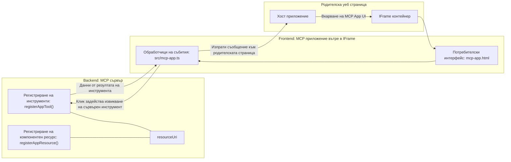

# MCP Apps

MCP Apps е нова парадигма в MCP. Идеята е, че не само отговаряте с данни от извикване на инструмент, но и предоставяте информация за това как с тази информация трябва да се взаимодейства. Това означава, че резултатите от инструментите вече могат да съдържат информация за потребителския интерфейс. Но защо бихме искали това? Ами, помислете как го правите днес. Вероятно използвате резултатите от MCP Server като поставяте някакъв тип фронтенд пред него, това е код, който трябва да пишете и поддържате. Понякога това е това, което искате, но понякога би било страхотно, ако просто можете да внесете малък фрагмент информация, който е самостоятелен и има всичко - от данни до потребителски интерфейс.

## Преглед

Този урок предоставя практическо ръководство за MCP Apps, как да започнете с него и как да го интегрирате във вашите съществуващи Web Apps. MCP Apps е много ново допълнение към MCP Standard.

## Учебни цели

Към края на този урок ще можете да:

- Обясните какво са MCP Apps.
- Кога да използвате MCP Apps.
- Създавате и интегрирате свои собствени MCP Apps.

## MCP Apps - как работи

Идеята при MCP Apps е да се предостави отговор, който по същество е компонент за рендиране. Такъв компонент може да има както визуални елементи, така и интерактивност, например кликвания на бутони, потребителски вход и други. Нека започнем със сървърната страна и нашия MCP Server. За да създадете MCP App компонент, трябва да създадете инструмент, но и ресурс за приложението. Тези две части са свързани чрез resourceUri.

Ето пример. Нека се опитаме да визуализираме какво е включено и коя част какво прави:

```text
server.ts -- responsible for registering tools and the component as a UI component
src/
  mcp-app.ts -- wiring up event handlers
mcp-app.html -- the user interface
```

Тази визуализация описва архитектурата за създаване на компонент и неговата логика.


Нека опишем отговорностите след това за бекенд и фронтенд съответно.

### Бекендът

Има две неща, които трябва да постигнем тук:

- Регистриране на инструментите, с които искаме да взаимодействаме.
- Дефиниране на компонента.

**Регистриране на инструмента**

```typescript
registerAppTool(
    server,
    "get-time",
    {
      title: "Get Time",
      description: "Returns the current server time.",
      inputSchema: {},
      _meta: { ui: { resourceUri } }, // Свързва този инструмент с неговия UI ресурс
    },
    async () => {
      const time = new Date().toISOString();
      return { content: [{ type: "text", text: time }] };
    },
  );

```

Предходният код описва поведението, където се излага инструмент наречен `get-time`. Той не приема входни параметри, но в крайна сметка произвежда текущото време. Имаме възможността да дефинираме `inputSchema` за инструменти, които трябва да приемат потребителски вход.

**Регистриране на компонента**

В същия файл трябва също да регистрираме компонента:

```typescript
const resourceUri = "ui://get-time/mcp-app.html";

// Регистрирайте ресурса, който връща събраните HTML/JavaScript за потребителския интерфейс.
registerAppResource(
  server,
  resourceUri,
  resourceUri,
  { mimeType: RESOURCE_MIME_TYPE },
  async () => {
    const html = await fs.readFile(path.join(DIST_DIR, "mcp-app.html"), "utf-8");

    return {
    contents: [
        { uri: resourceUri, mimeType: RESOURCE_MIME_TYPE, text: html },
    ],
    };
  },
);
```

Обърнете внимание, че споменаваме `resourceUri`, за да свържем компонента с неговите инструменти. Интересен е и callback-ът, където зареждаме UI файла и връщаме компонента.

### Фронтендът на компонента

Подобно на бекенда, тук има две части:

- Фронтенд, написан на чист HTML.
- Код, който обработва събития и действия, например извикване на инструменти или комуникация с родителския прозорец.

**Потребителски интерфейс**

Нека разгледаме потребителския интерфейс.

```html
<!-- mcp-app.html -->
<!DOCTYPE html>
<html lang="en">
  <head>
    <meta charset="UTF-8" />
    <title>Get Time App</title>
  </head>
  <body>
    <p>
      <strong>Server Time:</strong> <code id="server-time">Loading...</code>
    </p>
    <button id="get-time-btn">Get Server Time</button>
    <script type="module" src="/src/mcp-app.ts"></script>
  </body>
</html>
```

**Свързване на събития**

Последната част е свързването на събития. Това означава, че определяме коя част от UI-то ни трябва обработчици на събития и какво да се прави, ако събитията бъдат задействани:

```typescript
// mcp-app.ts

import { App } from "@modelcontextprotocol/ext-apps";

// Вземете препратки към елементи
const serverTimeEl = document.getElementById("server-time")!;
const getTimeBtn = document.getElementById("get-time-btn")!;

// Създайте екземпляр на приложението
const app = new App({ name: "Get Time App", version: "1.0.0" });

// Обработвайте резултатите от инструмента от сървъра. Задайте преди `app.connect()`, за да избегнете
// пропускането на първоначалния резултат от инструмента.
app.ontoolresult = (result) => {
  const time = result.content?.find((c) => c.type === "text")?.text;
  serverTimeEl.textContent = time ?? "[ERROR]";
};

// Свържете клик върху бутона
getTimeBtn.addEventListener("click", async () => {
  // `app.callServerTool()` позволява на потребителския интерфейс да поиска нови данни от сървъра
  const result = await app.callServerTool({ name: "get-time", arguments: {} });
  const time = result.content?.find((c) => c.type === "text")?.text;
  serverTimeEl.textContent = time ?? "[ERROR]";
});

// Свържете се към хоста
app.connect();
```

Както виждате от горното, това е нормален код за свързване на DOM елементи със събития. Заслужава да се отбележи извикването на `callServerTool`, който накрая извиква инструмент на бекенда.

## Работа с потребителски вход

Досега видяхме компонент с бутон, който при натискане извиква инструмент. Нека видим дали можем да добавим още UI елементи като поле за въвеждане и дали можем да изпратим аргументи към инструмент. Нека имплементираме функционалност за Често Задавани Въпроси (FAQ). Ето как трябва да работи:

- Трябва да има бутон и поле за въвеждане, където потребителят въвежда ключова дума за търсене, например "Shipping". Това трябва да извика инструмент на бекенда, който извършва търсене в FAQ данните.
- Инструмент, който поддържа посочено FAQ търсене.

Нека първо добавим необходимата поддръжка на бекенда:

```typescript
const faq: { [key: string]: string } = {
    "shipping": "Our standard shipping time is 3-5 business days.",
    "return policy": "You can return any item within 30 days of purchase.",
    "warranty": "All products come with a 1-year warranty covering manufacturing defects.",
  }

registerAppTool(
    server,
    "get-faq",
    {
      title: "Search FAQ",
      description: "Searches the FAQ for relevant answers.",
      inputSchema: zod.object({
        query: zod.string().default("shipping"),
      }),
      _meta: { ui: { resourceUri: faqResourceUri } }, // Свързва този инструмент с неговия UI ресурс
    },
    async ({ query }) => {
      const answer: string = faq[query.toLowerCase()] || "Sorry, I don't have an answer for that.";
      return { content: [{ type: "text", text: answer }] };
    },
  );
```

Тук виждаме как попълваме `inputSchema` и му задаваме `zod` схема по следния начин:

```typescript
inputSchema: zod.object({
  query: zod.string().default("shipping"),
})
```

В горната схема декларираме, че имаме входен параметър на име `query` и че е опционален с подразбираща се стойност "shipping".

Добре, нека продължим към *mcp-app.html*, за да видим какъв UI трябва да създадем за това:

```html
<div class="faq">
    <h1>FAQ response</h1>
    <p>FAQ Response: <code id="faq-response">Loading...</code></p>
    <input type="text" id="faq-query" placeholder="Enter FAQ query" />
    <button id="get-faq-btn">Get FAQ Response</button>
  </div>
```

Страхотно, сега имаме поле за въвеждане и бутон. След това отиваме в *mcp-app.ts*, за да свържем тези събития:

```typescript
const getFaqBtn = document.getElementById("get-faq-btn")!;
const faqQueryInput = document.getElementById("faq-query") as HTMLInputElement;

getFaqBtn.addEventListener("click", async () => {
  const query = faqQueryInput.value;
  const result = await app.callServerTool({ name: "get-faq", arguments: { query } });
  const faq = result.content?.find((c) => c.type === "text")?.text;
  faqResponseEl.textContent = faq ?? "[ERROR]";
});
```

В горния код:

- Създаваме препратки към интерактивните UI елементи.
- Обработваме клик на бутона за взимане на стойността от полето за въвеждане и също извикваме `app.callServerTool()` с `name` и `arguments`, като последните предават `query` като стойност.

Какво наистина се случва при извикване на `callServerTool` е, че се изпраща съобщение към родителския прозорец, който накрая извиква MCP Server.

### Опитайте го

Изпробвайки това, сега трябва да видим следното:


и ето как опитваме с вход като "warranty"


За да стартирате този код, отидете на [Code section](./code/README.md)

## Тестване в Visual Studio Code

Visual Studio Code има отлична поддръжка за MCP Apps и вероятно е един от най-лесните начини за тестване на вашите MCP Apps. За да използвате Visual Studio Code, добавете сървърна част в *mcp.json* по следния начин:

```json
"my-mcp-server-7178eca7": {
    "url": "http://localhost:3001/mcp",
    "type": "http"
  }
```

След това стартирайте сървъра, трябва да можете да комуникирате с вашия MCP App през Chat Window, стига да имате инсталиран GitHub Copilot.

Можете да го задействате чрез prompt, например "#get-faq":


И както когато го пускахте през уеб браузър, той рендира по същия начин:


## Задача

Създайте игра "Камък, ножица, хартия". Тя трябва да съдържа следното:

UI:

- падащо меню с опции
- бутон за подаване на избора
- етикет, който показва кой какво е избрал и кой е победител

Сървър:

- трябва да има инструмент камък ножица хартия, който приема "choice" като вход. Той също трябва да генерира избор на компютъра и да определи победителя.

## Решение

[Решение](./assignment/README.md)

## Обобщение

Научихме за тази нова парадигма MCP Apps. Това е нова парадигма, която позволява MCP сървърите да имат мнение не само за данните, но и как тези данни трябва да се представят.

Освен това научихме, че тези MCP Apps се хостват в IFrame и за да комуникират с MCP сървърите, те трябва да изпращат съобщения към родителското уеб приложение. Съществуват няколко библиотеки както за чист JavaScript, така и за React и други, които улесняват тази комуникация.

## Основни изводи

Ето какво научихте:

- MCP Apps е нов стандарт, който може да бъде полезен, когато искате да доставите както данни, така и UI функционалности.
- Тези приложения работят в IFrame поради съображения за сигурност.

## Какво следва

- [Глава 4](../../04-PracticalImplementation/README.md)

---

<!-- CO-OP TRANSLATOR DISCLAIMER START -->
**Отказ от отговорност**:  
Този документ е преведен с помощта на AI преводаческа услуга [Co-op Translator](https://github.com/Azure/co-op-translator). Въпреки че се стремим към точност, моля, имайте предвид, че автоматизираните преводи могат да съдържат грешки или неточности. Оригиналният документ на неговия роден език трябва да се счита за авторитетен източник. За критична информация се препоръчва професионален човешки превод. Не носим отговорност за никакви недоразумения или погрешни тълкувания, произтичащи от използването на този превод.
<!-- CO-OP TRANSLATOR DISCLAIMER END -->