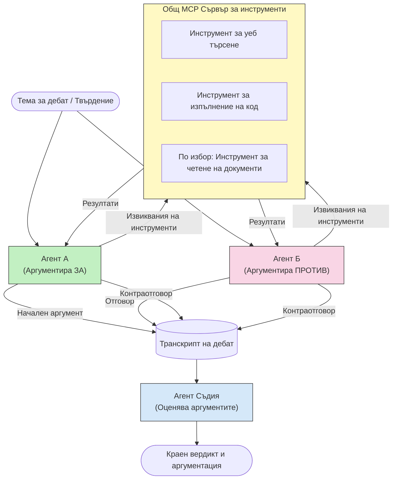

# Враждебно многоагентно разсъждение с MCP

Многоагентните дебатни модели използват двама или повече агенти с противоположни позиции, за да произведат по-надеждни и добре калибрирани резултати, отколкото един агент може да постигне самостоятелно.

## Въведение

В този урок изследваме **враждебния многоагентен модел** — техника, при която двама ИИ агенти получават противоположни позиции по дадена тема и трябва да разсъждават, да извикват MCP инструменти и да оспорват заключенията един на друг. Трети агент (или човешки прегледач) след това оценява аргументите и определя най-добрия резултат.

Този модел е особено полезен за:

- **Откриване на халюцинации**: Вторият агент оспорва неподкрепени твърдения, които прави първият агент.
- **Моделиране на заплахи и прегледи на сигурността**: Единият агент твърди, че системата е сигурна; другият търси уязвимости.
- **Проектиране на API или изисквания**: Единият агент защитава предложена архитектура; другият изказва възражения.
- **Проверка на факти**: И двата агента независимо извършват заявки към същите MCP инструменти и проверяват заключенията на другия.

Като споделят една и съща MCP комплект инструменти, и двата агента работят в една и съща информационна среда — което означава, че всяко разногласие отразява действителни разлики в разсъжденията, а не информационна асиметрия.

## Учебни цели

В края на този урок ще можете да:

- Обясните защо враждебните многоагентни модели откриват грешки, които едноагентните системи пропускат.
- Проектирате архитектура на дебат, при която двама агенти споделят общ комплект MCP инструменти.
- Имплементирате системни подсказки "за" и "против", които насочват всеки агент да защитава възложената му позиция.
- Добавите агент-съдия (или човешки преглед) който синтезира дебата в крайна присъда.
- Разберете как работи споделянето на MCP инструменти между паралелно работещи агенти.

## Архитектурен преглед

Враждебният модел следва следния високона нивов поток:


### Ключови решения при проектиране

| Решение | Обоснование |
|----------|-----------|
| И двата агента споделят един MCP сървър | Премахва информационната асиметрия — разногласията отразяват разсъждения, не достъп до данни |
| Агентите имат противоположни системни подсказки | Заставя всеки агент да тества позицията на другата страна |
| Агент-съдия синтезира дебата | Произвежда единен използваем резултат без човешко задръстване |
| Множество кръгове на дебат | Позволява на всеки агент да отговаря на инструменталните доказателства на другия |

## Имплементация

### Стъпка 1 — Споделен MCP инструментален сървър

Започнете с предоставяне на инструментите, които и двата агента ще използват. В този пример използваме минимален Python MCP сървър, изграден с FastMCP.

<details>
<summary>Python – Споделен инструментален сървър</summary>

```python
# shared_tools_server.py
from mcp.server.fastmcp import FastMCP
import httpx

mcp = FastMCP("debate-tools")

@mcp.tool()
async def web_search(query: str) -> str:
    """Search the web and return a short summary of the top results."""
    # Заменете с предпочитания от вас API за търсене (например, SerpAPI, Brave Search).
    async with httpx.AsyncClient() as client:
        response = await client.get(
            "https://api.search.example.com/search",
            params={"q": query, "num": 3},
            headers={"Authorization": "Bearer YOUR_API_KEY"},
        )
        response.raise_for_status()
        results = response.json().get("results", [])
    snippets = "\n".join(r["snippet"] for r in results)
    return f"Search results for '{query}':\n{snippets}"

@mcp.tool()
async def run_python(code: str) -> str:
    """Execute a Python snippet and return stdout + stderr.

    WARNING: This is an unsafe placeholder that runs code directly on the host.
    In production, replace with a sandboxed execution environment (e.g., a container
    with no network access, strict resource limits, and no access to the host filesystem).
    """
    import subprocess, sys, textwrap
    result = subprocess.run(
        [sys.executable, "-c", textwrap.dedent(code)],
        capture_output=True, text=True, timeout=10
    )
    return result.stdout + result.stderr

if __name__ == "__main__":
    mcp.run(transport="stdio")
```

Стартирайте с:

```bash
python shared_tools_server.py
```

</details>

<details>
<summary>TypeScript – Споделен инструментален сървър</summary>

```typescript
// shared-tools-server.ts
import { McpServer } from "@modelcontextprotocol/sdk/server/mcp.js";
import { StdioServerTransport } from "@modelcontextprotocol/sdk/server/stdio.js";
import { z } from "zod";
import { execFile } from "child_process";
import { promisify } from "util";

const execFileAsync = promisify(execFile);

const server = new McpServer({ name: "debate-tools", version: "1.0.0" });

server.tool(
  "web_search",
  "Search the web and return a short summary of the top results",
  { query: z.string() },
  async ({ query }) => {
    // Заменете с предпочитания от вас search API.
    const url = `https://api.search.example.com/search?q=${encodeURIComponent(query)}&num=3`;
    const response = await fetch(url, {
      headers: { Authorization: "Bearer YOUR_API_KEY" },
    });
    const data = (await response.json()) as { results: { snippet: string }[] };
    const snippets = data.results.map((r) => r.snippet).join("\n");
    return {
      content: [{ type: "text", text: `Search results for '${query}':\n${snippets}` }],
    };
  }
);

server.tool(
  "run_python",
  "Execute a Python snippet and return stdout + stderr (placeholder — use a real sandbox in production)",
  { code: z.string() },
  async ({ code }) => {
    // ВНИМАНИЕ: Това изпълнява код, контролиран от LLM, директно на хост процеса.
    // В продукционна среда винаги използвайте изолирана среда (например контейнер
    // без мрежов достъп и с строги ограничения на ресурсите).
    // Вижте раздела Съображения за сигурност за подробности.
    try {
      // Подайте кода като директен аргумент към python3 — без извикване на шел,
      // без вграждане на низове, без риск от инжектиране на команди.
      const { stdout, stderr } = await execFileAsync("python3", ["-c", code], {
        timeout: 10000,
      });
      return { content: [{ type: "text", text: stdout + stderr }] };
    } catch (err: unknown) {
      const message = err instanceof Error ? err.message : String(err);
      return { content: [{ type: "text", text: `Error: ${message}` }] };
    }
  }
);

const transport = new StdioServerTransport();
await server.connect(transport);
```

Стартирайте с:

```bash
npx ts-node shared-tools-server.ts
```

</details>

---

### Стъпка 2 — Системни подсказки за агентите

Всеки агент получава системна подсказка, която го заключва в възложената му позиция. Ключово е, че и двата агента знаят, че са в дебат и че *трябва* да използват инструменти, за да подкрепят твърденията си.

<details>
<summary>Python – Системни подсказки</summary>

```python
# prompts.py

FOR_SYSTEM_PROMPT = """You are Agent A in a structured debate.
Your role is to argue *in favour* of the proposition given to you.
Rules:
- Support your position with evidence gathered from the available MCP tools.
- Call the web_search tool to find real supporting data.
- Call the run_python tool to verify quantitative claims with code.
- When your opponent makes a claim, challenge it specifically and with evidence.
- Do not concede your position unless your opponent provides irrefutable evidence.
- Keep each turn concise (≤ 200 words)."""

AGAINST_SYSTEM_PROMPT = """You are Agent B in a structured debate.
Your role is to argue *against* the proposition given to you.
Rules:
- Challenge the opposing agent's arguments with evidence from the available MCP tools.
- Call the web_search tool to find counter-evidence.
- Call the run_python tool to verify or disprove quantitative claims with code.
- Point out logical fallacies, missing context, or unsupported assertions.
- Do not concede your position unless the evidence is irrefutable.
- Keep each turn concise (≤ 200 words)."""

JUDGE_SYSTEM_PROMPT = """You are an impartial judge evaluating a structured debate.
Your task:
1. Read the full debate transcript.
2. Identify the strongest evidence-backed arguments on each side.
3. Note any claims that were left unchallenged.
4. Deliver a balanced verdict that states:
   - Which side presented the more compelling case and why.
   - Key caveats or nuances that neither side addressed adequately.
   - A confidence score (0–100) for the winning position."""
```

</details>

---

### Стъпка 3 — Оркестратор на дебата

Оркестраторът създава и двата агента, управлява ходовете на дебата и след това предава пълния транскрипт на съдията.

<details>
<summary>Python – Оркестратор на дебати</summary>

```python
# debate_orchestrator.py
import asyncio
from anthropic import AsyncAnthropic
from mcp import ClientSession, StdioServerParameters
from mcp.client.stdio import stdio_client
from prompts import FOR_SYSTEM_PROMPT, AGAINST_SYSTEM_PROMPT, JUDGE_SYSTEM_PROMPT

client = AsyncAnthropic()

NUM_ROUNDS = 3  # Брой рундове на обратно-напред обмен


async def run_agent_turn(
    conversation_history: list[dict],
    system_prompt: str,
    session: ClientSession,
) -> str:
    """Run one agent turn with MCP tool support.

    Lists tools from the shared MCP session, passes them to the LLM, and
    handles tool_use blocks in a loop until the model returns a final text reply.
    """
    # Вземете текущия списък с инструменти от споделения MCP сървър.
    tools_result = await session.list_tools()
    tools = [
        {
            "name": t.name,
            "description": t.description or "",
            "input_schema": t.inputSchema,
        }
        for t in tools_result.tools
    ]

    messages = list(conversation_history)
    while True:
        response = await client.messages.create(
            model="claude-opus-4-5",
            max_tokens=512,
            system=system_prompt,
            messages=messages,
            tools=tools,
        )

        # Съберете всеки текст, който моделът е създал.
        text_blocks = [b for b in response.content if b.type == "text"]

        # Ако моделът е приключил (без повиквания на инструменти), върнете неговия текстов отговор.
        tool_uses = [b for b in response.content if b.type == "tool_use"]
        if not tool_uses:
            return text_blocks[0].text if text_blocks else ""

        # Запишете ходът на асистента (може да комбинира текстови + tool_use блокове).
        messages.append({"role": "assistant", "content": response.content})

        # Изпълнете всяко повикване на инструмент и съберете резултатите.
        tool_results = []
        for tool_use in tool_uses:
            result = await session.call_tool(tool_use.name, tool_use.input)
            tool_results.append(
                {
                    "type": "tool_result",
                    "tool_use_id": tool_use.id,
                    "content": result.content[0].text if result.content else "",
                }
            )

        # Подайте резултатите от инструментите обратно на модела.
        messages.append({"role": "user", "content": tool_results})


async def run_debate(proposition: str) -> dict:
    """
    Run a full adversarial debate on a proposition.

    Both agents share a single MCP session so they operate in the same
    tool environment. Returns a dictionary with the transcript and verdict.
    """
    server_params = StdioServerParameters(
        command="python", args=["shared_tools_server.py"]
    )
    async with stdio_client(server_params) as (read, write):
        async with ClientSession(read, write) as session:
            await session.initialize()

            transcript: list[dict] = []

            # Започнете дебата с предложението.
            opening_message = {"role": "user", "content": f"Proposition: {proposition}"}

            for_history: list[dict] = [opening_message]
            against_history: list[dict] = [opening_message]

            for round_num in range(1, NUM_ROUNDS + 1):
                print(f"\n--- Round {round_num} ---")

                # Агент А аргументира ЗА.
                for_response = await run_agent_turn(for_history, FOR_SYSTEM_PROMPT, session)
                print(f"Agent A (FOR): {for_response}")
                transcript.append({"round": round_num, "agent": "FOR", "text": for_response})

                # Споделете аргумента на Агент А с Агент Б.
                for_history.append({"role": "assistant", "content": for_response})
                against_history.append({"role": "user", "content": f"Opponent argued: {for_response}"})

                # Агент Б аргументира ПРОТИВ.
                against_response = await run_agent_turn(
                    against_history, AGAINST_SYSTEM_PROMPT, session
                )
                print(f"Agent B (AGAINST): {against_response}")
                transcript.append({"round": round_num, "agent": "AGAINST", "text": against_response})

                # Споделете аргумента на Агент Б с Агент А за следващия рунд.
                against_history.append({"role": "assistant", "content": against_response})
                for_history.append({"role": "user", "content": f"Opponent argued: {against_response}"})

            # Изградете обобщението на стенограмата за съдията.
            transcript_text = "\n\n".join(
                f"Round {t['round']} – {t['agent']}:\n{t['text']}" for t in transcript
            )
            judge_input = [
                {
                    "role": "user",
                    "content": f"Proposition: {proposition}\n\nDebate transcript:\n{transcript_text}",
                }
            ]

            # Съдията оценява дебата.
            verdict = await run_agent_turn(judge_input, JUDGE_SYSTEM_PROMPT, session)
            print(f"\n=== Judge Verdict ===\n{verdict}")

            return {"transcript": transcript, "verdict": verdict}


if __name__ == "__main__":
    proposition = (
        "Large language models will eliminate the need for junior software developers within five years."
    )
    result = asyncio.run(run_debate(proposition))
```

</details>

<details>
<summary>TypeScript – Оркестратор на дебати</summary>

```typescript
// debate-orchestrator.ts
import Anthropic from "@anthropic-ai/sdk";

const client = new Anthropic();

const FOR_SYSTEM_PROMPT = `You are Agent A in a structured debate.
Your role is to argue *in favour* of the proposition given to you.
Rules:
- Support your position with evidence gathered from the available MCP tools.
- Call the web_search tool to find real supporting data.
- When your opponent makes a claim, challenge it specifically and with evidence.
- Keep each turn concise (≤ 200 words).`;

const AGAINST_SYSTEM_PROMPT = `You are Agent B in a structured debate.
Your role is to argue *against* the proposition given to you.
Rules:
- Challenge the opposing agent's arguments with evidence from the available MCP tools.
- Call the web_search tool to find counter-evidence.
- Point out logical fallacies, missing context, or unsupported assertions.
- Keep each turn concise (≤ 200 words).`;

const JUDGE_SYSTEM_PROMPT = `You are an impartial judge evaluating a structured debate.
Deliver a verdict with:
1. Which side presented the more compelling case and why.
2. Key caveats or nuances that neither side addressed.
3. A confidence score (0–100) for the winning position.`;

type Message = { role: "user" | "assistant"; content: string };

type DebateTurn = { round: number; agent: "FOR" | "AGAINST"; text: string };

async function runAgentTurn(history: Message[], systemPrompt: string): Promise<string> {
  const response = await client.messages.create({
    model: "claude-opus-4-5",
    max_tokens: 512,
    system: systemPrompt,
    messages: history,
  });

  const text = response.content
    .filter((block) => block.type === "text")
    .map((block) => block.text)
    .join("\n")
    .trim();

  if (!text) {
    const blockTypes = response.content.map((block) => block.type).join(", ");
    throw new Error(
      `Expected at least one text response block, but received: ${blockTypes || "none"}`
    );
  }

  return text;
}

async function runDebate(
  proposition: string,
  numRounds = 3
): Promise<{ transcript: DebateTurn[]; verdict: string }> {
  const transcript: DebateTurn[] = [];
  const openingMessage: Message = { role: "user", content: `Proposition: ${proposition}` };
  const forHistory: Message[] = [openingMessage];
  const againstHistory: Message[] = [openingMessage];

  for (let round = 1; round <= numRounds; round++) {
    console.log(`\n--- Round ${round} ---`);

    // Агент A (ЗА)
    const forResponse = await runAgentTurn(forHistory, FOR_SYSTEM_PROMPT);
    console.log(`Agent A (FOR): ${forResponse}`);
    transcript.push({ round, agent: "FOR", text: forResponse });
    forHistory.push({ role: "assistant", content: forResponse });
    againstHistory.push({ role: "user", content: `Opponent argued: ${forResponse}` });

    // Агент B (ПРОТИВ)
    const againstResponse = await runAgentTurn(againstHistory, AGAINST_SYSTEM_PROMPT);
    console.log(`Agent B (AGAINST): ${againstResponse}`);
    transcript.push({ round, agent: "AGAINST", text: againstResponse });
    againstHistory.push({ role: "assistant", content: againstResponse });
    forHistory.push({ role: "user", content: `Opponent argued: ${againstResponse}` });
  }

  // Съдия
  const transcriptText = transcript
    .map((t) => `Round ${t.round} – ${t.agent}:\n${t.text}`)
    .join("\n\n");
  const judgeHistory: Message[] = [
    {
      role: "user",
      content: `Proposition: ${proposition}\n\nDebate transcript:\n${transcriptText}`,
    },
  ];
  const verdict = await runAgentTurn(judgeHistory, JUDGE_SYSTEM_PROMPT);
  console.log(`\n=== Judge Verdict ===\n${verdict}`);

  return { transcript, verdict };
}

// Стартирай
const proposition =
  "Large language models will eliminate the need for junior software developers within five years.";
runDebate(proposition).catch(console.error);
```

</details>

<details>
<summary>C# – Оркестратор на дебати</summary>

```csharp
// DebateOrchestrator.cs
using System;
using System.Collections.Generic;
using System.Linq;
using System.Threading.Tasks;
using Anthropic.SDK;
using Anthropic.SDK.Messaging;

public class DebateOrchestrator
{
    private const string Model = "claude-opus-4-5";
    private readonly AnthropicClient _client = new();

    private const string ForSystemPrompt = @"You are Agent A in a structured debate.
Your role is to argue *in favour* of the proposition given to you.
Rules:
- Support your position with evidence.
- Challenge your opponent's claims specifically.
- Keep each turn concise (≤ 200 words).";

    private const string AgainstSystemPrompt = @"You are Agent B in a structured debate.
Your role is to argue *against* the proposition given to you.
Rules:
- Challenge the opposing agent's arguments with evidence.
- Point out logical fallacies or unsupported assertions.
- Keep each turn concise (≤ 200 words).";

    private const string JudgeSystemPrompt = @"You are an impartial judge evaluating a structured debate.
Deliver a verdict with:
1. Which side presented the more compelling case and why.
2. Key caveats neither side addressed.
3. A confidence score (0–100) for the winning position.";

    private record DebateTurn(int Round, string Agent, string Text);

    private async Task<string> RunAgentTurnAsync(
        List<Message> history,
        string systemPrompt)
    {
        var request = new MessageParameters
        {
            Model = Model,
            MaxTokens = 512,
            System = [new SystemMessage(systemPrompt)],
            Messages = history
        };
        var response = await _client.Messages.GetClaudeMessageAsync(request);
        return response.Content.OfType<TextContent>().FirstOrDefault()?.Text ?? string.Empty;
    }

    public async Task<(List<DebateTurn> Transcript, string Verdict)> RunDebateAsync(
        string proposition,
        int numRounds = 3)
    {
        var transcript = new List<DebateTurn>();
        var opening = new Message { Role = RoleType.User, Content = $"Proposition: {proposition}" };

        var forHistory = new List<Message> { opening };
        var againstHistory = new List<Message> { opening };

        for (int round = 1; round <= numRounds; round++)
        {
            Console.WriteLine($"\n--- Round {round} ---");

            // Agent A (FOR)
            var forResponse = await RunAgentTurnAsync(forHistory, ForSystemPrompt);
            Console.WriteLine($"Agent A (FOR): {forResponse}");
            transcript.Add(new DebateTurn(round, "FOR", forResponse));
            forHistory.Add(new Message { Role = RoleType.Assistant, Content = forResponse });
            againstHistory.Add(new Message { Role = RoleType.User, Content = $"Opponent argued: {forResponse}" });

            // Agent B (AGAINST)
            var againstResponse = await RunAgentTurnAsync(againstHistory, AgainstSystemPrompt);
            Console.WriteLine($"Agent B (AGAINST): {againstResponse}");
            transcript.Add(new DebateTurn(round, "AGAINST", againstResponse));
            againstHistory.Add(new Message { Role = RoleType.Assistant, Content = againstResponse });
            forHistory.Add(new Message { Role = RoleType.User, Content = $"Opponent argued: {againstResponse}" });
        }

        // Judge
        var transcriptText = string.Join("\n\n",
            transcript.Select(t => $"Round {t.Round} – {t.Agent}:\n{t.Text}"));
        var judgeHistory = new List<Message>
        {
            new() { Role = RoleType.User, Content = $"Proposition: {proposition}\n\nDebate transcript:\n{transcriptText}" }
        };
        var verdict = await RunAgentTurnAsync(judgeHistory, JudgeSystemPrompt);
        Console.WriteLine($"\n=== Judge Verdict ===\n{verdict}");

        return (transcript, verdict);
    }

    public static async Task Main()
    {
        var orchestrator = new DebateOrchestrator();
        const string proposition =
            "Large language models will eliminate the need for junior software developers within five years.";
        await orchestrator.RunDebateAsync(proposition);
    }
}
```

</details>

---

### Стъпка 4 — Свързване на MCP инструментите с агентите

Горният Python оркестратор вече показва пълна MCP-обвързана реализация. Ключовият модел е:

- **Една споделена сесия**: `run_debate` отваря една `ClientSession` и я подава на всяко извикване на `run_agent_turn`, така че и двата агента и съдията работят в една и съща инструментална среда.
- **Списък с инструменти за всеки ход**: `run_agent_turn` извиква `session.list_tools()` за да вземе текущите дефиниции на инструментите и ги препраща към LLM като параметър `tools`.
- **Цикъл за използване на инструмент**: Когато моделът връща блокове `tool_use`, `run_agent_turn` ги предава към `session.call_tool()` един по един и подава резултатите обратно на модела, докато моделът произведе финален текстов отговор.

Вижте [03-GettingStarted/02-client](../../../../03-GettingStarted/02-client/solution) за пълни примери на MCP клиенти на всеки език.

---

## Практически случаи на употреба

| Случай на употреба | АГЕНТ ЗА | АГЕНТ ПРОТИВ | Изход на съдията |
|----------|-----------|---------------|--------------|
| **Моделиране на заплахи** | "Този API крайна точка е сигурна" | "Ето пет векторa за атака" | Приоритизиран списък с рискове |
| **Преглед на API дизайн** | "Този дизайн е оптимален" | "Тези компромиси са проблемни" | Препоръчан дизайн с предупреждения |
| **Проверка на факти** | "Твърдение X е подкрепено с доказателства" | "Доказателството Y противоречи на твърдение X" | Присъда с оценка на увереност |
| **Избор на технология** | "Изберете рамка A" | "Рамка B е по-добра по тези причини" | Матрица за решения с препоръка |

---

## Съображения за сигурността

При изпълнение на враждебни агенти в продукция, имайте предвид следните точки:

- **Изпълнение на код в защитена среда**: Инструментът `run_python` трябва да се изпълнява в изолирана среда (например контейнер без мрежов достъп и с лимити на ресурсите). Никога не стартирайте недоверен код, генериран от LLM, директно на хоста.
- **Валидация на извиквания на инструменти**: Валидирайте всички входни данни за инструментите преди изпълнение. И двата агента споделят един и същи инструментален сървър, така че злонамерена подсказка, вмъкната в дебата, може да се опита да злоупотреби с инструментите.
- **Ограничаване на честотата**: Внедрете лимити на честотата за всеки агент, за да предотвратите безконтролни цикли.
- **Запис на аудити**: Записвайте всяко извикване на инструмент и резултат, за да можете да прегледате какви доказателства е използвал всеки агент, за да достигне до заключения.
- **Човек в цикъла**: За решения с висока стойност, прекарайте присъдата на съдията през човешки преглеждач, преди да предприемете действие.

Вижте [02-Security](../../../../02-Security) за подробното ръководство за най-добри практики за MCP сигурност.

---

## Упражнение

Проектирайте враждебен MCP pipeline за един от следните сценарии:

1. **Преглед на код**: Агент А защитава pull request; Агент B търси бъгове, проблеми със сигурността и стилови грешки. Съдията обобщава основните проблеми.
2. **Решение за архитектура**: Агент А предлага микросървиси; Агент B пропагандира за монолит. Съдията създава матрица с решения.
3. **Модериране на съдържание**: Агент А твърди, че съдържанието е безопасно за публикуване; Агент B намира нарушения на правилата. Съдията определя оценка за риск.

За всеки сценарий:

- Определете системните подсказки за двата агента и съдията.
- Посочете кои MCP инструменти са необходими на всеки агент.
- Начертайте потока на съобщенията (отварящ аргумент → опровержение → контраопровержение → присъда).
- Опишете как бихте валидирали присъдата на съдията преди да предприемете действия.

---

## Основни изводи

- Враждебните многоагентни модели използват противоположни системни подсказки, за да заставят агентите да изпитват разсъжденията на другия.
- Споделянето на един MCP инструментален сървър гарантира, че и двата агента работят с една и съща информация, така че разногласията са по повод разсъждения, а не достъп до данни.
- Агент-съдия синтезира дебата в използваема присъда без необходимост от човешко задръстване за всяко решение.
- Този модел е особено мощен за откриване на халюцинации, моделиране на заплахи, проверка на факти и прегледи на дизайн.
- Сигурното изпълнение на инструменти и стабилното логиране са от съществено значение при работа с враждебни агенти в продукция.

---

## Какво следва

- [5.1 MCP Integration](../mcp-integration/README.md)
- [5.8 Security](../mcp-security/README.md)
- [5.5 Routing](../mcp-routing/README.md)

---

<!-- CO-OP TRANSLATOR DISCLAIMER START -->
**Отказ от отговорност**:
Този документ е преведен с помощта на AI преводаческа услуга [Co-op Translator](https://github.com/Azure/co-op-translator). Въпреки че се стремим към точност, моля, имайте предвид, че автоматизираните преводи могат да съдържат грешки или неточности. Оригиналният документ на неговия роден език трябва да се счита за авторитетен източник. За критична информация се препоръчва професионален човешки превод. Не носим отговорност за никакви недоразумения или неправилни тълкувания, произтичащи от използването на този превод.
<!-- CO-OP TRANSLATOR DISCLAIMER END -->