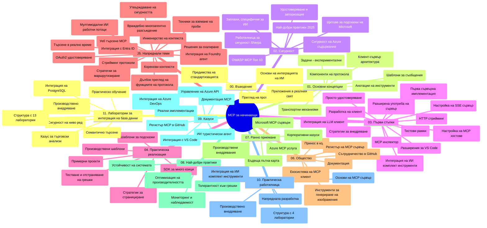

# Model Context Protocol (MCP) за начинаещи - Учебно ръководство

Това учебно ръководство предоставя обзор на структурата и съдържанието на хранилището за учебната програма "Model Context Protocol (MCP) за начинаещи". Използвайте това ръководство, за да навигирате ефективно в хранилището и да извлечете максимална полза от наличните ресурси.

## Обзор на хранилището

Model Context Protocol (MCP) е стандартизиран фреймуорк за взаимодействия между AI модели и клиентски приложения. Първоначално създаден от Anthropic, MCP сега се поддържа от по-широката MCP общност чрез официалната GitHub организация. Това хранилище предлага изчерпателна учебна програма с практически примери за код на C#, Java, JavaScript, Python и TypeScript, предназначена за AI разработчици, системни архитекти и софтуерни инженери.

## Визуална учебна карта

## Структура на хранилището

Хранилището е организирано в единадесет основни секции, всяка фокусирана върху различни аспекти на MCP:

1. **Въведение (00-Introduction/)**
   - Обзор на Model Context Protocol
   - Защо стандартизацията е важна в AI пътуванията
   - Практически случаи на употреба и ползи

2. **Основни концепции (01-CoreConcepts/)**
   - Клиент-сървър архитектура
   - Ключови компоненти на протокола
   - Модели на съобщения в MCP

3. **Сигурност (02-Security/)**
   - Заплахи за сигурността в системи базирани на MCP
   - Най-добри практики за осигуряване на внедрявания
   - Стратегии за удостоверяване и упълномощаване
   - **Изчерпателна документация по сигурността**:
     - MCP Security Best Practices 2025
     - Ръководство за имплементация на Azure Content Safety
     - MCP Security Controls and Techniques
     - MCP Best Practices Quick Reference
   - **Ключови теми за сигурността**:
     - Атаки за инжекция в промпти и отровяване на инструменти
     - Отвличане на сесии и проблеми с confused deputy
     - Уязвимости при пропускане на токени
     - Прекомерни разрешения и контрол на достъпа
     - Сигурност на веригата за доставки за AI компоненти
     - Интеграция на Microsoft Prompt Shields

4. **Започване (03-GettingStarted/)**
   - Настройка и конфигурация на средата
   - Създаване на основни MCP сървъри и клиенти
   - Интеграция със съществуващи приложения
   - Включва раздели за:
     - Първа имплементация на сървър
     - Разработка на клиенти
     - Интеграция на LLM клиенти
     - Интеграция с VS Code
     - Сървър с Server-Sent Events (SSE)
     - Разширена употреба на сървъра
     - HTTP стрийминг
     - Интеграция с AI Toolkit
     - Стратегии за тестване
     - Ръководство за разгръщане

5. **Практическа имплементация (04-PracticalImplementation/)**
   - Използване на SDK-та за различни програмни езици
   - Техники за дебъгване, тестване и валидиране
   - Създаване на многократно използваеми шаблони за промпти и работни потоци
   - Примерни проекти с имплементационни примери

6. **Разширени теми (05-AdvancedTopics/)**
   - Техники за инженеринг на контекста
   - Интеграция с Foundry agent
   - Мултимодални AI работни потоци
   - Демонстрации на OAuth2 удостоверяване
   - Възможности за търсене в реално време
   - Стрийминг в реално време
   - Имплементация на корени контексти
   - Стратегии за маршрутизиране
   - Техники за семплиране
   - Подходи за мащабиране
   - Съображения за сигурност
   - Интеграция на Entra ID сигурност
   - Интеграция на уеб търсене
   - Противодействие на многоагентско разсъждаване (дебатни модели)

7. **Обществен принос (06-CommunityContributions/)**
   - Как да допринесете с код и документация
   - Сътрудничество чрез GitHub
   - Обществено стимулирани подобрения и обратна връзка
   - Използване на различни MCP клиенти (Claude Desktop, Cline, VSCode)
   - Работа с популярни MCP сървъри, включително генериране на изображения

8. **Уроци от ранното прилагане (07-LessonsfromEarlyAdoption/)**
   - Реални приложения и успешни истории
   - Създаване и разгръщане на решения базирани на MCP
   - Тенденции и бъдеща пътна карта
   - **Ръководство за Microsoft MCP сървъри**: Изчерпателно ръководство за 10 Microsoft MCP сървъра за продукция, включително:
     - Microsoft Learn Docs MCP Server
     - Azure MCP Server (15+ специализирани конектори)
     - GitHub MCP Server
     - Azure DevOps MCP Server
     - MarkItDown MCP Server
     - SQL Server MCP Server
     - Playwright MCP Server
     - Dev Box MCP Server
     - Azure AI Foundry MCP Server
     - Microsoft 365 Agents Toolkit MCP Server

9. **Най-добри практики (08-BestPractices/)**
   - Оптимизация на производителността и настройки
   - Проектиране на устойчиви на грешки MCP системи
   - Стратегии за тестване и устойчивост

10. **Казуси (09-CaseStudy/)**
    - **Седем изчерпателни казуси** демонстриращи многопосочността на MCP в различни сценарии:
    - **Azure AI Travel Agents**: Оркестрация на многобройни агенти с Azure OpenAI и AI Search
    - **Интеграция с Azure DevOps**: Автоматизиране на работни процеси с обновления на данни от YouTube
    - **Извличане на документация в реално време**: Python конзолен клиент с HTTP стрийминг
    - **Интерактивен генератор на учебни планове**: Chainlit уеб приложение с разговорен AI
    - **Документация в редактора**: Интеграция с VS Code и работни процеси със GitHub Copilot
    - **Управление на API с Azure**: Интеграция на корпоративни API с MCP сървър
    - **GitHub MCP Registry**: Платформа за развитие на екосистема и агентски интеграции
    - Имплементационни примери обхващащи корпоративна интеграция, производителност на разработчиците и развитие на екосистеми

11. **Практически уъркшоп (10-StreamliningAIWorkflowsBuildingAnMCPServerWithAIToolkit/)**
    - Изчерпателен практически уъркшоп, комбиниращ MCP с AI Toolkit
    - Създаване на интелигентни приложения свързващи AI модели с реални инструменти
    - Практически модули, покриващи основи, разработка на персонализирани сървъри и стратегии за продукционно разгръщане
    - **Структура на лабораториите**:
      - Лаборатория 1: Основи на MCP сървъра
      - Лаборатория 2: Разширена разработка на MCP сървър
      - Лаборатория 3: Интеграция с AI Toolkit
      - Лаборатория 4: Продукционно разгръщане и мащабиране
    - Обучение базирано на лаборатории с инструкции стъпка по стъпка

12. **Лаборатории за интеграция на MCP сървър с база данни (11-MCPServerHandsOnLabs/)**
    - **Изчерпателна учебна програма от 13 лаборатории** за изграждане на продукционно готови MCP сървъри с интеграция на PostgreSQL
    - **Реално приложение в ритейл аналитика** използвайки use case на Zava Retail
    - **Корпоративни модели** включително Row Level Security (RLS), семантично търсене и мултитенант достъп до данни
    - **Пълна структура на лабораториите**:
      - **Лаборатории 00-03: Основи** – Въведение, Архитектура, Сигурност, Настройка на среда
      - **Лаборатории 04-06: Изграждане на MCP сървър** – Дизайн на база данни, Имплементация на MCP сървър, Разработка на инструменти
      - **Лаборатории 07-09: Разширени функции** – Семантично търсене, Тестване и дебъгване, Интеграция с VS Code
      - **Лаборатории 10-12: Продукция и най-добри практики** – Разгръщане, Мониторинг, Оптимизация
    - **Технологии покрити**: FastMCP framework, PostgreSQL, Azure OpenAI, Azure Container Apps, Application Insights
    - **Резултати от обучението**: Продукционно готови MCP сървъри, модели за интеграция с база данни, AI-базирана аналитика, корпоративна сигурност

## Допълнителни ресурси

Хранилището включва допълнителни ресурси:

- **Папка с изображения**: Съдържа диаграми и илюстрации, използвани в учебната програма
- **Преводи**: Поддръжка на множество езици с автоматизирани преводи на документацията
- **Официални MCP ресурси**:
  - [MCP Documentation](https://modelcontextprotocol.io/)
  - [MCP Specification](https://spec.modelcontextprotocol.io/)
  - [MCP GitHub Repository](https://github.com/modelcontextprotocol)

## Как да използвате това хранилище

1. **Последователно обучение**: Следвайте главите по ред (от 00 до 11) за структуриран учебен опит.
2. **Фокус върху конкретен език**: Ако ви интересува даден програмен език, разгледайте директориите със семпли за имплементации на предпочитания от вас език.
3. **Практическа имплементация**: Започнете със секцията "Getting Started", за да настроите средата си и да създадете първия си MCP сървър и клиент.
4. **Разширено изследване**: След като усвоите основите, навлезте в разширените теми, за да разширите знанията си.
5. **Обществено участие**: Присъединете се към MCP общността чрез GitHub дискусии и Discord канали, за да се свържете с експерти и колеги разработчици.

## MCP клиенти и инструменти

Учебната програма включва различни MCP клиенти и инструменти:

1. **Официални клиенти**:
   - Visual Studio Code
   - MCP в Visual Studio Code
   - Claude Desktop
   - Claude в VSCode
   - Claude API

2. **Обществени клиенти**:
   - Cline (терминален)
   - Cursor (код редактор)
   - ChatMCP
   - Windsurf

3. **Инструменти за управление на MCP**:
   - MCP CLI
   - MCP Manager
   - MCP Linker
   - MCP Router

## Популярни MCP сървъри

Хранилището представя различни MCP сървъри, включително:

1. **Официални Microsoft MCP сървъри**:
   - Microsoft Learn Docs MCP Server
   - Azure MCP Server (15+ специализирани конектори)
   - GitHub MCP Server
   - Azure DevOps MCP Server
   - MarkItDown MCP Server
   - SQL Server MCP Server
   - Playwright MCP Server
   - Dev Box MCP Server
   - Azure AI Foundry MCP Server
   - Microsoft 365 Agents Toolkit MCP Server

2. **Официални референтни сървъри**:
   - Файлова система (Filesystem)
   - Fetch
   - Memory
   - Sequential Thinking

3. **Генериране на изображения**:
   - Azure OpenAI DALL-E 3
   - Stable Diffusion WebUI
   - Replicate

4. **Инструменти за разработка**:
   - Git MCP
   - Terminal Control
   - Code Assistant

5. **Специализирани сървъри**:
   - Salesforce
   - Microsoft Teams
   - Jira & Confluence

## Принос към проекта

Това хранилище приветства приноси от общността. Вижте секцията Обществен принос за насоки как да допринесете ефективно към екосистемата на MCP.

----

*Това учебно ръководство е актуализирано последно на 5 февруари 2026 г., отразявайки най-новата MCP Спецификация от 2025-11-25 и представя обзор на хранилището към тази дата. Съдържанието на хранилището може да бъде обновено след тази дата.*

---

<!-- CO-OP TRANSLATOR DISCLAIMER START -->
**Отказ от отговорност**:  
Този документ е преведен с помощта на AI преводаческа услуга [Co-op Translator](https://github.com/Azure/co-op-translator). Въпреки че се стремим към точност, моля, имайте предвид, че автоматизираните преводи могат да съдържат грешки или неточности. Оригиналният документ на неговия език трябва да се счита за авторитетен източник. За критична информация се препоръчва професионален човешки превод. Не носим отговорност за никакви недоразумения или неправилни тълкувания, възникнали от използването на този превод.
<!-- CO-OP TRANSLATOR DISCLAIMER END -->