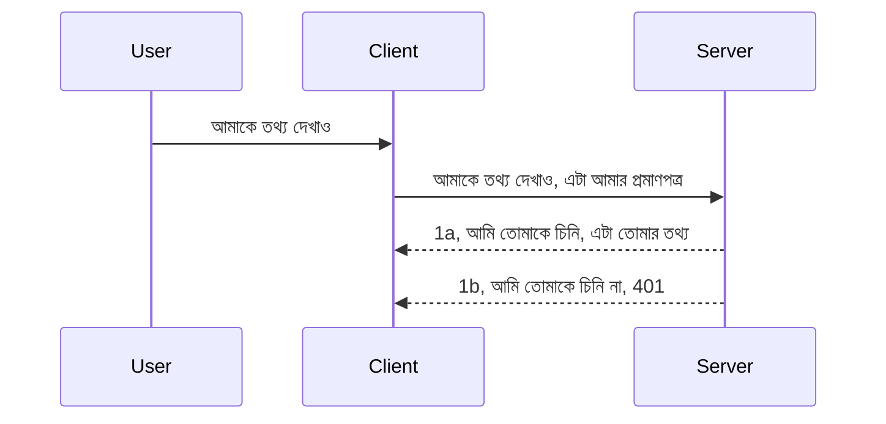

# সহজ অথ

MCP SDKs OAuth 2.1 ব্যবহারের জন্য সমর্থন করে যা সত্যিই একটি জটিল প্রক্রিয়া যার মধ্যে থাকে auth server, resource server, credentials পোস্ট করা, একটি কোড পাওয়া, বিয়ার টোকেনে কোড পরিবর্তন করা যতক্ষণ না আপনি অবশেষে আপনার resource ডেটা পেতে পারেন। আপনি যদি OAuth-এর সাথে অভ্যস্থ না হন, যা বাস্তবায়নের জন্য একটি দুর্দান্ত জিনিস, তাহলে কিছু মৌলিক স্তরের অথ দিয়ে শুরু করা এবং ক্রমান্বয় নিরাপত্তা উন্নয়নের দিকে গড়ে তোলা ভালো ধারণা। এই কারণেই এই অধ্যায়টি আছে, যাতে আপনাকে আরও উন্নত অথ-এর দিকে গড়ে তোলা যায়।

## অথ বলতে আমরা কী বুঝি?

অথ হল authentication এবং authorization-এর সংক্ষিপ্তরূপ। ধারণাটি হল আমাদের দুইটি কাজ করতে হবে:

- **অথেনটিকেশন**, যা হল জানতে পারার প্রক্রিয়া যে আমরা কারো আমাদের বাড়িতে প্রবেশ করতে দিই কিনা, অর্থাৎ তাদের "এখানে" থাকার অধিকার আছে কিনা, অর্থাৎ আমাদের Resource Server যেখানে MCP Server-এর ফিচারগুলি থাকে সেখানে তাদের অ্যাক্সেস আছে কিনা।
- **অথরাইজেশন**, হল জানতে পারার প্রক্রিয়া যে একজন ব্যবহারকারী তাদের অনুরোধকৃত নির্দিষ্ট রিসোর্সগুলিতে অ্যাক্সেস পাওয়া উচিত কিনা, উদাহরণস্বরূপ এই অর্ডারগুলি বা এই পণ্যগুলি অথবা তারা কন্টেন্ট পড়তে পারবে কিন্তু মুছে ফেলতে পারবে না, এমন আরেকটি উদাহরণ।

## Credentials: কিভাবে আমরা সিস্টেমকে বলি আমরা কে

ভালো, বেশিরভাগ ওয়েব ডেভেলপাররা সাধারণত সার্ভারকে একটি ক্রেডেনশিয়াল দেওয়ার কথা ভাবে, সাধারণত একটি সিক্রেট যা বলে তারা এখানে থাকার অধিকার পেয়েছে "Authentication"। এই ক্রেডেনশিয়াল সাধারণত ইউজারনেম এবং পাসওয়ার্ডের base64 এনকোডেড সংস্করণ বা একটি API কী যা নির্দিষ্ট একজন ব্যবহারকারীকে অনন্যভাবে পরিচয় দেয়।

এটি সাধারণত "Authorization" হেডার-এর মাধ্যমে পাঠানো হয় যেমন:

```json
{ "Authorization": "secret123" }
```

এটিকে সাধারণত basic authentication বলা হয়। এরপর মোট প্রবাহটি কাজ করে নিম্নরূপ:


এখন আমরা যখন বুঝতে পেরেছি এটি প্রবাহের দিক থেকে কিভাবে কাজ করে, কিভাবে আমরা এটি বাস্তবায়ন করবো? বেশিরভাগ ওয়েব সার্ভারের একটি middleware ধারণা থাকে, একটি কোডের অংশ যা অনুরোধের অংশ হিসেবে চলে এবং যা ক্রেডেনশিয়াল যাচাই করতে পারে, এবং যদি ক্রেডেনশিয়াল সঠিক হয় তবে অনুরোধকে পার হতে দেয়। যদি অনুরোধের বৈধ ক্রেডেনশিয়াল না থাকে তাহলে একটি অথ ত্রুটি প্রদর্শিত হয়। আসুন দেখি এটা কীভাবে বাস্তবায়ন করা যায়:

**Python**

```python
class AuthMiddleware(BaseHTTPMiddleware):
    async def dispatch(self, request, call_next):

        has_header = request.headers.get("Authorization")
        if not has_header:
            print("-> Missing Authorization header!")
            return Response(status_code=401, content="Unauthorized")

        if not valid_token(has_header):
            print("-> Invalid token!")
            return Response(status_code=403, content="Forbidden")

        print("Valid token, proceeding...")
       
        response = await call_next(request)
        # গ্রাহকের কোনো হেডার যোগ করুন বা উত্তরটির কোনো ভাবে পরিবর্তন করুন
        return response


starlette_app.add_middleware(CustomHeaderMiddleware)
```

এখানে আমরা:

- একটি middleware তৈরি করেছি যার নাম `AuthMiddleware` যেখানে এর `dispatch` পদ্ধতি ওয়েব সার্ভার দ্বারা কার্যকর করা হয়।
- middleware-টিকে ওয়েব সার্ভারে যুক্ত করেছি:

    ```python
    starlette_app.add_middleware(AuthMiddleware)
    ```

- যাচাইকরণ লজিক লিখেছি যা চেক করে Authorization header আছে কিনা এবং পাঠানো সিক্রেটটি বৈধ কিনা:

    ```python
    has_header = request.headers.get("Authorization")
    if not has_header:
        print("-> Missing Authorization header!")
        return Response(status_code=401, content="Unauthorized")

    if not valid_token(has_header):
        print("-> Invalid token!")
        return Response(status_code=403, content="Forbidden")
    ```

যদি সিক্রেট উপস্থিত এবং সঠিক হয়, তাহলে আমরা `call_next` কল করে অনুরোধটি পার হতে দেই এবং প্রতিক্রিয়া ফেরত দেই।

    ```python
    response = await call_next(request)
    # কাস্টমার হেডার যোগ করুন অথবা কোনোভাবে রেসপন্সে পরিবর্তন আনুন
    return response
    ```

প্রবাহ অনুযায়ী ওয়েব অনুরোধ সার্ভারের দিকে গেলে middleware চালু হবে এবং বাস্তবায়ন অনুযায়ী এটিকে অনুরোধ পার হতে দেবে অথবা একটি ত্রুটি ফেরত দেবে যা নির্দেশ করে যে ক্লায়েন্টকে এগিয়ে যাওয়া অনুমতি নেই।

**TypeScript**

এখানে আমরা জনপ্রিয় Express ফ্রেমওয়ার্ক ব্যবহার করে একটি middleware তৈরি করব এবং MCP Server-এ অনুরোধ পৌঁছানোর আগে অনুরোধ আটকাব। কোডটি নিচে:

```typescript
function isValid(secret) {
    return secret === "secret123";
}

app.use((req, res, next) => {
    // 1. অথোরাইজেশন হেডার উপস্থিত আছে?
    if(!req.headers["Authorization"]) {
        res.status(401).send('Unauthorized');
    }
    
    let token = req.headers["Authorization"];

    // 2. বৈধতা পরীক্ষা করুন।
    if(!isValid(token)) {
        res.status(403).send('Forbidden');
    }

   
    console.log('Middleware executed');
    // 3. অনুরোধ পাইপলাইনের পরবর্তী ধাপে অনুরোধ পাঠান।
    next();
});
```

এই কোডে আমরা:

1. প্রথমেই চেক করি Authorization header আছে কিনা, না থাকলে 401 ত্রুটি পাঠাই।
2. যাচাই করি ক্রেডেনশিয়াল/টোকেনটি বৈধ কিনা, না হলে 403 ত্রুটি পাঠাই।
3. অবশেষে অনুরোধটিকে অনুরোধ পাইপলাইনে পার করি এবং চাওয়া রিসোর্সটি ফেরত দেই।

## ব্যায়াম: অথেনটিকেশন বাস্তবায়ন করা

চলুন আমাদের জ্ঞানের ভিত্তিতে এটিকে বাস্তবায়ন করার চেষ্টা করি। পরিকল্পনাটি হলো:

সার্ভার

- একটি ওয়েব সার্ভার এবং MCP ইনস্ট্যান্স তৈরি করুন।
- সার্ভারের জন্য একটি middleware বাস্তবায়ন করুন।

ক্লায়েন্ট

- হেডারের মাধ্যমে ক্রেডেনশিয়াল সহ ওয়েব অনুরোধ পাঠান।

### -1- একটি ওয়েব সার্ভার এবং MCP ইনস্ট্যান্স তৈরি করা

প্রথম ধাপে, আমাদের একটি ওয়েব সার্ভার ইনস্ট্যান্স এবং MCP Server তৈরি করতে হবে।

**Python**

এখানে আমরা একটি MCP Server ইনস্ট্যান্স তৈরি করি, একটি starlette ওয়েব অ্যাপ তৈরি করি এবং uvicorn দিয়ে হোস্ট করি।

```python
# MCP সার্ভার তৈরি করা হচ্ছে

app = FastMCP(
    name="MCP Resource Server",
    instructions="Resource Server that validates tokens via Authorization Server introspection",
    host=settings["host"],
    port=settings["port"],
    debug=True
)

# starlette ওয়েব অ্যাপ তৈরি করা হচ্ছে
starlette_app = app.streamable_http_app()

# uvicorn এর মাধ্যমে অ্যাপ সার্ভ করা হচ্ছে
async def run(starlette_app):
    import uvicorn
    config = uvicorn.Config(
            starlette_app,
            host=app.settings.host,
            port=app.settings.port,
            log_level=app.settings.log_level.lower(),
        )
    server = uvicorn.Server(config)
    await server.serve()

run(starlette_app)
```

এই কোডে আমরা:

- MCP Server তৈরি করি।
- MCP Server থেকে starlette ওয়েব অ্যাপ তৈরি করি, `app.streamable_http_app()`।
- uvicorn ব্যবহার করে ওয়েব অ্যাপ হোস্ট এবং সার্ভ করি `server.serve()`।

**TypeScript**

এখানে আমরা একটি MCP Server ইনস্ট্যান্স তৈরি করি।

```typescript
const server = new McpServer({
      name: "example-server",
      version: "1.0.0"
    });

    // ... সার্ভার রিসোর্স, টুলস, এবং প্রম্পট সেট আপ করুন ...
```

এ MCP Server তৈরি আমাদের POST /mcp রুট ডেফিনিশনের ভিতরে করতে হবে, তাই উপরের কোডটি নিচের মত সরিয়ে নিই:

```typescript
import express from "express";
import { randomUUID } from "node:crypto";
import { McpServer } from "@modelcontextprotocol/sdk/server/mcp.js";
import { StreamableHTTPServerTransport } from "@modelcontextprotocol/sdk/server/streamableHttp.js";
import { isInitializeRequest } from "@modelcontextprotocol/sdk/types.js"

const app = express();
app.use(express.json());

// সেশন আইডি দ্বারা পরিবহণ সংরক্ষণ করার জন্য মানচিত্র
const transports: { [sessionId: string]: StreamableHTTPServerTransport } = {};

// ক্লায়েন্ট-টু-সার্ভার যোগাযোগের জন্য POST অনুরোধগুলি পরিচালনা করুন
app.post('/mcp', async (req, res) => {
  // বিদ্যমান সেশন আইডি পরীক্ষা করুন
  const sessionId = req.headers['mcp-session-id'] as string | undefined;
  let transport: StreamableHTTPServerTransport;

  if (sessionId && transports[sessionId]) {
    // বিদ্যমান পরিবহণ পুনরায় ব্যবহার করুন
    transport = transports[sessionId];
  } else if (!sessionId && isInitializeRequest(req.body)) {
    // নতুন আরম্ভ অনুরোধ
    transport = new StreamableHTTPServerTransport({
      sessionIdGenerator: () => randomUUID(),
      onsessioninitialized: (sessionId) => {
        // সেশন আইডি দ্বারা পরিবহণ সংরক্ষণ করুন
        transports[sessionId] = transport;
      },
      // DNS পুনঃবাইন্ডিং সুরক্ষা ডিফল্টভাবে পিছনে সামঞ্জস্যতার জন্য নিষ্ক্রিয় থাকে। আপনি যদি এই সার্ভারটি
      // স্থানীয়ভাবে চালান, নিশ্চিত করুন যে সেট করেছেন:
      // enableDnsRebindingProtection: true,
      // allowedHosts: ['127.0.0.1'],
    });

    // বন্ধ হওয়ার সময় পরিবহণ পরিষ্কার করুন
    transport.onclose = () => {
      if (transport.sessionId) {
        delete transports[transport.sessionId];
      }
    };
    const server = new McpServer({
      name: "example-server",
      version: "1.0.0"
    });

    // ... সার্ভার সম্পদ, সরঞ্জাম এবং প্রম্পটগুলি সেট আপ করুন ...

    // MCP সার্ভারে সংযোগ করুন
    await server.connect(transport);
  } else {
    // অবৈধ অনুরোধ
    res.status(400).json({
      jsonrpc: '2.0',
      error: {
        code: -32000,
        message: 'Bad Request: No valid session ID provided',
      },
      id: null,
    });
    return;
  }

  // অনুরোধ পরিচালনা করুন
  await transport.handleRequest(req, res, req.body);
});

// GET এবং DELETE অনুরোধের জন্য পুনঃব্যবহারযোগ্য হ্যান্ডলার
const handleSessionRequest = async (req: express.Request, res: express.Response) => {
  const sessionId = req.headers['mcp-session-id'] as string | undefined;
  if (!sessionId || !transports[sessionId]) {
    res.status(400).send('Invalid or missing session ID');
    return;
  }
  
  const transport = transports[sessionId];
  await transport.handleRequest(req, res);
};

// সার্ভার-টু-ক্লায়েন্ট বিজ্ঞপ্তির জন্য SSE মাধ্যমে GET অনুরোধগুলি পরিচালনা করুন
app.get('/mcp', handleSessionRequest);

// সেশন শেষ করার জন্য DELETE অনুরোধ পরিচালনা করুন
app.delete('/mcp', handleSessionRequest);

app.listen(3000);
```

এখন দেখুন MCP Server তৈরি `app.post("/mcp")` এর ভিতরে সরানো হয়েছে।

এখন middleware তৈরি করার পরবর্তী ধাপে যাই যাতে আমরা ক্রেডেনশিয়াল যাচাই করতে পারি।

### -2- সার্ভারের জন্য middleware বাস্তবায়ন করা

এখন middleware অংশে আসি। এখানে আমরা একটি middleware তৈরি করব যা Authorization header-এ ক্রেডেনশিয়াল খোঁজে এবং যাচাই করে। যদি সেটি গ্রহণযোগ্য হয়, তবে অনুরোধটি তার প্রয়োজনীয় কাজ করতে (উদাহরণস্বরূপ সরঞ্জাম তালিকা, একটি রিসোর্স পড়া বা кліএন্ট যে MCP ফাংশনালিটি চায় তা) এগিয়ে যাবে।

**Python**

middleware তৈরি করার জন্য, আমাদের একটি ক্লাস তৈরি করতে হবে যা `BaseHTTPMiddleware` থেকে উত্তরাধিকার সূত্রে প্রাপ্ত। এখানে দুটি গুরুত্বপূর্ণ অংশ:

- অনুরোধ `request`, যা থেকে আমরা header তথ্য পড়ব।
- `call_next` কলব্যাক যা কল করতে হবে যদি ক্লায়েন্ট একটি গ্রহণযোগ্য ক্রেডেনশিয়াল পাঠায়।

প্রথমে, যদি `Authorization` header অনুপস্থিত হয় সেই ক্ষেত্রে হ্যান্ডেল করতে হবে:

```python
has_header = request.headers.get("Authorization")

# কোনো হেডার উপস্থিত নেই, 401 দিয়ে ব্যর্থ হবে, অন্যথায় চালিয়ে যান।
if not has_header:
    print("-> Missing Authorization header!")
    return Response(status_code=401, content="Unauthorized")
```

এখানে আমরা 401 unauthorized বার্তা পাঠাই কারণ ক্লায়েন্ট অথেনটিকেশনে ব্যর্থ।

তারপর, যদি একটি ক্রেডেনশিয়াল পাঠানো হয়, তার বৈধতা যাচাই করতে হবে:

```python
 if not valid_token(has_header):
    print("-> Invalid token!")
    return Response(status_code=403, content="Forbidden")
```

উপরের কোডে 403 forbidden বার্তা পাঠানো হয়েছে। এখন সম্পূর্ণ middleware যা উপরের সবকিছু বাস্তবায়ন করে দেখুন:

```python
class AuthMiddleware(BaseHTTPMiddleware):
    async def dispatch(self, request, call_next):

        has_header = request.headers.get("Authorization")
        if not has_header:
            print("-> Missing Authorization header!")
            return Response(status_code=401, content="Unauthorized")

        if not valid_token(has_header):
            print("-> Invalid token!")
            return Response(status_code=403, content="Forbidden")

        print("Valid token, proceeding...")
        print(f"-> Received {request.method} {request.url}")
        response = await call_next(request)
        response.headers['Custom'] = 'Example'
        return response

```

ভালো, কিন্তু `valid_token` ফাংশন কী? এটি নিচে:

```python
# প্রোডাকশনের জন্য ব্যবহার করবেন না - এটি উন্নত করুন !!
def valid_token(token: str) -> bool:
    # "Bearer " প্রিফিক্সটি অপসারণ করুন
    if token.startswith("Bearer "):
        token = token[7:]
        return token == "secret-token"
    return False
```

এটি অবশ্যই উন্নত করা উচিত।

IMPORTANT: আপনি কখনোই এই ধরনের সিক্রেট কোডে রাখবেন না। আদর্শভাবে এটি ডাটাসোর্স বা IDP (identity service provider) থেকে তুলবেন বা ভালো হলে IDP নিজেই যাচাই করবে।

**TypeScript**

Express দিয়ে এটি বাস্তবায়ন করতে, আমাদের `use` মেথড কল করতে হবে যা middleware ফাংশন নেয়।

আমাদের করতে হবে:

- অনুরোধ ভেরিয়েবলে ইন্টারঅ্যাক্ট করে `Authorization` প্রোপার্টিতে পাওয়া ক্রেডেনশিয়াল পরীক্ষা করা।
- ক্রেডেনশিয়াল যাচাই করা, এবং যদি সঠিক হয় তাহলে অনুরোধকে চালিয়ে যেতে এবং кліএন্টের MCP অনুরোধ নিজেদের কাজ করতে দেয়া (যেমন সরঞ্জাম তালিকা, রিসোর্স পড়া বা যা জিজ্ঞাসা করেছে)।

এখানে, আমরা চেক করছি `Authorization` header আছে কিনা এবং না থাকলে অনুরোধ থামিয়ে দিচ্ছি:

```typescript
if(!req.headers["authorization"]) {
    res.status(401).send('Unauthorized');
    return;
}
```

যদি header প্রথমে পাঠানো না হয়, আপনি 401 পাবেন।

তারপর, আমরা যাচাই করি ক্রেডেনশিয়াল সঠিক কিনা, যদি না হয় তাহলে আবার অনুরোধ থামিয়ে দিই একটি ভিন্ন বার্তা সহ:

```typescript
if(!isValid(token)) {
    res.status(403).send('Forbidden');
    return;
} 
```

এবার আপনি 403 ত্রুটি পাবেন।

সম্পূর্ণ কোড এখানে:

```typescript
app.use((req, res, next) => {
    console.log('Request received:', req.method, req.url, req.headers);
    console.log('Headers:', req.headers["authorization"]);
    if(!req.headers["authorization"]) {
        res.status(401).send('Unauthorized');
        return;
    }
    
    let token = req.headers["authorization"];

    if(!isValid(token)) {
        res.status(403).send('Forbidden');
        return;
    }  

    console.log('Middleware executed');
    next();
});
```

আমরা ওয়েব সার্ভারে middleware গ্রহণ করার জন্য সেটআপ করেছি যাতে ক্লায়েন্ট যে ক্রেডেনশিয়াল পাঠাচ্ছে তা চেক করা হয়। ক্লায়েন্টের কি অবস্থা?

### -3- হেডারের মাধ্যমে ক্রেডেনশিয়াল সহ ওয়েব অনুরোধ পাঠানো

আমাদের নিশ্চিত করতে হবে ক্লায়েন্ট ক্রেডেনশিয়াল হেডারের মাধ্যমে পাঠাচ্ছে। যেহেতু আমরা MCP ক্লায়েন্ট ব্যবহার করব, আমাদের বুঝতে হবে এটা কিভাবে করা হয়।

**Python**

ক্লায়েন্টের জন্য, আমাদের ক্রেডেনশিয়াল সহ একটি হেডার পাঠাতে হবে যেমন:

```python
# মানটি হার্ডকোড করবেন না, কমপক্ষে এটি একটি পরিবেশ ভেরিয়েবলে বা আরও নিরাপদ সংরক্ষণে রাখুন
token = "secret-token"

async with streamablehttp_client(
        url = f"http://localhost:{port}/mcp",
        headers = {"Authorization": f"Bearer {token}"}
    ) as (
        read_stream,
        write_stream,
        session_callback,
    ):
        async with ClientSession(
            read_stream,
            write_stream
        ) as session:
            await session.initialize()
      
            # TODO, ক্লায়েন্টে আপনি যা করতে চান, যেমন টুলসের তালিকা তৈরি করা, টুলস কল করা ইত্যাদি।
```

দৃষ্টান্ত হিসাবে দেখুন কিভাবে `headers` প্রপার্টি পূরণ করা হয়েছে ` headers = {"Authorization": f"Bearer {token}"}` এর মতো।

**TypeScript**

এটি দুটি ধাপে সমাধান করা যায়:

1. একটি কনফিগারেশন অবজেক্ট তৈরি করুন ক্রেডেনশিয়ালের সাথে।
2. কনফিগারেশন অবজেক্ট ট্রান্সপোর্টে পাস করুন।

```typescript

// এখানে দেখানো মতো মানটি হার্ডকোড করবেন না। সর্বনিম্ন হিসাবে এটি একটি env ভেরিয়েবল হিসাবে রাখুন এবং dev মোডে dotenv এর মতো কিছু ব্যবহার করুন।
let token = "secret123"

// একটি ক্লায়েন্ট ট্রান্সপোর্ট অপশন অবজেক্ট সংজ্ঞায়িত করুন
let options: StreamableHTTPClientTransportOptions = {
  sessionId: sessionId,
  requestInit: {
    headers: {
      "Authorization": "secret123"
    }
  }
};

// অপশন অবজেক্টটিকে ট্রান্সপোর্টে পাস করুন
async function main() {
   const transport = new StreamableHTTPClientTransport(
      new URL(serverUrl),
      options
   );
```

এখানে দেখুন কিভাবে আমরা একটি `options` অবজেক্ট তৈরি করেছি এবং `requestInit` প্রোপার্টির নিচে হেডার যুক্ত করেছি।

IMPORTANT: কিন্তু এখানে থেকে কিভাবে উন্নতি করবেন? বর্তমান বাস্তবায়নে কিছু সমস্যা আছে। প্রথমত, একটি ক্রেডেনশিয়াল এভাবে পাঠানো বেশ ঝুঁকিপূর্ণ যদি আপনার কাছে কমপক্ষে HTTPS না থাকে। এমনকি তখন ক্রেডেনশিয়াল চুরি হতে পারে তাই আপনাকে এমন একটি সিস্টেম দরকার যেখানে সহজেই টোকেন বাতিল করা যাবে এবং অতিরিক্ত চেক করা যাবে যেমন কোথা থেকে অনুরোধ আসছে, অনুরোধ খুব বেশি হচ্ছে কিনা (বটের মতো আচরণ), সংক্ষেপে অনেক বিষয় বিবেচনা করতে হবে।

বলতেই হবে, খুবই সহজ API যেখানে আপনি চান না কেউ অথেনটিকেশন ছাড়া আপনার API কল করুক, সেখানে এটি একটি ভাল সূচনা।

তাই আসুন কিছুটা নিরাপত্তা বাড়াই JSON Web Token (JWT অথবা "জোট") ব্যবহার করে।

## JSON Web Tokens, JWT

তাহলে, আমরা খুব সহজ ক্রেডেনশিয়াল পাঠানোর থেকে উন্নত করার চেষ্টা করছি। JWT গ্রহণ করে আমরা কি কি মুহূর্তেই উন্নতি করি?

- **নিরাপত্তা উন্নতি**: basic auth-এ আপনি ইউজারনেম পাসওয়ার্ড base64 এনকোডেড টোকেন (অথবা API কী) বার বার পাঠান যা ঝুঁকি বাড়ায়। JWT-এ আপনি ইউজারনেম-পাসওয়ার্ড পাঠান এবং একটি টোকেন পান যা সময়-নির্ধারিত। JWT আপনাকে সূক্ষ্ম-গ্রেডড এক্সেস কন্ট্রোল (রোল, স্কোপ, অনুমতি) সহজে ব্যবহার করতে দেয়।
- **স্ট্যাটলেসনেস এবং স্কেলেবিলিটি**: JWT স্বয়ংসম্পূর্ণ, সব ব্যবহারকারীর তথ্য বহন করে এবং সার্ভার-সাইড সেশন সংরক্ষণের প্রয়োজন মুছে ফেলে। টোকেন লোকালি যাচাই করা যায়।
- **ইন্টারঅপারেবিলিটি এবং ফেডারেশন**: JWT Open ID Connect-এর কেন্দ্র এবং Entra ID, Google Identity ও Auth0-এর মতো পরিচিত আইডেন্টিটি প্রদানকারীদের সাথে ব্যবহৃত হয়। তারা সিঙ্গেল সাইন-অন সহ অনেক কিছু করার সুযোগ করে দেয় যা এটিকে এন্টারপ্রাইজ-গ্রেড করে তোলে।
- **মডুলারিটি এবং নমনীয়তা**: JWT API গেটওয়েজ যেমন Azure API Management, NGINX ইত্যাদির সঙ্গেও ব্যবহার করা যায়। এটি ব্যবহারকারী অথেনটিকেশন এবং সার্ভার-টু-সার্ভিস যোগাযোগ সহ উপস্থাপনা এবং প্রতিনিধি অধিকারী ব্যবস্থা সমর্থন করে।
- **পারফরম্যান্স এবং ক্যাশিং**: ডিকোডের পর JWT ক্যাশ করা যায় যা পার্সিং প্রয়োজন কমায়। এটি বিশেষ করে উচ্চ-ট্রাফিক অ্যাপে সাহায্য করে পারফরম্যান্স উন্নত করতে।
- **উন্নত ফিচার**: এটি ইন্ট্রোস্পেকশন (সার্ভারে বৈধতা পরীক্ষা) এবং রিভোকেশন (টোকেন অবৈধ করা) সমর্থন করে।

এই সব সুবিধা নিয়ে, আসুন দেখি কিভাবে আমাদের বাস্তবায়ন আরও উন্নত করতে পারি।

## Basic Auth থেকে JWT তে রূপান্তর

বড় আঁকায়, আমাদের করতে হবে:

- **JWT টোকেন গঠন শিখুন** এবং এটি ক্লায়েন্ট থেকে সার্ভারে পাঠানোর জন্য প্রস্তুত করুন।
- **JWT টোকেন যাচাই করুন**, এবং সঠিক হলে ক্লায়েন্টকে আমাদের রিসোর্স দিন।
- **টোকেন সুরক্ষিত সংরক্ষণ**। টোকেন কিভাবে সংরক্ষণ করবেন।
- **রুটগুলো সুরক্ষিত করুন**। আমাদের রুটগুলো এবং MCP-র নির্দিষ্ট ফিচারগুলো সুরক্ষিত করতে হবে।
- **রিফ্রেশ টোকেন যুক্ত করুন**। ক্ষণস্থায়ী টোকেন তৈরি করুন এবং দীর্ঘস্থায়ী রিফ্রেশ টোকেন যা মেয়াদোত্তীর্ণ হলে নতুন টোকেন পাওয়ার জন্য ব্যবহার করা যাবে। রিফ্রেশ এন্ডপয়েন্ট ও রোটেশন স্ট্র্যাটেজি থাকতে হবে।

### -1- JWT টোকেন তৈরি করা

প্রথমত, একটি JWT টোকেনের অংশগুলো:

- **header**, ব্যবহৃত অ্যালগরিদম এবং টোকেনের ধরণ।
- **payload**, দাবিসমূহ যেমন sub (ব্যবহারকারী বা সত্তা যাকে টোকেন প্রতিনিধিত্ব করে, সাধারণত userid), exp (মেয়াদ শেষের সময়), role (ভূমিকা)
- **signature**, সিক্রেট বা প্রাইভেট কী দিয়ে সাইন করা।

এটার জন্য আমাদের header, payload গঠন করতে হবে এবং এনকোড করা টোকেন তৈরি করতে হবে।

**Python**

```python

import jwt
import jwt
from jwt.exceptions import ExpiredSignatureError, InvalidTokenError
import datetime

# JWT সাইন করার জন্য ব্যবহৃত গোপন কী
secret_key = 'your-secret-key'

header = {
    "alg": "HS256",
    "typ": "JWT"
}

# ব্যবহারকারীর তথ্য এবং এর দাবি এবং মেয়াদ শেষের সময়
payload = {
    "sub": "1234567890",               # বিষয় (ব্যবহারকারীর আইডি)
    "name": "User Userson",                # কাস্টম দাবি
    "admin": True,                     # কাস্টম দাবি
    "iat": datetime.datetime.utcnow(),# ইস্যুকৃত সময়
    "exp": datetime.datetime.utcnow() + datetime.timedelta(hours=1)  # মেয়াদ শেষ হওয়ার সময়
}

# এটি এনকোড করুন
encoded_jwt = jwt.encode(payload, secret_key, algorithm="HS256", headers=header)
```

উপরের কোডে আমরা:

- HS256 অ্যালগরিদম এবং JWT টাইপ সহ header সংজ্ঞায়িত করেছি।
- Payload তৈরি করেছি যার মধ্যে sub বা user id, username, role, ইস্যুকৃত সময় এবং মেয়াদ শেষের সময় অন্তর্ভুক্ত যা সময়সীমার দিক সম্পাদন করে।

**TypeScript**

এখানে আমাদের কিছু ডিপেনডেন্সি লাগবে যা JWT টোকেন গঠনে সাহায্য করবে।

Dependencies

```sh

npm install jsonwebtoken
npm install --save-dev @types/jsonwebtoken
```

এখন এগুলো থাকলে, header, payload তৈরি করে এনকোড করা টোকেন তৈরি করি।

```typescript
import jwt from 'jsonwebtoken';

const secretKey = 'your-secret-key'; // প্রোডাকশনে env vars ব্যবহার করুন

// পেলোড সংজ্ঞায়িত করুন
const payload = {
  sub: '1234567890',
  name: 'User usersson',
  admin: true,
  iat: Math.floor(Date.now() / 1000), // ইস্যুকৃত সময়
  exp: Math.floor(Date.now() / 1000) + 60 * 60 // ১ ঘন্টা পরে মেয়াদ উত্তীর্ণ হবে
};

// হেডার সংজ্ঞায়িত করুন (ঐচ্ছিক, jsonwebtoken ডিফল্ট সেট করে)
const header = {
  alg: 'HS256',
  typ: 'JWT'
};

// টোকেন তৈরি করুন
const token = jwt.sign(payload, secretKey, {
  algorithm: 'HS256',
  header: header
});

console.log('JWT:', token);
```

এই টোকেনটি:

HS256 দিয়ে সাইন করা
১ ঘণ্টা বৈধ
Claims-এ sub, name, admin, iat, এবং exp রয়েছে।

### -2- টোকেন যাচাই করা

টোকেন যাচাই করাও দরকার, এটা সার্ভারে করতে হবে যাতে নিশ্চিত হওয়া যায় ক্লায়েন্ট যা পাঠাচ্ছে তা সঠিক। অনেক যাচাই করা দরকার যেমন টোকেনের গঠন এবং বৈধতা। আপনি আরও যাচাইকরণের জন্য উৎসাহিত যা ব্যবহারকারী আপনার সিস্টেমে আছে কিনা এবং আরও।

টোকেন যাচাই করতে, এটা ডিকোড করতে হবে যাতে পড়া যায় এবং তারপর যাচাই শুরু করতে হয়:

**Python**

```python

# JWT ডিকোড এবং যাচাই করুন
try:
    decoded = jwt.decode(token, secret_key, algorithms=["HS256"])
    print("✅ Token is valid.")
    print("Decoded claims:")
    for key, value in decoded.items():
        print(f"  {key}: {value}")
except ExpiredSignatureError:
    print("❌ Token has expired.")
except InvalidTokenError as e:
    print(f"❌ Invalid token: {e}")

```

এই কোডে, `jwt.decode` কল করি টোকেন, সিক্রেট কী এবং অ্যালগরিদম দিয়ে। লক্ষ্য করুন try-catch ব্যবহার করা হয়েছে কারন ব্যর্থ যাচাই হলে ত্রুটি হবে।

**TypeScript**

এখানে `jwt.verify` কল করতে হবে যাতে আমরা ডিকোড করা টোকেন পাই যা আমরা বিশ্লেষণ করতে পারি। যদি কল ব্যর্থ হয়, টোকেনের গঠন ভুল বা বৈধ নয়।

```typescript

try {
  const decoded = jwt.verify(token, secretKey);
  console.log('Decoded Payload:', decoded);
} catch (err) {
  console.error('Token verification failed:', err);
}
```

NOTE: আগেই বলেছি, আমাদের অতিরিক্ত যাচাই করতে হবে যে এই টোকেনের নির্দেশিত ব্যবহারকারী আমাদের সিস্টেমে আছে কিনা এবং ব্যবহারকারী তার দাবিকৃত অধিকারগুলো রাখে কিনা।

এখন, চলুন রোল-ভিত্তিক অ্যাক্সেস কন্ট্রোল (RBAC) দেখি।
## ভূমিকা ভিত্তিক অ্যাকসেস নিয়ন্ত্রণ যোগ করা

আইডিয়াটি হল আমরা প্রকাশ করতে চাই যে বিভিন্ন ভূমিকা বিভিন্ন অনুমতি পায়। উদাহরণস্বরূপ, আমরা অনুমান করি যে একজন অ্যাডমিন সবকিছু করতে পারে এবং একজন সাধারণ ব্যবহারকারী পড়া/লিখা করতে পারে এবং একজন অতিথি কেবল পড়তে পারে। তাই, এখানে কিছু সম্ভাব্য অনুমতি স্তর রয়েছে:

- Admin.Write  
- User.Read  
- Guest.Read  

চলুন দেখি কিভাবে আমরা এমন একটি নিয়ন্ত্রণ middleware দিয়ে বাস্তবায়ন করতে পারি। Middleware গুলো প্রতি রুটে যোগ করা যেতে পারে এবং সকল রুটের জন্যও যোগ করা যায়।

**Python**

```python
from starlette.middleware.base import BaseHTTPMiddleware
from starlette.responses import JSONResponse
import jwt

# গোপন তথ্য কোডে রাখবেন না, এটি শুধুমাত্র প্রদর্শনীর উদ্দেশ্যে। এটি একটি নিরাপদ স্থান থেকে পড়ুন।
SECRET_KEY = "your-secret-key" # এটিকে env ভেরিয়েবলে রাখুন
REQUIRED_PERMISSION = "User.Read"

class JWTPermissionMiddleware(BaseHTTPMiddleware):
    async def dispatch(self, request, call_next):
        auth_header = request.headers.get("Authorization")
        if not auth_header or not auth_header.startswith("Bearer "):
            return JSONResponse({"error": "Missing or invalid Authorization header"}, status_code=401)

        token = auth_header.split(" ")[1]
        try:
            decoded = jwt.decode(token, SECRET_KEY, algorithms=["HS256"])
        except jwt.ExpiredSignatureError:
            return JSONResponse({"error": "Token expired"}, status_code=401)
        except jwt.InvalidTokenError:
            return JSONResponse({"error": "Invalid token"}, status_code=401)

        permissions = decoded.get("permissions", [])
        if REQUIRED_PERMISSION not in permissions:
            return JSONResponse({"error": "Permission denied"}, status_code=403)

        request.state.user = decoded
        return await call_next(request)


```
  
middleware যোগ করার নিচের মতো কয়েকটি ভিন্ন উপায় রয়েছে:

```python

# বিকল্প ১: স্টারলেট অ্যাপ তৈরি করার সময় মিডলওয়্যার যোগ করুন
middleware = [
    Middleware(JWTPermissionMiddleware)
]

app = Starlette(routes=routes, middleware=middleware)

# বিকল্প ২: স্টারলেট অ্যাপ ইতিমধ্যে তৈরি হওয়ার পরে মিডলওয়্যার যোগ করুন
starlette_app.add_middleware(JWTPermissionMiddleware)

# বিকল্প ৩: প্রতিটি রুট অনুযায়ী মিডলওয়্যার যোগ করুন
routes = [
    Route(
        "/mcp",
        endpoint=..., # হ্যান্ডলার
        middleware=[Middleware(JWTPermissionMiddleware)]
    )
]
```
  
**TypeScript**

আমরা `app.use` এবং একটি middleware ব্যবহার করতে পারি যা সব অনুরোধের জন্য চলবে।

```typescript
app.use((req, res, next) => {
    console.log('Request received:', req.method, req.url, req.headers);
    console.log('Headers:', req.headers["authorization"]);

    // 1. যাচাই করুন যে অথুরাইজেশন হেডার পাঠানো হয়েছে কিনা

    if(!req.headers["authorization"]) {
        res.status(401).send('Unauthorized');
        return;
    }
    
    let token = req.headers["authorization"];

    // 2. যাচাই করুন যে টোকেনটি বৈধ কিনা
    if(!isValid(token)) {
        res.status(403).send('Forbidden');
        return;
    }  

    // 3. যাচাই করুন যে টোকেন ব্যবহারকারী আমাদের সিস্টেমে আছে কিনা
    if(!isExistingUser(token)) {
        res.status(403).send('Forbidden');
        console.log("User does not exist");
        return;
    }
    console.log("User exists");

    // 4. যাচাই করুন যে টোকেনের সঠিক অনুমতি রয়েছে কিনা
    if(!hasScopes(token, ["User.Read"])){
        res.status(403).send('Forbidden - insufficient scopes');
    }

    console.log("User has required scopes");

    console.log('Middleware executed');
    next();
});

```
  
আমাদের middleware এ কিছু কাজ আমরা করতে পারি এবং middleware এ অবশ্যই এই কাজগুলো করা উচিত, যথা:

1. যাচাই করা যে authorization header উপস্থিত আছে কিনা  
2. যাচাই করা যে token বৈধ কিনা, আমরা `isValid` কল করি যা একটি মেথড যা আমরা লিখেছি এবং যা JWT টোকেনের অখণ্ডতা এবং বৈধতা পরীক্ষা করে।  
3. যাচাই করা যে ব্যবহারকারী আমাদের সিস্টেমে আছে কিনা, এটা আমাদের অবশ্যই পরীক্ষা করা উচিত।  

   ```typescript
    // ডাটাবেসে ব্যবহারকারীরা
   const users = [
     "user1",
     "User usersson",
   ]

   function isExistingUser(token) {
     let decodedToken = verifyToken(token);

     // TODO, যাচাই করুন ব্যবহারকারী ডাটাবেসে আছে কিনা
     return users.includes(decodedToken?.name || "");
   }
   ```
  
উপরের কোডে, আমরা একটি খুবই সহজ `users` তালিকা তৈরি করেছি, যা অবশ্যই একটি ডাটাবেসে থাকা উচিত।

4. অতিরিক্তভাবে, আমরা টোকেনের সঠিক অনুমতি আছে কিনা তাও পরীক্ষা করা উচিত।

   ```typescript
   if(!hasScopes(token, ["User.Read"])){
        res.status(403).send('Forbidden - insufficient scopes');
   }
   ```
  
middleware থেকে উপরের কোডে, আমরা যাচাই করি টোকেনে User.Read অনুমতি আছে কিনা, না থাকলে 403 ত্রুটি পাঠানো হয়। নিচে `hasScopes` সহায়ক মেথড দেওয়া হয়েছে।

   ```typescript
   function hasScopes(scope: string, requiredScopes: string[]) {
     let decodedToken = verifyToken(scope);
    return requiredScopes.every(scope => decodedToken?.scopes.includes(scope));
  }  
   ```

Have a think which additional checks you should be doing, but these are the absolute minimum of checks you should be doing.

Using Express as a web framework is a common choice. There are helpers library when you use JWT so you can write less code.

- `express-jwt`, helper library that provides a middleware that helps decode your token.
- `express-jwt-permissions`, this provides a middleware `guard` that helps check if a certain permission is on the token.

Here's what these libraries can look like when used:

```typescript
const express = require('express');
const jwt = require('express-jwt');
const guard = require('express-jwt-permissions')();

const app = express();
const secretKey = 'your-secret-key'; // put this in env variable

// Decode JWT and attach to req.user
app.use(jwt({ secret: secretKey, algorithms: ['HS256'] }));

// Check for User.Read permission
app.use(guard.check('User.Read'));

// multiple permissions
// app.use(guard.check(['User.Read', 'Admin.Access']));

app.get('/protected', (req, res) => {
  res.json({ message: `Welcome ${req.user.name}` });
});

// Error handler
app.use((err, req, res, next) => {
  if (err.code === 'permission_denied') {
    return res.status(403).send('Forbidden');
  }
  next(err);
});

```
  
এখন আপনি দেখেছেন কিভাবে middleware authentication এবং authorization দুইয়ের জন্য ব্যবহার করা যায়, MCP সম্পর্কে কেমন? এটি কি আমাদের auth করার পদ্ধতি পরিবর্তন করে? চলুন পরবর্তী বিভাগে দেখি।

### -3- MCP তে RBAC যোগ করা

এখন পর্যন্ত আপনি middleware ব্যবহার করে কিভাবে RBAC যোগ করা যায় তা দেখেছেন, তবে MCP এর জন্য প্রতি MCP ফিচার RBAC যোগ করা সহজ নয়, তাহলে আমরা কি করব? হ্যাঁ, আমরা এমন কোড যোগ করব যা নিরীক্ষণ করবে ক্লায়েন্টের নির্দিষ্ট টুল কল করার অধিকার আছে কিনা:

আপনার কাছে প্রতি ফিচার RBAC অর্জনের কয়েকটি ভিন্ন পদ্ধতি রয়েছে, যেমন:

- প্রতিটি টুল, রিসোর্স, প্রম্পট এর জন্য একটি চেক যোগ করুন যেখানে অনুমতি স্তর পরীক্ষা করতে হবে।

   **python**

   ```python
   @tool()
   def delete_product(id: int):
      try:
          check_permissions(role="Admin.Write", request)
      catch:
        pass # ক্লায়েন্ট অনুমোদনে ব্যর্থ হয়েছে, অনুমোদন ত্রুটি তুলুন
   ```
  
   **typescript**

   ```typescript
   server.registerTool(
    "delete-product",
    {
      title: Delete a product",
      description: "Deletes a product",
      inputSchema: { id: z.number() }
    },
    async ({ id }) => {
      
      try {
        checkPermissions("Admin.Write", request);
        // করার জন্য, productService এবং remote entry-তে আইডি পাঠান
      } catch(Exception e) {
        console.log("Authorization error, you're not allowed");  
      }

      return {
        content: [{ type: "text", text: `Deletected product with id ${id}` }]
      };
    }
   );
   ```


- উন্নত সার্ভার পদ্ধতি এবং রিকোয়েস্ট হ্যান্ডলার ব্যবহার করুন যাতে যাচাই করার স্থানগুলোর সংখ্যা কমানো যায়।

   **Python**

   ```python
   
   tool_permission = {
      "create_product": ["User.Write", "Admin.Write"],
      "delete_product": ["Admin.Write"]
   }

   def has_permission(user_permissions, required_permissions) -> bool:
      # user_permissions: ব্যবহারকারীর অনুমতিগুলির তালিকা
      # required_permissions: সরঞ্জামের জন্য প্রয়োজনীয় অনুমতিগুলির তালিকা
      return any(perm in user_permissions for perm in required_permissions)

   @server.call_tool()
   async def handle_call_tool(
     name: str, arguments: dict[str, str] | None
   ) -> list[types.TextContent]:
    # ধরে নিন request.user.permissions হল ব্যবহারকারীর অনুমতির একটি তালিকা
     user_permissions = request.user.permissions
     required_permissions = tool_permission.get(name, [])
     if not has_permission(user_permissions, required_permissions):
        # ত্রুটি উত্থাপন করুন "আপনার টুল {name} কল করার অনুমতি নেই"
        raise Exception(f"You don't have permission to call tool {name}")
     # চালিয়ে যান এবং টুল কল করুন
     # ...
   ```   
   

   **TypeScript**

   ```typescript
   function hasPermission(userPermissions: string[], requiredPermissions: string[]): boolean {
       if (!Array.isArray(userPermissions) || !Array.isArray(requiredPermissions)) return false;
       // ব্যবহারকারীর কাছে কমপক্ষে একটি প্রয়োজনীয় অনুমতি থাকলে সত্য ফেরত দিন
       
       return requiredPermissions.some(perm => userPermissions.includes(perm));
   }
  
   server.setRequestHandler(CallToolRequestSchema, async (request) => {
      const { params: { name } } = request;
  
      let permissions = request.user.permissions;
  
      if (!hasPermission(permissions, toolPermissions[name])) {
         return new Error(`You don't have permission to call ${name}`);
      }
  
      // চালিয়ে যাও..
   });
   ```
  
   লক্ষণীয়, আপনাকে নিশ্চিত করতে হবে middleware ডিকোড করা টোকেন request এর user প্রপার্টিতে অ্যাসাইন করছে যাতে উপরোক্ত কোড সহজ হয়।

### সারসংক্ষেপ

এখন আমরা সাধারণভাবে এবং বিশেষ করে MCP এর জন্য RBAC যোগ করার বিষয়ে আলোচনা করেছি, আপনার নিজের থেকে নিরাপত্তা বাস্তবায়ন করার চেষ্টা করার সময় এসেছে যাতে আপনি প্রদত্ত ধারণাগুলো বুঝতে পারেন।

## অ্যাসাইনমেন্ট ১: বেসিক অথেন্টিকেশন ব্যবহার করে একটি MCP সার্ভার এবং MCP ক্লায়েন্ট তৈরি করুন

এখানে আপনি শিখেছেন কীভাবে ক্রেডেনশিয়ালস হেডারস এর মাধ্যমে পাঠানো যায়।

## সমাধান ১

[সমাধান ১](./code/basic/README.md)

## অ্যাসাইনমেন্ট ২: অ্যাসাইনমেন্ট ১ এর সমাধান উন্নত করে JWT ব্যবহার করুন

প্রথম সমাধানটি নিন, কিন্তু এবার এটি উন্নত করুন।

বেসিক অথ এর পরিবর্তে JWT ব্যবহার করুন।

## সমাধান ২

[সমাধান ২](./solution/jwt-solution/README.md)

## চ্যালেঞ্জ

"Add RBAC to MCP" অংশে বর্ণিত টুল প্রতি RBAC যোগ করুন।

## সারসংক্ষেপ

এই অধ্যায়ে আপনি আশা করি অনেক কিছু শিখেছেন—সম্পূর্ণ নিরাপত্তাহীনতা থেকে শুরু করে বেসিক নিরাপত্তা, JWT এবং কিভাবে এটি MCP তে যোগ করা যায়।

আমরা কাস্টম JWT দিয়ে একটি শক্ত ভিত্তি তৈরি করেছি, তবে স্কেল আপ করার সাথে সাথে আমরা একটি স্ট্যান্ডার্ড ভিত্তিক পরিচিতিমূলক মডেলের দিকে এগিয়ে যাচ্ছি। Entra বা Keycloak এর মত IdP গ্রহণ করলে আমরা টোকেন ইস্যু, বৈধতা, এবং লাইফসাইকেল পরিচালনার দায়িত্ব নির্ভরযোগ্য প্ল্যাটফর্মে দিয়েতে পারি — যেটি আমাদের অ্যাপ লজিক এবং ব্যবহারকারীর অভিজ্ঞতার প্রতি মনোনিবেশ করতে সাহায্য করে।

তার জন্য আমাদের একটি [উন্নত অধ্যায় Entra সম্পর্কে](../../05-AdvancedTopics/mcp-security-entra/README.md) রয়েছে।

## পরবর্তী কি

- পরবর্তী: [MCP হোস্ট সেটআপ করা](../12-mcp-hosts/README.md)

---

<!-- CO-OP TRANSLATOR DISCLAIMER START -->
**ডিসক্লेमার**:  
এই ডকুমেন্টটি AI অনুবাদ সেবা [Co-op Translator](https://github.com/Azure/co-op-translator) ব্যবহার করে অনূদিত হয়েছে। যদিও আমরা যথাসম্ভব সঠিকতার জন্য চেষ্টা করি, অনুগ্রহ করে লক্ষ্য করুন যে স্বয়ংক্রিয় অনুবাদে ত্রুটি বা ভুল থাকতে পারে। মূল ডকুমেন্টটি তার জাতীয় ভাষায় কর্তৃপক্ষপ্রাপ্ত উৎস হিসাবে বিবেচিত হওয়া উচিত। গুরুত্বপূর্ণ তথ্যের জন্য পেশাদার মানব অনুবাদ প্রয়োজন। এই অনুবাদ ব্যবহারের ফলে সৃষ্ট যেকোনো ভুল বোঝাবুঝি বা ব্যাখ্যার জন্য আমরা দায়ী নই।
<!-- CO-OP TRANSLATOR DISCLAIMER END -->