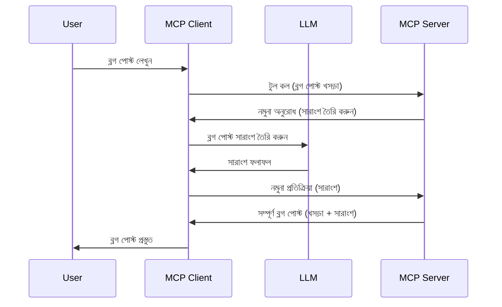

# নমুনা সংগ্রহ - ক্লায়েন্টের কাছে বৈশিষ্ট্যগুলি প্রতিনিধিত্ব করা

কখনও কখনও, আপনাকে MCP ক্লায়েন্ট এবং MCP সার্ভারকে একটি সাধারণ লক্ষ্য অর্জনের জন্য সহযোগিতা করতে হবে। এমন একটি পরিস্থিতি থাকতে পারে যেখানে সার্ভারকে ক্লায়েন্টে থাকা একটি LLM-এর সাহায্য প্রয়োজন। এই পরিস্থিতির জন্য, নমুনা সংগ্রহ হল যা আপনি ব্যবহার করা উচিত।

চলুন কিছু ব্যবহার ক্ষেত্র এবং নমুনা সংগ্রহ জড়িত একটি সমাধান কীভাবে তৈরি করতে হয় তা অন্বেষণ করি।

## ওভারভিউ

এই পাঠে, আমরা যেখানে এবং কখন নমুনা সংগ্রহ ব্যবহার করতে হয় তা ব্যাখ্যা এবং কনফিগারেশন করার উপর মনোযোগ দেব।

## শেখার উদ্দেশ্য

এই অধ্যায়ে, আমরা:

- নমুনা সংগ্রহ কী এবং কখন এটি ব্যবহার করবেন তা ব্যাখ্যা করব।
- MCP-তে নমুনা সংগ্রহ কীভাবে কনফিগার করতে হয় তা দেখাব।
- নমুনা সংগ্রহের কর্মের উদাহরণ প্রদান করব।

## নমুনা সংগ্রহ কী এবং কেন এটি ব্যবহার করবেন?

নমুনা সংগ্রহ একটি উন্নত বৈশিষ্ট্য যা নিম্নলিখিতভাবে কাজ করে:


### নমুনা সংগ্রহ অনুরোধ

ঠিক আছে, এখন আমাদের কাছে একটি বিশ্বাসযোগ্য পরিস্থিতির উচ্চ স্তরের চিত্র রয়েছে, চলুন ক্লায়েন্টকে বিতরণ সার্ভার যে নমুনা সংগ্রহ অনুরোধ পাঠায় তা নিয়ে কথা বলি। JSON-RPC ফরম্যাটে এরকম একটি অনুরোধ দেখতে এমন হতে পারে:

```json
{
  "jsonrpc": "2.0",
  "id": 1,
  "method": "sampling/createMessage",
  "params": {
    "messages": [
      {
        "role": "user",
        "content": {
          "type": "text",
          "text": "Create a blog post summary of the following blog post: <BLOG POST>"
        }
      }
    ],
    "modelPreferences": {
      "hints": [
        {
          "name": "claude-3-sonnet"
        }
      ],
      "intelligencePriority": 0.8,
      "speedPriority": 0.5
    },
    "systemPrompt": "You are a helpful assistant.",
    "maxTokens": 100
  }
}
```

এখানে কয়েকটি বিষয় উল্লেখ করার মতো:

- Prompt, content -> text এর অধীনে, হল আমাদের প্রম্পট যা LLM কে ব্লগ পোস্টের বিষয়বস্তু সংক্ষিপ্ত করার নির্দেশনা।

- **modelPreferences**। এই অংশটি হলো একটি পছন্দ, LLM এর সাথে কোন কনফিগারেশন ব্যবহার করা উচিত সে বিষয়ে একটি সুপারিশ। ব্যবহারকারী সিদ্ধান্ত নিতে পারেন যে এই সুপারিশগুলি অনুসরণ করবেন বা পরিবর্তন করবেন। এই ক্ষেত্রে মডেলের ব্যবহার এবং গতি ও বুদ্ধিমত্তার অগ্রাধিকারের বিষয়ে সুপারিশ রয়েছে।
- **systemPrompt**, এটি আপনার সাধারণ সিস্টেম প্রম্পট যা আপনার LLM কে একটি ব্যক্তিত্ব দেয় এবং নির্দেশনামূলক দিকনির্দেশনা রয়েছে।
- **maxTokens**, এটি আরেকটি বৈশিষ্ট্য যা বলে কতটুকু টোকেন ব্যবহারের পরামর্শ দেওয়া হয় এই কাজের জন্য।

### নমুনা সংগ্রহ প্রতিক্রিয়া

এই প্রতিক্রিয়াটি MCP ক্লায়েন্ট অবশেষে MCP সার্ভারে ফেরত পাঠায় এবং এটি ক্লায়েন্ট LLM কল করার ফলাফল, প্রতিক্রিয়াটি অপেক্ষা করে তারপর এই বার্তাটি গঠন করে। JSON-RPC এ এটি দেখতে নিম্নরূপ হতে পারে:

```json
{
  "jsonrpc": "2.0",
  "id": 1,
  "result": {
    "role": "assistant",
    "content": {
      "type": "text",
      "text": "Here's your abstract <ABSTRACT>"
    },
    "model": "gpt-5",
    "stopReason": "endTurn"
  }
}
```

দ্রষ্টব্য, প্রতিক্রিয়াটি ব্লগ পোস্টের একটি সারাংশ যেমনি আমরা চাইেছিলাম তেমনি। এছাড়া লক্ষ্য করুন ব্যবহৃত `model` আমরা যা চেয়েছিলাম তা নয় বরং "gpt-5" যা "claude-3-sonnet" এর পরিবর্তে। এটি দেখানোর জন্য যে ব্যবহারকারী কোনটি ব্যবহার করবেন সে বিষয়ে মন পরিবর্তন করতে পারে এবং আপনার নমুনা সংগ্রহ অনুরোধ একটি সুপারিশ।

ঠিক আছে, এখন যেহেতু আমরা মূল প্রবাহ বুঝে গেছি, এবং "ব্লগ পোস্ট তৈরি + সারাংশ" এর মতো উপযোগী কাজের জন্য এটি ব্যবহার করা যায়, চলুন দেখি এটি কাজ করানোর জন্য কী করতে হবে।

### বার্তার ধরণসমূহ

নমুনা সংগ্রহ বার্তা শুধুমাত্র টেক্সটেই সীমাবদ্ধ নয়, আপনি ছবি এবং অডিওও পাঠাতে পারেন। JSON-RPC এর ভিন্ন রূপ এখানে:

**টেক্সট**

```json
{
  "type": "text",
  "text": "The message content"
}
```

**ছবির বিষয়বস্তু**

```json
{
  "type": "image",
  "data": "base64-encoded-image-data",
  "mimeType": "image/jpeg"
}
```

**অডিও বিষয়বস্তু**

```json
{
  "type": "audio",
  "data": "base64-encoded-audio-data",
  "mimeType": "audio/wav"
}
```

> NOTE: নমুনা সংগ্রহ সম্পর্কে আরও বিস্তারিত তথ্যের জন্য, দেখুন [সরকারি ডকুমেন্টেশন](https://modelcontextprotocol.io/specification/2025-06-18/client/sampling)

## ক্লায়েন্টে নমুনা সংগ্রহ কনফিগার করার পদ্ধতি

> লক্ষ্য করুন: আপনি যদি শুধুমাত্র একটি সার্ভার তৈরি করছেন, এখানে বেশি কিছু করার প্রয়োজন নেই।

একটি ক্লায়েন্টে, আপনাকে নিম্নলিখিত বৈশিষ্ট্যটি এভাবে নির্দিষ্ট করতে হবে:

```json
{
  "capabilities": {
    "sampling": {}
  }
}
```

এরপর যখন আপনার নির্বাচিত ক্লায়েন্ট সার্ভারের সাথে শুরু হবে তখন এটি গ্রহণ করা হবে।

## নমুনা সংগ্রহের উদাহরণ - একটি ব্লগ পোস্ট তৈরি

চলুন একসাথে একটি নমুনা সংগ্রহ সার্ভার কোড করি, আমাদের নিচের কাজগুলি করতে হবে:

1. সার্ভারে একটি টুল তৈরি করা।
1. উক্ত টুল একটি নমুনা সংগ্রহ অনুরোধ তৈরি করবে।
1. টুলকে ক্লায়েন্টের নমুনা সংগ্রহ অনুরোধের উত্তর পাওয়ার জন্য অপেক্ষা করতে হবে।
1. তারপর টুলের ফলাফল তৈরি করতে হবে।

চলুন ধাপে ধাপে কোড দেখি:

### -1- টুল তৈরি করা

**python**

```python
@mcp.tool()
async def create_blog(title: str, content: str, ctx: Context[ServerSession, None]) -> str:
    """Create a blog post and generate a summary"""

```

### -2- একটি নমুনা সংগ্রহ অনুরোধ তৈরি করা

আপনার টুল নিম্নলিখিত কোড দিয়ে বর্ধিত করুন:

**python**

```python
post = BlogPost(
        id=len(posts) + 1,
        title=title,
        content=content,
        abstract=""
    )

prompt = f"Create an abstract of the following blog post: title: {title} and draft: {content} "

result = await ctx.session.create_message(
        messages=[
            SamplingMessage(
                role="user",
                content=TextContent(type="text", text=prompt),
            )
        ],
        max_tokens=100,
)

```

### -3- প্রতিক্রিয়ার জন্য অপেক্ষা করুন এবং প্রতিক্রিয়া পাঠান

**python**

```python
post.abstract = result.content.text

posts.append(post)

# সম্পূর্ণ পণ্য ফেরত দিন
return json.dumps({
    "id": post.title,
    "abstract": post.abstract
})
```

### -4- সম্পূর্ণ কোড

**python**

```python
from starlette.applications import Starlette
from starlette.routing import Mount, Host

from mcp.server.fastmcp import Context, FastMCP

from mcp.server.session import ServerSession
from mcp.types import SamplingMessage, TextContent

import json


from uuid import uuid4
from typing import List
from pydantic import BaseModel


mcp = FastMCP("Blog post generator")

# app = FastAPI()

posts = []

class BlogPost(BaseModel):
    id: int
    title: str
    content: str
    abstract: str

posts: List[BlogPost] = []

@mcp.tool()
async def create_blog(title: str, content: str, ctx: Context[ServerSession, None]) -> str:
    """Create a blog post and generate a summary"""

    post = BlogPost(
        id=len(posts) + 1,
        title=title,
        content=content,
        abstract=""
    )

    prompt = f"Create an abstract of the following blog post: title: {title} and draft: {content} "

    result = await ctx.session.create_message(
        messages=[
            SamplingMessage(
                role="user",
                content=TextContent(type="text", text=prompt),
            )
        ],
        max_tokens=100,
    )

    post.abstract = result.content.text

    posts.append(post)

    # সম্পূর্ণ ব্লগ পোস্ট ফেরত দিন
    return json.dumps({
        "id": post.title,
        "abstract": post.abstract
    })

if __name__ == "__main__":
    print("Starting server...")
    # mcp.run()
    mcp.run(transport="streamable-http")

# চালানোর জন্য: python server.py
```

### -5- ভিজ্যুয়াল স্টুডিও কোডে পরীক্ষা করা

ভিজ্যুয়াল স্টুডিও কোডে এটি পরীক্ষা করার জন্য নিচের ধাপগুলো অনুসরণ করুন:

1. টার্মিনালে সার্ভার চালু করুন
1. এটিকে *mcp.json* এ যোগ করুন (এবং নিশ্চিত করুন এটি চালু আছে) যেমন:

   ```json
   "servers": {
      "blog-server": {
        "type": "http",
        "url": "http://localhost:8000/mcp"
      }
   }
   ```

1. একটি প্রম্পট টাইপ করুন:

   ```text
   create a blog post named "Where Python comes from", the content is "Python is actually named after Monty Python Flying Circus"
   ```

1. নমুনা সংগ্রহের সুযোগ দিন। প্রথমবার পরীক্ষা করলে অতিরিক্ত একটি ডায়লগ দেখানো হবে যা আপনাকে মঞ্জুরি দিতে হবে, এরপর সাধারন ডায়লগ দেখতে পাবেন যা আপনাকে একটি টুল চালানোর জন্য বলবে।

1. ফলাফল নিরীক্ষণ করুন। আপনি ফলাফলগুলো সুন্দরভাবে GitHub Copilot Chat-এ দেখতে পাবেন এবং সাথে সাথে কাঁচা JSON প্রতিক্রিয়া ও দেখতে পারবেন।

**বোনাস**। ভিজ্যুয়াল স্টুডিও কোডের টুলিংএ নমুনা সংগ্রহের জন্য দুর্দান্ত সমর্থন রয়েছে। আপনি আপনার ইনস্টলকৃত সার্ভারে গিয়ে নমুনা সংগ্রহ অ্যাক্সেস কনফিগার করতে পারেন এইভাবে:

1. এক্সটেনশন সেকশনে যান।
1. "MCP SERVERS - INSTALLED" সেকশনে আপনার ইনস্টলকৃত সার্ভারের জন্য কগ আইকন নির্বাচন করুন।
1 "Configure Model Access" নির্বাচন করুন, এখানে আপনি নির্বাচন করতে পারেন কোন মডেলগুলো GitHub Copilot কে নমুনা সংগ্রহের সময় ব্যবহার করতে অনুমতি আছে। এছাড়া "Show Sampling requests" নির্বাচন করে সাম্প্রতিক হওয়া সব নমুনা সংগ্রহ অনুরোধ দেখতে পারবেন।

## অ্যাসাইনমেন্ট

এই অ্যাসাইনমেন্টে, আপনি একটু ভিন্ন একটি নমুনা সংগ্রহ তৈরি করবেন যা একটি পণ্য বিবরণ তৈরি সমর্থন করে। আপনার দৃশ্যপটটি:

**দৃশ্যপট**: একটি ই-কমার্সের ব্যাক অফিস কর্মীর সাহায্য দরকার, পণ্য বিবরণ তৈরি করতে অনেক সময় লাগে। তাই, আপনাকে এমন একটি সমাধান তৈরি করতে হবে যেখানে আপনি "create_product" নামের একটি টুল কল করতে পারবেন "title" এবং "keywords" আর্গুমেন্ট হিসেবে এবং এটি একটি পূর্ণ পণ্য তৈরি করবে যার মধ্যে একটি "description" ফিল্ড থাকবে যা ক্লায়েন্টের LLM দ্বারা পূরণ করা হবে।

TIP: পূর্বে যা শিখলেন তা ব্যবহার করে এই সার্ভার এবং এর টুলটি নমুনা সংগ্রহ অনুরোধের মাধ্যমে গঠন করুন।

## সমাধান

[সমাধান](./solution/README.md)

## মূল কথা

নমুনা সংগ্রহ একটি শক্তিশালী বৈশিষ্ট্য যা সার্ভারকে ক্লায়েন্টের কাছে কাজগুলো প্রতিনিধিত্ব করতে দেয় যখন তাকে LLM এর সাহায্য প্রয়োজন হয়।

## পরবর্তী ধাপ

- [অধ্যায় ৪ - ব্যবহারিক বাস্তবায়ন](../../04-PracticalImplementation/README.md)

---

<!-- CO-OP TRANSLATOR DISCLAIMER START -->
**অস্বীকৃতি**:  
এই নথিটি AI অনুবাদ সেবা [Co-op Translator](https://github.com/Azure/co-op-translator) ব্যবহার করে অনূদিত হয়েছে। আমরা যথাসাধ্য নির্ভুলতার চেষ্টা করি, তবে স্বয়ংক্রিয় অনুবাদে ত্রুটি বা অসঙ্গতি থাকতে পারে। মূল নথি তার স্থানীয় ভাষাতেই সর্বোচ্চ প্রামাণিক উৎস হিসেবে বিবেচনা করা উচিত। গুরুত্বপূর্ন তথ্যের জন্য পেশাদার মানবঅনুবাদ গ্রহণের পরামর্শ দেওয়া হয়। এই অনুবাদের ব্যবহারে কোনও ভুল বোঝাবুঝি বা ভুল অনুধাবনের জন্য আমরা দায়ী নই।
<!-- CO-OP TRANSLATOR DISCLAIMER END -->