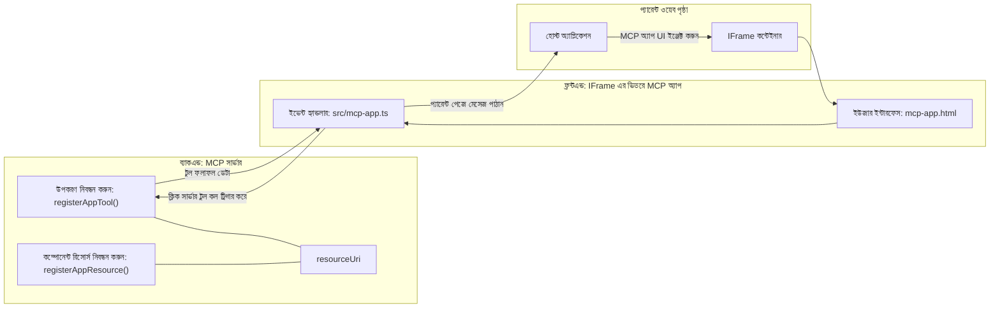

# MCP Apps

MCP Apps হল MCP তে একটি নতুন ধারনা। ধারণাটি হল আপনি কেবল একটি টুল কল থেকে ডেটা ফিরিয়ে না দিয়ে, আপনি কীভাবে এই তথ্যের সাথে ইন্টারঅ্যাক্ট করা উচিত সে সম্পর্কে তথ্যও প্রদান করবেন। এর মানে হল টুল ফলাফলে এখন UI তথ্য থাকতে পারে। তবে আমরা কেন এটা চাইব? ভাল, আপনি আজ কীভাবে কাজ করেন তা বিবেচনা করুন। আপনি সম্ভবত একটি MCP সার্ভারের ফলাফল ব্যবহার করছেন কিছু ধরণের ফ্রন্টেন্ড এর মাধ্যমে, যা কোড আপনাকে লিখতে এবং রক্ষণাবেক্ষণ করতে হয়। কখনও কখনও সেটাই আপনি চান, তবে কখনও কখনও এটি খুব ভাল হবে যদি আপনি কেবল একটি স্ব-সংখ্যালিপি তথ্য আনে যা সবই আছে ডেটা থেকে শুরু করে ইউজার ইন্টারফেস পর্যন্ত।

## সংক্ষিপ্ত বিবরণ

এই পাঠটি MCP Apps সম্পর্কে ব্যবহারিক নির্দেশনা প্রদান করে, কিভাবে এটি শুরু করবেন এবং কিভাবে আপনার বিদ্যমান ওয়েব অ্যাপ্লিকেশনগুলির সাথে এটি একীভূত করবেন। MCP Apps হল MCP স্ট্যান্ডার্ডের একটি খুব নতুন সংযোজন।

## শেখার উদ্দেশ্য

এই পাঠের শেষে, আপনি সক্ষম হবেন:

- MCP Apps কী তা ব্যাখ্যা করতে।
- কখন MCP Apps ব্যবহার করবেন।
- আপনার নিজস্ব MCP Apps তৈরি এবং একীভূত করতে।

## MCP Apps - এটি কীভাবে কাজ করে

MCP Apps ধারনাটি হল একটি উত্তর সরবরাহ করা যা মূলত একটি কম্পোনেন্ট যা রেন্ডার করতে হবে। এমন একটি কম্পোনেন্টে ভিজ্যুয়াল এবং ইন্টারঅ্যাকটিভিটি থাকতে পারে, যেমন বোতামের ক্লিক, ব্যবহারকারীর ইনপুট এবং আরও অনেক কিছু। আসুন সার্ভার সাইড থেকে শুরু করি এবং আমাদের MCP সার্ভার। একটি MCP App কম্পোনেন্ট তৈরির জন্য আপনাকে একটি টুল তৈরি করতে হবে এবং অ্যাপ্লিকেশন রিসোর্সও তৈরি করতে হবে। এই দুটি অংশের সংযোগ ঘটে একটি resourceUri দ্বারা।

এখানে একটি উদাহরণ। আসুন আমরা যা জড়িত এবং কোন অংশ কি কাজ করে তা ভিজ্যুয়ালাইজ করার চেষ্টা করি:

```text
server.ts -- responsible for registering tools and the component as a UI component
src/
  mcp-app.ts -- wiring up event handlers
mcp-app.html -- the user interface
```

এই ভিজ্যুয়ালটি কম্পোনেন্ট তৈরি এবং এর লজিকের আর্কিটেকচার বর্ণনা করে।


অগামীতে ব্যাকএন্ড এবং ফ্রন্টএন্ড এর দায়িত্বগুলি ব্যাখ্যা করার চেষ্টা করি।

### ব্যাকএন্ড

এখানে আমাদের দুইটি কাজ করার দরকার:

- যে টুলগুলোর সাথে ইন্টারঅ্যাক্ট করতে চাই তা রেজিস্টার করা।
- কম্পোনেন্ট সংজ্ঞায়িত করা।

**টুল রেজিস্টার করা**

```typescript
registerAppTool(
    server,
    "get-time",
    {
      title: "Get Time",
      description: "Returns the current server time.",
      inputSchema: {},
      _meta: { ui: { resourceUri } }, // এই টুলটিকে এর UI রিসোর্সের সাথে যুক্ত করে
    },
    async () => {
      const time = new Date().toISOString();
      return { content: [{ type: "text", text: time }] };
    },
  );

```

পূর্ববর্তী কোডটি আচরণ বর্ণনা করে, যেখানে এটি একটি টুল `get-time` প্রকাশ করে। এটি কোনো ইনপুট নেয় না কিন্তু শেষ পর্যন্ত বর্তমান সময় উত্পাদন করে। আমাদের কাছে `inputSchema` সংজ্ঞায়িত করার ক্ষমতাও রয়েছে যেখানে আমরা ব্যবহারকারীর ইনপুট গ্রহণ করতে পারি।

**কম্পোনেন্ট রেজিস্টার করা**

একই ফাইলে, আমাদের কম্পোনেন্টও রেজিস্টার করতে হবে:

```typescript
const resourceUri = "ui://get-time/mcp-app.html";

// রিসোর্স নিবন্ধন করুন, যা UI এর জন্য বান্ডল করা HTML/JavaScript ফেরত দেয়।
registerAppResource(
  server,
  resourceUri,
  resourceUri,
  { mimeType: RESOURCE_MIME_TYPE },
  async () => {
    const html = await fs.readFile(path.join(DIST_DIR, "mcp-app.html"), "utf-8");

    return {
    contents: [
        { uri: resourceUri, mimeType: RESOURCE_MIME_TYPE, text: html },
    ],
    };
  },
);
```

কিভাবে আমরা `resourceUri` উল্লেখ করি কম্পোনেন্টকে তার টুলগুলোর সাথে সংযোগ করার জন্য লক্ষ্য করুন। এছাড়াও কলব্যাক যেখানে আমরা UI ফাইল লোড করি এবং কম্পোনেন্ট ফেরত দিই তা গুরুত্বপূর্ণ।

### কম্পোনেন্ট ফ্রন্টএন্ড

ব্যাকএন্ডের মতো, এখানে দুইটি অংশ আছে:

- খাঁটি HTML এ লেখা একটি ফ্রন্টএন্ড।
- কোড যা ইভেন্টগুলি পরিচালনা করে এবং কী করতে হবে, যেমন টুল কল করা বা অভিভাবক উইন্ডোকে মেসেজ পাঠানো।

**ব্যবহারকারীর ইন্টারফেস**

চলুন ব্যবহারকারীর ইন্টারফেস দেখি।

```html
<!-- mcp-app.html -->
<!DOCTYPE html>
<html lang="en">
  <head>
    <meta charset="UTF-8" />
    <title>Get Time App</title>
  </head>
  <body>
    <p>
      <strong>Server Time:</strong> <code id="server-time">Loading...</code>
    </p>
    <button id="get-time-btn">Get Server Time</button>
    <script type="module" src="/src/mcp-app.ts"></script>
  </body>
</html>
```

**ইভেন্ট সংযোগ**

শেষ অংশটি হল ইভেন্ট সংযোগ। এর মানে হল আমরা আমাদের UI এর কোন অংশে ইভেন্ট হ্যান্ডলার লাগাতে হবে এবং যদি ইভেন্ট উঠে তবে কী করতে হবে তা সনাক্ত করি:

```typescript
// mcp-app.ts

import { App } from "@modelcontextprotocol/ext-apps";

// উপাদান রেফারেন্সগুলি পান
const serverTimeEl = document.getElementById("server-time")!;
const getTimeBtn = document.getElementById("get-time-btn")!;

// অ্যাপ ইন্সট্যান্স তৈরি করুন
const app = new App({ name: "Get Time App", version: "1.0.0" });

// সার্ভার থেকে টুল ফলাফলগুলি পরিচালনা করুন। প্রাথমিক টুল ফলাফল মিস না করার জন্য `app.connect()` এর আগে সেট করুন
// প্রাথমিক টুল ফলাফল মিস করা এড়াতে।
app.ontoolresult = (result) => {
  const time = result.content?.find((c) => c.type === "text")?.text;
  serverTimeEl.textContent = time ?? "[ERROR]";
};

// বোতামের ক্লিক যুক্ত করুন
getTimeBtn.addEventListener("click", async () => {
  // `app.callServerTool()` ইউআই-কে সার্ভার থেকে নতুন ডেটা অনুরোধ করার অনুমতি দেয়
  const result = await app.callServerTool({ name: "get-time", arguments: {} });
  const time = result.content?.find((c) => c.type === "text")?.text;
  serverTimeEl.textContent = time ?? "[ERROR]";
});

// হোস্টের সাথে সংযুক্ত করুন
app.connect();
```

উপর থেকে আপনি দেখতে পাচ্ছেন, এটি DOM উপাদানগুলিকে ইভেন্টের সাথে সংযুক্ত করার স্বাভাবিক কোড। উল্লেখযোগ্য হল `callServerTool` কল যা ব্যাকএন্ডে একটি টুল কল করে।

## ব্যবহারকারীর ইনপুটের সাথে কাজ করা

এখন পর্যন্ত আমরা একটি কম্পোনেন্ট দেখেছি যার একটি বোতাম আছে যা ক্লিক করলে একটি টুল কল করে। এখন দেখি আমরা আরও UI উপাদান যেমন ইনপুট ফিল্ড যোগ করতে পারি কী না এবং কীভাবে একটি টুলে আর্গুমেন্ট পাঠানো যায়। আমরা একটি FAQ কার্যকারিতা বাস্তবায়ন করব। এটি কিভাবে কাজ করা উচিত:

- একটি বোতাম এবং একটি ইনপুট এলিমেন্ট থাকা উচিত যেখানে ব্যবহারকারী একটি কীওয়ার্ড টাইپ করে অনুসন্ধান করার জন্য যেমন "Shipping"। এটি ব্যাকএন্ডে একটি টুল কল করবে যা FAQ ডেটাতে অনুসন্ধান করে।
- একটি টুল যা উল্লিখিত FAQ অনুসন্ধানটি সমর্থন করে।

প্রথমে ব্যাকএন্ডে প্রয়োজনীয় সমর্থন যোগ করি:

```typescript
const faq: { [key: string]: string } = {
    "shipping": "Our standard shipping time is 3-5 business days.",
    "return policy": "You can return any item within 30 days of purchase.",
    "warranty": "All products come with a 1-year warranty covering manufacturing defects.",
  }

registerAppTool(
    server,
    "get-faq",
    {
      title: "Search FAQ",
      description: "Searches the FAQ for relevant answers.",
      inputSchema: zod.object({
        query: zod.string().default("shipping"),
      }),
      _meta: { ui: { resourceUri: faqResourceUri } }, // এই টুলটিকে এর UI রিসোর্সের সাথে সংযুক্ত করে
    },
    async ({ query }) => {
      const answer: string = faq[query.toLowerCase()] || "Sorry, I don't have an answer for that.";
      return { content: [{ type: "text", text: answer }] };
    },
  );
```

এখানে আমরা দেখা যায় কিভাবে আমরা `inputSchema` পূরণ করি এবং একটি `zod` স্কিমা দি:

```typescript
inputSchema: zod.object({
  query: zod.string().default("shipping"),
})
```

উপরের স্কিমাতে আমরা ঘোষণা করি যে আমাদের একটি ইনপুট প্যারামিটার `query` আছে এবং এটি ঐচ্ছিক, ডিফল্ট মান "shipping"।

ঠিক আছে, চলুন *mcp-app.html* তে যাই দেখে কি ধরনের UI তৈরি করতে হবে:

```html
<div class="faq">
    <h1>FAQ response</h1>
    <p>FAQ Response: <code id="faq-response">Loading...</code></p>
    <input type="text" id="faq-query" placeholder="Enter FAQ query" />
    <button id="get-faq-btn">Get FAQ Response</button>
  </div>
```

দারুন, এখন আমাদের একটি ইনপুট এলিমেন্ট এবং বোতাম রয়েছে। চলুন এবার *mcp-app.ts* তে যাই ইভেন্টগুলি সংযোগ করতে:

```typescript
const getFaqBtn = document.getElementById("get-faq-btn")!;
const faqQueryInput = document.getElementById("faq-query") as HTMLInputElement;

getFaqBtn.addEventListener("click", async () => {
  const query = faqQueryInput.value;
  const result = await app.callServerTool({ name: "get-faq", arguments: { query } });
  const faq = result.content?.find((c) => c.type === "text")?.text;
  faqResponseEl.textContent = faq ?? "[ERROR]";
});
```

উপরের কোডে আমরা:

- ইন্টারঅ্যাকটিভ UI উপাদানগুলোর রেফারেন্স তৈরি করি।
- বোতামে ক্লিক হ্যান্ডল করি যাতে ইনপুট এলিমেন্টের মান নেওয়া হয় এবং আমরা `app.callServerTool()` কল করি যেখানে `name` এবং `arguments` থাকে, যার মধ্যে `query` প্যারামিটার হিসেবে পাঠানো হয়।

যখন আপনি `callServerTool` কল করেন, আসলে এটি প্যারেন্ট উইন্ডোকে একটি মেসেজ পাঠায় এবং ঐ উইন্ডো MCP সার্ভারকে কল করে।

### চেষ্টা করে দেখুন

এখন এটি চেষ্টা করলে আমাদের নিম্নলিখিত দেখতে হবে:


এবং এখানে ইনপুট "warranty" দিয়ে পরীক্ষা করা হয়


এই কোড চালানোর জন্য, [কোড সেকশন](./code/README.md) এ যান

## Visual Studio Code এ পরীক্ষা করা

Visual Studio Code MCP Apps এর জন্য দুর্দান্ত সমর্থন প্রদান করে এবং সম্ভবত এটি আপনার MCP Apps পরীক্ষা করার সবচেয়ে সহজ উপায়। Visual Studio Code ব্যবহার করতে, *mcp.json* এ একটি সার্ভার এন্ট্রি যোগ করুন এরকম:

```json
"my-mcp-server-7178eca7": {
    "url": "http://localhost:3001/mcp",
    "type": "http"
  }
```

এরপর সার্ভার শুরু করুন, আপনি MCP App এর সাথে চ্যাট উইন্ডোর মাধ্যমে যোগাযোগ করতে সক্ষম হবেন যদি আপনার GitHub Copilot ইনস্টল থাকে।

আপনি একটি প্রম্পট দিয়ে এটি ট্রিগার করতে পারেন, উদাহরণস্বরূপ "#get-faq":


এবং আপনি যখন এটি একটি ওয়েব ব্রাউজার দিয়ে চালিয়েছিলেন ঠিক একইভাবে এটি রেন্ডার হয়:


## অ্যাসাইনমেন্ট

একটি রক পেপার সিজার গেম তৈরি করুন। এটি নিম্নলিখিতগুলি নিয়ে গঠিত হওয়া উচিত:

UI:

- বিকল্প সহ একটি ড্রপডাউন লিস্ট
- একটি বোতাম পছন্দ সাবমিট করার জন্য
- একটি লেবেল যা দেখাবে কে কী বেছে নিয়েছে এবং কে জিতেছে

সার্ভার:

- একটি টুল থাকা উচিত rock paper scissor যেটি "choice" ইনপুট হিসাবে নেয়। এটি একটি কম্পিউটার চয়েস রেন্ডার করবে এবং বিজয়ী নির্ধারণ করবে

## সমাধান

[Solution](./assignment/README.md)

## সারাংশ

আমরা এই নতুন ধারনা MCP Apps সম্পর্কে শিখেছি। এটি একটি নতুন ধারনা যা MCP সার্ভারগুলোকে শুধুমাত্র ডেটা নয়, কিন্তু কীভাবে এই ডেটা প্রদর্শিত হবে সে সম্পর্কে মতামত প্রকাশ করতে দেয়।

অতিরিক্তভাবে, আমরা শিখেছি যে এই MCP Apps গুলো একটি IFrame এ হোস্ট করা হয় এবং MCP সার্ভারগুলোর সাথে যোগাযোগ করার জন্য তারা প্যারেন্ট ওয়েব অ্যাপকে মেসেজ পাঠাতে হবে। অনেকগুলি লাইব্রেরি আছে, যেমন প্লেইন জাভাস্ক্রিপ্ট এবং React সহ, যা এই যোগাযোগকে সহজ করে তোলে।

## মূল বিষয়সমূহ

আপনি যা শিখেছেন:

- MCP Apps একটি নতুন স্ট্যান্ডার্ড যা ডেটা এবং UI বৈশিষ্ট্য উভয় সরবরাহ করতে সহায়ক।
- এই ধরনের অ্যাপগুলি নিরাপত্তার কারণে একটি IFrame এ চলে।

## পরবর্তী কী

- [Chapter 4](../../04-PracticalImplementation/README.md)

---

<!-- CO-OP TRANSLATOR DISCLAIMER START -->
**অস্বীকৃতি**:
এই ডকুমেন্টটি AI অনুবাদ পরিষেবা [Co-op Translator](https://github.com/Azure/co-op-translator) ব্যবহার করে অনুবাদ করা হয়েছে। আমরা যথাসম্ভব সঠিকতা বজায় রাখার চেষ্টা করি, তবে দয়া করে মনে রাখবেন যে স্বয়ংক্রিয় অনুবাদে ভুল বা অগভীরতা থাকতে পারে। মুল ডকুমেন্টটি তার স্বাভাবিক ভাষায়ই কর্তৃত্বপূর্ণ উৎস হিসেবে বিবেচিত হওয়া উচিত। গুরুত্বপূর্ণ তথ্যের জন্য, পেশাদার মানব অনুবাদ পরামর্শ করা হয়। এই অনুবাদের ব্যবহার থেকে উদ্ভূত কোনো ভুল বোঝাবুঝি বা ভুল ব্যাখ্যার জন্য আমরা দায়ী নই।
<!-- CO-OP TRANSLATOR DISCLAIMER END -->