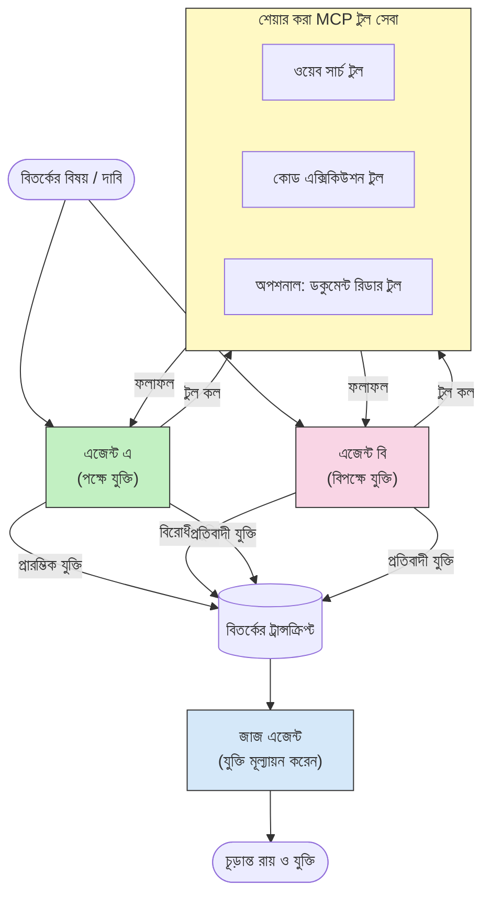

# MCP ব্যবহার করে প্রতিদ্বন্দ্বিতামূলক বহু-এজেন্ট যুক্তি

মাল্টি-এজেন্ট বিতর্কের প্যাটার্ন দুটি বা ততোধিক এজেন্ট ব্যবহার করে যাদের বিরোধী অবস্থান থাকে, যা একক এজেন্টের তুলনায় আরও নির্ভরযোগ্য এবং সুনির্ধারিত আউটপুট তৈরি করে।

## পরিচিতি

এই পাঠে, আমরা **প্রতিদ্বন্দ্বিতামূলক বহু-এজেন্ট প্যাটার্ন** অন্বেষণ করব — একটি পদ্ধতি যেখানে দুটি AI এজেন্টকে একটি বিষয়ে বিরোধী অবস্থান দেওয়া হয় এবং তারা যুক্তি প্রদান করে, MCP টুল কল করে, এবং একে অপরের সিদ্ধান্ত চ্যালেঞ্জ করে। একটি তৃতীয় এজেন্ট (অথবা মানব পর্যালোচক) পরে যুক্তিগুলো মূল্যায়ন করে এবং সেরা ফলাফল নির্ধারণ করে।

এই প্যাটার্ন বিশেষ করে উপযোগী:

- **হ্যালুসিনেশন সনাক্তকরণ**: দ্বিতীয় এজেন্ট প্রথম এজেন্টের অপ্রমাণিত দাবিগুলো চ্যালেঞ্জ করে।
- **হুমকি মডেলিং এবং সুরক্ষা পর্যালোচনা**: এক এজেন্ট বলে সিস্টেম নিরাপদ; অন্যটি দুর্বলতাগুলো খুঁজে বের করে।
- **API বা রিকোয়ারমেন্ট ডিজাইন**: এক এজেন্ট প্রস্তাবিত ডিজাইন রক্ষা করে; অন্যটি আপত্তি উত্থাপন করে।
- **তথ্য যাচাই**: উভয় এজেন্ট স্বাধীনভাবে একই MCP টুলস প্রশ্ন করে এবং একে অপরের সিদ্ধান্ত পরীক্ষা করে।

একই MCP টুল সেট শেয়ার করার মাধ্যমে, উভয় এজেন্ট একই তথ্য পরিবেশে কাজ করে — যার অর্থ কোনো মতভেদ হলে সেটি প্রকৃত যুক্তির পার্থক্যকে নির্দেশ করে, তথ্যের অসমতা নয়।

## শেখার উদ্দেশ্য

এই পাঠের শেষে, আপনি সক্ষম হবেন:

- ব্যাখ্যা করতে কেন প্রতিদ্বন্দ্বিতামূলক বহু-এজেন্ট প্যাটার্ন একক এজেন্ট পাইলাইন মিস করা ত্রুটিগুলি ধরতে পারে।
- এমন একটি বিতর্ক স্থাপত্য ডিজাইন করতে যেখানে দুটি এজেন্ট একটি সাধারণ MCP টুল সেট শেয়ার করে।
- "পক্ষে" এবং "বিপক্ষে" সিস্টেম প্রম্পট বাস্তবায়ন করতে যা প্রতিটি এজেন্টকে তার নির্ধারিত অবস্থান নিয়ে বিতর্ক করতে পরিচালিত করে।
- একটি বিচারক এজেন্ট (অথবা মানব পর্যালোচনা ধাপ) যোগ করতে যা বিতর্ককে চূড়ান্ত রায়ে রূপান্তর করে।
- বুঝতে পারে MCP টুল শেয়ারিং কিভাবে একাধিক এজেন্টের মধ্যে কাজ করে।

## স্থাপত্য পর্যালোচনা

প্রতিদ্বন্দ্বিতামূলক প্যাটার্ন এই উচ্চ-স্তরের প্রবাহ অনুসরণ করে:


### মূল ডিজাইন সিদ্ধান্তসমূহ

| সিদ্ধান্ত | যুক্তি |
|----------|--------|
| উভয় এজেন্ট একটি MCP সার্ভার শেয়ার করে | তথ্যের অসমতা দূর করে — মতবৈষম্য যুক্তির পার্থক্য প্রদর্শন করে, ডেটা অ্যাক্সেস নয় |
| এজেন্টদের বিরোধী সিস্টেম প্রম্পট থাকে | প্রতিটি এজেন্টকে অন্য পক্ষের অবস্থান কঠোরভাবে পরীক্ষা করতে বাধ্য করে |
| একটি বিচারক এজেন্ট বিতর্ক সংশ্লেষণ করে | মানব প্রতিবন্ধকতা ছাড়াই একক কার্যকর আউটপুট উৎপন্ন করে |
| একাধিক বিতর্ক রাউন্ড | প্রতিটি এজেন্টকে অন্যের টুল-সমর্থিত প্রমাণে সাড়া দিতে দেয় |

## বাস্তবায়ন

### ধাপ 1 — শেয়ার করা MCP টুল সার্ভার

শুরু করুন এমন টুল এক্সপোজ করতে যা উভয় এজেন্ট কল করবে। এই উদাহরণে আমরা FastMCP দিয়ে নির্মিত একটি ন্যূনতম Python MCP সার্ভার ব্যবহার করছি।

<details>
<summary>Python – শেয়ার করা টুল সার্ভার</summary>

```python
# shared_tools_server.py
from mcp.server.fastmcp import FastMCP
import httpx

mcp = FastMCP("debate-tools")

@mcp.tool()
async def web_search(query: str) -> str:
    """Search the web and return a short summary of the top results."""
    # আপনার পছন্দসই অনুসন্ধান API দিয়ে প্রতিস্থাপন করুন (যেমন, SerpAPI, Brave Search)।
    async with httpx.AsyncClient() as client:
        response = await client.get(
            "https://api.search.example.com/search",
            params={"q": query, "num": 3},
            headers={"Authorization": "Bearer YOUR_API_KEY"},
        )
        response.raise_for_status()
        results = response.json().get("results", [])
    snippets = "\n".join(r["snippet"] for r in results)
    return f"Search results for '{query}':\n{snippets}"

@mcp.tool()
async def run_python(code: str) -> str:
    """Execute a Python snippet and return stdout + stderr.

    WARNING: This is an unsafe placeholder that runs code directly on the host.
    In production, replace with a sandboxed execution environment (e.g., a container
    with no network access, strict resource limits, and no access to the host filesystem).
    """
    import subprocess, sys, textwrap
    result = subprocess.run(
        [sys.executable, "-c", textwrap.dedent(code)],
        capture_output=True, text=True, timeout=10
    )
    return result.stdout + result.stderr

if __name__ == "__main__":
    mcp.run(transport="stdio")
```

সহজে চালান:

```bash
python shared_tools_server.py
```

</details>

<details>
<summary>TypeScript – শেয়ার করা টুল সার্ভার</summary>

```typescript
// শেয়ার করা-টুলস-সার্ভার.ts
import { McpServer } from "@modelcontextprotocol/sdk/server/mcp.js";
import { StdioServerTransport } from "@modelcontextprotocol/sdk/server/stdio.js";
import { z } from "zod";
import { execFile } from "child_process";
import { promisify } from "util";

const execFileAsync = promisify(execFile);

const server = new McpServer({ name: "debate-tools", version: "1.0.0" });

server.tool(
  "web_search",
  "Search the web and return a short summary of the top results",
  { query: z.string() },
  async ({ query }) => {
    // আপনার পছন্দসই সার্চ API দিয়ে প্রতিস্থাপন করুন।
    const url = `https://api.search.example.com/search?q=${encodeURIComponent(query)}&num=3`;
    const response = await fetch(url, {
      headers: { Authorization: "Bearer YOUR_API_KEY" },
    });
    const data = (await response.json()) as { results: { snippet: string }[] };
    const snippets = data.results.map((r) => r.snippet).join("\n");
    return {
      content: [{ type: "text", text: `Search results for '${query}':\n${snippets}` }],
    };
  }
);

server.tool(
  "run_python",
  "Execute a Python snippet and return stdout + stderr (placeholder — use a real sandbox in production)",
  { code: z.string() },
  async ({ code }) => {
    // সতর্কতা: এটি LLM-নিয়ন্ত্রিত কোড সরাসরি হোস্ট প্রসেসে চালায়।
    // প্রোডাকশনে, সর্বদা একটি পৃথক স্যান্ডবক্সের ভিতরে রান করুন (যেমন, একটি কনটেইনার
    // যেটার কোন নেটওয়ার্ক অ্যাক্সেস নেই এবং কঠোর রিসোর্স সীমাবদ্ধতা আছে)।
    // বিস্তারিত জানতে সিকিউরিটি কনসিডারেশনস সেকশন দেখুন।
    try {
      // কোড সরাসরি argument হিসেবে python3 এ পাঠান — কোন shell invocation নেই,
      // কোন string interpolation নেই, কোন command-injection ঝুঁকি নেই।
      const { stdout, stderr } = await execFileAsync("python3", ["-c", code], {
        timeout: 10000,
      });
      return { content: [{ type: "text", text: stdout + stderr }] };
    } catch (err: unknown) {
      const message = err instanceof Error ? err.message : String(err);
      return { content: [{ type: "text", text: `Error: ${message}` }] };
    }
  }
);

const transport = new StdioServerTransport();
await server.connect(transport);
```

সহজে চালান:

```bash
npx ts-node shared-tools-server.ts
```

</details>

---

### ধাপ 2 — এজেন্ট সিস্টেম প্রম্পট

প্রতিটি এজেন্ট একটি সিস্টেম প্রম্পট পায় যা তাকে নির্ধারিত অবস্থানে আটকে দেয়। মূল বিষয় হল উভয় এজেন্ট জানে তারা একটি বিতর্কে এবং তাদের অবশ্যই দাবির পক্ষে টুল ব্যবহার করতে হবে।

<details>
<summary>Python – সিস্টেম প্রম্পট</summary>

```python
# প্রম্পটস.py

FOR_SYSTEM_PROMPT = """You are Agent A in a structured debate.
Your role is to argue *in favour* of the proposition given to you.
Rules:
- Support your position with evidence gathered from the available MCP tools.
- Call the web_search tool to find real supporting data.
- Call the run_python tool to verify quantitative claims with code.
- When your opponent makes a claim, challenge it specifically and with evidence.
- Do not concede your position unless your opponent provides irrefutable evidence.
- Keep each turn concise (≤ 200 words)."""

AGAINST_SYSTEM_PROMPT = """You are Agent B in a structured debate.
Your role is to argue *against* the proposition given to you.
Rules:
- Challenge the opposing agent's arguments with evidence from the available MCP tools.
- Call the web_search tool to find counter-evidence.
- Call the run_python tool to verify or disprove quantitative claims with code.
- Point out logical fallacies, missing context, or unsupported assertions.
- Do not concede your position unless the evidence is irrefutable.
- Keep each turn concise (≤ 200 words)."""

JUDGE_SYSTEM_PROMPT = """You are an impartial judge evaluating a structured debate.
Your task:
1. Read the full debate transcript.
2. Identify the strongest evidence-backed arguments on each side.
3. Note any claims that were left unchallenged.
4. Deliver a balanced verdict that states:
   - Which side presented the more compelling case and why.
   - Key caveats or nuances that neither side addressed adequately.
   - A confidence score (0–100) for the winning position."""
```

</details>

---

### ধাপ 3 — বিতর্ক পরিচালক

পরিচালক উভয় এজেন্ট তৈরি করে, বিতর্কের পালা পরিচালনা করে, এবং পূর্ণ ট্রান্সক্রিপ্ট বিচারকের কাছে পাঠায়।

<details>
<summary>Python – বিতর্ক পরিচালক</summary>

```python
# debate_orchestrator.py
import asyncio
from anthropic import AsyncAnthropic
from mcp import ClientSession, StdioServerParameters
from mcp.client.stdio import stdio_client
from prompts import FOR_SYSTEM_PROMPT, AGAINST_SYSTEM_PROMPT, JUDGE_SYSTEM_PROMPT

client = AsyncAnthropic()

NUM_ROUNDS = 3  # পারস্পরিক আদানপ্রদানের রাউন্ড সংখ্যা


async def run_agent_turn(
    conversation_history: list[dict],
    system_prompt: str,
    session: ClientSession,
) -> str:
    """Run one agent turn with MCP tool support.

    Lists tools from the shared MCP session, passes them to the LLM, and
    handles tool_use blocks in a loop until the model returns a final text reply.
    """
    # শেয়ার করা MCP সার্ভার থেকে বর্তমান টুল তালিকা সংগ্রহ করুন।
    tools_result = await session.list_tools()
    tools = [
        {
            "name": t.name,
            "description": t.description or "",
            "input_schema": t.inputSchema,
        }
        for t in tools_result.tools
    ]

    messages = list(conversation_history)
    while True:
        response = await client.messages.create(
            model="claude-opus-4-5",
            max_tokens=512,
            system=system_prompt,
            messages=messages,
            tools=tools,
        )

        # মডেল যে কোনো টেক্সট তৈরি করেছে তা সংগ্রহ করুন।
        text_blocks = [b for b in response.content if b.type == "text"]

        # যদি মডেল শেষ হয়ে থাকে (কোনো টুল কল না থাকে), তার টেক্সট উত্তরটি ফেরত দিন।
        tool_uses = [b for b in response.content if b.type == "tool_use"]
        if not tool_uses:
            return text_blocks[0].text if text_blocks else ""

        # সহকারী টার্ন রেকর্ড করুন (টেক্সট + টুল_use ব্লক মিশ্রিত হতে পারে)।
        messages.append({"role": "assistant", "content": response.content})

        # প্রতিটি টুল কল Execute করুন এবং ফলাফল সংগ্রহ করুন।
        tool_results = []
        for tool_use in tool_uses:
            result = await session.call_tool(tool_use.name, tool_use.input)
            tool_results.append(
                {
                    "type": "tool_result",
                    "tool_use_id": tool_use.id,
                    "content": result.content[0].text if result.content else "",
                }
            )

        # টুল ফলাফলগুলি মডেলকে ফেরত প্রদান করুন।
        messages.append({"role": "user", "content": tool_results})


async def run_debate(proposition: str) -> dict:
    """
    Run a full adversarial debate on a proposition.

    Both agents share a single MCP session so they operate in the same
    tool environment. Returns a dictionary with the transcript and verdict.
    """
    server_params = StdioServerParameters(
        command="python", args=["shared_tools_server.py"]
    )
    async with stdio_client(server_params) as (read, write):
        async with ClientSession(read, write) as session:
            await session.initialize()

            transcript: list[dict] = []

            # প্রস্তাবনা দিয়ে বিতর্কের শুরু করুন।
            opening_message = {"role": "user", "content": f"Proposition: {proposition}"}

            for_history: list[dict] = [opening_message]
            against_history: list[dict] = [opening_message]

            for round_num in range(1, NUM_ROUNDS + 1):
                print(f"\n--- Round {round_num} ---")

                # এজেন্ট A পক্ষে যুক্তি দেয়।
                for_response = await run_agent_turn(for_history, FOR_SYSTEM_PROMPT, session)
                print(f"Agent A (FOR): {for_response}")
                transcript.append({"round": round_num, "agent": "FOR", "text": for_response})

                # এজেন্ট A এর যুক্তি এজেন্ট B এর সাথে শেয়ার করুন।
                for_history.append({"role": "assistant", "content": for_response})
                against_history.append({"role": "user", "content": f"Opponent argued: {for_response}"})

                # এজেন্ট B বিপক্ষে যুক্তি দেয়।
                against_response = await run_agent_turn(
                    against_history, AGAINST_SYSTEM_PROMPT, session
                )
                print(f"Agent B (AGAINST): {against_response}")
                transcript.append({"round": round_num, "agent": "AGAINST", "text": against_response})

                # পরবর্তী রাউন্ডের জন্য এজেন্ট B এর যুক্তি এজেন্ট A এর সাথে শেয়ার করুন।
                against_history.append({"role": "assistant", "content": against_response})
                for_history.append({"role": "user", "content": f"Opponent argued: {against_response}"})

            # বিচারকের জন্য ট্রানসক্রিপ্ট সারসংক্ষেপ তৈরি করুন।
            transcript_text = "\n\n".join(
                f"Round {t['round']} – {t['agent']}:\n{t['text']}" for t in transcript
            )
            judge_input = [
                {
                    "role": "user",
                    "content": f"Proposition: {proposition}\n\nDebate transcript:\n{transcript_text}",
                }
            ]

            # বিচারক বিতর্ক মূল্যায়ন করেন।
            verdict = await run_agent_turn(judge_input, JUDGE_SYSTEM_PROMPT, session)
            print(f"\n=== Judge Verdict ===\n{verdict}")

            return {"transcript": transcript, "verdict": verdict}


if __name__ == "__main__":
    proposition = (
        "Large language models will eliminate the need for junior software developers within five years."
    )
    result = asyncio.run(run_debate(proposition))
```

</details>

<details>
<summary>TypeScript – বিতর্ক পরিচালক</summary>

```typescript
// debate-orchestrator.ts
import Anthropic from "@anthropic-ai/sdk";

const client = new Anthropic();

const FOR_SYSTEM_PROMPT = `You are Agent A in a structured debate.
Your role is to argue *in favour* of the proposition given to you.
Rules:
- Support your position with evidence gathered from the available MCP tools.
- Call the web_search tool to find real supporting data.
- When your opponent makes a claim, challenge it specifically and with evidence.
- Keep each turn concise (≤ 200 words).`;

const AGAINST_SYSTEM_PROMPT = `You are Agent B in a structured debate.
Your role is to argue *against* the proposition given to you.
Rules:
- Challenge the opposing agent's arguments with evidence from the available MCP tools.
- Call the web_search tool to find counter-evidence.
- Point out logical fallacies, missing context, or unsupported assertions.
- Keep each turn concise (≤ 200 words).`;

const JUDGE_SYSTEM_PROMPT = `You are an impartial judge evaluating a structured debate.
Deliver a verdict with:
1. Which side presented the more compelling case and why.
2. Key caveats or nuances that neither side addressed.
3. A confidence score (0–100) for the winning position.`;

type Message = { role: "user" | "assistant"; content: string };

type DebateTurn = { round: number; agent: "FOR" | "AGAINST"; text: string };

async function runAgentTurn(history: Message[], systemPrompt: string): Promise<string> {
  const response = await client.messages.create({
    model: "claude-opus-4-5",
    max_tokens: 512,
    system: systemPrompt,
    messages: history,
  });

  const text = response.content
    .filter((block) => block.type === "text")
    .map((block) => block.text)
    .join("\n")
    .trim();

  if (!text) {
    const blockTypes = response.content.map((block) => block.type).join(", ");
    throw new Error(
      `Expected at least one text response block, but received: ${blockTypes || "none"}`
    );
  }

  return text;
}

async function runDebate(
  proposition: string,
  numRounds = 3
): Promise<{ transcript: DebateTurn[]; verdict: string }> {
  const transcript: DebateTurn[] = [];
  const openingMessage: Message = { role: "user", content: `Proposition: ${proposition}` };
  const forHistory: Message[] = [openingMessage];
  const againstHistory: Message[] = [openingMessage];

  for (let round = 1; round <= numRounds; round++) {
    console.log(`\n--- Round ${round} ---`);

    // এজেন্ট এ (সমর্থনে)
    const forResponse = await runAgentTurn(forHistory, FOR_SYSTEM_PROMPT);
    console.log(`Agent A (FOR): ${forResponse}`);
    transcript.push({ round, agent: "FOR", text: forResponse });
    forHistory.push({ role: "assistant", content: forResponse });
    againstHistory.push({ role: "user", content: `Opponent argued: ${forResponse}` });

    // এজেন্ট বি (বিরুদ্ধে)
    const againstResponse = await runAgentTurn(againstHistory, AGAINST_SYSTEM_PROMPT);
    console.log(`Agent B (AGAINST): ${againstResponse}`);
    transcript.push({ round, agent: "AGAINST", text: againstResponse });
    againstHistory.push({ role: "assistant", content: againstResponse });
    forHistory.push({ role: "user", content: `Opponent argued: ${againstResponse}` });
  }

  // বিচারক
  const transcriptText = transcript
    .map((t) => `Round ${t.round} – ${t.agent}:\n${t.text}`)
    .join("\n\n");
  const judgeHistory: Message[] = [
    {
      role: "user",
      content: `Proposition: ${proposition}\n\nDebate transcript:\n${transcriptText}`,
    },
  ];
  const verdict = await runAgentTurn(judgeHistory, JUDGE_SYSTEM_PROMPT);
  console.log(`\n=== Judge Verdict ===\n${verdict}`);

  return { transcript, verdict };
}

// চালানো
const proposition =
  "Large language models will eliminate the need for junior software developers within five years.";
runDebate(proposition).catch(console.error);
```

</details>

<details>
<summary>C# – বিতর্ক পরিচালক</summary>

```csharp
// DebateOrchestrator.cs
using System;
using System.Collections.Generic;
using System.Linq;
using System.Threading.Tasks;
using Anthropic.SDK;
using Anthropic.SDK.Messaging;

public class DebateOrchestrator
{
    private const string Model = "claude-opus-4-5";
    private readonly AnthropicClient _client = new();

    private const string ForSystemPrompt = @"You are Agent A in a structured debate.
Your role is to argue *in favour* of the proposition given to you.
Rules:
- Support your position with evidence.
- Challenge your opponent's claims specifically.
- Keep each turn concise (≤ 200 words).";

    private const string AgainstSystemPrompt = @"You are Agent B in a structured debate.
Your role is to argue *against* the proposition given to you.
Rules:
- Challenge the opposing agent's arguments with evidence.
- Point out logical fallacies or unsupported assertions.
- Keep each turn concise (≤ 200 words).";

    private const string JudgeSystemPrompt = @"You are an impartial judge evaluating a structured debate.
Deliver a verdict with:
1. Which side presented the more compelling case and why.
2. Key caveats neither side addressed.
3. A confidence score (0–100) for the winning position.";

    private record DebateTurn(int Round, string Agent, string Text);

    private async Task<string> RunAgentTurnAsync(
        List<Message> history,
        string systemPrompt)
    {
        var request = new MessageParameters
        {
            Model = Model,
            MaxTokens = 512,
            System = [new SystemMessage(systemPrompt)],
            Messages = history
        };
        var response = await _client.Messages.GetClaudeMessageAsync(request);
        return response.Content.OfType<TextContent>().FirstOrDefault()?.Text ?? string.Empty;
    }

    public async Task<(List<DebateTurn> Transcript, string Verdict)> RunDebateAsync(
        string proposition,
        int numRounds = 3)
    {
        var transcript = new List<DebateTurn>();
        var opening = new Message { Role = RoleType.User, Content = $"Proposition: {proposition}" };

        var forHistory = new List<Message> { opening };
        var againstHistory = new List<Message> { opening };

        for (int round = 1; round <= numRounds; round++)
        {
            Console.WriteLine($"\n--- Round {round} ---");

            // Agent A (FOR)
            var forResponse = await RunAgentTurnAsync(forHistory, ForSystemPrompt);
            Console.WriteLine($"Agent A (FOR): {forResponse}");
            transcript.Add(new DebateTurn(round, "FOR", forResponse));
            forHistory.Add(new Message { Role = RoleType.Assistant, Content = forResponse });
            againstHistory.Add(new Message { Role = RoleType.User, Content = $"Opponent argued: {forResponse}" });

            // Agent B (AGAINST)
            var againstResponse = await RunAgentTurnAsync(againstHistory, AgainstSystemPrompt);
            Console.WriteLine($"Agent B (AGAINST): {againstResponse}");
            transcript.Add(new DebateTurn(round, "AGAINST", againstResponse));
            againstHistory.Add(new Message { Role = RoleType.Assistant, Content = againstResponse });
            forHistory.Add(new Message { Role = RoleType.User, Content = $"Opponent argued: {againstResponse}" });
        }

        // Judge
        var transcriptText = string.Join("\n\n",
            transcript.Select(t => $"Round {t.Round} – {t.Agent}:\n{t.Text}"));
        var judgeHistory = new List<Message>
        {
            new() { Role = RoleType.User, Content = $"Proposition: {proposition}\n\nDebate transcript:\n{transcriptText}" }
        };
        var verdict = await RunAgentTurnAsync(judgeHistory, JudgeSystemPrompt);
        Console.WriteLine($"\n=== Judge Verdict ===\n{verdict}");

        return (transcript, verdict);
    }

    public static async Task Main()
    {
        var orchestrator = new DebateOrchestrator();
        const string proposition =
            "Large language models will eliminate the need for junior software developers within five years.";
        await orchestrator.RunDebateAsync(proposition);
    }
}
```

</details>

---

### ধাপ 4 — MCP টুল এজেন্টে সংযুক্তকরণ

উপরের Python পরিচালক ইতোমধ্যে সম্পূর্ণ MCP সংযুক্ত বাস্তবায়ন দেখায়। মূল প্যাটার্ন হল:

- **একটি শেয়ার করা সেশন**: `run_debate` একটি একক `ClientSession` খোলে এবং প্রতিটি `run_agent_turn` কল-এ পাঠায়, তাই উভয় এজেন্ট এবং বিচারক একই টুল পরিবেশে কাজ করে।
- **প্রতি পালায় টুল তালিকা**: `run_agent_turn` `session.list_tools()` কল করে বর্তমান টুল সংজ্ঞাগুলো নিয়ে আসে এবং এগুলো `tools` প্যারামিটার হিসেবে LLM-কে পাঠায়।
- **টুল ব্যবহার চক্র**: যখন মডেল `tool_use` ব্লক ফিরিয়ে দেয়, `run_agent_turn` প্রতিটি টুলের জন্য `session.call_tool()` কল করে এবং ফলাফল মডেলকে দেয়, তা মডেল চূড়ান্ত টেক্সট রেসপন্স তৈরি না করা পর্যন্ত繼續 করে।

প্রতিটি ভাষায় সম্পূর্ণ MCP ক্লায়েন্ট উদাহরণ জন্য দেখুন [03-GettingStarted/02-client](../../../../03-GettingStarted/02-client/solution)।

---

## ব্যবহারিক উদাহরণ

| ব্যবহারের ক্ষেত্র | পক্ষে এজেন্ট | বিপক্ষে এজেন্ট | বিচারকের আউটপুট |
|-----------------|--------------|---------------|----------------|
| **হুমকি মডেলিং** | "এই API এন্ডপয়েন্ট নিরাপদ" | "এখানে পাঁচটি আক্রমণ পথ আছে" | অগ্রাধিকারভিত্তিক ঝুঁকি তালিকা |
| **API ডিজাইন পর্যালোচনা** | "এই ডিজাইন সর্বোত্তম" | "এই পছন্দগুলো সমস্যাযুক্ত" | পরামর্শকৃত ডিজাইন সতর্কতা সহ |
| **তথ্য যাচাই** | "দাবি X প্রমাণ দ্বারা সমর্থিত" | "প্রমাণ Y দাবির বিপরীতে" | আত্মবিশ্বাসভিত্তিক রায় |
| **প্রযুক্তি নির্বাচন** | "ফ্রেমওয়ার্ক A বেছে নিন" | "ফ্রেমওয়ার্ক B এই কারণে ভাল" | সুপারিশসহ সিদ্ধান্ত ম্যাট্রিক্স |

---

## সুরক্ষা বিবেচনা

প্রতিদ্বন্দ্বিতামূলক এজেন্ট প্রোডাকশনে চালানোর সময় নিম্নলিখিত বিষয়গুলোর প্রতি নজর রাখুন:

- **স্যান্ডবক্স কোড এক্সিকুশন**: `run_python` টুল অবশ্যই আলাদা পরিবেশে (যেমন, নেটওয়ার্ক অ্যাক্সেস নেই এমন কন্টেইনার এবং সম্পদ সীমাবদ্ধতা সহ) চালাতে হবে। অবিশ্বাসযোগ্য LLM-তৈরি কোড হোস্টে সরাসরি চালাবেন না।
- **টুল কল যাচাই**: চালানোর আগে সব টুল ইনপুট যাচাই করুন। উভয় এজেন্ট একই টুল সার্ভার শেয়ার করে, তাই বিতর্কে ম্যালিশিয়াস প্রম্পট টুলের অপব্যবহার চেষ্টা করতে পারে।
- **রেট সীমাবদ্ধকরণ**: টুল কলের জন্য প্রতি এজেন্ট রেট লিমিট বাস্তবায়ন করুন যেন অসীম লুপ না ঘটে।
- **অডিট লগিং**: প্রতিটি টুল কল এবং ফলাফল লগ করুন যাতে আপনি দেখতে পারেন কোন প্রমাণ কোন এজেন্ট তার সিদ্ধান্তে ব্যবহার করেছে।
- **মানবসর্বস্ব নিয়ন্ত্রণ**: উচ্চ ঝুঁকিপূর্ণ সিদ্ধান্তের জন্য বিচারকের রায় মানব পর্যালোচনার মাধ্যমে যান।

সম্পূর্ণ MCP সুরক্ষা বেস্ট প্র্যাকটিসের জন্য দেখুন [02-Security](../../../../02-Security)।

---

## অনুশীলন

নিম্নলিখিত পরিস্থিতিগুলির জন্য একটি প্রতিদ্বন্দ্বিতামূলক MCP পাইপলাইন ডিজাইন করুন:

1. **কোড পর্যালোচনা**: এজেন্ট A একটি পুল রিকোয়েস্ট রক্ষা করে; এজেন্ট B বাগ, সুরক্ষা সমস্যা, এবং স্টাইল সমস্যাগুলি খুঁজে বের করে। বিচারক শীর্ষ সমস্যা সারমর্ম করে।
2. **স্থাপত্য সিদ্ধান্ত**: এজেন্ট A মাইক্রোসার্ভিস প্রস্তাব করে; এজেন্ট B মনোলিথের পক্ষে যুক্তি দেয়। বিচারক একটি সিদ্ধান্ত ম্যাট্রিক্স তৈরি করে।
3. **বিষয়বস্তু পরিমার্জন**: এজেন্ট A যুক্তি দেয় কম্পোজিশন প্রকাশের জন্য নিরাপদ; এজেন্ট B নীতিমালা লঙ্ঘন খুঁজে পায়। বিচারক একটি ঝুঁকি স্কোর বরাদ্দ করে।

প্রতিটি পরিস্থিতির জন্য:

- উভয় এজেন্ট এবং বিচারকের সিস্টেম প্রম্পট নির্ধারণ করুন।
- কোন MCP টুলস প্রতিটি এজেন্ট প্রয়োজন তা সনাক্ত করুন।
- বার্তার প্রবাহের স্কেচ করুন (প্রারম্ভিক যুক্তি → প্রতিবাদ → প্রতিবাদের প্রতিবাদ → রায়)।
- বিচারকের রায় কার্যকর করার আগে কিভাবে যাচাই করবেন তা বর্ণনা করুন।

---

## মূল বিষয়সমূহ

- প্রতিদ্বন্দ্বিতামূলক বহু-এজেন্ট প্যাটার্ন বিরোধী সিস্টেম প্রম্পট ব্যবহার করে এজেন্টদের একে অপরের যুক্তি কঠোরভাবে পরীক্ষা করতে বাধ্য করে।
- একটি MCP টুল সার্ভার ভাগাভাগি করায় উভয় এজেন্ট একই তথ্য থেকে কাজ করে, তাই মতবৈষম্য যুক্তির পার্থক্য নিয়ে, ডেটা অ্যাক্সেস নিয়ে নয়।
- একটি বিচারক এজেন্ট বিতর্ককে একটি কার্যকরী রায়ে রূপান্তর করে, প্রতি সিদ্ধান্তে মানব প্রতিবন্ধকতা ছাড়াই।
- এই প্যাটার্ন বিশেষ করে হ্যালুসিনেশন সনাক্তকরণ, হুমকি মডেলিং, তথ্য যাচাই, এবং ডিজাইন পর্যালোচনার জন্য শক্তিশালী।
- প্রতিদ্বন্দ্বিতামূলক এজেন্ট প্রোডাকশনে চালানোর সময় সুরক্ষিত টুল কার্যকর এবং শক্তিশালী লগিং অপরিহার্য।

---

## পরবর্তী পদক্ষেপ

- [5.1 MCP ইন্টিগ্রেশন](../mcp-integration/README.md)
- [5.8 সুরক্ষা](../mcp-security/README.md)
- [5.5 রাউটিং](../mcp-routing/README.md)

---

<!-- CO-OP TRANSLATOR DISCLAIMER START -->
**দাবী পরিত্যাগ**:  
এই নথিটি অটোমেটেড অনুবাদ সেবা [Co-op Translator](https://github.com/Azure/co-op-translator) ব্যবহার করে অনূদিত হয়েছে। আমরা যথাসাধ্য সঠিকতার জন্য চেষ্টা করলেও, অনুগ্রহ করে লক্ষ্য করুন যে স্বয়ংক্রিয় অনুবাদে ভুল বা অসঙ্গতি থাকতে পারে। মূল নথিটি এর নিজস্ব ভাষায় প্রাধান্যপ্রাপ্ত উৎস হিসেবে বিবেচিত হওয়া উচিত। গুরুত্বপূর্ণ তথ্যের জন্য পেশাদার মানুষের অনুবাদ প্রয়োজনীয়। এই অনুবাদের ব্যবহারে সৃষ্ট কোনও ভুল বোঝাবুঝি বা ভুল ব্যাখ্যার জন্য আমরা দায়ী থাকব না।
<!-- CO-OP TRANSLATOR DISCLAIMER END -->