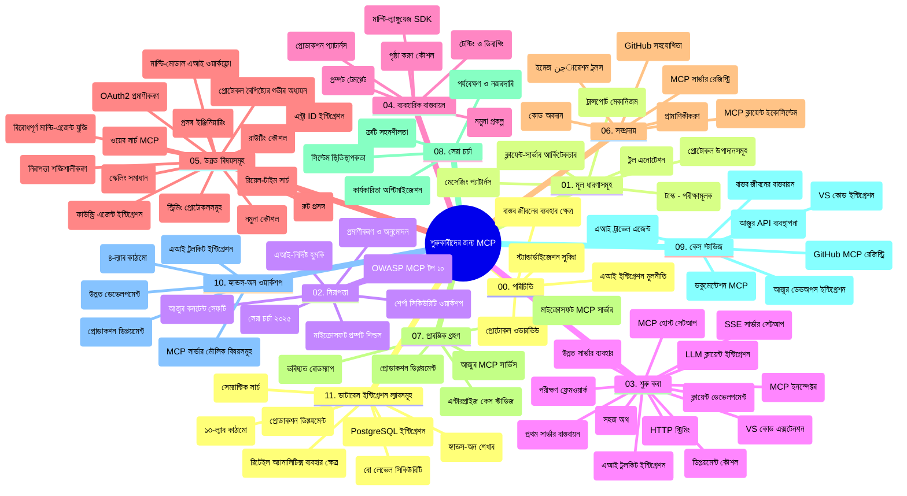

# মডেল প্রসঙ্গ প্রোটোকল (MCP) ফর বিগিনার্স - স্টাডি গাইড

এই স্টাডি গাইডটি "মডেল প্রসঙ্গ প্রোটোকল (MCP) ফর বিগিনার্স" কারিকুলামের জন্য রেপোজিটরির কাঠামো এবং বিষয়বস্তুর একটি ওভারভিউ প্রদান করে। এই গাইডটি ব্যবহার করে রেপোজিটরিটি কার্যকরভাবে নেভিগেট করুন এবং উপলব্ধ সম্পদের সর্বোচ্চ সুবিধা নিন।

## রেপোজিটরি ওভারভিউ

মডেল প্রসঙ্গ প্রোটোকল (MCP) হল এআই মডেল এবং ক্লায়েন্ট অ্যাপ্লিকেশনগুলোর মধ্যে ইন্টারঅ্যাকশনের জন্য একটি স্ট্যান্ডার্ডাইজড ফ্রেমওয়ার্ক। প্রথমে Anthropic দ্বারা তৈরি, MCP এখন অফিসিয়াল GitHub অর্গানাইজেশনের মাধ্যমে বিস্তৃত MCP সম্প্রদায় দ্বারা রক্ষণাবেক্ষণ করা হয়। এই রেপোজিটরিটি AI ডেভেলপার, সিস্টেম আর্কিটেক্ট এবং সফটওয়্যার ইঞ্জিনিয়ারদের জন্য ডিজাইন করা C#, Java, JavaScript, Python, এবং TypeScript এ হাতে-কলমে কোড উদাহরণের সম্পূর্ণ কারিকুলাম প্রদান করে।

## ভিজুয়াল কারিকুলাম ম্যাপ

## রেপোজিটরি স্ট্রাকচার

রেপোজিটরিটি এগারোটি প্রধান ভাগে সংগঠিত, প্রতিটি MCP এর বিভিন্ন দিকের ওপর মনোযোগ দেয়:

1. **পরিচিতি (00-Introduction/)**
   - মডেল প্রসঙ্গ প্রোটোকল এর ওভারভিউ
   - AI পাইপলাইনে স্ট্যান্ডার্ডাইজেশনের গুরুত্ব
   - ব্যবহারিক কেস এবং সুবিধা

2. **মূল ধারণাগুলো (01-CoreConcepts/)**
   - ক্লায়েন্ট-সার্ভার স্থাপত্য
   - প্রধান প্রোটোকল উপাদানসমূহ
   - MCP এর বার্তা প্রেরণ প্যাটার্ন

3. **নিরাপত্তা (02-Security/)**
   - MCP-ভিত্তিক সিস্টেমে নিরাপত্তা হুমকি
   - সুরক্ষিত বাস্তবায়নের সেরা অনুশীলন
   - প্রমাণীকরণ এবং অনুমোদন কৌশল
   - **সম্পূর্ণ নিরাপত্তা ডকুমেন্টেশন**:
     - MCP সিকিউরিটি বেস্ট প্র্যাকটিস ২০২৫
     - Azure কন্টেন্ট সেফটি ইমপ্লিমেন্টেশন গাইড
     - MCP সিকিউরিটি কন্ট্রোলস এবং টেকনিকস
     - MCP বেস্ট প্র্যাকটিস কুইক রেফারেন্স
   - **মূল নিরাপত্তা বিষয়**:
     - প্রম্পট ইঞ্জেকশন এবং টুল পয়জনিং আক্রমণ
     - সেশন হাইজ্যাকিং এবং কনফিউসড ডেপুটি সমস্যা
     - টোকেন পাসথ্রু দুর্বলতা
     - অধিক পরিমাণ অনুমতির ও প্রবেশাধিকার নিয়ন্ত্রণ
     - AI উপাদানের সাপ্লাই চেন সুরক্ষা
     - মাইক্রোসফট প্রম্পট শিল্ডস একত্রিকরণ

4. **শুরু করা হচ্ছে (03-GettingStarted/)**
   - পরিবেশ সেটআপ এবং কনফিগারেশন
   - বেসিক MCP সার্ভার এবং ক্লায়েন্ট তৈরি
   - বিদ্যমান অ্যাপ্লিকেশনগুলোর সাথে ইন্টিগ্রেশন
   - অন্তর্ভুক্ত বিভাগসমূহ:
     - প্রথম সার্ভার বাস্তবায়ন
     - ক্লায়েন্ট ডেভেলপমেন্ট
     - LLM ক্লায়েন্ট ইন্টিগ্রেশন
     - VS Code ইন্টিগ্রেশন
     - সার্ভার-সেন্ট ইভেন্টস (SSE) সার্ভার
     - উন্নত সার্ভার ব্যবহার
     - HTTP স্ট্রিমিং
     - AI টুলকিট ইন্টিগ্রেশন
     - টেস্টিং কৌশল
     - ডিপ্লয়মেন্ট নির্দেশিকা

5. **প্র্যাকটিক্যাল বাস্তবায়ন (04-PracticalImplementation/)**
   - বিভিন্ন প্রোগ্রামিং ভাষায় SDK ব্যবহার
   - ডিবাগিং, টেস্টিং, এবং ভ্যালিডেশন কৌশল
   - পুনঃব্যবহারযোগ্য প্রম্পট টেমপ্লেট ও ওয়ার্কফ্লো তৈরি
   - বাস্তবায়ন উদাহরণসহ নমুনা প্রকল্পসমূহ

6. **উন্নত বিষয়সমূহ (05-AdvancedTopics/)**
   - প্রসঙ্গ ইঞ্জিনিয়ারিং কৌশল
   - ফাউন্ড্রি এজেন্ট ইন্টিগ্রেশন
   - মাল্টি-মোডাল AI ওয়ার্কফ্লো
   - OAuth2 প্রমাণীকরণ ডেমো
   - রিয়েল-টাইম সার্চ ক্ষমতা
   - রিয়েল-টাইম স্ট্রিমিং
   - রুট প্রসঙ্গ বাস্তবায়ন
   - রাউটিং কৌশল
   - স্যাম্পলিং কৌশল
   - স্কেলিং পদ্ধতি
   - নিরাপত্তার বিবেচনা
   - Entra ID নিরাপত্তা ইন্টিগ্রেশন
   - ওয়েব সার্চ ইন্টিগ্রেশন
   - প্রতিকূল মাল্টি-এজেন্ট রিজনিং (বিতর্ক প্যাটার্ন)

7. **কমিউনিটি অবদানে (06-CommunityContributions/)**
   - কিভাবে কোড ও ডকুমেন্টেশনে অবদান রাখবেন
   - GitHub মাধ্যমে সহযোগিতা
   - কমিউনিটি-চালিত উন্নয়ন ও প্রতিক্রিয়া
   - বিভিন্ন MCP ক্লায়েন্ট ব্যবহার (Claude Desktop, Cline, VSCode)
   - জনপ্রিয় MCP সার্ভার নিয়ে কাজ সহ ছবি তৈরি

8. **শুরু থেকে শেখার পাঠ (07-LessonsfromEarlyAdoption/)**
   - বাস্তবজীবনের বাস্তবায়ন এবং সফলতার গল্প
   - MCP ভিত্তিক সমাধান নির্মাণ ও ডিপ্লয়মেন্ট
   - রূপierz ও ভবিষ্যৎ রোডম্যাপ
   - **মাইক্রোসফট MCP সার্ভার গাইড**: ১০টি প্রোডাকশন-রেডি মাইক্রোসফট MCP সার্ভারের বিস্তৃত গাইড সহ:
     - Microsoft Learn Docs MCP Server
     - Azure MCP Server (১৫+ স্পেশালাইজড কানেক্টর)
     - GitHub MCP Server
     - Azure DevOps MCP Server
     - MarkItDown MCP Server
     - SQL Server MCP Server
     - Playwright MCP Server
     - Dev Box MCP Server
     - Azure AI Foundry MCP Server
     - Microsoft 365 Agents Toolkit MCP Server

9. **সেরা অনুশীলন (08-BestPractices/)**
   - পারফরমেন্স টিউনিং এবং অপ্টিমাইজেশন
   - ত্রুটি-সহিষ্ণু MCP সিস্টেম ডিজাইন
   - টেস্টিং এবং স্থিতিস্থাপকতা কৌশল

10. **কেস স্টাডি (09-CaseStudy/)**
    - **সাতটি ব্যাপক কেস স্টাডি** MCP এর বহুমুখীতা বিভিন্ন পরিস্থিতিতে প্রদর্শন:
    - **Azure AI Travel Agents**: Azure OpenAI এবং AI Search সহ মাল্টি-এজেন্ট অর্কেস্ট্রেশন
    - **Azure DevOps Integration**: ইউটিউব ডেটা আপডেট দ্বারা ওয়ার্কফ্লো প্রক্রিয়া অটোমেশন
    - **রিয়েল-টাইম ডকুমেন্টেশন রিট্রিভাল**: Python কনসোল ক্লায়েন্ট সহ HTTP স্ট্রিমিং
    - **ইন্টারঅ্যাকটিভ স্টাডি প্ল্যান জেনারেটর**: conversational AI সহ Chainlit ওয়েব অ্যাপ
    - **ইন-এডিটর ডকুমেন্টেশন**: VS Code ইন্টিগ্রেশন GitHub Copilot ওয়ার্কফ্লো সহ
    - **Azure API Management**: MCP সার্ভার তৈরি সহ এন্টারপ্রাইজ API ইন্টিগ্রেশন
    - **GitHub MCP রেজিস্ট্রি**: ইকোসিস্টেম ডেভেলপমেন্ট ও এজেন্টিক ইন্টিগ্রেশন প্ল্যাটফর্ম
    - এন্টারপ্রাইজ ইন্টিগ্রেশন, ডেভেলপার প্রোডাক্টিভিটি, এবং ইকোসিস্টেম ডেভেলপমেন্টে উদাহরণসমূহ

11. **হ্যান্ডস-অন ওয়ার্কশপ (10-StreamliningAIWorkflowsBuildingAnMCPServerWithAIToolkit/)**
    - MCP এবং AI টুলকিট কম্বাইন করে ব্যাপক হ্যান্ডস-অন ওয়ার্কশপ
    - বাস্তব বিশ্বের টুলস সহ AI মডেল ব্রিজিং এর স্মার্ট অ্যাপ্লিকেশন নির্মাণ
    - মৌলিক, কাস্টম সার্ভার ডেভেলপমেন্ট, এবং প্রোডাকশান ডিপ্লয়মেন্ট কৌশলসহ ব্যবহারিক মডিউল
    - **ল্যাব স্ট্রাকচার**:
      - ল্যাব ১: MCP সার্ভার মৌলিক বিষয়
      - ল্যাব ২: উন্নত MCP সার্ভার ডেভেলপমেন্ট
      - ল্যাব ৩: AI টুলকিট ইন্টিগ্রেশন
      - ল্যাব ৪: প্রোডাকশান ডিপ্লয়মেন্ট এবং স্কেলিং
    - ধাপে ধাপে নির্দেশনা সহ ল্যাব ভিত্তিক শেখার পন্থা

12. **MCP সার্ভার ডেটাবেস ইন্টিগ্রেশন ল্যাব (11-MCPServerHandsOnLabs/)**
    - **১৩-ল্যাব ব্যাপক শেখার পথ** PostgreSQL ইন্টিগ্রেশন সহ প্রোডাকশন-রেডি MCP সার্ভার নির্মাণের জন্য
    - **বাস্তব-জীবনের রিটেইল অ্যানালিটিক্স বাস্তবায়ন** Zava Retail ব্যবহার কেস ব্যবহার করে
    - **এন্টারপ্রাইজ-গ্রেড প্যাটার্নস**: রো লেভেল সিকিউরিটি (RLS), সেম্যান্টিক সার্চ, এবং মাল্টি-টেন্যান্ট ডেটা অ্যাক্সেস
    - **সম্পূর্ণ ল্যাব স্ট্রাকচার**:
      - **ল্যাব ০০-০৩: ভিত্তি** - পরিচিতি, স্থাপত্য, নিরাপত্তা, পরিবেশ সেটআপ
      - **ল্যাব ০৪-০৬: MCP সার্ভার নির্মাণ** - ডেটাবেস ডিজাইন, MCP সার্ভার বাস্তবায়ন, টুল ডেভেলপমেন্ট
      - **ল্যাব ০৭-০৯: উন্নত ফিচার** - সেম্যান্টিক সার্চ, টেস্টিং ও ডিবাগিং, VS Code ইন্টিগ্রেশন
      - **ল্যাব ১০-১২: প্রোডাকশান ও সেরা অনুশীলন** - ডিপ্লয়মেন্ট, মনিটরিং, অপ্টিমাইজেশন
    - **কভার্ড প্রযুক্তি**: FastMCP ফ্রেমওয়ার্ক, PostgreSQL, Azure OpenAI, Azure Container Apps, Application Insights
    - **শেখার ফলাফল**: প্রোডাকশন-রেডি MCP সার্ভার, ডেটাবেস ইন্টিগ্রেশন প্যাটার্নস, AI চালিত অ্যানালিটিক্স, এন্টারপ্রাইজ নিরাপত্তা

## অতিরিক্ত রিসোর্স

রেপোজিটরিতে সহায়ক সম্পদ রয়েছে:

- **Images ফোল্ডার**: কারিকুলামের জুড়ে ব্যবহৃত ডায়াগ্রাম এবং চিত্রসমূহ
- **অনুবাদসমূহ**: বহুভাষিক সহায়তা সহ স্বয়ংক্রিয় ডকুমেন্টেশন অনুবাদ
- **অফিসিয়াল MCP রিসোর্স**:
  - [MCP Documentation](https://modelcontextprotocol.io/)
  - [MCP Specification](https://spec.modelcontextprotocol.io/)
  - [MCP GitHub Repository](https://github.com/modelcontextprotocol)

## কিভাবে এই রেপোজিটরিটি ব্যবহার করবেন

1. **ক্রমাগত শেখা**: একটি সংগঠিত শেখার জন্য অধ্যায়সমূহ (০০ থেকে ১১) অনুসরণ করুন।
2. **ভাষা-নির্দিষ্ট ফোকাস**: যদি আপনি কোনো নির্দিষ্ট প্রোগ্রামিং ভাষায় আগ্রহী হন, আপনার পছন্দের ভাষায় বাস্তবায়নের জন্য স্যাম্পল ডিরেক্টরিগুলো অন্বেষণ করুন।
3. **প্রায়োগিক বাস্তবায়ন**: পরিবেশ সেটআপ এবং প্রথম MCP সার্ভার ও ক্লায়েন্ট তৈরির জন্য "Getting Started" বিভাগ থেকে শুরু করুন।
4. **উন্নত অনুসন্ধান**: বেসিক বুঝে গেলে উন্নত বিষয়সমূহে গিয়ে আপনার জ্ঞান বৃদ্ধি করুন।
5. **কমিউনিটি এনগেজমেন্ট**: GitHub আলোচনা ও Discord চ্যানেলের মাধ্যমে MCP কমিউনিটিতে যোগদান করুন এবং বিশেষজ্ঞ ও অন্যান্য ডেভেলপারদের সাথে সংযোগ স্থাপন করুন।

## MCP ক্লায়েন্ট এবং টুলস

কারিকুলাম বিভিন্ন MCP ক্লায়েন্ট এবং টুলস কভার করে:

1. **অফিসিয়াল ক্লায়েন্টস**:
   - Visual Studio Code
   - MCP in Visual Studio Code
   - Claude Desktop
   - Claude in VSCode
   - Claude API

2. **কমিউনিটি ক্লায়েন্টস**:
   - Cline (টার্মিনাল-ভিত্তিক)
   - Cursor (কোড এডিটর)
   - ChatMCP
   - Windsurf

3. **MCP ম্যানেজমেন্ট টুলস**:
   - MCP CLI
   - MCP Manager
   - MCP Linker
   - MCP Router

## জনপ্রিয় MCP সার্ভারসমূহ

রেপোজিটরিটি বিভিন্ন MCP সার্ভার পরিচয় করায়, যেমন:

1. **অফিসিয়াল মাইক্রোসফট MCP সার্ভারসমূহ**:
   - Microsoft Learn Docs MCP Server
   - Azure MCP Server (১৫+ স্পেশালাইজড কানেক্টর)
   - GitHub MCP Server
   - Azure DevOps MCP Server
   - MarkItDown MCP Server
   - SQL Server MCP Server
   - Playwright MCP Server
   - Dev Box MCP Server
   - Azure AI Foundry MCP Server
   - Microsoft 365 Agents Toolkit MCP Server

2. **অফিসিয়াল রেফারেন্স সার্ভারসমূহ**:
   - Filesystem
   - Fetch
   - Memory
   - Sequential Thinking

3. **ছবি তৈরির সার্ভারসমূহ**:
   - Azure OpenAI DALL-E 3
   - Stable Diffusion WebUI
   - Replicate

4. **ডেভেলপমেন্ট টুলস**:
   - Git MCP
   - Terminal Control
   - Code Assistant

5. **স্পেশালাইজড সার্ভারসমূহ**:
   - Salesforce
   - Microsoft Teams
   - Jira & Confluence

## অবদান রাখা

এই রেপোজিটরিটি কমিউনিটি থেকে অবদানের স্বাগত জানায়। MCP ইকোসিস্টেমে কার্যকরীভাবে অবদান রাখার নির্দেশনার জন্য Community Contributions বিভাগ দেখুন।

----

*এই স্টাডি গাইড সর্বশেষ ৫ ফেব্রুয়ারি, ২০২৬ এ আপডেট করা হয়েছে, যা সর্বশেষ MCP স্পেসিফিকেশন ২০২৫-১১-২৫ প্রতিফলিত করে এবং ঐ তারিখ পর্যন্ত রেপোজিটরির একটি ওভারভিউ প্রদান করে। এই তারিখের পর রেপোজিটরি বিষয়বস্তু আপডেট হতে পারে।*

---

<!-- CO-OP TRANSLATOR DISCLAIMER START -->
**দ্বিতীয় শর্ত**:  
এই ডকুমেন্টটি AI অনুবাদ সেবা [Co-op Translator](https://github.com/Azure/co-op-translator) ব্যবহার করে অনূদিত হয়েছে। আমরা যথাসম্ভব সঠিকতার চেষ্টা করি, তবে দয়া করে মনে রাখবেন স্বয়ংক্রিয় অনুবাদে ত্রুটি বা ভুল থাকতে পারে। মূল নথিটি তার নিজ ভাষায়ই কর্তৃত্বপূর্ণ উৎস হিসেবে বিবেচিত হওয়া উচিত। গুরুত্বপূর্ণ তথ্যের জন্য পেশাদার মানব অনুবাদ প্রয়োজন। এই অনুবাদের ব্যবহারে কোনো ভুল বোঝাবুঝি বা ভুল ব্যাখ্যার জন্য আমরা দায়ী নই।
<!-- CO-OP TRANSLATOR DISCLAIMER END -->