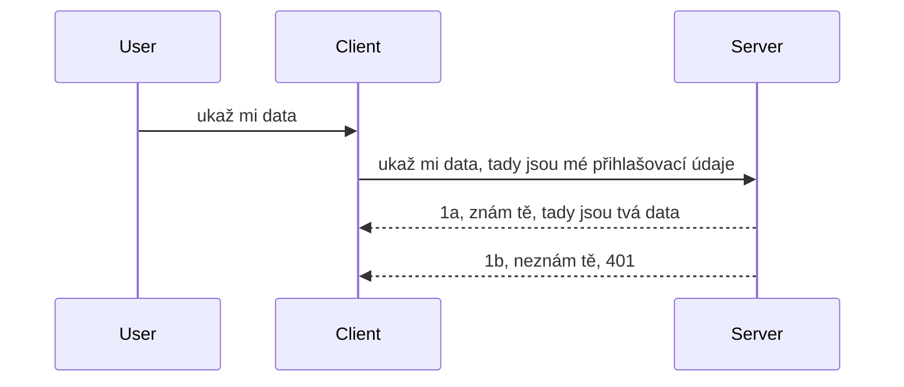

# Jednoduchá autentizace

MCP SDK podporují použití OAuth 2.1, což je upřímně řečeno docela složitý proces zahrnující koncepty jako auth server, resource server, zasílání přihlašovacích údajů, získávání kódu, výměnu kódu za bearer token až do okamžiku, kdy konečně získáte data z vašeho zdroje. Pokud nejste zvyklí na OAuth, což je skvělá věc k implementaci, je dobré začít s nějakou základní úrovní autentizace a postupně budovat lepší a lepší bezpečnost. Právě proto tato kapitola existuje, aby vás postupně zavedla k pokročilejší autentizaci.

## Autentizace, co tím myslíme?

Autentizace je zkratka pro ověřování a autorizaci. Cílem je udělat dvě věci:

- **Ověření identity (Authentication)**, což je proces zjišťování, zda člověku dovolíme vstoupit do našeho domu, zda má právo být "tady", tedy mít přístup k našemu resource serveru, kde žijí funkce našeho MCP Serveru.
- **Autorizace (Authorization)**, je proces zjišťování, zda by měl uživatel mít přístup ke konkrétním zdrojům, o které žádá, například k těmto objednávkám nebo těmto produktům, nebo zda má u nich právo pouze číst obsah, ale ne mazat, jako další příklad.

## Přihlašovací údaje: jak systému říkáme, kdo jsme

Většina webových vývojářů začne uvažovat v souvislosti s poskytnutím přihlašovacích údajů (credentials) serveru, obvykle tajemství, které říká, zda smí být zde "Authentication". Tento údaj je obvykle zakódovaná base64 verze uživatelského jména a hesla, nebo API klíč, který jedinečně identifikuje konkrétního uživatele.

To obnáší zasílání přes hlavičku nazvanou "Authorization" takto:

```json
{ "Authorization": "secret123" }
```

Toto je obvykle označováno jako základní autentizace (basic authentication). Jak celkový tok pak funguje, je v následujícím:


Nyní, když rozumíme fungování z hlediska toku, jak to implementovat? Většina webových serverů má koncept nazvaný middleware, což je kus kódu, který běží jako součást požadavku a může ověřit přihlašovací údaje, a pokud jsou platné, nechá požadavek projít. Pokud požadavek nemá platné údaje, dostanete chybu autentizace. Podívejme se, jak to lze implementovat:

**Python**

```python
class AuthMiddleware(BaseHTTPMiddleware):
    async def dispatch(self, request, call_next):

        has_header = request.headers.get("Authorization")
        if not has_header:
            print("-> Missing Authorization header!")
            return Response(status_code=401, content="Unauthorized")

        if not valid_token(has_header):
            print("-> Invalid token!")
            return Response(status_code=403, content="Forbidden")

        print("Valid token, proceeding...")
       
        response = await call_next(request)
        # přidat jakékoliv zákaznické hlavičky nebo nějakým způsobem změnit odpověď
        return response


starlette_app.add_middleware(CustomHeaderMiddleware)
```

Zde máme:

- Vytvořen middleware nazvaný `AuthMiddleware`, kde je metoda `dispatch` volána webovým serverem.
- Přidán middleware do webového serveru:

    ```python
    starlette_app.add_middleware(AuthMiddleware)
    ```

- Napsanou validační logiku, která kontroluje, zda hlavička Authorization je přítomna a zda je zaslané tajemství platné:

    ```python
    has_header = request.headers.get("Authorization")
    if not has_header:
        print("-> Missing Authorization header!")
        return Response(status_code=401, content="Unauthorized")

    if not valid_token(has_header):
        print("-> Invalid token!")
        return Response(status_code=403, content="Forbidden")
    ```

    pokud tajemství existuje a je platné, necháme požadavek projít zavoláním `call_next` a vrátíme odpověď.

    ```python
    response = await call_next(request)
    # přidejte jakékoli zákaznické hlavičky nebo nějakým způsobem změňte odpověď
    return response
    ```

Jak to funguje, je to, že pokud je provedena webová žádost na server, middleware se vyvolá a podle implementace buď nechá požadavek projít nebo vrátí chybu, která znamená, že klient není povolen pokračovat.

**TypeScript**

Zde vytvoříme middleware s populárním frameworkem Express a zachytíme požadavek, než dosáhne MCP Serveru. Zde je kód:

```typescript
function isValid(secret) {
    return secret === "secret123";
}

app.use((req, res, next) => {
    // 1. Hlavička autorizace přítomna?
    if(!req.headers["Authorization"]) {
        res.status(401).send('Unauthorized');
    }
    
    let token = req.headers["Authorization"];

    // 2. Zkontrolujte platnost.
    if(!isValid(token)) {
        res.status(403).send('Forbidden');
    }

   
    console.log('Middleware executed');
    // 3. Předá požadavek do dalšího kroku v řetězci zpracování požadavků.
    next();
});
```

V tomto kódu:

1. Kontrolujeme, zda je hlavička Authorization v první řadě přítomna, pokud ne, pošleme chybu 401.
2. Ověříme platnost přihlašovacího údaje/tokenu, pokud ne, pošleme chybu 403.
3. Nakonec předáme požadavek dále v pipeline a vrátíme požadovaný zdroj.

## Cvičení: Implementujte autentizaci

Vyzkoušíme si naše znalosti a zkusíme ji implementovat. Plán je tento:

Server

- Vytvořit webový server a instanci MCP.
- Implementovat middleware pro server.

Klient

- Poslat webový požadavek s přihlašovacími údaji v hlavičce.

### -1- Vytvořit webový server a instanci MCP

V prvním kroku musíme vytvořit webovou instanci serveru a MCP Server.

**Python**

Zde vytvoříme instanci MCP serveru, vytvoříme starlette webovou aplikaci a hostíme ji pomocí uvicorn.

```python
# vytváření MCP serveru

app = FastMCP(
    name="MCP Resource Server",
    instructions="Resource Server that validates tokens via Authorization Server introspection",
    host=settings["host"],
    port=settings["port"],
    debug=True
)

# vytváření webové aplikace starlette
starlette_app = app.streamable_http_app()

# obsluha aplikace přes uvicorn
async def run(starlette_app):
    import uvicorn
    config = uvicorn.Config(
            starlette_app,
            host=app.settings.host,
            port=app.settings.port,
            log_level=app.settings.log_level.lower(),
        )
    server = uvicorn.Server(config)
    await server.serve()

run(starlette_app)
```

V tomto kódu:

- Vytvoříme MCP Server.
- Sestavíme starlette webovou aplikaci z MCP Serveru, `app.streamable_http_app()`.
- Hostíme a servírujeme webovou aplikaci pomocí uvicornu `server.serve()`.

**TypeScript**

Zde vytvoříme instanci MCP Serveru.

```typescript
const server = new McpServer({
      name: "example-server",
      version: "1.0.0"
    });

    // ... nastavit síťové prostředky, nástroje a výzvy ...
```

Tvorba MCP Serveru musí proběhnout uvnitř definice POST /mcp trasy, takže vezměme výše uvedený kód a přesuňme ho takto:

```typescript
import express from "express";
import { randomUUID } from "node:crypto";
import { McpServer } from "@modelcontextprotocol/sdk/server/mcp.js";
import { StreamableHTTPServerTransport } from "@modelcontextprotocol/sdk/server/streamableHttp.js";
import { isInitializeRequest } from "@modelcontextprotocol/sdk/types.js"

const app = express();
app.use(express.json());

// Mapa pro ukládání transportů podle ID relace
const transports: { [sessionId: string]: StreamableHTTPServerTransport } = {};

// Zpracovat POST požadavky pro komunikaci klient-server
app.post('/mcp', async (req, res) => {
  // Zkontrolovat existující ID relace
  const sessionId = req.headers['mcp-session-id'] as string | undefined;
  let transport: StreamableHTTPServerTransport;

  if (sessionId && transports[sessionId]) {
    // Znovu použít existující transport
    transport = transports[sessionId];
  } else if (!sessionId && isInitializeRequest(req.body)) {
    // Nový inicializační požadavek
    transport = new StreamableHTTPServerTransport({
      sessionIdGenerator: () => randomUUID(),
      onsessioninitialized: (sessionId) => {
        // Uložit transport podle ID relace
        transports[sessionId] = transport;
      },
      // Ochrana proti DNS rebindingu je ve výchozím nastavení deaktivována kvůli zpětné kompatibilitě. Pokud tento server
      // provozujete lokálně, ujistěte se, že máte nastaveno:
      // enableDnsRebindingProtection: true,
      // allowedHosts: ['127.0.0.1'],
    });

    // Vyčistit transport po uzavření
    transport.onclose = () => {
      if (transport.sessionId) {
        delete transports[transport.sessionId];
      }
    };
    const server = new McpServer({
      name: "example-server",
      version: "1.0.0"
    });

    // ... nastavit serverové zdroje, nástroje a výzvy ...

    // Připojit se k MCP serveru
    await server.connect(transport);
  } else {
    // Neplatný požadavek
    res.status(400).json({
      jsonrpc: '2.0',
      error: {
        code: -32000,
        message: 'Bad Request: No valid session ID provided',
      },
      id: null,
    });
    return;
  }

  // Zpracovat požadavek
  await transport.handleRequest(req, res, req.body);
});

// Opakovaně použitelný handler pro GET a DELETE požadavky
const handleSessionRequest = async (req: express.Request, res: express.Response) => {
  const sessionId = req.headers['mcp-session-id'] as string | undefined;
  if (!sessionId || !transports[sessionId]) {
    res.status(400).send('Invalid or missing session ID');
    return;
  }
  
  const transport = transports[sessionId];
  await transport.handleRequest(req, res);
};

// Zpracovat GET požadavky pro oznámení server-klient přes SSE
app.get('/mcp', handleSessionRequest);

// Zpracovat DELETE požadavky pro ukončení relace
app.delete('/mcp', handleSessionRequest);

app.listen(3000);
```

Nyní vidíte, jak byla tvorba MCP Serveru přesunuta do `app.post("/mcp")`.

Pokračujme k dalšímu kroku - vytvoření middleware, abychom mohli validovat příchozí přihlašovací údaje.

### -2- Implementovat middleware pro server

Přejdeme k části middleware. Zde vytvoříme middleware, který hledá přihlašovací údaje v hlavičce `Authorization` a ověří je. Pokud jsou přijatelné, požadavek pokračuje v požadované akci (např. výpis nástrojů, čtení zdroje nebo cokoli, co MCP klient požaduje).

**Python**

Pro vytvoření middleware je potřeba vytvořit třídu, která dědí z `BaseHTTPMiddleware`. Jsou tu dva důležité aspekty:

- Dotaz `request`, z kterého čteme hlavičky.
- `call_next`, callback, který je potřeba vyvolat, pokud klient přinesl přihlašovací údaje, které akceptujeme.

Nejprve musíme zpracovat případ, kdy chybí hlavička `Authorization`:

```python
has_header = request.headers.get("Authorization")

# hlavička není přítomna, neúspěch s 401, jinak pokračujte.
if not has_header:
    print("-> Missing Authorization header!")
    return Response(status_code=401, content="Unauthorized")
```

Zde posíláme zprávu 401 unauthorized, protože klient selhal v autentizaci.

Dále, pokud byly přihlašovací údaje zaslány, ověříme jejich platnost následovně:

```python
 if not valid_token(has_header):
    print("-> Invalid token!")
    return Response(status_code=403, content="Forbidden")
```

Všimněte si, že posíláme zprávu 403 forbidden. Podívejme se na celý middleware implementující vše, co jsme popsali výše:

```python
class AuthMiddleware(BaseHTTPMiddleware):
    async def dispatch(self, request, call_next):

        has_header = request.headers.get("Authorization")
        if not has_header:
            print("-> Missing Authorization header!")
            return Response(status_code=401, content="Unauthorized")

        if not valid_token(has_header):
            print("-> Invalid token!")
            return Response(status_code=403, content="Forbidden")

        print("Valid token, proceeding...")
        print(f"-> Received {request.method} {request.url}")
        response = await call_next(request)
        response.headers['Custom'] = 'Example'
        return response

```

Skvělé, ale co funkce `valid_token`? Zde je:

```python
# NEPOUŽÍVEJTE pro produkci - zlepšete to !!
def valid_token(token: str) -> bool:
    # odeberte předponu "Bearer "
    if token.startswith("Bearer "):
        token = token[7:]
        return token == "secret-token"
    return False
```

To je samozřejmě potřeba vylepšit.

DŮLEŽITÉ: Nikdy byste v kódu neměli mít uložená taková tajemství. Hodnotu byste měli ideálně získávat z datového zdroje nebo od IDP (identity service provider), nebo ještě lépe, nechte IDP provádět validaci.

**TypeScript**

Pro implementaci s Express je potřeba zavolat metodu `use`, která přebírá middleware funkce.

Potřebujeme:

- Pracovat s objektem request a zkontrolovat přihlašovací uchycený v `Authorization`.
- Validovat přihlašovací údaje a pokud jsou platné, nechat požadavek pokračovat a udělat, co klient vyžaduje (např. výpis nástrojů, čtení zdroje, nebo cokoli dalšího spojeného s MCP).

Zde kontrolujeme, zda je hlavička `Authorization` přítomna, a pokud ne, zastavíme požadavek:

```typescript
if(!req.headers["authorization"]) {
    res.status(401).send('Unauthorized');
    return;
}
```

Pokud hlavička není zaslána, dostanete 401.

Dále kontrolujeme platnost přihlašovacích údajů, pokud nejsou platné, zastavíme požadavek s trochu jinou zprávou:

```typescript
if(!isValid(token)) {
    res.status(403).send('Forbidden');
    return;
} 
```

Vidíte, že dostanete chybu 403.

Zde je celý kód:

```typescript
app.use((req, res, next) => {
    console.log('Request received:', req.method, req.url, req.headers);
    console.log('Headers:', req.headers["authorization"]);
    if(!req.headers["authorization"]) {
        res.status(401).send('Unauthorized');
        return;
    }
    
    let token = req.headers["authorization"];

    if(!isValid(token)) {
        res.status(403).send('Forbidden');
        return;
    }  

    console.log('Middleware executed');
    next();
});
```

Nastavili jsme webový server, aby přijímal middleware, který ověřuje přihlašovací údaje, které nám klient posílá. Co klient samotný?

### -3- Poslat webový požadavek s přihlašovacími údaji v hlavičce

Musíme zajistit, aby klient posílal přihlašovací údaje v hlavičce. Jelikož použijeme MCP klienta, musíme zjistit, jak se to dělá.

**Python**

Pro klienta potřebujeme poslat hlavičku s přihlašovacími údaji takto:

```python
# NEvou dit hodnotu napevno, mějte ji alespoň v proměnné prostředí nebo v bezpečnějším úložišti
token = "secret-token"

async with streamablehttp_client(
        url = f"http://localhost:{port}/mcp",
        headers = {"Authorization": f"Bearer {token}"}
    ) as (
        read_stream,
        write_stream,
        session_callback,
    ):
        async with ClientSession(
            read_stream,
            write_stream
        ) as session:
            await session.initialize()
      
            # TODO, co chcete, aby bylo provedeno na klientovi, např. vypsat nástroje, zavolat nástroje apod.
```

Všimněte si, jak naplňujeme vlastnost `headers` takto: ` headers = {"Authorization": f"Bearer {token}"}`.

**TypeScript**

To lze vyřešit ve dvou krocích:

1. Naplnit konfigurační objekt přihlašovacími údaji.
2. Předat tento konfigurační objekt transportu.

```typescript

// NEtvrdě kódujte hodnotu, jak je ukázáno zde. Minimálně ji mějte jako proměnnou prostředí a používejte něco jako dotenv (v režimu vývoje).
let token = "secret123"

// definujte objekt s možnostmi klientského transportu
let options: StreamableHTTPClientTransportOptions = {
  sessionId: sessionId,
  requestInit: {
    headers: {
      "Authorization": "secret123"
    }
  }
};

// předat objekt možností do transportu
async function main() {
   const transport = new StreamableHTTPClientTransport(
      new URL(serverUrl),
      options
   );
```

Vidíte výše, jak jsme museli vytvořit objekt `options` a umístit hlavičky pod vlastnost `requestInit`.

DŮLEŽITÉ: Jak to zlepšit? Současná implementace má některé problémy. Především předávání přihlašovacích údajů tímto způsobem je poměrně rizikové, pokud nemáte minimálně HTTPS. I tak však může dojít ke krádeži tokenu, proto potřebujete systém, kde můžete jednoduše token zrušit a přidat další ověření, například z jaké oblasti světa požadavek přichází, zda požadavky nepřichází příliš často (chování botů) a další obavy.

Je třeba však říci, že pro velmi jednoduchá API, kde nechcete, aby kdokoliv volal vaše API bez autentizace, je toto dobrý začátek.

S tímto vědomím se pokusme trochu zpevnit bezpečnost použitím standardizovaného formátu jako jsou JSON Web Tokeny, známé také jako JWT nebo „JOT“ tokeny.

## JSON Web Tokeny, JWT

Takže se snažíme věci zlepšit oproti velmi jednoduchým přihlašovacím údajům. Jaká jsou bezprostřední vylepšení při přechodu na JWT?

- **Zlepšení bezpečnosti.** U základní autentizace posíláte uživatelské jméno a heslo jako base64 zakódovaný token (nebo posíláte API klíč) opakovaně, což zvyšuje riziko. S JWT posíláte uživatelské jméno a heslo a dostanete token na časově omezenou dobu platnosti, který vyprší. JWT umožňuje snadno používat jemné řízení přístupu pomocí rolí, oblastí (scopes) a oprávnění.
- **Bezstavovost a škálovatelnost.** JWT jsou soběstačné, nesou všechny informace o uživateli a eliminují potřebu serverového ukládání relací. Token může být také lokálně ověřen.
- **Interoperabilita a federace.** JWT jsou středobodem Open ID Connect a používají se s známými poskytovateli identity jako Entra ID, Google Identity a Auth0. Rovněž umožňují jednotné přihlášení (SSO) a mnoho dalšího, což je řadí k podnikové úrovni.
- **Modularita a flexibilita.** JWT lze použít i s API bránami jako Azure API Management, NGINX a dalšími. Podporují scénáře autentizace uživatelů i komunikaci server-ke-serveru včetně zástupných a delegačních scénářů.
- **Výkon a kešování.** Po dekódování lze JWT kešovat, což snižuje potřebu parsování. To pomáhá zvláště u aplikací s vysokou návštěvností, protože zlepšuje propustnost a snižuje zátěž na infrastrukturě.
- **Pokročilé funkce.** Podporují také introspekci (kontrolu platnosti na serveru) a zrušení platnosti tokenu (revokace).

S těmito výhodami se podíváme, jak zvednout implementaci na vyšší úroveň.

## Přeměna základní autentizace na JWT

Takže změny, které musíme provést na vysoké úrovni jsou:

- **Naučit se sestavit JWT token** a připravit ho k odeslání z klienta na server.
- **Validovat JWT token** a pokud je platný, umožnit klientovi přístup ke zdrojům.
- **Bezpečné uložení tokenu**. Jak token uložíme.
- **Ochrana tras**. Potřebujeme chránit trasy, v našem případě konkrétní MCP funkce.
- **Přidat refresh tokeny**. Zajistit generování krátkodobých tokenů a také dlouhodobých refresh tokenů, které lze použít k získání nových tokenů po vypršení platnosti. Zabezpečit refresh endpoint a strategii rotace.

### -1- Vytvořit JWT token

JWT token má následující části:

- **hlavička (header)**, algoritmus použitý a typ tokenu.
- **náklad (payload)**, tvrzení (claims), typicky sub (uživatel nebo entita, kterou token představuje, v autentizačním scénáři to bývá uživatelské ID), exp (datum expirace), role (role uživatele).
- **podpis (signature)**, podepsaný tajemstvím nebo soukromým klíčem.

Musíme tedy sestavit hlavičku, payload a zakódovaný token.

**Python**

```python

import jwt
import jwt
from jwt.exceptions import ExpiredSignatureError, InvalidTokenError
import datetime

# Tajný klíč používaný k podepsání JWT
secret_key = 'your-secret-key'

header = {
    "alg": "HS256",
    "typ": "JWT"
}

# informace o uživateli, jeho nároky a doba vypršení platnosti
payload = {
    "sub": "1234567890",               # Předmět (ID uživatele)
    "name": "User Userson",                # Vlastní nárok
    "admin": True,                     # Vlastní nárok
    "iat": datetime.datetime.utcnow(),# Vystaveno
    "exp": datetime.datetime.utcnow() + datetime.timedelta(hours=1)  # Vypršení platnosti
}

# zakódovat to
encoded_jwt = jwt.encode(payload, secret_key, algorithm="HS256", headers=header)
```

Výše uvedený kód:

- Definuje hlavičku s algoritmem HS256 a typem JWT.
- Konstrukce payloadu obsahujícího subject nebo ID uživatele, uživatelské jméno, roli, kdy byl vydán a kdy expiruje, čímž implementuje časovou omezenost.

**TypeScript**

Budeme potřebovat závislosti, které nám pomohou s konstrukcí JWT tokenu.

Závislosti

```sh

npm install jsonwebtoken
npm install --save-dev @types/jsonwebtoken
```

Nyní máme vše připraveno, vytvoříme hlavičku, payload a uložíme zakódovaný token.

```typescript
import jwt from 'jsonwebtoken';

const secretKey = 'your-secret-key'; // Použijte proměnné prostředí v produkci

// Definujte užitečné zatížení
const payload = {
  sub: '1234567890',
  name: 'User usersson',
  admin: true,
  iat: Math.floor(Date.now() / 1000), // Čas vydání
  exp: Math.floor(Date.now() / 1000) + 60 * 60 // Vyprší za 1 hodinu
};

// Definujte hlavičku (volitelné, jsonwebtoken nastavuje výchozí hodnoty)
const header = {
  alg: 'HS256',
  typ: 'JWT'
};

// Vytvořte token
const token = jwt.sign(payload, secretKey, {
  algorithm: 'HS256',
  header: header
});

console.log('JWT:', token);
```

Tento token je:

Podepsán pomocí HS256  
Platný 1 hodinu  
Obsahuje tvrzení jako sub, name, admin, iat a exp.

### -2- Validovat token

Musíme také validovat token, což by měl server dělat, aby ověřil, že klient posílá skutečně platný token. Měli bychom provádět mnoho kontrol, od struktury tokenu po jeho platnost. Doporučuje se také přidat další kontroly, např. zda je uživatel v našem systému a další.

Pro validaci tokenu musíme token dekódovat, abychom ho mohli přečíst, a poté kontrolovat platnost:

**Python**

```python

# Dekódujte a ověřte JWT
try:
    decoded = jwt.decode(token, secret_key, algorithms=["HS256"])
    print("✅ Token is valid.")
    print("Decoded claims:")
    for key, value in decoded.items():
        print(f"  {key}: {value}")
except ExpiredSignatureError:
    print("❌ Token has expired.")
except InvalidTokenError as e:
    print(f"❌ Invalid token: {e}")

```

V tomto kódu voláme `jwt.decode` s tokenem, tajným klíčem a vybraným algoritmem. Všimněte si, že používáme try-catch blok, protože neúspěšná validace vyvolá výjimku.

**TypeScript**

Zde voláme `jwt.verify`, abychom získali dekódovanou verzi tokenu, kterou můžeme dále analyzovat. Pokud volání selže, znamená to, že token je ve špatné struktuře nebo už není platný.

```typescript

try {
  const decoded = jwt.verify(token, secretKey);
  console.log('Decoded Payload:', decoded);
} catch (err) {
  console.error('Token verification failed:', err);
}
```

POZNÁMKA: jak bylo zmíněno dříve, měli bychom provádět další kontroly, zda token odkazuje na uživatele v našem systému a zda má uživatel práva, která token uvádí.

Dále se podíváme na řízení přístupu založené na rolích (RBAC).
## Přidání řízení přístupu na základě rolí

Myšlenka je taková, že chceme vyjádřit, že různé role mají různá oprávnění. Například předpokládáme, že admin může dělat vše, normální uživatel může číst/zapisovat a host může pouze číst. Proto zde jsou některé možné úrovně oprávnění:

- Admin.Write  
- User.Read  
- Guest.Read  

Podíváme se, jak můžeme takové řízení implementovat pomocí middleware. Middleware se může přidat na jednotlivé cesty i na všechny cesty.

**Python**

```python
from starlette.middleware.base import BaseHTTPMiddleware
from starlette.responses import JSONResponse
import jwt

# NEUCHOVÁVEJTE tajný klíč v kódu, toto je jen pro demonstrační účely. Čtěte ho z bezpečného místa.
SECRET_KEY = "your-secret-key" # uložte to do proměnné prostředí
REQUIRED_PERMISSION = "User.Read"

class JWTPermissionMiddleware(BaseHTTPMiddleware):
    async def dispatch(self, request, call_next):
        auth_header = request.headers.get("Authorization")
        if not auth_header or not auth_header.startswith("Bearer "):
            return JSONResponse({"error": "Missing or invalid Authorization header"}, status_code=401)

        token = auth_header.split(" ")[1]
        try:
            decoded = jwt.decode(token, SECRET_KEY, algorithms=["HS256"])
        except jwt.ExpiredSignatureError:
            return JSONResponse({"error": "Token expired"}, status_code=401)
        except jwt.InvalidTokenError:
            return JSONResponse({"error": "Invalid token"}, status_code=401)

        permissions = decoded.get("permissions", [])
        if REQUIRED_PERMISSION not in permissions:
            return JSONResponse({"error": "Permission denied"}, status_code=403)

        request.state.user = decoded
        return await call_next(request)


```
  
Existuje několik různých způsobů, jak přidat middleware jako níže:

```python

# Alt 1: přidat middleware při konstrukci starlette aplikace
middleware = [
    Middleware(JWTPermissionMiddleware)
]

app = Starlette(routes=routes, middleware=middleware)

# Alt 2: přidat middleware poté, co je starlette aplikace již vytvořena
starlette_app.add_middleware(JWTPermissionMiddleware)

# Alt 3: přidat middleware pro každou trasu
routes = [
    Route(
        "/mcp",
        endpoint=..., # zpracovatel
        middleware=[Middleware(JWTPermissionMiddleware)]
    )
]
```
  
**TypeScript**

Můžeme použít `app.use` a middleware, který poběží pro všechny požadavky.

```typescript
app.use((req, res, next) => {
    console.log('Request received:', req.method, req.url, req.headers);
    console.log('Headers:', req.headers["authorization"]);

    // 1. Zkontrolujte, zda byl odeslán autorizační hlavička

    if(!req.headers["authorization"]) {
        res.status(401).send('Unauthorized');
        return;
    }
    
    let token = req.headers["authorization"];

    // 2. Zkontrolujte, zda je token platný
    if(!isValid(token)) {
        res.status(403).send('Forbidden');
        return;
    }  

    // 3. Zkontrolujte, zda uživatel tokenu existuje v našem systému
    if(!isExistingUser(token)) {
        res.status(403).send('Forbidden');
        console.log("User does not exist");
        return;
    }
    console.log("User exists");

    // 4. Ověřte, zda má token správná oprávnění
    if(!hasScopes(token, ["User.Read"])){
        res.status(403).send('Forbidden - insufficient scopes');
    }

    console.log("User has required scopes");

    console.log('Middleware executed');
    next();
});

```
  
Je několik věcí, které můžeme nechat middleware dělat a které by middleware MĚL dělat, konkrétně:

1. Zkontrolovat, zda je přítomen záhlaví autorizace  
2. Zkontrolovat, zda je token platný, voláme `isValid`, což je metoda, kterou jsme napsali a která kontroluje integritu a platnost JWT tokenu.  
3. Ověřit, zda uživatel existuje v našem systému, to bychom měli zkontrolovat.

   ```typescript
    // uživatelé v databázi
   const users = [
     "user1",
     "User usersson",
   ]

   function isExistingUser(token) {
     let decodedToken = verifyToken(token);

     // TODO, zkontrolovat, zda uživatel existuje v databázi
     return users.includes(decodedToken?.name || "");
   }
   ```
  
Výše jsme vytvořili velmi jednoduchý seznam `users`, který by samozřejmě měl být v databázi.

4. Dále bychom měli také zkontrolovat, zda token má správná oprávnění.

   ```typescript
   if(!hasScopes(token, ["User.Read"])){
        res.status(403).send('Forbidden - insufficient scopes');
   }
   ```
  
V tomto kódu výše z middleware kontrolujeme, že token obsahuje oprávnění User.Read, pokud ne, posíláme chybu 403. Níže je pomocná metoda `hasScopes`.

   ```typescript
   function hasScopes(scope: string, requiredScopes: string[]) {
     let decodedToken = verifyToken(scope);
    return requiredScopes.every(scope => decodedToken?.scopes.includes(scope));
  }  
   ```

Have a think which additional checks you should be doing, but these are the absolute minimum of checks you should be doing.

Using Express as a web framework is a common choice. There are helpers library when you use JWT so you can write less code.

- `express-jwt`, helper library that provides a middleware that helps decode your token.
- `express-jwt-permissions`, this provides a middleware `guard` that helps check if a certain permission is on the token.

Here's what these libraries can look like when used:

```typescript
const express = require('express');
const jwt = require('express-jwt');
const guard = require('express-jwt-permissions')();

const app = express();
const secretKey = 'your-secret-key'; // put this in env variable

// Decode JWT and attach to req.user
app.use(jwt({ secret: secretKey, algorithms: ['HS256'] }));

// Check for User.Read permission
app.use(guard.check('User.Read'));

// multiple permissions
// app.use(guard.check(['User.Read', 'Admin.Access']));

app.get('/protected', (req, res) => {
  res.json({ message: `Welcome ${req.user.name}` });
});

// Error handler
app.use((err, req, res, next) => {
  if (err.code === 'permission_denied') {
    return res.status(403).send('Forbidden');
  }
  next(err);
});

```
  
Nyní jste viděli, jak lze middleware použít jak pro autentifikaci, tak i autorizaci. A co MCP, změní to, jak provádíme autentifikaci? Pojďme to zjistit v další části.

### -3- Přidání RBAC do MCP

Dosud jste viděli, jak můžete přidat RBAC přes middleware, ovšem u MCP není snadný způsob, jak přidat RBAC na úrovni jednotlivých funkcí MCP, co tedy dělat? Jednoduše musíme přidat kód jako tento, který v tomto případě kontroluje, zda klient má práva volat konkrétní nástroj:

Máte několik různých možností, jak dosáhnout RBAC na úrovni jednotlivých funkcí, zde jsou některé:

- Přidat kontrolu pro každý nástroj, zdroj, prompt, kde potřebujete zkontrolovat úroveň oprávnění.

   **python**

   ```python
   @tool()
   def delete_product(id: int):
      try:
          check_permissions(role="Admin.Write", request)
      catch:
        pass # klient se nepodařilo autorizovat, vyvolejte chybu autorizace
   ```
  
   **typescript**

   ```typescript
   server.registerTool(
    "delete-product",
    {
      title: Delete a product",
      description: "Deletes a product",
      inputSchema: { id: z.number() }
    },
    async ({ id }) => {
      
      try {
        checkPermissions("Admin.Write", request);
        // udělat, poslat ID do productService a vzdáleného vstupu
      } catch(Exception e) {
        console.log("Authorization error, you're not allowed");  
      }

      return {
        content: [{ type: "text", text: `Deletected product with id ${id}` }]
      };
    }
   );
   ```
  

- Použít pokročilý serverový přístup a request handlery tak, abyste minimalizovali, kolik míst musíte kontrolovat.

   **Python**

   ```python
   
   tool_permission = {
      "create_product": ["User.Write", "Admin.Write"],
      "delete_product": ["Admin.Write"]
   }

   def has_permission(user_permissions, required_permissions) -> bool:
      # user_permissions: seznam oprávnění, která uživatel má
      # required_permissions: seznam oprávnění požadovaných pro nástroj
      return any(perm in user_permissions for perm in required_permissions)

   @server.call_tool()
   async def handle_call_tool(
     name: str, arguments: dict[str, str] | None
   ) -> list[types.TextContent]:
    # Předpokládejme, že request.user.permissions je seznam oprávnění pro uživatele
     user_permissions = request.user.permissions
     required_permissions = tool_permission.get(name, [])
     if not has_permission(user_permissions, required_permissions):
        # Vyvolat chybu "Nemáte oprávnění k volání nástroje {name}"
        raise Exception(f"You don't have permission to call tool {name}")
     # pokračovat a zavolat nástroj
     # ...
   ```   
     

   **TypeScript**

   ```typescript
   function hasPermission(userPermissions: string[], requiredPermissions: string[]): boolean {
       if (!Array.isArray(userPermissions) || !Array.isArray(requiredPermissions)) return false;
       // Vrátí true, pokud má uživatel alespoň jedno požadované oprávnění
       
       return requiredPermissions.some(perm => userPermissions.includes(perm));
   }
  
   server.setRequestHandler(CallToolRequestSchema, async (request) => {
      const { params: { name } } = request;
  
      let permissions = request.user.permissions;
  
      if (!hasPermission(permissions, toolPermissions[name])) {
         return new Error(`You don't have permission to call ${name}`);
      }
  
      // pokračujte..
   });
   ```
  
   Poznámka, musíte zajistit, aby váš middleware přiřadil dekódovaný token do vlastnosti `user` requestu, takže kód výše je jednoduchý.

### Shrnutí

Nyní, když jsme probrali, jak přidat podporu pro RBAC obecně a zvláště pro MCP, je čas zkusit implementovat zabezpečení sami, abyste si ověřili, že jste pochopili představené koncepty.

## Úkol 1: Vytvořte MCP server a MCP klienta s použitím základní autentizace

Zde využijete, co jste se naučili o odesílání přihlašovacích údajů přes hlavičky.

## Řešení 1

[Řešení 1](./code/basic/README.md)

## Úkol 2: Vylepšete řešení z Úkolu 1, aby používalo JWT

Vezměte první řešení, ale tentokrát ho vylepšete.

Místo základní autentizace použijme JWT.

## Řešení 2

[Řešení 2](./solution/jwt-solution/README.md)

## Výzva

Přidejte RBAC na úrovni jednotlivých nástrojů, jak jsme popsali v sekci "Přidání RBAC do MCP".

## Shrnutí

Doufejme, že jste se v této kapitole hodně naučili, od nulové bezpečnosti přes základní bezpečnost až po JWT a jak jej přidat do MCP.

Vybudovali jsme pevný základ s vlastními JWT, ale jak škálujeme, směřujeme k modelu identity založeném na standardech. Přijetí poskytovatele identity (IdP) jako Entra nebo Keycloak nám umožní převzít vydávání tokenů, jejich ověřování a správu životního cyklu na důvěryhodné platformě — což nám uvolní ruce pro soustředění na logiku aplikace a uživatelský zážitek.

K tomu máme pokročilejší [kapitolu o Entra](../../05-AdvancedTopics/mcp-security-entra/README.md)

## Co dál

- Další: [Nastavení MCP hostitelů](../12-mcp-hosts/README.md)

---

<!-- CO-OP TRANSLATOR DISCLAIMER START -->
**Zřeknutí se odpovědnosti**:  
Tento dokument byl přeložen pomocí AI překladatelské služby [Co-op Translator](https://github.com/Azure/co-op-translator). Přestože usilujeme o přesnost, mějte prosím na paměti, že automatizované překlady mohou obsahovat chyby nebo nepřesnosti. Originální dokument v jeho rodném jazyce by měl být považován za autoritativní zdroj. Pro důležité informace se doporučuje profesionální lidský překlad. Nejsme odpovědní za žádné nedorozumění nebo chybné výklady vzniklé použitím tohoto překladu.
<!-- CO-OP TRANSLATOR DISCLAIMER END -->