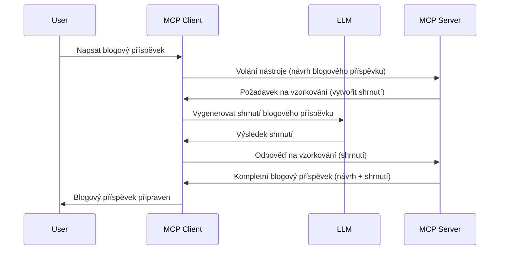

# Sampling - delegování funkcí klientovi

Někdy je potřeba, aby MCP klient a MCP server spolupracovali na dosažení společného cíle. Může se stát, že server potřebuje pomoc od LLM, který je umístěn na klientovi. V takové situaci byste měli použít sampling.

Pojďme prozkoumat některé případy použití a jak vybudovat řešení zahrnující sampling.

## Přehled

V této lekci se zaměříme na vysvětlení, kdy a kde sampling použít a jak jej nakonfigurovat.

## Výukové cíle

V této kapitole:

- Vysvětlíme, co je sampling a kdy ho používat.
- Ukážeme, jak sampling nakonfigurovat v MCP.
- Poskytneme příklady použití samplingu v praxi.

## Co je sampling a proč ho používat?

Sampling je pokročilá funkce, která funguje následovně:


### Sampling request

Dobře, nyní máme obecný přehled věrohodného scénáře, pojďme si promluvit o sampling requestu, který server zasílá zpět klientovi. Takto může takový požadavek vypadat ve formátu JSON-RPC:

```json
{
  "jsonrpc": "2.0",
  "id": 1,
  "method": "sampling/createMessage",
  "params": {
    "messages": [
      {
        "role": "user",
        "content": {
          "type": "text",
          "text": "Create a blog post summary of the following blog post: <BLOG POST>"
        }
      }
    ],
    "modelPreferences": {
      "hints": [
        {
          "name": "claude-3-sonnet"
        }
      ],
      "intelligencePriority": 0.8,
      "speedPriority": 0.5
    },
    "systemPrompt": "You are a helpful assistant.",
    "maxTokens": 100
  }
}
```

Je zde několik věcí, které stojí za zmínku:

- Prompt, pod content -> text, je náš prompt, což je instrukce pro LLM, aby shrnul obsah blogového příspěvku.

- **modelPreferences**. Tato část je právě to, doporučení, návrh konfigurace, která se má s LLM použít. Uživatel si může vybrat, zda doporučení přijme nebo je změní. V tomto případě jsou zde doporučení ohledně modelu, který použít, a priority rychlosti a inteligence.
- **systemPrompt**, to je váš běžný systémový prompt, který dává vašemu LLM osobnost a obsahuje pokyny.
- **maxTokens**, další vlastnost, která říká, kolik tokenů se doporučuje pro tento úkol použít.

### Sampling response

Tato odpověď je to, co MCP klient nakonec odešle zpět MCP serveru a je výsledkem toho, že klient zavolá LLM, počká na odpověď a pak sestaví tuto zprávu. Takto může vypadat ve formátu JSON-RPC:

```json
{
  "jsonrpc": "2.0",
  "id": 1,
  "result": {
    "role": "assistant",
    "content": {
      "type": "text",
      "text": "Here's your abstract <ABSTRACT>"
    },
    "model": "gpt-5",
    "stopReason": "endTurn"
  }
}
```

Všimněte si, že odpověď je abstrakt blogového příspěvku, přesně jak jsme chtěli. Dále si všimněte, že použitý `model` není ten, o který jsme žádali, ale "gpt-5" místo "claude-3-sonnet". To demonstruje, že uživatel si může rozmyslet, co chce použít, a váš sampling request je jen doporučení.

Dobře, nyní, když rozumíme hlavnímu průběhu a užitečnému úkolu "tvorba blogového příspěvku + abstrakt", pojďme zjistit, co potřebujeme udělat, aby to fungovalo.

### Typy zpráv

Samplingové zprávy nejsou omezeny jen na text, ale můžete také posílat obrázky a audio. Zde je, jak se JSON-RPC liší:

**Text**

```json
{
  "type": "text",
  "text": "The message content"
}
```

**Obsah obrázku**

```json
{
  "type": "image",
  "data": "base64-encoded-image-data",
  "mimeType": "image/jpeg"
}
```

**Audio obsah**

```json
{
  "type": "audio",
  "data": "base64-encoded-audio-data",
  "mimeType": "audio/wav"
}
```

> NOTE: pro podrobnější informace o samplingu navštivte [oficiální dokumentaci](https://modelcontextprotocol.io/specification/2025-06-18/client/sampling)

## Jak nakonfigurovat sampling na klientovi

> Poznámka: pokud stavíte jen server, nemusíte zde moc dělat.

Na klientovi musíte specifikovat následující funkci takto:

```json
{
  "capabilities": {
    "sampling": {}
  }
}
```

Toto pak bude načteno, když se váš zvolený klient inicializuje se serverem.

## Příklad samplingu v akci - vytvoření blogového příspěvku

Pojďme společně kódovat sampling server, budeme muset udělat následující:

1. Vytvořit nástroj na serveru.
1. Tento nástroj by měl vytvořit sampling request.
1. Nástroj by měl počkat na odpověď klienta na sampling request.
1. Poté by měl být vytvořen výsledek nástroje.

Podívejme se na kód krok za krokem:

### -1- Vytvoření nástroje

**python**

```python
@mcp.tool()
async def create_blog(title: str, content: str, ctx: Context[ServerSession, None]) -> str:
    """Create a blog post and generate a summary"""

```

### -2- Vytvoření sampling requestu

Rozšiřte svůj nástroj následujícím kódem:

**python**

```python
post = BlogPost(
        id=len(posts) + 1,
        title=title,
        content=content,
        abstract=""
    )

prompt = f"Create an abstract of the following blog post: title: {title} and draft: {content} "

result = await ctx.session.create_message(
        messages=[
            SamplingMessage(
                role="user",
                content=TextContent(type="text", text=prompt),
            )
        ],
        max_tokens=100,
)

```

### -3- Počkejte na odpověď a vraťte ji

**python**

```python
post.abstract = result.content.text

posts.append(post)

# vraťte kompletní výsledek
return json.dumps({
    "id": post.title,
    "abstract": post.abstract
})
```

### -4- Kompletní kód

**python**

```python
from starlette.applications import Starlette
from starlette.routing import Mount, Host

from mcp.server.fastmcp import Context, FastMCP

from mcp.server.session import ServerSession
from mcp.types import SamplingMessage, TextContent

import json


from uuid import uuid4
from typing import List
from pydantic import BaseModel


mcp = FastMCP("Blog post generator")

# app = FastAPI()

posts = []

class BlogPost(BaseModel):
    id: int
    title: str
    content: str
    abstract: str

posts: List[BlogPost] = []

@mcp.tool()
async def create_blog(title: str, content: str, ctx: Context[ServerSession, None]) -> str:
    """Create a blog post and generate a summary"""

    post = BlogPost(
        id=len(posts) + 1,
        title=title,
        content=content,
        abstract=""
    )

    prompt = f"Create an abstract of the following blog post: title: {title} and draft: {content} "

    result = await ctx.session.create_message(
        messages=[
            SamplingMessage(
                role="user",
                content=TextContent(type="text", text=prompt),
            )
        ],
        max_tokens=100,
    )

    post.abstract = result.content.text

    posts.append(post)

    # vrátit celý blogový příspěvek
    return json.dumps({
        "id": post.title,
        "abstract": post.abstract
    })

if __name__ == "__main__":
    print("Starting server...")
    # mcp.run()
    mcp.run(transport="streamable-http")

# spustit aplikaci pomocí: python server.py
```

### -5- Testování ve Visual Studio Code

Pro otestování toho ve Visual Studio Code proveďte následující:

1. Spusťte server v terminálu
1. Přidejte ho do *mcp.json* (a ujistěte se, že je spuštěn), například takto:

   ```json
   "servers": {
      "blog-server": {
        "type": "http",
        "url": "http://localhost:8000/mcp"
      }
   }
   ```

1. Napište prompt:

   ```text
   create a blog post named "Where Python comes from", the content is "Python is actually named after Monty Python Flying Circus"
   ```

1. Umožněte proběhnutí samplingu. Poprvé, když toto otestujete, objeví se dodatečný dialog, který musíte potvrdit, pak uvidíte běžný dialog, který vás požádá o spuštění nástroje.

1. Prohlédněte si výsledky. Výsledky uvidíte hezky vykreslené v GitHub Copilot Chat i můžete prohlédnout surovou JSON odpověď.

**Bonus**. Tools ve Visual Studio Code mají skvělou podporu pro sampling. Můžete nakonfigurovat přístup k samplingu pro váš nainstalovaný server takto:

1. Přejděte na sekci rozšíření.
1. Vyberte ikonu ozubeného kola u vašeho nainstalovaného serveru v sekci "MCP SERVERS - INSTALLED".
1. Vyberte "Configure Model Access", zde můžete zvolit, které modely může GitHub Copilot používat při provádění samplingu. Také zde můžete vidět všechny nedávné požadavky na sampling kliknutím na "Show Sampling requests".

## Zadání

V tomto zadání vytvoříte trochu jiný sampling, konkrétně integraci samplingu, která podporuje generování popisu produktu. Zde je váš scénář:

**Scénář**: Pracovník na back office e-shopu potřebuje pomoc, generování popisu produktů mu zabírá příliš času. Proto máte za úkol vytvořit řešení, kde můžete zavolat nástroj "create_product" s argumenty "title" a "keywords" a ten by měl vytvořit kompletní produkt včetně pole "description", které má vyplnit LLM klienta.

TIP: použijte to, co jste se naučili dříve, k sestavení tohoto serveru a jeho nástroje pomocí sampling requestu.

## Řešení

[Řešení](./solution/README.md)

## Klíčové závěry

Sampling je mocná funkce, která umožňuje serveru delegovat úkoly klientovi, když potřebuje pomoc LLM.

## Co dál

- [Kapitola 4 - Praktická implementace](../../04-PracticalImplementation/README.md)

---

<!-- CO-OP TRANSLATOR DISCLAIMER START -->
**Vyloučení odpovědnosti**:  
Tento dokument byl přeložen pomocí automatické překladatelské služby [Co-op Translator](https://github.com/Azure/co-op-translator). Přestože usilujeme o přesnost, mějte prosím na paměti, že automatické překlady mohou obsahovat chyby nebo nepřesnosti. Původní dokument v jeho rodném jazyce by měl být považován za autoritativní zdroj. Pro kritické informace se doporučuje profesionální lidský překlad. Nejsme odpovědni za jakékoli nedorozumění nebo chybné výklady vyplývající z použití tohoto překladu.
<!-- CO-OP TRANSLATOR DISCLAIMER END -->