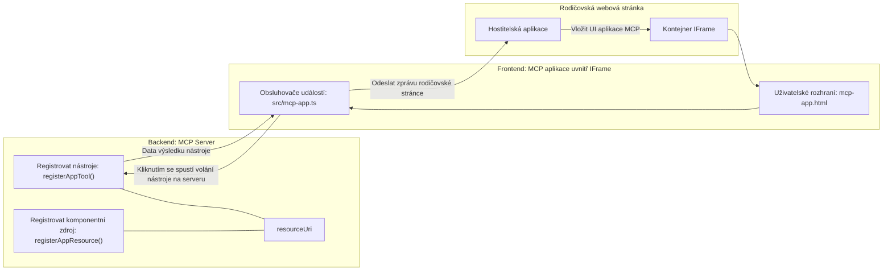

# MCP Aplikace

MCP Aplikace jsou novým paradigmatem v MCP. Myšlenka je taková, že nejenže odpovídáte s daty z volání nástroje, ale také poskytujete informace o tom, jak by mělo být s těmito informacemi interagováno. To znamená, že výsledky nástrojů nyní mohou obsahovat informace o uživatelském rozhraní. Proč by to ale někdo chtěl? No, zvažte, jak věci děláte dnes. Pravděpodobně konzumujete výsledky MCP Serveru tím, že před něj nasadíte nějaký frontend, což je kód, který musíte napsat a udržovat. Někdy je to přesně to, co chcete, ale jindy by bylo skvělé, kdybyste mohli jednoduše přinést kousek informace, který je samostatný a obsahuje vše od dat po uživatelské rozhraní.

## Přehled

Tato lekce poskytuje praktické pokyny k MCP Aplikacím, jak s nimi začít a jak je integrovat do svých stávajících webových aplikací. MCP Aplikace jsou velmi novým přírůstkem do MCP Standardu.

## Cíle učení

Na konci této lekce budete schopni:

- Vysvětlit, co jsou MCP Aplikace.
- Kdy používat MCP Aplikace.
- Vytvořit a integrovat své vlastní MCP Aplikace.

## MCP Aplikace – jak to funguje

Myšlenka MCP Aplikací je poskytnout odpověď, která je v podstatě komponentou k vykreslení. Taková komponenta může mít jak vizuály, tak interaktivitu, např. kliknutí na tlačítka, uživatelský vstup a další. Začněme na serverové straně a našem MCP Serveru. Pro vytvoření komponenty MCP Aplikace musíte vytvořit nástroj, ale také zdroj aplikace. Tyto dvě poloviny jsou spojeny pomocí resourceUri.

Zde je příklad. Pokusme se vizualizovat, co to zahrnuje a jaké části co vykonávají:

```text
server.ts -- responsible for registering tools and the component as a UI component
src/
  mcp-app.ts -- wiring up event handlers
mcp-app.html -- the user interface
```
  
Toto zobrazení popisuje architekturu pro vytvoření komponenty a její logiku.


Pojďme se nyní pokusit popsat odpovědnosti backendu a frontendu.

### Backend

Musíme tady zvládnout dvě věci:

- Registrovat nástroje, se kterými chceme interagovat.
- Definovat komponentu.

**Registrace nástroje**

```typescript
registerAppTool(
    server,
    "get-time",
    {
      title: "Get Time",
      description: "Returns the current server time.",
      inputSchema: {},
      _meta: { ui: { resourceUri } }, // Propojuje tento nástroj s jeho zdrojem uživatelského rozhraní
    },
    async () => {
      const time = new Date().toISOString();
      return { content: [{ type: "text", text: time }] };
    },
  );

```
  
Předchozí kód popisuje chování, kde vystavuje nástroj nazvaný `get-time`. Nástroj nevyžaduje vstupy, ale nakonec vrací aktuální čas. Máme také možnost definovat `inputSchema` pro nástroje, kde potřebujeme přijímat uživatelský vstup.

**Registrace komponenty**

Ve stejném souboru musíme také zaregistrovat komponentu:

```typescript
const resourceUri = "ui://get-time/mcp-app.html";

// Zaregistrujte zdroj, který vrací zabalený HTML/JavaScript pro uživatelské rozhraní.
registerAppResource(
  server,
  resourceUri,
  resourceUri,
  { mimeType: RESOURCE_MIME_TYPE },
  async () => {
    const html = await fs.readFile(path.join(DIST_DIR, "mcp-app.html"), "utf-8");

    return {
    contents: [
        { uri: resourceUri, mimeType: RESOURCE_MIME_TYPE, text: html },
    ],
    };
  },
);
```
  
Všimněte si, jak zmiňujeme `resourceUri` pro propojení komponenty s jejími nástroji. Zajímavá je také zpětná vazba, kde načítáme UI soubor a vracíme komponentu.

### Frontend komponenty

Stejně jako backend, i zde jsou dvě části:

- Frontend napsaný v čistém HTML.
- Kód, který zpracovává události a co dělat, např. volání nástrojů nebo zasílání zpráv rodičovskému oknu.

**Uživatelské rozhraní**

Pojďme se podívat na uživatelské rozhraní.

```html
<!-- mcp-app.html -->
<!DOCTYPE html>
<html lang="en">
  <head>
    <meta charset="UTF-8" />
    <title>Get Time App</title>
  </head>
  <body>
    <p>
      <strong>Server Time:</strong> <code id="server-time">Loading...</code>
    </p>
    <button id="get-time-btn">Get Server Time</button>
    <script type="module" src="/src/mcp-app.ts"></script>
  </body>
</html>
```
  
**Připojení událostí**

Poslední část je připojení událostí. To znamená, že identifikujeme, která část v našem UI potřebuje obsluhu událostí a co dělat, pokud jsou vyvolány:

```typescript
// mcp-app.ts

import { App } from "@modelcontextprotocol/ext-apps";

// Získejte reference na prvky
const serverTimeEl = document.getElementById("server-time")!;
const getTimeBtn = document.getElementById("get-time-btn")!;

// Vytvořte instanci aplikace
const app = new App({ name: "Get Time App", version: "1.0.0" });

// Zpracujte výsledky nástroje ze serveru. Nastavte před `app.connect()`, aby se zabránilo
// zmeškání počátečního výsledku nástroje.
app.ontoolresult = (result) => {
  const time = result.content?.find((c) => c.type === "text")?.text;
  serverTimeEl.textContent = time ?? "[ERROR]";
};

// Připojte kliknutí na tlačítko
getTimeBtn.addEventListener("click", async () => {
  // `app.callServerTool()` umožňuje uživatelskému rozhraní požádat o čerstvá data ze serveru
  const result = await app.callServerTool({ name: "get-time", arguments: {} });
  const time = result.content?.find((c) => c.type === "text")?.text;
  serverTimeEl.textContent = time ?? "[ERROR]";
});

// Připojit k hostiteli
app.connect();
```
  
Jak vidíte výše, jedná se o běžný kód pro připojení DOM prvků k událostem. Stojí za zmínku volání `callServerTool`, které nakonec zavolá nástroj na backendu.

## Práce s uživatelským vstupem

Dosud jsme viděli komponentu, která má tlačítko, jež při kliknutí zavolá nástroj. Podívejme se, zda můžeme přidat další UI prvky, jako je vstupní pole, a zjistit, zda můžeme posílat argumenty nástroji. Implementujme funkci FAQ. Mělo by to fungovat takto:

- Mělo by být tlačítko a vstupní prvek, kam uživatel zadá klíčové slovo k vyhledávání, například "Shipping". To by mělo zavolat nástroj na backendu, který provede vyhledávání v datech FAQ.
- Nástroj, který podporuje zmíněné vyhledávání FAQ.

Nejprve přidejme potřebnou podporu na backend:

```typescript
const faq: { [key: string]: string } = {
    "shipping": "Our standard shipping time is 3-5 business days.",
    "return policy": "You can return any item within 30 days of purchase.",
    "warranty": "All products come with a 1-year warranty covering manufacturing defects.",
  }

registerAppTool(
    server,
    "get-faq",
    {
      title: "Search FAQ",
      description: "Searches the FAQ for relevant answers.",
      inputSchema: zod.object({
        query: zod.string().default("shipping"),
      }),
      _meta: { ui: { resourceUri: faqResourceUri } }, // Propojí tento nástroj s jeho uživatelským rozhraním
    },
    async ({ query }) => {
      const answer: string = faq[query.toLowerCase()] || "Sorry, I don't have an answer for that.";
      return { content: [{ type: "text", text: answer }] };
    },
  );
```
  
Co zde vidíme, je, jak vyplňujeme `inputSchema` a předáváme mu `zod` schéma takto:

```typescript
inputSchema: zod.object({
  query: zod.string().default("shipping"),
})
```
  
V uvedeném schématu deklarujeme vstupní parametr s názvem `query`, který je nepovinný a má výchozí hodnotu "shipping".

Dobře, přejděme na *mcp-app.html* a podívejme se, jaké UI musíme vytvořit:

```html
<div class="faq">
    <h1>FAQ response</h1>
    <p>FAQ Response: <code id="faq-response">Loading...</code></p>
    <input type="text" id="faq-query" placeholder="Enter FAQ query" />
    <button id="get-faq-btn">Get FAQ Response</button>
  </div>
```
  
Skvěle, máme vstupní prvek a tlačítko. Pojďme dále do *mcp-app.ts*, kde tyto události připojíme:

```typescript
const getFaqBtn = document.getElementById("get-faq-btn")!;
const faqQueryInput = document.getElementById("faq-query") as HTMLInputElement;

getFaqBtn.addEventListener("click", async () => {
  const query = faqQueryInput.value;
  const result = await app.callServerTool({ name: "get-faq", arguments: { query } });
  const faq = result.content?.find((c) => c.type === "text")?.text;
  faqResponseEl.textContent = faq ?? "[ERROR]";
});
```
  
V kódu výše jsme:

- Vytvořili reference na interaktivní UI prvky.
- Zpracovali kliknutí na tlačítko, při kterém vytáhneme hodnotu z vstupního pole a také voláme `app.callServerTool()` s parametry `name` a `arguments`, kde druhý předává `query` jako hodnotu.

Co se skutečně stane při volání `callServerTool` je, že se pošle zpráva rodičovskému oknu a toto okno nakonec zavolá MCP Server.

### Vyzkoušejte to

Při vyzkoušení bychom měli nyní vidět toto:


a tady zkoušíme s vstupem jako "warranty"


Pro spuštění tohoto kódu přejděte do [sekce Kód](./code/README.md)

## Testování ve Visual Studio Code

Visual Studio Code má skvělou podporu MCP Aplikací a je pravděpodobně jedním z nejjednodušších způsobů, jak testovat své MCP Aplikace. Pro použití Visual Studio Code přidejte do *mcp.json* položku serveru takto:

```json
"my-mcp-server-7178eca7": {
    "url": "http://localhost:3001/mcp",
    "type": "http"
  }
```
  
Poté spusťte server, měli byste být schopni komunikovat se svou MCP Aplikací přes Chat Okno, pokud máte nainstalovaný GitHub Copilot.

Můžete to vyvolat pomocí promptu, například "#get-faq":


a stejně jako když jste to spustili přes webový prohlížeč, vykreslí se to stejným způsobem:


## Zadání

Vytvořte hru kámen, nůžky, papír. Měla by se skládat z následujících:

UI:

- rozbalovací seznam s možnostmi
- tlačítko pro odeslání volby
- štítek zobrazující, kdo co vybral a kdo vyhrál

Server:

- měl by mít nástroj pro kámen, nůžky, papír, který přijímá vstup "choice". Měl by také vygenerovat volbu počítače a určit vítěze

## Řešení

[Řešení](./assignment/README.md)

## Shrnutí

Naučili jsme se o tomto novém paradigmatu MCP Aplikací. Je to nové paradigma, které umožňuje MCP Serverům mít názor nejen na data, ale také na to, jak by tato data měla být prezentována.

Kromě toho jsme se dozvěděli, že tyto MCP Aplikace jsou hostovány v IFrame a pro komunikaci s MCP Servery musí posílat zprávy rodičovské webové aplikaci. Existuje několik knihoven jak pro čistý JavaScript, tak pro React a další, které tuto komunikaci usnadňují.

## Klíčové poznatky

Toto jste se naučili:

- MCP Aplikace jsou nový standard, který může být užitečný, když chcete dodávat jak data, tak UI funkce.
- Tyto typy aplikací běží v IFrame z bezpečnostních důvodů.

## Co dál

- [Kapitola 4](../../04-PracticalImplementation/README.md)

---

<!-- CO-OP TRANSLATOR DISCLAIMER START -->
**Prohlášení o vyloučení odpovědnosti**:  
Tento dokument byl přeložen pomocí automatické překladatelské služby [Co-op Translator](https://github.com/Azure/co-op-translator). Přestože se snažíme o přesnost, mějte prosím na paměti, že automatické překlady mohou obsahovat chyby nebo nepřesnosti. Původní dokument v jeho rodném jazyce by měl být považován za autoritativní zdroj. Pro kritické informace se doporučuje profesionální lidský překlad. Neneseme odpovědnost za jakékoli nedorozumění nebo chybné interpretace vyplývající z použití tohoto překladu.
<!-- CO-OP TRANSLATOR DISCLAIMER END -->