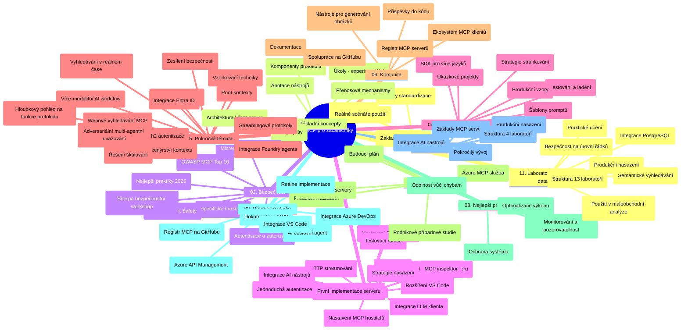

# Model Context Protocol (MCP) pro začátečníky – studijní příručka

Tato studijní příručka poskytuje přehled struktury a obsahu repozitáře pro kurz „Model Context Protocol (MCP) pro začátečníky“. Použijte tuto příručku k efektivní navigaci v repozitáři a plnému využití dostupných zdrojů.

## Přehled repozitáře

Model Context Protocol (MCP) je standardizovaný rámec pro interakce mezi AI modely a klientskými aplikacemi. Původně vytvořený společností Anthropic je MCP nyní udržován širší komunitou MCP prostřednictvím oficiální GitHub organizace. Tento repozitář nabízí komplexní kurz s praktickými příklady kódu v C#, Javě, JavaScriptu, Pythonu a TypeScriptu, určený pro AI vývojáře, systémové architekty a softwarové inženýry.

## Vizualizace učebního plánu

## Struktura repozitáře

Repozitář je uspořádán do jedenácti hlavních sekcí, z nichž každá se zaměřuje na odlišné aspekty MCP:

1. **Úvod (00-Introduction/)**
   - Přehled Model Context Protocolu
   - Proč je standardizace důležitá v AI pipelinech
   - Praktické případy použití a výhody

2. **Základní koncepty (01-CoreConcepts/)**
   - Architektura klient-server
   - Klíčové komponenty protokolu
   - Komunikační vzory v MCP

3. **Bezpečnost (02-Security/)**
   - Bezpečnostní hrozby v systémech založených na MCP
   - Nejlepší postupy pro zabezpečení implementací
   - Strategie autentizace a autorizace
   - **Komplexní dokumentace k bezpečnosti**:
     - MCP Security Best Practices 2025
     - Azure Content Safety Implementation Guide
     - MCP Security Controls and Techniques
     - MCP Best Practices Quick Reference
   - **Klíčová témata bezpečnosti**:
     - Útoky typu vložení promptu a otrava nástrojů
     - Únos sezení a problém "confused deputy"
     - Zranitelnosti při průchodu tokenů
     - Nadměrná oprávnění a kontrola přístupu
     - Bezpečnost dodavatelského řetězce pro AI komponenty
     - Integrace Microsoft Prompt Shields

4. **Začínáme (03-GettingStarted/)**
   - Nastavení a konfigurace prostředí
   - Vytvoření základních MCP serverů a klientů
   - Integrace do stávajících aplikací
   - Obsahuje sekce pro:
     - První implementaci serveru
     - Vývoj klienta
     - Integraci klienta LLM
     - Integraci s VS Code
     - Server-Sent Events (SSE) server
     - Pokročilé použití serveru
     - HTTP streamování
     - Integraci AI Toolkit
     - Testovací strategie
     - Nasazovací pokyny

5. **Praktická implementace (04-PracticalImplementation/)**
   - Použití SDK v různých programovacích jazycích
   - Ladění, testování a ověřování
   - Tvorba opakovaně použitelných šablon promptů a pracovních postupů
   - Vzorové projekty s příklady implementací

6. **Pokročilá témata (05-AdvancedTopics/)**
   - Techniky inženýrství kontextu
   - Integrace agenta Foundry
   - Multi-modální AI pracovní postupy
   - Demonstrace autentizace OAuth2
   - Funkce vyhledávání v reálném čase
   - Streamování v reálném čase
   - Implementace root kontextů
   - Směrovací strategie
   - Techniky vzorkování
   - Přístupy ke škálování
   - Bezpečnostní aspekty
   - Integrace bezpečnosti Entra ID
   - Integrace webového vyhledávání
   - Argumentační multi-agentní uvažování (vzor debaty)

7. **Příspěvky komunity (06-CommunityContributions/)**
   - Jak přispívat kódem a dokumentací
   - Spolupráce přes GitHub
   - Vylepšení a zpětná vazba řízená komunitou
   - Používání různých MCP klientů (Claude Desktop, Cline, VSCode)
   - Práce s populárními MCP servery včetně generování obrázků

8. **Lekce z raného přijetí (07-LessonsfromEarlyAdoption/)**
   - Implementace a úspěšné příběhy z praxe
   - Vývoj a nasazení řešení založených na MCP
   - Trendy a budoucí plán
   - **Průvodce Microsoft MCP servery**: komplexní průvodce 10 produkčně připravenými Microsoft MCP servery včetně:
     - Microsoft Learn Docs MCP Server
     - Azure MCP Server (15+ specializovaných konektorů)
     - GitHub MCP Server
     - Azure DevOps MCP Server
     - MarkItDown MCP Server
     - SQL Server MCP Server
     - Playwright MCP Server
     - Dev Box MCP Server
     - Azure AI Foundry MCP Server
     - Microsoft 365 Agents Toolkit MCP Server

9. **Nejlepší postupy (08-BestPractices/)**
   - Ladění výkonu a optimalizace
   - Návrh odolných MCP systémů
   - Testování a strategie odolnosti

10. **Případové studie (09-CaseStudy/)**
    - **Sedm komplexních případových studií** demonstrujících všestrannost MCP v různých scénářích:
    - **Azure AI Travel Agents**: Multi-agentní orchestrací s Azure OpenAI a AI Search
    - **Integrace Azure DevOps**: Automatizace pracovních procesů s aktualizacemi dat z YouTube
    - **Získávání dokumentace v reálném čase**: Python konzolový klient s HTTP streamováním
    - **Interaktivní generátor studijního plánu**: webová aplikace Chainlit s konverzační AI
    - **Dokumentace v editoru**: Integrace VS Code s workflows GitHub Copilot
    - **Azure API Management**: Podniková API integrace s tvorbou MCP serveru
    - **GitHub MCP Registry**: Vývoj ekosystému a platforma pro agentní integraci
    - Příklady implementace zahrnující podnikovou integraci, produktivitu vývojářů a rozvoj ekosystému

11. **Praktický workshop (10-StreamliningAIWorkflowsBuildingAnMCPServerWithAIToolkit/)**
    - Komplexní praktický workshop spojující MCP s AI Toolkit
    - Vývoj inteligentních aplikací propojujících AI modely s reálnými nástroji
    - Praktické moduly pokrývající základy, vývoj vlastního serveru a produkční nasazení
    - **Struktura laboratoře**:
      - Laboratoř 1: Základy MCP serveru
      - Laboratoř 2: Pokročilý vývoj MCP serveru
      - Laboratoř 3: Integrace AI Toolkitu
      - Laboratoř 4: Produkční nasazení a škálování
    - Laboratorní přístup s krok za krokem instrukcemi

12. **Laboratoře integrace MCP serveru s databází (11-MCPServerHandsOnLabs/)**
    - **Komplexní 13-laboratorní učební cesta** pro vývoj produkčně připravených MCP serverů s integrací PostgreSQL
    - **Implementace reálné analýzy maloobchodu** s využitím případu užití Zava Retail
    - **Podnikové vzory** zahrnující Row Level Security (RLS), sémantické vyhledávání a multi-tenantní přístup k datům
    - **Úplná struktura laboratoří**:
      - **Laboratoře 00-03: Základy** – Úvod, Architektura, Bezpečnost, Nastavení prostředí
      - **Laboratoře 04-06: Stavba MCP serveru** – Návrh databáze, Implementace MCP serveru, Vývoj nástrojů
      - **Laboratoře 07-09: Pokročilé funkce** – Sémantické vyhledávání, Testování a debugování, Integrace VS Code
      - **Laboratoře 10-12: Produkce a nejlepší praxe** – Nasazení, Monitoring, Optimalizace
    - **Použité technologie**: framework FastMCP, PostgreSQL, Azure OpenAI, Azure Container Apps, Application Insights
    - **Výsledky učení**: Produkčně připravené MCP servery, vzory pro integraci databází, analytika poháněná AI, podniková bezpečnost

## Další zdroje

Repozitář obsahuje podpůrné zdroje:

- **Složka obrázků**: Obsahuje schémata a ilustrace použité v celém kurzu
- **Překlady**: Vícejazyčná podpora s automatickými překlady dokumentace
- **Oficiální zdroje MCP**:
  - [MCP Dokumentace](https://modelcontextprotocol.io/)
  - [MCP Specifikace](https://spec.modelcontextprotocol.io/)
  - [MCP GitHub Repozitář](https://github.com/modelcontextprotocol)

## Jak používat tento repozitář

1. **Sekvenční učení**: Následujte kapitoly v pořadí (00 až 11) pro strukturovaný výukový zážitek.
2. **Zaměření na konkrétní jazyk**: Pokud vás zajímá konkrétní programovací jazyk, prozkoumejte složky se vzory implementací pro váš preferovaný jazyk.
3. **Praktická implementace**: Začněte sekcí „Začínáme“ pro nastavení prostředí a vytvoření prvního MCP serveru a klienta.
4. **Pokročilé prozkoumání**: Po zvládnutí základů se ponořte do pokročilých témat pro rozšíření znalostí.
5. **Zapojení komunity**: Připojte se ke komunitě MCP prostřednictvím diskuzí na GitHubu a kanálů Discord pro spojení s odborníky a dalšími vývojáři.

## MCP klienti a nástroje

Kurz pokrývá různé MCP klienty a nástroje:

1. **Oficiální klienti**:
   - Visual Studio Code
   - MCP ve Visual Studio Code
   - Claude Desktop
   - Claude ve VSCode
   - Claude API

2. **Klienti komunity**:
   - Cline (terminálový)
   - Cursor (editor kódu)
   - ChatMCP
   - Windsurf

3. **Nástroje pro správu MCP**:
   - MCP CLI
   - MCP Manager
   - MCP Linker
   - MCP Router

## Populární MCP servery

Repozitář představuje různé MCP servery, mezi nimi:

1. **Oficiální Microsoft MCP servery**:
   - Microsoft Learn Docs MCP Server
   - Azure MCP Server (15+ specializovaných konektorů)
   - GitHub MCP Server
   - Azure DevOps MCP Server
   - MarkItDown MCP Server
   - SQL Server MCP Server
   - Playwright MCP Server
   - Dev Box MCP Server
   - Azure AI Foundry MCP Server
   - Microsoft 365 Agents Toolkit MCP Server

2. **Oficiální referenční servery**:
   - Filesystem
   - Fetch
   - Memory
   - Sequential Thinking

3. **Generování obrázků**:
   - Azure OpenAI DALL-E 3
   - Stable Diffusion WebUI
   - Replicate

4. **Vývojové nástroje**:
   - Git MCP
   - Terminal Control
   - Code Assistant

5. **Specializované servery**:
   - Salesforce
   - Microsoft Teams
   - Jira & Confluence

## Přispívání

Tento repozitář vítá příspěvky od komunity. Viz sekce Příspěvky komunity pro pokyny, jak efektivně přispívat k MCP ekosystému.

----

*Tato studijní příručka byla naposledy aktualizována 5. února 2026, zohledňuje nejnovější specifikaci MCP 2025-11-25 a poskytuje přehled repozitáře k tomuto datu. Obsah repozitáře může být po tomto datu aktualizován.*

---

<!-- CO-OP TRANSLATOR DISCLAIMER START -->
**Prohlášení o vyloučení odpovědnosti**:
Tento dokument byl přeložen pomocí AI překladatelské služby [Co-op Translator](https://github.com/Azure/co-op-translator). Přestože usilujeme o přesnost, mějte prosím na paměti, že automatické překlady mohou obsahovat chyby nebo nepřesnosti. Originální dokument v jeho rodném jazyce by měl být považován za autoritativní zdroj. Pro kritické informace se doporučuje profesionální lidský překlad. Nejsme odpovědní za jakékoliv nedorozumění nebo nesprávné interpretace vyplývající z použití tohoto překladu.
<!-- CO-OP TRANSLATOR DISCLAIMER END -->