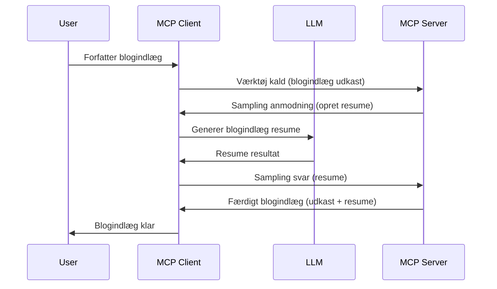

# Sampling - deleger funktioner til klienten

Nogle gange har du brug for, at MCP Client og MCP Server samarbejder for at nå et fælles mål. Du kan have en situation, hvor Serveren har brug for hjælp fra en LLM, der kører på klienten. Til denne situation bør du bruge sampling.

Lad os udforske nogle brugsscenarier og hvordan man bygger en løsning, der involverer sampling.

## Oversigt

I denne lektion fokuserer vi på at forklare, hvornår og hvor man skal bruge Sampling, og hvordan man konfigurerer det.

## Læringsmål

I dette kapitel vil vi:

- Forklare hvad Sampling er, og hvornår det skal bruges.
- Vise hvordan man konfigurerer Sampling i MCP.
- Give eksempler på Sampling i praksis.

## Hvad er Sampling, og hvorfor bruge det?

Sampling er en avanceret funktion, der fungerer på følgende måde:


### Sampling-forespørgsel

Ok, nu har vi et overblik over et troværdigt scenarie, lad os tale om den sampling-forespørgsel, som serveren sender tilbage til klienten. Sådan kan en sådan forespørgsel se ud i JSON-RPC format:

```json
{
  "jsonrpc": "2.0",
  "id": 1,
  "method": "sampling/createMessage",
  "params": {
    "messages": [
      {
        "role": "user",
        "content": {
          "type": "text",
          "text": "Create a blog post summary of the following blog post: <BLOG POST>"
        }
      }
    ],
    "modelPreferences": {
      "hints": [
        {
          "name": "claude-3-sonnet"
        }
      ],
      "intelligencePriority": 0.8,
      "speedPriority": 0.5
    },
    "systemPrompt": "You are a helpful assistant.",
    "maxTokens": 100
  }
}
```

Der er nogle ting her, der er værd at fremhæve:

- Prompt, under content -> text, er vores prompt, som er en instruktion til LLM om at opsummere blogindhold.

- **modelPreferences**. Denne sektion er netop det, en præference, en anbefaling om hvilken konfiguration man skal bruge med LLM'en. Brugeren kan vælge, om de vil følge disse anbefalinger eller ændre dem. I dette tilfælde er der anbefalinger om model til brug samt prioritering af hastighed og intelligens.
- **systemPrompt**, dette er din normale systemprompt, som giver din LLM en personlighed og indeholder vejledende instruktioner.
- **maxTokens**, dette er en anden egenskab, der bruges til at angive, hvor mange tokens der anbefales til denne opgave.

### Sampling-svar

Dette svar er det, MCP Client ender med at sende tilbage til MCP Server, og er resultatet af at klienten kalder LLM, venter på det svar og derefter konstruerer denne besked. Sådan kan det se ud i JSON-RPC:

```json
{
  "jsonrpc": "2.0",
  "id": 1,
  "result": {
    "role": "assistant",
    "content": {
      "type": "text",
      "text": "Here's your abstract <ABSTRACT>"
    },
    "model": "gpt-5",
    "stopReason": "endTurn"
  }
}
```

Bemærk hvordan svaret er et abstrakt af blogindlægget, lige som vi bad om. Bemærk også, hvordan den anvendte `model` ikke er den, vi bad om, men "gpt-5" over "claude-3-sonnet". Dette illustrerer, at brugeren kan ændre mening om hvad der skal bruges, og at din sampling-forespørgsel er en anbefaling.

Ok, nu hvor vi forstår hovedflowet, og den nyttige opgave at bruge det til "oprettelse af blogindlæg + abstrakt", lad os se hvad vi skal gøre for at få det til at fungere.

### Meddelelsestyper

Sampling-beskeder er ikke begrænset til kun tekst, men du kan også sende billeder og lyd. Sådan ser JSON-RPC ud anderledes ud:

**Tekst**

```json
{
  "type": "text",
  "text": "The message content"
}
```

**Billedindhold**

```json
{
  "type": "image",
  "data": "base64-encoded-image-data",
  "mimeType": "image/jpeg"
}
```

**Lydindhold**

```json
{
  "type": "audio",
  "data": "base64-encoded-audio-data",
  "mimeType": "audio/wav"
}
```

> NOTE: for mere detaljeret info om Sampling, se [de officielle docs](https://modelcontextprotocol.io/specification/2025-06-18/client/sampling)

## Sådan konfigurerer du Sampling i klienten

> Note: hvis du kun bygger en server, behøver du ikke gøre meget her.

I en klient skal du specificere følgende funktion sådan her:

```json
{
  "capabilities": {
    "sampling": {}
  }
}
```

Dette bliver så opfanget, når din valgte klient initialiseres med serveren.

## Eksempel på Sampling i praksis - Opret et blogindlæg

Lad os kode en sampling-server sammen, vi skal gøre følgende:

1. Opret et værktøj på serveren.
2. Dette værktøj skal oprette en sampling-forespørgsel.
3. Værktøjet skal vente på klientens svar på sampling-forespørgslen.
4. Derefter skal værktøjets resultat produceres.

Lad os se koden trin for trin:

### -1- Opret værktøjet

**python**

```python
@mcp.tool()
async def create_blog(title: str, content: str, ctx: Context[ServerSession, None]) -> str:
    """Create a blog post and generate a summary"""

```

### -2- Opret en sampling-forespørgsel

Udvid dit værktøj med følgende kode:

**python**

```python
post = BlogPost(
        id=len(posts) + 1,
        title=title,
        content=content,
        abstract=""
    )

prompt = f"Create an abstract of the following blog post: title: {title} and draft: {content} "

result = await ctx.session.create_message(
        messages=[
            SamplingMessage(
                role="user",
                content=TextContent(type="text", text=prompt),
            )
        ],
        max_tokens=100,
)

```

### -3- Vent på svaret og returner svaret

**python**

```python
post.abstract = result.content.text

posts.append(post)

# returner det komplette produkt
return json.dumps({
    "id": post.title,
    "abstract": post.abstract
})
```

### -4- Fuld kode

**python**

```python
from starlette.applications import Starlette
from starlette.routing import Mount, Host

from mcp.server.fastmcp import Context, FastMCP

from mcp.server.session import ServerSession
from mcp.types import SamplingMessage, TextContent

import json


from uuid import uuid4
from typing import List
from pydantic import BaseModel


mcp = FastMCP("Blog post generator")

# app = FastAPI()

posts = []

class BlogPost(BaseModel):
    id: int
    title: str
    content: str
    abstract: str

posts: List[BlogPost] = []

@mcp.tool()
async def create_blog(title: str, content: str, ctx: Context[ServerSession, None]) -> str:
    """Create a blog post and generate a summary"""

    post = BlogPost(
        id=len(posts) + 1,
        title=title,
        content=content,
        abstract=""
    )

    prompt = f"Create an abstract of the following blog post: title: {title} and draft: {content} "

    result = await ctx.session.create_message(
        messages=[
            SamplingMessage(
                role="user",
                content=TextContent(type="text", text=prompt),
            )
        ],
        max_tokens=100,
    )

    post.abstract = result.content.text

    posts.append(post)

    # returner hele blogindlægget
    return json.dumps({
        "id": post.title,
        "abstract": post.abstract
    })

if __name__ == "__main__":
    print("Starting server...")
    # mcp.kør()
    mcp.run(transport="streamable-http")

# kør app med: python server.py
```

### -5- Test det i Visual Studio Code

For at teste dette i Visual Studio Code, gør følgende:

1. Start server i terminal
2. Tilføj det til *mcp.json* (og sørg for at det er startet), f.eks. sådan her:

   ```json
   "servers": {
      "blog-server": {
        "type": "http",
        "url": "http://localhost:8000/mcp"
      }
   }
   ```

3. Skriv en prompt:

   ```text
   create a blog post named "Where Python comes from", the content is "Python is actually named after Monty Python Flying Circus"
   ```

4. Tillad sampling at ske. Første gang du tester dette, vil du blive præsenteret for en ekstra dialog, som du skal acceptere, derefter vil du se den normale dialog, der spørger om at køre et værktøj.

5. Inspicer resultater. Du vil se resultaterne præsenteret pænt i GitHub Copilot Chat, men du kan også inspicere det rå JSON-svar.

**Bonus**. Visual Studio Code-værktøjet har god support for sampling. Du kan konfigurere Sampling-adgang på din installerede server ved at navigere sådan her:

1. Gå til udvidelsesafsnittet.
2. Vælg tandhjulsikonet for din installerede server i sektionen "MCP SERVERS - INSTALLED".
3. Vælg "Configure Model Access", her kan du vælge hvilke modeller GitHub Copilot må bruge ved sampling. Du kan også se alle sampling-forespørgsler, der er sket for nyligt, ved at vælge "Show Sampling requests".

## Opgave

I denne opgave skal du bygge en lidt anderledes Sampling, nemlig en sampling-integration, der understøtter generering af en produktbeskrivelse. Her er dit scenarie:

**Scenarie**: Backoffice-medarbejderen i en e-commerce har brug for hjælp, det tager alt for lang tid at generere produktbeskrivelser. Derfor skal du bygge en løsning, hvor du kan kalde et værktøj "create_product" med "title" og "keywords" som argumenter, og det skal producere et komplet produkt inklusive et "description" felt, der skal udfyldes af en LLM på klienten.

TIP: brug hvad du lærte tidligere til at konstruere denne server og dets værktøj ved at bruge en sampling-forespørgsel.

## Løsning

[Løsning](./solution/README.md)

## Vigtige pointer

Sampling er en kraftfuld funktion, der tillader serveren at delegere opgaver til klienten, når den har brug for hjælp fra en LLM.

## Hvad er det næste?

- [Kapitel 4 - Praktisk implementering](../../04-PracticalImplementation/README.md)

---

<!-- CO-OP TRANSLATOR DISCLAIMER START -->
**Ansvarsfraskrivelse**:  
Dette dokument er blevet oversat ved hjælp af AI-oversættelsestjenesten [Co-op Translator](https://github.com/Azure/co-op-translator). Selvom vi bestræber os på nøjagtighed, bedes du være opmærksom på, at automatiserede oversættelser kan indeholde fejl eller unøjagtigheder. Det oprindelige dokument på dets modersmål bør betragtes som den autoritative kilde. For kritisk information anbefales professionel menneskelig oversættelse. Vi påtager os intet ansvar for eventuelle misforståelser eller fejltolkninger, der opstår som følge af brugen af denne oversættelse.
<!-- CO-OP TRANSLATOR DISCLAIMER END -->