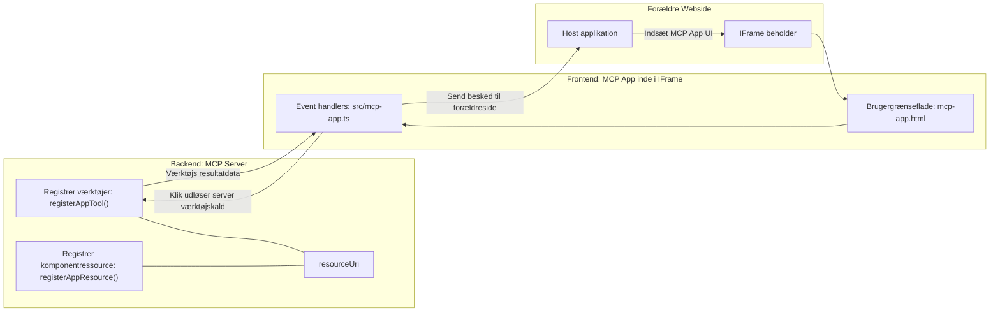

# MCP Apps

MCP Apps er et nyt paradigme inden for MCP. Ideen er, at du ikke kun svarer med data tilbage fra et værktøjskald, men også leverer information om, hvordan denne information skal interageres med. Det betyder, at værktøjsresultater nu kan indeholde UI-information. Hvorfor skulle vi dog ønske det? Tja, tænk på, hvordan du gør ting i dag. Du forbruger sandsynligvis resultaterne fra en MCP Server ved at placere en frontend foran, og det er kode, du skal skrive og vedligeholde. Nogle gange er det det, du ønsker, men nogle gange ville det være fantastisk, hvis du bare kunne bringe et selvstændigt informationsudsnit, som har det hele fra data til brugergrænseflade.

## Oversigt

Denne lektion giver praktisk vejledning om MCP Apps, hvordan man kommer i gang med det og hvordan man integrerer det i dine eksisterende webapps. MCP Apps er en meget ny tilføjelse til MCP-standarden.

## Læringsmål

I slutningen af denne lektion vil du kunne:

- Forklare hvad MCP Apps er.
- Hvornår man bruger MCP Apps.
- Bygge og integrere dine egne MCP Apps.

## MCP Apps - hvordan fungerer det

Ideen med MCP Apps er at levere et svar, som i bund og grund er en komponent, der skal gengives. En sådan komponent kan have både visuelle elementer og interaktivitet, fx knapklik, brugerinput og mere. Lad os starte med serversiden og vores MCP Server. For at oprette en MCP App-komponent skal du oprette et værktøj, men også applikationsressourcen. Disse to dele forbindes via en resourceUri.

Her er et eksempel. Lad os prøve at visualisere, hvad der er involveret, og hvilke dele gør hvad:

```text
server.ts -- responsible for registering tools and the component as a UI component
src/
  mcp-app.ts -- wiring up event handlers
mcp-app.html -- the user interface
```

Denne illustration beskriver arkitekturen for oprettelse af en komponent og dens logik.


Lad os prøve at beskrive ansvarerne for backend og frontend henholdsvis.

### Backend

Der er to ting, vi skal opnå her:

- Registrere de værktøjer, vi vil interagere med.
- Definere komponenten.

**Registrere værktøjet**

```typescript
registerAppTool(
    server,
    "get-time",
    {
      title: "Get Time",
      description: "Returns the current server time.",
      inputSchema: {},
      _meta: { ui: { resourceUri } }, // Binder dette værktøj til dets UI-ressource
    },
    async () => {
      const time = new Date().toISOString();
      return { content: [{ type: "text", text: time }] };
    },
  );

```

Den foregående kode beskriver adfærden, hvor den eksponerer et værktøj kaldet `get-time`. Det tager ingen inputs, men producerer den aktuelle tid. Vi har muligheden for at definere en `inputSchema` for værktøjer, hvor vi skal kunne acceptere brugerinput.

**Registrere komponenten**

I den samme fil skal vi også registrere komponenten:

```typescript
const resourceUri = "ui://get-time/mcp-app.html";

// Registrer ressourcen, som returnerer den samlede HTML/JavaScript til brugergrænsefladen.
registerAppResource(
  server,
  resourceUri,
  resourceUri,
  { mimeType: RESOURCE_MIME_TYPE },
  async () => {
    const html = await fs.readFile(path.join(DIST_DIR, "mcp-app.html"), "utf-8");

    return {
    contents: [
        { uri: resourceUri, mimeType: RESOURCE_MIME_TYPE, text: html },
    ],
    };
  },
);
```

Bemærk, hvordan vi nævner `resourceUri` for at forbinde komponenten med dens værktøjer. Interessant er også callback-funktionen, hvor vi loader UI-filen og returnerer komponenten.

### Frontend for komponenten

Ligesom backend er der to dele her:

- En frontend skrevet i ren HTML.
- Kode, som håndterer events og hvad der skal gøres, fx kalde værktøjer eller sende besked til parent-vinduet.

**Brugergrænseflade**

Lad os se på brugergrænsefladen.

```html
<!-- mcp-app.html -->
<!DOCTYPE html>
<html lang="en">
  <head>
    <meta charset="UTF-8" />
    <title>Get Time App</title>
  </head>
  <body>
    <p>
      <strong>Server Time:</strong> <code id="server-time">Loading...</code>
    </p>
    <button id="get-time-btn">Get Server Time</button>
    <script type="module" src="/src/mcp-app.ts"></script>
  </body>
</html>
```

**Event tilknytning**

Den sidste del er event-tilknytningen. Det betyder, at vi identificerer, hvilken del i vores UI der har brug for event handlers, og hvad der skal gøres, hvis events afsendes:

```typescript
// mcp-app.ts

import { App } from "@modelcontextprotocol/ext-apps";

// Få elementreferencer
const serverTimeEl = document.getElementById("server-time")!;
const getTimeBtn = document.getElementById("get-time-btn")!;

// Opret app-instans
const app = new App({ name: "Get Time App", version: "1.0.0" });

// Håndter værktøjsresultater fra serveren. Sæt før `app.connect()` for at undgå
// at gå glip af det første værktøjsresultat.
app.ontoolresult = (result) => {
  const time = result.content?.find((c) => c.type === "text")?.text;
  serverTimeEl.textContent = time ?? "[ERROR]";
};

// Tilslut knapklik
getTimeBtn.addEventListener("click", async () => {
  // `app.callServerTool()` lader UI anmode om frisk data fra serveren
  const result = await app.callServerTool({ name: "get-time", arguments: {} });
  const time = result.content?.find((c) => c.type === "text")?.text;
  serverTimeEl.textContent = time ?? "[ERROR]";
});

// Forbind til vært
app.connect();
```

Som du kan se fra ovenstående, er dette normal kode til at binde DOM-elementer til events. Det er værd at nævne kaldet til `callServerTool`, som ender med at kalde et værktøj på backend.

## Håndtering af brugerinput

Indtil nu har vi set en komponent, der har en knap, som ved klik kalder et værktøj. Lad os se, om vi kan tilføje flere UI-elementer som et inputfelt og se, om vi kan sende argumenter til et værktøj. Lad os implementere en FAQ-funktionalitet. Sådan skal det fungere:

- Der skal være en knap og et input-element, hvor brugeren skriver et nøgleord til søgning, for eksempel "Shipping". Dette skal kalde et værktøj på backend, som laver et søg i FAQ-data.
- Et værktøj, som understøtter den nævnte FAQ-søgning.

Lad os først tilføje den nødvendige support til backend:

```typescript
const faq: { [key: string]: string } = {
    "shipping": "Our standard shipping time is 3-5 business days.",
    "return policy": "You can return any item within 30 days of purchase.",
    "warranty": "All products come with a 1-year warranty covering manufacturing defects.",
  }

registerAppTool(
    server,
    "get-faq",
    {
      title: "Search FAQ",
      description: "Searches the FAQ for relevant answers.",
      inputSchema: zod.object({
        query: zod.string().default("shipping"),
      }),
      _meta: { ui: { resourceUri: faqResourceUri } }, // Binder dette værktøj til dets UI-ressource
    },
    async ({ query }) => {
      const answer: string = faq[query.toLowerCase()] || "Sorry, I don't have an answer for that.";
      return { content: [{ type: "text", text: answer }] };
    },
  );
```

Det vi ser her, er hvordan vi udfylder `inputSchema` og giver det et `zod`-skema som sådan:

```typescript
inputSchema: zod.object({
  query: zod.string().default("shipping"),
})
```

I det ovenstående skema erklærer vi, at vi har en inputparameter kaldet `query`, og at den er valgfri med en standardværdi "shipping".

Ok, lad os gå videre til *mcp-app.html* for at se, hvilken UI vi skal lave til dette:

```html
<div class="faq">
    <h1>FAQ response</h1>
    <p>FAQ Response: <code id="faq-response">Loading...</code></p>
    <input type="text" id="faq-query" placeholder="Enter FAQ query" />
    <button id="get-faq-btn">Get FAQ Response</button>
  </div>
```

Fint, nu har vi et input-element og en knap. Lad os gå til *mcp-app.ts* for at forbinde disse events:

```typescript
const getFaqBtn = document.getElementById("get-faq-btn")!;
const faqQueryInput = document.getElementById("faq-query") as HTMLInputElement;

getFaqBtn.addEventListener("click", async () => {
  const query = faqQueryInput.value;
  const result = await app.callServerTool({ name: "get-faq", arguments: { query } });
  const faq = result.content?.find((c) => c.type === "text")?.text;
  faqResponseEl.textContent = faq ?? "[ERROR]";
});
```

I koden ovenfor:

- Opretter vi referencer til de interaktive UI-elementer.
- Håndterer vi et knapklik for at parse værdien af input-elementet, og vi kalder også `app.callServerTool()` med `name` og `arguments`, hvor sidstnævnte sender `query` som værdi.

Det, der faktisk sker, når du kalder `callServerTool`, er, at der sendes en besked til parent-vinduet, og dette vindue ender med at kalde MCP Server.

### Prøv det

Når vi prøver dette, bør vi nu se følgende:


og her prøver vi med input som "warranty"


For at køre denne kode, gå til [Code section](./code/README.md)

## Test i Visual Studio Code

Visual Studio Code har god support til MCP Apps og er sandsynligvis en af de nemmeste måder at teste dine MCP Apps på. For at bruge Visual Studio Code, tilføj en serverentry til *mcp.json* som følgende:

```json
"my-mcp-server-7178eca7": {
    "url": "http://localhost:3001/mcp",
    "type": "http"
  }
```

Start derefter serveren, du burde kunne kommunikere med din MCP App via Chat-vinduet, forudsat at du har installeret GitHub Copilot.

Du kan starte den via en prompt, fx "#get-faq":


og ligesom når du kørte det gennem en webbrowser, gengives det på samme måde:


## Opgave

Lav et sten-saks-papir-spil. Det skal bestå af følgende:

UI:

- en dropdown-liste med valgmuligheder
- en knap til at indsende et valg
- en label, der viser, hvem valgte hvad, og hvem der vandt

Server:

- skal have et værktøj sten-saks-papir-værktøj, som tager "choice" som input. Det skal også gengive et computervalg og afgøre vinderen

## Løsning

[Løsning](./assignment/README.md)

## Resume

Vi har lært om dette nye paradigme MCP Apps. Det er et nyt paradigme, som gør det muligt for MCP Servers ikke kun at have en mening om dataene, men også hvordan disse data skal præsenteres.

Derudover har vi lært, at disse MCP Apps hostes i en IFrame, og for at kommunikere med MCP Servers skal de sende beskeder til parent-webappen. Der findes adskillige biblioteker, både til almindelig JavaScript, React og mere, som gør denne kommunikation nemmere.

## Centrale pointer

Her er, hvad du har lært:

- MCP Apps er en ny standard, som kan være nyttig, når du vil sende både data og UI-funktionalitet.
- Denne type apps kører i en IFrame af sikkerhedsmæssige årsager.

## Hvad kommer nu

- [Kapitel 4](../../04-PracticalImplementation/README.md)

---

<!-- CO-OP TRANSLATOR DISCLAIMER START -->
**Ansvarsfraskrivelse**:  
Dette dokument er blevet oversat ved hjælp af AI-oversættelsestjenesten [Co-op Translator](https://github.com/Azure/co-op-translator). Selvom vi bestræber os på nøjagtighed, bedes du være opmærksom på, at automatiserede oversættelser kan indeholde fejl eller unøjagtigheder. Det oprindelige dokument på dets oprindelige sprog bør betragtes som den autoritative kilde. For kritisk information anbefales professionel menneskelig oversættelse. Vi påtager os intet ansvar for misforståelser eller fejltolkninger, der opstår som følge af brugen af denne oversættelse.
<!-- CO-OP TRANSLATOR DISCLAIMER END -->