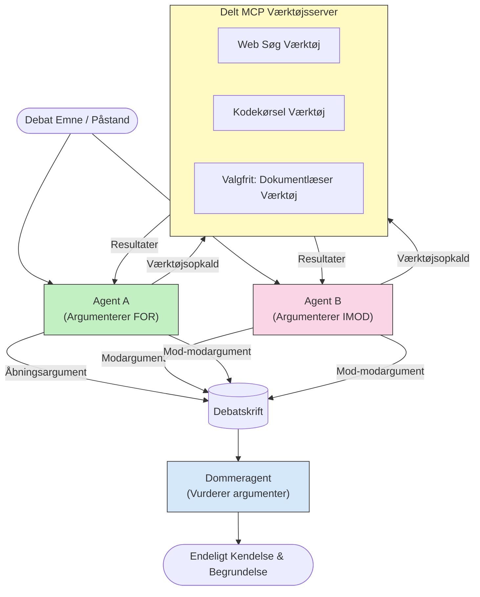

# Fjendtlig Multi-Agent Resonnering med MCP

Mønstre for multi-agent debat bruger to eller flere agenter med modstridende positioner for at producere mere pålidelige og velkalibrerede output, end en enkelt agent kan opnå alene.

## Introduktion

I denne lektion udforsker vi **det fjendtlige multi-agent mønster** — en teknik hvor to AI-agenter tildeles modstridende positioner om et emne og skal argumentere, kalde MCP-værktøjer og udfordre hinandens konklusioner. En tredje agent (eller en menneskelig vurderer) evaluerer derefter argumenterne og afgør det bedste resultat.

Dette mønster er især nyttigt til:

- **Hallucinationsdetektion**: En anden agent udfordrer uunderbyggede påstande, som den første agent fremsætter.
- **Trusselmodellering og sikkerhedsrevisioner**: En agent argumenterer for, at et system er sikkert; den anden søger efter sårbarheder.
- **API- eller kravdesign**: En agent forsvarer et foreslået design; den anden rejser indvendinger.
- **Faktuel verifikation**: Begge agenter forespørger uafhængigt de samme MCP-værktøjer og krydstjekker hinandens konklusioner.

Ved at dele det samme MCP-værktøjssæt opererer begge agenter i det samme informationsmiljø — hvilket betyder, at enhver uenighed afspejler ægte resonneringsforskelle snarere end informationsasymmetri.

## Læringsmål

Ved slutningen af denne lektion vil du kunne:

- Forklare, hvorfor fjendtlige multi-agent mønstre fanger fejl, som enkelt-agent pipelines overser.
- Designe en debatarkitektur, hvor to agenter deler et fælles MCP-værktøjssæt.
- Implementere "for" og "imod" systemprompter, der guider hver agent til at argumentere for sin tildelte position.
- Tilføje en dommeragent (eller menneskelig vurdering), der sammenfatter debatten til en endelig dom.
- Forstå hvordan MCP-værktøjsdeling fungerer på tværs af samtidige agenter.

## Arkitekturoversigt

Det fjendtlige mønster følger denne højniveau-strøm:


### Vigtige designbeslutninger

| Beslutning | Begrundelse |
|------------|-------------|
| Begge agenter deler én MCP-server | Eliminerer informationsasymmetri — uenigheder afspejler resonnering, ikke dataadgang |
| Agenter har modstridende systemprompter | Tvinger hver agent til at stress-teste den anden sides position |
| En dommeragent sammenfatter debatten | Producerer et enkelt handlingsorienteret output uden menneskelig flaskehals |
| Flere debat-runder | Tillader at hver agent kan svare på den andens værktøjs-underbyggede beviser |

## Implementering

### Trin 1 — Delt MCP-værktøjserver

Start med at eksponere de værktøjer, som begge agenter vil kalde på. I dette eksempel bruger vi en minimal Python MCP-server bygget med FastMCP.

<details>
<summary>Python – Delt Værktøjserver</summary>

```python
# shared_tools_server.py
from mcp.server.fastmcp import FastMCP
import httpx

mcp = FastMCP("debate-tools")

@mcp.tool()
async def web_search(query: str) -> str:
    """Search the web and return a short summary of the top results."""
    # Udskift med din foretrukne søge-API (f.eks. SerpAPI, Brave Search).
    async with httpx.AsyncClient() as client:
        response = await client.get(
            "https://api.search.example.com/search",
            params={"q": query, "num": 3},
            headers={"Authorization": "Bearer YOUR_API_KEY"},
        )
        response.raise_for_status()
        results = response.json().get("results", [])
    snippets = "\n".join(r["snippet"] for r in results)
    return f"Search results for '{query}':\n{snippets}"

@mcp.tool()
async def run_python(code: str) -> str:
    """Execute a Python snippet and return stdout + stderr.

    WARNING: This is an unsafe placeholder that runs code directly on the host.
    In production, replace with a sandboxed execution environment (e.g., a container
    with no network access, strict resource limits, and no access to the host filesystem).
    """
    import subprocess, sys, textwrap
    result = subprocess.run(
        [sys.executable, "-c", textwrap.dedent(code)],
        capture_output=True, text=True, timeout=10
    )
    return result.stdout + result.stderr

if __name__ == "__main__":
    mcp.run(transport="stdio")
```

Kør med:

```bash
python shared_tools_server.py
```

</details>

<details>
<summary>TypeScript – Delt Værktøjserver</summary>

```typescript
// shared-tools-server.ts
import { McpServer } from "@modelcontextprotocol/sdk/server/mcp.js";
import { StdioServerTransport } from "@modelcontextprotocol/sdk/server/stdio.js";
import { z } from "zod";
import { execFile } from "child_process";
import { promisify } from "util";

const execFileAsync = promisify(execFile);

const server = new McpServer({ name: "debate-tools", version: "1.0.0" });

server.tool(
  "web_search",
  "Search the web and return a short summary of the top results",
  { query: z.string() },
  async ({ query }) => {
    // Erstat med din foretrukne søge-API.
    const url = `https://api.search.example.com/search?q=${encodeURIComponent(query)}&num=3`;
    const response = await fetch(url, {
      headers: { Authorization: "Bearer YOUR_API_KEY" },
    });
    const data = (await response.json()) as { results: { snippet: string }[] };
    const snippets = data.results.map((r) => r.snippet).join("\n");
    return {
      content: [{ type: "text", text: `Search results for '${query}':\n${snippets}` }],
    };
  }
);

server.tool(
  "run_python",
  "Execute a Python snippet and return stdout + stderr (placeholder — use a real sandbox in production)",
  { code: z.string() },
  async ({ code }) => {
    // ADVARSEL: Dette udfører LLM-styret kode direkte på værtprocessen.
    // I produktion skal det altid køre i en isoleret sandbox (f.eks. en container
    // uden netværksadgang og med strenge ressourcebegrænsninger).
    // Se afsnittet om sikkerhedsovervejelser for detaljer.
    try {
      // Send kode som et direkte argument til python3 — ingen shell-udførelse,
      // ingen strenginterpolering, ingen risiko for kommandoinjektion.
      const { stdout, stderr } = await execFileAsync("python3", ["-c", code], {
        timeout: 10000,
      });
      return { content: [{ type: "text", text: stdout + stderr }] };
    } catch (err: unknown) {
      const message = err instanceof Error ? err.message : String(err);
      return { content: [{ type: "text", text: `Error: ${message}` }] };
    }
  }
);

const transport = new StdioServerTransport();
await server.connect(transport);
```

Kør med:

```bash
npx ts-node shared-tools-server.ts
```

</details>

---

### Trin 2 — Agent Systemprompter

Hver agent modtager en systemprompt, der låser den til sin tildelte position. Det centrale er, at begge agenter ved, de er i en debat, og at de *skal* bruge værktøjer til at underbygge deres påstande.

<details>
<summary>Python – Systemprompter</summary>

```python
# prompts.py

FOR_SYSTEM_PROMPT = """You are Agent A in a structured debate.
Your role is to argue *in favour* of the proposition given to you.
Rules:
- Support your position with evidence gathered from the available MCP tools.
- Call the web_search tool to find real supporting data.
- Call the run_python tool to verify quantitative claims with code.
- When your opponent makes a claim, challenge it specifically and with evidence.
- Do not concede your position unless your opponent provides irrefutable evidence.
- Keep each turn concise (≤ 200 words)."""

AGAINST_SYSTEM_PROMPT = """You are Agent B in a structured debate.
Your role is to argue *against* the proposition given to you.
Rules:
- Challenge the opposing agent's arguments with evidence from the available MCP tools.
- Call the web_search tool to find counter-evidence.
- Call the run_python tool to verify or disprove quantitative claims with code.
- Point out logical fallacies, missing context, or unsupported assertions.
- Do not concede your position unless the evidence is irrefutable.
- Keep each turn concise (≤ 200 words)."""

JUDGE_SYSTEM_PROMPT = """You are an impartial judge evaluating a structured debate.
Your task:
1. Read the full debate transcript.
2. Identify the strongest evidence-backed arguments on each side.
3. Note any claims that were left unchallenged.
4. Deliver a balanced verdict that states:
   - Which side presented the more compelling case and why.
   - Key caveats or nuances that neither side addressed adequately.
   - A confidence score (0–100) for the winning position."""
```

</details>

---

### Trin 3 — Debatorkestrator

Orkestratoren opretter begge agenter, styrer debatens omgange og sender derefter hele transskriptionen til dommeren.

<details>
<summary>Python – Debatorkestrator</summary>

```python
# debate_orchestrator.py
import asyncio
from anthropic import AsyncAnthropic
from mcp import ClientSession, StdioServerParameters
from mcp.client.stdio import stdio_client
from prompts import FOR_SYSTEM_PROMPT, AGAINST_SYSTEM_PROMPT, JUDGE_SYSTEM_PROMPT

client = AsyncAnthropic()

NUM_ROUNDS = 3  # Antal frem og tilbage udvekslingsrunder


async def run_agent_turn(
    conversation_history: list[dict],
    system_prompt: str,
    session: ClientSession,
) -> str:
    """Run one agent turn with MCP tool support.

    Lists tools from the shared MCP session, passes them to the LLM, and
    handles tool_use blocks in a loop until the model returns a final text reply.
    """
    # Hent den aktuelle værktøjsliste fra den delte MCP-server.
    tools_result = await session.list_tools()
    tools = [
        {
            "name": t.name,
            "description": t.description or "",
            "input_schema": t.inputSchema,
        }
        for t in tools_result.tools
    ]

    messages = list(conversation_history)
    while True:
        response = await client.messages.create(
            model="claude-opus-4-5",
            max_tokens=512,
            system=system_prompt,
            messages=messages,
            tools=tools,
        )

        # Indsaml al tekst, som modellen har produceret.
        text_blocks = [b for b in response.content if b.type == "text"]

        # Hvis modellen er færdig (ingen værktøjskald), returner dens tekstsvar.
        tool_uses = [b for b in response.content if b.type == "tool_use"]
        if not tool_uses:
            return text_blocks[0].text if text_blocks else ""

        # Registrer assistentens tur (kan blande tekst + tool_use blokke).
        messages.append({"role": "assistant", "content": response.content})

        # Udfør hvert værktøjskald og indsamle resultater.
        tool_results = []
        for tool_use in tool_uses:
            result = await session.call_tool(tool_use.name, tool_use.input)
            tool_results.append(
                {
                    "type": "tool_result",
                    "tool_use_id": tool_use.id,
                    "content": result.content[0].text if result.content else "",
                }
            )

        # Giv værktøjsresultaterne tilbage til modellen.
        messages.append({"role": "user", "content": tool_results})


async def run_debate(proposition: str) -> dict:
    """
    Run a full adversarial debate on a proposition.

    Both agents share a single MCP session so they operate in the same
    tool environment. Returns a dictionary with the transcript and verdict.
    """
    server_params = StdioServerParameters(
        command="python", args=["shared_tools_server.py"]
    )
    async with stdio_client(server_params) as (read, write):
        async with ClientSession(read, write) as session:
            await session.initialize()

            transcript: list[dict] = []

            # Start debatten med forslaget.
            opening_message = {"role": "user", "content": f"Proposition: {proposition}"}

            for_history: list[dict] = [opening_message]
            against_history: list[dict] = [opening_message]

            for round_num in range(1, NUM_ROUNDS + 1):
                print(f"\n--- Round {round_num} ---")

                # Agent A argumenterer FOR.
                for_response = await run_agent_turn(for_history, FOR_SYSTEM_PROMPT, session)
                print(f"Agent A (FOR): {for_response}")
                transcript.append({"round": round_num, "agent": "FOR", "text": for_response})

                # Del Agent A's argument med Agent B.
                for_history.append({"role": "assistant", "content": for_response})
                against_history.append({"role": "user", "content": f"Opponent argued: {for_response}"})

                # Agent B argumenterer IMOD.
                against_response = await run_agent_turn(
                    against_history, AGAINST_SYSTEM_PROMPT, session
                )
                print(f"Agent B (AGAINST): {against_response}")
                transcript.append({"round": round_num, "agent": "AGAINST", "text": against_response})

                # Del Agent B's argument med Agent A til næste runde.
                against_history.append({"role": "assistant", "content": against_response})
                for_history.append({"role": "user", "content": f"Opponent argued: {against_response}"})

            # Byg referatsammendraget til dommeren.
            transcript_text = "\n\n".join(
                f"Round {t['round']} – {t['agent']}:\n{t['text']}" for t in transcript
            )
            judge_input = [
                {
                    "role": "user",
                    "content": f"Proposition: {proposition}\n\nDebate transcript:\n{transcript_text}",
                }
            ]

            # Dommeren vurderer debatten.
            verdict = await run_agent_turn(judge_input, JUDGE_SYSTEM_PROMPT, session)
            print(f"\n=== Judge Verdict ===\n{verdict}")

            return {"transcript": transcript, "verdict": verdict}


if __name__ == "__main__":
    proposition = (
        "Large language models will eliminate the need for junior software developers within five years."
    )
    result = asyncio.run(run_debate(proposition))
```

</details>

<details>
<summary>TypeScript – Debatorkestrator</summary>

```typescript
// debat-orkestrator.ts
import Anthropic from "@anthropic-ai/sdk";

const client = new Anthropic();

const FOR_SYSTEM_PROMPT = `You are Agent A in a structured debate.
Your role is to argue *in favour* of the proposition given to you.
Rules:
- Support your position with evidence gathered from the available MCP tools.
- Call the web_search tool to find real supporting data.
- When your opponent makes a claim, challenge it specifically and with evidence.
- Keep each turn concise (≤ 200 words).`;

const AGAINST_SYSTEM_PROMPT = `You are Agent B in a structured debate.
Your role is to argue *against* the proposition given to you.
Rules:
- Challenge the opposing agent's arguments with evidence from the available MCP tools.
- Call the web_search tool to find counter-evidence.
- Point out logical fallacies, missing context, or unsupported assertions.
- Keep each turn concise (≤ 200 words).`;

const JUDGE_SYSTEM_PROMPT = `You are an impartial judge evaluating a structured debate.
Deliver a verdict with:
1. Which side presented the more compelling case and why.
2. Key caveats or nuances that neither side addressed.
3. A confidence score (0–100) for the winning position.`;

type Message = { role: "user" | "assistant"; content: string };

type DebateTurn = { round: number; agent: "FOR" | "AGAINST"; text: string };

async function runAgentTurn(history: Message[], systemPrompt: string): Promise<string> {
  const response = await client.messages.create({
    model: "claude-opus-4-5",
    max_tokens: 512,
    system: systemPrompt,
    messages: history,
  });

  const text = response.content
    .filter((block) => block.type === "text")
    .map((block) => block.text)
    .join("\n")
    .trim();

  if (!text) {
    const blockTypes = response.content.map((block) => block.type).join(", ");
    throw new Error(
      `Expected at least one text response block, but received: ${blockTypes || "none"}`
    );
  }

  return text;
}

async function runDebate(
  proposition: string,
  numRounds = 3
): Promise<{ transcript: DebateTurn[]; verdict: string }> {
  const transcript: DebateTurn[] = [];
  const openingMessage: Message = { role: "user", content: `Proposition: ${proposition}` };
  const forHistory: Message[] = [openingMessage];
  const againstHistory: Message[] = [openingMessage];

  for (let round = 1; round <= numRounds; round++) {
    console.log(`\n--- Round ${round} ---`);

    // Agent A (FOR)
    const forResponse = await runAgentTurn(forHistory, FOR_SYSTEM_PROMPT);
    console.log(`Agent A (FOR): ${forResponse}`);
    transcript.push({ round, agent: "FOR", text: forResponse });
    forHistory.push({ role: "assistant", content: forResponse });
    againstHistory.push({ role: "user", content: `Opponent argued: ${forResponse}` });

    // Agent B (IMOD)
    const againstResponse = await runAgentTurn(againstHistory, AGAINST_SYSTEM_PROMPT);
    console.log(`Agent B (AGAINST): ${againstResponse}`);
    transcript.push({ round, agent: "AGAINST", text: againstResponse });
    againstHistory.push({ role: "assistant", content: againstResponse });
    forHistory.push({ role: "user", content: `Opponent argued: ${againstResponse}` });
  }

  // Dommer
  const transcriptText = transcript
    .map((t) => `Round ${t.round} – ${t.agent}:\n${t.text}`)
    .join("\n\n");
  const judgeHistory: Message[] = [
    {
      role: "user",
      content: `Proposition: ${proposition}\n\nDebate transcript:\n${transcriptText}`,
    },
  ];
  const verdict = await runAgentTurn(judgeHistory, JUDGE_SYSTEM_PROMPT);
  console.log(`\n=== Judge Verdict ===\n${verdict}`);

  return { transcript, verdict };
}

// Kør
const proposition =
  "Large language models will eliminate the need for junior software developers within five years.";
runDebate(proposition).catch(console.error);
```

</details>

<details>
<summary>C# – Debatorkestrator</summary>

```csharp
// DebateOrchestrator.cs
using System;
using System.Collections.Generic;
using System.Linq;
using System.Threading.Tasks;
using Anthropic.SDK;
using Anthropic.SDK.Messaging;

public class DebateOrchestrator
{
    private const string Model = "claude-opus-4-5";
    private readonly AnthropicClient _client = new();

    private const string ForSystemPrompt = @"You are Agent A in a structured debate.
Your role is to argue *in favour* of the proposition given to you.
Rules:
- Support your position with evidence.
- Challenge your opponent's claims specifically.
- Keep each turn concise (≤ 200 words).";

    private const string AgainstSystemPrompt = @"You are Agent B in a structured debate.
Your role is to argue *against* the proposition given to you.
Rules:
- Challenge the opposing agent's arguments with evidence.
- Point out logical fallacies or unsupported assertions.
- Keep each turn concise (≤ 200 words).";

    private const string JudgeSystemPrompt = @"You are an impartial judge evaluating a structured debate.
Deliver a verdict with:
1. Which side presented the more compelling case and why.
2. Key caveats neither side addressed.
3. A confidence score (0–100) for the winning position.";

    private record DebateTurn(int Round, string Agent, string Text);

    private async Task<string> RunAgentTurnAsync(
        List<Message> history,
        string systemPrompt)
    {
        var request = new MessageParameters
        {
            Model = Model,
            MaxTokens = 512,
            System = [new SystemMessage(systemPrompt)],
            Messages = history
        };
        var response = await _client.Messages.GetClaudeMessageAsync(request);
        return response.Content.OfType<TextContent>().FirstOrDefault()?.Text ?? string.Empty;
    }

    public async Task<(List<DebateTurn> Transcript, string Verdict)> RunDebateAsync(
        string proposition,
        int numRounds = 3)
    {
        var transcript = new List<DebateTurn>();
        var opening = new Message { Role = RoleType.User, Content = $"Proposition: {proposition}" };

        var forHistory = new List<Message> { opening };
        var againstHistory = new List<Message> { opening };

        for (int round = 1; round <= numRounds; round++)
        {
            Console.WriteLine($"\n--- Round {round} ---");

            // Agent A (FOR)
            var forResponse = await RunAgentTurnAsync(forHistory, ForSystemPrompt);
            Console.WriteLine($"Agent A (FOR): {forResponse}");
            transcript.Add(new DebateTurn(round, "FOR", forResponse));
            forHistory.Add(new Message { Role = RoleType.Assistant, Content = forResponse });
            againstHistory.Add(new Message { Role = RoleType.User, Content = $"Opponent argued: {forResponse}" });

            // Agent B (AGAINST)
            var againstResponse = await RunAgentTurnAsync(againstHistory, AgainstSystemPrompt);
            Console.WriteLine($"Agent B (AGAINST): {againstResponse}");
            transcript.Add(new DebateTurn(round, "AGAINST", againstResponse));
            againstHistory.Add(new Message { Role = RoleType.Assistant, Content = againstResponse });
            forHistory.Add(new Message { Role = RoleType.User, Content = $"Opponent argued: {againstResponse}" });
        }

        // Judge
        var transcriptText = string.Join("\n\n",
            transcript.Select(t => $"Round {t.Round} – {t.Agent}:\n{t.Text}"));
        var judgeHistory = new List<Message>
        {
            new() { Role = RoleType.User, Content = $"Proposition: {proposition}\n\nDebate transcript:\n{transcriptText}" }
        };
        var verdict = await RunAgentTurnAsync(judgeHistory, JudgeSystemPrompt);
        Console.WriteLine($"\n=== Judge Verdict ===\n{verdict}");

        return (transcript, verdict);
    }

    public static async Task Main()
    {
        var orchestrator = new DebateOrchestrator();
        const string proposition =
            "Large language models will eliminate the need for junior software developers within five years.";
        await orchestrator.RunDebateAsync(proposition);
    }
}
```

</details>

---

### Trin 4 — Tilslutning af MCP-værktøjer til agenterne

Python-orkestratoren ovenfor viser allerede den fuldt MCP-tilsluttede implementering. Det centrale mønster er:

- **Én delt session**: `run_debate` åbner en enkelt `ClientSession` og sender den til hver `run_agent_turn`-kald, så både agenter og dommer arbejder i det samme værktøjsmiljø.
- **Værktøjsoversigt per omgang**: `run_agent_turn` kalder `session.list_tools()` for at hente de aktuelle værktøjsdefinitioner og videresender dem til LLM som `tools`-parameteren.
- **Værktøjsbrugsløkke**: Når modellen returnerer `tool_use`-blokke, kalder `run_agent_turn` `session.call_tool()` for hver af dem og fodrer resultaterne tilbage til modellen, gentager indtil modellen producerer et endeligt tekstsvar.

Se [03-GettingStarted/02-client](../../../../03-GettingStarted/02-client/solution) for komplette MCP-klienteksempler i hver sprog.

---

## Praktiske Anvendelsestilfælde

| Anvendelsestilfælde | FOR Agent | IMOD Agent | Dommeroutput |
|---------------------|-----------|------------|--------------|
| **Trusselmodellering** | "Dette API-endpoint er sikkert" | "Her er fem angrebsvinkler" | Prioriteret risikoliste |
| **API-designgennemgang** | "Dette design er optimalt" | "Disse kompromiser er problematiske" | Anbefalet design med forbehold |
| **Faktuel verifikation** | "Påstand X understøttes af beviser" | "Bevis Y modsiger påstand X" | Dom med tillidsvurdering |
| **Teknologivalg** | "Vælg framework A" | "Framework B er bedre af disse grunde" | Beslutningsmatrix med anbefaling |

---

## Sikkerhedsovervejelser

Når du kører fjendtlige agenter i produktion, skal du huske disse punkter:

- **Kør kode i sandkasse**: `run_python`-værktøjet skal køre i et isoleret miljø (f.eks. en container uden netværksadgang og med ressourcebegrænsninger). Kør aldrig ukendt LLM-genereret kode direkte på værtsmaskinen.
- **Validering af værktøjskald**: Valider alle værktøjsinput før eksekvering. Begge agenter deler samme værktøjserver, så en ondsindet prompt injiceret i debatten kunne forsøge at misbruge værktøjer.
- **Ratebegrænsning**: Implementer per-agent ratebegrænsning på værktøjskald for at forhindre uendelige løkker.
- **Revisionslogning**: Log hvert værktøjskald og resultat, så du kan gennemgå, hvilket bevis hver agent brugte til sine konklusioner.
- **Menneske-i-loop**: For beslutninger med høj risiko, send dommerens afgørelse til en menneskelig vurdering, inden der handles på den.

Se [02-Security](../../../../02-Security) for en omfattende guide til MCP-sikkerhedspraksis.

---

## Øvelse

Design en fjendtlig MCP-pipeline for et af følgende scenarier:

1. **Kodegennemgang**: Agent A forsvarer et pull request; Agent B søger fejl, sikkerhedsproblemer og stilproblemer. Dommeren opsummerer de vigtigste problemer.
2. **Arkitektur beslutning**: Agent A foreslår microservices; Agent B taler for en monolit. Dommeren producerer en beslutningsmatrix.
3. **Indholdsmoderation**: Agent A argumenterer for, at et indhold er sikkert at offentliggøre; Agent B finder politikovertrædelser. Dommeren tildeler en risikovurdering.

For hvert scenarie:

- Definér systemprompter for begge agenter og dommeren.
- Identificér hvilke MCP-værktøjer hver agent skal bruge.
- Skitser beskedflowet (åbningsargument → svar → mod-svar → dom).
- Beskriv hvordan du vil validere dommerens afgørelse før handling.

---

## Vigtige pointer

- Fjendtlige multi-agent mønstre bruger modstridende systemprompter til at tvinge agenter til at udfordre hinandens resonnering.
- At dele én enkelt MCP-værktøjserver sikrer, at begge agenter arbejder med samme information, så uenigheder handler om resonnering, ikke dataadgang.
- En dommeragent sammenfatter debatten til en handlingsorienteret afgørelse uden at kræve en menneskelig flaskehals for hver beslutning.
- Dette mønster er især kraftfuldt til hallucinationsdetektion, trusselmodellering, faktuel verifikation og designgennemgange.
- Sikker eksekvering af værktøjer og robust logning er essentielt ved kørsel af fjendtlige agenter i produktion.

---

## Hvad kommer nu

- [5.1 MCP Integration](../mcp-integration/README.md)
- [5.8 Sikkerhed](../mcp-security/README.md)
- [5.5 Routing](../mcp-routing/README.md)

---

<!-- CO-OP TRANSLATOR DISCLAIMER START -->
**Ansvarsfraskrivelse**:  
Dette dokument er blevet oversat ved hjælp af AI-oversættelsestjenesten [Co-op Translator](https://github.com/Azure/co-op-translator). Selvom vi stræber efter nøjagtighed, bedes du være opmærksom på, at automatiserede oversættelser kan indeholde fejl eller unøjagtigheder. Det oprindelige dokument på dets oprindelige sprog bør betragtes som den autoritative kilde. For kritisk information anbefales professionel menneskelig oversættelse. Vi påtager os intet ansvar for misforståelser eller fejltolkninger, der opstår som følge af brugen af denne oversættelse.
<!-- CO-OP TRANSLATOR DISCLAIMER END -->