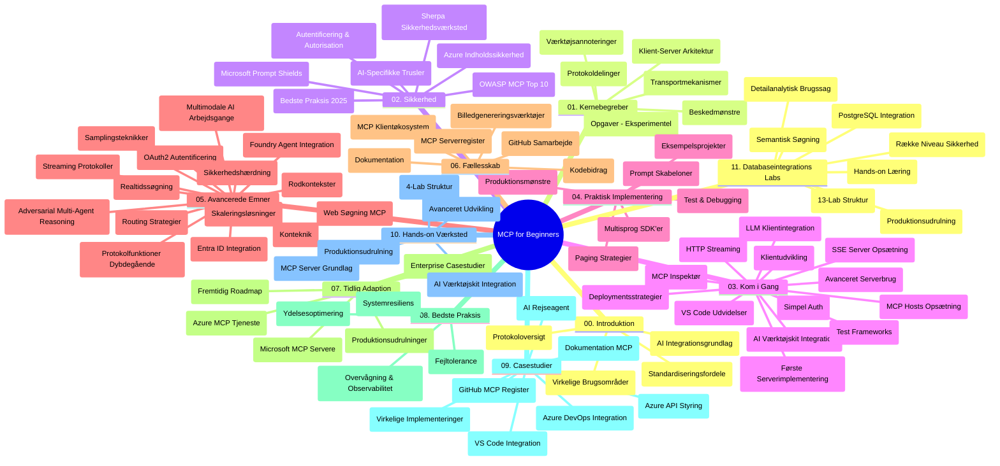

# Model Context Protocol (MCP) for Begyndere - Studievejledning

Denne studievejledning giver en oversigt over repositoriets struktur og indhold for læreplanen "Model Context Protocol (MCP) for Begyndere". Brug denne vejledning til effektivt at navigere i repositoriet og få mest muligt ud af de tilgængelige ressourcer.

## Repositorieoversigt

Model Context Protocol (MCP) er en standardiseret ramme for interaktioner mellem AI-modeller og klientapplikationer. Oprindeligt skabt af Anthropic, vedligeholdes MCP nu af det bredere MCP-fællesskab via den officielle GitHub-organisation. Dette repository tilbyder en omfattende læreplan med praktiske kodeeksempler i C#, Java, JavaScript, Python og TypeScript, designet til AI-udviklere, systemarkitekter og softwareingeniører.

## Visuelt Læreplanskort

## Repositoriestruktur

Repositoriet er organiseret i elleve hovedsektioner, der hver fokuserer på forskellige aspekter af MCP:

1. **Introduktion (00-Introduction/)**
   - Oversigt over Model Context Protocol
   - Hvorfor standardisering er vigtigt i AI-pipelines
   - Praktiske brugsscenarier og fordele

2. **Kernebegreber (01-CoreConcepts/)**
   - Klient-server arkitektur
   - Vigtige protokolkomponenter
   - Messaging-mønstre i MCP

3. **Sikkerhed (02-Security/)**
   - Sikkerhedstrusler i MCP-baserede systemer
   - Best practices til sikring af implementeringer
   - Autentificerings- og autorisationsstrategier
   - **Omfattende sikkerhedsdokumentation**:
     - MCP Security Best Practices 2025
     - Azure Content Safety Implementation Guide
     - MCP Security Controls and Techniques
     - MCP Best Practices Quick Reference
   - **Nøgleemner inden for sikkerhed**:
     - Prompt injection og tool poisoning-angreb
     - Session hijacking og confused deputy-problemer
     - Token passthrough sårbarheder
     - Overdrevne tilladelser og adgangskontrol
     - Supply chain-sikkerhed for AI-komponenter
     - Microsoft Prompt Shields integration

4. **Kom godt i gang (03-GettingStarted/)**
   - Opsætning og konfiguration af miljø
   - Oprettelse af grundlæggende MCP-servere og klienter
   - Integration med eksisterende applikationer
   - Indeholder sektioner for:
     - Første serverimplementering
     - Klientudvikling
     - LLM klientintegration
     - VS Code integration
     - Server-Sent Events (SSE) server
     - Avanceret serverbrug
     - HTTP streaming
     - AI Toolkit integration
     - Teststrategier
     - Deployeringsvejledning

5. **Praktisk implementering (04-PracticalImplementation/)**
   - Brug af SDK’er på tværs af forskellige programmeringssprog
   - Fejlfinding, test og valideringsteknikker
   - Udformning af genanvendelige promptskabeloner og workflows
   - Eksempelsprojekter med implementationsforslag

6. **Avancerede emner (05-AdvancedTopics/)**
   - Teknikker til kontekst-ingeniørkunst
   - Foundry-agent integration
   - Multi-modal AI-workflows
   - OAuth2 autentificeringsdemos
   - Real-time søgemuligheder
   - Real-time streaming
   - Implementering af rod-kontekster
   - Routingstrategier
   - Sampling-teknikker
   - Skaleringsmetoder
   - Sikkerhedsovervejelser
   - Entra ID sikkerhedsintegration
   - Websøgningsintegration
   - Adversarial multi-agent reasoning (debatmønstre)

7. **Fællesskabsbidrag (06-CommunityContributions/)**
   - Hvordan man bidrager med kode og dokumentation
   - Samarbejde via GitHub
   - Fællesskabsdrevne forbedringer og feedback
   - Brug af forskellige MCP-klienter (Claude Desktop, Cline, VSCode)
   - Arbejde med populære MCP-servere inklusiv billedegenerering

8. **Erfaringer fra tidlig adoption (07-LessonsfromEarlyAdoption/)**
   - Virkelige implementeringer og succeshistorier
   - Opbygning og implementering af MCP-baserede løsninger
   - Tendenser og fremtidig køreplan
   - **Microsoft MCP Server Guide**: Omfattende guide til 10 produktionsklare Microsoft MCP-servere, inklusive:
     - Microsoft Learn Docs MCP Server
     - Azure MCP Server (15+ specialiserede connectors)
     - GitHub MCP Server
     - Azure DevOps MCP Server
     - MarkItDown MCP Server
     - SQL Server MCP Server
     - Playwright MCP Server
     - Dev Box MCP Server
     - Azure AI Foundry MCP Server
     - Microsoft 365 Agents Toolkit MCP Server

9. **Best Practices (08-BestPractices/)**
   - Performance-tuning og optimering
   - Design af fejltolerante MCP-systemer
   - Test- og robusthedsstrategier

10. **Case Studier (09-CaseStudy/)**
    - **Syv omfattende case studier** der demonstrerer MCP’s alsidighed i forskellige scenarier:
    - **Azure AI Travel Agents**: Multi-agent orkestrering med Azure OpenAI og AI Search
    - **Azure DevOps Integration**: Automatisering af workflowprocesser med opdateringer fra YouTube-data
    - **Real-Time dokumenthentning**: Python konsolklient med streaming HTTP
    - **Interaktiv studieplan-generator**: Chainlit webapp med konverserende AI
    - **Dokumentation i editor**: VS Code integration med GitHub Copilot workflows
    - **Azure API Management**: Enterprise API-integration med oprettelse af MCP-server
    - **GitHub MCP Registry**: Økosystemudvikling og agentisk integrationsplatform
    - Implementeringseksempler der spænder over enterprise-integration, udviklerproduktivitet og økosystemudvikling

11. **Hands-on Workshop (10-StreamliningAIWorkflowsBuildingAnMCPServerWithAIToolkit/)**
    - Omfattende hands-on workshop, der kombinerer MCP med AI Toolkit
    - Bygning af intelligente applikationer, der forbinder AI-modeller med virkelige værktøjer
    - Praktiske moduler, der dækker grundfundamenter, specialudvikling af servere og produktions-implementeringsstrategier
    - **Lab-struktur**:
      - Lab 1: MCP Server Fundamental
      - Lab 2: Avanceret MCP Serverudvikling
      - Lab 3: AI Toolkit Integration
      - Lab 4: Produktions-implementering og skalering
    - Lab-baseret læring med trin-for-trin instruktioner

12. **MCP Server Database Integrationslabs (11-MCPServerHandsOnLabs/)**
    - **Omfattende 13-labs læringsforløb** til at bygge produktionsklare MCP-servere med PostgreSQL integration
    - **Virkelighedsnær detailhandelsanalyse** baseret på Zava Retail use case
    - **Enterprise-grade mønstre** inkluderes Row Level Security (RLS), semantisk søgning og multi-tenant dataadgang
    - **Fuldstændig lab-struktur**:
      - **Labs 00-03: Fundamenter** - Introduktion, Arkitektur, Sikkerhed, Miljøopsætning
      - **Labs 04-06: Byg MCP-serveren** - Databasedesign, MCP Serverimplementering, Værktøjsudvikling
      - **Labs 07-09: Avancerede funktioner** - Semantisk søgning, Test & debugging, VS Code integration
      - **Labs 10-12: Produktion & Best Practices** - Deployering, Overvågning, Optimering
    - **Dækkede teknologier**: FastMCP framework, PostgreSQL, Azure OpenAI, Azure Container Apps, Application Insights
    - **Læringsresultater**: Produktionsklare MCP-servere, databaseintegrationsmønstre, AI-drevne analyser, enterprise-sikkerhed

## Yderligere Ressourcer

Repositoriet inkluderer understøttende ressourcer:

- **Images folder**: Indeholder diagrammer og illustrationer brugt gennem læreplanen
- **Oversættelser**: Multisprogsunderstøttelse med automatiserede oversættelser af dokumentationen
- **Officielle MCP-ressourcer**:
  - [MCP Documentation](https://modelcontextprotocol.io/)
  - [MCP Specification](https://spec.modelcontextprotocol.io/)
  - [MCP GitHub Repository](https://github.com/modelcontextprotocol)

## Sådan bruger du dette repository

1. **Sekventiel læring**: Følg kapitlerne i rækkefølge (00 til 11) for en struktureret læringsoplevelse.
2. **Sprog-specifik fokus**: Hvis du er interesseret i et bestemt programmeringssprog, udforsk sample-mapperne for implementeringer i dit foretrukne sprog.
3. **Praktisk implementering**: Start med sektionen "Getting Started" for at opsætte dit miljø og skabe din første MCP-server og klient.
4. **Avanceret udforskning**: Når du er fortrolig med det grundlæggende, dyk ned i de avancerede emner for at udvide din viden.
5. **Fællesskabsengagement**: Deltag i MCP-fællesskabet via GitHub-diskussioner og Discord-kanaler for at forbinde med eksperter og andre udviklere.

## MCP-klienter og -værktøjer

Læreplanen dækker forskellige MCP-klienter og værktøjer:

1. **Officielle klienter**:
   - Visual Studio Code
   - MCP i Visual Studio Code
   - Claude Desktop
   - Claude i VSCode
   - Claude API

2. **Fællesskabsklienter**:
   - Cline (terminalbaseret)
   - Cursor (kodeeditor)
   - ChatMCP
   - Windsurf

3. **MCP management-værktøjer**:
   - MCP CLI
   - MCP Manager
   - MCP Linker
   - MCP Router

## Populære MCP-servere

Repositoriet introducerer forskellige MCP-servere, inklusive:

1. **Officielle Microsoft MCP-servere**:
   - Microsoft Learn Docs MCP Server
   - Azure MCP Server (15+ specialiserede connectors)
   - GitHub MCP Server
   - Azure DevOps MCP Server
   - MarkItDown MCP Server
   - SQL Server MCP Server
   - Playwright MCP Server
   - Dev Box MCP Server
   - Azure AI Foundry MCP Server
   - Microsoft 365 Agents Toolkit MCP Server

2. **Officielle referenceservere**:
   - Filesystem
   - Fetch
   - Memory
   - Sequential Thinking

3. **Billedgenerering**:
   - Azure OpenAI DALL-E 3
   - Stable Diffusion WebUI
   - Replicate

4. **Udviklingsværktøjer**:
   - Git MCP
   - Terminal Control
   - Code Assistant

5. **Specialiserede servere**:
   - Salesforce
   - Microsoft Teams
   - Jira & Confluence

## Bidrag

Dette repository byder velkommen til bidrag fra fællesskabet. Se sektionen Fællesskabsbidrag for vejledning i, hvordan man bidrager effektivt til MCP-økosystemet.

----

*Denne studievejledning blev senest opdateret den 5. februar 2026, hvilket afspejler den seneste MCP Specification 2025-11-25 og giver en oversigt over repositoriet pr. denne dato. Repositorieindhold kan blive opdateret efter denne dato.*

---

<!-- CO-OP TRANSLATOR DISCLAIMER START -->
**Ansvarsfraskrivelse**:
Dette dokument er blevet oversat ved hjælp af AI-oversættelsestjenesten [Co-op Translator](https://github.com/Azure/co-op-translator). Selvom vi bestræber os på nøjagtighed, bedes du være opmærksom på, at automatiserede oversættelser kan indeholde fejl eller unøjagtigheder. Det oprindelige dokument på dets modersmål bør betragtes som den autoritative kilde. For kritisk information anbefales professionel menneskelig oversættelse. Vi påtager os intet ansvar for misforståelser eller fejltolkninger, der opstår som følge af brugen af denne oversættelse.
<!-- CO-OP TRANSLATOR DISCLAIMER END -->