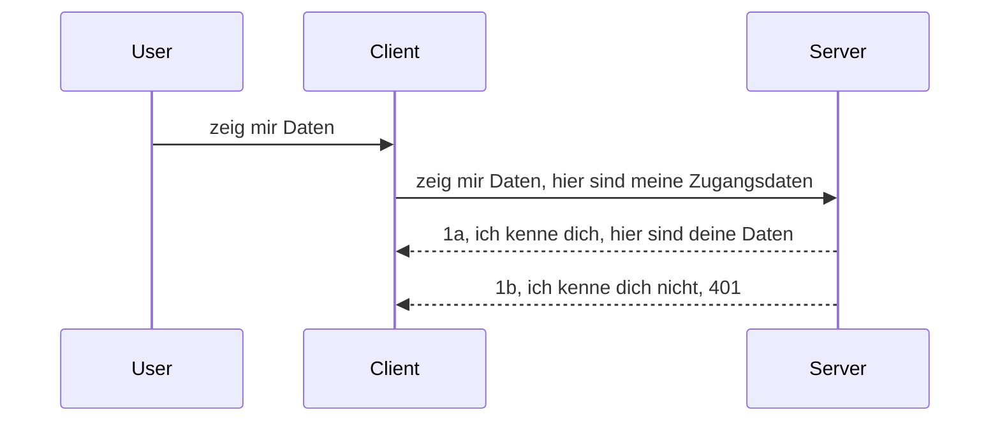

# Einfache Authentifizierung

MCP SDKs unterstützen die Verwendung von OAuth 2.1, was, ehrlich gesagt, ein ziemlich komplexer Prozess ist, der Konzepte wie Auth-Server, Ressourcen-Server, Posting von Zugangsdaten, Erhalt eines Codes, Austausch des Codes gegen ein Bearer-Token beinhaltet, bis man schließlich seine Ressourcendaten abrufen kann. Wenn Sie mit OAuth, was eine großartige Sache zum Implementieren ist, nicht vertraut sind, ist es eine gute Idee, mit einer einfachen Authentifizierung zu beginnen und schrittweise zu immer höherer Sicherheit aufzubauen. Deshalb gibt es dieses Kapitel, um Sie zu fortgeschritteneren Authentifizierungsmethoden zu führen.

## Auth, was meinen wir?

Auth steht für Authentifizierung und Autorisierung. Die Idee ist, dass wir zwei Dinge tun müssen:

- **Authentifizierung**, der Prozess herauszufinden, ob wir einer Person erlauben, in unser Haus zu kommen, dass sie das Recht hat, „hier“ zu sein, also Zugang zu unserem Ressourcen-Server hat, wo unsere MCP Server-Funktionalitäten leben.
- **Autorisierung**, ist der Prozess herauszufinden, ob ein Benutzer Zugriff auf genau diese spezifischen Ressourcen haben sollte, nach denen er fragt, zum Beispiel diese Bestellungen oder diese Produkte oder ob er beispielsweise den Inhalt nur lesen, aber nicht löschen darf.

## Zugangsdaten: Wie wir dem System sagen, wer wir sind

Nun, die meisten Webentwickler denken dabei daran, dem Server eine Anmeldeinformation bereitzustellen, meist ein Geheimnis, das sagt, ob sie hier erlaubt sind „Authentifizierung“. Diese Anmeldeinformation ist normalerweise eine base64-kodierte Version von Benutzername und Passwort oder ein API-Schlüssel, der einen spezifischen Benutzer eindeutig identifiziert.

Dies beinhaltet das Senden über einen Header namens „Authorization“ wie folgt:

```json
{ "Authorization": "secret123" }
```

Dies wird normalerweise als Basic Authentication bezeichnet. Wie der gesamte Ablauf dann funktioniert, ist wie folgt:


Nun, da wir aus Sicht des Ablaufs verstanden haben, wie es funktioniert, wie implementieren wir es? Die meisten Webserver haben ein Konzept namens Middleware, ein Codeabschnitt, der als Teil der Anfrage läuft, der Anmeldeinformationen überprüfen kann, und falls diese gültig sind, die Anfrage durchlässt. Wenn die Anfrage keine gültigen Anmeldeinformationen hat, erhält man einen Auth-Fehler. Schauen wir uns an, wie das implementiert werden kann:

**Python**

```python
class AuthMiddleware(BaseHTTPMiddleware):
    async def dispatch(self, request, call_next):

        has_header = request.headers.get("Authorization")
        if not has_header:
            print("-> Missing Authorization header!")
            return Response(status_code=401, content="Unauthorized")

        if not valid_token(has_header):
            print("-> Invalid token!")
            return Response(status_code=403, content="Forbidden")

        print("Valid token, proceeding...")
       
        response = await call_next(request)
        # Fügen Sie beliebige Kunden-Header hinzu oder ändern Sie die Antwort auf irgendeine Weise
        return response


starlette_app.add_middleware(CustomHeaderMiddleware)
```

Hier haben wir:

- Eine Middleware namens `AuthMiddleware` erstellt, bei der die Methode `dispatch` durch den Webserver aufgerufen wird.
- Die Middleware dem Webserver hinzugefügt:

    ```python
    starlette_app.add_middleware(AuthMiddleware)
    ```

- Validierungslogik geschrieben, die prüft, ob der Authorization-Header vorhanden ist und ob das gesendete Geheimnis gültig ist:

    ```python
    has_header = request.headers.get("Authorization")
    if not has_header:
        print("-> Missing Authorization header!")
        return Response(status_code=401, content="Unauthorized")

    if not valid_token(has_header):
        print("-> Invalid token!")
        return Response(status_code=403, content="Forbidden")
    ```

    Wenn das Geheimnis vorhanden und gültig ist, lassen wir die Anfrage durch, indem wir `call_next` aufrufen und die Antwort zurückgeben.

    ```python
    response = await call_next(request)
    # Fügen Sie beliebige Kundenheader hinzu oder ändern Sie die Antwort auf irgendeine Weise
    return response
    ```

Wie es funktioniert: Wenn eine Webanfrage an den Server gestellt wird, wird die Middleware aufgerufen und je nach Implementierung entweder die Anfrage durchgelassen oder ein Fehler zurückgegeben, der darauf hinweist, dass der Client keine Berechtigung zum Fortfahren hat.

**TypeScript**

Hier erstellen wir eine Middleware mit dem beliebten Framework Express und fangen die Anfrage ab, bevor sie den MCP Server erreicht. Hier ist der Code dazu:

```typescript
function isValid(secret) {
    return secret === "secret123";
}

app.use((req, res, next) => {
    // 1. Autorisierungs-Header vorhanden?
    if(!req.headers["Authorization"]) {
        res.status(401).send('Unauthorized');
    }
    
    let token = req.headers["Authorization"];

    // 2. Gültigkeit prüfen.
    if(!isValid(token)) {
        res.status(403).send('Forbidden');
    }

   
    console.log('Middleware executed');
    // 3. Übergibt die Anfrage an den nächsten Schritt in der Anforderungspipeline.
    next();
});
```

In diesem Code:

1. Prüfen wir, ob der Authorization-Header überhaupt vorhanden ist, falls nicht, senden wir einen 401-Fehler.
2. Stellen sicher, dass das Zugangstoken gültig ist, falls nicht, senden wir einen 403-Fehler.
3. Schließlich wird die Anfrage in der Pipeline weitergegeben und die angeforderte Ressource zurückgegeben.

## Aufgabe: Authentifizierung implementieren

Lassen Sie uns unser Wissen nutzen und es ausprobieren. Hier ist der Plan:

Server

- Erstellen eines Webservers und einer MCP-Instanz.
- Implementierung einer Middleware für den Server.

Client

- Webanfrage mit Zugangsdaten über Header senden.

### -1- Erstellen eines Webservers und einer MCP-Instanz

Im ersten Schritt müssen wir die Web-Server-Instanz und den MCP Server erstellen.

**Python**

Hier erstellen wir eine MCP Server-Instanz, eine starlette Web-App und hosten diese mit uvicorn.

```python
# Erstellen des MCP-Servers

app = FastMCP(
    name="MCP Resource Server",
    instructions="Resource Server that validates tokens via Authorization Server introspection",
    host=settings["host"],
    port=settings["port"],
    debug=True
)

# Erstellen der Starlette-Webanwendung
starlette_app = app.streamable_http_app()

# Bereitstellung der Anwendung über Uvicorn
async def run(starlette_app):
    import uvicorn
    config = uvicorn.Config(
            starlette_app,
            host=app.settings.host,
            port=app.settings.port,
            log_level=app.settings.log_level.lower(),
        )
    server = uvicorn.Server(config)
    await server.serve()

run(starlette_app)
```

In diesem Code:

- Erstellen wir den MCP Server.
- Konstruieren die starlette Web-App aus dem MCP Server `app.streamable_http_app()`.
- Hosten und bedienen die Web-App mit uvicorn `server.serve()`.

**TypeScript**

Hier erstellen wir eine MCP Server-Instanz.

```typescript
const server = new McpServer({
      name: "example-server",
      version: "1.0.0"
    });

    // ... Serverressourcen, Werkzeuge und Eingabeaufforderungen einrichten ...
```

Diese MCP Server-Erstellung muss innerhalb unserer POST-/mcp-Routen-Definition erfolgen, also verschieben wir obigen Code wie folgt:

```typescript
import express from "express";
import { randomUUID } from "node:crypto";
import { McpServer } from "@modelcontextprotocol/sdk/server/mcp.js";
import { StreamableHTTPServerTransport } from "@modelcontextprotocol/sdk/server/streamableHttp.js";
import { isInitializeRequest } from "@modelcontextprotocol/sdk/types.js"

const app = express();
app.use(express.json());

// Karte zum Speichern von Transporten nach Sitzungs-ID
const transports: { [sessionId: string]: StreamableHTTPServerTransport } = {};

// Bearbeite POST-Anfragen für die Client-Server-Kommunikation
app.post('/mcp', async (req, res) => {
  // Überprüfe auf vorhandene Sitzungs-ID
  const sessionId = req.headers['mcp-session-id'] as string | undefined;
  let transport: StreamableHTTPServerTransport;

  if (sessionId && transports[sessionId]) {
    // Wiederverwenden des vorhandenen Transports
    transport = transports[sessionId];
  } else if (!sessionId && isInitializeRequest(req.body)) {
    // Neue Initialisierungsanfrage
    transport = new StreamableHTTPServerTransport({
      sessionIdGenerator: () => randomUUID(),
      onsessioninitialized: (sessionId) => {
        // Speichere den Transport nach Sitzungs-ID
        transports[sessionId] = transport;
      },
      // DNS-Rebinding-Schutz ist standardmäßig deaktiviert für Abwärtskompatibilität. Wenn Sie diesen Server
      // lokal betreiben, stellen Sie sicher, dass Sie Folgendes setzen:
      // enableDnsRebindingProtection: true,
      // allowedHosts: ['127.0.0.1'],
    });

    // Transport beim Schließen bereinigen
    transport.onclose = () => {
      if (transport.sessionId) {
        delete transports[transport.sessionId];
      }
    };
    const server = new McpServer({
      name: "example-server",
      version: "1.0.0"
    });

    // ... richte Serverressourcen, Werkzeuge und Eingabeaufforderungen ein ...

    // Verbinde mit dem MCP-Server
    await server.connect(transport);
  } else {
    // Ungültige Anfrage
    res.status(400).json({
      jsonrpc: '2.0',
      error: {
        code: -32000,
        message: 'Bad Request: No valid session ID provided',
      },
      id: null,
    });
    return;
  }

  // Bearbeite die Anfrage
  await transport.handleRequest(req, res, req.body);
});

// Wiederverwendbarer Handler für GET- und DELETE-Anfragen
const handleSessionRequest = async (req: express.Request, res: express.Response) => {
  const sessionId = req.headers['mcp-session-id'] as string | undefined;
  if (!sessionId || !transports[sessionId]) {
    res.status(400).send('Invalid or missing session ID');
    return;
  }
  
  const transport = transports[sessionId];
  await transport.handleRequest(req, res);
};

// Bearbeite GET-Anfragen für Server-zu-Client-Benachrichtigungen über SSE
app.get('/mcp', handleSessionRequest);

// Bearbeite DELETE-Anfragen zur Sitzungsbeendigung
app.delete('/mcp', handleSessionRequest);

app.listen(3000);
```

Jetzt sehen Sie, wie die Erstellung des MCP Servers in `app.post("/mcp")` verschoben wurde.

Kommen wir zum nächsten Schritt: Middleware erstellen, damit wir die eingehenden Zugangsdaten validieren können.

### -2- Middleware für den Server implementieren

Kommen wir zum Middleware-Teil. Hier erstellen wir eine Middleware, die nach Zugangsdaten im `Authorization`-Header sucht und diese validiert. Wenn diese akzeptabel sind, wird die Anfrage weitergeleitet, um das zu tun, was sie tun muss (z.B. Werkzeuge listen, eine Ressource lesen oder was auch immer die MCP Funktionalität anfragt).

**Python**

Um die Middleware zu erstellen, brauchen wir eine Klasse, die von `BaseHTTPMiddleware` erbt. Es gibt zwei wichtige Elemente:

- Die Anfrage `request`, aus der wir die Header-Informationen lesen.
- `call_next` ist der Callback, den wir aufrufen müssen, wenn der Client eine akzeptierte Anmeldeinformation mitbringt.

Zuerst behandeln wir den Fall, dass der `Authorization`-Header fehlt:

```python
has_header = request.headers.get("Authorization")

# Kein Header vorhanden, Fehler mit 401, sonst weitermachen.
if not has_header:
    print("-> Missing Authorization header!")
    return Response(status_code=401, content="Unauthorized")
```

Hier senden wir eine 401 Unauthorized-Meldung, da der Client die Authentifizierung nicht besteht.

Dann, falls Zugangsdaten übermittelt wurden, prüfen wir die Gültigkeit wie folgt:

```python
 if not valid_token(has_header):
    print("-> Invalid token!")
    return Response(status_code=403, content="Forbidden")
```

Beachten Sie, wie wir obige 403 Forbidden-Meldung senden. Hier die vollständige Middleware, die alles implementiert:

```python
class AuthMiddleware(BaseHTTPMiddleware):
    async def dispatch(self, request, call_next):

        has_header = request.headers.get("Authorization")
        if not has_header:
            print("-> Missing Authorization header!")
            return Response(status_code=401, content="Unauthorized")

        if not valid_token(has_header):
            print("-> Invalid token!")
            return Response(status_code=403, content="Forbidden")

        print("Valid token, proceeding...")
        print(f"-> Received {request.method} {request.url}")
        response = await call_next(request)
        response.headers['Custom'] = 'Example'
        return response

```

Gut, aber wie sieht die `valid_token` Funktion aus? Hier ist sie:

```python
# NICHT für die Produktion verwenden - verbessern Sie es !!
def valid_token(token: str) -> bool:
    # Entfernen Sie das Präfix "Bearer "
    if token.startswith("Bearer "):
        token = token[7:]
        return token == "secret-token"
    return False
```

Das sollte natürlich verbessert werden.

WICHTIG: Sie sollten NIE Geheimnisse wie dieses im Code haben. Idealerweise holen Sie den Wert, mit dem verglichen wird, aus einer Datenquelle oder von einem IDP (Identity Provider) oder besser noch, lassen die Validierung vom IDP übernehmen.

**TypeScript**

Zur Implementierung mit Express müssen wir die `use`-Methode aufrufen, die Middleware-Funktionen akzeptiert.

Wir müssen:

- Mit der Anfragevariablen interagieren, um das übermittelte Zugangstoken im `Authorization`-Eigenschaft zu prüfen.
- Das Token validieren und, falls gültig, die Anfrage weiterlaufen lassen, damit der MCP Request des Clients erledigt, was er soll (z.B. Werkzeuge auflisten, Ressource lesen oder andere MCP Aktionen).

Wir prüfen hier, ob der `Authorization`-Header vorhanden ist und falls nicht, stoppen wir die Anfrage:

```typescript
if(!req.headers["authorization"]) {
    res.status(401).send('Unauthorized');
    return;
}
```

Wenn der Header gar nicht gesendet wurde, erhält man einen 401.

Dann prüfen wir, ob das Token gültig ist, falls nicht, stoppen wir die Anfrage mit einer etwas anderen Meldung:

```typescript
if(!isValid(token)) {
    res.status(403).send('Forbidden');
    return;
} 
```

Beachten Sie, dass Sie nun einen 403 Fehler erhalten.

Hier der komplette Code:

```typescript
app.use((req, res, next) => {
    console.log('Request received:', req.method, req.url, req.headers);
    console.log('Headers:', req.headers["authorization"]);
    if(!req.headers["authorization"]) {
        res.status(401).send('Unauthorized');
        return;
    }
    
    let token = req.headers["authorization"];

    if(!isValid(token)) {
        res.status(403).send('Forbidden');
        return;
    }  

    console.log('Middleware executed');
    next();
});
```

Der Webserver ist so eingestellt, dass er eine Middleware akzeptiert, um die von dem Client hoffentlich gesendeten Zugangsdaten zu prüfen. Wie sieht es mit dem Client selbst aus?

### -3- Webanfrage mit Zugangsdaten im Header senden

Wir müssen sicherstellen, dass der Client die Zugangsdaten über den Header übermittelt. Da wir einen MCP Client verwenden, müssen wir herausfinden, wie das gemacht wird.

**Python**

Für den Client müssen wir einen Header mit unseren Zugangsdaten so übergeben:

```python
# SCHREIBE den Wert nicht fest ins Programm, speichere ihn mindestens in einer Umgebungsvariable oder einem sichereren Speicher
token = "secret-token"

async with streamablehttp_client(
        url = f"http://localhost:{port}/mcp",
        headers = {"Authorization": f"Bearer {token}"}
    ) as (
        read_stream,
        write_stream,
        session_callback,
    ):
        async with ClientSession(
            read_stream,
            write_stream
        ) as session:
            await session.initialize()
      
            # TODO, was im Client erledigt werden soll, z.B. Werkzeuge auflisten, Werkzeuge aufrufen usw.
```

Beachten Sie, wie wir die `headers` Eigenschaft so ausfüllen ` headers = {"Authorization": f"Bearer {token}"}`.

**TypeScript**

Das können wir in zwei Schritten lösen:

1. Erstellen eines Konfigurationsobjekts mit unseren Zugangsdaten.
2. Übergabe des Konfigurationsobjekts an den Transport.

```typescript

// Werte nicht hartkodieren, wie hier gezeigt. Verwenden Sie mindestens eine Umgebungsvariable und etwas wie dotenv (im Entwicklungsmodus).
let token = "secret123"

// ein Objekt mit Transportoptionen für den Client definieren
let options: StreamableHTTPClientTransportOptions = {
  sessionId: sessionId,
  requestInit: {
    headers: {
      "Authorization": "secret123"
    }
  }
};

// das Optionsobjekt an den Transport übergeben
async function main() {
   const transport = new StreamableHTTPClientTransport(
      new URL(serverUrl),
      options
   );
```

Hier sehen Sie, wie wir ein `options` Objekt erzeugen und unsere Header unter der `requestInit` Eigenschaft ablegen.

WICHTIG: Wie können wir das verbessern? Aktuell hat die Implementierung einige Schwächen. Erstens ist es riskant, Zugangsdaten so zu übermitteln, außer man nutzt mindestens HTTPS. Selbst dann können Zugangsdaten gestohlen werden, daher braucht man ein System, mit dem man Token einfach widerrufen und zusätzliche Prüfungen einbauen kann, z.B. wo auf der Welt die Anfrage herkommt, ob zu viele Anfragen ähnlich einem Bot kommen – kurz, es gibt eine Menge zu beachten.

Trotzdem ist das für sehr einfache APIs, wo niemand die API ohne Authentifizierung aufrufen soll, ein guter Anfang.

Mit diesen Worten wollen wir die Sicherheit noch etwas härten, indem wir ein standardisiertes Format wie JSON Web Token, auch bekannt als JWT oder „JOT“ Token, verwenden.

## JSON Web Tokens, JWT

Wir versuchen also, von sehr einfachen Zugangsdaten wegzukommen. Welche unmittelbaren Verbesserungen ergeben sich durch die Einführung von JWT?

- **Sicherheitsverbesserungen**. Bei Basic Auth senden Sie immer wieder Benutzername und Passwort als base64-codiertes Token (oder einen API-Schlüssel), was ein Risiko erhöht. Mit JWT senden Sie zuerst Benutzername und Passwort und erhalten dann ein Token zurück, das zeitlich begrenzt ist und abläuft. JWT erlaubt feingranulare Zugriffskontrolle mit Rollen, Scopes und Berechtigungen.
- **Statuslosigkeit und Skalierbarkeit**. JWTs sind selbstenthaltend, tragen alle Benutzerinformationen mit sich und eliminieren die Notwendigkeit, serverseitige Session-Daten zu speichern. Das Token kann auch lokal validiert werden.
- **Interoperabilität und Föderation**. JWT ist ein zentraler Bestandteil von OpenID Connect und wird mit bekannten Identity Providern wie Entra ID, Google Identity und Auth0 verwendet. Sie ermöglichen Single Sign-On und vieles mehr, wodurch es Enterprise-tauglich wird.
- **Modularität und Flexibilität**. JWTs können auch mit API Gateways wie Azure API Management, NGINX und anderen verwendet werden. Sie unterstützen Authentifizierungsszenarien und Service-zu-Service-Kommunikation einschließlich Impersonation und Delegierung.
- **Performance und Caching**. JWTs können nach dem Dekodieren zwischengespeichert werden, was den Parsing-Aufwand reduziert. Das hilft insbesondere bei stark frequentierten Apps, da es den Durchsatz verbessert und die Last auf die Infrastruktur senkt.
- **Erweiterte Features**. Es werden auch Introspektion (Serverseitige Gültigkeitsprüfung) und Widerruf (Token wird ungültig) unterstützt.

Mit all diesen Vorteilen schauen wir, wie wir unsere Implementierung auf das nächste Level bringen können.

## Basic Auth in JWT umwandeln

Auf hoher Ebene müssen wir folgende Änderungen vornehmen:

- **Erlernen, wie man ein JWT Token konstruiert** und es für die Übertragung vom Client an den Server bereitstellt.
- **Validieren eines JWT Tokens** und, falls gültig, dem Client den Zugriff auf Ressourcen erlauben.
- **Sichere Token-Aufbewahrung**. Wie wir dieses Token speichern.
- **Routen schützen**. Wir müssen Routen schützen, insbesondere spezielle MCP Funktionen.
- **Refresh Tokens hinzufügen**. Sicherstellen, dass wir kurzlebige Tokens erstellen und Langzeit-Refresh-Tokens, um neue zu bekommen, wenn Tokens ablaufen. Außerdem einen Refresh-Endpunkt und eine Rotationsstrategie implementieren.

### -1- Ein JWT Token konstruieren

Ein JWT Token besteht aus folgenden Teilen:

- **Header**, welcher Algorithmus verwendet wird und der Token-Typ.
- **Payload**, Claims wie sub (der Benutzer oder Entität, die das Token repräsentiert. In Auth-Szenarien meist die Benutzer-ID), exp (Ablaufzeit), role (Rolle).
- **Signatur**, signiert mit einem Geheimnis oder privaten Schlüssel.

Dazu müssen wir Header, Payload und das kodierte Token erzeugen.

**Python**

```python

import jwt
import jwt
from jwt.exceptions import ExpiredSignatureError, InvalidTokenError
import datetime

# Geheimer Schlüssel zum Signieren des JWT
secret_key = 'your-secret-key'

header = {
    "alg": "HS256",
    "typ": "JWT"
}

# die Benutzerinformationen sowie deren Ansprüche und Ablaufzeit
payload = {
    "sub": "1234567890",               # Betreff (Benutzer-ID)
    "name": "User Userson",                # Benutzerdefinierte Anspruch
    "admin": True,                     # Benutzerdefinierte Anspruch
    "iat": datetime.datetime.utcnow(),# Ausgestellt am
    "exp": datetime.datetime.utcnow() + datetime.timedelta(hours=1)  # Ablauf
}

# kodieren
encoded_jwt = jwt.encode(payload, secret_key, algorithm="HS256", headers=header)
```

Im obigen Code haben wir:

- Ein Header definiert mit HS256 als Algorithmus und Typ JWT.
- Ein Payload erstellt, das ein Subjekt oder User ID, einen Benutzernamen, eine Rolle, Ausstellungszeit und Ablaufzeit enthält, wodurch der zeitliche Gültigkeitsaspekt realisiert wird.

**TypeScript**

Hier benötigen wir einige Abhängigkeiten, die uns bei der Erstellung des JWT Tokens helfen.

Abhängigkeiten

```sh

npm install jsonwebtoken
npm install --save-dev @types/jsonwebtoken
```

Jetzt, wo wir das haben, erstellen wir Header, Payload und darüber das kodierte Token.

```typescript
import jwt from 'jsonwebtoken';

const secretKey = 'your-secret-key'; // Verwenden Sie Umgebungsvariablen in der Produktion

// Definieren Sie die Nutzlast
const payload = {
  sub: '1234567890',
  name: 'User usersson',
  admin: true,
  iat: Math.floor(Date.now() / 1000), // Ausgestellt am
  exp: Math.floor(Date.now() / 1000) + 60 * 60 // Läuft in 1 Stunde ab
};

// Definieren Sie den Header (optional, jsonwebtoken setzt Standardwerte)
const header = {
  alg: 'HS256',
  typ: 'JWT'
};

// Erstellen Sie das Token
const token = jwt.sign(payload, secretKey, {
  algorithm: 'HS256',
  header: header
});

console.log('JWT:', token);
```

Dieses Token ist:

Mit HS256 signiert
1 Stunde gültig
Enthält Claims wie sub, name, admin, iat und exp.

### -2- Ein Token validieren

Wir müssen auch ein Token validieren, das machen wir idealerweise auf dem Server, um sicherzustellen, dass das, was der Client sendet, tatsächlich gültig ist. Es gibt viele Prüfungen, die wir hier durchführen sollten, von Struktur bis Gültigkeit. Weitere Prüfungen wie Benutzer im System zu prüfen, sind ebenfalls empfehlenswert.

Um ein Token zu validieren, dekodieren wir es, lesen es und prüfen dann die Gültigkeit:

**Python**

```python

# Dekodieren und Überprüfen des JWT
try:
    decoded = jwt.decode(token, secret_key, algorithms=["HS256"])
    print("✅ Token is valid.")
    print("Decoded claims:")
    for key, value in decoded.items():
        print(f"  {key}: {value}")
except ExpiredSignatureError:
    print("❌ Token has expired.")
except InvalidTokenError as e:
    print(f"❌ Invalid token: {e}")

```

In diesem Code rufen wir `jwt.decode` mit Token, dem geheimen Schlüssel und dem gewählten Algorithmus auf. Beachten Sie den try-except Block, da eine fehlgeschlagene Validierung zu einem Fehler führt.

**TypeScript**

Hier rufen wir `jwt.verify` auf, um eine dekodierte Version des Tokens zu erhalten, die wir weiter analysieren können. Wenn der Aufruf fehlschlägt, ist die Struktur falsch oder das Token nicht mehr gültig.

```typescript

try {
  const decoded = jwt.verify(token, secretKey);
  console.log('Decoded Payload:', decoded);
} catch (err) {
  console.error('Token verification failed:', err);
}
```

HINWEIS: Wie oben erwähnt, sollten weitere Prüfungen erfolgen, um sicherzustellen, dass dieses Token auf einen Benutzer in unserem System verweist und der Benutzer die angegebenen Rechte besitzt.

Als nächstes schauen wir uns rollenbasierte Zugriffskontrolle (RBAC) an.
## Hinzufügen von rollenbasierter Zugriffskontrolle

Die Idee ist, dass wir ausdrücken wollen, dass verschiedene Rollen unterschiedliche Berechtigungen haben. Zum Beispiel nehmen wir an, ein Admin kann alles, ein normaler Benutzer kann lesen/schreiben und ein Gast kann nur lesen. Hier sind daher einige mögliche Berechtigungsstufen:

- Admin.Write
- User.Read
- Guest.Read

Schauen wir uns an, wie wir eine solche Kontrolle mit Middleware implementieren können. Middlewares können pro Route oder für alle Routen hinzugefügt werden.

**Python**

```python
from starlette.middleware.base import BaseHTTPMiddleware
from starlette.responses import JSONResponse
import jwt

# HABEN SIE NICHT das Geheimnis im Code wie, dies ist nur für Demonstrationszwecke. Lesen Sie es von einem sicheren Ort.
SECRET_KEY = "your-secret-key" # Legen Sie dies in einer Umgebungsvariable ab
REQUIRED_PERMISSION = "User.Read"

class JWTPermissionMiddleware(BaseHTTPMiddleware):
    async def dispatch(self, request, call_next):
        auth_header = request.headers.get("Authorization")
        if not auth_header or not auth_header.startswith("Bearer "):
            return JSONResponse({"error": "Missing or invalid Authorization header"}, status_code=401)

        token = auth_header.split(" ")[1]
        try:
            decoded = jwt.decode(token, SECRET_KEY, algorithms=["HS256"])
        except jwt.ExpiredSignatureError:
            return JSONResponse({"error": "Token expired"}, status_code=401)
        except jwt.InvalidTokenError:
            return JSONResponse({"error": "Invalid token"}, status_code=401)

        permissions = decoded.get("permissions", [])
        if REQUIRED_PERMISSION not in permissions:
            return JSONResponse({"error": "Permission denied"}, status_code=403)

        request.state.user = decoded
        return await call_next(request)


```

Es gibt verschiedene Möglichkeiten, die Middleware wie unten hinzuzufügen:

```python

# Alt 1: Middleware beim Erstellen der Starlette-App hinzufügen
middleware = [
    Middleware(JWTPermissionMiddleware)
]

app = Starlette(routes=routes, middleware=middleware)

# Alt 2: Middleware hinzufügen, nachdem die Starlette-App bereits erstellt wurde
starlette_app.add_middleware(JWTPermissionMiddleware)

# Alt 3: Middleware pro Route hinzufügen
routes = [
    Route(
        "/mcp",
        endpoint=..., # Handler
        middleware=[Middleware(JWTPermissionMiddleware)]
    )
]
```

**TypeScript**

Wir können `app.use` verwenden und eine Middleware, die für alle Anfragen ausgeführt wird.

```typescript
app.use((req, res, next) => {
    console.log('Request received:', req.method, req.url, req.headers);
    console.log('Headers:', req.headers["authorization"]);

    // 1. Überprüfen, ob der Autorisierungsheader gesendet wurde

    if(!req.headers["authorization"]) {
        res.status(401).send('Unauthorized');
        return;
    }
    
    let token = req.headers["authorization"];

    // 2. Überprüfen, ob das Token gültig ist
    if(!isValid(token)) {
        res.status(403).send('Forbidden');
        return;
    }  

    // 3. Überprüfen, ob der Token-Benutzer in unserem System existiert
    if(!isExistingUser(token)) {
        res.status(403).send('Forbidden');
        console.log("User does not exist");
        return;
    }
    console.log("User exists");

    // 4. Verifizieren, dass das Token die richtigen Berechtigungen hat
    if(!hasScopes(token, ["User.Read"])){
        res.status(403).send('Forbidden - insufficient scopes');
    }

    console.log("User has required scopes");

    console.log('Middleware executed');
    next();
});

```

Es gibt einige Dinge, die unsere Middleware tun kann und die unsere Middleware TUN SOLLTE, nämlich:

1. Prüfen, ob der Autorisierungs-Header vorhanden ist
2. Prüfen, ob das Token gültig ist, wir rufen `isValid` auf, eine Methode, die wir geschrieben haben, die die Integrität und Gültigkeit des JWT-Tokens überprüft.
3. Überprüfen, ob der Benutzer in unserem System existiert, das sollten wir tun.

   ```typescript
    // Benutzer in der Datenbank
   const users = [
     "user1",
     "User usersson",
   ]

   function isExistingUser(token) {
     let decodedToken = verifyToken(token);

     // TODO, prüfen, ob Benutzer in der Datenbank existiert
     return users.includes(decodedToken?.name || "");
   }
   ```

   Oben haben wir eine sehr einfache `users`-Liste erstellt, die natürlich in einer Datenbank liegen sollte.

4. Zusätzlich sollten wir auch prüfen, ob das Token die richtigen Berechtigungen hat.

   ```typescript
   if(!hasScopes(token, ["User.Read"])){
        res.status(403).send('Forbidden - insufficient scopes');
   }
   ```

   In diesem obigen Code der Middleware prüfen wir, dass das Token die Berechtigung User.Read enthält, falls nicht, senden wir einen 403 Fehler. Unten ist die Hilfsmethode `hasScopes`.

   ```typescript
   function hasScopes(scope: string, requiredScopes: string[]) {
     let decodedToken = verifyToken(scope);
    return requiredScopes.every(scope => decodedToken?.scopes.includes(scope));
  }
   ```

Have a think which additional checks you should be doing, but these are the absolute minimum of checks you should be doing.

Using Express as a web framework is a common choice. There are helpers library when you use JWT so you can write less code.

- `express-jwt`, helper library that provides a middleware that helps decode your token.
- `express-jwt-permissions`, this provides a middleware `guard` that helps check if a certain permission is on the token.

Here's what these libraries can look like when used:

```typescript
const express = require('express');
const jwt = require('express-jwt');
const guard = require('express-jwt-permissions')();

const app = express();
const secretKey = 'your-secret-key'; // put this in env variable

// Decode JWT and attach to req.user
app.use(jwt({ secret: secretKey, algorithms: ['HS256'] }));

// Check for User.Read permission
app.use(guard.check('User.Read'));

// multiple permissions
// app.use(guard.check(['User.Read', 'Admin.Access']));

app.get('/protected', (req, res) => {
  res.json({ message: `Welcome ${req.user.name}` });
});

// Error handler
app.use((err, req, res, next) => {
  if (err.code === 'permission_denied') {
    return res.status(403).send('Forbidden');
  }
  next(err);
});

```

Nun haben Sie gesehen, wie Middleware sowohl für Authentifizierung als auch Autorisierung verwendet werden kann, aber wie sieht es mit MCP aus, ändert das, wie wir Auth machen? Finden wir es im nächsten Abschnitt heraus.

### -3- RBAC zu MCP hinzufügen

Sie haben bisher gesehen, wie man RBAC über Middleware hinzufügen kann, jedoch gibt es für MCP keine einfache Möglichkeit, eine rollenbasierte Zugriffskontrolle pro MCP-Feature hinzuzufügen, also was machen wir? Nun, wir müssen einfach Code hinzufügen, der in diesem Fall prüft, ob der Client das Recht hat, ein bestimmtes Tool aufzurufen:

Sie haben verschiedene Möglichkeiten, wie Sie rollenbasierte Zugriffskontrolle pro Feature umsetzen können, hier einige davon:

- Fügen Sie eine Prüfung für jedes Tool, jede Ressource, jeden Prompt hinzu, an dem Sie die Berechtigungsstufe prüfen müssen.

   **python**

   ```python
   @tool()
   def delete_product(id: int):
      try:
          check_permissions(role="Admin.Write", request)
      catch:
        pass # Client hat die Autorisierung nicht bestanden, Autorisierungsfehler auslösen
   ```

   **typescript**

   ```typescript
   server.registerTool(
    "delete-product",
    {
      title: Delete a product",
      description: "Deletes a product",
      inputSchema: { id: z.number() }
    },
    async ({ id }) => {
      
      try {
        checkPermissions("Admin.Write", request);
        // TODO, ID an ProductService und Remote-Eintrag senden
      } catch(Exception e) {
        console.log("Authorization error, you're not allowed");  
      }

      return {
        content: [{ type: "text", text: `Deletected product with id ${id}` }]
      };
    }
   );
   ```


- Verwenden Sie einen erweiterten Server-Ansatz und die Request-Handler, sodass Sie minimieren, an wie vielen Stellen Sie die Prüfung durchführen müssen.

   **Python**

   ```python
   
   tool_permission = {
      "create_product": ["User.Write", "Admin.Write"],
      "delete_product": ["Admin.Write"]
   }

   def has_permission(user_permissions, required_permissions) -> bool:
      # user_permissions: Liste der Berechtigungen, die der Benutzer hat
      # required_permissions: Liste der für das Tool erforderlichen Berechtigungen
      return any(perm in user_permissions for perm in required_permissions)

   @server.call_tool()
   async def handle_call_tool(
     name: str, arguments: dict[str, str] | None
   ) -> list[types.TextContent]:
    # Gehe davon aus, dass request.user.permissions eine Liste von Berechtigungen für den Benutzer ist
     user_permissions = request.user.permissions
     required_permissions = tool_permission.get(name, [])
     if not has_permission(user_permissions, required_permissions):
        # Fehler auslösen "Sie haben keine Berechtigung, das Tool {name} aufzurufen"
        raise Exception(f"You don't have permission to call tool {name}")
     # fortfahren und das Tool aufrufen
     # ...
   ```   
   

   **TypeScript**

   ```typescript
   function hasPermission(userPermissions: string[], requiredPermissions: string[]): boolean {
       if (!Array.isArray(userPermissions) || !Array.isArray(requiredPermissions)) return false;
       // Gibt true zurück, wenn der Benutzer mindestens eine erforderliche Berechtigung hat
       
       return requiredPermissions.some(perm => userPermissions.includes(perm));
   }
  
   server.setRequestHandler(CallToolRequestSchema, async (request) => {
      const { params: { name } } = request;
  
      let permissions = request.user.permissions;
  
      if (!hasPermission(permissions, toolPermissions[name])) {
         return new Error(`You don't have permission to call ${name}`);
      }
  
      // Mach weiter..
   });
   ```

   Hinweis: Sie müssen sicherstellen, dass Ihre Middleware ein dekodiertes Token als Benutzer-Property in der Anfrage zuweist, damit der obige Code einfach bleibt.

### Zusammenfassung

Nachdem wir nun besprochen haben, wie man RBAC allgemein und speziell für MCP hinzufügt, ist es Zeit, Sicherheit auf eigene Faust zu implementieren, um sicherzugehen, dass Sie die vorgestellten Konzepte verstanden haben.

## Aufgabe 1: Erstellen Sie einen mcp-Server und mcp-Client mit grundlegender Authentifizierung

Hier wenden Sie an, was Sie gelernt haben, um Anmeldeinformationen über Header zu senden.

## Lösung 1

[Lösung 1](./code/basic/README.md)

## Aufgabe 2: Verbessern Sie die Lösung aus Aufgabe 1 mit JWT

Nehmen Sie die erste Lösung, aber dieses Mal verbessern wir sie.

Statt Basic Auth verwenden wir JWT.

## Lösung 2

[Lösung 2](./solution/jwt-solution/README.md)

## Herausforderung

Fügen Sie die rollenbasierte Zugriffskontrolle pro Tool hinzu, wie im Abschnitt "RBAC zu MCP hinzufügen" beschrieben.

## Zusammenfassung

Sie haben hoffentlich in diesem Kapitel viel gelernt, vom völligen Mangel an Sicherheit über grundsätzliche Sicherheit hin zu JWT und wie es zu MCP hinzugefügt werden kann.

Wir haben eine solide Grundlage mit benutzerdefinierten JWTs geschaffen, aber mit zunehmender Skalierung bewegen wir uns in Richtung eines standardisierten Identitätsmodells. Die Einführung eines IdP wie Entra oder Keycloak ermöglicht es uns, die Token-Ausgabe, -Überprüfung und Lebenszyklusverwaltung an eine vertrauenswürdige Plattform auszulagern – so können wir uns auf die Anwendungslogik und die Benutzererfahrung konzentrieren.

Dazu haben wir ein weiterführendes [Kapitel zu Entra](../../05-AdvancedTopics/mcp-security-entra/README.md)

## Was als Nächstes kommt

- Weiter: [MCP Hosts einrichten](../12-mcp-hosts/README.md)

---

<!-- CO-OP TRANSLATOR DISCLAIMER START -->
**Haftungsausschluss**:  
Dieses Dokument wurde mit dem KI-Übersetzungsdienst [Co-op Translator](https://github.com/Azure/co-op-translator) übersetzt. Obwohl wir uns um Genauigkeit bemühen, beachten Sie bitte, dass automatisierte Übersetzungen Fehler oder Ungenauigkeiten enthalten können. Das Originaldokument in seiner Ursprungssprache ist als maßgebliche Quelle zu betrachten. Für wichtige Informationen wird eine professionelle menschliche Übersetzung empfohlen. Wir übernehmen keine Haftung für Missverständnisse oder Fehlinterpretationen, die aus der Verwendung dieser Übersetzung entstehen.
<!-- CO-OP TRANSLATOR DISCLAIMER END -->