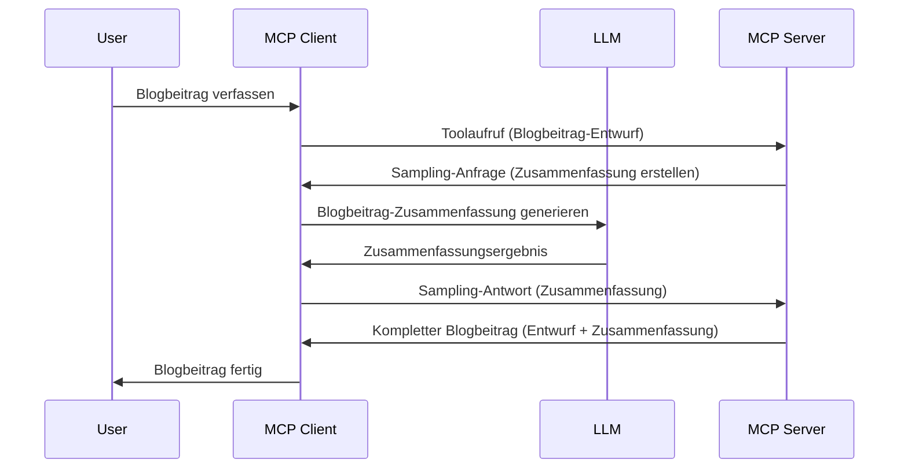

# Sampling - Funktionen an den Client delegieren

Manchmal müssen der MCP Client und der MCP Server zusammenarbeiten, um ein gemeinsames Ziel zu erreichen. Sie könnten beispielsweise den Fall haben, dass der Server die Hilfe eines auf dem Client befindlichen LLM benötigt. Für diese Situation sollten Sie Sampling verwenden.

Lassen Sie uns einige Anwendungsfälle betrachten und wie man eine Lösung mit Sampling erstellt.

## Übersicht

In dieser Lektion konzentrieren wir uns darauf, zu erklären, wann und wo Sampling verwendet wird und wie es konfiguriert wird.

## Lernziele

In diesem Kapitel werden wir:

- Erklären, was Sampling ist und wann man es verwendet.
- Zeigen, wie man Sampling in MCP konfiguriert.
- Beispiele für den Einsatz von Sampling geben.

## Was ist Sampling und warum es verwenden?

Sampling ist eine erweiterte Funktion, die folgendermaßen funktioniert:


### Sampling-Anfrage

Ok, jetzt haben wir einen hochrangigen Überblick über ein glaubwürdiges Szenario, sprechen wir über die Sampling-Anfrage, die der Server an den Client zurücksendet. So kann eine solche Anfrage im JSON-RPC-Format aussehen:

```json
{
  "jsonrpc": "2.0",
  "id": 1,
  "method": "sampling/createMessage",
  "params": {
    "messages": [
      {
        "role": "user",
        "content": {
          "type": "text",
          "text": "Create a blog post summary of the following blog post: <BLOG POST>"
        }
      }
    ],
    "modelPreferences": {
      "hints": [
        {
          "name": "claude-3-sonnet"
        }
      ],
      "intelligencePriority": 0.8,
      "speedPriority": 0.5
    },
    "systemPrompt": "You are a helpful assistant.",
    "maxTokens": 100
  }
}
```

Hier gibt es einige Punkte, die erwähnenswert sind:

- Prompt, unter content -> text, ist unsere Aufforderung, eine Anweisung an das LLM, den Inhalt eines Blogposts zusammenzufassen.

- **modelPreferences**. Dieser Abschnitt ist genau das, eine Präferenz, eine Empfehlung, welche Konfiguration mit dem LLM verwendet werden soll. Der Benutzer kann wählen, ob er diesen Empfehlungen folgt oder sie ändert. In diesem Fall gibt es Empfehlungen für das zu verwendende Modell sowie Prioritäten für Geschwindigkeit und Intelligenz.
- **systemPrompt**, das ist Ihr normaler System-Prompt, der Ihrem LLM eine Persönlichkeit gibt und Anweisungen enthält.
- **maxTokens**, eine weitere Eigenschaft, die angibt, wie viele Tokens für diese Aufgabe empfohlen werden.

### Sampling-Antwort

Diese Antwort wird vom MCP Client an den MCP Server zurückgesendet und ist das Ergebnis des Aufrufs des LLM vom Client, des Wartens auf die Antwort und dann des Erstellens dieser Nachricht. So könnte diese Antwort im JSON-RPC-Format aussehen:

```json
{
  "jsonrpc": "2.0",
  "id": 1,
  "result": {
    "role": "assistant",
    "content": {
      "type": "text",
      "text": "Here's your abstract <ABSTRACT>"
    },
    "model": "gpt-5",
    "stopReason": "endTurn"
  }
}
```

Beachten Sie, wie die Antwort eine Zusammenfassung des Blogposts ist, genau wie wir es verlangt haben. Beachten Sie auch, dass das verwendete `model` nicht das angefragte „gpt-5“ über „claude-3-sonnet“ ist. Dies verdeutlicht, dass der Nutzer seine Meinung ändern kann, welches Modell verwendet wird und dass Ihre Sampling-Anfrage eine Empfehlung darstellt.

Ok, jetzt, da wir den Hauptablauf verstehen und gesehen haben, wie nützlich die Aufgabe „Blogpost-Erstellung + Zusammenfassung“ ist, sehen wir, was wir tun müssen, um es zum Laufen zu bringen.

### Nachrichtentypen

Sampling-Nachrichten sind nicht nur auf Text beschränkt, Sie können auch Bilder und Audio senden. So sieht das JSON-RPC in diesen Fällen unterschiedlich aus:

**Text**

```json
{
  "type": "text",
  "text": "The message content"
}
```

**Bildinhalt**

```json
{
  "type": "image",
  "data": "base64-encoded-image-data",
  "mimeType": "image/jpeg"
}
```

**Audioinhalt**

```json
{
  "type": "audio",
  "data": "base64-encoded-audio-data",
  "mimeType": "audio/wav"
}
```

> HINWEIS: Für detailliertere Informationen zu Sampling, siehe die [offiziellen Docs](https://modelcontextprotocol.io/specification/2025-06-18/client/sampling)

## Wie man Sampling im Client konfiguriert

> Hinweis: Wenn Sie nur einen Server bauen, müssen Sie hier nicht viel tun.

In einem Client müssen Sie die folgende Funktion folgendermaßen angeben:

```json
{
  "capabilities": {
    "sampling": {}
  }
}
```

Diese wird dann genutzt, wenn Ihr gewählter Client mit dem Server initialisiert wird.

## Beispiel für Sampling in Aktion – Einen Blogpost erstellen

Lassen Sie uns gemeinsam einen Sampling-Server programmieren, dazu müssen wir Folgendes tun:

1. Ein Tool auf dem Server erstellen.
1. Dieses Tool soll eine Sampling-Anfrage erzeugen.
1. Das Tool soll auf die Antwort der Sampling-Anfrage des Clients warten.
1. Dann soll das Tool das Ergebnis erzeugen.

Schauen wir uns den Code Schritt für Schritt an:

### -1- Das Tool erstellen

**python**

```python
@mcp.tool()
async def create_blog(title: str, content: str, ctx: Context[ServerSession, None]) -> str:
    """Create a blog post and generate a summary"""

```

### -2- Eine Sampling-Anfrage erstellen

Erweitern Sie Ihr Tool mit folgendem Code:

**python**

```python
post = BlogPost(
        id=len(posts) + 1,
        title=title,
        content=content,
        abstract=""
    )

prompt = f"Create an abstract of the following blog post: title: {title} and draft: {content} "

result = await ctx.session.create_message(
        messages=[
            SamplingMessage(
                role="user",
                content=TextContent(type="text", text=prompt),
            )
        ],
        max_tokens=100,
)

```

### -3- Auf die Antwort warten und diese zurückgeben

**python**

```python
post.abstract = result.content.text

posts.append(post)

# gib das komplette Produkt zurück
return json.dumps({
    "id": post.title,
    "abstract": post.abstract
})
```

### -4- Gesamter Code

**python**

```python
from starlette.applications import Starlette
from starlette.routing import Mount, Host

from mcp.server.fastmcp import Context, FastMCP

from mcp.server.session import ServerSession
from mcp.types import SamplingMessage, TextContent

import json


from uuid import uuid4
from typing import List
from pydantic import BaseModel


mcp = FastMCP("Blog post generator")

# app = FastAPI()

posts = []

class BlogPost(BaseModel):
    id: int
    title: str
    content: str
    abstract: str

posts: List[BlogPost] = []

@mcp.tool()
async def create_blog(title: str, content: str, ctx: Context[ServerSession, None]) -> str:
    """Create a blog post and generate a summary"""

    post = BlogPost(
        id=len(posts) + 1,
        title=title,
        content=content,
        abstract=""
    )

    prompt = f"Create an abstract of the following blog post: title: {title} and draft: {content} "

    result = await ctx.session.create_message(
        messages=[
            SamplingMessage(
                role="user",
                content=TextContent(type="text", text=prompt),
            )
        ],
        max_tokens=100,
    )

    post.abstract = result.content.text

    posts.append(post)

    # gib den vollständigen Blogbeitrag zurück
    return json.dumps({
        "id": post.title,
        "abstract": post.abstract
    })

if __name__ == "__main__":
    print("Starting server...")
    # mcp.run()
    mcp.run(transport="streamable-http")

# Starte die App mit: python server.py
```

### -5- Testen in Visual Studio Code

Um das in Visual Studio Code zu testen, machen Sie Folgendes:

1. Server im Terminal starten
1. Fügen Sie ihn in *mcp.json* hinzu (und stellen Sie sicher, dass er gestartet ist), zum Beispiel so:

   ```json
   "servers": {
      "blog-server": {
        "type": "http",
        "url": "http://localhost:8000/mcp"
      }
   }
   ```

1. Geben Sie eine Eingabeaufforderung ein:

   ```text
   create a blog post named "Where Python comes from", the content is "Python is actually named after Monty Python Flying Circus"
   ```

1. Erlauben Sie das Sampling. Beim ersten Test werden Sie mit einem zusätzlichen Dialog aufgefordert, den Sie akzeptieren müssen, danach sehen Sie den normalen Dialog, um ein Tool auszuführen.

1. Ergebnisse prüfen. Die Ergebnisse werden sowohl schön im GitHub Copilot Chat angezeigt, als auch können Sie die rohe JSON-Antwort einsehen.

**Bonus**. Visual Studio Code bietet großartige Unterstützung für Sampling. Sie können den Sampling-Zugriff für Ihren installierten Server folgendermaßen konfigurieren:

1. Navigieren Sie zum Erweiterungsbereich.
1. Wählen Sie das Zahnrad-Symbol für Ihren installierten Server im Abschnitt "MCP SERVERS - INSTALLED".
1. Wählen Sie „Configure Model Access“, hier können Sie auswählen, welche Modelle GitHub Copilot bei Sampling verwenden darf. Außerdem sehen Sie alle kürzlich ausgeführten Sampling-Anfragen unter „Show Sampling requests“.

## Aufgabe

In dieser Aufgabe bauen Sie ein etwas anderes Sampling, nämlich eine Sampling-Integration, die eine Produktbeschreibung generiert. Hier ist Ihr Szenario:

**Szenario**: Ein Mitarbeiter im Backoffice eines E-Commerce-Unternehmens benötigt Unterstützung, es dauert viel zu lange, Produktbeschreibungen zu erstellen. Deshalb sollen Sie eine Lösung bauen, bei der Sie ein Tool „create_product“ mit „title“ und „keywords“ als Argumente aufrufen können und es ein komplettes Produkt inklusive eines „description“-Felds erzeugen soll, das vom LLM des Clients befüllt wird.

TIPP: Verwenden Sie das, was Sie zuvor gelernt haben, um diesen Server und sein Tool mit einer Sampling-Anfrage zu konstruieren.

## Lösung

[Lösung](./solution/README.md)

## Wichtigste Erkenntnisse

Sampling ist eine mächtige Funktion, die es dem Server erlaubt, Aufgaben an den Client zu delegieren, wenn er die Hilfe eines LLM benötigt.

## Was kommt als Nächstes

- [Kapitel 4 - Praktische Umsetzung](../../04-PracticalImplementation/README.md)

---

<!-- CO-OP TRANSLATOR DISCLAIMER START -->
**Haftungsausschluss**:  
Dieses Dokument wurde mit dem KI-Übersetzungsdienst [Co-op Translator](https://github.com/Azure/co-op-translator) übersetzt. Obwohl wir uns um Genauigkeit bemühen, beachten Sie bitte, dass automatisierte Übersetzungen Fehler oder Ungenauigkeiten enthalten können. Das Originaldokument in seiner Ausgangssprache ist als maßgebliche Quelle zu betrachten. Für wichtige Informationen wird eine professionelle menschliche Übersetzung empfohlen. Wir übernehmen keine Haftung für Missverständnisse oder Fehlinterpretationen, die aus der Verwendung dieser Übersetzung entstehen.
<!-- CO-OP TRANSLATOR DISCLAIMER END -->