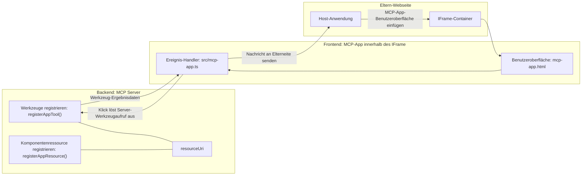

# MCP Apps

MCP Apps ist ein neues Paradigma im MCP. Die Idee ist, dass Sie nicht nur mit Daten als Antwort auf einen Tool-Aufruf reagieren, sondern auch Informationen darüber bereitstellen, wie mit diesen Informationen interagiert werden soll. Das bedeutet, dass Tool-Ergebnisse jetzt UI-Informationen enthalten können. Aber warum sollte man das wollen? Nun, betrachten Sie, wie Sie Dinge heute tun. Wahrscheinlich konsumieren Sie die Ergebnisse eines MCP-Servers, indem Sie eine Art Frontend davorstellen, das ist Code, den Sie schreiben und warten müssen. Manchmal ist das genau das, was Sie wollen, aber manchmal wäre es großartig, wenn Sie einfach ein Fragment von Informationen einbringen könnten, das in sich geschlossen ist und alles enthält, von Daten bis zur Benutzeroberfläche.

## Überblick

Diese Lektion bietet praktische Anleitungen zu MCP Apps, wie man damit beginnt und wie man sie in bestehende Web-Apps integriert. MCP Apps sind eine sehr neue Ergänzung zum MCP-Standard.

## Lernziele

Am Ende dieser Lektion werden Sie in der Lage sein:

- Zu erklären, was MCP Apps sind.
- Wann man MCP Apps verwendet.
- Eigene MCP Apps zu erstellen und zu integrieren.

## MCP Apps – wie funktioniert das

Die Idee bei MCP Apps ist, eine Antwort zu liefern, die im Wesentlichen eine Komponente ist, die gerendert wird. Eine solche Komponente kann sowohl visuelle als auch interaktive Elemente enthalten, z.B. Button-Klicks, Benutzereingaben und mehr. Beginnen wir mit der Serverseite und unserem MCP Server. Um eine MCP App-Komponente zu erstellen, müssen Sie ein Tool und die Anwendungsressource erstellen. Diese beiden Teile sind durch ein resourceUri verbunden.

Hier ist ein Beispiel. Versuchen wir zu visualisieren, was involviert ist und welche Teile welche Aufgaben übernehmen:

```text
server.ts -- responsible for registering tools and the component as a UI component
src/
  mcp-app.ts -- wiring up event handlers
mcp-app.html -- the user interface
```

Diese Visualisierung beschreibt die Architektur zum Erstellen einer Komponente und ihrer Logik.


Beschreiben wir als Nächstes die Verantwortlichkeiten für Backend und Frontend jeweils.

### Das Backend

Es gibt zwei Dinge, die wir hier erledigen müssen:

- Registrierung der Tools, mit denen wir interagieren wollen.
- Definition der Komponente.

**Tool registrieren**

```typescript
registerAppTool(
    server,
    "get-time",
    {
      title: "Get Time",
      description: "Returns the current server time.",
      inputSchema: {},
      _meta: { ui: { resourceUri } }, // Verknüpft dieses Tool mit seiner UI-Ressource
    },
    async () => {
      const time = new Date().toISOString();
      return { content: [{ type: "text", text: time }] };
    },
  );

```

Der obige Code beschreibt das Verhalten, wobei ein Tool namens `get-time` bereitgestellt wird. Es nimmt keine Eingaben entgegen, liefert aber die aktuelle Zeit. Wir haben die Möglichkeit, ein `inputSchema` für Tools zu definieren, bei denen Benutzereingaben akzeptiert werden müssen.

**Komponente registrieren**

In derselben Datei müssen wir auch die Komponente registrieren:

```typescript
const resourceUri = "ui://get-time/mcp-app.html";

// Registrieren Sie die Ressource, die das gebündelte HTML/JavaScript für die Benutzeroberfläche zurückgibt.
registerAppResource(
  server,
  resourceUri,
  resourceUri,
  { mimeType: RESOURCE_MIME_TYPE },
  async () => {
    const html = await fs.readFile(path.join(DIST_DIR, "mcp-app.html"), "utf-8");

    return {
    contents: [
        { uri: resourceUri, mimeType: RESOURCE_MIME_TYPE, text: html },
    ],
    };
  },
);
```

Beachten Sie, wie wir `resourceUri` erwähnen, um die Komponente mit ihren Tools zu verbinden. Interessant ist auch der Callback, bei dem die UI-Datei geladen und die Komponente zurückgegeben wird.

### Das Frontend der Komponente

Wie beim Backend gibt es hier zwei Teile:

- Ein Frontend, geschrieben in reinem HTML.
- Code, der Ereignisse behandelt und definiert, was bei deren Auslösung passiert, z.B. Tools aufrufen oder Nachrichten an das übergeordnete Fenster senden.

**Benutzeroberfläche**

Werfen wir einen Blick auf die Benutzeroberfläche.

```html
<!-- mcp-app.html -->
<!DOCTYPE html>
<html lang="en">
  <head>
    <meta charset="UTF-8" />
    <title>Get Time App</title>
  </head>
  <body>
    <p>
      <strong>Server Time:</strong> <code id="server-time">Loading...</code>
    </p>
    <button id="get-time-btn">Get Server Time</button>
    <script type="module" src="/src/mcp-app.ts"></script>
  </body>
</html>
```

**Ereignisbindung**

Der letzte Teil ist die Ereignisbindung. Das bedeutet, wir identifizieren, welcher Teil unserer UI Event-Handler benötigt und was zu tun ist, wenn Ereignisse ausgelöst werden:

```typescript
// mcp-app.ts

import { App } from "@modelcontextprotocol/ext-apps";

// Elemente referenzieren
const serverTimeEl = document.getElementById("server-time")!;
const getTimeBtn = document.getElementById("get-time-btn")!;

// Erstelle App-Instanz
const app = new App({ name: "Get Time App", version: "1.0.0" });

// Verarbeite Tool-Ergebnisse vom Server. Vor `app.connect()` setzen, um zu vermeiden
// das Verpassen des initialen Tool-Ergebnisses.
app.ontoolresult = (result) => {
  const time = result.content?.find((c) => c.type === "text")?.text;
  serverTimeEl.textContent = time ?? "[ERROR]";
};

// Button-Klick verbinden
getTimeBtn.addEventListener("click", async () => {
  // `app.callServerTool()` ermöglicht es der UI, frische Daten vom Server anzufordern
  const result = await app.callServerTool({ name: "get-time", arguments: {} });
  const time = result.content?.find((c) => c.type === "text")?.text;
  serverTimeEl.textContent = time ?? "[ERROR]";
});

// Mit Host verbinden
app.connect();
```

Wie Sie oben sehen können, ist dies normaler Code, um DOM-Elemente mit Ereignissen zu verbinden. Besonders hervorzuheben ist der Aufruf von `callServerTool`, der letztlich ein Tool auf dem Backend aufruft.

## Umgehen mit Benutzereingaben

Bis jetzt haben wir eine Komponente gesehen, die einen Button hat, der beim Klicken ein Tool aufruft. Sehen wir, ob wir weitere UI-Elemente wie ein Eingabefeld hinzufügen und Argumente an ein Tool senden können. Implementieren wir eine FAQ-Funktionalität. So sollte sie funktionieren:

- Es sollte einen Button und ein Eingabeelement geben, in das der Benutzer ein Schlüsselwort eingibt, z.B. "Versand". Dies sollte ein Tool auf dem Backend aufrufen, das in den FAQ-Daten sucht.
- Ein Tool, das die erwähnte FAQ-Suche unterstützt.

Fügen wir zunächst die benötigte Unterstützung zum Backend hinzu:

```typescript
const faq: { [key: string]: string } = {
    "shipping": "Our standard shipping time is 3-5 business days.",
    "return policy": "You can return any item within 30 days of purchase.",
    "warranty": "All products come with a 1-year warranty covering manufacturing defects.",
  }

registerAppTool(
    server,
    "get-faq",
    {
      title: "Search FAQ",
      description: "Searches the FAQ for relevant answers.",
      inputSchema: zod.object({
        query: zod.string().default("shipping"),
      }),
      _meta: { ui: { resourceUri: faqResourceUri } }, // Verknüpft dieses Werkzeug mit seiner UI-Ressource
    },
    async ({ query }) => {
      const answer: string = faq[query.toLowerCase()] || "Sorry, I don't have an answer for that.";
      return { content: [{ type: "text", text: answer }] };
    },
  );
```

Was wir hier sehen, ist, wie wir `inputSchema` befüllen und ihm ein `zod`-Schema zuweisen, wie folgt:

```typescript
inputSchema: zod.object({
  query: zod.string().default("shipping"),
})
```

Im obigen Schema erklären wir, dass wir einen Eingabeparameter namens `query` haben, der optional ist und einen Standardwert von "shipping" besitzt.

Ok, gehen wir zu *mcp-app.html* weiter, um zu sehen, welche UI wir dafür erstellen müssen:

```html
<div class="faq">
    <h1>FAQ response</h1>
    <p>FAQ Response: <code id="faq-response">Loading...</code></p>
    <input type="text" id="faq-query" placeholder="Enter FAQ query" />
    <button id="get-faq-btn">Get FAQ Response</button>
  </div>
```

Prima, jetzt haben wir ein Eingabeelement und einen Button. Gehen wir als Nächstes zu *mcp-app.ts*, um diese Ereignisse zu verknüpfen:

```typescript
const getFaqBtn = document.getElementById("get-faq-btn")!;
const faqQueryInput = document.getElementById("faq-query") as HTMLInputElement;

getFaqBtn.addEventListener("click", async () => {
  const query = faqQueryInput.value;
  const result = await app.callServerTool({ name: "get-faq", arguments: { query } });
  const faq = result.content?.find((c) => c.type === "text")?.text;
  faqResponseEl.textContent = faq ?? "[ERROR]";
});
```

Im obigen Code tun wir Folgendes:

- Referenzen zu den interaktiven UI-Elementen erstellen.
- Einen Button-Klick behandeln, um den Wert des Eingabeelements zu parsen, und wir rufen auch `app.callServerTool()` mit `name` und `arguments` auf, wobei letzteres `query` als Wert übergibt.

Was tatsächlich passiert, wenn Sie `callServerTool` aufrufen, ist, dass es eine Nachricht an das übergeordnete Fenster sendet und dieses Fenster ruft den MCP Server auf.

### Probieren Sie es aus

Wenn Sie es ausprobieren, sollten Sie nun Folgendes sehen:


und hier versuchen wir es mit einer Eingabe wie „warranty“:


Um diesen Code auszuführen, gehen Sie zum [Code-Abschnitt](./code/README.md)

## Testen in Visual Studio Code

Visual Studio Code bietet großartige Unterstützung für MCP Apps und ist wahrscheinlich einer der einfachsten Wege, Ihre MCP Apps zu testen. Um Visual Studio Code zu verwenden, fügen Sie einen Server-Eintrag zu *mcp.json* wie folgt hinzu:

```json
"my-mcp-server-7178eca7": {
    "url": "http://localhost:3001/mcp",
    "type": "http"
  }
```

Starten Sie dann den Server, Sie sollten mit Ihrem MCP App über das Chat-Fenster kommunizieren können, vorausgesetzt, Sie haben GitHub Copilot installiert.

Sie können dies über einen Prompt auslösen, zum Beispiel „#get-faq“:


Und genau wie wenn Sie es über einen Webbrowser gestartet haben, wird es auf dieselbe Weise gerendert:


## Aufgabe

Erstellen Sie ein Schere-Stein-Papier-Spiel. Es sollte Folgendes umfassen:

UI:

- Eine Dropdown-Liste mit Optionen
- Einen Button zum Abschicken einer Auswahl
- Ein Label, das zeigt, wer was gewählt hat und wer gewonnen hat

Server:

- Sollte ein Schere-Stein-Papier-Tool haben, das „choice“ als Eingabe nimmt. Es soll auch eine Computer-Wahl darstellen und den Gewinner bestimmen.

## Lösung

[Lösung](./assignment/README.md)

## Zusammenfassung

Wir haben über dieses neue Paradigma MCP Apps gelernt. Es ist ein neues Paradigma, das es MCP Servern ermöglicht, eine Meinung darüber zu haben, nicht nur über die Daten, sondern auch darüber, wie diese Daten präsentiert werden sollen.

Zusätzlich haben wir gelernt, dass diese MCP Apps in einem IFrame gehostet werden und zur Kommunikation mit den MCP Servern Nachrichten an die übergeordnete Web-App senden müssen. Es gibt verschiedene Bibliotheken für reines JavaScript, React und mehr, die diese Kommunikation erleichtern.

## Wichtigste Erkenntnisse

Das haben Sie gelernt:

- MCP Apps sind ein neuer Standard, der nützlich sein kann, wenn Sie sowohl Daten als auch UI-Funktionen bereitstellen möchten.
- Diese Art von Apps läuft aus Sicherheitsgründen in einem IFrame.

## Was kommt als Nächstes

- [Kapitel 4](../../04-PracticalImplementation/README.md)

---

<!-- CO-OP TRANSLATOR DISCLAIMER START -->
**Haftungsausschluss**:  
Dieses Dokument wurde mit dem KI-Übersetzungsdienst [Co-op Translator](https://github.com/Azure/co-op-translator) übersetzt. Obwohl wir uns um Genauigkeit bemühen, beachten Sie bitte, dass automatische Übersetzungen Fehler oder Ungenauigkeiten enthalten können. Das Originaldokument in seiner Ursprungssprache ist als maßgebliche Quelle zu betrachten. Für wichtige Informationen wird eine professionelle menschliche Übersetzung empfohlen. Wir übernehmen keine Haftung für Missverständnisse oder Fehlinterpretationen, die aus der Verwendung dieser Übersetzung entstehen.
<!-- CO-OP TRANSLATOR DISCLAIMER END -->