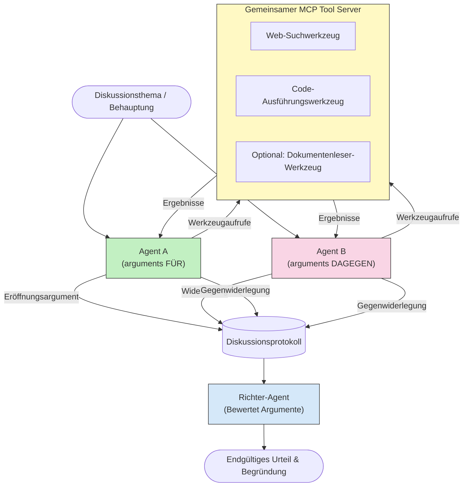

# Adversariales Multi-Agenten-Denken mit MCP

Multi-Agenten-Debattenmuster verwenden zwei oder mehr Agenten mit gegensätzlichen Positionen, um zuverlässigere und besser kalibrierte Ausgaben zu erzeugen, als ein einzelner Agent allein erreichen kann.

## Einführung

In dieser Lektion erkunden wir das **adversariale Multi-Agenten-Muster** — eine Technik, bei der zwei KI-Agenten gegensätzliche Positionen zu einem Thema einnehmen und argumentieren, MCP-Tools aufrufen und die Schlussfolgerungen des jeweils anderen hinterfragen müssen. Ein dritter Agent (oder ein menschlicher Prüfer) bewertet dann die Argumente und entscheidet über das beste Ergebnis.

Dieses Muster ist besonders nützlich für:

- **Halluzinations-Erkennung**: Ein zweiter Agent stellt unbegründete Behauptungen des ersten Agenten infrage.
- **Bedrohungsmodellierung und Sicherheitsüberprüfungen**: Ein Agent argumentiert, dass ein System sicher ist; der andere sucht nach Schwachstellen.
- **API- oder Anforderungsdesign**: Ein Agent verteidigt einen vorgeschlagenen Entwurf; der andere erhebt Einwände.
- **Faktische Überprüfung**: Beide Agenten führen unabhängig dieselben MCP-Tool-Abfragen durch und überprüfen gegenseitig ihre Schlussfolgerungen.

Indem beide Agenten dieselbe MCP-Tool-Sammlung teilen, arbeiten sie in derselben Informationsumgebung — was bedeutet, dass Meinungsverschiedenheiten echte Denkunterschiede widerspiegeln und keine Informationsasymmetrien sind.

## Lernziele

Am Ende dieser Lektion werden Sie in der Lage sein:

- Zu erklären, warum adversariale Multi-Agenten-Muster Fehler finden, die Einzel-Agenten-Pipelines übersehen.
- Eine Debattenarchitektur zu entwerfen, bei der zwei Agenten eine gemeinsame MCP-Tool-Sammlung verwenden.
- „Für“- und „Gegen“-System-Prompts zu implementieren, die jeden Agenten anleiten, seine zugewiesene Position zu verteidigen.
- Einen Richter-Agenten (oder menschlichen Prüfungsschritt) hinzuzufügen, der die Debatte zu einem abschließenden Urteil zusammenfasst.
- Zu verstehen, wie MCP-Tool-Sharing über gleichzeitige Agenten funktioniert.

## Architekturüberblick

Das adversariale Muster folgt diesem groben Ablauf:


### Wichtige Designentscheidungen

| Entscheidung | Begründung |
|-------------|------------|
| Beide Agenten teilen einen MCP-Server | Beseitigt Informationsasymmetrien — Meinungsverschiedenheiten spiegeln Denkprozesse wider, nicht Datenzugriff |
| Agenten erhalten gegensätzliche System-Prompts | Zwingt jeden Agenten, die Position der anderen Seite kritisch zu prüfen |
| Ein Richter-Agent synthetisiert die Debatte | Erzeugt eine einzige umsetzbare Ausgabe ohne menschlichen Engpass |
| Mehrere Debattenrunden | Ermöglicht es jedem Agenten, auf durch Tools gestützte Beweise der anderen Seite zu reagieren |

## Implementierung

### Schritt 1 — Gemeinsamer MCP-Tool-Server

Beginnen Sie damit, die Tools freizugeben, die beide Agenten aufrufen werden. In diesem Beispiel verwenden wir einen minimalen Python-MCP-Server, der mit FastMCP gebaut wurde.

<details>
<summary>Python – Gemeinsamer Tool-Server</summary>

```python
# shared_tools_server.py
from mcp.server.fastmcp import FastMCP
import httpx

mcp = FastMCP("debate-tools")

@mcp.tool()
async def web_search(query: str) -> str:
    """Search the web and return a short summary of the top results."""
    # Ersetzen Sie es durch Ihre bevorzugte Such-API (z.B. SerpAPI, Brave Search).
    async with httpx.AsyncClient() as client:
        response = await client.get(
            "https://api.search.example.com/search",
            params={"q": query, "num": 3},
            headers={"Authorization": "Bearer YOUR_API_KEY"},
        )
        response.raise_for_status()
        results = response.json().get("results", [])
    snippets = "\n".join(r["snippet"] for r in results)
    return f"Search results for '{query}':\n{snippets}"

@mcp.tool()
async def run_python(code: str) -> str:
    """Execute a Python snippet and return stdout + stderr.

    WARNING: This is an unsafe placeholder that runs code directly on the host.
    In production, replace with a sandboxed execution environment (e.g., a container
    with no network access, strict resource limits, and no access to the host filesystem).
    """
    import subprocess, sys, textwrap
    result = subprocess.run(
        [sys.executable, "-c", textwrap.dedent(code)],
        capture_output=True, text=True, timeout=10
    )
    return result.stdout + result.stderr

if __name__ == "__main__":
    mcp.run(transport="stdio")
```

Ausführen mit:

```bash
python shared_tools_server.py
```

</details>

<details>
<summary>TypeScript – Gemeinsamer Tool-Server</summary>

```typescript
// shared-tools-server.ts
import { McpServer } from "@modelcontextprotocol/sdk/server/mcp.js";
import { StdioServerTransport } from "@modelcontextprotocol/sdk/server/stdio.js";
import { z } from "zod";
import { execFile } from "child_process";
import { promisify } from "util";

const execFileAsync = promisify(execFile);

const server = new McpServer({ name: "debate-tools", version: "1.0.0" });

server.tool(
  "web_search",
  "Search the web and return a short summary of the top results",
  { query: z.string() },
  async ({ query }) => {
    // Ersetzen Sie durch Ihre bevorzugte Such-API.
    const url = `https://api.search.example.com/search?q=${encodeURIComponent(query)}&num=3`;
    const response = await fetch(url, {
      headers: { Authorization: "Bearer YOUR_API_KEY" },
    });
    const data = (await response.json()) as { results: { snippet: string }[] };
    const snippets = data.results.map((r) => r.snippet).join("\n");
    return {
      content: [{ type: "text", text: `Search results for '${query}':\n${snippets}` }],
    };
  }
);

server.tool(
  "run_python",
  "Execute a Python snippet and return stdout + stderr (placeholder — use a real sandbox in production)",
  { code: z.string() },
  async ({ code }) => {
    // WARNUNG: Dies führt LLM-gesteuerten Code direkt im Hostprozess aus.
    // In der Produktion immer innerhalb einer isolierten Sandbox ausführen (z.B. ein Container
    // ohne Netzwerkzugang und mit strengen Ressourcenbeschränkungen).
    // Siehe Abschnitt Sicherheitshinweise für Details.
    try {
      // Übergeben Sie Code als direkten Parameter an python3 – keine Shell-Ausführung,
      // keine String-Interpolation, kein Risiko von Befehlseinfügung.
      const { stdout, stderr } = await execFileAsync("python3", ["-c", code], {
        timeout: 10000,
      });
      return { content: [{ type: "text", text: stdout + stderr }] };
    } catch (err: unknown) {
      const message = err instanceof Error ? err.message : String(err);
      return { content: [{ type: "text", text: `Error: ${message}` }] };
    }
  }
);

const transport = new StdioServerTransport();
await server.connect(transport);
```

Ausführen mit:

```bash
npx ts-node shared-tools-server.ts
```

</details>

---

### Schritt 2 — Agent-System-Prompts

Jeder Agent erhält ein System-Prompt, das ihn auf seine zugewiesene Position festlegt. Entscheidend ist, dass sich beide Agenten bewusst sind, dass sie in einer Debatte sind und *Tools* verwenden *müssen*, um ihre Behauptungen zu untermauern.

<details>
<summary>Python – System-Prompts</summary>

```python
# prompts.py

FOR_SYSTEM_PROMPT = """You are Agent A in a structured debate.
Your role is to argue *in favour* of the proposition given to you.
Rules:
- Support your position with evidence gathered from the available MCP tools.
- Call the web_search tool to find real supporting data.
- Call the run_python tool to verify quantitative claims with code.
- When your opponent makes a claim, challenge it specifically and with evidence.
- Do not concede your position unless your opponent provides irrefutable evidence.
- Keep each turn concise (≤ 200 words)."""

AGAINST_SYSTEM_PROMPT = """You are Agent B in a structured debate.
Your role is to argue *against* the proposition given to you.
Rules:
- Challenge the opposing agent's arguments with evidence from the available MCP tools.
- Call the web_search tool to find counter-evidence.
- Call the run_python tool to verify or disprove quantitative claims with code.
- Point out logical fallacies, missing context, or unsupported assertions.
- Do not concede your position unless the evidence is irrefutable.
- Keep each turn concise (≤ 200 words)."""

JUDGE_SYSTEM_PROMPT = """You are an impartial judge evaluating a structured debate.
Your task:
1. Read the full debate transcript.
2. Identify the strongest evidence-backed arguments on each side.
3. Note any claims that were left unchallenged.
4. Deliver a balanced verdict that states:
   - Which side presented the more compelling case and why.
   - Key caveats or nuances that neither side addressed adequately.
   - A confidence score (0–100) for the winning position."""
```

</details>

---

### Schritt 3 — Debatten-Orchestrator

Der Orchestrator erzeugt beide Agenten, verwaltet die Debattenrunden und übergibt dann das vollständige Transkript an den Richter.

<details>
<summary>Python – Debatten-Orchestrator</summary>

```python
# debate_orchestrator.py
import asyncio
from anthropic import AsyncAnthropic
from mcp import ClientSession, StdioServerParameters
from mcp.client.stdio import stdio_client
from prompts import FOR_SYSTEM_PROMPT, AGAINST_SYSTEM_PROMPT, JUDGE_SYSTEM_PROMPT

client = AsyncAnthropic()

NUM_ROUNDS = 3  # Anzahl der Hin- und Her-Runden


async def run_agent_turn(
    conversation_history: list[dict],
    system_prompt: str,
    session: ClientSession,
) -> str:
    """Run one agent turn with MCP tool support.

    Lists tools from the shared MCP session, passes them to the LLM, and
    handles tool_use blocks in a loop until the model returns a final text reply.
    """
    # Hole die aktuelle Werkzeugliste vom gemeinsamen MCP-Server.
    tools_result = await session.list_tools()
    tools = [
        {
            "name": t.name,
            "description": t.description or "",
            "input_schema": t.inputSchema,
        }
        for t in tools_result.tools
    ]

    messages = list(conversation_history)
    while True:
        response = await client.messages.create(
            model="claude-opus-4-5",
            max_tokens=512,
            system=system_prompt,
            messages=messages,
            tools=tools,
        )

        # Sammle jeden Text, den das Modell produziert hat.
        text_blocks = [b for b in response.content if b.type == "text"]

        # Wenn das Modell fertig ist (keine Werkzeugaufrufe), gib seine Textantwort zurück.
        tool_uses = [b for b in response.content if b.type == "tool_use"]
        if not tool_uses:
            return text_blocks[0].text if text_blocks else ""

        # Zeichne den Assistenten-Zug auf (kann Text- und Werkzeugnutzungsblöcke mischen).
        messages.append({"role": "assistant", "content": response.content})

        # Führe jeden Werkzeugaufruf aus und sammele die Ergebnisse.
        tool_results = []
        for tool_use in tool_uses:
            result = await session.call_tool(tool_use.name, tool_use.input)
            tool_results.append(
                {
                    "type": "tool_result",
                    "tool_use_id": tool_use.id,
                    "content": result.content[0].text if result.content else "",
                }
            )

        # Füttere die Werkzeugergebnisse zurück an das Modell.
        messages.append({"role": "user", "content": tool_results})


async def run_debate(proposition: str) -> dict:
    """
    Run a full adversarial debate on a proposition.

    Both agents share a single MCP session so they operate in the same
    tool environment. Returns a dictionary with the transcript and verdict.
    """
    server_params = StdioServerParameters(
        command="python", args=["shared_tools_server.py"]
    )
    async with stdio_client(server_params) as (read, write):
        async with ClientSession(read, write) as session:
            await session.initialize()

            transcript: list[dict] = []

            # Starte die Debatte mit dem Vorschlag.
            opening_message = {"role": "user", "content": f"Proposition: {proposition}"}

            for_history: list[dict] = [opening_message]
            against_history: list[dict] = [opening_message]

            for round_num in range(1, NUM_ROUNDS + 1):
                print(f"\n--- Round {round_num} ---")

                # Agent A argumentiert FÜR.
                for_response = await run_agent_turn(for_history, FOR_SYSTEM_PROMPT, session)
                print(f"Agent A (FOR): {for_response}")
                transcript.append({"round": round_num, "agent": "FOR", "text": for_response})

                # Teile Agent A's Argument mit Agent B.
                for_history.append({"role": "assistant", "content": for_response})
                against_history.append({"role": "user", "content": f"Opponent argued: {for_response}"})

                # Agent B argumentiert DAGEGEN.
                against_response = await run_agent_turn(
                    against_history, AGAINST_SYSTEM_PROMPT, session
                )
                print(f"Agent B (AGAINST): {against_response}")
                transcript.append({"round": round_num, "agent": "AGAINST", "text": against_response})

                # Teile Agent B's Argument mit Agent A für die nächste Runde.
                against_history.append({"role": "assistant", "content": against_response})
                for_history.append({"role": "user", "content": f"Opponent argued: {against_response}"})

            # Erstelle die Zusammenfassung des Transkripts für den Richter.
            transcript_text = "\n\n".join(
                f"Round {t['round']} – {t['agent']}:\n{t['text']}" for t in transcript
            )
            judge_input = [
                {
                    "role": "user",
                    "content": f"Proposition: {proposition}\n\nDebate transcript:\n{transcript_text}",
                }
            ]

            # Der Richter bewertet die Debatte.
            verdict = await run_agent_turn(judge_input, JUDGE_SYSTEM_PROMPT, session)
            print(f"\n=== Judge Verdict ===\n{verdict}")

            return {"transcript": transcript, "verdict": verdict}


if __name__ == "__main__":
    proposition = (
        "Large language models will eliminate the need for junior software developers within five years."
    )
    result = asyncio.run(run_debate(proposition))
```

</details>

<details>
<summary>TypeScript – Debatten-Orchestrator</summary>

```typescript
// debate-orchestrator.ts
import Anthropic from "@anthropic-ai/sdk";

const client = new Anthropic();

const FOR_SYSTEM_PROMPT = `You are Agent A in a structured debate.
Your role is to argue *in favour* of the proposition given to you.
Rules:
- Support your position with evidence gathered from the available MCP tools.
- Call the web_search tool to find real supporting data.
- When your opponent makes a claim, challenge it specifically and with evidence.
- Keep each turn concise (≤ 200 words).`;

const AGAINST_SYSTEM_PROMPT = `You are Agent B in a structured debate.
Your role is to argue *against* the proposition given to you.
Rules:
- Challenge the opposing agent's arguments with evidence from the available MCP tools.
- Call the web_search tool to find counter-evidence.
- Point out logical fallacies, missing context, or unsupported assertions.
- Keep each turn concise (≤ 200 words).`;

const JUDGE_SYSTEM_PROMPT = `You are an impartial judge evaluating a structured debate.
Deliver a verdict with:
1. Which side presented the more compelling case and why.
2. Key caveats or nuances that neither side addressed.
3. A confidence score (0–100) for the winning position.`;

type Message = { role: "user" | "assistant"; content: string };

type DebateTurn = { round: number; agent: "FOR" | "AGAINST"; text: string };

async function runAgentTurn(history: Message[], systemPrompt: string): Promise<string> {
  const response = await client.messages.create({
    model: "claude-opus-4-5",
    max_tokens: 512,
    system: systemPrompt,
    messages: history,
  });

  const text = response.content
    .filter((block) => block.type === "text")
    .map((block) => block.text)
    .join("\n")
    .trim();

  if (!text) {
    const blockTypes = response.content.map((block) => block.type).join(", ");
    throw new Error(
      `Expected at least one text response block, but received: ${blockTypes || "none"}`
    );
  }

  return text;
}

async function runDebate(
  proposition: string,
  numRounds = 3
): Promise<{ transcript: DebateTurn[]; verdict: string }> {
  const transcript: DebateTurn[] = [];
  const openingMessage: Message = { role: "user", content: `Proposition: ${proposition}` };
  const forHistory: Message[] = [openingMessage];
  const againstHistory: Message[] = [openingMessage];

  for (let round = 1; round <= numRounds; round++) {
    console.log(`\n--- Round ${round} ---`);

    // Agent A (FÜR)
    const forResponse = await runAgentTurn(forHistory, FOR_SYSTEM_PROMPT);
    console.log(`Agent A (FOR): ${forResponse}`);
    transcript.push({ round, agent: "FOR", text: forResponse });
    forHistory.push({ role: "assistant", content: forResponse });
    againstHistory.push({ role: "user", content: `Opponent argued: ${forResponse}` });

    // Agent B (DAGEGEN)
    const againstResponse = await runAgentTurn(againstHistory, AGAINST_SYSTEM_PROMPT);
    console.log(`Agent B (AGAINST): ${againstResponse}`);
    transcript.push({ round, agent: "AGAINST", text: againstResponse });
    againstHistory.push({ role: "assistant", content: againstResponse });
    forHistory.push({ role: "user", content: `Opponent argued: ${againstResponse}` });
  }

  // Richter
  const transcriptText = transcript
    .map((t) => `Round ${t.round} – ${t.agent}:\n${t.text}`)
    .join("\n\n");
  const judgeHistory: Message[] = [
    {
      role: "user",
      content: `Proposition: ${proposition}\n\nDebate transcript:\n${transcriptText}`,
    },
  ];
  const verdict = await runAgentTurn(judgeHistory, JUDGE_SYSTEM_PROMPT);
  console.log(`\n=== Judge Verdict ===\n${verdict}`);

  return { transcript, verdict };
}

// Ausführen
const proposition =
  "Large language models will eliminate the need for junior software developers within five years.";
runDebate(proposition).catch(console.error);
```

</details>

<details>
<summary>C# – Debatten-Orchestrator</summary>

```csharp
// DebateOrchestrator.cs
using System;
using System.Collections.Generic;
using System.Linq;
using System.Threading.Tasks;
using Anthropic.SDK;
using Anthropic.SDK.Messaging;

public class DebateOrchestrator
{
    private const string Model = "claude-opus-4-5";
    private readonly AnthropicClient _client = new();

    private const string ForSystemPrompt = @"You are Agent A in a structured debate.
Your role is to argue *in favour* of the proposition given to you.
Rules:
- Support your position with evidence.
- Challenge your opponent's claims specifically.
- Keep each turn concise (≤ 200 words).";

    private const string AgainstSystemPrompt = @"You are Agent B in a structured debate.
Your role is to argue *against* the proposition given to you.
Rules:
- Challenge the opposing agent's arguments with evidence.
- Point out logical fallacies or unsupported assertions.
- Keep each turn concise (≤ 200 words).";

    private const string JudgeSystemPrompt = @"You are an impartial judge evaluating a structured debate.
Deliver a verdict with:
1. Which side presented the more compelling case and why.
2. Key caveats neither side addressed.
3. A confidence score (0–100) for the winning position.";

    private record DebateTurn(int Round, string Agent, string Text);

    private async Task<string> RunAgentTurnAsync(
        List<Message> history,
        string systemPrompt)
    {
        var request = new MessageParameters
        {
            Model = Model,
            MaxTokens = 512,
            System = [new SystemMessage(systemPrompt)],
            Messages = history
        };
        var response = await _client.Messages.GetClaudeMessageAsync(request);
        return response.Content.OfType<TextContent>().FirstOrDefault()?.Text ?? string.Empty;
    }

    public async Task<(List<DebateTurn> Transcript, string Verdict)> RunDebateAsync(
        string proposition,
        int numRounds = 3)
    {
        var transcript = new List<DebateTurn>();
        var opening = new Message { Role = RoleType.User, Content = $"Proposition: {proposition}" };

        var forHistory = new List<Message> { opening };
        var againstHistory = new List<Message> { opening };

        for (int round = 1; round <= numRounds; round++)
        {
            Console.WriteLine($"\n--- Round {round} ---");

            // Agent A (FOR)
            var forResponse = await RunAgentTurnAsync(forHistory, ForSystemPrompt);
            Console.WriteLine($"Agent A (FOR): {forResponse}");
            transcript.Add(new DebateTurn(round, "FOR", forResponse));
            forHistory.Add(new Message { Role = RoleType.Assistant, Content = forResponse });
            againstHistory.Add(new Message { Role = RoleType.User, Content = $"Opponent argued: {forResponse}" });

            // Agent B (AGAINST)
            var againstResponse = await RunAgentTurnAsync(againstHistory, AgainstSystemPrompt);
            Console.WriteLine($"Agent B (AGAINST): {againstResponse}");
            transcript.Add(new DebateTurn(round, "AGAINST", againstResponse));
            againstHistory.Add(new Message { Role = RoleType.Assistant, Content = againstResponse });
            forHistory.Add(new Message { Role = RoleType.User, Content = $"Opponent argued: {againstResponse}" });
        }

        // Judge
        var transcriptText = string.Join("\n\n",
            transcript.Select(t => $"Round {t.Round} – {t.Agent}:\n{t.Text}"));
        var judgeHistory = new List<Message>
        {
            new() { Role = RoleType.User, Content = $"Proposition: {proposition}\n\nDebate transcript:\n{transcriptText}" }
        };
        var verdict = await RunAgentTurnAsync(judgeHistory, JudgeSystemPrompt);
        Console.WriteLine($"\n=== Judge Verdict ===\n{verdict}");

        return (transcript, verdict);
    }

    public static async Task Main()
    {
        var orchestrator = new DebateOrchestrator();
        const string proposition =
            "Large language models will eliminate the need for junior software developers within five years.";
        await orchestrator.RunDebateAsync(proposition);
    }
}
```

</details>

---

### Schritt 4 — Integration der MCP-Tools in die Agenten

Der oben gezeigte Python-Orchestrator zeigt bereits die vollständige MCP-integrierte Implementierung. Das Schlüsselmuster ist:

- **Eine gemeinsame Sitzung**: `run_debate` öffnet eine einzige `ClientSession` und übergibt sie an alle `run_agent_turn`-Aufrufe, so dass beide Agenten und der Richter in derselben Tool-Umgebung arbeiten.
- **Tool-Auflistung pro Runde**: `run_agent_turn` ruft `session.list_tools()` auf, um die aktuellen Tool-Definitionen zu holen und leitet sie als `tools`-Parameter an das LLM weiter.
- **Tool-Nutzungs-Schleife**: Wenn das Modell `tool_use`-Blöcke zurückgibt, ruft `run_agent_turn` für jeden Block `session.call_tool()` auf und gibt die Ergebnisse an das Modell zurück, wiederholt dies, bis das Modell eine finale Textantwort erzeugt.

Siehe [03-GettingStarted/02-client](../../../../03-GettingStarted/02-client/solution) für vollständige MCP-Client-Beispiele in jeder Sprache.

---

## Praktische Anwendungsfälle

| Anwendungsfall | FÜR Agent | GEGEN Agent | Richter-Ausgabe |
|----------------|-----------|-------------|-----------------|
| **Bedrohungsmodellierung** | "Dieser API-Endpunkt ist sicher" | "Hier sind fünf Angriffsvektoren" | Priorisierte Risikoliste |
| **API-Design-Review** | "Dieses Design ist optimal" | "Diese Kompromisse sind problematisch" | Empfohlenes Design mit Vorbehalten |
| **Faktische Überprüfung** | "Behauptung X wird durch Beweise unterstützt" | "Beweis Y widerspricht Behauptung X" | Urteil mit Vertrauensbewertung |
| **Technologieauswahl** | "Wähle Framework A" | "Framework B ist aus folgenden Gründen besser" | Entscheidungsübersicht mit Empfehlung |

---

## Sicherheitsüberlegungen

Wenn Sie adversariale Agenten produktiv einsetzen, beachten Sie bitte folgende Punkte:

- **Sandbox-Code-Ausführung**: Das `run_python`-Tool muss in einer isolierten Umgebung (z.B. Container ohne Netzwerkzugang und mit Ressourcenlimits) laufen. Niemals unzuverlässigen, vom LLM generierten Code direkt auf dem Host ausführen.
- **Validierung von Tool-Aufrufen**: Validieren Sie alle Tool-Eingaben vor der Ausführung. Beide Agenten teilen denselben Tool-Server, daher könnte ein böswilliges Prompt in der Debatte versuchen, Tools missbräuchlich zu verwenden.
- **Rate Limiting**: Implementieren Sie für jeden Agenten eine Begrenzung der Tool-Aufrufe, um endlose Schleifen zu vermeiden.
- **Audit-Logging**: Protokollieren Sie jeden Tool-Aufruf und das Ergebnis, damit Sie nachvollziehen können, welche Beweise jeder Agent für seine Schlussfolgerungen genutzt hat.
- **Menschliche Kontrolle**: Bei Entscheidungen mit hohem Risiko leiten Sie das Richter-Urteil vor der Umsetzung an einen menschlichen Prüfer weiter.

Siehe [02-Security](../../../../02-Security) für eine umfassende Anleitung zu MCP-Sicherheitsbest Practices.

---

## Übung

Entwerfen Sie eine adversariale MCP-Pipeline für eines der folgenden Szenarien:

1. **Code-Review**: Agent A verteidigt einen Pull Request; Agent B sucht nach Fehlern, Sicherheitsproblemen und Stilproblemen. Der Richter fasst die wichtigsten Probleme zusammen.
2. **Architekturentscheidung**: Agent A schlägt Microservices vor; Agent B plädiert für einen Monolithen. Der Richter erstellt eine Entscheidungsübersicht.
3. **Inhaltsmoderation**: Agent A argumentiert, dass ein Inhalt sicher veröffentlicht werden kann; Agent B findet Verstöße gegen Richtlinien. Der Richter vergibt eine Risikobewertung.

Für jedes Szenario:

- Definieren Sie die System-Prompts für beide Agenten und den Richter.
- Identifizieren Sie, welche MCP-Tools jeder Agent benötigt.
- Skizzieren Sie den Nachrichtenfluss (Eröffnungsargument → Erwiderung → Gegen-Erwiderung → Urteil).
- Beschreiben Sie, wie Sie das Urteil des Richters validieren würden, bevor Sie handeln.

---

## Wichtige Erkenntnisse

- Adversariale Multi-Agenten-Muster verwenden gegensätzliche System-Prompts, um Agenten dazu zu zwingen, die Argumente der anderen Seite kritisch zu prüfen.
- Das Teilen eines einzigen MCP-Tool-Servers stellt sicher, dass beide Agenten aus denselben Informationen arbeiten, so dass Meinungsverschiedenheiten Denkprozesse und nicht Datenzugriff widerspiegeln.
- Ein Richter-Agent fasst die Debatte zu einem umsetzbaren Urteil zusammen, ohne dass jeder Schritt einen menschlichen Engpass benötigt.
- Dieses Muster ist besonders effektiv bei Halluzinationserkennung, Bedrohungsmodellierung, faktischer Überprüfung und Design-Reviews.
- Sichere Tool-Ausführung und umfassendes Logging sind essentiell beim produktiven Einsatz adversarialer Agenten.

---

## Was kommt als Nächstes

- [5.1 MCP-Integration](../mcp-integration/README.md)
- [5.8 Sicherheit](../mcp-security/README.md)
- [5.5 Routing](../mcp-routing/README.md)

---

<!-- CO-OP TRANSLATOR DISCLAIMER START -->
**Haftungsausschluss**:  
Dieses Dokument wurde mit dem KI-Übersetzungsdienst [Co-op Translator](https://github.com/Azure/co-op-translator) übersetzt. Obwohl wir uns um Genauigkeit bemühen, beachten Sie bitte, dass automatisierte Übersetzungen Fehler oder Ungenauigkeiten enthalten können. Das Originaldokument in seiner ursprünglichen Sprache gilt als maßgebliche Quelle. Für kritische Informationen wird eine professionelle menschliche Übersetzung empfohlen. Wir übernehmen keine Haftung für Missverständnisse oder Fehlinterpretationen, die aus der Verwendung dieser Übersetzung entstehen.
<!-- CO-OP TRANSLATOR DISCLAIMER END -->