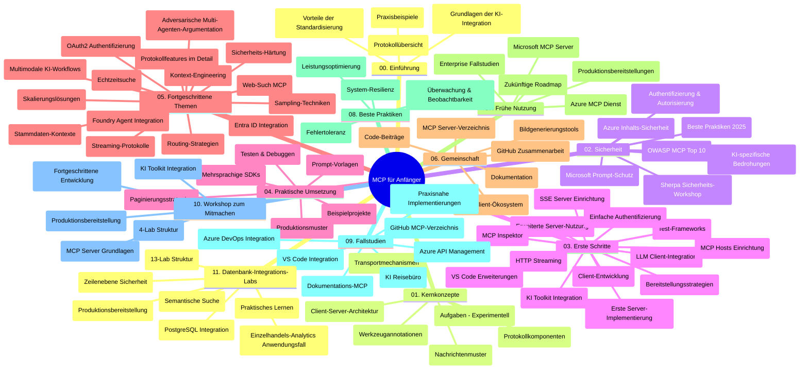

# Model Context Protocol (MCP) für Anfänger - Studienführer

Dieser Studienführer bietet einen Überblick über die Repository-Struktur und den Inhalt des Curriculums "Model Context Protocol (MCP) für Anfänger". Verwenden Sie diesen Leitfaden, um sich effizient im Repository zurechtzufinden und die verfügbaren Ressourcen optimal zu nutzen.

## Überblick über das Repository

Das Model Context Protocol (MCP) ist ein standardisiertes Framework für die Interaktionen zwischen KI-Modellen und Client-Anwendungen. Ursprünglich von Anthropic erstellt, wird MCP jetzt von der breiteren MCP-Community über die offizielle GitHub-Organisation gepflegt. Dieses Repository bietet ein umfassendes Curriculum mit praxisnahen Codebeispielen in C#, Java, JavaScript, Python und TypeScript, das für KI-Entwickler, Systemarchitekten und Softwareingenieure konzipiert ist.

## Visuelle Curriculum-Karte

## Repository-Struktur

Das Repository ist in elf Hauptabschnitte gegliedert, die jeweils verschiedene Aspekte von MCP abdecken:

1. **Einführung (00-Introduction/)**
   - Überblick über das Model Context Protocol
   - Warum Standardisierung in KI-Pipelines wichtig ist
   - Praktische Anwendungsfälle und Vorteile

2. **Kernkonzepte (01-CoreConcepts/)**
   - Client-Server-Architektur
   - Wichtige Protokollkomponenten
   - Messaging-Muster im MCP

3. **Sicherheit (02-Security/)**
   - Sicherheitsbedrohungen in MCP-basierten Systemen
   - Best Practices zur Sicherung von Implementierungen
   - Authentifizierungs- und Autorisierungsstrategien
   - **Umfassende Sicherheitsdokumentation**:
     - MCP Security Best Practices 2025
     - Azure Content Safety Implementierungsleitfaden
     - MCP Security Controls und Techniken
     - MCP Best Practices Schnellreferenz
   - **Wichtige Sicherheitsthemen**:
     - Prompt-Injection- und Tool-Vergiftungsangriffe
     - Session-Hijacking und Confused Deputy Probleme
     - Token-Passthrough-Schwachstellen
     - Übermäßige Berechtigungen und Zugriffskontrolle
     - Supply-Chain-Sicherheit für KI-Komponenten
     - Microsoft Prompt Shields Integration

4. **Erste Schritte (03-GettingStarted/)**
   - Einrichtung und Konfiguration der Umgebung
   - Erstellung grundlegender MCP-Server und -Clients
   - Integration in bestehende Anwendungen
   - Enthält Abschnitte für:
     - Erste Serverimplementierung
     - Client-Entwicklung
     - LLM-Client-Integration
     - VS Code Integration
     - Server-Sent Events (SSE) Server
     - Erweiterte Serveranwendung
     - HTTP Streaming
     - AI Toolkit Integration
     - Teststrategien
     - Bereitstellungsrichtlinien

5. **Praktische Umsetzung (04-PracticalImplementation/)**
   - Verwendung von SDKs in verschiedenen Programmiersprachen
   - Debugging-, Test- und Validierungstechniken
   - Entwicklung wiederverwendbarer Prompt-Vorlagen und Workflows
   - Beispielprojekte mit Implementierungsbeispielen

6. **Erweiterte Themen (05-AdvancedTopics/)**
   - Techniken des Context Engineerings
   - Foundry Agent Integration
   - Multimodale KI-Workflows
   - OAuth2-Authentifizierungsdemos
   - Echtzeit-Suchfunktionen
   - Echtzeit-Streaming
   - Implementierung von Root-Contexts
   - Routing-Strategien
   - Sampling-Techniken
   - Skalierungsansätze
   - Sicherheitsaspekte
   - Entra ID Sicherheitsintegration
   - Web-Suchintegration
   - Adversarisches Multi-Agent Reasoning (Debattenmuster)

7. **Community-Beiträge (06-CommunityContributions/)**
   - Wie man Code und Dokumentation beiträgt
   - Zusammenarbeit über GitHub
   - Community-getriebene Erweiterungen und Feedback
   - Nutzung verschiedener MCP-Clients (Claude Desktop, Cline, VSCode)
   - Arbeiten mit populären MCP-Servern, einschließlich Bilderzeugung

8. **Erfahrungen aus früher Anwendung (07-LessonsfromEarlyAdoption/)**
   - Praxisnahe Implementierungen und Erfolgsgeschichten
   - Aufbau und Bereitstellung MCP-basierter Lösungen
   - Trends und zukünftige Roadmap
   - **Microsoft MCP Server Leitfaden**: Umfassender Leitfaden zu 10 produktionsreifen Microsoft MCP Servern, darunter:
     - Microsoft Learn Docs MCP Server
     - Azure MCP Server (15+ spezialisierte Konnektoren)
     - GitHub MCP Server
     - Azure DevOps MCP Server
     - MarkItDown MCP Server
     - SQL Server MCP Server
     - Playwright MCP Server
     - Dev Box MCP Server
     - Azure AI Foundry MCP Server
     - Microsoft 365 Agents Toolkit MCP Server

9. **Best Practices (08-BestPractices/)**
   - Performance-Tuning und Optimierung
   - Gestaltung fehlertoleranter MCP-Systeme
   - Test- und Resilienzstrategien

10. **Fallstudien (09-CaseStudy/)**
    - **Sieben umfassende Fallstudien**, die die Vielseitigkeit von MCP in unterschiedlichen Szenarien demonstrieren:
    - **Azure AI Travel Agents**: Multi-Agenten-Orchestrierung mit Azure OpenAI und AI Search
    - **Azure DevOps Integration**: Automatisierung von Workflow-Prozessen mit YouTube-Datenaktualisierungen
    - **Echtzeit-Dokumentenabruf**: Python-Konsolenclient mit Streaming-HTTP
    - **Interaktiver Studienplan-Generator**: Chainlit-Web-App mit konversationeller KI
    - **In-Editor-Dokumentation**: VS Code Integration mit GitHub Copilot Workflows
    - **Azure API Management**: Unternehmens-API-Integration mit MCP-Server-Erstellung
    - **GitHub MCP Registry**: Ökosystementwicklung und agente Plattformintegration
    - Implementierungsbeispiele von Unternehmensintegration, Entwicklerproduktivität und Ökosystementwicklung

11. **Praktischer Workshop (10-StreamliningAIWorkflowsBuildingAnMCPServerWithAIToolkit/)**
    - Umfassender praktischer Workshop zum Kombinieren von MCP mit AI Toolkit
    - Entwicklung intelligenter Anwendungen, die KI-Modelle mit realen Werkzeugen verbinden
    - Praktische Module zu Grundlagen, benutzerdefinierter Serverentwicklung und Strategien für produktive Bereitstellung
    - **Lab-Struktur**:
      - Lab 1: MCP Server Grundlagen
      - Lab 2: Fortgeschrittene MCP Serverentwicklung
      - Lab 3: AI Toolkit Integration
      - Lab 4: Produktivsetzung und Skalierung
    - Lab-basiertes Lernen mit Schritt-für-Schritt-Anleitungen

12. **MCP Server Datenbank-Integrations-Labs (11-MCPServerHandsOnLabs/)**
    - **Umfassender 13-Lab Lernpfad** zum Aufbau produktionsreifer MCP Server mit PostgreSQL-Integration
    - **Praxisnahe Implementierung im Einzelhandel** anhand des Zava Retail Use Cases
    - **Enterprise-Grade Patterns** einschließlich Row Level Security (RLS), semantische Suche und Multi-Tenant Datenzugriff
    - **Komplette Lab-Struktur**:
      - **Labs 00-03: Grundlagen** - Einführung, Architektur, Sicherheit, Einrichtung der Umgebung
      - **Labs 04-06: Aufbau des MCP Servers** - Datenbankdesign, MCP Server-Implementierung, Tool-Entwicklung
      - **Labs 07-09: Erweiterte Features** - Semantische Suche, Testing & Debugging, VS Code Integration
      - **Labs 10-12: Produktion & Best Practices** - Bereitstellung, Monitoring, Optimierung
    - **Abgedeckte Technologien**: FastMCP Framework, PostgreSQL, Azure OpenAI, Azure Container Apps, Application Insights
    - **Lernergebnisse**: Produktionsreife MCP Server, Datenbank-Integrationsmuster, KI-gestützte Analysen, Unternehmenssicherheit

## Zusätzliche Ressourcen

Das Repository enthält unterstützende Ressourcen:

- **Bilderordner**: Enthält Diagramme und Illustrationen, die im Curriculum verwendet werden
- **Übersetzungen**: Mehrsprachige Unterstützung mit automatisierten Übersetzungen der Dokumentation
- **Offizielle MCP-Ressourcen**:
  - [MCP Dokumentation](https://modelcontextprotocol.io/)
  - [MCP Spezifikation](https://spec.modelcontextprotocol.io/)
  - [MCP GitHub Repository](https://github.com/modelcontextprotocol)

## Wie man dieses Repository nutzt

1. **Sequenzielles Lernen**: Folgen Sie den Kapiteln in der Reihenfolge (00 bis 11) für ein strukturiertes Lernerlebnis.
2. **Sprachspezifischer Fokus**: Wenn Sie an einer bestimmten Programmiersprache interessiert sind, erkunden Sie die Samples-Verzeichnisse für Implementierungen in Ihrer bevorzugten Sprache.
3. **Praktische Umsetzung**: Beginnen Sie mit dem Abschnitt „Erste Schritte“, um Ihre Umgebung einzurichten und Ihren ersten MCP-Server und -Client zu erstellen.
4. **Fortgeschrittene Erkundung**: Sobald Sie mit den Grundlagen vertraut sind, tauchen Sie in die erweiterten Themen ein, um Ihr Wissen zu vertiefen.
5. **Community-Engagement**: Treten Sie der MCP-Community über GitHub-Diskussionen und Discord-Kanäle bei, um sich mit Experten und anderen Entwicklern zu vernetzen.

## MCP Clients und Tools

Das Curriculum deckt verschiedene MCP-Clients und Tools ab:

1. **Offizielle Clients**:
   - Visual Studio Code
   - MCP in Visual Studio Code
   - Claude Desktop
   - Claude in VSCode
   - Claude API

2. **Community Clients**:
   - Cline (terminalbasiert)
   - Cursor (Code-Editor)
   - ChatMCP
   - Windsurf

3. **MCP Management Tools**:
   - MCP CLI
   - MCP Manager
   - MCP Linker
   - MCP Router

## Beliebte MCP Server

Das Repository stellt verschiedene MCP-Server vor, darunter:

1. **Offizielle Microsoft MCP Server**:
   - Microsoft Learn Docs MCP Server
   - Azure MCP Server (15+ spezialisierte Konnektoren)
   - GitHub MCP Server
   - Azure DevOps MCP Server
   - MarkItDown MCP Server
   - SQL Server MCP Server
   - Playwright MCP Server
   - Dev Box MCP Server
   - Azure AI Foundry MCP Server
   - Microsoft 365 Agents Toolkit MCP Server

2. **Offizielle Referenzserver**:
   - Filesystem
   - Fetch
   - Memory
   - Sequential Thinking

3. **Bildgenerierung**:
   - Azure OpenAI DALL-E 3
   - Stable Diffusion WebUI
   - Replicate

4. **Entwicklertools**:
   - Git MCP
   - Terminal Control
   - Code Assistant

5. **Spezialisierte Server**:
   - Salesforce
   - Microsoft Teams
   - Jira & Confluence

## Beitragen

Dieses Repository freut sich über Beiträge aus der Community. Siehe Abschnitt Community-Beiträge für Hinweise, wie man effektiv zum MCP-Ökosystem beitragen kann.

----

*Dieser Studienführer wurde zuletzt am 5. Februar 2026 aktualisiert, basierend auf der neuesten MCP-Spezifikation 2025-11-25 und bietet einen Überblick über den Repository-Zustand zu diesem Zeitpunkt. Der Repository-Inhalt kann nach diesem Datum aktualisiert werden.*

---

<!-- CO-OP TRANSLATOR DISCLAIMER START -->
**Haftungsausschluss**:  
Dieses Dokument wurde mit dem KI-Übersetzungsdienst [Co-op Translator](https://github.com/Azure/co-op-translator) übersetzt. Obwohl wir auf Genauigkeit achten, beachten Sie bitte, dass automatisierte Übersetzungen Fehler oder Ungenauigkeiten enthalten können. Das Originaldokument in seiner ursprünglichen Sprache ist als maßgebliche Quelle anzusehen. Für wichtige Informationen wird eine professionelle menschliche Übersetzung empfohlen. Wir übernehmen keine Haftung für Missverständnisse oder Fehlinterpretationen, die aus der Nutzung dieser Übersetzung entstehen.
<!-- CO-OP TRANSLATOR DISCLAIMER END -->