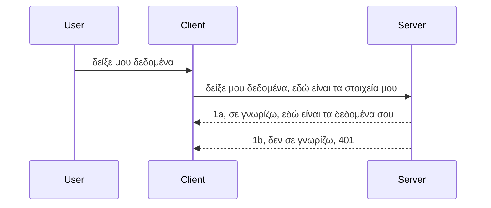

# Απλή αυθεντικοποίηση

Τα MCP SDKs υποστηρίζουν τη χρήση του OAuth 2.1 το οποίο, για να είμαστε ειλικρινείς, είναι μια αρκετά περίπλοκη διαδικασία που περιλαμβάνει έννοιες όπως auth server, resource server, αποστολή στοιχείων αυθεντικοποίησης, απόκτηση κωδικού, ανταλλαγή του κωδικού για ένα bearer token μέχρι να μπορέσετε τελικά να πάρετε τα δεδομένα πόρων σας. Εάν δεν είστε εξοικειωμένοι με το OAuth που είναι μια εξαιρετική μέθοδος για υλοποίηση, είναι καλή ιδέα να ξεκινήσετε με κάποιο βασικό επίπεδο αυθεντικοποίησης και να προχωρήσετε προοδευτικά σε καλύτερη και καλύτερη ασφάλεια. Γι' αυτό υπάρχει αυτό το κεφάλαιο, για να σας χτίσει προς πιο προχωρημένη αυθεντικοποίηση.

## Αυθεντικοποίηση, τι εννοούμε;

Το auth είναι συντομογραφία για authentication και authorization. Η ιδέα είναι ότι πρέπει να κάνουμε δύο πράγματα:

- **Authentication**, που είναι η διαδικασία για να διαπιστώσουμε αν θα αφήσουμε ένα άτομο να μπει στο σπίτι μας, ότι έχει το δικαίωμα να είναι "εδώ", δηλαδή να έχει πρόσβαση στον resource server μας όπου ζουν τα χαρακτηριστικά του MCP Server μας.
- **Authorization**, είναι η διαδικασία του να διαπιστώσουμε αν ένας χρήστης πρέπει να έχει πρόσβαση σε αυτούς τους συγκεκριμένους πόρους που ζητά, για παράδειγμα αυτές οι παραγγελίες ή αυτά τα προϊόντα ή αν επιτρέπεται να διαβάσει το περιεχόμενο αλλά όχι να διαγράψει όπως σε ένα άλλο παράδειγμα.

## Διαπιστευτήρια: πώς λέμε στο σύστημα ποιοι είμαστε

Λοιπόν, οι περισσότεροι web developers εκεί έξω ξεκινούν να σκέφτονται με όρους παροχής ενός διαπιστευτηρίου στον server, συνήθως ένα μυστικό που λέει αν επιτρέπεται να είναι εδώ ("Authentication"). Αυτό το διαπιστευτήριο συνήθως είναι μια έκδοση κωδικοποιημένη σε base64 του ονόματος χρήστη και κωδικού πρόσβασης ή ένα API key που ταυτοποιεί μοναδικά έναν συγκεκριμένο χρήστη.

Αυτό περιλαμβάνει την αποστολή του μέσω μιας επικεφαλίδας που λέγεται "Authorization" ως εξής:

```json
{ "Authorization": "secret123" }
```

Αυτό συνήθως αναφέρεται ως βασική αυθεντικοποίηση (basic authentication). Πώς λειτουργεί συνολικά η ροή είναι ως εξής:


Τώρα που καταλαβαίνουμε πώς λειτουργεί από άποψη ροής, πώς το υλοποιούμε; Λοιπόν, οι περισσότεροι web servers έχουν την έννοια του middleware, ένα κομμάτι κώδικα που τρέχει ως μέρος του αιτήματος και μπορεί να επαληθεύσει τα διαπιστευτήρια, και αν είναι έγκυρα να αφήσει το αίτημα να περάσει. Αν το αίτημα δεν έχει έγκυρα διαπιστευτήρια, τότε παίρνεις ένα σφάλμα αυθεντικοποίησης. Ας δούμε πώς μπορεί να υλοποιηθεί αυτό:

**Python**

```python
class AuthMiddleware(BaseHTTPMiddleware):
    async def dispatch(self, request, call_next):

        has_header = request.headers.get("Authorization")
        if not has_header:
            print("-> Missing Authorization header!")
            return Response(status_code=401, content="Unauthorized")

        if not valid_token(has_header):
            print("-> Invalid token!")
            return Response(status_code=403, content="Forbidden")

        print("Valid token, proceeding...")
       
        response = await call_next(request)
        # προσθέστε οποιεσδήποτε κεφαλίδες πελατών ή αλλάξτε την απόκριση με κάποιο τρόπο
        return response


starlette_app.add_middleware(CustomHeaderMiddleware)
```

Εδώ έχουμε:

- Δημιουργήσει ένα middleware που ονομάζεται `AuthMiddleware` όπου καλείται η μέθοδος `dispatch` από τον web server.
- Προσθέσει το middleware στον web server:

    ```python
    starlette_app.add_middleware(AuthMiddleware)
    ```

- Γράψει λογική επικύρωσης που ελέγχει αν υπάρχει η επικεφαλίδα Authorization και αν το αποστελλόμενο μυστικό είναι έγκυρο:

    ```python
    has_header = request.headers.get("Authorization")
    if not has_header:
        print("-> Missing Authorization header!")
        return Response(status_code=401, content="Unauthorized")

    if not valid_token(has_header):
        print("-> Invalid token!")
        return Response(status_code=403, content="Forbidden")
    ```

    αν το μυστικό υπάρχει και είναι έγκυρο, τότε αφήνουμε το αίτημα να περάσει καλώντας το `call_next` και επιστρέφοντας την απόκριση.

    ```python
    response = await call_next(request)
    # προσθέστε οποιεσδήποτε κεφαλίδες πελατών ή αλλάξτε με κάποιο τρόπο την απόκριση
    return response
    ```

Πώς λειτουργεί: αν γίνει ένα web request προς τον server, το middleware θα κληθεί και με βάση την υλοποίησή του θα αφήσει είτε το αίτημα να περάσει είτε θα επιστρέψει ένα σφάλμα που δείχνει ότι ο client δεν επιτρέπεται να προχωρήσει.

**TypeScript**

Εδώ δημιουργούμε middleware με το δημοφιλές framework Express και παρεμβαίνουμε στο αίτημα πριν φτάσει στον MCP Server. Να ο κώδικας:

```typescript
function isValid(secret) {
    return secret === "secret123";
}

app.use((req, res, next) => {
    // 1. Υπάρχει κεφαλίδα εξουσιοδότησης;
    if(!req.headers["Authorization"]) {
        res.status(401).send('Unauthorized');
    }
    
    let token = req.headers["Authorization"];

    // 2. Έλεγχος εγκυρότητας.
    if(!isValid(token)) {
        res.status(403).send('Forbidden');
    }

   
    console.log('Middleware executed');
    // 3. Μεταβιβάζει το αίτημα στο επόμενο βήμα της ροής αιτήματος.
    next();
});
```

Σε αυτόν τον κώδικα:

1. Ελέγχουμε αν υπάρχει η επικεφαλίδα Authorization, και αν όχι, στέλνουμε σφάλμα 401.
2. Επιβεβαιώνουμε ότι το διαπιστευτήριο/token είναι έγκυρο και αν όχι, στέλνουμε σφάλμα 403.
3. Τέλος, περνάμε το αίτημα στη σωλήνωση αιτημάτων και επιστρέφεται ο ζητούμενος πόρος.

## Άσκηση: Υλοποίηση αυθεντικοποίησης

Ας πάρουμε τις γνώσεις μας και ας προσπαθήσουμε να το υλοποιήσουμε. Το σχέδιο:

Server

- Δημιουργία web server και instance MCP.
- Υλοποίηση middleware για τον server.

Client

- Αποστολή web request, με διαπιστευτήριο, μέσω επικεφαλίδας.

### -1- Δημιουργία web server και instance MCP

Στο πρώτο βήμα, πρέπει να δημιουργήσουμε την instance του web server και τον MCP Server.

**Python**

Εδώ δημιουργούμε μια instance MCP Server, δημιουργούμε μια starlette web app και τη φιλοξενούμε με uvicorn.

```python
# δημιουργία διακομιστή MCP

app = FastMCP(
    name="MCP Resource Server",
    instructions="Resource Server that validates tokens via Authorization Server introspection",
    host=settings["host"],
    port=settings["port"],
    debug=True
)

# δημιουργία εφαρμογής ιστού starlette
starlette_app = app.streamable_http_app()

# εξυπηρέτηση εφαρμογής μέσω uvicorn
async def run(starlette_app):
    import uvicorn
    config = uvicorn.Config(
            starlette_app,
            host=app.settings.host,
            port=app.settings.port,
            log_level=app.settings.log_level.lower(),
        )
    server = uvicorn.Server(config)
    await server.serve()

run(starlette_app)
```

Σ’ αυτόν τον κώδικα:

- Δημιουργούμε τον MCP Server.
- Κατασκευάζουμε τη starlette web app από τον MCP Server, `app.streamable_http_app()`.
- Φιλοξενούμε και σερβίρουμε την web app με το uvicorn `server.serve()`.

**TypeScript**

Εδώ δημιουργούμε μια instance MCP Server.

```typescript
const server = new McpServer({
      name: "example-server",
      version: "1.0.0"
    });

    // ... προετοιμάστε πόρους διακομιστή, εργαλεία και προτροπές ...
```

Αυτή η δημιουργία MCP Server πρέπει να γίνει μέσα στον ορισμό της διαδρομής POST /mcp, οπότε παίρνουμε τον παραπάνω κώδικα και τον μετακινούμε ως εξής:

```typescript
import express from "express";
import { randomUUID } from "node:crypto";
import { McpServer } from "@modelcontextprotocol/sdk/server/mcp.js";
import { StreamableHTTPServerTransport } from "@modelcontextprotocol/sdk/server/streamableHttp.js";
import { isInitializeRequest } from "@modelcontextprotocol/sdk/types.js"

const app = express();
app.use(express.json());

// Χάρτης για αποθήκευση μεταφορών κατά ταυτότητα περιόδου
const transports: { [sessionId: string]: StreamableHTTPServerTransport } = {};

// Διαχείριση αιτήσεων POST για επικοινωνία πελάτη-διακομιστή
app.post('/mcp', async (req, res) => {
  // Έλεγχος για υπάρχουσα ταυτότητα περιόδου
  const sessionId = req.headers['mcp-session-id'] as string | undefined;
  let transport: StreamableHTTPServerTransport;

  if (sessionId && transports[sessionId]) {
    // Επαναχρησιμοποίηση υπάρχουσας μεταφοράς
    transport = transports[sessionId];
  } else if (!sessionId && isInitializeRequest(req.body)) {
    // Νέα αίτηση αρχικοποίησης
    transport = new StreamableHTTPServerTransport({
      sessionIdGenerator: () => randomUUID(),
      onsessioninitialized: (sessionId) => {
        // Αποθήκευση της μεταφοράς κατά ταυτότητα περιόδου
        transports[sessionId] = transport;
      },
      // Η προστασία από DNS rebinding είναι απενεργοποιημένη από προεπιλογή για συμβατότητα με παλαιότερες εκδόσεις. Αν τρέχετε αυτόν τον διακομιστή
      // τοπικά, βεβαιωθείτε ότι έχετε ορίσει:
      // enableDnsRebindingProtection: true,
      // allowedHosts: ['127.0.0.1'],
    });

    // Καθαρισμός της μεταφοράς όταν κλείσει
    transport.onclose = () => {
      if (transport.sessionId) {
        delete transports[transport.sessionId];
      }
    };
    const server = new McpServer({
      name: "example-server",
      version: "1.0.0"
    });

    // ... ρύθμιση πόρων, εργαλείων και προτροπών διακομιστή ...

    // Σύνδεση με τον MCP διακομιστή
    await server.connect(transport);
  } else {
    // Μη έγκυρο αίτημα
    res.status(400).json({
      jsonrpc: '2.0',
      error: {
        code: -32000,
        message: 'Bad Request: No valid session ID provided',
      },
      id: null,
    });
    return;
  }

  // Διαχείριση του αιτήματος
  await transport.handleRequest(req, res, req.body);
});

// Επαναχρησιμοποιήσιμος χειριστής για αιτήματα GET και DELETE
const handleSessionRequest = async (req: express.Request, res: express.Response) => {
  const sessionId = req.headers['mcp-session-id'] as string | undefined;
  if (!sessionId || !transports[sessionId]) {
    res.status(400).send('Invalid or missing session ID');
    return;
  }
  
  const transport = transports[sessionId];
  await transport.handleRequest(req, res);
};

// Διαχείριση αιτήσεων GET για ειδοποιήσεις διακομιστή-προς-πελάτη μέσω SSE
app.get('/mcp', handleSessionRequest);

// Διαχείριση αιτήσεων DELETE για τερματισμό περιόδου
app.delete('/mcp', handleSessionRequest);

app.listen(3000);
```

Τώρα βλέπετε πώς η δημιουργία MCP Server μεταφέρθηκε μέσα στο `app.post("/mcp")`.

Προχωράμε στο επόμενο βήμα της δημιουργίας του middleware για να επικυρώσουμε το εισερχόμενο διαπιστευτήριο.

### -2- Υλοποίηση middleware για τον server

Πάμε στην ενότητα middleware τώρα. Εδώ θα δημιουργήσουμε ένα middleware που ψάχνει για διαπιστευτήριο στην επικεφαλίδα `Authorization` και την επικυρώνει. Αν είναι αποδεκτό, τότε το αίτημα θα προχωρήσει ώστε να κάνει αυτό που πρέπει (π.χ. λίστα εργαλείων, ανάγνωση πόρου ή ό,τι άλλο λειτουργικότητα MCP ζήτησε ο client).

**Python**

Για να δημιουργήσουμε το middleware, πρέπει να δημιουργήσουμε μια κλάση που κληρονομεί από το `BaseHTTPMiddleware`. Υπάρχουν δύο ενδιαφέροντα μέρη:

- Το αίτημα `request`, από το οποίο διαβάζουμε τις πληροφορίες της επικεφαλίδας.
- Το `call_next` το callback που πρέπει να καλέσουμε αν ο client έφερε διαπιστευτήριο που αποδεχόμαστε.

Αρχικά, πρέπει να χειριστούμε την περίπτωση που λείπει η επικεφαλίδα `Authorization`:

```python
has_header = request.headers.get("Authorization")

# δεν υπάρχει κεφαλίδα, αποτυχία με 401, αλλιώς προχώρησε.
if not has_header:
    print("-> Missing Authorization header!")
    return Response(status_code=401, content="Unauthorized")
```

Εδώ στέλνουμε μήνυμα 401 unauthorized καθώς ο client αποτυγχάνει στην αυθεντικοποίηση.

Έπειτα, αν υποβλήθηκε διαπιστευτήριο, ελέγχουμε την εγκυρότητά του ως εξής:

```python
 if not valid_token(has_header):
    print("-> Invalid token!")
    return Response(status_code=403, content="Forbidden")
```

Παρατηρήστε πώς στέλνουμε μήνυμα 403 forbidden παραπάνω. Ας δούμε το πλήρες middleware παρακάτω που υλοποιεί όλα όσα αναφέραμε:

```python
class AuthMiddleware(BaseHTTPMiddleware):
    async def dispatch(self, request, call_next):

        has_header = request.headers.get("Authorization")
        if not has_header:
            print("-> Missing Authorization header!")
            return Response(status_code=401, content="Unauthorized")

        if not valid_token(has_header):
            print("-> Invalid token!")
            return Response(status_code=403, content="Forbidden")

        print("Valid token, proceeding...")
        print(f"-> Received {request.method} {request.url}")
        response = await call_next(request)
        response.headers['Custom'] = 'Example'
        return response

```

Υπέροχα, αλλά τι γίνεται με τη συνάρτηση `valid_token`; Να την εδώ:

```python
# ΜΗΝ το χρησιμοποιείτε για παραγωγή - βελτιώστε το !!
def valid_token(token: str) -> bool:
    # αφαιρέστε το πρόθεμα "Bearer "
    if token.startswith("Bearer "):
        token = token[7:]
        return token == "secret-token"
    return False
```

Προφανώς αυτό πρέπει να βελτιωθεί.

ΣΗΜΑΝΤΙΚΟ: Δεν πρέπει ΠΟΤΕ να έχετε μυστικά μέσα στον κώδικα. Ιδανικά πρέπει να παίρνετε την τιμή με την οποία συγκρίνετε από μια πηγή δεδομένων ή από έναν IDP (πάροχο ταυτότητας) ή ακόμα καλύτερα, να αφήνετε τον IDP να κάνει την επικύρωση.

**TypeScript**

Για να το υλοποιήσετε με Express, πρέπει να καλέσετε τη μέθοδο `use` που παίρνει middleware συναρτήσεις.

Χρειάζεται να:

- Αλληλεπιδράσετε με τη μεταβλητή request για να ελέγξετε το διαπιστευτήριο που πέρασε στην ιδιότητα `Authorization`.
- Επικυρώσετε το διαπιστευτήριο και αν είναι σωστό, να αφήσετε το αίτημα να συνεχίσει και το αίτημα MCP του client να κάνει αυτό που πρέπει (π.χ. λίστα εργαλείων, ανάγνωση πόρου ή ό,τι σχετίζεται με MCP).

Εδώ ελέγχουμε αν η επικεφαλίδα `Authorization` υπάρχει, και αν όχι, σταματάμε το αίτημα:

```typescript
if(!req.headers["authorization"]) {
    res.status(401).send('Unauthorized');
    return;
}
```

Αν η επικεφαλίδα δεν σταλεί, παίρνεις σφάλμα 401.

Έπειτα, ελέγχουμε αν το διαπιστευτήριο είναι έγκυρο, αν όχι ξανασταματάμε το αίτημα αλλά με διαφορετικό μήνυμα:

```typescript
if(!isValid(token)) {
    res.status(403).send('Forbidden');
    return;
} 
```

Βλέπετε ότι τώρα παίρνετε σφάλμα 403.

Ο πλήρης κώδικας:

```typescript
app.use((req, res, next) => {
    console.log('Request received:', req.method, req.url, req.headers);
    console.log('Headers:', req.headers["authorization"]);
    if(!req.headers["authorization"]) {
        res.status(401).send('Unauthorized');
        return;
    }
    
    let token = req.headers["authorization"];

    if(!isValid(token)) {
        res.status(403).send('Forbidden');
        return;
    }  

    console.log('Middleware executed');
    next();
});
```

Έχουμε στήσει τον web server να δέχεται middleware για να ελέγχει το διαπιστευτήριο που ελπίζουμε να μας στέλνει ο client. Τι γίνεται με τον ίδιο τον client;

### -3- Αποστολή web request με διαπιστευτήριο μέσω επικεφαλίδας

Πρέπει να διασφαλίσουμε ότι ο client περνάει το διαπιστευτήριο μέσω της επικεφαλίδας. Εφόσον θα χρησιμοποιήσουμε έναν MCP client για αυτό, πρέπει να βρούμε πώς γίνεται.

**Python**

Για τον client, πρέπει να περάσουμε μια επικεφαλίδα με το διαπιστευτήριό μας ως εξής:

```python
# ΜΗΝ κωδικοποιείτε σκληρά την τιμή, τουλάχιστον να την έχετε σε μια μεταβλητή περιβάλλοντος ή σε πιο ασφαλή αποθήκευση
token = "secret-token"

async with streamablehttp_client(
        url = f"http://localhost:{port}/mcp",
        headers = {"Authorization": f"Bearer {token}"}
    ) as (
        read_stream,
        write_stream,
        session_callback,
    ):
        async with ClientSession(
            read_stream,
            write_stream
        ) as session:
            await session.initialize()
      
            # ΣΕ ΥΠΟΜΝΗΜΣΗ, τι θέλετε να γίνει στον πελάτη, π.χ. λίστα εργαλείων, κλήση εργαλείων κτλ.
```

Παρατηρήστε πώς γεμίζουμε την ιδιότητα `headers` ως ` headers = {"Authorization": f"Bearer {token}"}`.

**TypeScript**

Μπορούμε να το λύσουμε σε δύο βήματα:

1. Γεμίζουμε ένα αντικείμενο ρυθμίσεων (configuration) με το διαπιστευτήριο.
2. Περνάμε το αντικείμενο ρυθμίσεων στο transport.

```typescript

// ΜΗΝ καθορίζετε σκληρά την τιμή όπως φαίνεται εδώ. Τουλάχιστον να είναι μια μεταβλητή περιβάλλοντος και να χρησιμοποιείτε κάτι σαν το dotenv (σε λειτουργία ανάπτυξης).
let token = "secret123"

// ορίστε ένα αντικείμενο επιλογών μεταφοράς πελάτη
let options: StreamableHTTPClientTransportOptions = {
  sessionId: sessionId,
  requestInit: {
    headers: {
      "Authorization": "secret123"
    }
  }
};

// περάστε το αντικείμενο επιλογών στη μεταφορά
async function main() {
   const transport = new StreamableHTTPClientTransport(
      new URL(serverUrl),
      options
   );
```

Εδώ βλέπετε πως δημιουργήσαμε ένα αντικείμενο `options` και βάλαμε τα headers κάτω από την ιδιότητα `requestInit`.

ΣΗΜΑΝΤΙΚΟ: Πώς το βελτιώνουμε από εδώ και πέρα; Η τρέχουσα υλοποίηση έχει προβλήματα. Πρώτον, η αποστολή διαπιστευτηρίου έτσι είναι αρκετά ριψοκίνδυνη εκτός αν έχετε έστω HTTPS. Ακόμα και τότε, το διαπιστευτήριο μπορεί να κλαπεί οπότε χρειάζεστε ένα σύστημα που να σας επιτρέπει εύκολα να ανακαλέσετε το token και να προσθέσετε επιπλέον ελέγχους όπως από πού προέρχεται στον κόσμο, αν το αίτημα γίνεται πολύ συχνά (συμπεριφορά bot), συνοπτικά, υπάρχουν πολλά θέματα ασφάλειας.

Πρέπει να ειπωθεί, πάντως, ότι για πολύ απλά APIs όπου δεν θέλετε να καλεί κανείς την API σας χωρίς να είναι αυθεντικοποιημένος και αυτό που έχουμε εδώ είναι μια καλή αρχή.

Με αυτά τα δεδομένα, ας προσπαθήσουμε να ενισχύσουμε την ασφάλεια λίγο χρησιμοποιώντας ένα τυποποιημένο φορμά όπως το JSON Web Token, γνωστό και ως JWT ή "JOT" tokens.

## JSON Web Tokens, JWT

Λοιπόν, προσπαθούμε να βελτιώσουμε τα πράγματα από το να στέλνουμε πολύ απλά διαπιστευτήρια. Ποια είναι τα άμεσα οφέλη που έχουμε υιοθετώντας JWT;

- **Βελτιώσεις ασφάλειας**. Στην βασική αυθεντικοποίηση, στέλνεις συνέχεια το όνομα χρήστη και password ως base64 κωδικοποιημένο token (ή API key) που αυξάνει τον κίνδυνο. Με JWT, στέλνεις όνομα χρήστη και κωδικό και παίρνεις token ως αντάλλαγμα που έχει και χρονικό περιορισμό, δηλαδή λήγει. Το JWT επιτρέπει εύκολα λεπτομερή έλεγχο πρόσβασης με roles, scopes και permissions.
- **Ανεξαρτησία κατάστασης και κλιμάκωση**. Τα JWT είναι αυτοτελή, περιέχουν όλες τις πληροφορίες χρήστη και εξαφανίζουν την ανάγκη αποθήκευσης φακέλων συνεδρίας από τον server. Το token μπορεί να επικυρωθεί τοπικά.
- **Διαλειτουργικότητα και ομοσπονδία**. Το JWT είναι κεντρικό μέρος του Open ID Connect και χρησιμοποιείται με γνωστούς παρόχους ταυτότητας όπως Entra ID, Google Identity και Auth0. Επιτρέπει επίσης single sign on και πολλά περισσότερα, κάνοντάς το κατάλληλο για επιχειρηματική χρήση.
- **Ευελιξία και modularity**. Τα JWT μπορούν επίσης να χρησιμοποιηθούν με API Gateways όπως Azure API Management, NGINX και άλλα. Υποστηρίζει σενάρια αυθεντικοποίησης και επικοινωνίας server-προς-service, συμπεριλαμβανομένου impersonation και delegation.
- **Απόδοση και caching**. Τα JWT μπορούν να αποθηκευτούν στην cache μετά την αποκωδικοποίηση, μειώνοντας την ανάγκη επεξεργασίας. Αυτό βοηθάει ειδικά σε εφαρμογές με μεγάλο φόρτο, καθώς βελτιώνει τη διανομή φορτίου και μειώνει το load στην υποδομή.
- **Προηγμένα χαρακτηριστικά**. Υποστηρίζει introspection (έλεγχος εγκυρότητας στον server) και revocation (άκυροποίηση token).

Με όλα αυτά τα οφέλη, ας δούμε πώς μπορούμε να προχωρήσουμε την υλοποίησή μας στο επόμενο επίπεδο.

## Μετατροπή από basic auth σε JWT

Άρα, οι αλλαγές που πρέπει να κάνουμε σε γενικές γραμμές είναι:

- **Μάθε να κατασκευάζεις JWT token** και να το προετοιμάζεις για αποστολή από client σε server.
- **Επικύρωση JWT token**, και αν είναι σωστό, να αφήσεις τον client να πάρει τους πόρους μας.
- **Ασφαλής αποθήκευση token**. Πώς αποθηκεύουμε αυτό το token.
- **Προστασία διαδρομών**. Πρέπει να προστατεύσουμε τις διαδρομές, στην περίπτωσή μας συγκεκριμένες MCP λειτουργίες.
- **Προσθήκη refresh tokens**. Διασφάλιση ότι δημιουργούμε tokens βραχυχρόνιας ισχύος αλλά έχουμε και refresh tokens μακροχρόνιας, που μπορούν να χρησιμοποιηθούν για να προμηθευτούμε νέα αν λήξουν. Επίσης να υπάρχει endpoint για refresh και στρατηγική rotation.

### -1- Κατασκευή JWT token

Καταρχάς, ένα JWT token αποτελείται από τα εξής μέρη:

- **header**, ο αλγόριθμος που χρησιμοποιείται και τύπος token.
- **payload**, claims, όπως sub (ο χρήστης ή ο οντότητα που αντιπροσωπεύει το token, συνήθως το userid), exp (πότε λήγει), role (ο ρόλος)
- **signature**, υπογεγραμμένο με μυστικό κλειδί ή ιδιωτικό κλειδί.

Γι' αυτό, πρέπει να κατασκευάσουμε το header, το payload και το κωδικοποιημένο token.

**Python**

```python

import jwt
import jwt
from jwt.exceptions import ExpiredSignatureError, InvalidTokenError
import datetime

# Μυστικό κλειδί που χρησιμοποιείται για την υπογραφή του JWT
secret_key = 'your-secret-key'

header = {
    "alg": "HS256",
    "typ": "JWT"
}

# οι πληροφορίες χρήστη και οι ισχυρισμοί και ο χρόνος λήξης του
payload = {
    "sub": "1234567890",               # Θέμα (ταυτότητα χρήστη)
    "name": "User Userson",                # Προσαρμοσμένος ισχυρισμός
    "admin": True,                     # Προσαρμοσμένος ισχυρισμός
    "iat": datetime.datetime.utcnow(),# Εκδόθηκε στις
    "exp": datetime.datetime.utcnow() + datetime.timedelta(hours=1)  # Λήξη
}

# κωδικοποίηση αυτού
encoded_jwt = jwt.encode(payload, secret_key, algorithm="HS256", headers=header)
```

Στον παραπάνω κώδικα έχουμε:

- Ορίσει header με αλγόριθμο HS256 και τύπο JWT.
- Κατασκευάσει payload που περιέχει ένα subject ή user id, όνομα χρήστη, ρόλο, πότε εκδόθηκε και πότε λήγει, υλοποιώντας δηλαδή τον χρονικό περιορισμό που αναφέραμε.

**TypeScript**

Εδώ χρειαζόμαστε κάποιες εξαρτήσεις που θα βοηθήσουν στην κατασκευή JWT token.

Εξαρτήσεις:

```sh

npm install jsonwebtoken
npm install --save-dev @types/jsonwebtoken
```

Τώρα που τις έχουμε, ας δημιουργήσουμε header, payload και μέσω αυτών το κωδικοποιημένο token.

```typescript
import jwt from 'jsonwebtoken';

const secretKey = 'your-secret-key'; // Χρησιμοποιήστε μεταβλητές περιβάλλοντος στην παραγωγή

// Ορίστε το περιεχόμενο του μηνύματος
const payload = {
  sub: '1234567890',
  name: 'User usersson',
  admin: true,
  iat: Math.floor(Date.now() / 1000), // Εκδόθηκε στις
  exp: Math.floor(Date.now() / 1000) + 60 * 60 // Λήγει σε 1 ώρα
};

// Ορίστε την κεφαλίδα (προαιρετικό, το jsonwebtoken ορίζει προεπιλογές)
const header = {
  alg: 'HS256',
  typ: 'JWT'
};

// Δημιουργήστε το διακριτικό
const token = jwt.sign(payload, secretKey, {
  algorithm: 'HS256',
  header: header
});

console.log('JWT:', token);
```

Αυτό το token:

Υπογράφεται με HS256  
Ισχύει για 1 ώρα  
Περιλαμβάνει claims όπως sub, name, admin, iat, και exp.

### -2- Επικύρωση token

Θα πρέπει επίσης να επικυρώνουμε το token, κάτι που πρέπει να γίνεται στον server για να διασφαλίσουμε ότι αυτό που στέλνει ο client είναι έγκυρο. Υπάρχουν πολλοί έλεγχοι που πρέπει να κάνουμε από την επικύρωση της δομής μέχρι την εγκυρότητα. Επίσης, ενθαρρύνεστε να προσθέσετε άλλους ελέγχους για να δείτε αν ο χρήστης υπάρχει στο σύστημά σας και άλλα.

Για να επικυρώσουμε το token, πρέπει να το αποκωδικοποιήσουμε ώστε να το διαβάσουμε και μετά να ξεκινήσουμε τους ελέγχους εγκυρότητας:

**Python**

```python

# Αποκωδικοποιήστε και επαληθεύστε το JWT
try:
    decoded = jwt.decode(token, secret_key, algorithms=["HS256"])
    print("✅ Token is valid.")
    print("Decoded claims:")
    for key, value in decoded.items():
        print(f"  {key}: {value}")
except ExpiredSignatureError:
    print("❌ Token has expired.")
except InvalidTokenError as e:
    print(f"❌ Invalid token: {e}")

```

Σε αυτόν τον κώδικα καλούμε `jwt.decode` με το token, το μυστικό κλειδί και τον επιλεγμένο αλγόριθμο ως είσοδο. Παρατηρήστε πώς χρησιμοποιούμε try-catch καθώς αποτυχημένη επικύρωση οδηγεί σε λάθος που υψώνεται.

**TypeScript**

Εδώ πρέπει να καλέσουμε `jwt.verify` για να λάβουμε ένα αποκωδικοποιημένο version του token που μπορούμε να αναλύσουμε παραπέρα. Αν αυτή η κλήση αποτύχει, σημαίνει ότι η δομή του token είναι λάθος ή δεν είναι πια έγκυρο.

```typescript

try {
  const decoded = jwt.verify(token, secretKey);
  console.log('Decoded Payload:', decoded);
} catch (err) {
  console.error('Token verification failed:', err);
}
```

ΣΗΜΕΙΩΣΗ: όπως αναφέρθηκε και προηγουμένως, θα πρέπει να κάνουμε επιπρόσθετους ελέγχους για να βεβαιωθούμε ότι το token δείχνει σε χρήστη στο σύστημά μας και ότι ο χρήστης έχει τα δικαιώματα που δηλώνει.

Έπειτα, ας δούμε τον έλεγχο πρόσβασης βάσει ρόλων, γνωστό και ως RBAC.
## Προσθήκη έλεγχου πρόσβασης βασισμένου σε ρόλους

Η ιδέα είναι ότι θέλουμε να εκφράσουμε πως διαφορετικοί ρόλοι έχουν διαφορετικά δικαιώματα. Για παράδειγμα, υποθέτουμε ότι ένας διαχειριστής μπορεί να κάνει τα πάντα, ένας απλός χρήστης μπορεί να διαβάζει/γράφει και ένας επισκέπτης μπορεί να διαβάζει μόνο. Επομένως, εδώ είναι μερικά πιθανά επίπεδα δικαιωμάτων:

- Admin.Write 
- User.Read
- Guest.Read

Ας δούμε πώς μπορούμε να υλοποιήσουμε τέτοιο έλεγχο με μεσαία λογισμικά (middleware). Τα middleware μπορούν να προστεθούν ανά διαδρομή καθώς και για όλες τις διαδρομές.

**Python**

```python
from starlette.middleware.base import BaseHTTPMiddleware
from starlette.responses import JSONResponse
import jwt

# ΜΗΝ έχετε το μυστικό στον κώδικα όπως εδώ, αυτό είναι μόνο για σκοπούς επίδειξης. Διαβάστε το από ένα ασφαλές μέρος.
SECRET_KEY = "your-secret-key" # βάλτε το αυτό σε μεταβλητή περιβάλλοντος
REQUIRED_PERMISSION = "User.Read"

class JWTPermissionMiddleware(BaseHTTPMiddleware):
    async def dispatch(self, request, call_next):
        auth_header = request.headers.get("Authorization")
        if not auth_header or not auth_header.startswith("Bearer "):
            return JSONResponse({"error": "Missing or invalid Authorization header"}, status_code=401)

        token = auth_header.split(" ")[1]
        try:
            decoded = jwt.decode(token, SECRET_KEY, algorithms=["HS256"])
        except jwt.ExpiredSignatureError:
            return JSONResponse({"error": "Token expired"}, status_code=401)
        except jwt.InvalidTokenError:
            return JSONResponse({"error": "Invalid token"}, status_code=401)

        permissions = decoded.get("permissions", [])
        if REQUIRED_PERMISSION not in permissions:
            return JSONResponse({"error": "Permission denied"}, status_code=403)

        request.state.user = decoded
        return await call_next(request)


```

Υπάρχουν μερικοί διαφορετικοί τρόποι να προσθέσουμε το middleware όπως παρακάτω:

```python

# Εναλλακτική 1: προσθέστε μεσαίο λογισμικό κατά την κατασκευή της εφαρμογής starlette
middleware = [
    Middleware(JWTPermissionMiddleware)
]

app = Starlette(routes=routes, middleware=middleware)

# Εναλλακτική 2: προσθέστε μεσαίο λογισμικό αφού η εφαρμογή starlette έχει ήδη κατασκευαστεί
starlette_app.add_middleware(JWTPermissionMiddleware)

# Εναλλακτική 3: προσθέστε μεσαίο λογισμικό ανά διαδρομή
routes = [
    Route(
        "/mcp",
        endpoint=..., # χειριστής
        middleware=[Middleware(JWTPermissionMiddleware)]
    )
]
```

**TypeScript**

Μπορούμε να χρησιμοποιήσουμε το `app.use` και ένα middleware που θα εκτελείται για όλα τα αιτήματα.

```typescript
app.use((req, res, next) => {
    console.log('Request received:', req.method, req.url, req.headers);
    console.log('Headers:', req.headers["authorization"]);

    // 1. Ελέγξτε αν το κεφαλίδα εξουσιοδότησης έχει αποσταλεί

    if(!req.headers["authorization"]) {
        res.status(401).send('Unauthorized');
        return;
    }
    
    let token = req.headers["authorization"];

    // 2. Ελέγξτε αν το διακριτικό είναι έγκυρο
    if(!isValid(token)) {
        res.status(403).send('Forbidden');
        return;
    }  

    // 3. Ελέγξτε αν ο χρήστης του διακριτικού υπάρχει στο σύστημά μας
    if(!isExistingUser(token)) {
        res.status(403).send('Forbidden');
        console.log("User does not exist");
        return;
    }
    console.log("User exists");

    // 4. Επαληθεύστε ότι το διακριτικό έχει τα σωστά δικαιώματα
    if(!hasScopes(token, ["User.Read"])){
        res.status(403).send('Forbidden - insufficient scopes');
    }

    console.log("User has required scopes");

    console.log('Middleware executed');
    next();
});

```

Υπάρχουν αρκετά πράγματα που μπορούμε να επιτρέψουμε να κάνει το middleware μας και που ΘΑ ΠΡΕΠΕΙ να κάνει, συγκεκριμένα:

1. Έλεγχος αν υπάρχει το πεδίο εξουσιοδότησης (authorization header)
2. Έλεγχος αν το token είναι έγκυρο, καλούμε το `isValid` που είναι μια μέθοδος που γράψαμε και ελέγχει την ακεραιότητα και εγκυρότητα του JWT token.
3. Επαλήθευση ότι ο χρήστης υπάρχει στο σύστημά μας, πρέπει να το ελέγξουμε.

   ```typescript
    // χρήστες στη βάση δεδομένων
   const users = [
     "user1",
     "User usersson",
   ]

   function isExistingUser(token) {
     let decodedToken = verifyToken(token);

     // TODO, έλεγχος αν ο χρήστης υπάρχει στη βάση δεδομένων
     return users.includes(decodedToken?.name || "");
   }
   ```

   Παραπάνω, δημιουργήσαμε μια πολύ απλή λίστα `users`, η οποία προφανώς θα πρέπει να βρίσκεται σε βάση δεδομένων.

4. Επιπλέον, πρέπει επίσης να ελέγξουμε ότι το token έχει τα σωστά δικαιώματα.

   ```typescript
   if(!hasScopes(token, ["User.Read"])){
        res.status(403).send('Forbidden - insufficient scopes');
   }
   ```

   Σε αυτόν τον κώδικα από το middleware, ελέγχουμε ότι το token περιέχει το δικαίωμα User.Read, αν όχι στέλνουμε σφάλμα 403. Παρακάτω είναι η βοηθητική μέθοδος `hasScopes`.

   ```typescript
   function hasScopes(scope: string, requiredScopes: string[]) {
     let decodedToken = verifyToken(scope);
    return requiredScopes.every(scope => decodedToken?.scopes.includes(scope));
  }
   ```

Have a think which additional checks you should be doing, but these are the absolute minimum of checks you should be doing.

Using Express as a web framework is a common choice. There are helpers library when you use JWT so you can write less code.

- `express-jwt`, helper library that provides a middleware that helps decode your token.
- `express-jwt-permissions`, this provides a middleware `guard` that helps check if a certain permission is on the token.

Here's what these libraries can look like when used:

```typescript
const express = require('express');
const jwt = require('express-jwt');
const guard = require('express-jwt-permissions')();

const app = express();
const secretKey = 'your-secret-key'; // put this in env variable

// Decode JWT and attach to req.user
app.use(jwt({ secret: secretKey, algorithms: ['HS256'] }));

// Check for User.Read permission
app.use(guard.check('User.Read'));

// multiple permissions
// app.use(guard.check(['User.Read', 'Admin.Access']));

app.get('/protected', (req, res) => {
  res.json({ message: `Welcome ${req.user.name}` });
});

// Error handler
app.use((err, req, res, next) => {
  if (err.code === 'permission_denied') {
    return res.status(403).send('Forbidden');
  }
  next(err);
});

```

Τώρα που είδατε πώς το middleware μπορεί να χρησιμοποιηθεί τόσο για ταυτοποίηση όσο και για εξουσιοδότηση, τι γίνεται όμως με το MCP, αλλάζει ο τρόπος που κάνουμε την αυθεντικοποίηση; Ας το ανακαλύψουμε στην επόμενη ενότητα.

### -3- Προσθήκη RBAC στο MCP

Έχετε δει μέχρι τώρα πώς μπορείτε να προσθέσετε RBAC μέσω middleware, ωστόσο, για το MCP δεν υπάρχει εύκολος τρόπος να προσθέσουμε RBAC ανά λειτουργία MCP, οπότε τι κάνουμε; Λοιπόν, απλώς πρέπει να προσθέσουμε κώδικα όπως αυτόν που ελέγχει στην περίπτωση αυτή αν ο πελάτης έχει τα δικαιώματα να καλέσει ένα συγκεκριμένο εργαλείο:

Έχετε μερικές διαφορετικές επιλογές για το πώς να υλοποιήσετε RBAC ανά λειτουργία, εδώ είναι μερικές:

- Προσθέστε έναν έλεγχο για κάθε εργαλείο, πόρο, προτροπή όπου χρειάζεται να ελέγξετε το επίπεδο δικαιωμάτων.

   **python**

   ```python
   @tool()
   def delete_product(id: int):
      try:
          check_permissions(role="Admin.Write", request)
      catch:
        pass # ο πελάτης απέτυχε στην εξουσιοδότηση, προκύπτει σφάλμα εξουσιοδότησης
   ```

   **typescript**

   ```typescript
   server.registerTool(
    "delete-product",
    {
      title: Delete a product",
      description: "Deletes a product",
      inputSchema: { id: z.number() }
    },
    async ({ id }) => {
      
      try {
        checkPermissions("Admin.Write", request);
        // να γίνει, στείλε το αναγνωριστικό στο productService και στην απομακρυσμένη είσοδο
      } catch(Exception e) {
        console.log("Authorization error, you're not allowed");  
      }

      return {
        content: [{ type: "text", text: `Deletected product with id ${id}` }]
      };
    }
   );
   ```


- Χρησιμοποιήστε προχωρημένη προσέγγιση server και τους χειριστές αιτημάτων έτσι ώστε να ελαχιστοποιήσετε πόσα σημεία πρέπει να κάνετε τον έλεγχο.

   **Python**

   ```python
   
   tool_permission = {
      "create_product": ["User.Write", "Admin.Write"],
      "delete_product": ["Admin.Write"]
   }

   def has_permission(user_permissions, required_permissions) -> bool:
      # user_permissions: λίστα με τα δικαιώματα που έχει ο χρήστης
      # required_permissions: λίστα με τα δικαιώματα που απαιτούνται για το εργαλείο
      return any(perm in user_permissions for perm in required_permissions)

   @server.call_tool()
   async def handle_call_tool(
     name: str, arguments: dict[str, str] | None
   ) -> list[types.TextContent]:
    # Υποθέστε ότι request.user.permissions είναι λίστα με δικαιώματα του χρήστη
     user_permissions = request.user.permissions
     required_permissions = tool_permission.get(name, [])
     if not has_permission(user_permissions, required_permissions):
        # Πετάξτε σφάλμα "Δεν έχετε δικαίωμα να καλέσετε το εργαλείο {name}"
        raise Exception(f"You don't have permission to call tool {name}")
     # συνεχίστε και καλέστε το εργαλείο
     # ...
   ```   
   

   **TypeScript**

   ```typescript
   function hasPermission(userPermissions: string[], requiredPermissions: string[]): boolean {
       if (!Array.isArray(userPermissions) || !Array.isArray(requiredPermissions)) return false;
       // Επιστρέφει true αν ο χρήστης έχει τουλάχιστον μία απαιτούμενη άδεια
       
       return requiredPermissions.some(perm => userPermissions.includes(perm));
   }
  
   server.setRequestHandler(CallToolRequestSchema, async (request) => {
      const { params: { name } } = request;
  
      let permissions = request.user.permissions;
  
      if (!hasPermission(permissions, toolPermissions[name])) {
         return new Error(`You don't have permission to call ${name}`);
      }
  
      // Συνέχισε..
   });
   ```

   Σημειώστε, ότι θα πρέπει να διασφαλίσετε πως το middleware σας αναθέτει το αποκωδικοποιημένο token στην ιδιότητα user του αιτήματος ώστε ο παραπάνω κώδικας να είναι απλός.

### Συνοψίζοντας

Τώρα που συζητήσαμε πώς να προσθέσουμε υποστήριξη για RBAC γενικά και για MCP ειδικά, είναι ώρα να προσπαθήσετε να υλοποιήσετε την ασφάλεια μόνοι σας για να σιγουρευτείτε ότι καταλάβατε τις έννοιες που σας παρουσιάστηκαν.

## Άσκηση 1: Δημιουργήστε έναν server MCP και client MCP χρησιμοποιώντας βασική αυθεντικοποίηση

Εδώ θα εφαρμόσετε αυτά που μάθατε σχετικά με την αποστολή διαπιστευτηρίων μέσω headers.

## Λύση 1

[Solution 1](./code/basic/README.md)

## Άσκηση 2: Αναβαθμίστε τη λύση από την Άσκηση 1 χρησιμοποιώντας JWT

Πάρτε την πρώτη λύση αλλά αυτή τη φορά ας την βελτιώσουμε.

Αντί για Basic Auth, ας χρησιμοποιήσουμε JWT.

## Λύση 2

[Solution 2](./solution/jwt-solution/README.md)

## Πρόκληση

Προσθέστε RBAC ανά εργαλείο όπως περιγράφουμε στην ενότητα "Προσθήκη RBAC στο MCP".

## Περίληψη

Ελπίζουμε να μάθατε πολλά σε αυτό το κεφάλαιο, από καθόλου ασφάλεια, σε βασική ασφάλεια, στο JWT και πώς μπορεί να προστεθεί στο MCP.

Έχουμε χτίσει μια στιβαρή βάση με προσαρμοσμένα JWT, αλλά καθώς κλιμακώνουμε, κινούμαστε προς ένα πρότυπο μοντέλο ταυτότητας. Η υιοθέτηση ενός IdP όπως το Entra ή Keycloak μας επιτρέπει να αναθέσουμε την έκδοση, τον έλεγχο εγκυρότητας και τη διαχείριση του κύκλου ζωής των token σε μια αξιόπιστη πλατφόρμα — ελευθερώνοντάς μας να εστιάσουμε στη λογική της εφαρμογής και την εμπειρία χρήστη.

Γι' αυτό έχουμε ένα πιο [προχωρημένο κεφάλαιο για το Entra](../../05-AdvancedTopics/mcp-security-entra/README.md)

## Τι ακολουθεί

- Επόμενο: [Ρύθμιση των hosts MCP](../12-mcp-hosts/README.md)

---

<!-- CO-OP TRANSLATOR DISCLAIMER START -->
**Αποποίηση ευθυνών**:  
Αυτό το έγγραφο έχει μεταφραστεί χρησιμοποιώντας την υπηρεσία μετάφρασης με τεχνητή νοημοσύνη [Co-op Translator](https://github.com/Azure/co-op-translator). Ενώ προσπαθούμε για ακρίβεια, παρακαλούμε να γνωρίζετε ότι οι αυτόματες μεταφράσεις ενδέχεται να περιέχουν σφάλματα ή ανακρίβειες. Το αρχικό έγγραφο στη μητρική του γλώσσα πρέπει να θεωρείται η αυθεντική πηγή. Για κρίσιμες πληροφορίες, συνιστάται επαγγελματική ανθρώπινη μετάφραση. Δεν φέρουμε καμία ευθύνη για παρανοήσεις ή λανθασμένες ερμηνείες που προκύπτουν από τη χρήση αυτής της μετάφρασης.
<!-- CO-OP TRANSLATOR DISCLAIMER END -->