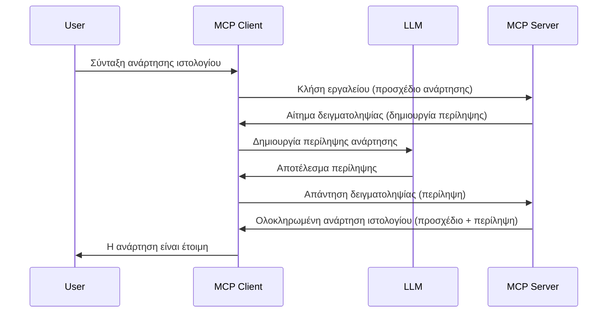

# Δειγματοληψία - ανάθεση δυνατοτήτων στον Πελάτη

Μερικές φορές, χρειάζεται ο Πελάτης MCP και ο Διακομιστής MCP να συνεργαστούν για να επιτύχουν έναν κοινό στόχο. Μπορεί να έχετε μια περίπτωση όπου ο Διακομιστής απαιτεί τη βοήθεια ενός LLM που βρίσκεται στον πελάτη. Για αυτή την κατάσταση, η δειγματοληψία είναι αυτό που πρέπει να χρησιμοποιήσετε.

Ας εξερευνήσουμε μερικές περιπτώσεις χρήσης και πώς να δημιουργήσουμε μια λύση που περιλαμβάνει δειγματοληψία.

## Επισκόπηση

Σε αυτό το μάθημα, εστιάζουμε στο να εξηγήσουμε πότε και πού να χρησιμοποιήσετε τη Δειγματοληψία και πώς να την διαμορφώσετε.

## Μαθησιακοί Στόχοι

Σε αυτό το κεφάλαιο, θα:

- Εξηγήσουμε τι είναι η Δειγματοληψία και πότε να τη χρησιμοποιήσουμε.
- Δείξουμε πώς να διαμορφώσουμε τη Δειγματοληψία στο MCP.
- Παρέχουμε παραδείγματα Δειγματοληψίας σε δράση.

## Τι είναι η Δειγματοληψία και γιατί να τη χρησιμοποιήσετε;

Η δειγματοληψία είναι μια προηγμένη λειτουργία που λειτουργεί με τον εξής τρόπο:


### Αίτημα δειγματοληψίας

Εντάξει, τώρα που έχουμε μια γενική εικόνα ενός αξιόπιστου σεναρίου, ας μιλήσουμε για το αίτημα δειγματοληψίας που στέλνει ο διακομιστής πίσω στον πελάτη. Δείτε πώς μπορεί να μοιάζει ένα τέτοιο αίτημα σε μορφή JSON-RPC:

```json
{
  "jsonrpc": "2.0",
  "id": 1,
  "method": "sampling/createMessage",
  "params": {
    "messages": [
      {
        "role": "user",
        "content": {
          "type": "text",
          "text": "Create a blog post summary of the following blog post: <BLOG POST>"
        }
      }
    ],
    "modelPreferences": {
      "hints": [
        {
          "name": "claude-3-sonnet"
        }
      ],
      "intelligencePriority": 0.8,
      "speedPriority": 0.5
    },
    "systemPrompt": "You are a helpful assistant.",
    "maxTokens": 100
  }
}
```

Υπάρχουν μερικά σημεία που αξίζει να επισημανθούν εδώ:

- Το Prompt, κάτω από content -> text, είναι η εντολή μας που είναι μια οδηγία για το LLM να συνοψίσει το περιεχόμενο της ανάρτησης στο blog.

- **modelPreferences**. Αυτή η ενότητα είναι ακριβώς αυτό, μια προτίμηση, μια σύσταση για το τι διαμόρφωση να χρησιμοποιηθεί με το LLM. Ο χρήστης μπορεί να επιλέξει αν θα ακολουθήσει αυτές τις συστάσεις ή να τις αλλάξει. Σε αυτή την περίπτωση υπάρχουν προτάσεις για το μοντέλο που θα χρησιμοποιηθεί και προτεραιότητα ταχύτητας και ευφυΐας.
- **systemPrompt**, αυτός είναι ο κανονικός σας συστημικός προτροπέας που δίνει στο LLM σας προσωπικότητα και περιέχει οδηγίες καθοδήγησης.
- **maxTokens**, αυτή είναι μια ακόμα ιδιότητα που χρησιμοποιείται για να πει πόσοι tokens προτείνονται να χρησιμοποιηθούν για αυτή την εργασία.

### Απάντηση δειγματοληψίας

Αυτή η απάντηση είναι αυτή που τελικά ο Πελάτης MCP στέλνει πίσω στον Διακομιστή MCP και είναι το αποτέλεσμα της κλήσης του LLM από τον πελάτη, της αναμονής για την απάντηση και μετά της κατασκευής αυτού του μηνύματος. Δείτε πώς μπορεί να μοιάζει σε JSON-RPC:

```json
{
  "jsonrpc": "2.0",
  "id": 1,
  "result": {
    "role": "assistant",
    "content": {
      "type": "text",
      "text": "Here's your abstract <ABSTRACT>"
    },
    "model": "gpt-5",
    "stopReason": "endTurn"
  }
}
```

Παρατηρήστε πώς η απάντηση είναι μια περίληψη της ανάρτησης στο blog όπως ζητήσαμε. Επίσης, παρατηρήστε πώς το χρησιμοποιημένο `model` δεν είναι αυτό που ζητήσαμε αλλά "gpt-5" αντί για "claude-3-sonnet". Αυτό για να δείξει ότι ο χρήστης μπορεί να αλλάξει γνώμη για το τι θα χρησιμοποιήσει και ότι το αίτημα δειγματοληψίας σας είναι μια πρόταση.

Εντάξει, τώρα που καταλαβαίνουμε τη βασική ροή και μια χρήσιμη εργασία για να τη χρησιμοποιήσουμε "δημιουργία ανάρτησης στο blog + περίληψη", ας δούμε τι πρέπει να κάνουμε για να λειτουργήσει.

### Τύποι μηνυμάτων

Τα μηνύματα δειγματοληψίας δεν περιορίζονται μόνο στο κείμενο, αλλά μπορείτε επίσης να στείλετε εικόνες και ήχο. Δείτε πώς διαφέρει το JSON-RPC:

**Κείμενο**

```json
{
  "type": "text",
  "text": "The message content"
}
```

**Περιεχόμενο εικόνας**

```json
{
  "type": "image",
  "data": "base64-encoded-image-data",
  "mimeType": "image/jpeg"
}
```

**Περιεχόμενο ήχου**

```json
{
  "type": "audio",
  "data": "base64-encoded-audio-data",
  "mimeType": "audio/wav"
}
```

> ΣΗΜΕΙΩΣΗ: για πιο λεπτομερείς πληροφορίες σχετικά με τη Δειγματοληψία, δείτε τα [επίσημα έγγραφα](https://modelcontextprotocol.io/specification/2025-06-18/client/sampling)

## Πώς να διαμορφώσετε τη Δειγματοληψία στον Πελάτη

> Σημείωση: αν κατασκευάζετε μόνο διακομιστή, δεν χρειάζεται να κάνετε πολλά εδώ.

Σε έναν πελάτη, πρέπει να καθορίσετε τη λειτουργία ως εξής:

```json
{
  "capabilities": {
    "sampling": {}
  }
}
```

Αυτό θα ενεργοποιηθεί όταν ο επιλεγμένος πελάτης σας θα ξεκινήσει με το διακομιστή.

## Παράδειγμα Δειγματοληψίας σε Δράση - Δημιουργία Ανάρτησης Blog

Ας κωδικοποιήσουμε έναν διακομιστή δειγματοληψίας μαζί, θα χρειαστεί να κάνουμε τα εξής:

1. Δημιουργήστε ένα εργαλείο στον Διακομιστή.
1. Το εργαλείο αυτό θα πρέπει να δημιουργήσει ένα αίτημα δειγματοληψίας.
1. Το εργαλείο πρέπει να περιμένει για να απαντηθεί το αίτημα δειγματοληψίας του πελάτη.
1. Έπειτα θα παραχθεί το αποτέλεσμα του εργαλείου.

Ας δούμε τον κώδικα βήμα-βήμα:

### -1- Δημιουργήστε το εργαλείο

**python**

```python
@mcp.tool()
async def create_blog(title: str, content: str, ctx: Context[ServerSession, None]) -> str:
    """Create a blog post and generate a summary"""

```

### -2- Δημιουργία αιτήματος δειγματοληψίας

Επεκτείνετε το εργαλείο σας με τον παρακάτω κώδικα:

**python**

```python
post = BlogPost(
        id=len(posts) + 1,
        title=title,
        content=content,
        abstract=""
    )

prompt = f"Create an abstract of the following blog post: title: {title} and draft: {content} "

result = await ctx.session.create_message(
        messages=[
            SamplingMessage(
                role="user",
                content=TextContent(type="text", text=prompt),
            )
        ],
        max_tokens=100,
)

```

### -3- Περιμένετε την απάντηση και επιστρέψτε την απάντηση

**python**

```python
post.abstract = result.content.text

posts.append(post)

# επιστρέψτε το πλήρες προϊόν
return json.dumps({
    "id": post.title,
    "abstract": post.abstract
})
```

### -4- Πλήρης κώδικας

**python**

```python
from starlette.applications import Starlette
from starlette.routing import Mount, Host

from mcp.server.fastmcp import Context, FastMCP

from mcp.server.session import ServerSession
from mcp.types import SamplingMessage, TextContent

import json


from uuid import uuid4
from typing import List
from pydantic import BaseModel


mcp = FastMCP("Blog post generator")

# app = FastAPI()

posts = []

class BlogPost(BaseModel):
    id: int
    title: str
    content: str
    abstract: str

posts: List[BlogPost] = []

@mcp.tool()
async def create_blog(title: str, content: str, ctx: Context[ServerSession, None]) -> str:
    """Create a blog post and generate a summary"""

    post = BlogPost(
        id=len(posts) + 1,
        title=title,
        content=content,
        abstract=""
    )

    prompt = f"Create an abstract of the following blog post: title: {title} and draft: {content} "

    result = await ctx.session.create_message(
        messages=[
            SamplingMessage(
                role="user",
                content=TextContent(type="text", text=prompt),
            )
        ],
        max_tokens=100,
    )

    post.abstract = result.content.text

    posts.append(post)

    # επιστρέφει ολόκληρη την ανάρτηση ιστολογίου
    return json.dumps({
        "id": post.title,
        "abstract": post.abstract
    })

if __name__ == "__main__":
    print("Starting server...")
    # mcp.run()
    mcp.run(transport="streamable-http")

# εκτελέστε την εφαρμογή με: python server.py
```

### -5- Δοκιμή στο Visual Studio Code

Για να το δοκιμάσετε στο Visual Studio Code, κάντε τα εξής:

1. Ξεκινήστε τον διακομιστή στο τερματικό
1. Προσθέστε τον στο *mcp.json* (και βεβαιωθείτε ότι έχει ξεκινήσει) π.χ κάτι σαν το παρακάτω:

   ```json
   "servers": {
      "blog-server": {
        "type": "http",
        "url": "http://localhost:8000/mcp"
      }
   }
   ```

1. Πληκτρολογήστε ένα prompt:

   ```text
   create a blog post named "Where Python comes from", the content is "Python is actually named after Monty Python Flying Circus"
   ```

1. Επιτρέψτε να γίνει η δειγματοληψία. Την πρώτη φορά που το δοκιμάζετε, θα εμφανιστεί ένας επιπλέον διάλογος που θα πρέπει να αποδεχτείτε, μετά θα δείτε τον κανονικό διάλογο που ζητά να τρέξετε ένα εργαλείο

1. Εξετάστε τα αποτελέσματα. Θα δείτε τα αποτελέσματα και όμορφα αποδοσμένα στο GitHub Copilot Chat, αλλά μπορείτε επίσης να δείτε την ακατέργαστη απάντηση JSON.

**Μπόνους**. Τα εργαλεία του Visual Studio Code έχουν εξαιρετική υποστήριξη για τη δειγματοληψία. Μπορείτε να διαμορφώσετε την πρόσβαση στη Δειγματοληψία στον εγκατεστημένο διακομιστή σας πηγαίνοντας ως εξής:

1. Μεταβείτε στην ενότητα επέκτασης.
1. Επιλέξτε το εικονίδιο του γραναζιού για τον εγκατεστημένο διακομιστή σας στην ενότητα "MCP SERVERS - INSTALLED".
1. Επιλέξτε "Configure Model Access", εδώ μπορείτε να επιλέξετε ποια Μοντέλα επιτρέπεται στο GitHub Copilot να χρησιμοποιεί κατά την εκτέλεση δειγματοληψίας. Μπορείτε επίσης να δείτε όλα τα πρόσφατα αιτήματα δειγματοληψίας επιλέγοντας "Show Sampling requests".

## Ανάθεση

Σε αυτή την ανάθεση, θα δημιουργήσετε μια ελαφρώς διαφορετική δειγματοληψία, συγκεκριμένα μια ολοκλήρωση δειγματοληψίας που υποστηρίζει τη δημιουργία περιγραφής προϊόντος. Ακολουθεί το σενάριό σας:

**Σενάριο**: Ο υπάλληλος υποστήριξης ενός e-commerce χρειάζεται βοήθεια, παίρνει πάρα πολύ χρόνο η δημιουργία περιγραφών προϊόντων. Επομένως, πρέπει να δημιουργήσετε μια λύση όπου μπορείτε να καλέσετε ένα εργαλείο "create_product" με παραμέτρους "title" και "keywords" και θα πρέπει να παράγει ένα ολοκληρωμένο προϊόν που περιλαμβάνει ένα πεδίο "description" που θα συμπληρώνεται από τον LLM του πελάτη.

ΣΥΜΒΟΥΛΗ: χρησιμοποιήστε όσα μάθατε νωρίτερα για να κατασκευάσετε αυτόν τον διακομιστή και το εργαλείο του χρησιμοποιώντας ένα αίτημα δειγματοληψίας.

## Λύση

[Λύση](./solution/README.md)

## Βασικά Συμπεράσματα

Η δειγματοληψία είναι μια δυνατή λειτουργία που επιτρέπει στον διακομιστή να αναθέτει εργασίες στον πελάτη όταν χρειάζεται τη βοήθεια ενός LLM.

## Τι Ακολουθεί

- [Κεφάλαιο 4 - Πρακτική υλοποίηση](../../04-PracticalImplementation/README.md)

---

<!-- CO-OP TRANSLATOR DISCLAIMER START -->
**Αποποίηση ευθυνών**:  
Το παρόν έγγραφο έχει μεταφραστεί χρησιμοποιώντας την υπηρεσία αυτόματης μετάφρασης AI [Co-op Translator](https://github.com/Azure/co-op-translator). Παρότι προσπαθούμε για ακρίβεια, παρακαλούμε να λάβετε υπόψη ότι οι αυτόματες μεταφράσεις ενδέχεται να περιέχουν σφάλματα ή ανακρίβειες. Το πρωτότυπο έγγραφο στη μητρική του γλώσσα πρέπει να θεωρείται η έγκυρη πηγή. Για κρίσιμες πληροφορίες, συνιστάται επαγγελματική ανθρώπινη μετάφραση. Δεν φέρουμε καμία ευθύνη για τυχόν παρεξηγήσεις ή εσφαλμένες ερμηνείες που προκύπτουν από τη χρήση αυτής της μετάφρασης.
<!-- CO-OP TRANSLATOR DISCLAIMER END -->