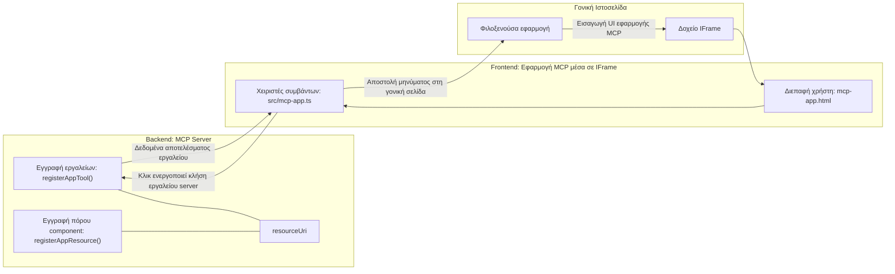

# Εφαρμογές MCP

Οι Εφαρμογές MCP είναι ένα νέο παράδειγμα στο MCP. Η ιδέα είναι ότι όχι μόνο απαντάτε με δεδομένα από μια κλήση εργαλείου, αλλά παρέχετε επίσης πληροφορίες σχετικά με το πώς πρέπει να αλληλεπιδρά κάποιος με αυτές τις πληροφορίες. Αυτό σημαίνει ότι τα αποτελέσματα των εργαλείων τώρα μπορούν να περιέχουν πληροφορίες UI. Γιατί όμως θα το θέλαμε αυτό; Λοιπόν, σκεφτείτε πώς κάνετε τα πράγματα σήμερα. Πιθανότατα χρησιμοποιείτε τα αποτελέσματα ενός MCP Server βάζοντας κάποιο είδος frontend μπροστά του, που είναι κώδικας που πρέπει να γράψετε και να διατηρήσετε. Μερικές φορές αυτό είναι που θέλετε, αλλά μερικές φορές θα ήταν υπέροχο αν μπορούσατε απλά να φέρετε ένα αποσπασματικό κομμάτι πληροφορίας που είναι αυτόνομο και έχει τα πάντα από δεδομένα μέχρι διεπαφή χρήστη.

## Επισκόπηση

Αυτό το μάθημα παρέχει πρακτικές οδηγίες για τις Εφαρμογές MCP, πώς να ξεκινήσετε με αυτές και πώς να τις ενσωματώσετε στις υπάρχουσες Web Εφαρμογές σας. Οι Εφαρμογές MCP είναι μια πολύ νέα προσθήκη στο Πρότυπο MCP.

## Στόχοι Μάθησης

Στο τέλος αυτού του μαθήματος, θα μπορείτε να:

- Εξηγήσετε τι είναι οι Εφαρμογές MCP.
- Πότε να χρησιμοποιείτε τις Εφαρμογές MCP.
- Δημιουργήσετε και να ενσωματώσετε τις δικές σας Εφαρμογές MCP.

## Εφαρμογές MCP - πώς λειτουργεί

Η ιδέα με τις Εφαρμογές MCP είναι να παρέχεται μια απάντηση που ουσιαστικά είναι ένα συστατικό για απόδοση. Ένα τέτοιο συστατικό μπορεί να έχει τόσο οπτικές όσο και αλληλεπιδραστικότητα, π.χ., κλικ σε κουμπιά, είσοδο χρήστη και άλλα. Ας ξεκινήσουμε με την πλευρά του διακομιστή και τον MCP Server μας. Για να δημιουργήσετε ένα συστατικό εφαρμογής MCP πρέπει να δημιουργήσετε ένα εργαλείο αλλά και την εφαρμογή πόρο. Αυτά τα δύο μέρη συνδέονται με ένα resourceUri.

Ακολουθεί ένα παράδειγμα. Ας προσπαθήσουμε να οπτικοποιήσουμε τι εμπλέκεται και ποια μέρη κάνουν τι:

```text
server.ts -- responsible for registering tools and the component as a UI component
src/
  mcp-app.ts -- wiring up event handlers
mcp-app.html -- the user interface
```

Αυτή η οπτικοποίηση περιγράφει την αρχιτεκτονική για τη δημιουργία ενός συστατικού και τη λογική του.


Ας προσπαθήσουμε να περιγράψουμε τις ευθύνες για το backend και το frontend αντίστοιχα.

### Το backend

Υπάρχουν δύο πράγματα που πρέπει να επιτύχουμε εδώ:

- Εγγραφή των εργαλείων με τα οποία θέλουμε να αλληλεπιδράσουμε.
- Καθορισμός του συστατικού.

**Εγγραφή του εργαλείου**

```typescript
registerAppTool(
    server,
    "get-time",
    {
      title: "Get Time",
      description: "Returns the current server time.",
      inputSchema: {},
      _meta: { ui: { resourceUri } }, // Συνδέει αυτό το εργαλείο με την πηγή UI του
    },
    async () => {
      const time = new Date().toISOString();
      return { content: [{ type: "text", text: time }] };
    },
  );

```

Ο προηγούμενος κώδικας περιγράφει τη συμπεριφορά, όπου εκθέτει ένα εργαλείο που ονομάζεται `get-time`. Δεν δέχεται εισροές αλλά καταλήγει να παράγει τον τρέχοντα χρόνο. Έχουμε τη δυνατότητα να ορίσουμε ένα `inputSchema` για εργαλεία όπου πρέπει να δεχτούμε είσοδο χρήστη.

**Εγγραφή του συστατικού**

Στο ίδιο αρχείο, πρέπει επίσης να εγγράψουμε το συστατικό:

```typescript
const resourceUri = "ui://get-time/mcp-app.html";

// Καταχωρίστε την πηγή, η οποία επιστρέφει το πακέτο HTML/JavaScript για το UI.
registerAppResource(
  server,
  resourceUri,
  resourceUri,
  { mimeType: RESOURCE_MIME_TYPE },
  async () => {
    const html = await fs.readFile(path.join(DIST_DIR, "mcp-app.html"), "utf-8");

    return {
    contents: [
        { uri: resourceUri, mimeType: RESOURCE_MIME_TYPE, text: html },
    ],
    };
  },
);
```

Παρατηρήστε πώς αναφέρουμε το `resourceUri` για να συνδέσουμε το συστατικό με τα εργαλεία του. Ενδιαφέρον έχει επίσης το callback όπου φορτώνουμε το αρχείο UI και επιστρέφουμε το συστατικό.

### Το frontend του συστατικού

Όπως και στο backend, υπάρχουν δύο κομμάτια εδώ:

- Ένα frontend γραμμένο σε καθαρό HTML.
- Κώδικας που χειρίζεται τα συμβάντα και τι πρέπει να κάνουμε, π.χ. κλήσεις εργαλείων ή αποστολή μηνυμάτων στο γονικό παράθυρο.

**Διεπαφή χρήστη**

Ας δούμε τη διεπαφή χρήστη.

```html
<!-- mcp-app.html -->
<!DOCTYPE html>
<html lang="en">
  <head>
    <meta charset="UTF-8" />
    <title>Get Time App</title>
  </head>
  <body>
    <p>
      <strong>Server Time:</strong> <code id="server-time">Loading...</code>
    </p>
    <button id="get-time-btn">Get Server Time</button>
    <script type="module" src="/src/mcp-app.ts"></script>
  </body>
</html>
```

**Σύνδεση συμβάντων**

Το τελευταίο κομμάτι είναι η σύνδεση των συμβάντων. Αυτό σημαίνει ότι αναγνωρίζουμε ποιο μέρος στην UI μας χρειάζεται χειριστές συμβάντων και τι να κάνουμε αν προκύψουν συμβάντα:

```typescript
// mcp-app.ts

import { App } from "@modelcontextprotocol/ext-apps";

// Λάβετε αναφορές στοιχείων
const serverTimeEl = document.getElementById("server-time")!;
const getTimeBtn = document.getElementById("get-time-btn")!;

// Δημιουργήστε παρουσία εφαρμογής
const app = new App({ name: "Get Time App", version: "1.0.0" });

// Διαχειριστείτε αποτελέσματα εργαλείων από τον διακομιστή. Ορίστε πριν από το `app.connect()` για να αποφύγετε
// την απώλεια του αρχικού αποτελέσματος εργαλείου.
app.ontoolresult = (result) => {
  const time = result.content?.find((c) => c.type === "text")?.text;
  serverTimeEl.textContent = time ?? "[ERROR]";
};

// Συνδέστε το πάτημα κουμπιού
getTimeBtn.addEventListener("click", async () => {
  // Το `app.callServerTool()` επιτρέπει στο UI να ζητά φρέσκα δεδομένα από τον διακομιστή
  const result = await app.callServerTool({ name: "get-time", arguments: {} });
  const time = result.content?.find((c) => c.type === "text")?.text;
  serverTimeEl.textContent = time ?? "[ERROR]";
});

// Συνδεθείτε στον κεντρικό υπολογιστή
app.connect();
```

Όπως βλέπετε από παραπάνω, αυτός είναι κανονικός κώδικας για τη σύνδεση στοιχείων DOM με συμβάντα. Αξίζει να αναφέρουμε την κλήση στο `callServerTool` που καταλήγει να καλεί ένα εργαλείο στο backend.

## Χειρισμός εισόδου χρήστη

Μέχρι τώρα, είδαμε ένα συστατικό που έχει ένα κουμπί που όταν πατηθεί καλεί ένα εργαλείο. Ας δούμε αν μπορούμε να προσθέσουμε περισσότερα στοιχεία UI, όπως ένα πεδίο εισόδου και αν μπορούμε να στείλουμε επιχειρήματα σε ένα εργαλείο. Ας υλοποιήσουμε μια λειτουργία FAQ. Δείτε πώς θα πρέπει να λειτουργεί:

- Πρέπει να υπάρχει ένα κουμπί και ένα στοιχείο εισόδου όπου ο χρήστης πληκτρολογεί μια λέξη-κλειδί για αναζήτηση, για παράδειγμα "Shipping". Αυτό θα πρέπει να καλεί ένα εργαλείο στο backend που κάνει αναζήτηση στα δεδομένα FAQ.
- Ένα εργαλείο που υποστηρίζει την αναφερόμενη αναζήτηση FAQ.

Ας προσθέσουμε πρώτα την απαραίτητη υποστήριξη στο backend:

```typescript
const faq: { [key: string]: string } = {
    "shipping": "Our standard shipping time is 3-5 business days.",
    "return policy": "You can return any item within 30 days of purchase.",
    "warranty": "All products come with a 1-year warranty covering manufacturing defects.",
  }

registerAppTool(
    server,
    "get-faq",
    {
      title: "Search FAQ",
      description: "Searches the FAQ for relevant answers.",
      inputSchema: zod.object({
        query: zod.string().default("shipping"),
      }),
      _meta: { ui: { resourceUri: faqResourceUri } }, // Συνδέει αυτό το εργαλείο με την πηγή του UI του
    },
    async ({ query }) => {
      const answer: string = faq[query.toLowerCase()] || "Sorry, I don't have an answer for that.";
      return { content: [{ type: "text", text: answer }] };
    },
  );
```

Αυτό που βλέπουμε εδώ είναι πώς συμπληρώνουμε το `inputSchema` και του δίνουμε ένα σχήμα `zod` ως εξής:

```typescript
inputSchema: zod.object({
  query: zod.string().default("shipping"),
})
```

Στο παραπάνω σχήμα δηλώνουμε ότι έχουμε μια παράμετρο εισόδου που ονομάζεται `query` και ότι είναι προαιρετική με προεπιλεγμένη τιμή "shipping".

Εντάξει, ας προχωρήσουμε στο *mcp-app.html* για να δούμε ποια UI πρέπει να δημιουργήσουμε για αυτό:

```html
<div class="faq">
    <h1>FAQ response</h1>
    <p>FAQ Response: <code id="faq-response">Loading...</code></p>
    <input type="text" id="faq-query" placeholder="Enter FAQ query" />
    <button id="get-faq-btn">Get FAQ Response</button>
  </div>
```

Τέλεια, τώρα έχουμε ένα στοιχείο εισόδου και ένα κουμπί. Ας κάνουμε μετά ένα πέρασμα στην *mcp-app.ts* για να συνδέσουμε αυτά τα συμβάντα:

```typescript
const getFaqBtn = document.getElementById("get-faq-btn")!;
const faqQueryInput = document.getElementById("faq-query") as HTMLInputElement;

getFaqBtn.addEventListener("click", async () => {
  const query = faqQueryInput.value;
  const result = await app.callServerTool({ name: "get-faq", arguments: { query } });
  const faq = result.content?.find((c) => c.type === "text")?.text;
  faqResponseEl.textContent = faq ?? "[ERROR]";
});
```

Στον παραπάνω κώδικα:

- Δημιουργούμε αναφορές στα διαδραστικά στοιχεία UI.
- Χειριζόμαστε το πάτημα κουμπιού για να πάρουμε την τιμή του πεδίου εισαγωγής και καλούμε επίσης το `app.callServerTool()` με `name` και `arguments` όπου το τελευταίο περνάει το `query` ως τιμή.

Αυτό που στην ουσία συμβαίνει όταν καλείτε το `callServerTool` είναι ότι στέλνει μήνυμα στο γονικό παράθυρο και αυτό το παράθυρο καταλήγει να καλεί τον MCP Server.

### Δοκιμή

Δοκιμάζοντας αυτό, τώρα θα πρέπει να δούμε τα εξής:


και εδώ που το δοκιμάζουμε με είσοδο όπως "warranty"


Για να εκτελέσετε αυτόν τον κώδικα, πηγαίνετε στην [Ενότητα Κώδικα](./code/README.md)

## Δοκιμές στο Visual Studio Code

Το Visual Studio Code έχει εξαιρετική υποστήριξη για τις Εφαρμογές MCP και είναι πιθανώς ένας από τους πιο εύκολους τρόπους για να δοκιμάσετε τις Εφαρμογές MCP. Για να χρησιμοποιήσετε το Visual Studio Code, προσθέστε μια εγγραφή διακομιστή στο *mcp.json* ως εξής:

```json
"my-mcp-server-7178eca7": {
    "url": "http://localhost:3001/mcp",
    "type": "http"
  }
```

Έπειτα ξεκινήστε τον διακομιστή, θα πρέπει να μπορείτε να επικοινωνείτε με την Εφαρμογή MCP σας μέσω του Παραθύρου Συνομιλίας, εφόσον έχετε εγκαταστήσει το GitHub Copilot.

Μπορείτε να το ενεργοποιήσετε μέσω μιας εντολής, για παράδειγμα "#get-faq":


και όπως όταν το είχατε τρέξει μέσω ενός φυλλομετρητή, αποδίδει με τον ίδιο τρόπο ως εξής:


## Ανάθεση

Δημιουργήστε ένα παιχνίδι πέτρα ψαλίδι χαρτί. Πρέπει να περιλαμβάνει τα εξής:

UI:

- μια λίστα επιλογής με επιλογές
- ένα κουμπί για υποβολή επιλογής
- μια ετικέτα που δείχνει ποιος επέλεξε τι και ποιος κέρδισε

Διακομιστής:

- πρέπει να έχει ένα εργαλείο πέτρα ψαλίδι χαρτί που παίρνει "choice" ως είσοδο. Πρέπει επίσης να αποδίδει μια επιλογή υπολογιστή και να καθορίζει τον νικητή

## Λύση

[Λύση](./assignment/README.md)

## Περίληψη

Μάθαμε για αυτό το νέο παράδειγμα Εφαρμογών MCP. Είναι ένα νέο παράδειγμα που επιτρέπει στους MCP Servers να έχουν άποψη όχι μόνο για τα δεδομένα αλλά και για το πώς αυτά τα δεδομένα πρέπει να παρουσιάζονται.

Επιπλέον, μάθαμε ότι αυτές οι Εφαρμογές MCP φιλοξενούνται σε ένα IFrame και για να επικοινωνήσουν με MCP Servers πρέπει να στέλνουν μηνύματα στην γονική Web εφαρμογή. Υπάρχουν πολλές βιβλιοθήκες εκεί έξω τόσο για καθαρό JavaScript όσο και για React και άλλα που κάνουν αυτή την επικοινωνία ευκολότερη.

## Κύρια σημεία

Αυτά μάθατε:

- Οι Εφαρμογές MCP είναι ένα νέο πρότυπο που μπορεί να είναι χρήσιμο όταν θέλετε να αποστείλετε τόσο δεδομένα όσο και λειτουργίες UI.
- Αυτό το είδος εφαρμογών τρέχει σε ένα IFrame για λόγους ασφαλείας.

## Τι ακολουθεί

- [Κεφάλαιο 4](../../04-PracticalImplementation/README.md)

---

<!-- CO-OP TRANSLATOR DISCLAIMER START -->
**Αποποίηση ευθυνών**:  
Αυτό το έγγραφο έχει μεταφραστεί χρησιμοποιώντας την υπηρεσία μετάφρασης AI [Co-op Translator](https://github.com/Azure/co-op-translator). Παρότι προσπαθούμε για την ακρίβεια, παρακαλούμε να έχετε υπόψη σας ότι οι αυτόματες μεταφράσεις ενδέχεται να περιέχουν λάθη ή ανακρίβειες. Το πρωτότυπο έγγραφο στη μητρική του γλώσσα πρέπει να θεωρείται η επίσημη πηγή. Για κρίσιμες πληροφορίες, συνιστάται επαγγελματική ανθρώπινη μετάφραση. Δεν φέρουμε ευθύνη για τυχόν παρεξηγήσεις ή λανθασμένες ερμηνείες που προκύπτουν από τη χρήση αυτής της μετάφρασης.
<!-- CO-OP TRANSLATOR DISCLAIMER END -->