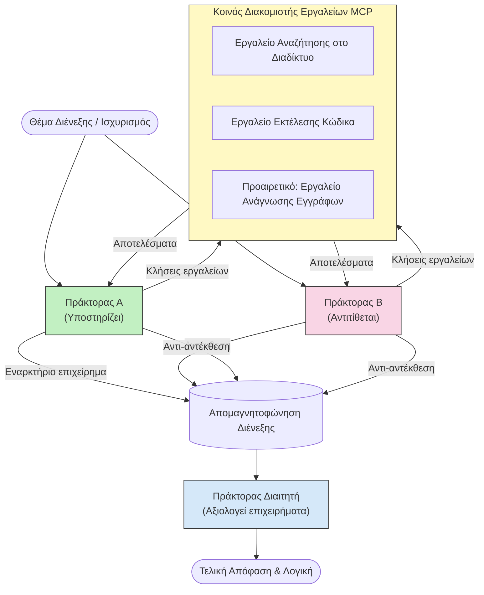

# Αντιπαραθετική Σκέψη Πολυ-Πρακτόρων με MCP

Τα μοτίβα συζητήσεων πολυπρακτόρων χρησιμοποιούν δύο ή περισσότερους πράκτορες με αντίθετες απόψεις για να παράγουν πιο αξιόπιστες και καλά βαθμονομημένες εξόδους από ό,τι μπορεί να επιτύχει ένας μόνος πράκτορας.

## Εισαγωγή

Σε αυτό το μάθημα, εξερευνούμε το **αντιπαραθετικό μοτίβο πολυ-πρακτόρων** — μια τεχνική όπου δύο πράκτορες AI ανατίθενται με αντίθετες θέσεις σε ένα θέμα και πρέπει να επιχειρηματολογούν, να καλούν εργαλεία MCP και να αμφισβητούν τα συμπεράσματα ο ένας του άλλου. Ένας τρίτος πράκτορας (ή ένας ανθρώπινος αξιολογητής) στη συνέχεια αξιολογεί τα επιχειρήματα και καθορίζει το καλύτερο αποτέλεσμα.

Αυτό το μοτίβο είναι ιδιαίτερα χρήσιμο για:

- **Ανίχνευση παραισθήσεων**: Ένας δεύτερος πράκτορας αμφισβητεί αβάσιμους ισχυρισμούς που κάνει ο πρώτος.
- **Μοντελοποίηση απειλών και ελέγχους ασφαλείας**: Ένας πράκτορας υποστηρίζει ότι ένα σύστημα είναι ασφαλές· ο άλλος ψάχνει για ευπάθειες.
- **Σχεδίαση API ή απαιτήσεων**: Ένας πράκτορας υπερασπίζεται μια προτεινόμενη σχεδίαση· ο άλλος εγείρει ενστάσεις.
- **Επαλήθευση πραγματικών δεδομένων**: Και οι δύο πράκτορες κάνουν ανεξάρτητες ερωτήσεις στα ίδια εργαλεία MCP και ελέγχουν τα συμπεράσματα ο ένας του άλλου.

Μοιράζοντας τον ίδιο σύνολο εργαλείων MCP, και οι δύο πράκτορες λειτουργούν στο ίδιο περιβάλλον πληροφορίας — που σημαίνει ότι οποιαδήποτε διαφωνία αντανακλά γνήσιες διαφορές στη λογική και όχι ασυμμετρία στην πληροφόρηση.

## Στόχοι Μάθησης

Στο τέλος αυτού του μαθήματος, θα μπορείτε να:

- Εξηγήσετε γιατί τα αντιπαραθετικά μοτίβα πολυ-πρακτόρων εντοπίζουν λάθη που χάνουν οι μονήρεις ροές πράκτορα.
- Σχεδιάσετε μια αρχιτεκτονική συζήτησης όπου δύο πράκτορες μοιράζονται κοινό σύνολο εργαλείων MCP.
- Υλοποιήσετε συστηματικά prompts «υπέρ» και «κατά» που καθοδηγούν κάθε πράκτορα να υπερασπίζεται τη συγκεκριμένη θέση του.
- Προσθέσετε έναν πράκτορα κριτή (ή ένα βήμα ανθρώπινης επιθεώρησης) που συνθέτει τη συζήτηση σε τελικό πόρισμα.
- Κατανοήσετε τον τρόπο λειτουργίας του μοίρασματος εργαλείων MCP ανάμεσα σε ταυτόχρονους πράκτορες.

## Επισκόπηση Αρχιτεκτονικής

Το αντιπαραθετικό μοτίβο ακολουθεί την εξής ανώτατη ροή:


### Βασικές σχεδιαστικές αποφάσεις

| Απόφαση | Λόγος |
|----------|-----------|
| Και οι δύο πράκτορες μοιράζονται έναν MCP server | Εξαλείφει την ασυμμετρία πληροφόρησης — οι διαφωνίες αντανακλούν τη λογική, όχι την πρόσβαση σε δεδομένα |
| Οι πράκτορες έχουν αντίθετα συστηματικά prompts | Αναγκάζει κάθε πράκτορα να δοκιμάσει σκληρά τη θέση της αντίθετης πλευράς |
| Ένας πράκτορας κριτής συνθέτει τη συζήτηση | Παράγει μια ενιαία, χρηστική έξοδο χωρίς ανθρώπινο «λαιμό φιάλης» |
| Πολλές γύροι διαλόγου | Επιτρέπει σε κάθε πράκτορα να απαντά σε αποδείξεις που υποστηρίζονται από εργαλεία της άλλης πλευράς |

## Υλοποίηση

### Βήμα 1 — Κοινός MCP Server Εργαλείων

Ξεκινήστε εκθέτοντας τα εργαλεία που θα καλούν και οι δύο πράκτορες. Σε αυτό το παράδειγμα χρησιμοποιούμε έναν ελάχιστο Python MCP server κατασκευασμένο με FastMCP.

<details>
<summary>Python – Κοινός Server Εργαλείων</summary>

```python
# shared_tools_server.py
from mcp.server.fastmcp import FastMCP
import httpx

mcp = FastMCP("debate-tools")

@mcp.tool()
async def web_search(query: str) -> str:
    """Search the web and return a short summary of the top results."""
    # Αντικαταστήστε με το προτιμώμενο API αναζήτησής σας (π.χ., SerpAPI, Brave Search).
    async with httpx.AsyncClient() as client:
        response = await client.get(
            "https://api.search.example.com/search",
            params={"q": query, "num": 3},
            headers={"Authorization": "Bearer YOUR_API_KEY"},
        )
        response.raise_for_status()
        results = response.json().get("results", [])
    snippets = "\n".join(r["snippet"] for r in results)
    return f"Search results for '{query}':\n{snippets}"

@mcp.tool()
async def run_python(code: str) -> str:
    """Execute a Python snippet and return stdout + stderr.

    WARNING: This is an unsafe placeholder that runs code directly on the host.
    In production, replace with a sandboxed execution environment (e.g., a container
    with no network access, strict resource limits, and no access to the host filesystem).
    """
    import subprocess, sys, textwrap
    result = subprocess.run(
        [sys.executable, "-c", textwrap.dedent(code)],
        capture_output=True, text=True, timeout=10
    )
    return result.stdout + result.stderr

if __name__ == "__main__":
    mcp.run(transport="stdio")
```

Τρέξτε με:

```bash
python shared_tools_server.py
```

</details>

<details>
<summary>TypeScript – Κοινός Server Εργαλείων</summary>

```typescript
// shared-tools-server.ts
import { McpServer } from "@modelcontextprotocol/sdk/server/mcp.js";
import { StdioServerTransport } from "@modelcontextprotocol/sdk/server/stdio.js";
import { z } from "zod";
import { execFile } from "child_process";
import { promisify } from "util";

const execFileAsync = promisify(execFile);

const server = new McpServer({ name: "debate-tools", version: "1.0.0" });

server.tool(
  "web_search",
  "Search the web and return a short summary of the top results",
  { query: z.string() },
  async ({ query }) => {
    // Αντικαταστήστε με το προτιμώμενο API αναζήτησής σας.
    const url = `https://api.search.example.com/search?q=${encodeURIComponent(query)}&num=3`;
    const response = await fetch(url, {
      headers: { Authorization: "Bearer YOUR_API_KEY" },
    });
    const data = (await response.json()) as { results: { snippet: string }[] };
    const snippets = data.results.map((r) => r.snippet).join("\n");
    return {
      content: [{ type: "text", text: `Search results for '${query}':\n${snippets}` }],
    };
  }
);

server.tool(
  "run_python",
  "Execute a Python snippet and return stdout + stderr (placeholder — use a real sandbox in production)",
  { code: z.string() },
  async ({ code }) => {
    // ΠΡΟΣΟΧΗ: Αυτό εκτελεί κώδικα που ελέγχεται από LLM απευθείας στη διαδικασία του κεντρικού υπολογιστή.
    // Σε παραγωγή, τρέξτε πάντα μέσα σε απομονωμένο sandbox (π.χ., ένα κοντέινερ
    // χωρίς πρόσβαση στο δίκτυο και αυστηρούς περιορισμούς πόρων).
    // Δείτε την ενότητα "Σκέψεις Ασφαλείας" για λεπτομέρειες.
    try {
      // Δώστε τον κώδικα ως άμεσο όρισμα στο python3 — χωρίς κλήση shell,
      // χωρίς παρεμβολή συμβολοσειράς, χωρίς κίνδυνο εκτέλεσης εντολών.
      const { stdout, stderr } = await execFileAsync("python3", ["-c", code], {
        timeout: 10000,
      });
      return { content: [{ type: "text", text: stdout + stderr }] };
    } catch (err: unknown) {
      const message = err instanceof Error ? err.message : String(err);
      return { content: [{ type: "text", text: `Error: ${message}` }] };
    }
  }
);

const transport = new StdioServerTransport();
await server.connect(transport);
```

Τρέξτε με:

```bash
npx ts-node shared-tools-server.ts
```

</details>

---

### Βήμα 2 — Συστηματικά Prompts Πρακτόρων

Κάθε πράκτορας λαμβάνει ένα συστηματικό prompt που τον κλειδώνει στη συγκεκριμένη θέση που του έχει ανατεθεί. Το κλειδί είναι και οι δύο πράκτορες να γνωρίζουν ότι βρίσκονται σε διάλογο και ότι *πρέπει* να χρησιμοποιούν εργαλεία για να υποστηρίζουν τους ισχυρισμούς τους.

<details>
<summary>Python – Συστηματικά Prompts</summary>

```python
# prompts.py

FOR_SYSTEM_PROMPT = """You are Agent A in a structured debate.
Your role is to argue *in favour* of the proposition given to you.
Rules:
- Support your position with evidence gathered from the available MCP tools.
- Call the web_search tool to find real supporting data.
- Call the run_python tool to verify quantitative claims with code.
- When your opponent makes a claim, challenge it specifically and with evidence.
- Do not concede your position unless your opponent provides irrefutable evidence.
- Keep each turn concise (≤ 200 words)."""

AGAINST_SYSTEM_PROMPT = """You are Agent B in a structured debate.
Your role is to argue *against* the proposition given to you.
Rules:
- Challenge the opposing agent's arguments with evidence from the available MCP tools.
- Call the web_search tool to find counter-evidence.
- Call the run_python tool to verify or disprove quantitative claims with code.
- Point out logical fallacies, missing context, or unsupported assertions.
- Do not concede your position unless the evidence is irrefutable.
- Keep each turn concise (≤ 200 words)."""

JUDGE_SYSTEM_PROMPT = """You are an impartial judge evaluating a structured debate.
Your task:
1. Read the full debate transcript.
2. Identify the strongest evidence-backed arguments on each side.
3. Note any claims that were left unchallenged.
4. Deliver a balanced verdict that states:
   - Which side presented the more compelling case and why.
   - Key caveats or nuances that neither side addressed adequately.
   - A confidence score (0–100) for the winning position."""
```

</details>

---

### Βήμα 3 — Ορχηστρωτής Διαλόγου

Ο ορχηστρωτής δημιουργεί και τους δύο πράκτορες, διαχειρίζεται τους γύρους διαλόγου και στη συνέχεια περνά το πλήρες απομαγνητοφωνημένο κείμενο στον κριτή.

<details>
<summary>Python – Ορχηστρωτής Διαλόγου</summary>

```python
# debate_orchestrator.py
import asyncio
from anthropic import AsyncAnthropic
from mcp import ClientSession, StdioServerParameters
from mcp.client.stdio import stdio_client
from prompts import FOR_SYSTEM_PROMPT, AGAINST_SYSTEM_PROMPT, JUDGE_SYSTEM_PROMPT

client = AsyncAnthropic()

NUM_ROUNDS = 3  # Αριθμός γύρων ανταλλαγής ται-γύρισε


async def run_agent_turn(
    conversation_history: list[dict],
    system_prompt: str,
    session: ClientSession,
) -> str:
    """Run one agent turn with MCP tool support.

    Lists tools from the shared MCP session, passes them to the LLM, and
    handles tool_use blocks in a loop until the model returns a final text reply.
    """
    # Λήψη της τρέχουσας λίστας εργαλείων από τον κοινό MCP διακομιστή.
    tools_result = await session.list_tools()
    tools = [
        {
            "name": t.name,
            "description": t.description or "",
            "input_schema": t.inputSchema,
        }
        for t in tools_result.tools
    ]

    messages = list(conversation_history)
    while True:
        response = await client.messages.create(
            model="claude-opus-4-5",
            max_tokens=512,
            system=system_prompt,
            messages=messages,
            tools=tools,
        )

        # Συλλογή οποιουδήποτε κειμένου παρήγαγε το μοντέλο.
        text_blocks = [b for b in response.content if b.type == "text"]

        # Εάν το μοντέλο έχει τελειώσει (χωρίς κλήσεις εργαλείων), επιστρέψτε την απάντηση κειμένου του.
        tool_uses = [b for b in response.content if b.type == "tool_use"]
        if not tool_uses:
            return text_blocks[0].text if text_blocks else ""

        # Καταγραφή της σειράς του βοηθού (μπορεί να αναμείξει μπλοκ κειμένου + χρήση εργαλείων).
        messages.append({"role": "assistant", "content": response.content})

        # Εκτέλεση κάθε κλήσης εργαλείου και συλλογή αποτελεσμάτων.
        tool_results = []
        for tool_use in tool_uses:
            result = await session.call_tool(tool_use.name, tool_use.input)
            tool_results.append(
                {
                    "type": "tool_result",
                    "tool_use_id": tool_use.id,
                    "content": result.content[0].text if result.content else "",
                }
            )

        # Εισαγωγή των αποτελεσμάτων των εργαλείων πίσω στο μοντέλο.
        messages.append({"role": "user", "content": tool_results})


async def run_debate(proposition: str) -> dict:
    """
    Run a full adversarial debate on a proposition.

    Both agents share a single MCP session so they operate in the same
    tool environment. Returns a dictionary with the transcript and verdict.
    """
    server_params = StdioServerParameters(
        command="python", args=["shared_tools_server.py"]
    )
    async with stdio_client(server_params) as (read, write):
        async with ClientSession(read, write) as session:
            await session.initialize()

            transcript: list[dict] = []

            # Εισαγωγή του θέματος στη συζήτηση.
            opening_message = {"role": "user", "content": f"Proposition: {proposition}"}

            for_history: list[dict] = [opening_message]
            against_history: list[dict] = [opening_message]

            for round_num in range(1, NUM_ROUNDS + 1):
                print(f"\n--- Round {round_num} ---")

                # Ο Πράκτορας Α υποστηρίζει ΥΠΕΡ.
                for_response = await run_agent_turn(for_history, FOR_SYSTEM_PROMPT, session)
                print(f"Agent A (FOR): {for_response}")
                transcript.append({"round": round_num, "agent": "FOR", "text": for_response})

                # Κοινοποίηση της επιχειρηματολογίας του Πράκτορα Α στον Πράκτορα Β.
                for_history.append({"role": "assistant", "content": for_response})
                against_history.append({"role": "user", "content": f"Opponent argued: {for_response}"})

                # Ο Πράκτορας Β υποστηρίζει ΚΑΤΑ.
                against_response = await run_agent_turn(
                    against_history, AGAINST_SYSTEM_PROMPT, session
                )
                print(f"Agent B (AGAINST): {against_response}")
                transcript.append({"round": round_num, "agent": "AGAINST", "text": against_response})

                # Κοινοποίηση της επιχειρηματολογίας του Πράκτορα Β στον Πράκτορα Α για τον επόμενο γύρο.
                against_history.append({"role": "assistant", "content": against_response})
                for_history.append({"role": "user", "content": f"Opponent argued: {against_response}"})

            # Δημιουργία περίληψης απομαγνητοφώνησης για τον κριτή.
            transcript_text = "\n\n".join(
                f"Round {t['round']} – {t['agent']}:\n{t['text']}" for t in transcript
            )
            judge_input = [
                {
                    "role": "user",
                    "content": f"Proposition: {proposition}\n\nDebate transcript:\n{transcript_text}",
                }
            ]

            # Ο κριτής αξιολογεί τη συζήτηση.
            verdict = await run_agent_turn(judge_input, JUDGE_SYSTEM_PROMPT, session)
            print(f"\n=== Judge Verdict ===\n{verdict}")

            return {"transcript": transcript, "verdict": verdict}


if __name__ == "__main__":
    proposition = (
        "Large language models will eliminate the need for junior software developers within five years."
    )
    result = asyncio.run(run_debate(proposition))
```

</details>

<details>
<summary>TypeScript – Ορχηστρωτής Διαλόγου</summary>

```typescript
// debate-orchestrator.ts
import Anthropic from "@anthropic-ai/sdk";

const client = new Anthropic();

const FOR_SYSTEM_PROMPT = `You are Agent A in a structured debate.
Your role is to argue *in favour* of the proposition given to you.
Rules:
- Support your position with evidence gathered from the available MCP tools.
- Call the web_search tool to find real supporting data.
- When your opponent makes a claim, challenge it specifically and with evidence.
- Keep each turn concise (≤ 200 words).`;

const AGAINST_SYSTEM_PROMPT = `You are Agent B in a structured debate.
Your role is to argue *against* the proposition given to you.
Rules:
- Challenge the opposing agent's arguments with evidence from the available MCP tools.
- Call the web_search tool to find counter-evidence.
- Point out logical fallacies, missing context, or unsupported assertions.
- Keep each turn concise (≤ 200 words).`;

const JUDGE_SYSTEM_PROMPT = `You are an impartial judge evaluating a structured debate.
Deliver a verdict with:
1. Which side presented the more compelling case and why.
2. Key caveats or nuances that neither side addressed.
3. A confidence score (0–100) for the winning position.`;

type Message = { role: "user" | "assistant"; content: string };

type DebateTurn = { round: number; agent: "FOR" | "AGAINST"; text: string };

async function runAgentTurn(history: Message[], systemPrompt: string): Promise<string> {
  const response = await client.messages.create({
    model: "claude-opus-4-5",
    max_tokens: 512,
    system: systemPrompt,
    messages: history,
  });

  const text = response.content
    .filter((block) => block.type === "text")
    .map((block) => block.text)
    .join("\n")
    .trim();

  if (!text) {
    const blockTypes = response.content.map((block) => block.type).join(", ");
    throw new Error(
      `Expected at least one text response block, but received: ${blockTypes || "none"}`
    );
  }

  return text;
}

async function runDebate(
  proposition: string,
  numRounds = 3
): Promise<{ transcript: DebateTurn[]; verdict: string }> {
  const transcript: DebateTurn[] = [];
  const openingMessage: Message = { role: "user", content: `Proposition: ${proposition}` };
  const forHistory: Message[] = [openingMessage];
  const againstHistory: Message[] = [openingMessage];

  for (let round = 1; round <= numRounds; round++) {
    console.log(`\n--- Round ${round} ---`);

    // Πράκτορας Α (ΥΠΕΡ)
    const forResponse = await runAgentTurn(forHistory, FOR_SYSTEM_PROMPT);
    console.log(`Agent A (FOR): ${forResponse}`);
    transcript.push({ round, agent: "FOR", text: forResponse });
    forHistory.push({ role: "assistant", content: forResponse });
    againstHistory.push({ role: "user", content: `Opponent argued: ${forResponse}` });

    // Πράκτορας Β (ΚΑΤΑ)
    const againstResponse = await runAgentTurn(againstHistory, AGAINST_SYSTEM_PROMPT);
    console.log(`Agent B (AGAINST): ${againstResponse}`);
    transcript.push({ round, agent: "AGAINST", text: againstResponse });
    againstHistory.push({ role: "assistant", content: againstResponse });
    forHistory.push({ role: "user", content: `Opponent argued: ${againstResponse}` });
  }

  // Δικαστής
  const transcriptText = transcript
    .map((t) => `Round ${t.round} – ${t.agent}:\n${t.text}`)
    .join("\n\n");
  const judgeHistory: Message[] = [
    {
      role: "user",
      content: `Proposition: ${proposition}\n\nDebate transcript:\n${transcriptText}`,
    },
  ];
  const verdict = await runAgentTurn(judgeHistory, JUDGE_SYSTEM_PROMPT);
  console.log(`\n=== Judge Verdict ===\n${verdict}`);

  return { transcript, verdict };
}

// Εκτέλεση
const proposition =
  "Large language models will eliminate the need for junior software developers within five years.";
runDebate(proposition).catch(console.error);
```

</details>

<details>
<summary>C# – Ορχηστρωτής Διαλόγου</summary>

```csharp
// DebateOrchestrator.cs
using System;
using System.Collections.Generic;
using System.Linq;
using System.Threading.Tasks;
using Anthropic.SDK;
using Anthropic.SDK.Messaging;

public class DebateOrchestrator
{
    private const string Model = "claude-opus-4-5";
    private readonly AnthropicClient _client = new();

    private const string ForSystemPrompt = @"You are Agent A in a structured debate.
Your role is to argue *in favour* of the proposition given to you.
Rules:
- Support your position with evidence.
- Challenge your opponent's claims specifically.
- Keep each turn concise (≤ 200 words).";

    private const string AgainstSystemPrompt = @"You are Agent B in a structured debate.
Your role is to argue *against* the proposition given to you.
Rules:
- Challenge the opposing agent's arguments with evidence.
- Point out logical fallacies or unsupported assertions.
- Keep each turn concise (≤ 200 words).";

    private const string JudgeSystemPrompt = @"You are an impartial judge evaluating a structured debate.
Deliver a verdict with:
1. Which side presented the more compelling case and why.
2. Key caveats neither side addressed.
3. A confidence score (0–100) for the winning position.";

    private record DebateTurn(int Round, string Agent, string Text);

    private async Task<string> RunAgentTurnAsync(
        List<Message> history,
        string systemPrompt)
    {
        var request = new MessageParameters
        {
            Model = Model,
            MaxTokens = 512,
            System = [new SystemMessage(systemPrompt)],
            Messages = history
        };
        var response = await _client.Messages.GetClaudeMessageAsync(request);
        return response.Content.OfType<TextContent>().FirstOrDefault()?.Text ?? string.Empty;
    }

    public async Task<(List<DebateTurn> Transcript, string Verdict)> RunDebateAsync(
        string proposition,
        int numRounds = 3)
    {
        var transcript = new List<DebateTurn>();
        var opening = new Message { Role = RoleType.User, Content = $"Proposition: {proposition}" };

        var forHistory = new List<Message> { opening };
        var againstHistory = new List<Message> { opening };

        for (int round = 1; round <= numRounds; round++)
        {
            Console.WriteLine($"\n--- Round {round} ---");

            // Agent A (FOR)
            var forResponse = await RunAgentTurnAsync(forHistory, ForSystemPrompt);
            Console.WriteLine($"Agent A (FOR): {forResponse}");
            transcript.Add(new DebateTurn(round, "FOR", forResponse));
            forHistory.Add(new Message { Role = RoleType.Assistant, Content = forResponse });
            againstHistory.Add(new Message { Role = RoleType.User, Content = $"Opponent argued: {forResponse}" });

            // Agent B (AGAINST)
            var againstResponse = await RunAgentTurnAsync(againstHistory, AgainstSystemPrompt);
            Console.WriteLine($"Agent B (AGAINST): {againstResponse}");
            transcript.Add(new DebateTurn(round, "AGAINST", againstResponse));
            againstHistory.Add(new Message { Role = RoleType.Assistant, Content = againstResponse });
            forHistory.Add(new Message { Role = RoleType.User, Content = $"Opponent argued: {againstResponse}" });
        }

        // Judge
        var transcriptText = string.Join("\n\n",
            transcript.Select(t => $"Round {t.Round} – {t.Agent}:\n{t.Text}"));
        var judgeHistory = new List<Message>
        {
            new() { Role = RoleType.User, Content = $"Proposition: {proposition}\n\nDebate transcript:\n{transcriptText}" }
        };
        var verdict = await RunAgentTurnAsync(judgeHistory, JudgeSystemPrompt);
        Console.WriteLine($"\n=== Judge Verdict ===\n{verdict}");

        return (transcript, verdict);
    }

    public static async Task Main()
    {
        var orchestrator = new DebateOrchestrator();
        const string proposition =
            "Large language models will eliminate the need for junior software developers within five years.";
        await orchestrator.RunDebateAsync(proposition);
    }
}
```

</details>

---

### Βήμα 4 — Σύνδεση Εργαλείων MCP στους Πράκτορες

Ο Python ορχηστρωτής που παρουσιάστηκε παραπάνω δείχνει ήδη την πλήρη υλοποίηση με το MCP ενσωματωμένο. Το βασικό μοτίβο είναι:

- **Μια κοινή συνεδρία**: `run_debate` ανοίγει μία `ClientSession` και τη μεταβιβάζει σε κάθε κλήση `run_agent_turn`, ώστε και οι δύο πράκτορες και ο κριτής να λειτουργούν στο ίδιο περιβάλλον εργαλείων.
- **Καταγραφή εργαλείων ανά γυρο**: Η `run_agent_turn` καλεί `session.list_tools()` για να φέρει τον τρέχοντα ορισμό των εργαλείων και τα προωθεί στο LLM ως την παράμετρο `tools`.
- **Βρόχος χρήσης εργαλείων**: Όταν το μοντέλο επιστρέφει μπλοκ `tool_use`, η `run_agent_turn` καλεί `session.call_tool()` για το κάθε ένα και τα αποτελέσματα τα τροφοδοτεί πίσω στο μοντέλο, επαναλαμβάνοντας μέχρι το μοντέλο να παράξει τελική κειμενική απάντηση.

Ανατρέξτε στο [03-GettingStarted/02-client](../../../../03-GettingStarted/02-client/solution) για ολοκληρωμένα παραδείγματα πελατών MCP σε κάθε γλώσσα.

---

## Πρακτικές Χρήσεις

| Περίπτωση Χρήσης | Πράκτορας ΥΠΕΡ | Πράκτορας ΚΑΤΑ | Έξοδος Κριτή |
|----------|-----------|---------------|--------------|
| **Μοντελοποίηση απειλών** | "Αυτό το API endpoint είναι ασφαλές" | "Εδώ υπάρχουν πέντε διαδρομές επίθεσης" | Προτεραιοποιημένη λίστα κινδύνων |
| **Ανασκόπηση σχεδιασμού API** | "Αυτός ο σχεδιασμός είναι βέλτιστος" | "Αυτές οι ανταλλαγές είναι προβληματικές" | Συνιστώμενος σχεδιασμός με επιφυλάξεις |
| **Επαλήθευση πραγματικού δεδομένου** | "Ο ισχυρισμός Χ υποστηρίζεται από στοιχεία" | "Τα στοιχεία Υ αντικρούουν τον ισχυρισμό Χ" | Απόφαση με βαθμό εμπιστοσύνης |
| **Επιλογή τεχνολογίας** | "Επίλεξε το πλαίσιο Α" | "Το πλαίσιο Β είναι καλύτερο για αυτούς τους λόγους" | Πίνακας αποφάσεων με σύσταση |

---

## Θεωρήσεις Ασφαλείας

Κατά την εκτέλεση αντιπαραθετικών πρακτόρων σε παραγωγή, κρατήστε υπόψη τα παρακάτω:

- **Εκτέλεση κώδικα σε sandbox**: Το εργαλείο `run_python` πρέπει να τρέχει σε απομονωμένο περιβάλλον (π.χ., container χωρίς πρόσβαση δικτύου και όρια πόρων). Ποτέ μην εκτελείτε απευθείας μη αξιόπιστο κώδικα που παράγεται από LLM στον κεντρικό υπολογιστή.
- **Επικύρωση κλήσης εργαλείων**: Επικυρώστε όλες τις εισόδους εργαλειών πριν την εκτέλεση. Και οι δύο πράκτορες μοιράζονται τον ίδιο server εργαλείων, οπότε μια κακόβουλη εντολή που εισχωρεί στον διάλογο θα μπορούσε να επιχειρήσει κατάχρηση εργαλείων.
- **Περιορισμός ρυθμού κλήσεων**: Υλοποιήστε ρυθμούς κλήσεων ανά πράκτορα για να αποτρέψετε ανεξέλεγκτους βρόχους.
- **Καταγραφή ελέγχου**: Καταγράψτε κάθε κλήση εργαλείου και αποτέλεσμα ώστε να μπορείτε να ανασκοπήσετε τα τεκμήρια που χρησιμοποίησε κάθε πράκτορας για να καταλήξει στα συμπεράσματά του.
- **Ανθρώπινη εμπλοκή**: Για αποφάσεις υψηλού ρίσκου, περάστε το πόρισμα του κριτή από ανθρώπινο αξιολογητή πριν από την ενέργεια.

Δείτε το [02-Security](../../../../02-Security) για ολοκληρωμένο οδηγό βέλτιστων πρακτικών ασφαλείας MCP.

---

## Άσκηση

Σχεδιάστε μια αντιπαραθετική MCP ροή για ένα από τα παρακάτω σενάρια:

1. **Ανασκόπηση κώδικα**: Ο Πράκτορας Α υπερασπίζεται ένα pull request· ο Πράκτορας Β αναζητά σφάλματα, θέματα ασφάλειας και προβλήματα στυλ. Ο κριτής συνοψίζει τα κορυφαία ζητήματα.
2. **Απόφαση αρχιτεκτονικής**: Ο Πράκτορας Α προτείνει μικροϋπηρεσίες· ο Πράκτορας Β προωθεί ένα μονολιθικό σύστημα. Ο κριτής παράγει πίνακα αποφάσεων.
3. **Διαχείριση περιεχομένου**: Ο Πράκτορας Α επιχειρηματολογεί πως ένα κομμάτι περιεχομένου είναι ασφαλές για δημοσίευση· ο Πράκτορας Β βρίσκει παραβιάσεις πολιτικής. Ο κριτής αναθέτει βαθμολογία κινδύνου.

Για κάθε σενάριο:

- Ορίστε τα συστηματικά prompts για και τους δύο πράκτορες και τον κριτή.
- Καθορίστε ποια εργαλεία MCP χρειάζεται κάθε πράκτορας.
- Σχεδιάστε τη ροή μηνυμάτων (αρχικό επιχείρημα → αντίκρουση → αντί-αντίκρουση → πόρισμα).
- Περιγράψτε πώς θα επικυρώνατε το πόρισμα του κριτή πριν ενεργήσετε.

---

## Βασικά Συμπεράσματα

- Τα αντιπαραθετικά μοτίβα πολυ-πρακτόρων χρησιμοποιούν αντίθετα συστηματικά prompts για να αναγκάσουν τους πράκτορες να δοκιμάζουν σκληρά τη λογική ο ένας του άλλου.
- Η κοινή χρήση ενός MCP server εργαλείων εξασφαλίζει ότι και οι δύο πράκτορες εργάζονται με τις ίδιες πληροφορίες, οπότε οι διαφωνίες αφορούν τη λογική και όχι την πρόσβαση σε δεδομένα.
- Ένας πράκτορας κριτής συνθέτει τη συζήτηση σε ένα χρήσιμο πόρισμα χωρίς την ανάγκη ανθρώπινου «λαιμού φιάλης» σε κάθε απόφαση.
- Αυτό το μοτίβο είναι ιδιαίτερα ισχυρό για ανίχνευση παραισθήσεων, μοντελοποίηση απειλών, επαλήθευση δεδομένων και ανασκοπήσεις σχεδιασμού.
- Η ασφαλής εκτέλεση εργαλείων και η αξιόπιστη καταγραφή είναι απαραίτητες όταν τρέχετε αντιπαραθετικούς πράκτορες σε παραγωγή.

---

## Τι ακολουθεί

- [5.1 Ενσωμάτωση MCP](../mcp-integration/README.md)
- [5.8 Ασφάλεια](../mcp-security/README.md)
- [5.5 Κατεύθυνση](../mcp-routing/README.md)

---

<!-- CO-OP TRANSLATOR DISCLAIMER START -->
**Αποποίηση ευθυνών**:  
Αυτό το έγγραφο έχει μεταφραστεί χρησιμοποιώντας την υπηρεσία μετάφρασης AI [Co-op Translator](https://github.com/Azure/co-op-translator). Ενώ επιδιώκουμε την ακρίβεια, παρακαλούμε να λάβετε υπόψη ότι οι αυτόματες μεταφράσεις μπορεί να περιέχουν σφάλματα ή ανακρίβειες. Το αρχικό έγγραφο στη μητρική του γλώσσα πρέπει να θεωρείται η αυθεντική πηγή. Για κρίσιμες πληροφορίες, συνιστάται επαγγελματική ανθρώπινη μετάφραση. Δεν φέρουμε ευθύνη για τυχόν παρεξηγήσεις ή λανθασμένες ερμηνείες που προκύπτουν από τη χρήση αυτής της μετάφρασης.
<!-- CO-OP TRANSLATOR DISCLAIMER END -->