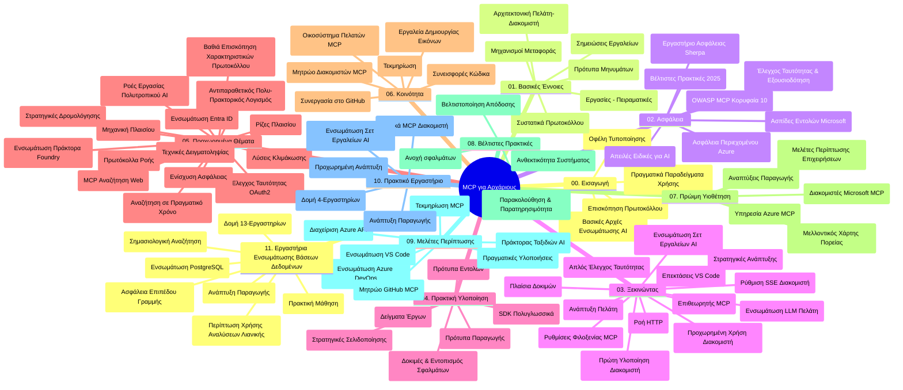

# Πρωτόκολλο Πλαισίου Μοντέλου (MCP) για Αρχάριους - Οδηγός Μελέτης

Αυτός ο οδηγός μελέτης παρέχει μια επισκόπηση της δομής και του περιεχομένου του αποθετηρίου για το εκπαιδευτικό πρόγραμμα "Πρωτόκολλο Πλαισίου Μοντέλου (MCP) για Αρχάριους". Χρησιμοποιήστε αυτόν τον οδηγό για να πλοηγηθείτε αποδοτικά στο αποθετήριο και να αξιοποιήσετε στο μέγιστο τους διαθέσιμους πόρους.

## Επισκόπηση Αποθετηρίου

Το Πρωτόκολλο Πλαισίου Μοντέλου (MCP) είναι ένα τυποποιημένο πλαίσιο για τις αλληλεπιδράσεις μεταξύ μοντέλων AI και πελατειακών εφαρμογών. Αρχικά δημιουργήθηκε από την Anthropic, το MCP πλέον συντηρείται από την ευρύτερη κοινότητα MCP μέσω του επίσημου οργανισμού GitHub. Αυτό το αποθετήριο παρέχει ένα ολοκληρωμένο πρόγραμμα σπουδών με πρακτικά παραδείγματα κώδικα σε C#, Java, JavaScript, Python και TypeScript, σχεδιασμένο για προγραμματιστές AI, αρχιτέκτονες συστημάτων και μηχανικούς λογισμικού.

## Οπτικός Χάρτης Προγράμματος Σπουδών

## Δομή Αποθετηρίου

Το αποθετήριο είναι οργανωμένο σε έντεκα κύρια τμήματα, το καθένα εστιάζοντας σε διαφορετικές πτυχές του MCP:

1. **Εισαγωγή (00-Introduction/)**
   - Επισκόπηση του Πρωτοκόλλου Πλαισίου Μοντέλου
   - Γιατί έχει σημασία η τυποποίηση στις ροές εργασίας AI
   - Πρακτικές περιπτώσεις χρήσης και οφέλη

2. **Βασικές Έννοιες (01-CoreConcepts/)**
   - Αρχιτεκτονική πελάτη-διακομιστή
   - Κύρια στοιχεία πρωτοκόλλου
   - Πρότυπα μηνυμάτων στο MCP

3. **Ασφάλεια (02-Security/)**
   - Απειλές ασφάλειας σε συστήματα βάσει MCP
   - Καλύτερες πρακτικές για ασφαλή υλοποίηση
   - Στρατηγικές αυθεντικοποίησης και εξουσιοδότησης
   - **Ολοκληρωμένη Τεκμηρίωση Ασφάλειας**:
     - Καλύτερες Πρακτικές Ασφάλειας MCP 2025
     - Οδηγός Εφαρμογής Azure Content Safety
     - Έλεγχοι και Τεχνικές Ασφάλειας MCP
     - Γρήγορη Αναφορά Καλύτερων Πρακτικών MCP
   - **Κύρια Θέματα Ασφάλειας**:
     - Επιθέσεις με έγχυση prompt και δηλητηρίαση εργαλείων
     - Απαγωγή συνεδρίας και προβλήματα confused deputy
     - Ευπάθειες token passthrough
     - Υπερβολικές άδειες και έλεγχος πρόσβασης
     - Ασφάλεια εφοδιαστικής αλυσίδας για συνιστώσες AI
     - Ενσωμάτωση Microsoft Prompt Shields

4. **Ξεκινώντας (03-GettingStarted/)**
   - Ρύθμιση και διαμόρφωση περιβάλλοντος
   - Δημιουργία βασικών MCP διακομιστών και πελατών
   - Ενσωμάτωση με υπάρχουσες εφαρμογές
   - Περιλαμβάνει ενότητες για:
     - Πρώτη υλοποίηση διακομιστή
     - Ανάπτυξη πελάτη
     - Ενσωμάτωση LLM πελάτη
     - Ενσωμάτωση VS Code
     - Διακομιστής SSE (Server-Sent Events)
     - Προχωρημένη χρήση διακομιστή
     - Streaming HTTP
     - Ενσωμάτωση AI Toolkit
     - Στρατηγικές δοκιμών
     - Οδηγίες ανάπτυξης

5. **Πρακτική Υλοποίηση (04-PracticalImplementation/)**
   - Χρήση SDK σε διαφορετικές γλώσσες προγραμματισμού
   - Τεχνικές αποσφαλμάτωσης, δοκιμών και επικύρωσης
   - Δημιουργία επαναχρησιμοποιούμενων προτύπων και ροών εργασίας prompt
   - Παραδείγματα έργων με υλοποιήσεις

6. **Προχωρημένα Θέματα (05-AdvancedTopics/)**
   - Τεχνικές μηχανικής πλαισίου
   - Ενσωμάτωση πράκτορα Foundry
   - Πολυτροπικές ροές εργασίας AI
   - Demos αυθεντικοποίησης OAuth2
   - Δυνατότητες αναζήτησης σε πραγματικό χρόνο
   - Streaming σε πραγματικό χρόνο
   - Υλοποιήσεις ριζικών πλαισίων
   - Στρατηγικές δρομολόγησης
   - Τεχνικές δειγματοληψίας
   - Προσεγγίσεις κλιμάκωσης
   - Θεμελιώδεις θέσεις ασφάλειας
   - Ενσωμάτωση ασφάλειας Entra ID
   - Ενσωμάτωση αναζήτησης ιστού
   - Ανταγωνιστική πολυ-πρακτορική λογική (μοτίβα αντιπαράθεσης)

7. **Συνεισφορές Κοινότητας (06-CommunityContributions/)**
   - Πώς να συνεισφέρετε κώδικα και τεκμηρίωση
   - Συνεργασία μέσω GitHub
   - Βελτιώσεις και ανατροφοδότηση που καθοδηγείται από την κοινότητα
   - Χρήση διαφόρων MCP πελατών (Claude Desktop, Cline, VSCode)
   - Εργασία με δημοφιλείς MCP διακομιστές, συμπεριλαμβανομένης παραγωγής εικόνας

8. **Μαθήματα από την Πρώιμη Υιοθέτηση (07-LessonsfromEarlyAdoption/)**
   - Πραγματικές υλοποιήσεις και ιστορίες επιτυχίας
   - Κατασκευή και ανάπτυξη λύσεων βάσει MCP
   - Τάσεις και μελλοντικός οδικός χάρτης
   - **Οδηγός Microsoft MCP Servers**: Ολοκληρωμένος οδηγός για 10 παραγωγικούς Microsoft MCP διακομιστές, μεταξύ των οποίων:
     - Microsoft Learn Docs MCP Server
     - Azure MCP Server (15+ εξειδικευμένοι συνδετήρες)
     - GitHub MCP Server
     - Azure DevOps MCP Server
     - MarkItDown MCP Server
     - SQL Server MCP Server
     - Playwright MCP Server
     - Dev Box MCP Server
     - Azure AI Foundry MCP Server
     - Microsoft 365 Agents Toolkit MCP Server

9. **Καλύτερες Πρακτικές (08-BestPractices/)**
   - Βελτιστοποίηση απόδοσης και ρύθμιση
   - Σχεδίαση ανθεκτικών MCP συστημάτων
   - Στρατηγικές δοκιμών και ανθεκτικότητας

10. **Μελέτες Περιπτώσεων (09-CaseStudy/)**
    - **Επτά ολοκληρωμένες μελέτες περιπτώσεων** που δείχνουν την ευελιξία του MCP σε διαφορετικά σενάρια:
    - **Azure AI Travel Agents**: Ορχήστρωση πολλαπλών πρακτόρων με Azure OpenAI και AI Search
    - **Ενσωμάτωση Azure DevOps**: Αυτοματοποίηση διαδικασιών ροής εργασίας με ενημερώσεις δεδομένων YouTube
    - **Ανάκτηση τεκμηρίωσης σε πραγματικό χρόνο**: Πελάτης κονσόλας Python με HTTP streaming
    - **Διαδραστικός Γεννήτορας Σχεδίου Μελέτης**: Εφαρμογή Chainlit με συνομιλητική AI
    - **Τεκμηρίωση εντός επεξεργαστή**: Ενσωμάτωση VS Code με ροές εργασίας GitHub Copilot
    - **Διαχείριση API Azure**: Ενσωμάτωση επιχειρησιακού API μέσω δημιουργίας MCP server
    - **Κατάλογος MCP GitHub**: Ανάπτυξη οικοσυστήματος και πλατφόρμας ενσωμάτωσης πρακτόρων
    - Παραδείγματα υλοποίησης που καλύπτουν επιχειρησιακή ενσωμάτωση, παραγωγικότητα προγραμματιστών και ανάπτυξη οικοσυστήματος

11. **Πρακτικό Εργαστήριο (10-StreamliningAIWorkflowsBuildingAnMCPServerWithAIToolkit/)**
    - Ολοκληρωμένο πρακτικό εργαστήριο που συνδυάζει MCP με το AI Toolkit
    - Δημιουργία έξυπνων εφαρμογών που γεφυρώνουν μοντέλα AI με πραγματικά εργαλεία
    - Πρακτικές ενότητες που καλύπτουν βασικά στοιχεία, προχωρημένη ανάπτυξη διακομιστή και στρατηγικές παραγωγής
    - **Δομή εργαστηρίου**:
      - Εργαστήριο 1: Βασικά MCP Server
      - Εργαστήριο 2: Προχωρημένη Ανάπτυξη MCP Server
      - Εργαστήριο 3: Ενσωμάτωση AI Toolkit
      - Εργαστήριο 4: Παραγωγική Ανάπτυξη και Κλιμάκωση
    - Προσέγγιση μάθησης με εργαστηριακά βήματα

12. **Εργαστήρια Ενσωμάτωσης Βάσης Δεδομένων MCP Server (11-MCPServerHandsOnLabs/)**
    - **Ολοκληρωμένη διαδρομή μάθησης 13 εργαστηρίων** για δημιουργία παραγωγικών MCP servers με ενσωμάτωση PostgreSQL
    - **Υλοποίηση πραγματικού εμπορικού αναλυτικού σεναρίου** με χρήση της περίπτωσης Zava Retail
    - **Επιχειρησιακά πρότυπα** όπως Row Level Security (RLS), σημασιολογική αναζήτηση και πρόσβαση σε δεδομένα πολλών ενοικιαστών
    - **Πλήρης Δομή Εργαστηρίου**:
      - **Εργαστήρια 00-03: Βάσεις** - Εισαγωγή, Αρχιτεκτονική, Ασφάλεια, Ρύθμιση Περιβάλλοντος
      - **Εργαστήρια 04-06: Κατασκευή MCP Server** - Σχεδιασμός Βάσης, Υλοποίηση MCP Server, Ανάπτυξη Εργαλείων
      - **Εργαστήρια 07-09: Προχωρημένα Χαρακτηριστικά** - Σημασιολογική Αναζήτηση, Δοκιμές & Αποσφαλμάτωση, Ενσωμάτωση VS Code
      - **Εργαστήρια 10-12: Παραγωγή & Καλύτερες Πρακτικές** - Ανάπτυξη, Παρακολούθηση, Βελτιστοποίηση
    - **Τεχνολογίες που καλύπτονται**: Πλαίσιο FastMCP, PostgreSQL, Azure OpenAI, Azure Container Apps, Application Insights
    - **Αποτελέσματα Μάθησης**: Παραγωγικοί MCP servers, πρότυπα ενσωμάτωσης βάσεων δεδομένων, αναλύσεις με AI, ασφάλεια επιπέδου επιχείρησης

## Πρόσθετοι Πόροι

Το αποθετήριο περιλαμβάνει υποστηρικτικούς πόρους:

- **Φάκελος εικόνων**: Περιέχει διαγράμματα και απεικονίσεις που χρησιμοποιούνται σε ολόκληρο το πρόγραμμα
- **Μεταφράσεις**: Υποστήριξη πολλαπλών γλωσσών με αυτοματοποιημένες μεταφράσεις τεκμηρίωσης
- **Επίσημοι Πόροι MCP**:
  - [MCP Documentation](https://modelcontextprotocol.io/)
  - [MCP Specification](https://spec.modelcontextprotocol.io/)
  - [MCP GitHub Repository](https://github.com/modelcontextprotocol)

## Πώς να Χρησιμοποιήσετε Αυτό Το Αποθετήριο

1. **Συνεχής Μάθηση**: Ακολουθήστε τα κεφάλαια με τη σειρά (00 έως 11) για μια δομημένη μαθησιακή εμπειρία.
2. **Εστίαση σε Γλώσσα Προγραμματισμού**: Αν ενδιαφέρεστε για συγκεκριμένη γλώσσα, εξερευνήστε τους αντίστοιχους φακέλους με παραδείγματα.
3. **Πρακτική Υλοποίηση**: Ξεκινήστε από την ενότητα "Ξεκινώντας" για να ρυθμίσετε το περιβάλλον σας και να δημιουργήσετε τον πρώτο MCP διακομιστή και πελάτη.
4. **Προχωρημένη Εξερεύνηση**: Όταν εξοικειωθείτε με τα βασικά, εντρυφήστε στα προχωρημένα θέματα για να διευρύνετε τις γνώσεις σας.
5. **Εμπλοκή στην Κοινότητα**: Ελάτε στην κοινότητα MCP μέσω συζητήσεων GitHub και καναλιών Discord για να συνδεθείτε με ειδικούς και άλλους προγραμματιστές.

## Πελάτες και Εργαλεία MCP

Το πρόγραμμα καλύπτει διάφορους πελάτες και εργαλεία MCP:

1. **Επίσημοι Πελάτες**:
   - Visual Studio Code 
   - MCP στο Visual Studio Code
   - Claude Desktop
   - Claude στο VSCode 
   - Claude API

2. **Πελάτες Κοινότητας**:
   - Cline (βασισμένος σε τερματικό)
   - Cursor (επεξεργαστής κώδικα)
   - ChatMCP
   - Windsurf

3. **Εργαλεία Διαχείρισης MCP**:
   - MCP CLI
   - MCP Manager
   - MCP Linker
   - MCP Router

## Δημοφιλείς Διακομιστές MCP

Το αποθετήριο παρουσιάζει διάφορους MCP διακομιστές, μεταξύ αυτών:

1. **Επίσημοι Microsoft MCP Servers**:
   - Microsoft Learn Docs MCP Server
   - Azure MCP Server (15+ εξειδικευμένοι συνδετήρες)
   - GitHub MCP Server
   - Azure DevOps MCP Server
   - MarkItDown MCP Server
   - SQL Server MCP Server
   - Playwright MCP Server
   - Dev Box MCP Server
   - Azure AI Foundry MCP Server
   - Microsoft 365 Agents Toolkit MCP Server

2. **Επίσημοι Αναφορικοί Διακομιστές**:
   - Filesystem
   - Fetch
   - Memory
   - Sequential Thinking

3. **Δημιουργία Εικόνων**:
   - Azure OpenAI DALL-E 3
   - Stable Diffusion WebUI
   - Replicate

4. **Εργαλεία Ανάπτυξης**:
   - Git MCP
   - Terminal Control
   - Code Assistant

5. **Εξειδικευμένοι Διακομιστές**:
   - Salesforce
   - Microsoft Teams
   - Jira & Confluence

## Συνεισφορά

Αυτό το αποθετήριο υποδέχεται συνεισφορές από την κοινότητα. Δείτε την ενότητα Συνεισφορές Κοινότητας για οδηγίες σχετικά με το πώς να συμβάλετε αποτελεσματικά στο οικοσύστημα MCP.

----

*Αυτός ο οδηγός μελέτης ενημερώθηκε τελευταία φορά στις 5 Φεβρουαρίου 2026, αντανακλώντας την τελευταία Προδιαγραφή MCP 2025-11-25 και παρέχει επισκόπηση του αποθετηρίου έως εκείνη την ημερομηνία. Το περιεχόμενο του αποθετηρίου μπορεί να ενημερωθεί μετά από αυτή την ημερομηνία.*

---

<!-- CO-OP TRANSLATOR DISCLAIMER START -->
**Αποποίηση ευθυνών**:
Αυτό το έγγραφο έχει μεταφραστεί χρησιμοποιώντας την υπηρεσία μετάφρασης AI [Co-op Translator](https://github.com/Azure/co-op-translator). Ενώ προσπαθούμε για ακρίβεια, παρακαλούμε να γνωρίζετε ότι οι αυτόματες μεταφράσεις ενδέχεται να περιέχουν σφάλματα ή ανακρίβειες. Το πρωτότυπο έγγραφο στη μητρική του γλώσσα πρέπει να θεωρείται η αυθεντική πηγή. Για κρίσιμες πληροφορίες, συνιστάται επαγγελματική μετάφραση από ανθρώπους. Δεν ευθυνόμαστε για τυχόν παρεξηγήσεις ή λανθασμένες ερμηνείες που προκύπτουν από τη χρήση αυτής της μετάφρασης.
<!-- CO-OP TRANSLATOR DISCLAIMER END -->