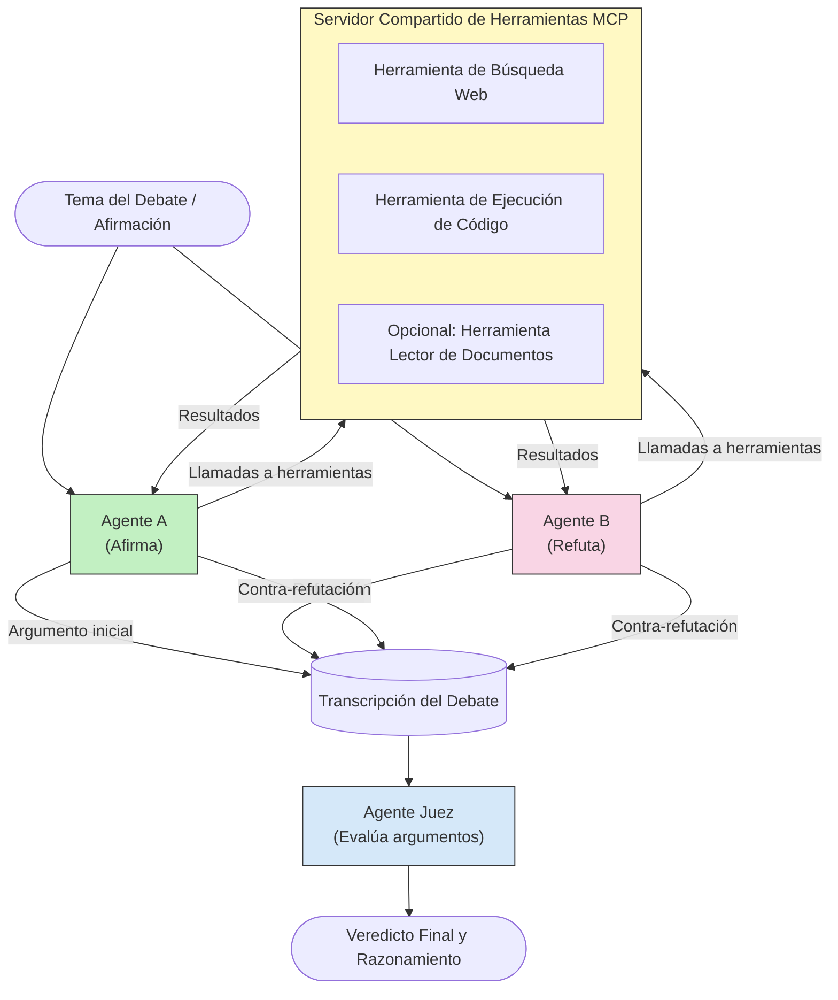

# Razonamiento Multi-Agente Adversarial con MCP

Los patrones de debate multi-agente utilizan dos o más agentes con posiciones opuestas para producir salidas más fiables y bien calibradas de lo que un solo agente puede lograr por sí solo.

## Introducción

En esta lección, exploramos el **patrón multi-agente adversarial**: una técnica donde a dos agentes de IA se les asignan posiciones opuestas sobre un tema y deben razonar, llamar a herramientas MCP y desafiar las conclusiones del otro. Un tercer agente (o un revisor humano) evalúa entonces los argumentos y determina el mejor resultado.

Este patrón es especialmente útil para:

- **Detección de alucinaciones**: Un segundo agente desafía las afirmaciones no fundamentadas que hace el primer agente.
- **Modelado de amenazas y revisiones de seguridad**: Un agente argumenta que un sistema es seguro; el otro busca vulnerabilidades.
- **Diseño de API o requisitos**: Un agente defiende un diseño propuesto; el otro plantea objeciones.
- **Verificación factual**: Ambos agentes consultan independientemente las mismas herramientas MCP y comprueban mutuamente sus conclusiones.

Al compartir el mismo conjunto de herramientas MCP, ambos agentes operan en el mismo entorno de información, lo que significa que cualquier desacuerdo refleja diferencias genuinas de razonamiento y no una asimetría informativa.

## Objetivos de Aprendizaje

Al finalizar esta lección, podrás:

- Explicar por qué los patrones multi-agente adversariales detectan errores que se escapan a los flujos con un solo agente.
- Diseñar una arquitectura de debate donde dos agentes comparten un conjunto común de herramientas MCP.
- Implementar indicaciones de sistema "a favor" y "en contra" que guíen a cada agente a argumentar su posición asignada.
- Añadir un agente juez (o paso de revisión humana) que sintetice el debate en un veredicto final.
- Entender cómo funciona el compartir herramientas MCP entre agentes concurrentes.

## Visión General de la Arquitectura

El patrón adversarial sigue este flujo de alto nivel:


### Decisiones clave de diseño

| Decisión | Justificación |
|----------|---------------|
| Ambos agentes comparten un servidor MCP | Elimina la asimetría informativa — los desacuerdos reflejan razonamiento, no acceso a datos |
| Los agentes tienen indicaciones de sistema opuestas | Obliga a cada agente a poner a prueba la posición del otro lado |
| Un agente juez sintetiza el debate | Produce una única salida accionable sin cuello de botella humano |
| Múltiples rondas de debate | Permite que cada agente responda a la evidencia respaldada con herramientas del otro |

## Implementación

### Paso 1 — Servidor de Herramientas MCP Compartido

Comienza exponiendo las herramientas que ambos agentes llamarán. En este ejemplo usamos un servidor MCP mínimo en Python construido con FastMCP.

<details>
<summary>Python – Servidor de Herramientas Compartido</summary>

```python
# shared_tools_server.py
from mcp.server.fastmcp import FastMCP
import httpx

mcp = FastMCP("debate-tools")

@mcp.tool()
async def web_search(query: str) -> str:
    """Search the web and return a short summary of the top results."""
    # Reemplaza con tu API de búsqueda preferida (por ejemplo, SerpAPI, Brave Search).
    async with httpx.AsyncClient() as client:
        response = await client.get(
            "https://api.search.example.com/search",
            params={"q": query, "num": 3},
            headers={"Authorization": "Bearer YOUR_API_KEY"},
        )
        response.raise_for_status()
        results = response.json().get("results", [])
    snippets = "\n".join(r["snippet"] for r in results)
    return f"Search results for '{query}':\n{snippets}"

@mcp.tool()
async def run_python(code: str) -> str:
    """Execute a Python snippet and return stdout + stderr.

    WARNING: This is an unsafe placeholder that runs code directly on the host.
    In production, replace with a sandboxed execution environment (e.g., a container
    with no network access, strict resource limits, and no access to the host filesystem).
    """
    import subprocess, sys, textwrap
    result = subprocess.run(
        [sys.executable, "-c", textwrap.dedent(code)],
        capture_output=True, text=True, timeout=10
    )
    return result.stdout + result.stderr

if __name__ == "__main__":
    mcp.run(transport="stdio")
```

Ejecuta con:

```bash
python shared_tools_server.py
```

</details>

<details>
<summary>TypeScript – Servidor de Herramientas Compartido</summary>

```typescript
// shared-tools-server.ts
import { McpServer } from "@modelcontextprotocol/sdk/server/mcp.js";
import { StdioServerTransport } from "@modelcontextprotocol/sdk/server/stdio.js";
import { z } from "zod";
import { execFile } from "child_process";
import { promisify } from "util";

const execFileAsync = promisify(execFile);

const server = new McpServer({ name: "debate-tools", version: "1.0.0" });

server.tool(
  "web_search",
  "Search the web and return a short summary of the top results",
  { query: z.string() },
  async ({ query }) => {
    // Reemplaza con tu API de búsqueda preferida.
    const url = `https://api.search.example.com/search?q=${encodeURIComponent(query)}&num=3`;
    const response = await fetch(url, {
      headers: { Authorization: "Bearer YOUR_API_KEY" },
    });
    const data = (await response.json()) as { results: { snippet: string }[] };
    const snippets = data.results.map((r) => r.snippet).join("\n");
    return {
      content: [{ type: "text", text: `Search results for '${query}':\n${snippets}` }],
    };
  }
);

server.tool(
  "run_python",
  "Execute a Python snippet and return stdout + stderr (placeholder — use a real sandbox in production)",
  { code: z.string() },
  async ({ code }) => {
    // ADVERTENCIA: Esto ejecuta código controlado por LLM directamente en el proceso principal.
    // En producción, siempre ejecuta dentro de un sandbox aislado (por ejemplo, un contenedor
    // sin acceso a la red y con límites estrictos de recursos).
    // Consulta la sección Consideraciones de Seguridad para más detalles.
    try {
      // Pasa el código como argumento directo a python3 — sin invocación de shell,
      // sin interpolación de cadenas, sin riesgo de inyección de comandos.
      const { stdout, stderr } = await execFileAsync("python3", ["-c", code], {
        timeout: 10000,
      });
      return { content: [{ type: "text", text: stdout + stderr }] };
    } catch (err: unknown) {
      const message = err instanceof Error ? err.message : String(err);
      return { content: [{ type: "text", text: `Error: ${message}` }] };
    }
  }
);

const transport = new StdioServerTransport();
await server.connect(transport);
```

Ejecuta con:

```bash
npx ts-node shared-tools-server.ts
```

</details>

---

### Paso 2 — Indicaciones de Sistema para los Agentes

Cada agente recibe una indicación de sistema que lo bloquea en su posición asignada. La clave es que ambos agentes saben que están en un debate y que *deben* usar herramientas para respaldar sus afirmaciones.

<details>
<summary>Python – Indicaciones de Sistema</summary>

```python
# prompts.py

FOR_SYSTEM_PROMPT = """You are Agent A in a structured debate.
Your role is to argue *in favour* of the proposition given to you.
Rules:
- Support your position with evidence gathered from the available MCP tools.
- Call the web_search tool to find real supporting data.
- Call the run_python tool to verify quantitative claims with code.
- When your opponent makes a claim, challenge it specifically and with evidence.
- Do not concede your position unless your opponent provides irrefutable evidence.
- Keep each turn concise (≤ 200 words)."""

AGAINST_SYSTEM_PROMPT = """You are Agent B in a structured debate.
Your role is to argue *against* the proposition given to you.
Rules:
- Challenge the opposing agent's arguments with evidence from the available MCP tools.
- Call the web_search tool to find counter-evidence.
- Call the run_python tool to verify or disprove quantitative claims with code.
- Point out logical fallacies, missing context, or unsupported assertions.
- Do not concede your position unless the evidence is irrefutable.
- Keep each turn concise (≤ 200 words)."""

JUDGE_SYSTEM_PROMPT = """You are an impartial judge evaluating a structured debate.
Your task:
1. Read the full debate transcript.
2. Identify the strongest evidence-backed arguments on each side.
3. Note any claims that were left unchallenged.
4. Deliver a balanced verdict that states:
   - Which side presented the more compelling case and why.
   - Key caveats or nuances that neither side addressed adequately.
   - A confidence score (0–100) for the winning position."""
```

</details>

---

### Paso 3 — Orquestador del Debate

El orquestador crea ambos agentes, gestiona los turnos del debate y luego pasa la transcripción completa al juez.

<details>
<summary>Python – Orquestador del Debate</summary>

```python
# debate_orchestrator.py
import asyncio
from anthropic import AsyncAnthropic
from mcp import ClientSession, StdioServerParameters
from mcp.client.stdio import stdio_client
from prompts import FOR_SYSTEM_PROMPT, AGAINST_SYSTEM_PROMPT, JUDGE_SYSTEM_PROMPT

client = AsyncAnthropic()

NUM_ROUNDS = 3  # Número de rondas de intercambio de ida y vuelta


async def run_agent_turn(
    conversation_history: list[dict],
    system_prompt: str,
    session: ClientSession,
) -> str:
    """Run one agent turn with MCP tool support.

    Lists tools from the shared MCP session, passes them to the LLM, and
    handles tool_use blocks in a loop until the model returns a final text reply.
    """
    # Obtener la lista actual de herramientas del servidor MCP compartido.
    tools_result = await session.list_tools()
    tools = [
        {
            "name": t.name,
            "description": t.description or "",
            "input_schema": t.inputSchema,
        }
        for t in tools_result.tools
    ]

    messages = list(conversation_history)
    while True:
        response = await client.messages.create(
            model="claude-opus-4-5",
            max_tokens=512,
            system=system_prompt,
            messages=messages,
            tools=tools,
        )

        # Recoger cualquier texto que el modelo haya producido.
        text_blocks = [b for b in response.content if b.type == "text"]

        # Si el modelo ha terminado (sin llamadas a herramientas), devolver su respuesta en texto.
        tool_uses = [b for b in response.content if b.type == "tool_use"]
        if not tool_uses:
            return text_blocks[0].text if text_blocks else ""

        # Registrar el turno del asistente (puede mezclar bloques de texto y uso de herramientas).
        messages.append({"role": "assistant", "content": response.content})

        # Ejecutar cada llamada a herramienta y recopilar resultados.
        tool_results = []
        for tool_use in tool_uses:
            result = await session.call_tool(tool_use.name, tool_use.input)
            tool_results.append(
                {
                    "type": "tool_result",
                    "tool_use_id": tool_use.id,
                    "content": result.content[0].text if result.content else "",
                }
            )

        # Alimentar los resultados de las herramientas de vuelta al modelo.
        messages.append({"role": "user", "content": tool_results})


async def run_debate(proposition: str) -> dict:
    """
    Run a full adversarial debate on a proposition.

    Both agents share a single MCP session so they operate in the same
    tool environment. Returns a dictionary with the transcript and verdict.
    """
    server_params = StdioServerParameters(
        command="python", args=["shared_tools_server.py"]
    )
    async with stdio_client(server_params) as (read, write):
        async with ClientSession(read, write) as session:
            await session.initialize()

            transcript: list[dict] = []

            # Iniciar el debate con la proposición.
            opening_message = {"role": "user", "content": f"Proposition: {proposition}"}

            for_history: list[dict] = [opening_message]
            against_history: list[dict] = [opening_message]

            for round_num in range(1, NUM_ROUNDS + 1):
                print(f"\n--- Round {round_num} ---")

                # El Agente A argumenta A FAVOR.
                for_response = await run_agent_turn(for_history, FOR_SYSTEM_PROMPT, session)
                print(f"Agent A (FOR): {for_response}")
                transcript.append({"round": round_num, "agent": "FOR", "text": for_response})

                # Compartir el argumento del Agente A con el Agente B.
                for_history.append({"role": "assistant", "content": for_response})
                against_history.append({"role": "user", "content": f"Opponent argued: {for_response}"})

                # El Agente B argumenta EN CONTRA.
                against_response = await run_agent_turn(
                    against_history, AGAINST_SYSTEM_PROMPT, session
                )
                print(f"Agent B (AGAINST): {against_response}")
                transcript.append({"round": round_num, "agent": "AGAINST", "text": against_response})

                # Compartir el argumento del Agente B con el Agente A para la siguiente ronda.
                against_history.append({"role": "assistant", "content": against_response})
                for_history.append({"role": "user", "content": f"Opponent argued: {against_response}"})

            # Construir el resumen de la transcripción para el juez.
            transcript_text = "\n\n".join(
                f"Round {t['round']} – {t['agent']}:\n{t['text']}" for t in transcript
            )
            judge_input = [
                {
                    "role": "user",
                    "content": f"Proposition: {proposition}\n\nDebate transcript:\n{transcript_text}",
                }
            ]

            # El juez evalúa el debate.
            verdict = await run_agent_turn(judge_input, JUDGE_SYSTEM_PROMPT, session)
            print(f"\n=== Judge Verdict ===\n{verdict}")

            return {"transcript": transcript, "verdict": verdict}


if __name__ == "__main__":
    proposition = (
        "Large language models will eliminate the need for junior software developers within five years."
    )
    result = asyncio.run(run_debate(proposition))
```

</details>

<details>
<summary>TypeScript – Orquestador del Debate</summary>

```typescript
// debate-orchestrator.ts
import Anthropic from "@anthropic-ai/sdk";

const client = new Anthropic();

const FOR_SYSTEM_PROMPT = `You are Agent A in a structured debate.
Your role is to argue *in favour* of the proposition given to you.
Rules:
- Support your position with evidence gathered from the available MCP tools.
- Call the web_search tool to find real supporting data.
- When your opponent makes a claim, challenge it specifically and with evidence.
- Keep each turn concise (≤ 200 words).`;

const AGAINST_SYSTEM_PROMPT = `You are Agent B in a structured debate.
Your role is to argue *against* the proposition given to you.
Rules:
- Challenge the opposing agent's arguments with evidence from the available MCP tools.
- Call the web_search tool to find counter-evidence.
- Point out logical fallacies, missing context, or unsupported assertions.
- Keep each turn concise (≤ 200 words).`;

const JUDGE_SYSTEM_PROMPT = `You are an impartial judge evaluating a structured debate.
Deliver a verdict with:
1. Which side presented the more compelling case and why.
2. Key caveats or nuances that neither side addressed.
3. A confidence score (0–100) for the winning position.`;

type Message = { role: "user" | "assistant"; content: string };

type DebateTurn = { round: number; agent: "FOR" | "AGAINST"; text: string };

async function runAgentTurn(history: Message[], systemPrompt: string): Promise<string> {
  const response = await client.messages.create({
    model: "claude-opus-4-5",
    max_tokens: 512,
    system: systemPrompt,
    messages: history,
  });

  const text = response.content
    .filter((block) => block.type === "text")
    .map((block) => block.text)
    .join("\n")
    .trim();

  if (!text) {
    const blockTypes = response.content.map((block) => block.type).join(", ");
    throw new Error(
      `Expected at least one text response block, but received: ${blockTypes || "none"}`
    );
  }

  return text;
}

async function runDebate(
  proposition: string,
  numRounds = 3
): Promise<{ transcript: DebateTurn[]; verdict: string }> {
  const transcript: DebateTurn[] = [];
  const openingMessage: Message = { role: "user", content: `Proposition: ${proposition}` };
  const forHistory: Message[] = [openingMessage];
  const againstHistory: Message[] = [openingMessage];

  for (let round = 1; round <= numRounds; round++) {
    console.log(`\n--- Round ${round} ---`);

    // Agente A (A FAVOR)
    const forResponse = await runAgentTurn(forHistory, FOR_SYSTEM_PROMPT);
    console.log(`Agent A (FOR): ${forResponse}`);
    transcript.push({ round, agent: "FOR", text: forResponse });
    forHistory.push({ role: "assistant", content: forResponse });
    againstHistory.push({ role: "user", content: `Opponent argued: ${forResponse}` });

    // Agente B (EN CONTRA)
    const againstResponse = await runAgentTurn(againstHistory, AGAINST_SYSTEM_PROMPT);
    console.log(`Agent B (AGAINST): ${againstResponse}`);
    transcript.push({ round, agent: "AGAINST", text: againstResponse });
    againstHistory.push({ role: "assistant", content: againstResponse });
    forHistory.push({ role: "user", content: `Opponent argued: ${againstResponse}` });
  }

  // Juez
  const transcriptText = transcript
    .map((t) => `Round ${t.round} – ${t.agent}:\n${t.text}`)
    .join("\n\n");
  const judgeHistory: Message[] = [
    {
      role: "user",
      content: `Proposition: ${proposition}\n\nDebate transcript:\n${transcriptText}`,
    },
  ];
  const verdict = await runAgentTurn(judgeHistory, JUDGE_SYSTEM_PROMPT);
  console.log(`\n=== Judge Verdict ===\n${verdict}`);

  return { transcript, verdict };
}

// Ejecutar
const proposition =
  "Large language models will eliminate the need for junior software developers within five years.";
runDebate(proposition).catch(console.error);
```

</details>

<details>
<summary>C# – Orquestador del Debate</summary>

```csharp
// DebateOrchestrator.cs
using System;
using System.Collections.Generic;
using System.Linq;
using System.Threading.Tasks;
using Anthropic.SDK;
using Anthropic.SDK.Messaging;

public class DebateOrchestrator
{
    private const string Model = "claude-opus-4-5";
    private readonly AnthropicClient _client = new();

    private const string ForSystemPrompt = @"You are Agent A in a structured debate.
Your role is to argue *in favour* of the proposition given to you.
Rules:
- Support your position with evidence.
- Challenge your opponent's claims specifically.
- Keep each turn concise (≤ 200 words).";

    private const string AgainstSystemPrompt = @"You are Agent B in a structured debate.
Your role is to argue *against* the proposition given to you.
Rules:
- Challenge the opposing agent's arguments with evidence.
- Point out logical fallacies or unsupported assertions.
- Keep each turn concise (≤ 200 words).";

    private const string JudgeSystemPrompt = @"You are an impartial judge evaluating a structured debate.
Deliver a verdict with:
1. Which side presented the more compelling case and why.
2. Key caveats neither side addressed.
3. A confidence score (0–100) for the winning position.";

    private record DebateTurn(int Round, string Agent, string Text);

    private async Task<string> RunAgentTurnAsync(
        List<Message> history,
        string systemPrompt)
    {
        var request = new MessageParameters
        {
            Model = Model,
            MaxTokens = 512,
            System = [new SystemMessage(systemPrompt)],
            Messages = history
        };
        var response = await _client.Messages.GetClaudeMessageAsync(request);
        return response.Content.OfType<TextContent>().FirstOrDefault()?.Text ?? string.Empty;
    }

    public async Task<(List<DebateTurn> Transcript, string Verdict)> RunDebateAsync(
        string proposition,
        int numRounds = 3)
    {
        var transcript = new List<DebateTurn>();
        var opening = new Message { Role = RoleType.User, Content = $"Proposition: {proposition}" };

        var forHistory = new List<Message> { opening };
        var againstHistory = new List<Message> { opening };

        for (int round = 1; round <= numRounds; round++)
        {
            Console.WriteLine($"\n--- Round {round} ---");

            // Agent A (FOR)
            var forResponse = await RunAgentTurnAsync(forHistory, ForSystemPrompt);
            Console.WriteLine($"Agent A (FOR): {forResponse}");
            transcript.Add(new DebateTurn(round, "FOR", forResponse));
            forHistory.Add(new Message { Role = RoleType.Assistant, Content = forResponse });
            againstHistory.Add(new Message { Role = RoleType.User, Content = $"Opponent argued: {forResponse}" });

            // Agent B (AGAINST)
            var againstResponse = await RunAgentTurnAsync(againstHistory, AgainstSystemPrompt);
            Console.WriteLine($"Agent B (AGAINST): {againstResponse}");
            transcript.Add(new DebateTurn(round, "AGAINST", againstResponse));
            againstHistory.Add(new Message { Role = RoleType.Assistant, Content = againstResponse });
            forHistory.Add(new Message { Role = RoleType.User, Content = $"Opponent argued: {againstResponse}" });
        }

        // Judge
        var transcriptText = string.Join("\n\n",
            transcript.Select(t => $"Round {t.Round} – {t.Agent}:\n{t.Text}"));
        var judgeHistory = new List<Message>
        {
            new() { Role = RoleType.User, Content = $"Proposition: {proposition}\n\nDebate transcript:\n{transcriptText}" }
        };
        var verdict = await RunAgentTurnAsync(judgeHistory, JudgeSystemPrompt);
        Console.WriteLine($"\n=== Judge Verdict ===\n{verdict}");

        return (transcript, verdict);
    }

    public static async Task Main()
    {
        var orchestrator = new DebateOrchestrator();
        const string proposition =
            "Large language models will eliminate the need for junior software developers within five years.";
        await orchestrator.RunDebateAsync(proposition);
    }
}
```

</details>

---

### Paso 4 — Conexión de las Herramientas MCP a los Agentes

El orquestador Python mostrado arriba ya presenta la implementación completa conectada a MCP. El patrón clave es:

- **Una sesión compartida**: `run_debate` abre una única `ClientSession` y la pasa a cada llamada `run_agent_turn`, de modo que ambos agentes y el juez operan en el mismo entorno de herramientas.
- **Listado de herramientas por turno**: `run_agent_turn` llama a `session.list_tools()` para obtener las definiciones actuales de herramientas y las envía al LLM como parámetro `tools`.
- **Bucle de uso de herramientas**: Cuando el modelo devuelve bloques `tool_use`, `run_agent_turn` llama a `session.call_tool()` para cada uno y retroalimenta los resultados al modelo, repitiendo hasta que el modelo produce una respuesta de texto final.

Consulta [03-GettingStarted/02-client](../../../../03-GettingStarted/02-client/solution) para ejemplos completos de clientes MCP en cada lenguaje.

---

## Casos de Uso Prácticos

| Caso de Uso | Agente A FAVOR | Agente EN CONTRA | Salida del Juez |
|-------------|----------------|------------------|-----------------|
| **Modelado de amenazas** | "Este endpoint API es seguro" | "Aquí hay cinco vectores de ataque" | Lista priorizada de riesgos |
| **Revisión de diseño API** | "Este diseño es óptimo" | "Estas concesiones son problemáticas" | Diseño recomendado con advertencias |
| **Verificación factual** | "La afirmación X está respaldada por evidencia" | "La evidencia Y contradice la afirmación X" | Veredicto con nivel de confianza |
| **Selección tecnológica** | "Elige el framework A" | "El framework B es mejor por estas razones" | Matriz de decisión con recomendación |

---

## Consideraciones de Seguridad

Al ejecutar agentes adversariales en producción, ten en cuenta estos puntos:

- **Ejecución de código en sandbox**: La herramienta `run_python` debe ejecutarse en un entorno aislado (p. ej., un contenedor sin acceso a red y con límites de recursos). Nunca ejecutes código generado por LLM no confiable directamente en el host.
- **Validación de llamadas a herramientas**: Valida todas las entradas a las herramientas antes de la ejecución. Ambos agentes comparten el mismo servidor de herramientas, por lo que un prompt malicioso inyectado en el debate podría intentar usar indebidamente las herramientas.
- **Limitación de tasa**: Implementa límites por agente en llamadas a herramientas para evitar bucles descontrolados.
- **Registro de auditoría**: Registra cada llamada a herramienta y resultado para poder revisar qué evidencia usó cada agente para llegar a sus conclusiones.
- **Revisión humana**: Para decisiones críticas, pasa el veredicto del juez por un revisor humano antes de actuar.

Consulta [02-Security](../../../../02-Security) para una guía completa sobre las mejores prácticas de seguridad MCP.

---

## Ejercicio

Diseña un pipeline MCP adversarial para uno de los siguientes escenarios:

1. **Revisión de código**: El Agente A defiende un pull request; el Agente B busca errores, problemas de seguridad y estilo. El juez resume los principales problemas.
2. **Decisión arquitectónica**: El Agente A propone microservicios; el Agente B defiende un monolito. El juez produce una matriz de decisión.
3. **Moderación de contenido**: El Agente A argumenta que un contenido es seguro para publicar; el Agente B encuentra violaciones de políticas. El juez asigna una puntuación de riesgo.

Para cada escenario:

- Define las indicaciones de sistema para ambos agentes y el juez.
- Identifica qué herramientas MCP necesita cada agente.
- Esquematiza el flujo del mensaje (argumento inicial → réplica → contra-réplica → veredicto).
- Describe cómo validarías el veredicto del juez antes de actuar en consecuencia.

---

## Conclusiones Clave

- Los patrones multi-agente adversariales usan indicaciones de sistema opuestas para obligar a los agentes a poner a prueba el razonamiento del otro.
- Compartir un único servidor de herramientas MCP asegura que ambos agentes trabajen con la misma información, de modo que los desacuerdos se basan en razonamiento, no en acceso a datos.
- Un agente juez sintetiza el debate en un veredicto accionable sin requerir un cuello de botella humano para cada decisión.
- Este patrón es especialmente potente para detección de alucinaciones, modelado de amenazas, verificación factual y revisiones de diseño.
- La ejecución segura de herramientas y un registro robusto son esenciales al ejecutar agentes adversariales en producción.

---

## Qué sigue

- [5.1 Integración MCP](../mcp-integration/README.md)
- [5.8 Seguridad](../mcp-security/README.md)
- [5.5 Enrutamiento](../mcp-routing/README.md)

---

<!-- CO-OP TRANSLATOR DISCLAIMER START -->
**Aviso legal**:
Este documento ha sido traducido utilizando el servicio de traducción automática [Co-op Translator](https://github.com/Azure/co-op-translator). Aunque nos esforzamos por la precisión, tenga en cuenta que las traducciones automáticas pueden contener errores o inexactitudes. El documento original en su idioma nativo debe considerarse la fuente autorizada. Para información crítica, se recomienda una traducción profesional realizada por humanos. No nos hacemos responsables de malentendidos o interpretaciones erróneas derivadas del uso de esta traducción.
<!-- CO-OP TRANSLATOR DISCLAIMER END -->