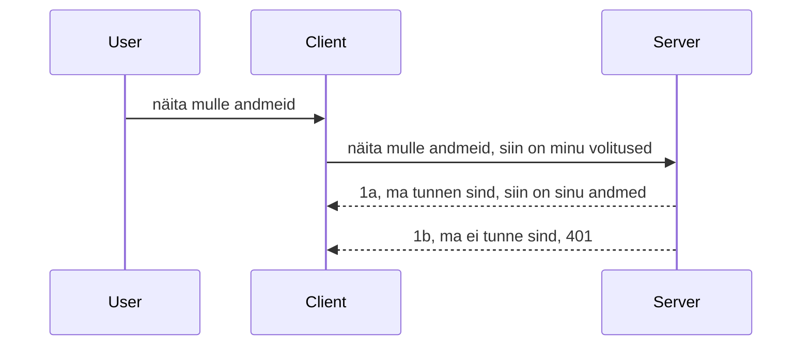

# Lihtne autentimine

MCP SDK-d toetavad OAuth 2.1 kasutamist, mis ausalt öeldes on üsna keeruline protsess, hõlmates mõisteid nagu autentimisteenus, ressursiserver, tunnistuste postitamine, koodi saamine, koodi vahetamine omajalase-juurdepääsutunnuseks, kuni lõpuks saad kätte oma ressursiandmed. Kui sa pole OAuthiga harjunud, mis on suurepärane asi kasutusele võtta, on hea mõte alustada mõnest baastaseme autentimisest ja seejärel liikuda parema ja parema turvalisuse suunas. Just sellepärast see peatükk eksisteerib, et sind viia sammhaaval edasi keerukama autentimiseni.

## Autentimine, mida me mõtleme?

Autentimine on lühend autentimisest ja autoriseerimisest. Idee on selles, et meil tuleb teha kaks asja:

- **Autentimine**, mis on protsess, mille käigus selgitame välja, kas me laseme inimesel meie majja siseneda, et tal on õigus olla „siin“, ehk tal on ligipääs meie ressursiserverile, kus toimib meie MCP server.
- **Autoriseerimine**, on protsess, mille käigus tõestame, kas kasutajal peaks olema ligipääs just neile konkreetsetele ressurssidele, mida ta küsib, näiteks need tellimused või need tooted või kas tal on lubatud sisu lugeda, kuid mitte kustutada, nagu teine näide.

## Tunnistused: kuidas me süsteemile räägime, kes me oleme

Noh, enamik veebi arendajaid hakkab mõtlema selle järgi, et anda serverile tunnistus, tavaliselt saladus (salajane võti), mis ütleb, kas neil on õigus olla siin „autentimine“. Sageli on see tunnistus base64 kodeeritud kasutajanime ja parooli versioon või API võti, mis unikaalselt identifitseerib konkreetse kasutaja.

See käib saatmise kaudu päises nimega „Authorization“ nii:

```json
{ "Authorization": "secret123" }
```

Seda nimetatakse tavaliselt baasauthentimiseks. Kuidas üldine voog siis töötab, on järgmine:


Nüüd, kui me saame aru, kuidas see töötab voona, siis kuidas me selle rakendame? Enamik veebiservereid kasutab mõistet middleware ehk vahevara, mis on koodilõik, mis jookseb osana päringust, kontrollib tunnistust ja kui tunnistus on kehtiv, laseb päringu läbi. Kui päringul puudub kehtiv tunnistus, saad autentimisel veateate. Vaatame, kuidas seda saab rakendada:

**Python**

```python
class AuthMiddleware(BaseHTTPMiddleware):
    async def dispatch(self, request, call_next):

        has_header = request.headers.get("Authorization")
        if not has_header:
            print("-> Missing Authorization header!")
            return Response(status_code=401, content="Unauthorized")

        if not valid_token(has_header):
            print("-> Invalid token!")
            return Response(status_code=403, content="Forbidden")

        print("Valid token, proceeding...")
       
        response = await call_next(request)
        # lisa kliendi päised või muuda vastust mingil moel
        return response


starlette_app.add_middleware(CustomHeaderMiddleware)
```

Siin me oleme:

- Loonud middleware'i nimega `AuthMiddleware`, mille `dispatch` meetodit kutsub veebiserver.
- Lisanud middleware veebiserverisse:

    ```python
    starlette_app.add_middleware(AuthMiddleware)
    ```

- Kirjutanud valideerimisloogika, mis kontrollib, kas päis Authorization on olemas ja kas saadetav saladus on kehtiv:

    ```python
    has_header = request.headers.get("Authorization")
    if not has_header:
        print("-> Missing Authorization header!")
        return Response(status_code=401, content="Unauthorized")

    if not valid_token(has_header):
        print("-> Invalid token!")
        return Response(status_code=403, content="Forbidden")
    ```

    kui saladus on olemas ja kehtiv, lubame päringu edasi, kutsudes `call_next` ja tagastades vastuse.

    ```python
    response = await call_next(request)
    # lisa igasugused kliendi päised või muuda vastust mingil moel
    return response
    ```

See toimib nii, et kui veebipäring tehakse serverile, kutsutakse middleware välja ja selle rakenduse põhjal lastakse päring kas läbi või tagastatakse viga, mis näitab, et kliendil pole luba jätkata.

**TypeScript**

Siin loome middleware’i populaarses raamistikus Express ja püüame päringu kinni enne kui see jõuab MCP serverini. Kood näeb välja nii:

```typescript
function isValid(secret) {
    return secret === "secret123";
}

app.use((req, res, next) => {
    // 1. Kas autoriseerimise päis on olemas?
    if(!req.headers["Authorization"]) {
        res.status(401).send('Unauthorized');
    }
    
    let token = req.headers["Authorization"];

    // 2. Kontrolli kehtivust.
    if(!isValid(token)) {
        res.status(403).send('Forbidden');
    }

   
    console.log('Middleware executed');
    // 3. Edastab päringu järgmisele etapile päringu töövoos.
    next();
});
```

Selles koodis:

1. Kontrollime, kas päis Authorization on esindatud; kui puudub, saadame 401 vea.
2. Tagame, et tunnistus/token on kehtiv, kui mitte, saadame 403 vea.
3. Lõpuks lastakse päring edasi ning tagastatakse küsitud ressurss.

## Harjutus: rakenda autentimine

Võtame oma teadmised ja proovime seda rakendada. Plaan on järgmine:

Server

- Loo veebiserver ja MCP instants.
- Rakenda serveri jaoks middleware.

Klient

- Saada veebipäring tunnistusega päise kaudu.

### -1- Loo veebiserver ja MCP instants

Esimesel sammul peame looma veebiserveri instantsi ja MCP serveri.

**Python**

Siin loome MCP serveri instantsi, teeme starlette veebirakenduse ja majutame selle uvicorni abil.

```python
# MCP serveri loomine

app = FastMCP(
    name="MCP Resource Server",
    instructions="Resource Server that validates tokens via Authorization Server introspection",
    host=settings["host"],
    port=settings["port"],
    debug=True
)

# starlette veebirakenduse loomine
starlette_app = app.streamable_http_app()

# rakenduse teenindamine uvicorni kaudu
async def run(starlette_app):
    import uvicorn
    config = uvicorn.Config(
            starlette_app,
            host=app.settings.host,
            port=app.settings.port,
            log_level=app.settings.log_level.lower(),
        )
    server = uvicorn.Server(config)
    await server.serve()

run(starlette_app)
```

Selles koodis me:

- Loome MCP serveri.
- Koostame starlette veebirakenduse MCP serverist, `app.streamable_http_app()`.
- Majutame ja teenindame veebirakendust uvicorn'iga `server.serve()`.

**TypeScript**

Siin loome MCP serveri instantsi.

```typescript
const server = new McpServer({
      name: "example-server",
      version: "1.0.0"
    });

    // ... seadistage serveri ressursid, tööriistad ja vihjed ...
```

See MCP serveri loomine peab toimuma meie POST /mcp marsruudi definitsiooni sees, seega võtame ülaloleva koodi ja viime selle nii:

```typescript
import express from "express";
import { randomUUID } from "node:crypto";
import { McpServer } from "@modelcontextprotocol/sdk/server/mcp.js";
import { StreamableHTTPServerTransport } from "@modelcontextprotocol/sdk/server/streamableHttp.js";
import { isInitializeRequest } from "@modelcontextprotocol/sdk/types.js"

const app = express();
app.use(express.json());

// Kaart transportide salvestamiseks sessiooni ID järgi
const transports: { [sessionId: string]: StreamableHTTPServerTransport } = {};

// Handlegi POST-päringud kliendi ja serveri vaheliseks suhtluseks
app.post('/mcp', async (req, res) => {
  // Kontrolli olemasolevat sessiooni ID-d
  const sessionId = req.headers['mcp-session-id'] as string | undefined;
  let transport: StreamableHTTPServerTransport;

  if (sessionId && transports[sessionId]) {
    // Taaskasuta olemasolevat transporti
    transport = transports[sessionId];
  } else if (!sessionId && isInitializeRequest(req.body)) {
    // Uus initsialiseerimisnõue
    transport = new StreamableHTTPServerTransport({
      sessionIdGenerator: () => randomUUID(),
      onsessioninitialized: (sessionId) => {
        // Salvesta transport sessiooni ID järgi
        transports[sessionId] = transport;
      },
      // DNS taaskinnituse kaitse on vaikimisi keelatud tagurpidi ühilduvuse tõttu. Kui käivitad seda serverit
      // lokaalselt, veendu, et seadistad:
      // enableDnsRebindingProtection: true,
      // allowedHosts: ['127.0.0.1'],
    });

    // Puhasta transport selle sulgemisel
    transport.onclose = () => {
      if (transport.sessionId) {
        delete transports[transport.sessionId];
      }
    };
    const server = new McpServer({
      name: "example-server",
      version: "1.0.0"
    });

    // ... seadista serveri ressursid, tööriistad ja käsud ...

    // Ühendu MCP serveriga
    await server.connect(transport);
  } else {
    // Vigane päring
    res.status(400).json({
      jsonrpc: '2.0',
      error: {
        code: -32000,
        message: 'Bad Request: No valid session ID provided',
      },
      id: null,
    });
    return;
  }

  // Töötle päringut
  await transport.handleRequest(req, res, req.body);
});

// Taaskasutatav käitleja GET ja DELETE päringutele
const handleSessionRequest = async (req: express.Request, res: express.Response) => {
  const sessionId = req.headers['mcp-session-id'] as string | undefined;
  if (!sessionId || !transports[sessionId]) {
    res.status(400).send('Invalid or missing session ID');
    return;
  }
  
  const transport = transports[sessionId];
  await transport.handleRequest(req, res);
};

// Handlegi GET-päringud serveri ja kliendi vahelisteks teadeteks SSE kaudu
app.get('/mcp', handleSessionRequest);

// Handlegi DELETE-päringud sessiooni lõpetamiseks
app.delete('/mcp', handleSessionRequest);

app.listen(3000);
```

Nüüd näed, kuidas MCP serveri loomine viidi sisse `app.post("/mcp")`.

Liigume järgmiseks sammuks, middleware loomiseks, et saaksime sisenevat tunnistust valideerida.

### -2- Rakenda serveri middleware

Järgmisena tegeleme middleware parteiga. Loome middleware'i, mis otsib tunnistust `Authorization` päisest ja valideerib selle. Kui see sobib, siis saadetakse päring edasi, et teha seda, mida vaja (nt loetleda tööriistad, lugeda ressurssi või mis iganes MCP funktsionaalsus klient palus).

**Python**

Middleware loomiseks peame looma klassi, mis pärib `BaseHTTPMiddleware`-st. On kaks huvitavat osa:

- Päring `request`, kust loeme päise informatsiooni.
- `call_next`, tagasilöök, mida tuleb kutsuda, kui klient on toonud tunnistuse, mida me aktsepteerime.

Esiteks tuleb tegeleda olukorraga, kui `Authorization` päis puudub:

```python
has_header = request.headers.get("Authorization")

# päist pole, ebaõnnestu koodiga 401, muidu liigu edasi.
if not has_header:
    print("-> Missing Authorization header!")
    return Response(status_code=401, content="Unauthorized")
```

Siin saadame 401 loata sõnumi kuna klient ebaõnnestub autentimisel.

Järgmisena, kui tunnistus esitati, kontrollime selle kehtivust järgmiselt:

```python
 if not valid_token(has_header):
    print("-> Invalid token!")
    return Response(status_code=403, content="Forbidden")
```

Pane tähele, et siin saadame 403 keelatud sõnumi. Vaatame kogu middleware'i allpool, mis rakendab kõike eelmainitut:

```python
class AuthMiddleware(BaseHTTPMiddleware):
    async def dispatch(self, request, call_next):

        has_header = request.headers.get("Authorization")
        if not has_header:
            print("-> Missing Authorization header!")
            return Response(status_code=401, content="Unauthorized")

        if not valid_token(has_header):
            print("-> Invalid token!")
            return Response(status_code=403, content="Forbidden")

        print("Valid token, proceeding...")
        print(f"-> Received {request.method} {request.url}")
        response = await call_next(request)
        response.headers['Custom'] = 'Example'
        return response

```

Suurepärane, aga mis saab `valid_token` funktsioonist? See on allpool:

```python
# ÄRGE kasutage tootmises - täiustage see !!
def valid_token(token: str) -> bool:
    # eemaldage "Bearer " eessõna
    if token.startswith("Bearer "):
        token = token[7:]
        return token == "secret-token"
    return False
```

See vajaks muidugi parandamist.

OLULINE: koodis ei tohiks kunagi hoida selliseid saladusi. Soovitav on hankida võrdlusväärtus andmeallikast või IDP-st (identiteediteenuse pakkujast) või veel parem lasta IDP-l valideerida.

**TypeScript**

Expressi puhul rakendades vajame `use` meetodit, mis võtab middleware funktsioonid.

Me peame:

- Suhtlema päringu muutujaga, et kontrollida `Authorization` tunnistust.
- Valideerima tunnistust ning kui sobib, siis laskma päringu edasi ja lubama kliendi MCP päringul teha oma töö (nt loetleda tööriistad, lugeda ressurssi või midagi MCP-ga seotud).

Siin kontrollime, kas `Authorization` päis on olemas ja kui pole, katkestame päringu:

```typescript
if(!req.headers["authorization"]) {
    res.status(401).send('Unauthorized');
    return;
}
```

Kui päist ei suhtlusta, saad 401.

Seejärel kontrollime, kas tunnistus on kehtiv; kui pole, katkestame päringu erineva sõnumiga:

```typescript
if(!isValid(token)) {
    res.status(403).send('Forbidden');
    return;
} 
```

Nüüd saad 403 vea.

Siin on kogu kood:

```typescript
app.use((req, res, next) => {
    console.log('Request received:', req.method, req.url, req.headers);
    console.log('Headers:', req.headers["authorization"]);
    if(!req.headers["authorization"]) {
        res.status(401).send('Unauthorized');
        return;
    }
    
    let token = req.headers["authorization"];

    if(!isValid(token)) {
        res.status(403).send('Forbidden');
        return;
    }  

    console.log('Middleware executed');
    next();
});
```

Oleme seadistanud veebiserveri aktsepteerima middleware, mis kontrollib tunnistust, mida klient loodetavasti saadab. Aga kuidas on klient ise?

### -3- Saada veebipäring tunnistusega päises

Peame veenduma, et klient kannab tunnistust päises üle. Kuna kasutame MCP klienti, peame välja mõtlema, kuidas seda teha.

**Python**

Kliendi poolel peame saatma päises tunnistuse nii:

```python
# ÄRGE kodeerige väärtust kõvadeks, hoidke see vähemalt keskkonnamuutujas või turvalisemas salvestuskohas
token = "secret-token"

async with streamablehttp_client(
        url = f"http://localhost:{port}/mcp",
        headers = {"Authorization": f"Bearer {token}"}
    ) as (
        read_stream,
        write_stream,
        session_callback,
    ):
        async with ClientSession(
            read_stream,
            write_stream
        ) as session:
            await session.initialize()
      
            # TEGEMATA, mida soovite kliendis teha, nt tööriistade nimekiri, tööriistade kutsumine jne.
```

Pane tähele, et täidame `headers` atribuudi nii: `headers = {"Authorization": f"Bearer {token}"}`.

**TypeScript**

Saame selle lahendada kahes etapis:

1. Täida konfiguratsioon objekt meie tunnistusega.
2. Anna konfiguratsioon objekt transpordile.

```typescript

// ÄRGE määrake väärtust kõvasti kodeeritult nagu siin näidatud. Vähemalt hoidke see keskkonnamuutujana ja kasutage midagi sellist nagu dotenv (arendusrežiimis).
let token = "secret123"

// määratlege kliendi transpordi valikute objekt
let options: StreamableHTTPClientTransportOptions = {
  sessionId: sessionId,
  requestInit: {
    headers: {
      "Authorization": "secret123"
    }
  }
};

// edastage valikute objekt transpordile
async function main() {
   const transport = new StreamableHTTPClientTransport(
      new URL(serverUrl),
      options
   );
```

Ülal näed, kuidas loodi `options` objekt ja pandi päised `requestInit` omaduse alla.

OLULINE: Kuidas seda paremaks muuta? Praegusel rakendusel on mitmeid puudusi. Esiteks on tunnistuse saatmine nii riskantne, kui sul pole kindlasti HTTPS-i. Isegi siis võib tunnistus varastada, nii et on vaja süsteemi, kus saab tokenid tühistada ning lisada täiendavaid kontrollid, näiteks sealt, kus maailmas see pärineb, kas päring toimub liiga tihti (botilaadne käitumine), üldjoontes on palju ohte.

Seda öeldes, väga lihtsatele API-dele, kus sa ei soovi, et keegi kutsub sinu API-d ilma autentimiseta, mis meil siin on, on see hea algus.

Sellele tuginedes proovime veidi tugevdada turvalisust, kasutades standardiseeritud vormingut nagu JSON Web Token ehk JWT või "JOT" tokenid.

## JSON Web Tokenid, JWT

Proovime asju paremaks muuta, kasutades väga lihtsate tunnistuste asemel JWT-sid. Millised on kohesed parendused JWT kasutamisel?

- **Turvalisuse paranemine**. Baasautentimises saadad kasutajanime ja parooli base64 kodeeritud tokenina (või API võtme) ikka ja jälle, suurendades riski. JWTs saadad kasutajanime ja parooli, saad vastu tokeni, mis on ajapiiranguga ehk aegub. JWT võimaldab hõlpsasti kasutada peenhäälestatud ligipääsu kontrolli koos rollide, ulatuste ja õigustega.
- **Olemitu olek ja skaleeritavus**. JWT sisaldab kogu kasutaja infot ja elimineerib vajaduse serveripoolselt seansisalvestuseks. Tokenit saab valideerida ka lokaalselt.
- **Koostoimivus ja föderatsioon**. JWT on Open ID Connect keskne osa ning seda kasutatakse tuntud identiteedipakkujate, nagu Entra ID, Google Identity ja Auth0 puhul. See võimaldab sisselogimist ühe korraga ja palju muud, muutes selle ettevõtte tasemel lahenduseks.
- **Moodulaarne ja paindlik**. JWT-sid saab kasutada ka API väravate nagu Azure API Management, NGINX jm puhul. Samuti toetab see kasutaja autentimise stsenaariumeid ja serveri vahelisi suhtlusi, sealhulgas esindamist ja volitusi.
- **Tõhusus ja vahemällu salvestamine**. JWT-sid saab dešifreerimise järel vahemällu panna, vähendades vajadust neid pidevalt parsida. See aitab eriti suure liiklusega rakendustes, parandades läbilaskevõimet ja vähendades koormust infrastruktuurile.
- **Täiustatud funktsioonid**. Toetab introspektsiooni (kehtivuse kontroll serveris) ja tühistamist (tokeni kehtetuks muutmine).

Kõigi nende eelistega vaatame, kuidas saame oma rakendust järgmisele tasemele viia.

## Baasauthist JWT-ks muutmine

Peamised muudatused, mida meil vaja teha on:

- **Õppida moodustama JWT token** ja olla valmis seda kliendilt serverile saatma.
- **Valideerida JWT tokenit** ja kui see on korrektne, lubada klienti meie ressurssidele.
- **Turvaline tokeni hoiustamine**. Kuidas hoiustada seda tokenit.
- **Marsruutide kaitsmine**. Me peame kaitsma marsruute, meie puhul MCP marsruute ja konkreetseid funktsioone.
- **Lisa värskendustokenid**. Tagada, et loome lühiajalisi tokeneid ja pikaajalisi värskendustokeneid, mida saab kasutada uute tokenite saamiseks, kui aeguvad. Samuti peab olema värskendamise lõpp-punkt ja rotatsioonistrateegia.

### -1- Koosta JWT token

Esiteks koosneb JWT token järgmistest osadest:

- **päis**, milles määratakse kasutatav algoritm ja tokeni tüüp.
- **koormus** (payload), kus on deklaratsioonid ehk claims, nt sub (kasutaja või entiteet, kellele token kuulub. Autentimisstsenaariumis on see tavaliselt kasutaja ID), exp (aegumistähtaeg), role (roll).
- **allkiri**, mis on allkirjastatud salajase võti või privaatvõtmega.

Selle jaoks peame koostama päise, koormuse ja kodeeritud tokeni.

**Python**

```python

import jwt
import jwt
from jwt.exceptions import ExpiredSignatureError, InvalidTokenError
import datetime

# Salajane võti, mida kasutatakse JWT allkirjastamiseks
secret_key = 'your-secret-key'

header = {
    "alg": "HS256",
    "typ": "JWT"
}

# kasutaja info ja selle nõuded ning aegumisaeg
payload = {
    "sub": "1234567890",               # Teema (kasutaja ID)
    "name": "User Userson",                # Kohandatud nõue
    "admin": True,                     # Kohandatud nõue
    "iat": datetime.datetime.utcnow(),# Väljastamise aeg
    "exp": datetime.datetime.utcnow() + datetime.timedelta(hours=1)  # Aegumistähtaeg
}

# kodeeri see
encoded_jwt = jwt.encode(payload, secret_key, algorithm="HS256", headers=header)
```

Ülaltoodud koodis oleme:

- Määratlenud päise, kasutades algoritmina HS256 ja tüüpi JWT.
- Koostanud koormuse, mis sisaldab subjekti ehk kasutaja id, kasutajanime, rolli, väljastamise aega ja aegumise aega, rakendades seega ajapiirangut.

**TypeScript**

Siin vajame mõningaid sõltuvusi, mis aitavad meil JWT tokenit luua.

Sõltuvused

```sh

npm install jsonwebtoken
npm install --save-dev @types/jsonwebtoken
```

Kui see on olemas, loome päise, koormuse ja sellest genereerime kodeeritud tokeni.

```typescript
import jwt from 'jsonwebtoken';

const secretKey = 'your-secret-key'; // Kasutage tootmises keskkonnamuutujaid

// Määratle sõnumi sisu
const payload = {
  sub: '1234567890',
  name: 'User usersson',
  admin: true,
  iat: Math.floor(Date.now() / 1000), // Väljastatud kellaaeg
  exp: Math.floor(Date.now() / 1000) + 60 * 60 // Aegub 1 tunni pärast
};

// Määratle päis (valikuline, jsonwebtoken seab vaikimisi)
const header = {
  alg: 'HS256',
  typ: 'JWT'
};

// Loo token
const token = jwt.sign(payload, secretKey, {
  algorithm: 'HS256',
  header: header
});

console.log('JWT:', token);
```

See token on:

Allkirjastatud HS256-ga
Kehtib 1 tund
Sisaldab deklaratsioone nagu sub, name, admin, iat ja exp.

### -2- Tokeni valideerimine

Samuti peame tokenit valideerima, seda teeme serveris, et veenduda, et klient saadab meile kehtiva väärtuse. Palju kontrollimisi peab olema, alates struktuuri kontrollist kuni kehtivuse kontrollini. Soovitame lisaks veenduda, et kasutaja on süsteemis olemas ja muudki.

Tokeni valideerimiseks peame selle dekodeerima, et seda lugeda, ja siis alustada kehtivuse kontrolli:

**Python**

```python

# Lahti kodeeri ja kontrolli JWT-d
try:
    decoded = jwt.decode(token, secret_key, algorithms=["HS256"])
    print("✅ Token is valid.")
    print("Decoded claims:")
    for key, value in decoded.items():
        print(f"  {key}: {value}")
except ExpiredSignatureError:
    print("❌ Token has expired.")
except InvalidTokenError as e:
    print(f"❌ Invalid token: {e}")

```

Selles koodis kutsume `jwt.decode` funktsiooni, kasutades tokenit, salajast võtit ja valitud algoritmi. Pane tähele, et kasutame try-catch konstruktsiooni, kuna valideerimine ebaõnnestub tõstatab vea.

**TypeScript**

Siin peame kutsuma `jwt.verify`, et saada dekodeeritud token, mida analüüsida. Kui see kutse ebaõnnestub, tähendab see, et tokeni struktuur on vale või see pole enam kehtiv.

```typescript

try {
  const decoded = jwt.verify(token, secretKey);
  console.log('Decoded Payload:', decoded);
} catch (err) {
  console.error('Token verification failed:', err);
}
```

MÄRKUS: nagu eelnevalt mainitud, peaks tegema täiendavaid kontrollimisi, et näha, kas token viitab kasutajale meie süsteemis ja kas kasutajal on nõutud õigused.

Järgmisena vaatleme rollipõhist ligipääsukontrolli (RBAC).
## Rollipõhise juurdepääsu kontrolli lisamine

Idee on see, et me tahame väljendada, et erinevatel rollidel on erinevad õigused. Näiteks eeldame, et administraator saab kõike teha, tavakasutaja saab lugeda/kirjutada ja külaline saab ainult lugeda. Seetõttu on siin mõned võimalikud õigustasemed:

- Admin.Write 
- User.Read
- Guest.Read

Vaatame, kuidas saame sellist kontrolli kesktarkvaraga (middleware) rakendada. Kesktarkvara saab lisada nii igale marsruudile eraldi kui ka kõigile marsruutidele korraga.

**Python**

```python
from starlette.middleware.base import BaseHTTPMiddleware
from starlette.responses import JSONResponse
import jwt

# ÄRA hoia saladust koodis nii, see on ainult demonstreerimiseks. Loe see turvalisest kohast.
SECRET_KEY = "your-secret-key" # pane see keskkonnamuutujasse
REQUIRED_PERMISSION = "User.Read"

class JWTPermissionMiddleware(BaseHTTPMiddleware):
    async def dispatch(self, request, call_next):
        auth_header = request.headers.get("Authorization")
        if not auth_header or not auth_header.startswith("Bearer "):
            return JSONResponse({"error": "Missing or invalid Authorization header"}, status_code=401)

        token = auth_header.split(" ")[1]
        try:
            decoded = jwt.decode(token, SECRET_KEY, algorithms=["HS256"])
        except jwt.ExpiredSignatureError:
            return JSONResponse({"error": "Token expired"}, status_code=401)
        except jwt.InvalidTokenError:
            return JSONResponse({"error": "Invalid token"}, status_code=401)

        permissions = decoded.get("permissions", [])
        if REQUIRED_PERMISSION not in permissions:
            return JSONResponse({"error": "Permission denied"}, status_code=403)

        request.state.user = decoded
        return await call_next(request)


```

Kesktarkvara lisamiseks on mõned erinevad viisid, näiteks allpool:

```python

# Alt 1: lisa vahemehhanism Starlette rakendust ehitades
middleware = [
    Middleware(JWTPermissionMiddleware)
]

app = Starlette(routes=routes, middleware=middleware)

# Alt 2: lisa vahemehhanism pärast Starlette rakenduse ehitamist
starlette_app.add_middleware(JWTPermissionMiddleware)

# Alt 3: lisa vahemehhanism iga marsruudi jaoks
routes = [
    Route(
        "/mcp",
        endpoint=..., # käsitleja
        middleware=[Middleware(JWTPermissionMiddleware)]
    )
]
```

**TypeScript**

Saame kasutada `app.use` ja kesktarkvara, mis töötab kõigi päringute puhul.

```typescript
app.use((req, res, next) => {
    console.log('Request received:', req.method, req.url, req.headers);
    console.log('Headers:', req.headers["authorization"]);

    // 1. Kontrolli, kas autoriseerimis päis on saadetud

    if(!req.headers["authorization"]) {
        res.status(401).send('Unauthorized');
        return;
    }
    
    let token = req.headers["authorization"];

    // 2. Kontrolli, kas token on kehtiv
    if(!isValid(token)) {
        res.status(403).send('Forbidden');
        return;
    }  

    // 3. Kontrolli, kas tokeni kasutaja eksisteerib meie süsteemis
    if(!isExistingUser(token)) {
        res.status(403).send('Forbidden');
        console.log("User does not exist");
        return;
    }
    console.log("User exists");

    // 4. Kontrolli, kas tokenil on õiged õigused
    if(!hasScopes(token, ["User.Read"])){
        res.status(403).send('Forbidden - insufficient scopes');
    }

    console.log("User has required scopes");

    console.log('Middleware executed');
    next();
});

```

Me võime lasta meie kesktarkvaral teha mitmeid asju ning meie kesktarkvara PEAB tegema järgmisi kontrolli samme:

1. Kontrollida, kas autoriseerimispealkiri on olemas
2. Kontrollida, kas token on kehtiv. Kasutame `isValid` meetodit, mille me kirjutasime, et kontrollida JWT-tokoni terviklikkust ja kehtivust.
3. Kontrollida, kas kasutaja eksisteerib meie süsteemis, seda peaksime kontrollima.

   ```typescript
    // kasutajad andmebaasis
   const users = [
     "user1",
     "User usersson",
   ]

   function isExistingUser(token) {
     let decodedToken = verifyToken(token);

     // TEE, kontrolli, kas kasutaja eksisteerib andmebaasis
     return users.includes(decodedToken?.name || "");
   }
   ```

   Ülal oleme loonud väga lihtsa `users` nimekirja, mis peaks loomulikult olema andmebaasis.

4. Lisaks peaksime kontrollima, kas tokenil on vajalikud õigused.

   ```typescript
   if(!hasScopes(token, ["User.Read"])){
        res.status(403).send('Forbidden - insufficient scopes');
   }
   ```

   Ülaltoodud koodis kontrollime, et token sisaldab User.Read õigust, kui mitte, saadame 403 vea. Allpool on `hasScopes` abimeetod.

   ```typescript
   function hasScopes(scope: string, requiredScopes: string[]) {
     let decodedToken = verifyToken(scope);
    return requiredScopes.every(scope => decodedToken?.scopes.includes(scope));
  }
   ```

Have a think which additional checks you should be doing, but these are the absolute minimum of checks you should be doing.

Using Express as a web framework is a common choice. There are helpers library when you use JWT so you can write less code.

- `express-jwt`, helper library that provides a middleware that helps decode your token.
- `express-jwt-permissions`, this provides a middleware `guard` that helps check if a certain permission is on the token.

Here's what these libraries can look like when used:

```typescript
const express = require('express');
const jwt = require('express-jwt');
const guard = require('express-jwt-permissions')();

const app = express();
const secretKey = 'your-secret-key'; // put this in env variable

// Decode JWT and attach to req.user
app.use(jwt({ secret: secretKey, algorithms: ['HS256'] }));

// Check for User.Read permission
app.use(guard.check('User.Read'));

// multiple permissions
// app.use(guard.check(['User.Read', 'Admin.Access']));

app.get('/protected', (req, res) => {
  res.json({ message: `Welcome ${req.user.name}` });
});

// Error handler
app.use((err, req, res, next) => {
  if (err.code === 'permission_denied') {
    return res.status(403).send('Forbidden');
  }
  next(err);
});

```

Nüüd olete näinud, kuidas kesktarkvara saab kasutada nii autentimiseks kui ka autoriseerimiseks, aga kuidas on lood MCP-ga? Kas see muudab meie autentimist? Vaatame järgmisel lõigul.

### -3- RBAC lisamine MCP-le

Olete seni näinud, kuidas saab RBAC-i lisada kesktarkvara kaudu, kuid MCP puhul ei ole lihtsat viisi lisada RBAC-i MCP funktsiooni kohta. Mida siis teha? Peame lihtsalt lisama koodi nagu see, mis kontrollib, kas klientil on õigus konkreetset tööriista kutsuda:

Teil on mõned erinevad valikud, kuidas saavutada funktsiooni lõikes RBAC, siin on mõned:

- Lisada kontroll iga tööriista, ressursi, prompti kohta, kus on vaja kontrollida õiguste taset.

   **python**

   ```python
   @tool()
   def delete_product(id: int):
      try:
          check_permissions(role="Admin.Write", request)
      catch:
        pass # klient ei saanud volitust, tõsta volituse tõrge
   ```

   **typescript**

   ```typescript
   server.registerTool(
    "delete-product",
    {
      title: Delete a product",
      description: "Deletes a product",
      inputSchema: { id: z.number() }
    },
    async ({ id }) => {
      
      try {
        checkPermissions("Admin.Write", request);
        // teha, saata id productService'ile ja kaug-sisendisse
      } catch(Exception e) {
        console.log("Authorization error, you're not allowed");  
      }

      return {
        content: [{ type: "text", text: `Deletected product with id ${id}` }]
      };
    }
   );
   ```


- Kasutada täiustatud serveripõhist lähenemist ja päringuhaldureid, et minimeerida kohtade arvu, kus kontrolli teha.

   **Python**

   ```python
   
   tool_permission = {
      "create_product": ["User.Write", "Admin.Write"],
      "delete_product": ["Admin.Write"]
   }

   def has_permission(user_permissions, required_permissions) -> bool:
      # kasutaja_lubade_loend: nimekiri õigustest, mis kasutajal on
      # vajalikud_lubade_loend: nimekiri lubadest, mis tööriistale vajalikud on
      return any(perm in user_permissions for perm in required_permissions)

   @server.call_tool()
   async def handle_call_tool(
     name: str, arguments: dict[str, str] | None
   ) -> list[types.TextContent]:
    # Eeldades, et request.user.permissions on kasutaja õiguste nimekiri
     user_permissions = request.user.permissions
     required_permissions = tool_permission.get(name, [])
     if not has_permission(user_permissions, required_permissions):
        # Tõsta viga "Sul ei ole õigus tööriista {name} kutsuda"
        raise Exception(f"You don't have permission to call tool {name}")
     # jätka ja kutsu tööriista
     # ...
   ```   
   

   **TypeScript**

   ```typescript
   function hasPermission(userPermissions: string[], requiredPermissions: string[]): boolean {
       if (!Array.isArray(userPermissions) || !Array.isArray(requiredPermissions)) return false;
       // Tagasta tõene, kui kasutajal on vähemalt üks nõutav luba
       
       return requiredPermissions.some(perm => userPermissions.includes(perm));
   }
  
   server.setRequestHandler(CallToolRequestSchema, async (request) => {
      const { params: { name } } = request;
  
      let permissions = request.user.permissions;
  
      if (!hasPermission(permissions, toolPermissions[name])) {
         return new Error(`You don't have permission to call ${name}`);
      }
  
      // jätka..
   });
   ```

   Märkus: peate tagama, et teie kesktarkvara määrab dekrüpteeritud tokeni päringu user omadusele, et ülaltoodud kood oleks lihtne.

### Kokkuvõte

Nüüd, kui oleme arutanud, kuidas üldiselt ja MCP puhul RBAC-i tuge lisada, on aeg proovida turvalisust ise rakendada, et veenduda, et olete mõisted hästi aru saanud.

## Ülesanne 1: Ehita MCP server ja MCP klient, kasutades baastaseme autentimist

Siin kasutate seda, mida olete õppinud tunnuste edastamisest päistes.

## Lahendus 1

[Lahendus 1](./code/basic/README.md)

## Ülesanne 2: Tõsta ülesanne 1 lahendus JWT kasutamisse

Võtke esimene lahendus, kuid seekord parendame seda.

Basic Autentimise asemel kasutame JWT-d.

## Lahendus 2

[Lahendus 2](./solution/jwt-solution/README.md)

## Väljakutse

Lisage per tööriist RBAC nagu me kirjeldasime jaotises "RBAC lisamine MCP-le".

## Kokkuvõte

Loodetavasti õppisite selles peatükis palju, alates turvata olemisest, baastaseme turvalisusest kuni JWTni ja kuidas seda MCP-sse lisada.

Olemas on tugev alus kohandatud JWT-dega, kuid kui me skaleerume, liigume standardipõhise identiteedimudeli poole. IdP nagu Entra või Keycloak kasutuselevõtt võimaldab meil usaldusväärsele platvormile delegeerida tokeni väljastamise, valideerimise ja elutsükli halduse — vabastades meid keskenduma rakenduse loogikale ja kasutajakogemusele.

Selleks on meil rohkem [täiustatud peatükk Entra kohta](../../05-AdvancedTopics/mcp-security-entra/README.md).

## Mis järgmiseks

- Järgmine: [MCP hostide seadistamine](../12-mcp-hosts/README.md)

---

<!-- CO-OP TRANSLATOR DISCLAIMER START -->
**Lahtiütlus**:  
See dokument on tõlgitud kasutades tehisintellekti tõlketeenust [Co-op Translator](https://github.com/Azure/co-op-translator). Kuigi püüame tagada täpsust, palun arvestage, et automaatsed tõlked võivad sisaldada vigu või ebatäpsusi. Originaaldokument selle emakeeles tuleks pidada autoriteetseks allikaks. Kriitilise teabe puhul soovitatakse professionaalset inimtõlget. Me ei vastuta selle tõlke kasutamisest tekkivate arusaamatuste või valesti mõistmiste eest.
<!-- CO-OP TRANSLATOR DISCLAIMER END -->