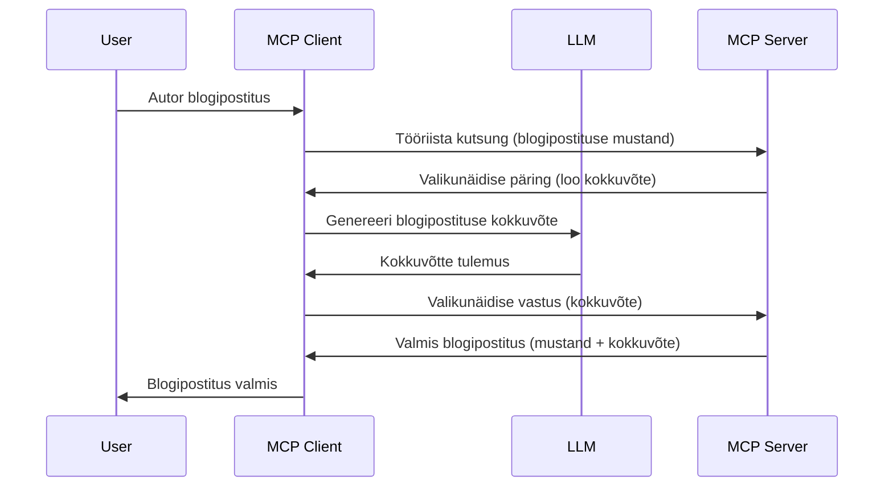

# Valimine - funktsioonide volitamine kliendile

Mõnikord peavad MCP klient ja MCP server koostööd tegema ühise eesmärgi saavutamiseks. Võib juhtuda, et server vajab abi kliendis paiknevalt LLM-ilt. Selle olukorra lahendamiseks tuleks kasutada valimist.

Vaatleme mõningaid kasutusjuhtumeid ja kuidas ehitada lahendus, mis hõlmab valimist.

## Ülevaade

Selles õppetükis keskendume valimise selgitamisele, millal ja kus seda kasutada ning kuidas seda konfigureerida.

## Õpieesmärgid

Selles peatükis:

- Selgitame, mis on valimine ja millal seda kasutada.
- Näitame, kuidas MCP-s valimist konfigureerida.
- Anname näiteid valimise rakendamisest.

## Mis on valimine ja miks seda kasutada?

Valimine on täiustatud funktsioon, mis töötab järgmiselt:


### Valimise päring

Nüüd, kui meil on usutava stsenaariumi üldvaade, räägime serveri kliendile tagastatavast valimise päringust. Selline päring võib JSON-RPC formaadis välja näha järgmiselt:

```json
{
  "jsonrpc": "2.0",
  "id": 1,
  "method": "sampling/createMessage",
  "params": {
    "messages": [
      {
        "role": "user",
        "content": {
          "type": "text",
          "text": "Create a blog post summary of the following blog post: <BLOG POST>"
        }
      }
    ],
    "modelPreferences": {
      "hints": [
        {
          "name": "claude-3-sonnet"
        }
      ],
      "intelligencePriority": 0.8,
      "speedPriority": 0.5
    },
    "systemPrompt": "You are a helpful assistant.",
    "maxTokens": 100
  }
}
```

Siin on mõningad olulised punktid:

- Prompt, sisu all -> text, on meie prompt, mis on juhis LLM-ile kokkuvõtte tegemiseks blogipostituse sisust.

- **modelPreferences**. See osa ongi eelistus, soovitus millist konfiguratsiooni LLM-iga kasutada. Kasutaja saab otsustada, kas järgneda neile soovitustele või neid muuta. Selles näites on soovitusi kasutatava mudeli, kiiruse ja intellekti prioriteedi osas.
- **systemPrompt**, see on tavapärane süsteemprompt, mis annab LLM-ile iseloomu ja sisaldab juhiseid.
- **maxTokens**, see on atribuut, mis näitab, mitu tokenit selle ülesande jaoks soovitatakse kasutada.

### Valimise vastus

See vastus on see, mida MCP klient lõpuks MCP serverile saadab ja mis tekib kliendi LLM-i kutsumise järel, selle vastuse ootel ja sõnumi kokkupanekul. JSON-RPC formaadis võib see välja näha nii:

```json
{
  "jsonrpc": "2.0",
  "id": 1,
  "result": {
    "role": "assistant",
    "content": {
      "type": "text",
      "text": "Here's your abstract <ABSTRACT>"
    },
    "model": "gpt-5",
    "stopReason": "endTurn"
  }
}
```

Pane tähele, et vastus on blogipostituse kokkuvõte, nagu palusime. Samuti märka, et kasutatud `model` pole see, mida me küsisime, vaid "gpt-5" "claude-3-sonnet" asemel. See näitab, et kasutaja võib otsustada mudeli osas teisiti ja et sinu valimise päring on soovitus.

Nüüd, kui mõistame põhivoogu ja kasulikku ülesannet "blogipostituse loomine + kokkuvõte", vaatame, mida peame selle tööle saamiseks tegema.

### Sõnumitüübid

Valimise sõnumeid pole piiratud ainult tekstiga, vaid saab saata ka pilte ja heli. JSON-RPC näeb sellisel juhul välja erinev:

**Tekst**

```json
{
  "type": "text",
  "text": "The message content"
}
```

**Pildi sisu**

```json
{
  "type": "image",
  "data": "base64-encoded-image-data",
  "mimeType": "image/jpeg"
}
```

**Heli sisu**

```json
{
  "type": "audio",
  "data": "base64-encoded-audio-data",
  "mimeType": "audio/wav"
}
```

> MÄRKUS: valimise kohta leiad rohkem üksikasju ametlikest dokumentidest aadressil [official docs](https://modelcontextprotocol.io/specification/2025-06-18/client/sampling)

## Kuidas kliendis valimist konfigureerida

> Märkus: kui sa ehitad ainult serverit, ei pea siin palju tegema.

Kliendis tuleb määratleda järgmine funktsioon nii:

```json
{
  "capabilities": {
    "sampling": {}
  }
}
```

See võetakse arvesse, kui sinu valitud klient alustab serveriga ühendust.

## Näide valimise kasutamisest - blogipostituse loomine

Loome koos valimise serveri, peame tegema järgmist:

1. Loome serveris tööriista.
1. See tööriist peaks looma valimise päringu.
1. Tööriist ootab kliendi valimise päringu vastust.
1. Seejärel toodetakse tööriista tulemus.

Vaatame koodi samm-sammult:

### -1- Tööriista loomine

**python**

```python
@mcp.tool()
async def create_blog(title: str, content: str, ctx: Context[ServerSession, None]) -> str:
    """Create a blog post and generate a summary"""

```

### -2- Valimise päringu loomine

Laienda tööriista järgmise koodiga:

**python**

```python
post = BlogPost(
        id=len(posts) + 1,
        title=title,
        content=content,
        abstract=""
    )

prompt = f"Create an abstract of the following blog post: title: {title} and draft: {content} "

result = await ctx.session.create_message(
        messages=[
            SamplingMessage(
                role="user",
                content=TextContent(type="text", text=prompt),
            )
        ],
        max_tokens=100,
)

```

### -3- Oota vastust ja tagasta tulemus

**python**

```python
post.abstract = result.content.text

posts.append(post)

# tagasta kogu toode
return json.dumps({
    "id": post.title,
    "abstract": post.abstract
})
```

### -4- Täiskood

**python**

```python
from starlette.applications import Starlette
from starlette.routing import Mount, Host

from mcp.server.fastmcp import Context, FastMCP

from mcp.server.session import ServerSession
from mcp.types import SamplingMessage, TextContent

import json


from uuid import uuid4
from typing import List
from pydantic import BaseModel


mcp = FastMCP("Blog post generator")

# app = FastAPI()

posts = []

class BlogPost(BaseModel):
    id: int
    title: str
    content: str
    abstract: str

posts: List[BlogPost] = []

@mcp.tool()
async def create_blog(title: str, content: str, ctx: Context[ServerSession, None]) -> str:
    """Create a blog post and generate a summary"""

    post = BlogPost(
        id=len(posts) + 1,
        title=title,
        content=content,
        abstract=""
    )

    prompt = f"Create an abstract of the following blog post: title: {title} and draft: {content} "

    result = await ctx.session.create_message(
        messages=[
            SamplingMessage(
                role="user",
                content=TextContent(type="text", text=prompt),
            )
        ],
        max_tokens=100,
    )

    post.abstract = result.content.text

    posts.append(post)

    # tagasta täielik blogipostitus
    return json.dumps({
        "id": post.title,
        "abstract": post.abstract
    })

if __name__ == "__main__":
    print("Starting server...")
    # mcp.run()
    mcp.run(transport="streamable-http")

# käivita rakendus käsuga: python server.py
```

### -5- Testimine Visual Studio Code'is

Testimiseks tee Visual Studio Code'is järgmist:

1. Käivita server terminalis
1. Lisa see *mcp.json*-i (ja veendu, et see on töös) nt nii:

   ```json
   "servers": {
      "blog-server": {
        "type": "http",
        "url": "http://localhost:8000/mcp"
      }
   }
   ```

1. Sisesta prompt:

   ```text
   create a blog post named "Where Python comes from", the content is "Python is actually named after Monty Python Flying Circus"
   ```

1. Luba valimine toimuda. Esimest korda testides ilmub lisadialoog, mille pead aktsepteerima, seejärel näed tavapärast tööriista käivitamise dialoogi.

1. Vaata tulemusi. Näed tulemeid GitHub Copilot Chatis ilusasti renderdatuna, kuid võid ka vaadata toore JSON vastust.

**Boonus**. Visual Studio Code tööriistad toetavad hästi valimist. Saad konfigureerida valimise ligipääsu oma installitud serverile järgmiselt:

1. Müügiosa avamine.
1. Vali ikoon oma installitud serveri juures sektsioonis "MCP SERVERS - INSTALLED".
1. Vali "Configure Model Access", siin saad valida, milliseid mudeleid GitHub Copilot tohib valimise ajal kasutada. Samuti näed kõiki hiljutisi valimise päringuid valides "Show Sampling requests".

## Ülesanne

Selles ülesandes ehitad veidi teistsuguse valimise integraatori, mis toetab tootekirjelduse genereerimist. Siin on sinu stsenaarium:

**Stsenaarium**: e-kaubanduse tagakontori töötajal on abi vaja, sest tootetutvustuste genereerimine võtab liiga palju aega. Seetõttu pead ehitama lahenduse, kus saad tööriista "create_product" kutsuda koos argumentidega "title" ja "keywords" ning see peaks looma täieliku toote, millel on "description" väli, mis täidetakse kliendi LLM-i abil.

NÕUANNE: kasuta varasemalt õpitud teadmisi, et üles ehitada see server ja tööriist kasutades valimise päringut.

## Lahendus

[Lahendus](./solution/README.md)

## Peamised õppetunnid

Valimine on võimas funktsioon, mis võimaldab serveril delegeerida ülesandeid kliendile, kui tal on vaja LLM-i abi.

## Mis järgmiseks

- [4. peatükk - praktiline rakendamine](../../04-PracticalImplementation/README.md)

---

<!-- CO-OP TRANSLATOR DISCLAIMER START -->
**Vastutusest loobumine**:  
See dokument on tõlgitud AI tõlke teenuse [Co-op Translator](https://github.com/Azure/co-op-translator) abil. Kuigi püüame täpsust, tuleb arvestada, et automaatsed tõlked võivad sisaldada vigu või ebatäpsusi. Originaaldokument selle emakeeles tuleks pidada autoriteetseks allikaks. Olulise info puhul soovitatakse kasutada professionaalset inimtõlget. Me ei vastuta selle tõlkega seotud arusaamatuste ega valesti tõlgendamise eest.
<!-- CO-OP TRANSLATOR DISCLAIMER END -->