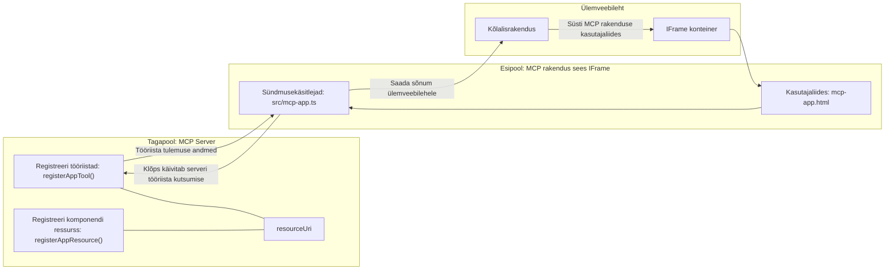

# MCP rakendused

MCP rakendused on uus paradigma MCP-s. Idee on selles, et mitte ainult ei vasta tööriista kutsele andmetega, vaid pakutakse ka teavet selle kohta, kuidas nende andmetega tuleks suhelda. See tähendab, et tööriista tulemused võivad nüüd sisaldada ka kasutajaliidese infot. Miks me seda siiski tahaksime? Noh, mõtle, kuidas sa täna asju teed. Tõenäoliselt tarbid MCP serveri tulemusi, pannes selle ette mingi tüüpi esipaneeli, see on kood, mida pead kirjutama ja hooldama. Mõnikord on see see, mida soovid, kuid mõnikord oleks tore, kui saaksid tuua sisse info lõigu, mis on iseseisev ja sisaldab kõike alates andmetest kuni kasutajaliideseni.

## Ülevaade

See õppetund annab praktilist juhendit MCP rakenduste kohta, kuidas alustada ja kuidas integreerida neid oma olemasolevatesse veebi rakendustesse. MCP rakendused on MCP standardi väga uus täiendus.

## Õpieesmärgid

Selle õppetunni lõpuks oskad sa:

- Selgitada, mis on MCP rakendused.
- Millal kasutada MCP rakendusi.
- Ehita ja integreeri oma MCP rakendused.

## MCP rakendused - kuidas see töötab

Idee MCP rakendustega on pakkuda vastust, mis põhimõtteliselt on komponent, mida renderdada. Sellisel komponendil võib olla nii visuaalid kui ka interaktiivsus, nagu nupu klikid, kasutaja sisend ja muud. Alustame serveripoolest ja meie MCP serverist. MCP rakenduse komponendi loomiseks pead looma tööriista ja ka rakenduse ressursi. Need kaks poolt on ühendatud resourceUri-ga.

Siin on näide. Proovime visualiseerida, mis on kaasatud ja millised osad mida teevad:

```text
server.ts -- responsible for registering tools and the component as a UI component
src/
  mcp-app.ts -- wiring up event handlers
mcp-app.html -- the user interface
```

See visuaal kirjeldab arhitektuuri komponendi ja selle loogika loomiseks.


Proovime nüüd kirjeldada vastutusalasid backend ja frontend pool.

### Backend

Seal on kaks asja, mida peame saavutama:

- Registreerima tööriistad, millega soovime suhelda.
- Määratlema komponendi.

**Tööriista registreerimine**

```typescript
registerAppTool(
    server,
    "get-time",
    {
      title: "Get Time",
      description: "Returns the current server time.",
      inputSchema: {},
      _meta: { ui: { resourceUri } }, // Seob selle tööriista selle kasutajaliidese ressursiga
    },
    async () => {
      const time = new Date().toISOString();
      return { content: [{ type: "text", text: time }] };
    },
  );

```

Ülaltoodu kood kirjeldab käitumist, kus ta avaldab tööriista nimega `get-time`. See ei võta sisendeid, kuid toodab lõpuks praeguse aja. Meil on võimalus määratleda `inputSchema` tööriistadele, kus peame suutma kasutaja sisendit vastu võtta.

**Komponendi registreerimine**

Samas failis peame ka komponendi registreerima:

```typescript
const resourceUri = "ui://get-time/mcp-app.html";

// Registreeri ressurss, mis tagastab kasutajaliidese kogutud HTML/JavaScripti.
registerAppResource(
  server,
  resourceUri,
  resourceUri,
  { mimeType: RESOURCE_MIME_TYPE },
  async () => {
    const html = await fs.readFile(path.join(DIST_DIR, "mcp-app.html"), "utf-8");

    return {
    contents: [
        { uri: resourceUri, mimeType: RESOURCE_MIME_TYPE, text: html },
    ],
    };
  },
);
```

Pane tähele, kuidas mainime `resourceUri`, et ühendada komponent oma tööriistadega. Huvi pakub ka tagasikutsumine (callback), kus laadime kasutajaliidese faili ja tagastame komponendi.

### Komponendi frontend

Nii nagu backendil, on ka siin kaks osa:

- Puhas HTML-is kirjutatud frontend.
- Kood, mis haldab sündmusi ja toiminguid, nt tööriistade kutsumine või sõnumite edastamine vanema aknale.

**Kasutajaliides**

Vaatame kasutajaliidest.

```html
<!-- mcp-app.html -->
<!DOCTYPE html>
<html lang="en">
  <head>
    <meta charset="UTF-8" />
    <title>Get Time App</title>
  </head>
  <body>
    <p>
      <strong>Server Time:</strong> <code id="server-time">Loading...</code>
    </p>
    <button id="get-time-btn">Get Server Time</button>
    <script type="module" src="/src/mcp-app.ts"></script>
  </body>
</html>
```

**Sündmuste ühendamine**

Viimane osa on sündmuse ühendamine. See tähendab, et määrame, millist osa meie kasutajaliideses on vaja sündmuse töötlejaid ja mida teha, kui sündmused käivituvad:

```typescript
// mcp-app.ts

import { App } from "@modelcontextprotocol/ext-apps";

// Hangi elemendi viited
const serverTimeEl = document.getElementById("server-time")!;
const getTimeBtn = document.getElementById("get-time-btn")!;

// Loo rakenduse eksemplar
const app = new App({ name: "Get Time App", version: "1.0.0" });

// Töötle tööriista tulemusi serverist. Sea enne `app.connect()`, et vältida
// esialgse tööriista tulemuse puudumist.
app.ontoolresult = (result) => {
  const time = result.content?.find((c) => c.type === "text")?.text;
  serverTimeEl.textContent = time ?? "[ERROR]";
};

// Ühenda nupu klõpsamine
getTimeBtn.addEventListener("click", async () => {
  // `app.callServerTool()` võimaldab kasutajaliidesel serverist värskeid andmeid pärida
  const result = await app.callServerTool({ name: "get-time", arguments: {} });
  const time = result.content?.find((c) => c.type === "text")?.text;
  serverTimeEl.textContent = time ?? "[ERROR]";
});

// Ühendu hostiga
app.connect();
```

Nagu ülal näha, on see normaalne kood DOM-elementide ühendamiseks sündmustega. Tasub välja tuua kutse `callServerTool`-ile, mis kutsub lõpuks tööriista backendis.

## Kasutaja sisendiga tegelemine

Nii kaugele oleme näinud komponenti, millel on nupp, mis klikkimisel kutsub tööriista. Vaatame, kas saame lisada rohkem UI elemente, näiteks sisendvälja, ja kas saame saata tööriistale argumente. Rakendame KKK funktsionaalsuse. Selle toimimise põhimõte on järgmine:

- Peaks olema nupp ja sisend element, kuhu kasutaja kirjutab märksõna, näiteks "Shipping", et otsida. See peaks kutsuma backendis tööriista, mis otsib KKK andmetest.
- Tool, mis toetab mainitud KKK otsingut.

Lisame esmalt vajaliku toe backendis:

```typescript
const faq: { [key: string]: string } = {
    "shipping": "Our standard shipping time is 3-5 business days.",
    "return policy": "You can return any item within 30 days of purchase.",
    "warranty": "All products come with a 1-year warranty covering manufacturing defects.",
  }

registerAppTool(
    server,
    "get-faq",
    {
      title: "Search FAQ",
      description: "Searches the FAQ for relevant answers.",
      inputSchema: zod.object({
        query: zod.string().default("shipping"),
      }),
      _meta: { ui: { resourceUri: faqResourceUri } }, // Seob selle tööriista selle kasutajaliidese ressursiga
    },
    async ({ query }) => {
      const answer: string = faq[query.toLowerCase()] || "Sorry, I don't have an answer for that.";
      return { content: [{ type: "text", text: answer }] };
    },
  );
```

Siin näeme, kuidas täidame `inputSchema` ja anname talle `zod` skeemi järgmiselt:

```typescript
inputSchema: zod.object({
  query: zod.string().default("shipping"),
})
```

Ülaltoodud skeemis deklareerime, et meil on sisendparameeter nimega `query`, mis on valikuline ja millel on vaikeväärtus "shipping".

Okei, liigume edasi *mcp-app.html*-i, et näha, millist kasutajaliidest peame looma:

```html
<div class="faq">
    <h1>FAQ response</h1>
    <p>FAQ Response: <code id="faq-response">Loading...</code></p>
    <input type="text" id="faq-query" placeholder="Enter FAQ query" />
    <button id="get-faq-btn">Get FAQ Response</button>
  </div>
```

Suurepärane, nüüd on meil sisendi element ja nupp. Liigume järgmise sammuna *mcp-app.ts*-i, et siduda need sündmused:

```typescript
const getFaqBtn = document.getElementById("get-faq-btn")!;
const faqQueryInput = document.getElementById("faq-query") as HTMLInputElement;

getFaqBtn.addEventListener("click", async () => {
  const query = faqQueryInput.value;
  const result = await app.callServerTool({ name: "get-faq", arguments: { query } });
  const faq = result.content?.find((c) => c.type === "text")?.text;
  faqResponseEl.textContent = faq ?? "[ERROR]";
});
```

Ülaltoodud koodis:

- Loome viited interaktiivsetele kasutajaliidese elementidele.
- Käitleme nupu klikki, et välja lugeda sisendi väärtus ja kutsume ka `app.callServerTool()` koos `name` ja `arguments`-ga, kus viimane edastab `query` väärtusena.

Tegelikult, kui kutsud välja `callServerTool`, saadab see sõnumi vanemaknale ja see aken kutsub lõpuks MCP serveri.

### Proovi järele

Proovides seda, peaksime nüüd nägema järgmist:


ja siin proovime sisendiga nagu "warranty"


Selle koodi käivitamiseks suundu [Koodi jaotisse](./code/README.md)

## Testimine Visual Studio Code'is

Visual Studio Code toetab suurepäraselt MCP rakendusi ja on tõenäoliselt üks lihtsamaid viise oma MCP rakenduste testimiseks. Visual Studio Code'i kasutamiseks lisa serveri kirje *mcp.json*-i nii:

```json
"my-mcp-server-7178eca7": {
    "url": "http://localhost:3001/mcp",
    "type": "http"
  }
```

Seejärel käivita server, sa peaksid suutma oma MCP rakendusega suhelda Chat akna kaudu, eeldades, et sul on installitud GitHub Copilot.

Seda saab käivitada ka prompti kaudu, näiteks "#get-faq":


ja nagu veebibrauseri kaudu jooksutades, renderdab see sama moodi:


## Ülesanne

Loo kivi-paber-käärid mäng. Sellel peaksid olema järgmised osad:

Kasutajaliides:

- rippmenüü valikutega
- nupp valiku esitamiseks
- silt, mis näitab, kes mida valis ja kes võitis

Server:

- peaks olema tööriist kivi-paber-käärid, mis võtab sisendiks "choice". See peaks ka renderdama arvuti valiku ja määrama võitja.

## Lahendus

[Lahendus](./assignment/README.md)

## Kokkuvõte

Õppisime selle uue paradigmasid, MCP rakendusi. See on uus paradigma, mis lubab MCP serveritel avaldada arvamust mitte ainult andmete kohta, vaid ka selle kohta, kuidas neid andmeid esitada.

Lisaks saime teada, et MCP rakendused majutatakse IFrame'is ning MCP serveritega suhtlemiseks peavad nad saatma sõnumeid vanemale veebirakendusele. Olemas on mitmeid raamistikke nii tavalise JavaScripti kui Reacti jaoks, mis muudavad selle suhtluse lihtsamaks.

## Olulised võtmed

Siin on see, mida sa õppisid:

- MCP rakendused on uus standard, mis võib olla kasulik, kui soovid saata nii andmeid kui ka kasutajaliidese funktsioone.
- Need rakendused jooksevad turvalisuse huvides IFrame'is.


## Mis järgmine

- [4. peatükk](../../04-PracticalImplementation/README.md)

---

<!-- CO-OP TRANSLATOR DISCLAIMER START -->
**Vastutühing**:
See dokument on tõlgitud kasutades AI tõlketeenust [Co-op Translator](https://github.com/Azure/co-op-translator). Kuigi me püüame täpsust, palun arvestage, et automaatsed tõlked võivad sisaldada vigu või ebatäpsusi. Originaaldokument selle emakeeles peaks olema autoriteetne allikas. Olulise teabe puhul soovitatakse kasutada professionaalset inimtõlget. Me ei vastuta selle tõlke kasutamisest tulenevate arusaamatuste ega valesti mõistmiste eest.
<!-- CO-OP TRANSLATOR DISCLAIMER END -->