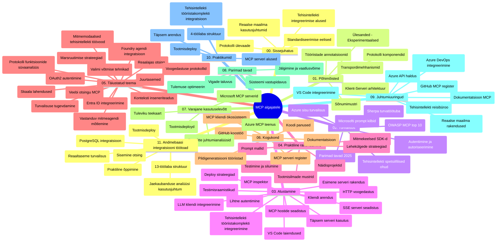

# Mudelikonteksti protokoll (MCP) algajatele – õpiabi

See õpiabi annab ülevaate hoidla struktuurist ja sisust kursuse "Mudelikonteksti protokoll (MCP) algajatele" tarbeks. Kasuta seda juhendit hoidla tõhusaks navigeerimiseks ja saad olemasolevatest ressurssidest maksimaalse kasu.

## Hoidla ülevaade

Mudelikonteksti protokoll (MCP) on standardiseeritud raamistik tehisintellekti mudelite ja kliendirakenduste vaheliseks suhtlemiseks. Algselt lõi selle Anthropic, nüüd hooldab MCP-d laiema kogukonna MCP ametlik GitHubi organisatsioon. See hoidla sisaldab põhjalikku õppekava koos praktiliste koodinäidete ja keeltega nagu C#, Java, JavaScript, Python ja TypeScript, mõeldud tehisintellekti arendajatele, süsteemiarhitektidele ja tarkvarainseneridele.

## Visuaalne õppekava kaart

## Hoidla struktuur

Hoidla on organiseeritud ühteist põhiosa, millest igaüks keskendub MCP erinevatele aspektidele:

1. **Sissejuhatus (00-Introduction/)**
   - Mudelikonteksti protokolli ülevaade
   - Miks on AI torujuhtmetes standardiseerimine oluline
   - Praktilised kasutuslood ja eelised

2. **Tuumkontseptsioonid (01-CoreConcepts/)**
   - Kliendi-serveri arhitektuur
   - Protokolli põhirakendused
   - Sõnumivahetuse mustrid MCP-s

3. **Turvalisus (02-Security/)**
   - Turvaohtud MCP-põhistes süsteemides
   - Parimad tavad teostuse turvamiseks
   - Autentimise ja autoriseerimise strateegiad
   - **Põhjalik turbe­dokumentatsioon**:
     - MCP turvapraktikad 2025
     - Azure sisuohutuse rakendusjuhend
     - MCP turbekontrollid ja -tehnikad
     - MCP parimate tavade kiirviide
   - **Peamised turvateemad**:
     - Käskude süstimise ja tööriistamürgitusrünnakud
     - Sessioonikaaperdamine ja segaduses esindaja probleemid
     - Turvatunnuste läbisurumise nõrkused
     - Liigne õiguste ja juurdepääsu kontroll
     - Tehisintellekti komponentide tarneahela turvalisus
     - Microsoft Prompt Shields integratsioon

4. **Algajale (03-GettingStarted/)**
   - Keskkonna seadistamine ja konfigureerimine
   - Lihtsate MCP serverite ja klientide loomine
   - Olemasolevate rakendustega integreerimine
   - Sisaldab jaotisi:
     - Esimene serveri rakendus
     - Kliendi arendamine
     - LLM kliendi integratsioon
     - VS Code integratsioon
     - Server-Sent Events (SSE) server
     - Täiustatud serverikasutus
     - HTTP voogedastus
     - AI tööriistakomplekti integratsioon
     - Testimise strateegiad
     - Juhtimissuunised

5. **Praktiline rakendus (04-PracticalImplementation/)**
   - SDK-de kasutamine erinevates programmeerimiskeeltes
   - Silumine, testimine ja valideerimistehnikad
   - Taaskasutatavate käskude mallide ja töövoogude loomine
   - Näidistusprojektid koos teostuse näidetega

6. **Täpsemad teemad (05-AdvancedTopics/)**
   - Konteksti insenertehnika
   - Foundry agendi integratsioon
   - Multimodaalsed AI töövood
   - OAuth2 autentimise demonstreerimine
   - Reaalajas otsinguvõimalused
   - Reaalajas voogedastus
   - Põhikontextide rakendamine
   - Marsruutimise strateegiad
   - Valimismeetodid
   - Skaaleerimislahendused
   - Turvalisuse kaalutlused
   - Entra ID turvaintegratsioon
   - Veebiotsingu integratsioon
   - Vastuoluline mitme-agentne mõtlemine (debattimustrid)

7. **Kogukonna panused (06-CommunityContributions/)**
   - Kuidas panustada koodi ja dokumentatsiooni
   - Koostöö GitHubi kaudu
   - Kogukonnapõhised täiustused ja tagasiside
   - Mitmesuguste MCP klientide kasutamine (Claude Desktop, Cline, VSCode)
   - Töö populaarsete MCP serveritega, sealhulgas pildiloome

8. **Varajased õppetunnid (07-LessonsfromEarlyAdoption/)**
   - Reaalsete teostuste ja edulugude ülevaade
   - MCP-lahenduste loomine ja juurutamine
   - Trendide ja tulevikuplaanide ülevaade
   - **Microsofti MCP serverite juhend**: Kõikehõlmav juhend 10 tootmiseks valmis Microsofti MCP serveri kohta, sealhulgas:
     - Microsoft Learn Docs MCP server
     - Azure MCP server (15+ spetsialiseeritud kontrollerit)
     - GitHub MCP server
     - Azure DevOps MCP server
     - MarkItDown MCP server
     - SQL Server MCP server
     - Playwright MCP server
     - Dev Box MCP server
     - Azure AI Foundry MCP server
     - Microsoft 365 Agents Toolkit MCP server

9. **Parimad tavad (08-BestPractices/)**
   - Soorituse häälestamine ja optimeerimine
   - Rikete taluvate MCP süsteemide disain
   - Testimise ja vastupidavuse strateegiad

10. **Juhtumiuuringud (09-CaseStudy/)**
    - **Seitse põhjalikku juhtumiuuringut**, mis demonstreerivad MCP mitmekülgsust erinevates stsenaariumites:
    - **Azure AI reisibürood**: Mitme-agendi orkestreerimine Azure OpenAI ja AI otsinguga
    - **Azure DevOps integratsioon**: Töövoo automatiseerimine YouTube andmete uuendustega
    - **Reaalajas dokumentide päring**: Python konsooliklient koos voogedastava HTTP-ga
    - **Interaktiivne õppekava generaator**: Chainlit veebirakendus koos vestlusliku AI-ga
    - **Toimetaja-sisemine dokumentatsioon**: VS Code integratsioon GitHub Copilot töövoogudega
    - **Azure API haldus**: Ettevõtte API integratsioon MCP serveri loomisega
    - **GitHub MCP register**: Ökosüsteemi arendus ja agendi integratsiooniplatvorm
    - Rakendusnäited ettevõtte integratsiooni, arendaja tootlikkuse ja ökosüsteemi arenduse ulatuses

11. **Praktiline töötuba (10-StreamliningAIWorkflowsBuildingAnMCPServerWithAIToolkit/)**
    - Kõikehõlmav praktiline töötuba, mis ühendab MCP AI tööriistakomplektiga
    - Nutikate rakenduste loomine, mis seovad AI mudeleid reaalse maailma tööriistadega
    - Praktilised moodulid, mis hõlmavad põhialuseid, kohandatud serveriarendust ja tootmisesse juurutamise strateegiaid
    - **Labori struktuur**:
      - Labor 1: MCP serveri alused
      - Labor 2: Täiustatud MCP serveri arendus
      - Labor 3: AI tööriistakomplekti integratsioon
      - Labor 4: Tootmisse juurutamine ja skaaleerimine
    - Laboripõhine õpikäsitlus samm-sammult juhistega

12. **MCP serverite andmebaasi integratsiooni laborid (11-MCPServerHandsOnLabs/)**
    - **Põhjalik 13-laboriline õpperada** tootmiseks valmis MCP serverite loomiseks koos PostgreSQL integratsiooniga
    - **Reaalne jaekaubanduse analüütika rakendus** Zava Retail kasutusjuhtumiga
    - **Ettevõtte taseme mustrid**, sh rea tasandi turve (RLS), semantiline otsing ja mitme rentniku andmetele ligipääs
    - **Laborite täielik struktuur**:
      - **Laborid 00-03: Alused** – Sissejuhatus, arhitektuur, turvalisus, keskkonna seadistus
      - **Laborid 04-06: MCP serveri loomine** – Andmebaasi disain, MCP serveri teostus, tööriistade arendus
      - **Laborid 07-09: Täiustatud funktsioonid** – Semantiline otsing, testimine ja silumine, VS Code integratsioon
      - **Laborid 10-12: Tootmine ja parimad tavad** – Juurutamine, jälgimine, optimeerimine
    - **Kasutatud tehnoloogiad**: FastMCP raamistik, PostgreSQL, Azure OpenAI, Azure konteinerirakendused, rakenduse Insights
    - **Õpitulemused**: Tootmiseks valmis MCP serverid, andmebaasi integratsioonimustrid, AI-põhine analüüs, ettevõtte turvalisus

## Täiendavad ressursid

Hoidla sisaldab toetavaid ressursse:

- **Pildikaust**: Sisaldab diagramme ja illustratsioone kogu õppekava jooksul
- **Tõlked**: Mitmekeelne tugi koos dokumentatsiooni automaatsete tõlgetega
- **Ametlikud MCP ressursid**:
  - [MCP dokumentatsioon](https://modelcontextprotocol.io/)
  - [MCP spetsifikatsioon](https://spec.modelcontextprotocol.io/)
  - [MCP GitHubi hoidla](https://github.com/modelcontextprotocol)

## Kuidas seda hoidlat kasutada

1. **Järjestikune õppimine**: Järgi peatükke järjest (00 kuni 11) struktureeritud õpikogemuse jaoks.
2. **Keelespetsiifiline fookus**: Kui sind huvitab mõni konkreetne programmeerimiskeel, vaata näidiskatalooge oma eelistatud keeles tehtud rakenduste leidmiseks.
3. **Praktiline rakendus**: Alusta jaotisest "Algajale", et seadistada oma keskkond ja luua oma esimene MCP server ja klient.
4. **Täpsem uurimine**: Kui põhitõed on selged, süvene täpsematesse teemadesse teadmiste laiendamiseks.
5. **Kogukonna kaasamine**: Liitu MCP kogukonnaga GitHubi arutelude ja Discordi kanalite kaudu, et suhelda ekspertide ja kaasarendajatega.

## MCP kliendid ja tööriistad

Õppekava hõlmab erinevaid MCP kliente ja tööriistu:

1. **Ametlikud kliendid**:
   - Visual Studio Code
   - MCP Visual Studio Code’is
   - Claude Desktop
   - Claude VSCode’is
   - Claude API

2. **Kogukonna kliendid**:
   - Cline (terminalipõhine)
   - Cursor (koodiredaktor)
   - ChatMCP
   - Windsurf

3. **MCP haldustööriistad**:
   - MCP CLI
   - MCP Manager
   - MCP Linker
   - MCP Router

## Populaarsed MCP serverid

Hoidla tutvustab erinevaid MCP servereid, sealhulgas:

1. **Ametlikud Microsofti MCP serverid**:
   - Microsoft Learn Docs MCP server
   - Azure MCP server (15+ spetsiaalkonnektorit)
   - GitHub MCP server
   - Azure DevOps MCP server
   - MarkItDown MCP server
   - SQL Server MCP server
   - Playwright MCP server
   - Dev Box MCP server
   - Azure AI Foundry MCP server
   - Microsoft 365 Agents Toolkit MCP server

2. **Ametlikud viiteserverid**:
   - Failisüsteem
   - Fetch
   - Mälu
   - Järjestikuline mõtlemine

3. **Pildiloome**:
   - Azure OpenAI DALL-E 3
   - Stable Diffusion WebUI
   - Replicate

4. **Arendustööriistad**:
   - Git MCP
   - Terminal Control
   - Code Assistant

5. **Spetsialiseeritud serverid**:
   - Salesforce
   - Microsoft Teams
   - Jira & Confluence

## Panustamine

See hoidla ootab kogukonna panuseid. Vaata kogukonna panuste jaotist, et saada juhiseid, kuidas MCP ökosüsteemi edukalt panustada.

----

*Seda õpiabit juhendit uuendati viimati 5. veebruaril 2026, kajastades viimast MCP spetsifikatsiooni 2025-11-25 ning annab ülevaate hoidlast selle kuupäeva seisuga. Hoidla sisu võib seda kuupäeva järgselt uuendusi saada.*

---

<!-- CO-OP TRANSLATOR DISCLAIMER START -->
**Vastutusest loobumine**:
See dokument on tõlgitud AI tõlketeenuse [Co-op Translator](https://github.com/Azure/co-op-translator) abil. Kuigi püüame tagada täpsust, palun arvestage, et automaatsed tõlked võivad sisaldada vigu või ebakõlasid. Originaaldokument oma emakeeles tuleks lugeda autoriteetseks allikaks. Olulise info puhul soovitatakse kasutada professionaalset inimtõlget. Me ei vastuta selle tõlke kasutamisest tingitud arusaamatuste või valesti mõistmiste eest.
<!-- CO-OP TRANSLATOR DISCLAIMER END -->