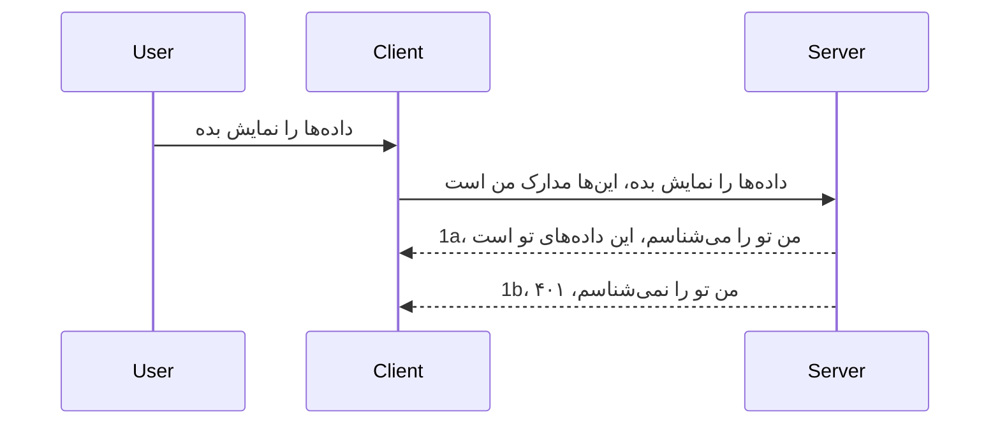

# احراز هویت ساده

کتابخانه‌های MCP از استفاده از OAuth 2.1 پشتیبانی می‌کنند که صادقانه بگویم فرایندی نسبتاً پیچیده است که شامل مفاهیمی مانند سرور احراز هویت، سرور منبع، ارسال اعتبارنامه‌ها، دریافت کد، تبادل کد با توکن دارنده تا زمانی که بتوانید در نهایت به داده‌های منبع خود دسترسی پیدا کنید. اگر با OAuth آشنا نیستید که از چیزهای عالی برای پیاده‌سازی است، ایده خوبی است که با یک سطح پایه‌ای از احراز هویت شروع کنید و به سمت امنیت بهتر و بهتر پیش بروید. به همین دلیل این فصل وجود دارد، تا شما را به سمت احراز هویت پیشرفته‌تر هدایت کند.

## احراز هویت، منظورمان چیست؟

احراز هویت کوتاه شده‌ی authentication و authorization است. ایده این است که ما باید دو کار انجام دهیم:

- **Authentication**، فرآیند تشخیص اینکه آیا اجازه داریم یک شخص وارد خانه ما شود، یعنی اینکه حق دارد «اینجا» باشد و به سرور منبع ما که ویژگی‌های MCP Server ما در آن قرار دارند دسترسی داشته باشد.
- **Authorization**، فرآیند یافتن اینکه آیا یک کاربر باید به این منابع مشخصی که درخواست کرده است دسترسی داشته باشد، مثلا این سفارش‌ها یا این محصولات یا اینکه فقط مجاز به خواندن محتوا است اما حق حذف آن را ندارد، به عنوان مثال دیگر.

## اعتبارنامه‌ها: چگونه سیستم را مطلع می‌کنیم که چه کسی هستیم

خوب، بیشتر توسعه‌دهندگان وب شروع به فکر کردن در مورد ارسال اعتبارنامه به سرور می‌کنند، معمولاً یک راز که می‌گوید آیا آنها اجازه دارند اینجا باشند «احراز هویت». این اعتبارنامه معمولاً نسخه‌ کدگذاری شده به صورت base64 از نام کاربری و رمز عبور یا یک کلید API است که کاربر خاصی را به طور منحصر به فرد شناسایی می‌کند.

این معمولاً در قالب هدر به نام "Authorization" ارسال می‌شود به شکل زیر:

```json
{ "Authorization": "secret123" }
```
  
این معمولاً به عنوان احراز هویت پایه شناخته می‌شود. نحوه کار کلی جریان به شکل زیر است:


حالا که از دیدگاه جریان کاری فهمیدیم چگونه کار می‌کند، چطور آن را پیاده‌سازی کنیم؟ خب، بیشتر سرورهای وب مفهوم middleware دارند، قطعه کدی که به عنوان بخشی از درخواست اجرا می‌شود و می‌تواند اعتبارنامه‌ها را تأیید کند و اگر اعتبارنامه‌ها معتبر باشند اجازه می‌دهد درخواست عبور کند. اگر درخواست اعتبارنامه معتبر نداشته باشد، خطای احراز هویت دریافت می‌کند. بیایید ببینیم چگونه می‌توان این را پیاده‌سازی کرد:

**پایتون**

```python
class AuthMiddleware(BaseHTTPMiddleware):
    async def dispatch(self, request, call_next):

        has_header = request.headers.get("Authorization")
        if not has_header:
            print("-> Missing Authorization header!")
            return Response(status_code=401, content="Unauthorized")

        if not valid_token(has_header):
            print("-> Invalid token!")
            return Response(status_code=403, content="Forbidden")

        print("Valid token, proceeding...")
       
        response = await call_next(request)
        # هر هدر مشتری را اضافه کنید یا به نوعی پاسخ را تغییر دهید
        return response


starlette_app.add_middleware(CustomHeaderMiddleware)
```
  
در اینجا داریم:

- یک middleware به نام `AuthMiddleware` ایجاد کردیم که متد `dispatch` آن توسط سرور وب فراخوانی می‌شود.
- middleware را به سرور وب اضافه کردیم:

    ```python
    starlette_app.add_middleware(AuthMiddleware)
    ```
  
- منطق اعتبارسنجی نوشته‌ایم که بررسی می‌کند آیا هدر Authorization وجود دارد و آیا راز ارسالی معتبر است:

    ```python
    has_header = request.headers.get("Authorization")
    if not has_header:
        print("-> Missing Authorization header!")
        return Response(status_code=401, content="Unauthorized")

    if not valid_token(has_header):
        print("-> Invalid token!")
        return Response(status_code=403, content="Forbidden")
    ```
  
اگر راز وجود داشت و معتبر بود اجازه می‌دهیم درخواست با فراخوانی `call_next` عبور کند و پاسخ را برمی‌گردانیم.

    ```python
    response = await call_next(request)
    # افزودن هرگونه هدر مشتری یا تغییر به نحوی در پاسخ
    return response
    ```
  
نحوه کار به این صورت است که اگر درخواست وب به سمت سرور فرستاده شود middleware فراخوانی می‌شود و با توجه به پیاده‌سازی‌اش، یا اجازه عبور به درخواست می‌دهد یا خطایی برمی‌گرداند که نشان می‌دهد کلاینت اجازه ادامه ندارد.

**تایپ‌اسکریپت**

در اینجا با استفاده از فریمورک محبوب Express یک middleware ایجاد می‌کنیم و درخواست را قبل از رسیدن به MCP Server رهگیری می‌کنیم. کد زیر برای این کار است:

```typescript
function isValid(secret) {
    return secret === "secret123";
}

app.use((req, res, next) => {
    // ۱. آیا هدر مجوز وجود دارد؟
    if(!req.headers["Authorization"]) {
        res.status(401).send('Unauthorized');
    }
    
    let token = req.headers["Authorization"];

    // ۲. بررسی اعتبار.
    if(!isValid(token)) {
        res.status(403).send('Forbidden');
    }

   
    console.log('Middleware executed');
    // ۳. درخواست را به مرحله بعدی در خط لوله درخواست منتقل می‌کند.
    next();
});
```
  
در این کد:

1. بررسی می‌کنیم که آیا هدر Authorization ابتدا وجود دارد یا نه، اگر نه، خطای 401 ارسال می‌کنیم.
2. اطمینان حاصل می‌کنیم که اعتبارنامه/توکن معتبر باشد، اگر نه، خطای 403 ارسال می‌کنیم.
3. در نهایت درخواست را در خط لوله درخواست عبور داده و منبع خواسته شده را باز می‌گرداند.

## تمرین: پیاده‌سازی احراز هویت

بیایید دانش خود را بکار گیریم و آن را پیاده‌سازی کنیم. برنامه این است:

سرور

- یک وب سرور و نمونه MCP ایجاد کنید.
- برای سرور middleware پیاده‌سازی کنید.

کلاینت

- درخواست وب را با اعتبارنامه از طریق هدر ارسال کند.

### -1- ایجاد وب سرور و نمونه MCP

در گام اول، باید نمونه وب سرور و MCP Server را ایجاد کنیم.

**پایتون**

در اینجا یک نمونه MCP Server ایجاد می‌کنیم، یک برنامه starlette می‌سازیم و آن را با uvicorn میزبانی می‌کنیم.

```python
# در حال ایجاد سرور MCP

app = FastMCP(
    name="MCP Resource Server",
    instructions="Resource Server that validates tokens via Authorization Server introspection",
    host=settings["host"],
    port=settings["port"],
    debug=True
)

# در حال ایجاد برنامه وب starlette
starlette_app = app.streamable_http_app()

# ارائه برنامه از طریق uvicorn
async def run(starlette_app):
    import uvicorn
    config = uvicorn.Config(
            starlette_app,
            host=app.settings.host,
            port=app.settings.port,
            log_level=app.settings.log_level.lower(),
        )
    server = uvicorn.Server(config)
    await server.serve()

run(starlette_app)
```
  
در این کد:

- MCP Server را ایجاد می‌کنیم.
- برنامه وب starlette را از MCP Server می‌سازیم، `app.streamable_http_app()`.
- و با uvicorn برنامه وب را میزبانی و سرو می‌کنیم `server.serve()`.

**تایپ‌اسکریپت**

در اینجا نمونه‌ای از MCP Server ایجاد می‌کنیم.

```typescript
const server = new McpServer({
      name: "example-server",
      version: "1.0.0"
    });

    // ... راه‌اندازی منابع سرور، ابزارها و درخواست‌ها ...
```
  
این ایجاد MCP Server باید در تعریف مسیر POST /mcp انجام شود، پس کد بالا را اینگونه جابجا می‌کنیم:

```typescript
import express from "express";
import { randomUUID } from "node:crypto";
import { McpServer } from "@modelcontextprotocol/sdk/server/mcp.js";
import { StreamableHTTPServerTransport } from "@modelcontextprotocol/sdk/server/streamableHttp.js";
import { isInitializeRequest } from "@modelcontextprotocol/sdk/types.js"

const app = express();
app.use(express.json());

// نقشه برای ذخیره ترنسپورت‌ها بر اساس شناسه جلسه
const transports: { [sessionId: string]: StreamableHTTPServerTransport } = {};

// مدیریت درخواست‌های POST برای ارتباط مشتری به سرور
app.post('/mcp', async (req, res) => {
  // بررسی وجود شناسه جلسه
  const sessionId = req.headers['mcp-session-id'] as string | undefined;
  let transport: StreamableHTTPServerTransport;

  if (sessionId && transports[sessionId]) {
    // استفاده مجدد از ترنسپورت موجود
    transport = transports[sessionId];
  } else if (!sessionId && isInitializeRequest(req.body)) {
    // درخواست مقداردهی اولیه جدید
    transport = new StreamableHTTPServerTransport({
      sessionIdGenerator: () => randomUUID(),
      onsessioninitialized: (sessionId) => {
        // ذخیره ترنسپورت بر اساس شناسه جلسه
        transports[sessionId] = transport;
      },
      // حفاظت از DNS rebinding به طور پیش‌فرض برای سازگاری با نسخه‌های قدیمی غیرفعال است. اگر این سرور را اجرا می‌کنید
      // به صورت محلی، اطمینان حاصل کنید که موارد زیر را تنظیم کرده‌اید:
      // enableDnsRebindingProtection: true,
      // allowedHosts: ['127.0.0.1'],
    });

    // پاکسازی ترنسپورت هنگام بسته شدن
    transport.onclose = () => {
      if (transport.sessionId) {
        delete transports[transport.sessionId];
      }
    };
    const server = new McpServer({
      name: "example-server",
      version: "1.0.0"
    });

    // ... راه‌اندازی منابع سرور، ابزارها، و درخواست‌ها ...

    // اتصال به سرور MCP
    await server.connect(transport);
  } else {
    // درخواست نامعتبر
    res.status(400).json({
      jsonrpc: '2.0',
      error: {
        code: -32000,
        message: 'Bad Request: No valid session ID provided',
      },
      id: null,
    });
    return;
  }

  // مدیریت درخواست
  await transport.handleRequest(req, res, req.body);
});

// هندلر قابل استفاده مجدد برای درخواست‌های GET و DELETE
const handleSessionRequest = async (req: express.Request, res: express.Response) => {
  const sessionId = req.headers['mcp-session-id'] as string | undefined;
  if (!sessionId || !transports[sessionId]) {
    res.status(400).send('Invalid or missing session ID');
    return;
  }
  
  const transport = transports[sessionId];
  await transport.handleRequest(req, res);
};

// مدیریت درخواست‌های GET برای اعلان‌های سرور به مشتری از طریق SSE
app.get('/mcp', handleSessionRequest);

// مدیریت درخواست‌های DELETE برای پایان دادن به جلسه
app.delete('/mcp', handleSessionRequest);

app.listen(3000);
```
  
حالا می‌بینید ایجاد MCP Server به داخل `app.post("/mcp")` منتقل شده است.

بیا به مرحله بعدی یعنی ساخت middleware برای اعتبارسنجی اعتبارنامه دریافتی بپردازیم.

### -2- پیاده‌سازی middleware برای سرور

حالا به بخش middleware می‌رویم. در اینجا middleware ای ایجاد می‌کنیم که در هدر `Authorization` دنبال اعتبارنامه می‌گردد و آن را اعتبارسنجی می‌کند. اگر قابل قبول بود، درخواست ادامه می‌یابد تا کاری که لازم است انجام شود (مثلاً فهرست ابزارها، خواندن یک منبع یا هر قابلیت MCP که کلاینت درخواست کرده) انجام شود.

**پایتون**

برای ایجاد middleware، باید یک کلاس ایجاد کنیم که از `BaseHTTPMiddleware` به ارث می‌برد. دو قطعه جالب وجود دارد:

- درخواست `request`، که اطلاعات هدر را از آن می‌خوانیم.
- `call_next` بازخوانی است که باید فراخوانی کنیم اگر کلاینت اعتبارنامه‌ای آورده که می‌پذیریم.

ابتدا باید حالت نبود هدر `Authorization` را مدیریت کنیم:

```python
has_header = request.headers.get("Authorization")

# هدر موجود نیست، با خطای ۴۰۱ شکست بخور، در غیر این صورت ادامه بده.
if not has_header:
    print("-> Missing Authorization header!")
    return Response(status_code=401, content="Unauthorized")
```
  
در اینجا پیام 401 unauthorized ارسال می‌کنیم چون کلاینت در احراز هویت شکست خورده است.

سپس، اگر اعتبارنامه ارسال شده باشد، باید اعتبار آن را بررسی کنیم به این صورت:

```python
 if not valid_token(has_header):
    print("-> Invalid token!")
    return Response(status_code=403, content="Forbidden")
```
  
نکته این است که پیام 403 forbidden را ارسال می‌کنیم. بیایید کل middleware را ببینیم که همه موارد ذکر شده را پیاده کرده است:

```python
class AuthMiddleware(BaseHTTPMiddleware):
    async def dispatch(self, request, call_next):

        has_header = request.headers.get("Authorization")
        if not has_header:
            print("-> Missing Authorization header!")
            return Response(status_code=401, content="Unauthorized")

        if not valid_token(has_header):
            print("-> Invalid token!")
            return Response(status_code=403, content="Forbidden")

        print("Valid token, proceeding...")
        print(f"-> Received {request.method} {request.url}")
        response = await call_next(request)
        response.headers['Custom'] = 'Example'
        return response

```
  
خوب، حالا تابع `valid_token` چطور است؟ اینجا است:

```python
# استفاده برای تولید نکنید - آن را بهبود دهید !!
def valid_token(token: str) -> bool:
    # حذف پیشوند "Bearer "
    if token.startswith("Bearer "):
        token = token[7:]
        return token == "secret-token"
    return False
```
  
البته این باید بهبود یابد.

مهم: شما هرگز نباید رازها را در کد داشته باشید. بهتر است مقدار را از منبع داده یا از یک IDP (ارائه‌دهنده خدمات هویت) دریافت کنید و یا بهتر از آن، اجازه دهید IDP اعتبارسنجی را انجام دهد.

**تایپ‌اسکریپت**

برای پیاده‌سازی این با Express، باید متد `use` را صدا بزنیم که توابع middleware می‌پذیرد.

باید:

- با متغیر درخواست تعامل کنیم تا اعتبارنامه ارسال شده را در خصوصیت `Authorization` بررسی کنیم.
- اعتبارنامه را اعتبارسنجی کنیم و اگر معتبر بود اجازه دهیم درخواست ادامه یابد و درخواست MCP کلاینت کار خود را انجام دهد (مثلا فهرست ابزار، خواندن منبع یا هر موضوع MCP).

اینجا بررسی می‌کنیم که آیا هدر `Authorization` وجود دارد یا نه، اگر نه، از ادامه درخواست جلوگیری می‌کنیم:

```typescript
if(!req.headers["authorization"]) {
    res.status(401).send('Unauthorized');
    return;
}
```
  
اگر هدر اصلا ارسال نشود، خطای 401 دریافت می‌کنید.

بعد، بررسی می‌کنیم که اعتبارنامه معتبر است یا نه، اگر نه دوباره درخواست را متوقف می‌کنیم ولی با پیامی کمی متفاوت:

```typescript
if(!isValid(token)) {
    res.status(403).send('Forbidden');
    return;
} 
```
  
حالا خطای 403 دریافت می‌کنید.

در اینجا کد کامل است:

```typescript
app.use((req, res, next) => {
    console.log('Request received:', req.method, req.url, req.headers);
    console.log('Headers:', req.headers["authorization"]);
    if(!req.headers["authorization"]) {
        res.status(401).send('Unauthorized');
        return;
    }
    
    let token = req.headers["authorization"];

    if(!isValid(token)) {
        res.status(403).send('Forbidden');
        return;
    }  

    console.log('Middleware executed');
    next();
});
```
  
سرور وب را آماده کردیم که middleware ای برای اعتبارسنجی اعتبارنامه که کلاینت ارسال می‌کند داشته باشد. حالا خود کلاینت چطور؟

### -3- ارسال درخواست وب با اعتبارنامه از طریق هدر

باید مطمئن شویم کلاینت اعتبارنامه را از طریق هدر ارسال می‌کند. چون قصد داریم از کلاینت MCP استفاده کنیم، باید بفهمیم چگونه این کار انجام می‌شود.

**پایتون**

برای کلاینت، باید هدر با اعتبارنامه‌مان را به شکل زیر ارسال کنیم:

```python
# مقدار را به صورت هاردکد شده قرار ندهید، حداقل آن را در یک متغیر محیطی یا یک ذخیره‌سازی ایمن‌تر داشته باشید
token = "secret-token"

async with streamablehttp_client(
        url = f"http://localhost:{port}/mcp",
        headers = {"Authorization": f"Bearer {token}"}
    ) as (
        read_stream,
        write_stream,
        session_callback,
    ):
        async with ClientSession(
            read_stream,
            write_stream
        ) as session:
            await session.initialize()
      
            # کارهای مورد نظر در کلاینت را انجام دهید، مثلاً لیست کردن ابزارها، فراخوانی ابزارها و غیره.
```
  
نکته اینکه ویژگی `headers` را به این شکل پر می‌کنیم ` headers = {"Authorization": f"Bearer {token}"}`.

**تایپ‌اسکریپت**

می‌توانیم این را در دو مرحله حل کنیم:

1. یک شیء پیکربندی را با اعتبارنامه پر کنیم.
2. شیء پیکربندی را به ترابری ارسال کنیم.

```typescript

// مقدار را مانند اینجا به طور سخت‌کد ننویسید. حداقل آن را به صورت یک متغیر محیطی داشته باشید و از چیزی مانند dotenv (در حالت توسعه) استفاده کنید.
let token = "secret123"

// یک شی گزینه حمل و نقل مشتری تعریف کنید
let options: StreamableHTTPClientTransportOptions = {
  sessionId: sessionId,
  requestInit: {
    headers: {
      "Authorization": "secret123"
    }
  }
};

// شی گزینه‌ها را به حمل و نقل منتقل کنید
async function main() {
   const transport = new StreamableHTTPClientTransport(
      new URL(serverUrl),
      options
   );
```
  
در بالا می‌بینید که چطور یک شیء `options` ایجاد کردیم و هدرها را در ویژگی `requestInit` قرار دادیم.

مهم: چطور می‌توانیم این را بهتر کنیم؟ پیاده‌سازی فعلی مشکلاتی دارد. اول اینکه ارسال اعتبارنامه به این روش بسیار پرخطر است مگر اینکه حداقل HTTPS داشته باشید. حتی با این وجود، اعتبارنامه ممکن است دزدیده شود بنابراین نیاز به سیستمی دارید که به آسانی بتوانید توکن را باطل کنید و بررسی‌های اضافه مانند محل درخواست، تعداد زیاد درخواست‌ها به صورت ربات‌گونه و خلاصه مسائل متعددی باشد.

با این حال، برای APIهای بسیار ساده که نمی‌خواهید کسی بدون احراز هویت به API شما دسترسی داشته باشد، آنچه ما اینجا داریم شروع خوبی است.

با این توضیح، بیایید امنیت را کمی سخت‌تر کنیم با استفاده از یک فرمت استاندارد شده مانند JSON Web Token که به اختصار JWT یا توکن‌های "JOT" نامیده می‌شود.

## JSON Web Tokens، JWT

پس، ما در حال بهبود ارسال اعتبارنامه‌های ساده هستیم. بلافاصله چه مزایایی از پذیرش JWT دریافت می‌کنیم؟

- **بهبود امنیت**. در احراز هویت پایه، شما نام کاربری و رمز عبور را به صورت یک توکن کدگذاری شده base64 (یا یک کلید API) بارها و بارها ارسال می‌کنید که ریسک را افزایش می‌دهد. با JWT، شما نام کاربری و رمز عبور ارسال می‌کنید و توکن به عنوان پاسخ دریافت می‌کنید که دارای محدودیت زمانی است یعنی منقضی می‌شود. JWT به شما امکان کنترل دسترسی با دقت زیاد با استفاده از نقش‌ها، محدوده‌ها و مجوزها را می‌دهد.
- **بدون وضعیت و مقیاس‌پذیری**. JWTها خودکفا هستند، تمام اطلاعات کاربر را حمل می‌کنند و نیازی به ذخیره‌سازی نشست سروری ندارند. توکن همچنین می‌تواند به صورت محلی اعتبارسنجی شود.
- **همکاری و فدراسیون**. JWT مرکز Open ID Connect است و با ارائه‌دهندگان شناخته شده‌ای مثل Entra ID، Google Identity و Auth0 استفاده می‌شود. همچنین امکان ورود یکپارچه (SSO) و ویژگی‌های بیشتر را فراهم می‌کند که آن را سطح سازمانی می‌کند.
- **ماژولار بودن و انعطاف‌پذیری**. JWTها همچنین می‌توانند با API Gatewayهایی مانند Azure API Management، NGINX و غیره استفاده شوند. از سناریوهای احراز هویت، ارتباط سرویس به سرویس، شامل نقش بازی کردن و واگذاری پشتیبانی می‌کنند.
- **عملکرد و کشینگ**. JWTها پس از رمزگشایی قابل کش شدن هستند که نیاز به پارس کردن دوباره را کاهش می‌دهد. این به خصوص برای برنامه‌های پر ترافیک مفید است چون توان عملیاتی را افزایش و بار زیرساخت را کاهش می‌دهد.
- **ویژگی‌های پیشرفته**. از introspection (بررسی اعتبار روی سرور) و revocation (باطل کردن توکن) نیز پشتیبانی می‌کند.

با این همه مزیت، بیایید ببینیم چطور می‌توانیم پیاده‌سازی را به سطح بالاتر ببریم.

## تبدیل احراز هویت پایه به JWT

پس، تغییراتی که باید به شکل کلی انجام دهیم اینها هستند:

- **یاد بگیریم چگونه یک توکن JWT بسازیم** تا آماده ارسال از کلاینت به سرور باشد.
- **اعتبارسنجی توکن JWT** و اگر معتبر بود اجازه دسترسی به منابع بدهیم.
- **ذخیره امن توکن**. چگونه این توکن را ذخیره کنیم.
- **حفاظت از مسیرها**. باید مسیرها و قابلیت‌های خاص MCP را محافظت کنیم.
- **افزودن توکن‌های تازه‌سازی**. اطمینان حاصل کنیم توکن‌هایی با عمر کوتاه ساخته شود ولی توکن تازه‌سازی با عمر بلند باشد که بتوان برای گرفتن توکن جدید پس از انقضا استفاده کرد. همچنین باید نقطه پایانی تازه‌سازی و سیاست چرخش وجود داشته باشد.

### -1- ساخت توکن JWT

ابتدا، یک توکن JWT شامل بخش‌های زیر است:

- **header**، الگوریتم مورد استفاده و نوع توکن.
- **payload**، ادعاها، مثل sub (کاربر یا موجودیتی که توکن نمایندگی می‌کند. در حوزه احراز هویت معمولاً شناسه کاربر است)، exp (زمان انقضا)، role (نقش)
- **signature**، امضا شده با یک راز یا کلید خصوصی.

برای این، باید هدر، payload و توکن کدگذاری شده بسازیم.

**پایتون**

```python

import jwt
import jwt
from jwt.exceptions import ExpiredSignatureError, InvalidTokenError
import datetime

# کلید مخفی استفاده شده برای امضای JWT
secret_key = 'your-secret-key'

header = {
    "alg": "HS256",
    "typ": "JWT"
}

# اطلاعات کاربر و ادعاها و زمان انقضای آن
payload = {
    "sub": "1234567890",               # موضوع (شناسه کاربر)
    "name": "User Userson",                # ادعای سفارشی
    "admin": True,                     # ادعای سفارشی
    "iat": datetime.datetime.utcnow(),# صادر شده در
    "exp": datetime.datetime.utcnow() + datetime.timedelta(hours=1)  # انقضاء
}

# آن را رمزگذاری کن
encoded_jwt = jwt.encode(payload, secret_key, algorithm="HS256", headers=header)
```
  
در کد بالا:

- هدر را با استفاده از الگوریتم HS256 و نوع JWT تعریف کردیم.
- یک payload ساختیم که شامل موضوع یا شناسه کاربر، نام کاربری، نقش، زمان صدور و زمان انقضا است که بخش زمان‌مند بودن را پیاده می‌کند.

**تایپ‌اسکریپت**

در اینجا به برخی وابستگی‌ها نیاز داریم که به ما در ساخت توکن JWT کمک می‌کنند.

وابستگی‌ها

```sh

npm install jsonwebtoken
npm install --save-dev @types/jsonwebtoken
```
  
حالا که اینها را داریم، هدر، payload را ساخته و از آنها توکن کدگذاری شده ایجاد می‌کنیم.

```typescript
import jwt from 'jsonwebtoken';

const secretKey = 'your-secret-key'; // استفاده از متغیرهای محیطی در تولید

// تعریف بار مفید
const payload = {
  sub: '1234567890',
  name: 'User usersson',
  admin: true,
  iat: Math.floor(Date.now() / 1000), // صادر شده در
  exp: Math.floor(Date.now() / 1000) + 60 * 60 // منقضی می‌شود در ۱ ساعت
};

// تعریف سربرگ (اختیاری، jsonwebtoken مقادیر پیش‌فرض را تنظیم می‌کند)
const header = {
  alg: 'HS256',
  typ: 'JWT'
};

// ایجاد توکن
const token = jwt.sign(payload, secretKey, {
  algorithm: 'HS256',
  header: header
});

console.log('JWT:', token);
```
  
این توکن:

با استفاده از HS256 امضا شده
یک ساعت معتبر است
شامل ادعاهایی مثل sub، name، admin، iat، و exp است.

### -2- اعتبارسنجی توکن

همچنین لازم است توکن را اعتبارسنجی کنیم. این کاری است که باید در سرور انجام شود تا اطمینان حاصل شود آنچه کلاینت می‌فرستد معتبر است. چک‌های زیادی باید انجام دهیم مثل اعتبار ساختار و اعتبار توکن. همچنین تشویق می‌شوید چک‌های بیشتری اضافه کنید تا ببینید کاربر در سیستم ما هست و اینکه حقوق ادعایی را دارد یا خیر.

برای اعتبارسنجی توکن، ابتدا باید آن را رمزگشایی کنیم تا بخوانیم سپس اعتبار آن را بررسی کنیم:

**پایتون**

```python

# توکن JWT را رمزگشایی و تایید کنید
try:
    decoded = jwt.decode(token, secret_key, algorithms=["HS256"])
    print("✅ Token is valid.")
    print("Decoded claims:")
    for key, value in decoded.items():
        print(f"  {key}: {value}")
except ExpiredSignatureError:
    print("❌ Token has expired.")
except InvalidTokenError as e:
    print(f"❌ Invalid token: {e}")

```
  
در این کد `jwt.decode` را با توکن، کلید راز و الگوریتم انتخاب شده فراخوانی می‌کنیم. توجه کنید از ساختار try-catch استفاده می‌کنیم چون در اعتبارسنجی ناموفق خطا ایجاد می‌شود.

**تایپ‌اسکریپت**

در اینجا باید `jwt.verify` را صدا بزنیم تا نسخه رمزگشایی شده توکن را بگیریم که بتوانیم بیشتر تحلیل کنیم. اگر این تماس شکست خورد یعنی ساختار توکن اشتباه است یا منقضی شده.

```typescript

try {
  const decoded = jwt.verify(token, secretKey);
  console.log('Decoded Payload:', decoded);
} catch (err) {
  console.error('Token verification failed:', err);
}
```
  
نکته: همانطور که قبلاً گفته شد، باید چک‌های اضافی انجام دهیم تا مشخص کنیم این توکن به کاربری در سیستم ما اشاره دارد و اطمینان حاصل کنیم کاربر حقوق ادعایی را دارد.

بعد، به کنترل دسترسی مبتنی بر نقش یا RBAC نگاه می‌کنیم.
## افزودن کنترل دسترسی مبتنی بر نقش

ایده این است که بخواهیم بیان کنیم نقش‌های مختلف دسترسی‌های متفاوتی دارند. برای مثال، فرض می‌کنیم یک مدیر می‌تواند همه چیز را انجام دهد و یک کاربر عادی تنها می‌تواند خواندن/نوشتن کند و یک مهمان تنها می‌تواند بخواند. بنابراین، سطوح دسترسی ممکن به شرح زیر هستند:

- Admin.Write  
- User.Read  
- Guest.Read  

بیایید ببینیم چگونه می‌توان چنین کنترلی را با استفاده از میان‌افزار پیاده‌سازی کرد. میان‌افزارها می‌توانند برای هر مسیر جداگانه یا برای همه مسیرها اضافه شوند.

**پایتون**

```python
from starlette.middleware.base import BaseHTTPMiddleware
from starlette.responses import JSONResponse
import jwt

# رمز مخفی را داخل کد نگذارید، این فقط برای مقاصد نمایشی است. آن را از جای امن بخوانید.
SECRET_KEY = "your-secret-key" # این را در متغیر محیطی قرار دهید
REQUIRED_PERMISSION = "User.Read"

class JWTPermissionMiddleware(BaseHTTPMiddleware):
    async def dispatch(self, request, call_next):
        auth_header = request.headers.get("Authorization")
        if not auth_header or not auth_header.startswith("Bearer "):
            return JSONResponse({"error": "Missing or invalid Authorization header"}, status_code=401)

        token = auth_header.split(" ")[1]
        try:
            decoded = jwt.decode(token, SECRET_KEY, algorithms=["HS256"])
        except jwt.ExpiredSignatureError:
            return JSONResponse({"error": "Token expired"}, status_code=401)
        except jwt.InvalidTokenError:
            return JSONResponse({"error": "Invalid token"}, status_code=401)

        permissions = decoded.get("permissions", [])
        if REQUIRED_PERMISSION not in permissions:
            return JSONResponse({"error": "Permission denied"}, status_code=403)

        request.state.user = decoded
        return await call_next(request)


```
  
راه‌های مختلفی برای افزودن میان‌افزار مانند زیر وجود دارد:

```python

# گزینه ۱: افزودن میدلور هنگام ساخت اپ استارلت
middleware = [
    Middleware(JWTPermissionMiddleware)
]

app = Starlette(routes=routes, middleware=middleware)

# گزینه ۲: افزودن میدلور پس از ساخت اپ استارلت
starlette_app.add_middleware(JWTPermissionMiddleware)

# گزینه ۳: افزودن میدلور برای هر مسیر
routes = [
    Route(
        "/mcp",
        endpoint=..., # هندلر
        middleware=[Middleware(JWTPermissionMiddleware)]
    )
]
```
  
**تایپ‌اسکریپت**

می‌توانیم از `app.use` و میان‌افزاری استفاده کنیم که برای همه درخواست‌ها اجرا می‌شود.

```typescript
app.use((req, res, next) => {
    console.log('Request received:', req.method, req.url, req.headers);
    console.log('Headers:', req.headers["authorization"]);

    // ۱. بررسی کنید که آیا هدر مجوز ارسال شده است یا خیر

    if(!req.headers["authorization"]) {
        res.status(401).send('Unauthorized');
        return;
    }
    
    let token = req.headers["authorization"];

    // ۲. بررسی کنید که توکن معتبر است
    if(!isValid(token)) {
        res.status(403).send('Forbidden');
        return;
    }  

    // ۳. بررسی کنید که کاربر توکن در سیستم ما وجود دارد
    if(!isExistingUser(token)) {
        res.status(403).send('Forbidden');
        console.log("User does not exist");
        return;
    }
    console.log("User exists");

    // ۴. تأیید کنید که توکن مجوزهای لازم را دارد
    if(!hasScopes(token, ["User.Read"])){
        res.status(403).send('Forbidden - insufficient scopes');
    }

    console.log("User has required scopes");

    console.log('Middleware executed');
    next();
});

```
  
چندین کار هست که می‌توانیم به میان‌افزار خود اجازه دهیم و باید انجام ‌دهد، به طور خاص:

1. بررسی وجود هدر مجوز (authorization header)  
2. بررسی اعتبار توکن، ما `isValid` را صدا می‌زنیم که متدی است که نوشتیم و کمال و اعتبار توکن JWT را چک می‌کند.  
3. اطمینان از وجود کاربر در سیستم ما، باید این را بررسی کنیم.

   ```typescript
    // کاربران در پایگاه داده
   const users = [
     "user1",
     "User usersson",
   ]

   function isExistingUser(token) {
     let decodedToken = verifyToken(token);

     // کار انجام نشده، بررسی کنید که آیا کاربر در پایگاه داده وجود دارد
     return users.includes(decodedToken?.name || "");
   }
   ```
  
در بالا، یک لیست ساده `users` ساخته‌ایم که طبیعتاً باید در یک پایگاه داده باشد.

4. علاوه بر این، باید بررسی کنیم توکن دسترسی‌های مناسب را دارد.

   ```typescript
   if(!hasScopes(token, ["User.Read"])){
        res.status(403).send('Forbidden - insufficient scopes');
   }
   ```
  
در کد بالا از میان‌افزار، بررسی می‌کنیم که توکن حاوی دسترسی User.Read هست یا خیر، اگر نباشد، خطای ۴۰۳ ارسال می‌شود. در ادامه متد کمکی `hasScopes` را داریم.

   ```typescript
   function hasScopes(scope: string, requiredScopes: string[]) {
     let decodedToken = verifyToken(scope);
    return requiredScopes.every(scope => decodedToken?.scopes.includes(scope));
  
   ```

Have a think which additional checks you should be doing, but these are the absolute minimum of checks you should be doing.

Using Express as a web framework is a common choice. There are helpers library when you use JWT so you can write less code.

- `express-jwt`, helper library that provides a middleware that helps decode your token.
- `express-jwt-permissions`, this provides a middleware `guard` that helps check if a certain permission is on the token.

Here's what these libraries can look like when used:

```typescript
const express = require('express');
const jwt = require('express-jwt');
const guard = require('express-jwt-permissions')();

const app = express();
const secretKey = 'your-secret-key'; // put this in env variable

// Decode JWT and attach to req.user
app.use(jwt({ secret: secretKey, algorithms: ['HS256'] }));

// Check for User.Read permission
app.use(guard.check('User.Read'));

// multiple permissions
// app.use(guard.check(['User.Read', 'Admin.Access']));

app.get('/protected', (req, res) => {
  res.json({ message: `Welcome ${req.user.name}` });
});

// Error handler
app.use((err, req, res, next) => {
  if (err.code === 'permission_denied') {
    return res.status(403).send('Forbidden');
  }
  next(err);
});

```
  
اکنون دیدید که چگونه می‌توان از میان‌افزار هم برای احراز هویت و هم برای مجوزدهی استفاده کرد؛ اما در مورد MCP چطور، آیا نحوه انجام احراز هویت تغییر می‌کند؟ بیایید در بخش بعدی ببینیم.

### -3- افزودن RBAC به MCP

تا اینجا دیدید چگونه می‌توانید RBAC را از طریق میان‌افزار اضافه کنید، با این حال، برای MCP راه ساده‌ای برای اضافه کردن RBAC به ازای هر ویژگی MCP وجود ندارد، پس چه کار کنیم؟ خوب، باید کدی مانند این اضافه کنیم که در اینجا بررسی می‌کند آیا کلاینت دسترسی لازم برای فراخوانی ابزار خاصی را دارد یا خیر:

راه‌های مختلفی برای تحقق RBAC به ازای هر ویژگی وجود دارد، به عنوان مثال:

- اضافه کردن بررسی برای هر ابزار، منبع، prompt که در آن باید سطح دسترسی را چک کنید.

   **پایتون**

   ```python
   @tool()
   def delete_product(id: int):
      try:
          check_permissions(role="Admin.Write", request)
      catch:
        pass # مشتری مجوز را رد کرد، خطای مجوز را ایجاد کنید
   ```
  
   **تایپ‌اسکریپت**

   ```typescript
   server.registerTool(
    "delete-product",
    {
      title: Delete a product",
      description: "Deletes a product",
      inputSchema: { id: z.number() }
    },
    async ({ id }) => {
      
      try {
        checkPermissions("Admin.Write", request);
        // باید انجام شود، ارسال شناسه به productService و ورودی از راه دور
      } catch(Exception e) {
        console.log("Authorization error, you're not allowed");  
      }

      return {
        content: [{ type: "text", text: `Deletected product with id ${id}` }]
      };
    }
   );
   ```


- استفاده از رویکرد پیشرفته سرور و هندلرهای درخواست تا حداقل تعداد مکان‌هایی که باید بررسی انجام شود را کاهش دهید.

   **پایتون**

   ```python
   
   tool_permission = {
      "create_product": ["User.Write", "Admin.Write"],
      "delete_product": ["Admin.Write"]
   }

   def has_permission(user_permissions, required_permissions) -> bool:
      # user_permissions: لیستی از مجوزهایی که کاربر دارد
      # required_permissions: لیستی از مجوزهای مورد نیاز برای ابزار
      return any(perm in user_permissions for perm in required_permissions)

   @server.call_tool()
   async def handle_call_tool(
     name: str, arguments: dict[str, str] | None
   ) -> list[types.TextContent]:
    # فرض کنید request.user.permissions لیستی از مجوزهای کاربر است
     user_permissions = request.user.permissions
     required_permissions = tool_permission.get(name, [])
     if not has_permission(user_permissions, required_permissions):
        # خطا پرتاب کن "شما اجازه استفاده از ابزار {name} را ندارید"
        raise Exception(f"You don't have permission to call tool {name}")
     # ادامه بده و ابزار را فراخوانی کن
     # ...
   ```   
   

   **تایپ‌اسکریپت**

   ```typescript
   function hasPermission(userPermissions: string[], requiredPermissions: string[]): boolean {
       if (!Array.isArray(userPermissions) || !Array.isArray(requiredPermissions)) return false;
       // اگر کاربر حداقل یک اجازه لازم را دارد، درست برگردان
       
       return requiredPermissions.some(perm => userPermissions.includes(perm));
   }
  
   server.setRequestHandler(CallToolRequestSchema, async (request) => {
      const { params: { name } } = request;
  
      let permissions = request.user.permissions;
  
      if (!hasPermission(permissions, toolPermissions[name])) {
         return new Error(`You don't have permission to call ${name}`);
      }
  
      // ادامه بده..
   });
   ```
  
توجه داشته باشید، باید مطمئن شوید که میان‌افزار شما، توکن رمزگشایی شده را به خاصیت user درخواست (request) اختصاص می‌دهد تا کد بالا ساده شود.

### جمع‌بندی

حالا که درباره افزودن پشتیبانی از RBAC به طور کلی و برای MCP به طور خاص صحبت کردیم، وقت آن است که خودتان پیاده‌سازی امنیت را تمرین کنید تا مطمئن شوید مفاهیم ارائه شده را درک کرده‌اید.

## تمرین ۱: ساخت سرور MCP و کلاینت MCP با استفاده از احراز هویت پایه

اینجا آنچه درباره ارسال معتبرها از طریق هدرها یاد گرفته‌اید را به کار خواهید برد.

## راه‌حل ۱

[راه‌حل ۱](./code/basic/README.md)

## تمرین ۲: ارتقاء راه‌حل تمرین ۱ به استفاده از JWT

راه‌حل اول را بگیرید ولی این بار آن را بهبود دهید.  

به جای استفاده از Basic Auth، از JWT استفاده کنیم.

## راه‌حل ۲

[راه‌حل ۲](./solution/jwt-solution/README.md)

## چالش

افزودن RBAC به ازای هر ابزار همان‌طور که در بخش "افزودن RBAC به MCP" شرح داده شده است.

## خلاصه

امیدواریم در این فصل چیزهای زیادی یاد گرفته باشید، از عدم وجود امنیت گرفته تا امنیت پایه، تا JWT و نحوه اضافه کردن آن به MCP.

ما یک پایه محکم با JWT‌های سفارشی ساختیم، اما هر چه مقیاس رشد می‌کند، به سمت مدلی مبتنی بر استاندارد هویت حرکت می‌کنیم. پذیرش یک IdP مثل Entra یا Keycloak به ما اجازه می‌دهد صدور توکن، اعتبارسنجی و مدیریت چرخه زندگی آن را به یک پلتفرم مورد اعتماد بسپاریم و خودمان روی منطق برنامه و تجربه کاربری تمرکز کنیم.

برای این منظور، یک فصل پیشرفته‌تر درباره Entra داریم: [فصل پیشرفته Entra](../../05-AdvancedTopics/mcp-security-entra/README.md)

## مرحله بعد

- بعدی: [راه‌اندازی میزبان‌های MCP](../12-mcp-hosts/README.md)

---

<!-- CO-OP TRANSLATOR DISCLAIMER START -->
**سلب مسئولیت**:  
این سند با استفاده از سرویس ترجمه هوش مصنوعی [Co-op Translator](https://github.com/Azure/co-op-translator) ترجمه شده است. در حالی که ما برای دقت تلاش می‌کنیم، لطفاً توجه داشته باشید که ترجمه‌های خودکار ممکن است حاوی خطاها یا نادرستی‌هایی باشند. سند اصلی به زبان بومی آن باید منبع معتبر در نظر گرفته شود. برای اطلاعات حساس، ترجمه حرفه‌ای انسانی توصیه می‌شود. ما در قبال هرگونه سوء تفاهم یا تفسیر نادرست ناشی از استفاده از این ترجمه مسئولیتی نداریم.
<!-- CO-OP TRANSLATOR DISCLAIMER END -->