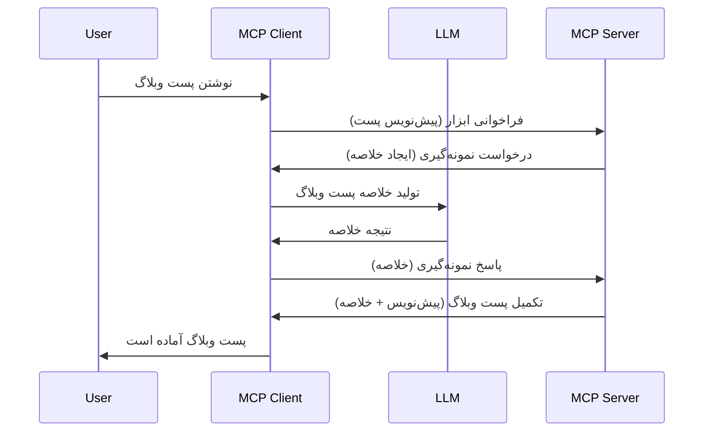

# نمونه‌گیری - واگذاری قابلیت‌ها به کلاینت

گاهی اوقات، نیاز است که MCP کلاینت و MCP سرور با هم همکاری کنند تا به هدفی مشترک برسند. ممکن است حالتی داشته باشید که سرور به کمک یک LLM که روی کلاینت قرار دارد نیاز داشته باشد. برای این وضعیت، نمونه‌گیری کاری است که باید انجام دهید.

بیایید برخی موارد استفاده و نحوه ساخت راه‌حلی شامل نمونه‌گیری را بررسی کنیم.

## مرور کلی

در این درس، تمرکز ما بر توضیح این است که چه زمانی و کجا باید از نمونه‌گیری استفاده کرد و چگونه آن را پیکربندی کنیم.

## اهداف یادگیری

در این فصل، ما:

- توضیح خواهیم داد نمونه‌گیری چیست و چه زمانی باید از آن استفاده کرد.
- نشان خواهیم داد چگونه نمونه‌گیری را در MCP پیکربندی کنیم.
- مثال‌هایی از نمونه‌گیری در عمل ارائه خواهیم داد.

## نمونه‌گیری چیست و چرا از آن استفاده کنیم؟

نمونه‌گیری یک قابلیت پیشرفته است که به شکل زیر کار می‌کند:


### درخواست نمونه‌گیری

خب، حالا تصویری کلی و معتبر از یک سناریوی واقعی داریم، بیایید درباره درخواست نمونه‌گیری که سرور به کلاینت ارسال می‌کند صحبت کنیم. چنین درخواستی می‌تواند به شکل زیر در قالب JSON-RPC باشد:

```json
{
  "jsonrpc": "2.0",
  "id": 1,
  "method": "sampling/createMessage",
  "params": {
    "messages": [
      {
        "role": "user",
        "content": {
          "type": "text",
          "text": "Create a blog post summary of the following blog post: <BLOG POST>"
        }
      }
    ],
    "modelPreferences": {
      "hints": [
        {
          "name": "claude-3-sonnet"
        }
      ],
      "intelligencePriority": 0.8,
      "speedPriority": 0.5
    },
    "systemPrompt": "You are a helpful assistant.",
    "maxTokens": 100
  }
}
```

چند نکته در اینجا ارزش ذکر دارد:

- Prompt، زیر content -> text، پرامپتی است که دستورالعملی برای LLM برای خلاصه کردن محتوای پست وبلاگ می‌باشد.

- **modelPreferences**. این بخش دقیقاً همین است، یک ترجیح، توصیه‌ای برای اینکه چه تنظیماتی باید با LLM استفاده شود. کاربر می‌تواند انتخاب کند که این توصیه‌ها را دنبال کند یا تغییر دهد. در این مورد توصیه‌هایی درباره مدل مورد استفاده و اولویت سرعت و هوش وجود دارد.
- **systemPrompt**، این پرامپت سیستم عادی شما است که به LLM شخصیت می‌دهد و شامل دستورالعمل‌های راهنما است.
- **maxTokens**، این یک ویژگی دیگر است که می‌گوید چه تعداد توکن برای این کار توصیه شده است.

### پاسخ نمونه‌گیری

این پاسخ همان چیزی است که در پایان MCP کلاینت به MCP سرور ارسال می‌کند و نتیجه کلاینت است که LLM را فراخوانی کرده، منتظر پاسخ مانده و سپس این پیام را ساخته است. چنین پاسخی می‌تواند به صورت زیر در JSON-RPC باشد:

```json
{
  "jsonrpc": "2.0",
  "id": 1,
  "result": {
    "role": "assistant",
    "content": {
      "type": "text",
      "text": "Here's your abstract <ABSTRACT>"
    },
    "model": "gpt-5",
    "stopReason": "endTurn"
  }
}
```

دقت کنید چگونه پاسخ خلاصه‌ای از پست وبلاگ است همانطور که خواسته بودیم. همچنین توجه کنید که مدل استفاده شده `model` آنچه ما خواسته بودیم نیست بلکه "gpt-5" به جای "claude-3-sonnet" است. این برای نشان دادن این است که کاربر می‌تواند نظر خود را درباره چیزی که می‌خواهد استفاده کند تغییر دهد و درخواست نمونه‌گیری شما یک توصیه است.

خب، حالا که جریان اصلی را فهمیدیم، و کاربرد مفید آن برای کار «ساخت پست وبلاگ + خلاصه» را می‌دانیم، بیایید ببینیم چه باید بکنیم تا این کار عملی شود.

### نوع پیام‌ها

پیام‌های نمونه‌گیری محدود به فقط متن نیستند بلکه می‌توانید تصاویر و صدا هم بفرستید. نحوه متفاوت بودن JSON-RPC به این شکل است:

**متن**

```json
{
  "type": "text",
  "text": "The message content"
}
```

**محتوای تصویر**

```json
{
  "type": "image",
  "data": "base64-encoded-image-data",
  "mimeType": "image/jpeg"
}
```

**محتوای صوت**

```json
{
  "type": "audio",
  "data": "base64-encoded-audio-data",
  "mimeType": "audio/wav"
}
```

> NOTE: برای اطلاعات دقیق‌تر درباره نمونه‌گیری، به [مستندات رسمی](https://modelcontextprotocol.io/specification/2025-06-18/client/sampling) مراجعه کنید.

## نحوه پیکربندی نمونه‌گیری در کلاینت

> توجه: اگر فقط در حال ساخت سرور هستید، نیازی به انجام کار زیادی اینجا ندارید.

در یک کلاینت، باید ویژگی زیر را به این صورت مشخص کنید:

```json
{
  "capabilities": {
    "sampling": {}
  }
}
```

سپس این مورد هنگام شروع به کار کلاینت انتخابی شما با سرور خوانده خواهد شد.

## نمونه‌ای از نمونه‌گیری در عمل - ایجاد یک پست وبلاگ

بیایید با هم یک سرور نمونه‌گیری کدنویسی کنیم، لازم است موارد زیر انجام شود:

1. ایجاد یک ابزار روی سرور.
1. ابزار باید یک درخواست نمونه‌گیری ایجاد کند.
1. ابزار باید منتظر پاسخ به درخواست نمونه‌گیری کلاینت باشد.
1. سپس نتیجه ابزار باید تولید شود.

بیایید کد را قدم به قدم ببینیم:

### -1- ایجاد ابزار

**python**

```python
@mcp.tool()
async def create_blog(title: str, content: str, ctx: Context[ServerSession, None]) -> str:
    """Create a blog post and generate a summary"""

```

### -2- ایجاد درخواست نمونه‌گیری

ابزار خود را با کد زیر گسترش دهید:

**python**

```python
post = BlogPost(
        id=len(posts) + 1,
        title=title,
        content=content,
        abstract=""
    )

prompt = f"Create an abstract of the following blog post: title: {title} and draft: {content} "

result = await ctx.session.create_message(
        messages=[
            SamplingMessage(
                role="user",
                content=TextContent(type="text", text=prompt),
            )
        ],
        max_tokens=100,
)

```

### -3- منتظر پاسخ بمانید و پاسخ را برگردانید

**python**

```python
post.abstract = result.content.text

posts.append(post)

# بازگشت محصول کامل
return json.dumps({
    "id": post.title,
    "abstract": post.abstract
})
```

### -4- کد کامل

**python**

```python
from starlette.applications import Starlette
from starlette.routing import Mount, Host

from mcp.server.fastmcp import Context, FastMCP

from mcp.server.session import ServerSession
from mcp.types import SamplingMessage, TextContent

import json


from uuid import uuid4
from typing import List
from pydantic import BaseModel


mcp = FastMCP("Blog post generator")

# برنامه = FastAPI()

posts = []

class BlogPost(BaseModel):
    id: int
    title: str
    content: str
    abstract: str

posts: List[BlogPost] = []

@mcp.tool()
async def create_blog(title: str, content: str, ctx: Context[ServerSession, None]) -> str:
    """Create a blog post and generate a summary"""

    post = BlogPost(
        id=len(posts) + 1,
        title=title,
        content=content,
        abstract=""
    )

    prompt = f"Create an abstract of the following blog post: title: {title} and draft: {content} "

    result = await ctx.session.create_message(
        messages=[
            SamplingMessage(
                role="user",
                content=TextContent(type="text", text=prompt),
            )
        ],
        max_tokens=100,
    )

    post.abstract = result.content.text

    posts.append(post)

    # بازگرداندن پست کامل وبلاگ
    return json.dumps({
        "id": post.title,
        "abstract": post.abstract
    })

if __name__ == "__main__":
    print("Starting server...")
    # mcp را اجرا کن()
    mcp.run(transport="streamable-http")

# اجرای برنامه با: python server.py
```

### -5- تست در Visual Studio Code

برای تست این در Visual Studio Code، اقدامات زیر را انجام دهید:

1. شروع سرور در ترمینال
1. آن را به *mcp.json* اضافه کنید (و مطمئن شوید که سرور استارت شده است) مثلاً چیزی شبیه به این:

   ```json
   "servers": {
      "blog-server": {
        "type": "http",
        "url": "http://localhost:8000/mcp"
      }
   }
   ```

1. یک پرامپت تایپ کنید:

   ```text
   create a blog post named "Where Python comes from", the content is "Python is actually named after Monty Python Flying Circus"
   ```

1. اجازه دهید نمونه‌گیری انجام شود. اولین بار که این را تست می‌کنید، دیالوگ اضافی به شما نمایش داده می‌شود که باید قبولش کنید، سپس دیالوگ عادی برای درخواست اجرای ابزار نمایش داده می‌شود.

1. نتایج را بررسی کنید. نتایج هم به زیبایی در GitHub Copilot Chat نمایش داده می‌شوند و هم می‌توانید پاسخ خام JSON را بررسی کنید.

**پاداش**. ابزار Visual Studio Code از نمونه‌گیری پشتیبانی عالی دارد. می‌توانید دسترسی نمونه‌گیری را روی سرور نصب‌شده خود از اینجا تنظیم کنید:

1. به بخش افزونه‌ها بروید.
1. آیکون چرخ‌دنده را برای سرور نصب‌شده در بخش "MCP SERVERS - INSTALLED" انتخاب کنید.
1. گزینه "Configure Model Access" را انتخاب کنید، اینجا می‌توانید مدل‌هایی را که GitHub Copilot اجازه دارد هنگام نمونه‌گیری استفاده کند انتخاب کنید. همچنین می‌توانید تمام درخواست‌های نمونه‌گیری اخیر را با انتخاب "Show Sampling requests" مشاهده کنید.

## تمرین

در این تمرین، شما یک نمونه‌گیری کمی متفاوت خواهید ساخت، یعنی یک انتگراسیون نمونه‌گیری که از تولید توضیح محصول پشتیبانی می‌کند. سناریوی شما به این شکل است:

**سناریو**: کارمند دفتر پشتیبان در یک فروشگاه اینترنتی به کمک نیاز دارد، تولید توضیحات محصول خیلی وقت‌گیر است. بنابراین باید راه‌حلی بسازید که بتواند ابزاری به نام "create_product" را با آرگومان‌های "title" و "keywords" فراخوانی کند و این ابزار باید یک محصول کامل تولید کند شامل فیلد "description" که توسط LLM کلاینت پر می‌شود.

TIP: از آموخته‌های قبلی خود برای ساخت این سرور و ابزارش با استفاده از درخواست نمونه‌گیری استفاده کنید.

## راه‌حل

[راه‌حل](./solution/README.md)

## نکات کلیدی

نمونه‌گیری قابلیتی قدرتمند است که به سرور اجازه می‌دهد وقتی به کمک LLM نیاز دارد، وظایف را به کلاینت واگذار کند.

## بعدی چیست

- [فصل ۴ - پیاده‌سازی عملی](../../04-PracticalImplementation/README.md)

---

<!-- CO-OP TRANSLATOR DISCLAIMER START -->
**سلب مسئولیت**:  
این سند با استفاده از سرویس ترجمه هوش مصنوعی [Co-op Translator](https://github.com/Azure/co-op-translator) ترجمه شده است. در حالی که ما برای دقت تلاش می‌کنیم، لطفاً توجه داشته باشید که ترجمه‌های خودکار ممکن است شامل خطاها یا نادرستی‌هایی باشند. سند اصلی به زبان مادری آن باید به عنوان منبع معتبر در نظر گرفته شود. برای اطلاعات حیاتی، توصیه می‌شود از ترجمه حرفه‌ای انسانی استفاده گردد. ما مسئول هیچ گونه سوء تفاهم یا تفسیر نادرستی که ناشی از استفاده از این ترجمه باشد نیستیم.
<!-- CO-OP TRANSLATOR DISCLAIMER END -->