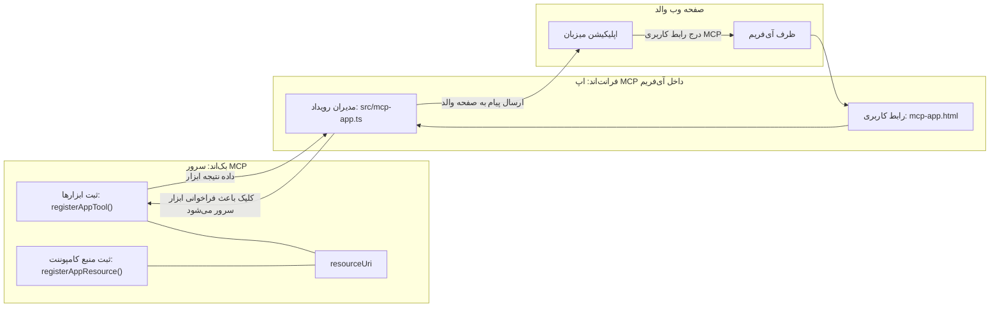

# برنامه‌های MCP

برنامه‌های MCP یک پارادایم جدید در MCP هستند. ایده این است که نه تنها با داده‌ها از یک فراخوانی ابزار پاسخ می‌دهید، بلکه اطلاعاتی درباره چگونگی تعامل با این اطلاعات نیز ارائه می‌کنید. این به این معنی است که اکنون نتایج ابزار می‌توانند شامل اطلاعات رابط کاربری نیز باشند. چرا این را می‌خواهیم؟ خب، به نحوه انجام کارهایتان امروز فکر کنید. احتمالاً نتایج یک سرور MCP را با گذاشتن نوعی رابط کاربری جلوی آن مصرف می‌کنید، این کدهایی است که باید بنویسید و نگهداری کنید. گاهی اوقات این همان چیزی است که می‌خواهید، اما گاهی اوقات عالی است اگر بتوانید یک قطعه اطلاعات خودکفا که همه چیز از داده تا رابط کاربری را دارد، بیاورید.

## نمای کلی

این درس راهنمایی‌های عملی درباره برنامه‌های MCP، نحوه شروع کار با آن و چگونگی ادغام آن در برنامه‌های وب موجود شما ارائه می‌دهد. برنامه‌های MCP یک افزوده کاملاً جدید به استاندارد MCP هستند.

## اهداف آموزشی

تا پایان این درس، شما قادر خواهید بود:

- توضیح دهید برنامه‌های MCP چیستند.
- کی از برنامه‌های MCP استفاده کنید.
- برنامه‌های MCP خود را بسازید و ادغام کنید.

## برنامه‌های MCP - چگونه کار می‌کند

ایده برنامه‌های MCP ارائه پاسخی است که اساساً یک کامپوننت برای رندر شدن است. چنین کامپوننتی می‌تواند هم بصری و هم تعاملی باشد، مثلاً کلیک روی دکمه، ورودی کاربر و بیشتر. بیایید با سمت سرور و سرور MCP خود شروع کنیم. برای ایجاد یک کامپوننت برنامه MCP باید یک ابزار و همچنین منبع اپلیکیشن بسازید. این دو نیمه با resourceUri به هم متصل می‌شوند.

در اینجا یک مثال است. بیایید سعی کنیم آنچه درگیر است را تجسم کنیم و ببینیم کدام قسمت چه کاری انجام می‌دهد:

```text
server.ts -- responsible for registering tools and the component as a UI component
src/
  mcp-app.ts -- wiring up event handlers
mcp-app.html -- the user interface
```

این تصویر معماری ساخت یک کامپوننت و منطق آن را شرح می‌دهد.


در ادامه مسئولیت‌های بخش بک‌اند و فرانت‌اند را به ترتیب شرح می‌دهیم.

### بخش بک‌اند

دو کار باید انجام دهیم:

- ثبت ابزارهایی که می‌خواهیم با آنها تعامل داشته باشیم.
- تعریف کامپوننت.

**ثبت ابزار**

```typescript
registerAppTool(
    server,
    "get-time",
    {
      title: "Get Time",
      description: "Returns the current server time.",
      inputSchema: {},
      _meta: { ui: { resourceUri } }, // این ابزار را به منبع رابط کاربری آن متصل می‌کند
    },
    async () => {
      const time = new Date().toISOString();
      return { content: [{ type: "text", text: time }] };
    },
  );

```

کد بالا رفتار را شرح می‌دهد که یک ابزار به نام `get-time` را افشا می‌کند. این ابزار ورودی نمی‌گیرد اما در نهایت زمان فعلی را تولید می‌کند. ما توانایی تعریف یک `inputSchema` برای ابزارهایی داریم که باید ورودی کاربر را بپذیرند.

**ثبت کامپوننت**

در همان فایل، باید کامپوننت را هم ثبت کنیم:

```typescript
const resourceUri = "ui://get-time/mcp-app.html";

// ثبت منبع، که HTML/جاوااسکریپت بسته‌بندی‌شده برای رابط کاربری را برمی‌گرداند.
registerAppResource(
  server,
  resourceUri,
  resourceUri,
  { mimeType: RESOURCE_MIME_TYPE },
  async () => {
    const html = await fs.readFile(path.join(DIST_DIR, "mcp-app.html"), "utf-8");

    return {
    contents: [
        { uri: resourceUri, mimeType: RESOURCE_MIME_TYPE, text: html },
    ],
    };
  },
);
```

توجه کنید چگونه `resourceUri` را برای اتصال کامپوننت با ابزارهای آن ذکر می‌کنیم. نکته جالب همچنین کال‌بک است که فایل UI را بارگیری کرده و کامپوننت را باز می‌گرداند.

### فرانت‌اند کامپوننت

مانند بخش بک‌اند، دو بخش داریم:

- یک فرانت‌اند نوشته شده در HTML خالص.
- کدی که رویدادها را مدیریت می‌کند و کارهایی مثل فراخوانی ابزارها یا ارسال پیام به پنجره والد را انجام می‌دهد.

**رابط کاربری**

بیایید به رابط کاربری نگاه کنیم.

```html
<!-- mcp-app.html -->
<!DOCTYPE html>
<html lang="en">
  <head>
    <meta charset="UTF-8" />
    <title>Get Time App</title>
  </head>
  <body>
    <p>
      <strong>Server Time:</strong> <code id="server-time">Loading...</code>
    </p>
    <button id="get-time-btn">Get Server Time</button>
    <script type="module" src="/src/mcp-app.ts"></script>
  </body>
</html>
```

**وصل کردن رویدادها**

آخرین بخش وصل کردن رویدادها است. یعنی شناسایی اینکه کدام بخش در UI ما نیاز به هندلر رویداد دارد و چه کاری هنگام بروز رویداد باید انجام شود:

```typescript
// mcp-app.ts

import { App } from "@modelcontextprotocol/ext-apps";

// دریافت ارجاعات عناصر
const serverTimeEl = document.getElementById("server-time")!;
const getTimeBtn = document.getElementById("get-time-btn")!;

// ایجاد نمونه برنامه
const app = new App({ name: "Get Time App", version: "1.0.0" });

// مدیریت نتایج ابزار از سرور. قبل از `app.connect()` تنظیم شود تا از
// از دست ندادن نتیجه اولیه ابزار جلوگیری شود.
app.ontoolresult = (result) => {
  const time = result.content?.find((c) => c.type === "text")?.text;
  serverTimeEl.textContent = time ?? "[ERROR]";
};

// اتصال کارکرد دکمه کلیک
getTimeBtn.addEventListener("click", async () => {
  // `app.callServerTool()` به رابط کاربری اجازه می‌دهد تا داده‌های تازه از سرور درخواست کند
  const result = await app.callServerTool({ name: "get-time", arguments: {} });
  const time = result.content?.find((c) => c.type === "text")?.text;
  serverTimeEl.textContent = time ?? "[ERROR]";
});

// اتصال به میزبان
app.connect();
```

همانطور که از بالا می‌بینید، این کد معمولی برای وصل کردن عناصر DOM به رویدادها است. شایسته ذکر است فراخوانی `callServerTool` که در نهایت ابزاری در سمت بک‌اند را فرا می‌خواند.

## مدیریت ورودی کاربر

تا کنون، یک کامپوننت دیدیم که دکمه‌ای دارد که وقتی کلیک می‌شود ابزاری را فرا می‌خواند. بیایید ببینیم آیا می‌توانیم المان‌های UI بیشتری مانند یک فیلد ورودی اضافه کنیم و ببینیم می‌توانیم آرگومان‌ها را به یک ابزار بفرستیم یا خیر. بیایید یک قابلیت FAQ پیاده‌سازی کنیم. کارکرد آن به این صورت است:

- باید یک دکمه و یک المان ورودی باشد که کاربر یک کلمه کلیدی برای جستجو تایپ کند، مثلاً "Shipping". این باید ابزاری در بک‌اند را فراخوانی کند که در داده‌های FAQ جستجو می‌کند.
- ابزاری که از جستجوی FAQ مذکور پشتیبانی کند.

ابتدا پشتیبانی لازم را به بک‌اند اضافه کنیم:

```typescript
const faq: { [key: string]: string } = {
    "shipping": "Our standard shipping time is 3-5 business days.",
    "return policy": "You can return any item within 30 days of purchase.",
    "warranty": "All products come with a 1-year warranty covering manufacturing defects.",
  }

registerAppTool(
    server,
    "get-faq",
    {
      title: "Search FAQ",
      description: "Searches the FAQ for relevant answers.",
      inputSchema: zod.object({
        query: zod.string().default("shipping"),
      }),
      _meta: { ui: { resourceUri: faqResourceUri } }, // این ابزار را به منبع UI آن پیوند می‌دهد
    },
    async ({ query }) => {
      const answer: string = faq[query.toLowerCase()] || "Sorry, I don't have an answer for that.";
      return { content: [{ type: "text", text: answer }] };
    },
  );
```

آنچه مشاهده می‌کنیم این است که چگونه `inputSchema` را پر می‌کنیم و یک اسکیمای `zod` به آن می‌دهیم:

```typescript
inputSchema: zod.object({
  query: zod.string().default("shipping"),
})
```

در اسکیمای بالا اعلام کرده‌ایم پارامتری ورودی به نام `query` داریم که اختیاری است و مقدار پیش‌فرض "shipping" است.

خوب، بیایید به *mcp-app.html* برویم تا ببینیم چه UI باید بسازیم:

```html
<div class="faq">
    <h1>FAQ response</h1>
    <p>FAQ Response: <code id="faq-response">Loading...</code></p>
    <input type="text" id="faq-query" placeholder="Enter FAQ query" />
    <button id="get-faq-btn">Get FAQ Response</button>
  </div>
```

عالی است، حالا یک المان ورودی و دکمه داریم. بیایید به *mcp-app.ts* برای وصل کردن این رویدادها برویم:

```typescript
const getFaqBtn = document.getElementById("get-faq-btn")!;
const faqQueryInput = document.getElementById("faq-query") as HTMLInputElement;

getFaqBtn.addEventListener("click", async () => {
  const query = faqQueryInput.value;
  const result = await app.callServerTool({ name: "get-faq", arguments: { query } });
  const faq = result.content?.find((c) => c.type === "text")?.text;
  faqResponseEl.textContent = faq ?? "[ERROR]";
});
```

در کد بالا ما:

- ارجاعات به عناصر UI تعاملی ایجاد کردیم.
- کلیک دکمه را مدیریت کردیم تا مقدار المان ورودی را تجزیه کرده و همچنین `app.callServerTool()` را با `name` و `arguments` فراخوانی کنیم که در دومی `query` به عنوان مقدار ارسال می‌شود.

وقتی با `callServerTool` تماس می‌گیرید در واقع پیامی به پنجره والد ارسال می‌شود و آن پنجره در نهایت سرور MCP را فرا می‌خواند.

### امتحان کنید

وقتی این را امتحان کنیم، باید موارد زیر را ببینیم:


و حالا جایی که آن را با ورودی مانند "warranty" امتحان می‌کنیم:


برای اجرای این کد، به [بخش کد](./code/README.md) مراجعه کنید

## تست در ویژوال استودیو کد

ویژوال استودیو کد پشتیبانی عالی از برنامه‌های MCP دارد و احتمالاً یکی از آسان‌ترین روش‌ها برای تست برنامه‌های MCP شماست. برای استفاده از ویژوال استودیو کد، یک ورودی سرور به *mcp.json* اضافه کنید به این صورت:

```json
"my-mcp-server-7178eca7": {
    "url": "http://localhost:3001/mcp",
    "type": "http"
  }
```

سپس سرور را راه‌اندازی کنید، باید بتوانید از طریق پنجره چت با برنامه MCP خود ارتباط برقرار کنید به شرطی که GitHub Copilot را نصب کرده باشید.

می‌توانید آن را با یک پرامپت فعال کنید، برای مثال "#get-faq":


و دقیقاً مانند زمانی که آن را از طریق مرورگر وب اجرا کردید، همانطور رندر می‌کند:


## تکلیف

یک بازی سنگ، کاغذ، قیچی بسازید. باید شامل موارد زیر باشد:

رابط کاربری:

- یک لیست کشویی با گزینه‌ها
- یک دکمه برای ارسال انتخاب
- یک برچسب که نشان دهد چه کسی چه انتخابی داشت و چه کسی برنده شد

سرور:

- باید ابزاری سنگ، کاغذ، قیچی داشته باشد که ورودی "choice" را می‌گیرد. همچنین باید انتخاب کامپیوتر را رندر کند و برنده را تعیین کند

## راه‌حل

[راه‌حل](./assignment/README.md)

## خلاصه

ما درباره پارادایم جدید برنامه‌های MCP یاد گرفتیم. این پارادایم جدید اجازه می‌دهد سرورهای MCP فقط درباره داده‌ها نظر ندهند بلکه درباره چگونگی ارائه این داده‌ها نیز نظر دهند.

علاوه بر این، فهمیدیم که این برنامه‌های MCP در یک IFrame میزبانی می‌شوند و برای ارتباط با سرورهای MCP نیاز دارند پیام‌هایی به برنامه وب والد ارسال کنند. کتابخانه‌های مختلفی هم برای جاوااسکریپت خالص و هم React و غیره وجود دارند که این ارتباط را آسان‌تر می‌کنند.

## نکات کلیدی

چیزهایی که یاد گرفتید:

- برنامه‌های MCP یک استاندارد جدید هستند که وقتی می‌خواهید داده‌ها و ویژگی‌های UI را با هم ارسال کنید مفیدند.
- این نوع برنامه‌ها به دلایل امنیتی در IFrame اجرا می‌شوند.

## ادامه مطلب

- [فصل ۴](../../04-PracticalImplementation/README.md)

---

<!-- CO-OP TRANSLATOR DISCLAIMER START -->
**تذکر**:  
این سند با استفاده از سرویس ترجمه هوش مصنوعی [Co-op Translator](https://github.com/Azure/co-op-translator) ترجمه شده است. در حالی که ما در تلاش برای دقت هستیم، لطفاً توجه داشته باشید که ترجمه‌های خودکار ممکن است شامل خطاها یا نادرستی‌هایی باشند. سند اصلی به زبان مبدا باید به عنوان منبع معتبر در نظر گرفته شود. برای اطلاعات حیاتی، ترجمه حرفه‌ای انسانی توصیه می‌شود. ما مسئول هیچ‌گونه سوءتفاهم یا تفسیر نادرستی که از استفاده این ترجمه ناشی شود، نیستیم.
<!-- CO-OP TRANSLATOR DISCLAIMER END -->