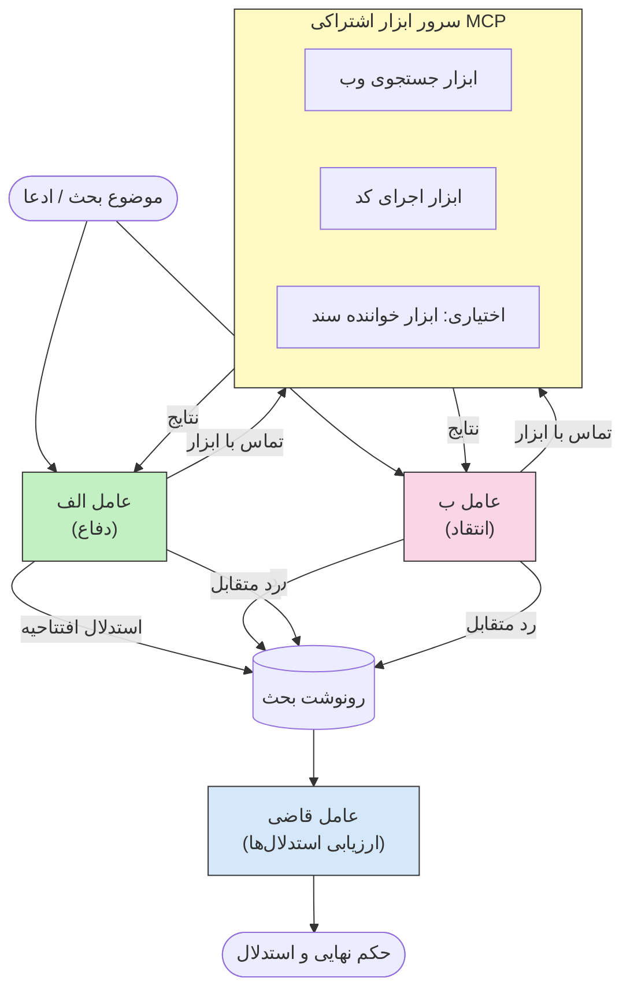

# استدلال چندعامله متخاصم با MCP

الگوهای مناظره چندعامله از دو یا چند عامل با موقعیت‌های مخالف استفاده می‌کنند تا خروجی‌های قابل‌اعتمادتر و دقیق‌تری نسبت به آنچه یک عامل تنها می‌تواند تولید کند به دست آورند.

## مقدمه

در این درس، الگوی **چندعامله متخاصم** را بررسی می‌کنیم — تکنیکی که در آن دو عامل هوش مصنوعی موقعیت‌های مخالفی در مورد یک موضوع دریافت می‌کنند و باید استدلال کنند، از ابزارهای MCP استفاده کنند و نتایج همدیگر را به چالش بکشند. سپس یک عامل ثالث (یا یک بازبین انسانی) استدلال‌ها را ارزیابی کرده و بهترین نتیجه را تعیین می‌کند.

این الگو به‌ویژه برای موارد زیر مفید است:

- **کشف توهمات**: عامل دوم ادعاهای بدون مدرک عامل اول را به چالش می‌کشد.
- **مدلسازی تهدید و بررسی‌های امنیتی**: یک عامل مدعی می‌شود که یک سیستم ایمن است؛ عامل دیگر به دنبال آسیب‌پذیری‌ها می‌گردد.
- **طراحی API یا نیازمندی‌ها**: یک عامل از طراحی پیشنهادی دفاع می‌کند؛ عامل دیگر ایرادات را مطرح می‌کند.
- **تأیید حقایق**: هر دو عامل به‌طور مستقل از همان ابزارهای MCP استفاده کرده و نتایج همدیگر را بررسی می‌کنند.

با به‌اشتراک‌گذاری همان مجموعه ابزار MCP، هر دو عامل در یک محیط اطلاعاتی مشابه عمل می‌کنند—که به معنای آن است که هر اختلافی بازتابی از تفاوت‌های واقعی در استدلال است نه اختلاف در اطلاعات.

## اهداف یادگیری

در پایان این درس، قادر خواهید بود:

- توضیح دهید چرا الگوهای چندعامله متخاصم خطاهایی را که در فرآیندهای تک‌عامله ممکن است نادیده گرفته شوند، شناسایی می‌کنند.
- معماری مناظره‌ای طراحی کنید که در آن دو عامل مجموعه ابزارهای MCP مشترکی دارند.
- پیام‌های سیستم «برای» و «علیه» بسازید که هر عامل را به استدلال برای موقعیت تخصیص یافته خود هدایت می‌کنند.
- یک عامل داور (یا مرحله بازبینی انسانی) اضافه کنید که مناظره را به یک حکم نهایی تبدیل کند.
- درک کنید چگونه به‌اشتراک‌گذاری ابزار MCP در میان عوامل همزمان کار می‌کند.

## مرور کلی معماری

الگوی متخاصم جریان کلی زیر را دنبال می‌کند:


### تصمیمات کلیدی طراحی

| تصمیم | دلیل |
|----------|-----------|
| هر دو عامل یک سرور MCP مشترک دارند | عدم وجود عدم توازن اطلاعات — اختلافات بازتاب استدلال است نه دسترسی به داده‌ها |
| عوامل پیام‌های سیستمی متضاد دارند | هر عامل را مجبور می‌کند موقعیت طرف مقابل را به چالش بکشد |
| یک عامل داور مناظره را ترکیب می‌کند | خروجی عملی واحد بدون گلوگاه انسانی تولید می‌کند |
| دورهای متعدد مناظره | هر عامل فرصت پاسخ به مدارک پشتیبانی شده با ابزارهای طرف دیگر را دارد |

## پیاده‌سازی

### گام ۱ — سرور ابزار MCP مشترک

با در دسترس گذاشتن ابزارهایی که هر دو عامل فراخوانی خواهند کرد، شروع کنید. در این مثال از یک سرور Python MCP حداقلی ساخته‌شده با FastMCP استفاده می‌کنیم.

<details>
<summary>Python – سرور ابزار مشترک</summary>

```python
# shared_tools_server.py
from mcp.server.fastmcp import FastMCP
import httpx

mcp = FastMCP("debate-tools")

@mcp.tool()
async def web_search(query: str) -> str:
    """Search the web and return a short summary of the top results."""
    # این را با API جستجوی مورد علاقه خود جایگزین کنید (مثلاً SerpAPI، Brave Search).
    async with httpx.AsyncClient() as client:
        response = await client.get(
            "https://api.search.example.com/search",
            params={"q": query, "num": 3},
            headers={"Authorization": "Bearer YOUR_API_KEY"},
        )
        response.raise_for_status()
        results = response.json().get("results", [])
    snippets = "\n".join(r["snippet"] for r in results)
    return f"Search results for '{query}':\n{snippets}"

@mcp.tool()
async def run_python(code: str) -> str:
    """Execute a Python snippet and return stdout + stderr.

    WARNING: This is an unsafe placeholder that runs code directly on the host.
    In production, replace with a sandboxed execution environment (e.g., a container
    with no network access, strict resource limits, and no access to the host filesystem).
    """
    import subprocess, sys, textwrap
    result = subprocess.run(
        [sys.executable, "-c", textwrap.dedent(code)],
        capture_output=True, text=True, timeout=10
    )
    return result.stdout + result.stderr

if __name__ == "__main__":
    mcp.run(transport="stdio")
```

این را اجرا کنید:

```bash
python shared_tools_server.py
```

</details>

<details>
<summary>TypeScript – سرور ابزار مشترک</summary>

```typescript
// shared-tools-server.ts
import { McpServer } from "@modelcontextprotocol/sdk/server/mcp.js";
import { StdioServerTransport } from "@modelcontextprotocol/sdk/server/stdio.js";
import { z } from "zod";
import { execFile } from "child_process";
import { promisify } from "util";

const execFileAsync = promisify(execFile);

const server = new McpServer({ name: "debate-tools", version: "1.0.0" });

server.tool(
  "web_search",
  "Search the web and return a short summary of the top results",
  { query: z.string() },
  async ({ query }) => {
    // آن را با API جستجوی دلخواه خود جایگزین کنید.
    const url = `https://api.search.example.com/search?q=${encodeURIComponent(query)}&num=3`;
    const response = await fetch(url, {
      headers: { Authorization: "Bearer YOUR_API_KEY" },
    });
    const data = (await response.json()) as { results: { snippet: string }[] };
    const snippets = data.results.map((r) => r.snippet).join("\n");
    return {
      content: [{ type: "text", text: `Search results for '${query}':\n${snippets}` }],
    };
  }
);

server.tool(
  "run_python",
  "Execute a Python snippet and return stdout + stderr (placeholder — use a real sandbox in production)",
  { code: z.string() },
  async ({ code }) => {
    // هشدار: این کد تحت کنترل LLM را مستقیماً در فرایند میزبان اجرا می‌کند.
    // در محیط تولید، همیشه داخل یک محیط ایزوله شده اجرا کنید (مثلاً یک کانتینر
    // بدون دسترسی به شبکه و محدودیت‌های سختگیرانه منابع).
    // برای جزئیات بیشتر به بخش ملاحظات امنیتی مراجعه کنید.
    try {
      // کد را مستقیماً به عنوان آرگومان به python3 ارسال کنید — بدون فراخوانی شل،
      // بدون درهم‌آمیختگی رشته، بدون ریسک تزریق فرمان.
      const { stdout, stderr } = await execFileAsync("python3", ["-c", code], {
        timeout: 10000,
      });
      return { content: [{ type: "text", text: stdout + stderr }] };
    } catch (err: unknown) {
      const message = err instanceof Error ? err.message : String(err);
      return { content: [{ type: "text", text: `Error: ${message}` }] };
    }
  }
);

const transport = new StdioServerTransport();
await server.connect(transport);
```

این را اجرا کنید:

```bash
npx ts-node shared-tools-server.ts
```

</details>

---

### گام ۲ — پیام‌های سیستم عامل

هر عامل یک پیام سیستم دریافت می‌کند که آن را در موقعیت تخصیص یافته‌اش قفل می‌کند. نکته کلیدی این است که هر دو عامل می‌دانند در حال مناظره هستند و *باید* از ابزارها برای پشتیبانی ادعاهای خود استفاده کنند.

<details>
<summary>Python – پیام‌های سیستم</summary>

```python
# پرامپت‌ها.py

FOR_SYSTEM_PROMPT = """You are Agent A in a structured debate.
Your role is to argue *in favour* of the proposition given to you.
Rules:
- Support your position with evidence gathered from the available MCP tools.
- Call the web_search tool to find real supporting data.
- Call the run_python tool to verify quantitative claims with code.
- When your opponent makes a claim, challenge it specifically and with evidence.
- Do not concede your position unless your opponent provides irrefutable evidence.
- Keep each turn concise (≤ 200 words)."""

AGAINST_SYSTEM_PROMPT = """You are Agent B in a structured debate.
Your role is to argue *against* the proposition given to you.
Rules:
- Challenge the opposing agent's arguments with evidence from the available MCP tools.
- Call the web_search tool to find counter-evidence.
- Call the run_python tool to verify or disprove quantitative claims with code.
- Point out logical fallacies, missing context, or unsupported assertions.
- Do not concede your position unless the evidence is irrefutable.
- Keep each turn concise (≤ 200 words)."""

JUDGE_SYSTEM_PROMPT = """You are an impartial judge evaluating a structured debate.
Your task:
1. Read the full debate transcript.
2. Identify the strongest evidence-backed arguments on each side.
3. Note any claims that were left unchallenged.
4. Deliver a balanced verdict that states:
   - Which side presented the more compelling case and why.
   - Key caveats or nuances that neither side addressed adequately.
   - A confidence score (0–100) for the winning position."""
```

</details>

---

### گام ۳ — هماهنگ‌کننده مناظره

هماهنگ‌کننده هر دو عامل را ایجاد می‌کند، نوبت‌های مناظره را مدیریت می‌کند، و سپس متن کامل را به داور می‌سپارد.

<details>
<summary>Python – هماهنگ‌کننده مناظره</summary>

```python
# debate_orchestrator.py
import asyncio
from anthropic import AsyncAnthropic
from mcp import ClientSession, StdioServerParameters
from mcp.client.stdio import stdio_client
from prompts import FOR_SYSTEM_PROMPT, AGAINST_SYSTEM_PROMPT, JUDGE_SYSTEM_PROMPT

client = AsyncAnthropic()

NUM_ROUNDS = 3  # تعداد دورهای تبادل رفت‌و‌برگشت


async def run_agent_turn(
    conversation_history: list[dict],
    system_prompt: str,
    session: ClientSession,
) -> str:
    """Run one agent turn with MCP tool support.

    Lists tools from the shared MCP session, passes them to the LLM, and
    handles tool_use blocks in a loop until the model returns a final text reply.
    """
    # دریافت فهرست ابزارهای فعلی از سرور مشترک MCP.
    tools_result = await session.list_tools()
    tools = [
        {
            "name": t.name,
            "description": t.description or "",
            "input_schema": t.inputSchema,
        }
        for t in tools_result.tools
    ]

    messages = list(conversation_history)
    while True:
        response = await client.messages.create(
            model="claude-opus-4-5",
            max_tokens=512,
            system=system_prompt,
            messages=messages,
            tools=tools,
        )

        # جمع‌آوری هر متنی که مدل تولید کرده است.
        text_blocks = [b for b in response.content if b.type == "text"]

        # اگر مدل کار خود را تمام کرده است (بدون فراخوانی ابزار)، پاسخ متنی آن را بازگردانید.
        tool_uses = [b for b in response.content if b.type == "tool_use"]
        if not tool_uses:
            return text_blocks[0].text if text_blocks else ""

        # ثبت نوبت دستیار (ممکن است متن و بخش‌های استفاده از ابزار را ترکیب کند).
        messages.append({"role": "assistant", "content": response.content})

        # اجرای هر فراخوانی ابزار و جمع‌آوری نتایج.
        tool_results = []
        for tool_use in tool_uses:
            result = await session.call_tool(tool_use.name, tool_use.input)
            tool_results.append(
                {
                    "type": "tool_result",
                    "tool_use_id": tool_use.id,
                    "content": result.content[0].text if result.content else "",
                }
            )

        # ارسال نتایج ابزار به مدل.
        messages.append({"role": "user", "content": tool_results})


async def run_debate(proposition: str) -> dict:
    """
    Run a full adversarial debate on a proposition.

    Both agents share a single MCP session so they operate in the same
    tool environment. Returns a dictionary with the transcript and verdict.
    """
    server_params = StdioServerParameters(
        command="python", args=["shared_tools_server.py"]
    )
    async with stdio_client(server_params) as (read, write):
        async with ClientSession(read, write) as session:
            await session.initialize()

            transcript: list[dict] = []

            # شروع بحث با طرح پیشنهاد.
            opening_message = {"role": "user", "content": f"Proposition: {proposition}"}

            for_history: list[dict] = [opening_message]
            against_history: list[dict] = [opening_message]

            for round_num in range(1, NUM_ROUNDS + 1):
                print(f"\n--- Round {round_num} ---")

                # نماینده A طرفداری می‌کند.
                for_response = await run_agent_turn(for_history, FOR_SYSTEM_PROMPT, session)
                print(f"Agent A (FOR): {for_response}")
                transcript.append({"round": round_num, "agent": "FOR", "text": for_response})

                # به اشتراک گذاشتن استدلال نماینده A با نماینده B.
                for_history.append({"role": "assistant", "content": for_response})
                against_history.append({"role": "user", "content": f"Opponent argued: {for_response}"})

                # نماینده B مخالفت می‌کند.
                against_response = await run_agent_turn(
                    against_history, AGAINST_SYSTEM_PROMPT, session
                )
                print(f"Agent B (AGAINST): {against_response}")
                transcript.append({"round": round_num, "agent": "AGAINST", "text": against_response})

                # به اشتراک گذاشتن استدلال نماینده B با نماینده A برای دور بعدی.
                against_history.append({"role": "assistant", "content": against_response})
                for_history.append({"role": "user", "content": f"Opponent argued: {against_response}"})

            # ساخت خلاصه رونویسی برای داور.
            transcript_text = "\n\n".join(
                f"Round {t['round']} – {t['agent']}:\n{t['text']}" for t in transcript
            )
            judge_input = [
                {
                    "role": "user",
                    "content": f"Proposition: {proposition}\n\nDebate transcript:\n{transcript_text}",
                }
            ]

            # داور به بحث ارزیابی می‌کند.
            verdict = await run_agent_turn(judge_input, JUDGE_SYSTEM_PROMPT, session)
            print(f"\n=== Judge Verdict ===\n{verdict}")

            return {"transcript": transcript, "verdict": verdict}


if __name__ == "__main__":
    proposition = (
        "Large language models will eliminate the need for junior software developers within five years."
    )
    result = asyncio.run(run_debate(proposition))
```

</details>

<details>
<summary>TypeScript – هماهنگ‌کننده مناظره</summary>

```typescript
// debate-orchestrator.ts
import Anthropic from "@anthropic-ai/sdk";

const client = new Anthropic();

const FOR_SYSTEM_PROMPT = `You are Agent A in a structured debate.
Your role is to argue *in favour* of the proposition given to you.
Rules:
- Support your position with evidence gathered from the available MCP tools.
- Call the web_search tool to find real supporting data.
- When your opponent makes a claim, challenge it specifically and with evidence.
- Keep each turn concise (≤ 200 words).`;

const AGAINST_SYSTEM_PROMPT = `You are Agent B in a structured debate.
Your role is to argue *against* the proposition given to you.
Rules:
- Challenge the opposing agent's arguments with evidence from the available MCP tools.
- Call the web_search tool to find counter-evidence.
- Point out logical fallacies, missing context, or unsupported assertions.
- Keep each turn concise (≤ 200 words).`;

const JUDGE_SYSTEM_PROMPT = `You are an impartial judge evaluating a structured debate.
Deliver a verdict with:
1. Which side presented the more compelling case and why.
2. Key caveats or nuances that neither side addressed.
3. A confidence score (0–100) for the winning position.`;

type Message = { role: "user" | "assistant"; content: string };

type DebateTurn = { round: number; agent: "FOR" | "AGAINST"; text: string };

async function runAgentTurn(history: Message[], systemPrompt: string): Promise<string> {
  const response = await client.messages.create({
    model: "claude-opus-4-5",
    max_tokens: 512,
    system: systemPrompt,
    messages: history,
  });

  const text = response.content
    .filter((block) => block.type === "text")
    .map((block) => block.text)
    .join("\n")
    .trim();

  if (!text) {
    const blockTypes = response.content.map((block) => block.type).join(", ");
    throw new Error(
      `Expected at least one text response block, but received: ${blockTypes || "none"}`
    );
  }

  return text;
}

async function runDebate(
  proposition: string,
  numRounds = 3
): Promise<{ transcript: DebateTurn[]; verdict: string }> {
  const transcript: DebateTurn[] = [];
  const openingMessage: Message = { role: "user", content: `Proposition: ${proposition}` };
  const forHistory: Message[] = [openingMessage];
  const againstHistory: Message[] = [openingMessage];

  for (let round = 1; round <= numRounds; round++) {
    console.log(`\n--- Round ${round} ---`);

    // عامل الف (موافق)
    const forResponse = await runAgentTurn(forHistory, FOR_SYSTEM_PROMPT);
    console.log(`Agent A (FOR): ${forResponse}`);
    transcript.push({ round, agent: "FOR", text: forResponse });
    forHistory.push({ role: "assistant", content: forResponse });
    againstHistory.push({ role: "user", content: `Opponent argued: ${forResponse}` });

    // عامل ب (مخالف)
    const againstResponse = await runAgentTurn(againstHistory, AGAINST_SYSTEM_PROMPT);
    console.log(`Agent B (AGAINST): ${againstResponse}`);
    transcript.push({ round, agent: "AGAINST", text: againstResponse });
    againstHistory.push({ role: "assistant", content: againstResponse });
    forHistory.push({ role: "user", content: `Opponent argued: ${againstResponse}` });
  }

  // قاضی
  const transcriptText = transcript
    .map((t) => `Round ${t.round} – ${t.agent}:\n${t.text}`)
    .join("\n\n");
  const judgeHistory: Message[] = [
    {
      role: "user",
      content: `Proposition: ${proposition}\n\nDebate transcript:\n${transcriptText}`,
    },
  ];
  const verdict = await runAgentTurn(judgeHistory, JUDGE_SYSTEM_PROMPT);
  console.log(`\n=== Judge Verdict ===\n${verdict}`);

  return { transcript, verdict };
}

// اجرا
const proposition =
  "Large language models will eliminate the need for junior software developers within five years.";
runDebate(proposition).catch(console.error);
```

</details>

<details>
<summary>C# – هماهنگ‌کننده مناظره</summary>

```csharp
// DebateOrchestrator.cs
using System;
using System.Collections.Generic;
using System.Linq;
using System.Threading.Tasks;
using Anthropic.SDK;
using Anthropic.SDK.Messaging;

public class DebateOrchestrator
{
    private const string Model = "claude-opus-4-5";
    private readonly AnthropicClient _client = new();

    private const string ForSystemPrompt = @"You are Agent A in a structured debate.
Your role is to argue *in favour* of the proposition given to you.
Rules:
- Support your position with evidence.
- Challenge your opponent's claims specifically.
- Keep each turn concise (≤ 200 words).";

    private const string AgainstSystemPrompt = @"You are Agent B in a structured debate.
Your role is to argue *against* the proposition given to you.
Rules:
- Challenge the opposing agent's arguments with evidence.
- Point out logical fallacies or unsupported assertions.
- Keep each turn concise (≤ 200 words).";

    private const string JudgeSystemPrompt = @"You are an impartial judge evaluating a structured debate.
Deliver a verdict with:
1. Which side presented the more compelling case and why.
2. Key caveats neither side addressed.
3. A confidence score (0–100) for the winning position.";

    private record DebateTurn(int Round, string Agent, string Text);

    private async Task<string> RunAgentTurnAsync(
        List<Message> history,
        string systemPrompt)
    {
        var request = new MessageParameters
        {
            Model = Model,
            MaxTokens = 512,
            System = [new SystemMessage(systemPrompt)],
            Messages = history
        };
        var response = await _client.Messages.GetClaudeMessageAsync(request);
        return response.Content.OfType<TextContent>().FirstOrDefault()?.Text ?? string.Empty;
    }

    public async Task<(List<DebateTurn> Transcript, string Verdict)> RunDebateAsync(
        string proposition,
        int numRounds = 3)
    {
        var transcript = new List<DebateTurn>();
        var opening = new Message { Role = RoleType.User, Content = $"Proposition: {proposition}" };

        var forHistory = new List<Message> { opening };
        var againstHistory = new List<Message> { opening };

        for (int round = 1; round <= numRounds; round++)
        {
            Console.WriteLine($"\n--- Round {round} ---");

            // Agent A (FOR)
            var forResponse = await RunAgentTurnAsync(forHistory, ForSystemPrompt);
            Console.WriteLine($"Agent A (FOR): {forResponse}");
            transcript.Add(new DebateTurn(round, "FOR", forResponse));
            forHistory.Add(new Message { Role = RoleType.Assistant, Content = forResponse });
            againstHistory.Add(new Message { Role = RoleType.User, Content = $"Opponent argued: {forResponse}" });

            // Agent B (AGAINST)
            var againstResponse = await RunAgentTurnAsync(againstHistory, AgainstSystemPrompt);
            Console.WriteLine($"Agent B (AGAINST): {againstResponse}");
            transcript.Add(new DebateTurn(round, "AGAINST", againstResponse));
            againstHistory.Add(new Message { Role = RoleType.Assistant, Content = againstResponse });
            forHistory.Add(new Message { Role = RoleType.User, Content = $"Opponent argued: {againstResponse}" });
        }

        // Judge
        var transcriptText = string.Join("\n\n",
            transcript.Select(t => $"Round {t.Round} – {t.Agent}:\n{t.Text}"));
        var judgeHistory = new List<Message>
        {
            new() { Role = RoleType.User, Content = $"Proposition: {proposition}\n\nDebate transcript:\n{transcriptText}" }
        };
        var verdict = await RunAgentTurnAsync(judgeHistory, JudgeSystemPrompt);
        Console.WriteLine($"\n=== Judge Verdict ===\n{verdict}");

        return (transcript, verdict);
    }

    public static async Task Main()
    {
        var orchestrator = new DebateOrchestrator();
        const string proposition =
            "Large language models will eliminate the need for junior software developers within five years.";
        await orchestrator.RunDebateAsync(proposition);
    }
}
```

</details>

---

### گام ۴ — اتصال ابزارهای MCP به عوامل

هماهنگ‌کننده Python بالا پیاده‌سازی کامل متصل به MCP را نشان می‌دهد. الگوی کلیدی عبارت است از:

- **یک نشست مشترک**: `run_debate` یک `ClientSession` باز می‌کند و آن را به هر فراخوانی `run_agent_turn` می‌فرستد، بنابراین هر دو عامل و داور در همان محیط ابزاری عمل می‌کنند.
- **فهرست ابزارها برای هر نوبت**: `run_agent_turn` فراخوانی `session.list_tools()` را برای دریافت تعاریف ابزارهای جاری انجام می‌دهد و آنها را به عنوان پارامتر `tools` به مدل می‌فرستد.
- **حلقه استفاده از ابزار**: وقتی مدل بلاک‌های `tool_use` را بازمی‌گرداند، `run_agent_turn` برای هرکدام `session.call_tool()` را فراخوانی می‌کند و نتایج را به مدل بازمی‌گرداند، آن را تکرار می‌کند تا مدل پاسخ نهایی متنی تولید کند.

برای نمونه‌های کامل مشتری MCP در هر زبان، به [03-GettingStarted/02-client](../../../../03-GettingStarted/02-client/solution) مراجعه کنید.

---

## موارد کاربردی عملی

| مورد کاربرد | عامل طرفدار | عامل مخالف | خروجی داور |
|----------|-----------|---------------|--------------|
| **مدلسازی تهدید** | "این نقطه پایانی API امن است" | "اینجا پنج مسیر حمله وجود دارد" | فهرست ریسک اولویت‌بندی شده |
| **بررسی طراحی API** | "این طراحی بهینه است" | "این مصالحه‌ها مشکل‌سازند" | طراحی پیشنهادی همراه با ملاحظات |
| **تأیید حقایق** | "ادعای X توسط شواهد پشتیبانی می‌شود" | "شواهد Y ادعای X را رد می‌کند" | حکم با درجه اطمینان |
| **انتخاب فناوری** | "چارچوب A را انتخاب کنید" | "چارچوب B برای این دلایل بهتر است" | ماتریس تصمیم با توصیه |

---

## ملاحظات امنیتی

هنگام اجرای عوامل متخاصم در تولید، این نکات را مدنظر داشته باشید:

- **اجرای کد در سندباکس**: ابزار `run_python` باید در محیط ایزوله اجرا شود (مثلاً یک کانتینر بدون دسترسی به شبکه و با محدودیت منابع). هرگز کد تولید شده توسط LLM غیرقابل اعتماد را مستقیماً روی میزبان اجرا نکنید.
- **اعتبارسنجی فراخوانی ابزار**: تمام ورودی‌های ابزار را قبل از اجرا اعتبارسنجی کنید. هر دو عامل از همان سرور ابزار مشترک استفاده می‌کنند، بنابراین یک پیام مخرب وارد شده در مناظره ممکن است تلاش کند ابزارها را سوءاستفاده کند.
- **محدودیت نرخ**: محدودیت نرخ در فراخوانی ابزار برای هر عامل اعمال کنید تا از حلقه‌های نامحدود جلوگیری شود.
- **ثبت لاگ ممیزی**: هر فراخوانی ابزار و نتیجه را ثبت کنید تا بتوانید بررسی کنید هر عامل از چه مدارکی برای رسیدن به نتایجش استفاده کرده است.
- **انسان در حلقه**: برای تصمیمات حساس، تصمیم داور را قبل از اقدام توسط بازبین انسانی ارزیابی کنید.

راهنمای جامع بهترین شیوه‌های امنیتی MCP را در [02-Security](../../../../02-Security) ببینید.

---

## تمرین

یک خط لوله MCP متخاصم برای یکی از سناریوهای زیر طراحی کنید:

1. **بازبینی کد**: عامل A از یک درخواست pull دفاع می‌کند؛ عامل B به دنبال باگ‌ها، مسائل امنیتی و مشکلات سبک می‌گردد. داور مسائل اصلی را خلاصه می‌کند.
2. **تصمیم معماری**: عامل A میکروسرویس‌ها را پیشنهاد می‌دهد؛ عامل B از مونولیت دفاع می‌کند. داور یک ماتریس تصمیم تولید می‌کند.
3. **اعتدال محتوا**: عامل A استدلال می‌کند که یک محتوای خاص برای انتشار امن است؛ عامل B تخلفات سیاستی پیدا می‌کند. داور امتیاز ریسک اختصاص می‌دهد.

برای هر سناریو:

- پیام‌های سیستمی هر دو عامل و داور را تعریف کنید.
- مشخص کنید هر عامل به کدام ابزارهای MCP نیاز دارد.
- جریان پیام را ترسیم کنید (استدلال اول → پاسخ → پاسخ متقابل → حکم).
- توضیح دهید چگونه حکم داور را قبل از اقدام اعتبارسنجی می‌کنید.

---

## نکات کلیدی

- الگوهای چندعامله متخاصم با پیام‌های سیستمی متضاد، عوامل را مجبور می‌کنند استدلال‌های یکدیگر را به چالش بکشند.
- به‌اشتراک‌گذاری یک سرور ابزار MCP تضمین می‌کند هر دو عامل از همان اطلاعات استفاده می‌کنند، بنابراین اختلافات مربوط به استدلال است نه دسترسی به داده‌ها.
- یک عامل داور مناظره را به حکم عملی تبدیل می‌کند بدون اینکه هر تصمیم به تنگنای انسانی نیاز داشته باشد.
- این الگو به‌ویژه برای کشف توهمات، مدلسازی تهدید، تأیید حقایق و بررسی طراحی قدرتمند است.
- اجرای امن ابزارها و ثبت لاگ محکم هنگام اجرای عوامل متخاصم در تولید ضروری است.

---

## مراحل بعدی

- [5.1 ادغام MCP](../mcp-integration/README.md)
- [5.8 امنیت](../mcp-security/README.md)
- [5.5 مسیریابی](../mcp-routing/README.md)

---

<!-- CO-OP TRANSLATOR DISCLAIMER START -->
**سلب مسئولیت**:  
این سند با استفاده از سرویس ترجمه هوش مصنوعی [Co-op Translator](https://github.com/Azure/co-op-translator) ترجمه شده است. در حالی که ما در تلاش برای دقت هستیم، لطفاً توجه داشته باشید که ترجمه‌های خودکار ممکن است حاوی اشتباهات یا نادرستی‌هایی باشند. سند اصلی به زبان بومی خود باید به عنوان منبع مرجع معتبر لحاظ شود. برای اطلاعات حیاتی، ترجمه حرفه‌ای انسانی توصیه می‌شود. ما مسئول هیچ گونه سوتفاهم یا برداشت نادرست ناشی از استفاده از این ترجمه نیستیم.
<!-- CO-OP TRANSLATOR DISCLAIMER END -->