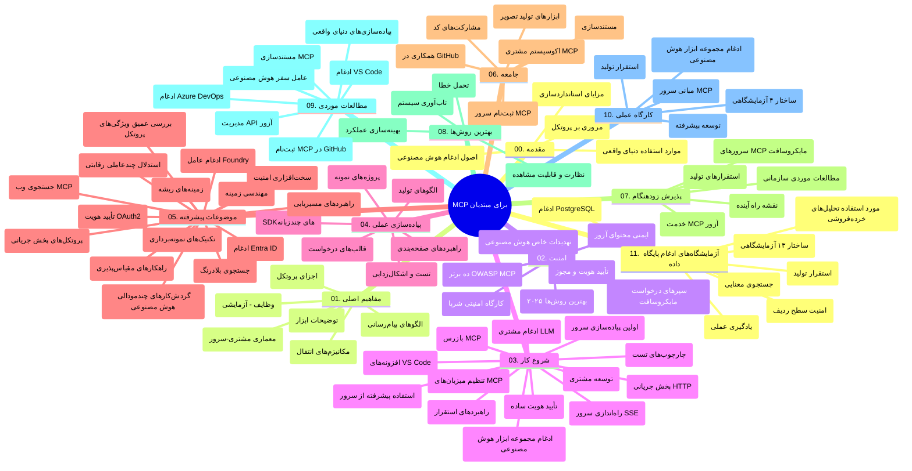

# پروتکل زمینه مدل (MCP) برای مبتدیان - راهنمای مطالعه

این راهنمای مطالعه مروری بر ساختار و محتوای مخزن «پروتکل زمینه مدل (MCP) برای مبتدیان» ارائه می‌دهد. از این راهنما برای ناوبری بهینه در مخزن و استفاده بهینه از منابع موجود استفاده کنید.

## مرور مخزن

پروتکل زمینه مدل (MCP) چارچوب استانداردی برای تعاملات بین مدل‌های هوش مصنوعی و برنامه‌های مشتری است. ابتدا توسط Anthropic ایجاد شده، اکنون MCP توسط جامعه گسترده‌تر MCP از طریق سازمان رسمی GitHub نگهداری می‌شود. این مخزن یک برنامه آموزشی جامع همراه با مثال‌های عملی کد در C#، Java، JavaScript، Python و TypeScript ارائه می‌دهد که برای توسعه‌دهندگان هوش مصنوعی، معماران سیستم و مهندسان نرم‌افزار طراحی شده است.

## نقشه تصویری برنامه درسی

## ساختار مخزن

مخزن به یازده بخش اصلی سازماندهی شده است که هر کدام روی جنبه‌های مختلف MCP تمرکز دارد:

1. **مقدمه (00-Introduction/)**
   - مرور پروتکل زمینه مدل
   - اهمیت استانداردسازی در مسیرهای هوش مصنوعی
   - موارد کاربرد عملی و مزایا

2. **مفاهیم پایه (01-CoreConcepts/)**
   - معماری کلاینت-سرور
   - اجزای کلیدی پروتکل
   - الگوهای پیام‌رسانی در MCP

3. **امنیت (02-Security/)**
   - تهدیدات امنیتی در سیستم‌های مبتنی بر MCP
   - بهترین شیوه‌ها برای امن‌سازی پیاده‌سازی‌ها
   - راهکارهای احراز هویت و مجوزدهی
   - **مستندات جامع امنیتی**:
     - بهترین شیوه‌های امنیتی MCP ۲۰۲۵
     - راهنمای پیاده‌سازی حفاظت محتوای Azure
     - کنترل‌ها و تکنیک‌های امنیتی MCP
     - مرجع سریع بهترین شیوه‌های MCP
   - **موضوعات کلیدی امنیتی**:
     - حملات تزریق پرامْت و مسموم‌سازی ابزار
     - ربودن جلسه و مشکلات نماینده گیج
     - آسیب‌پذیری‌های عبور توکن
     - مجوزهای بیش از حد و کنترل دسترسی
     - امنیت زنجیره تأمین برای اجزای هوش مصنوعی
     - یکپارچه‌سازی محافظ‌های پرامْت مایکروسافت

4. **شروع کار (03-GettingStarted/)**
   - راه‌اندازی و پیکربندی محیط
   - ایجاد سرورها و کلاینت‌های پایه MCP
   - ادغام با برنامه‌های موجود
   - شامل بخش‌هایی برای:
     - پیاده‌سازی اولین سرور
     - توسعه کلاینت
     - ادغام کلاینت LLM
     - ادغام VS Code
     - سرور رویدادهای ارسالی (SSE)
     - استفاده پیشرفته از سرور
     - استریم HTTP
     - ادغام کیت ابزار هوش مصنوعی
     - استراتژی‌های تست
     - راهنمای استقرار

5. **پیاده‌سازی عملی (04-PracticalImplementation/)**
   - استفاده از SDKها در زبان‌های برنامه‌نویسی مختلف
   - تکنیک‌های اشکال‌زدایی، تست و اعتبارسنجی
   - ساخت قالب‌ها و گردش‌های کاری قابل استفاده مجدد پرامْت
   - پروژه‌های نمونه با مثال‌های پیاده‌سازی

6. **موضوعات پیشرفته (05-AdvancedTopics/)**
   - تکنیک‌های مهندسی زمینه
   - ادغام عامل Foundry
   - گردش‌های کاری هوش مصنوعی چندرسانه‌ای
   - دموهای احراز هویت OAuth2
   - قابلیت‌های جستجوی همزمان
   - پخش همزمان در لحظه
   - پیاده‌سازی زمینه‌های اصلی
   - استراتژی‌های مسیریابی
   - تکنیک‌های نمونه‌گیری
   - روش‌های مقیاس‌بندی
   - ملاحظات امنیتی
   - ادغام امنیت Entra ID
   - ادغام جستجوی وب
   - استدلال چندعاملی مقابله‌ای (الگوهای مناظره)

7. **مشارکت‌های جامعه (06-CommunityContributions/)**
   - نحوه مشارکت در کد و مستندات
   - همکاری از طریق GitHub
   - بهبودها و بازخوردهای جامعه‌محور
   - استفاده از کلاینت‌های مختلف MCP (Claude Desktop, Cline, VSCode)
   - کار با سرورهای محبوب MCP شامل تولید تصویر

8. **درس‌هایی از پذیرش اولیه (07-LessonsfromEarlyAdoption/)**
   - پیاده‌سازی‌های دنیای واقعی و داستان‌های موفقیت
   - ساخت و استقرار راهکارهای مبتنی بر MCP
   - روندها و نقشه راه آینده
   - **راهنمای سرورهای Microsoft MCP**: راهنمای جامع برای ۱۰ سرور MCP مایکروسافت آماده تولید شامل:
     - سرور Microsoft Learn Docs MCP
     - سرور Azure MCP (بیش از ۱۵ کانکتور تخصصی)
     - سرور GitHub MCP
     - سرور Azure DevOps MCP
     - سرور MarkItDown MCP
     - سرور SQL Server MCP
     - سرور Playwright MCP
     - سرور Dev Box MCP
     - سرور Azure AI Foundry MCP
     - سرور Microsoft 365 Agents Toolkit MCP

9. **بهترین شیوه‌ها (08-BestPractices/)**
   - تنظیم و بهینه‌سازی عملکرد
   - طراحی سیستم‌های MCP مقاوم به خطا
   - استراتژی‌های تست و تاب‌آوری

10. **مطالعات موردی (09-CaseStudy/)**
    - **هفت مطالعه موردی جامع** که تنوع MCP را در سناریوهای مختلف نشان می‌دهند:
    - **عاملان سفر Azure AI**: ارکستراسیون چندعاملی با Azure OpenAI و جستجوی هوش مصنوعی
    - **ادغام Azure DevOps**: خودکارسازی فرآیندهای گردش کار با به‌روزرسانی داده‌های یوتیوب
    - **بازیابی مستندات در لحظه**: کلاینت کنسول Python با استریم HTTP
    - **تولیدکننده برنامه مطالعه تعاملی**: اپ وب Chainlit با هوش مصنوعی مکالمه‌ای
    - **مستندسازی در ویرایشگر**: ادغام VS Code با گردش‌های کاری GitHub Copilot
    - **مدیریت API Azure**: ادغام API سازمانی با ایجاد سرور MCP
    - **ثبت MCP GitHub**: توسعه اکوسیستم و پلتفرم ادغام عاملی
    - نمونه‌های پیاده‌سازی در زمینه ادغام سازمانی، بهره‌وری توسعه‌دهنده و توسعه اکوسیستم

11. **کارگاه عملی (10-StreamliningAIWorkflowsBuildingAnMCPServerWithAIToolkit/)**
    - کارگاه عملی جامع با ترکیب MCP و کیت ابزار هوش مصنوعی
    - ساخت برنامه‌های هوشمند که مدل‌های هوش مصنوعی را با ابزارهای دنیای واقعی مرتبط می‌کند
    - ماژول‌های عملی شامل اصول، توسعه سرور سفارشی و استراتژی‌های استقرار در تولید
    - **ساختار آزمایشگاه**:
      - آزمایشگاه ۱: اصول سرور MCP
      - آزمایشگاه ۲: توسعه پیشرفته سرور MCP
      - آزمایشگاه ۳: ادغام کیت ابزار هوش مصنوعی
      - آزمایشگاه ۴: استقرار و مقیاس‌بندی در تولید
    - رویکرد یادگیری مبتنی بر آزمایشگاه با دستورالعمل گام به گام

12. **آزمایشگاه‌های ادغام پایگاه داده سرور MCP (11-MCPServerHandsOnLabs/)**
    - **مسیر یادگیری جامع ۱۳ آزمایشگاه** برای ساخت سرورهای MCP آماده تولید با ادغام PostgreSQL
    - **پیاده‌سازی تحلیل‌های خرده‌فروشی واقعی** با استفاده از مورد کاربرد Zava Retail
    - **الگوهای سازمانی** شامل امنیت سطح ردیف (RLS)، جستجوی معنایی و دسترسی داده چندمستاجری
    - **ساختار کامل آزمایشگاه**:
      - **آزمایشگاه‌های ۰۰-۰۳: مبانی** - مقدمه، معماری، امنیت، راه‌اندازی محیط
      - **آزمایشگاه‌های ۰۴-۰۶: ساخت سرور MCP** - طراحی پایگاه داده، پیاده‌سازی سرور MCP، توسعه ابزار
      - **آزمایشگاه‌های ۰۷-۰۹: ویژگی‌های پیشرفته** - جستجوی معنایی، تست و اشکال‌زدایی، ادغام VS Code
      - **آزمایشگاه‌های ۱۰-۱۲: تولید و بهترین شیوه‌ها** - استقرار، نظارت، بهینه‌سازی
    - **فناوری‌های پوشش داده شده**: چارچوب FastMCP، PostgreSQL، Azure OpenAI، Azure Container Apps، Application Insights
    - **نتایج یادگیری**: سرورهای MCP آماده تولید، الگوهای ادغام پایگاه داده، تحلیل‌های هوش مصنوعی، امنیت سازمانی

## منابع اضافی

مخزن شامل منابع پشتیبانی است:

- **پوشه تصاویر**: شامل نمودارها و تصاویر استفاده‌شده در سراسر برنامه درسی
- **ترجمه‌ها**: پشتیبانی چندزبانه با ترجمه‌های خودکار مستندات
- **منابع رسمی MCP**:
  - [مستندات MCP](https://modelcontextprotocol.io/)
  - [مشخصات MCP](https://spec.modelcontextprotocol.io/)
  - [مخزن GitHub MCP](https://github.com/modelcontextprotocol)

## روش استفاده از این مخزن

1. **یادگیری پیوسته**: فصل‌ها را به ترتیب دنبال کنید (از ۰۰ تا ۱۱) برای یک تجربه ساختاریافته.
2. **تمرکز زبان مشخص**: اگر به زبان برنامه‌نویسی خاصی علاقه دارید، دایرکتوری نمونه‌ها را برای پیاده‌سازی‌ها به زبان دلخواه خود بررسی کنید.
3. **پیاده‌سازی عملی**: با بخش «شروع کار» شروع کنید تا محیط خود را راه‌اندازی کرده و اولین سرور و کلاینت MCP خود را بسازید.
4. **کاوش پیشرفته**: پس از تسلط بر اصول، به موضوعات پیشرفته بپردازید تا دانش خود را گسترش دهید.
5. **تعامل با جامعه**: از طریق بحث‌های GitHub و کانال‌های Discord به جامعه MCP بپیوندید و با متخصصان و توسعه‌دهندگان هم‌رده ارتباط برقرار کنید.

## کلاینت‌ها و ابزارهای MCP

برنامه درسی انواع مختلف کلاینت‌ها و ابزارهای MCP را پوشش می‌دهد:

1. **کلاینت‌های رسمی**:
   - Visual Studio Code
   - MCP در Visual Studio Code
   - Claude Desktop
   - Claude در VSCode
   - Claude API

2. **کلاینت‌های جامعه**:
   - Cline (ترمینال)
   - Cursor (ویرایشگر کد)
   - ChatMCP
   - Windsurf

3. **ابزارهای مدیریت MCP**:
   - MCP CLI
   - MCP Manager
   - MCP Linker
   - MCP Router

## سرورهای محبوب MCP

مخزن سرورهای مختلف MCP را معرفی می‌کند، از جمله:

1. **سرورهای رسمی Microsoft MCP**:
   - سرور Microsoft Learn Docs MCP
   - سرور Azure MCP (بیش از ۱۵ کانکتور تخصصی)
   - سرور GitHub MCP
   - سرور Azure DevOps MCP
   - سرور MarkItDown MCP
   - سرور SQL Server MCP
   - سرور Playwright MCP
   - سرور Dev Box MCP
   - سرور Azure AI Foundry MCP
   - سرور Microsoft 365 Agents Toolkit MCP

2. **سرورهای مرجع رسمی**:
   - Filesystem
   - Fetch
   - Memory
   - Sequential Thinking

3. **تولید تصویر**:
   - Azure OpenAI DALL-E 3
   - Stable Diffusion WebUI
   - Replicate

4. **ابزارهای توسعه**:
   - Git MCP
   - Terminal Control
   - Code Assistant

5. **سرورهای تخصصی**:
   - Salesforce
   - Microsoft Teams
   - Jira & Confluence

## مشارکت

این مخزن پذیرای مشارکت‌های جامعه است. برای راهنمایی درباره چگونگی مشارکت مؤثر در اکوسیستم MCP بخش مشارکت‌های جامعه را ببینید.

----

*این راهنمای مطالعه در تاریخ ۵ فوریه ۲۰۲۶ آخرین بار به‌روزرسانی شده است و بازتابی از آخرین مشخصات MCP ۲۰۲۵-۱۱-۲۵ می‌باشد و مروری بر مخزن تا آن تاریخ ارائه می‌دهد. محتوای مخزن ممکن است پس از این تاریخ به‌روزرسانی شود.*

---

<!-- CO-OP TRANSLATOR DISCLAIMER START -->
**توضیح مهم**:  
این سند با استفاده از سرویس ترجمه هوش مصنوعی [Co-op Translator](https://github.com/Azure/co-op-translator) ترجمه شده است. در حالی که ما برای دقت تلاش می‌کنیم، لطفاً توجه داشته باشید که ترجمه‌های ماشینی ممکن است حاوی خطاها یا نواقصی باشند. سند اصلی به زبان مادری آن باید به عنوان منبع معتبر در نظر گرفته شود. برای اطلاعات حیاتی، ترجمه حرفه‌ای انسانی توصیه می‌شود. ما مسئول هیچ گونه سوتفاهم یا تفسیر نادرستی که از استفاده این ترجمه ناشی شود، نیستیم.
<!-- CO-OP TRANSLATOR DISCLAIMER END -->