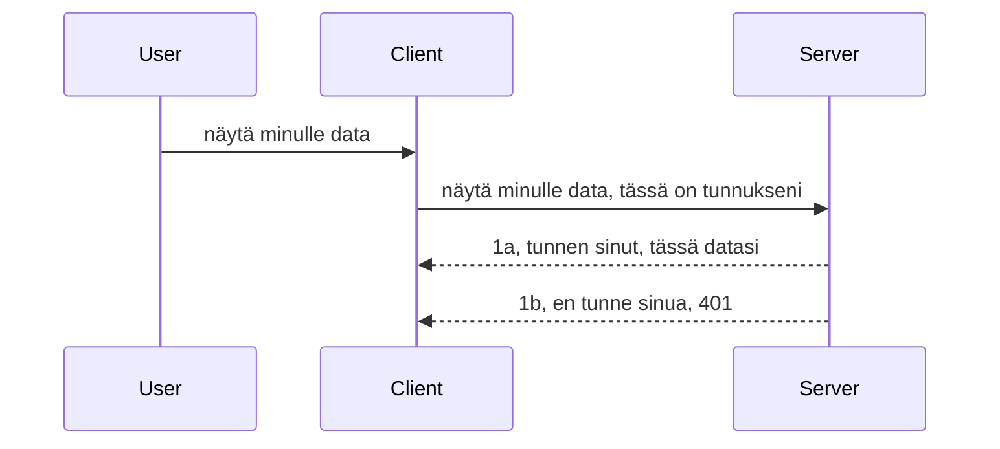

# Yksinkertainen autentikointi

MCP SDK:t tukevat OAuth 2.1:n käyttöä, mikä on rehellisesti sanottuna melko monimutkainen prosessi, joka sisältää käsitteitä kuten todennuspalvelin, resurssipalvelin, tunnistetietojen lähettäminen, koodin saamisen, koodin vaihtamisen bearer-tokeniksi, kunnes lopulta pääsee käsiksi resurssidataan. Jos et ole tottunut OAuthiin, mikä on erinomainen toteutettava asia, on hyvä idea aloittaa jonkinlaisella perusautentikoinnilla ja rakentaa sitä kohti yhä parempaa turvallisuutta. Siksi tämä luku on olemassa, jotta se rakentaa sinua kohti edistyneempää autentikointia.

## Autentikointi, mitä sillä tarkoitetaan?

Autentikointi on lyhenne autentikoinnista ja valtuutuksesta. Ajatuksena on, että meidän täytyy tehdä kaksi asiaa:

- **Autentikointi**, joka on prosessi, jossa selvitetään, annetaanko henkilön tulla taloon, että heillä on oikeus olla "tässä", eli että heillä on pääsy resurssipalvelimellemme, jossa MCP Server -ominaisuutemme sijaitsevat.
- **Valtuutus**, on prosessi, jossa tarkastellaan, pitääkö käyttäjällä olla pääsy niihin erityisiin resursseihin, joita he pyytävät, esimerkiksi näihin tilauksiin tai näihin tuotteisiin, tai onko heillä lupa lukea sisältöä mutta ei poistaa sitä, esimerkiksi.

## Tunnistetiedot: miten kerromme järjestelmälle kuka olemme

No, useimmat web-kehittäjät ajattelevat toimittavansa palvelimelle tunnistetiedot, yleensä salaisuuden, joka kertoo, onko heillä lupa olla täällä ("Autentikointi"). Nämä tunnistetiedot ovat tavallisesti base64-koodattu versio käyttäjänimestä ja salasanasta tai API-avain, joka yksilöi tietyn käyttäjän.

Tämä sisältää niiden lähettämisen otsikkona nimeltä "Authorization" näin:

```json
{ "Authorization": "secret123" }
```

Tätä kutsutaan yleensä perusautentikoinniksi (basic authentication). Kuinka kokonaisprosessi sitten toimii, on seuraava:


Nyt kun ymmärrämme, miten se toimii prosessina, kuinka toteutamme sen? Useimmissa web-palvelimissa on käsitteellinen osa nimeltä middleware, koodinpätkä, joka ajetaan osana pyyntöä ja voi tarkistaa tunnistetiedot, ja jos ne ovat kelvolliset, päästää pyynnön läpi. Jos pyynnöllä ei ole kelvollisia tunnistetietoja, saat autentikointivirheen. Katsotaanpa, miten tämä voidaan toteuttaa:

**Python**

```python
class AuthMiddleware(BaseHTTPMiddleware):
    async def dispatch(self, request, call_next):

        has_header = request.headers.get("Authorization")
        if not has_header:
            print("-> Missing Authorization header!")
            return Response(status_code=401, content="Unauthorized")

        if not valid_token(has_header):
            print("-> Invalid token!")
            return Response(status_code=403, content="Forbidden")

        print("Valid token, proceeding...")
       
        response = await call_next(request)
        # lisää asiakasotsakkeita tai muuta vastausta jollakin tavalla
        return response


starlette_app.add_middleware(CustomHeaderMiddleware)
```

Tässä olemme:

- Luoneet middleware-luokan nimeltä `AuthMiddleware`, jonka `dispatch`-metodia web-palvelin kutsuu.
- Lisänneet middleware-luokan web-palvelimeen:

    ```python
    starlette_app.add_middleware(AuthMiddleware)
    ```

- Kirjoittaneet validointilogiikan, joka tarkistaa, onko Authorization-otsikko läsnä ja onko lähetetty salaisuus kelvollinen:

    ```python
    has_header = request.headers.get("Authorization")
    if not has_header:
        print("-> Missing Authorization header!")
        return Response(status_code=401, content="Unauthorized")

    if not valid_token(has_header):
        print("-> Invalid token!")
        return Response(status_code=403, content="Forbidden")
    ```

 jos salaisuus on läsnä ja kelvollinen, annamme pyynnön mennä läpi kutsumalla `call_next` ja palautamme vastauksen.

    ```python
    response = await call_next(request)
    # lisää mahdolliset asiakasotsikot tai muuta vastausta jollain tavalla
    return response
    ```

Toimintaperiaate on, että jos web-pyyntö tehdään palvelimelle, middleware-koodi käynnistetään, ja toteutuksen perusteella se joko päästää pyynnön läpi tai palauttaa virheen, joka ilmoittaa, että asiakkaalla ei ole oikeutta jatkaa.

**TypeScript**

Tässä luomme middleware-funktion suositulla Express-kehyksellä ja kaappaamme pyynnön ennen kuin se saavuttaa MCP Serverin. Tässä on koodi siihen:

```typescript
function isValid(secret) {
    return secret === "secret123";
}

app.use((req, res, next) => {
    // 1. Onko valtuutusotsikko läsnä?
    if(!req.headers["Authorization"]) {
        res.status(401).send('Unauthorized');
    }
    
    let token = req.headers["Authorization"];

    // 2. Tarkista voimassaolo.
    if(!isValid(token)) {
        res.status(403).send('Forbidden');
    }

   
    console.log('Middleware executed');
    // 3. Siirtää pyynnön seuraavaan vaiheeseen pyyntöputkessa.
    next();
});
```

Tässä koodissa teemme:

1. Tarkistamme, onko Authorization-otsikko läsnä, jos ei ole, lähetämme 401-virheen.
2. Varmistamme, että tunniste/tunnus on kelvollinen, jos ei ole, lähetämme 403-virheen.
3. Lopuksi annamme pyynnön jatkaa pyynnön käsittelyä ja palautamme pyydetyn resurssin.

## Harjoitus: Toteuta autentikointi

Otetaan opit käyttöön ja kokeillaan toteuttaa se. Tässä suunnitelma:

Palvelin

- Luo web-palvelin ja MCP-instanssi.
- Toteuta middleware palvelimelle.

Asiakas

- Lähetä web-pyyntö, sisältäen tunnistetiedot, otsikon kautta.

### -1- Luo web-palvelin ja MCP-instanssi

Ensimmäisessä vaiheessa meidän täytyy luoda web-palvelimen instanssi ja MCP Server.

**Python**

Tässä luomme MCP Server -instanssin, luomme starlette web-sovelluksen ja isännöimme sitä uvicornilla.

```python
# luodaan MCP-palvelin

app = FastMCP(
    name="MCP Resource Server",
    instructions="Resource Server that validates tokens via Authorization Server introspection",
    host=settings["host"],
    port=settings["port"],
    debug=True
)

# luodaan starlette-web-sovellus
starlette_app = app.streamable_http_app()

# palvelimen sovellus uvicornin kautta
async def run(starlette_app):
    import uvicorn
    config = uvicorn.Config(
            starlette_app,
            host=app.settings.host,
            port=app.settings.port,
            log_level=app.settings.log_level.lower(),
        )
    server = uvicorn.Server(config)
    await server.serve()

run(starlette_app)
```

Tässä koodissa:

- Luomme MCP Serverin.
- Rakennamme starlette web-sovelluksen MCP Serveristä, `app.streamable_http_app()`.
- Isännöimme ja palvelemme web-sovellusta uvicornilla `server.serve()`.

**TypeScript**

Tässä luomme MCP Server -instanssin.

```typescript
const server = new McpServer({
      name: "example-server",
      version: "1.0.0"
    });

    // ... määritä palvelimen resurssit, työkalut ja kehotteet ...
```

Tämän MCP Serverin luominen tulee tehdä POST /mcp -reitillä, joten otetaan yllä oleva koodi ja siirretään se näin:

```typescript
import express from "express";
import { randomUUID } from "node:crypto";
import { McpServer } from "@modelcontextprotocol/sdk/server/mcp.js";
import { StreamableHTTPServerTransport } from "@modelcontextprotocol/sdk/server/streamableHttp.js";
import { isInitializeRequest } from "@modelcontextprotocol/sdk/types.js"

const app = express();
app.use(express.json());

// Kartta kuljetusten tallentamiseen istuntotunnuksen mukaan
const transports: { [sessionId: string]: StreamableHTTPServerTransport } = {};

// Käsittele POST-pyynnöt asiakas-palvelin viestintää varten
app.post('/mcp', async (req, res) => {
  // Tarkista olemassa oleva istuntotunnus
  const sessionId = req.headers['mcp-session-id'] as string | undefined;
  let transport: StreamableHTTPServerTransport;

  if (sessionId && transports[sessionId]) {
    // Käytä uudelleen olemassa olevaa kuljetusta
    transport = transports[sessionId];
  } else if (!sessionId && isInitializeRequest(req.body)) {
    // Uusi alustuspyyntö
    transport = new StreamableHTTPServerTransport({
      sessionIdGenerator: () => randomUUID(),
      onsessioninitialized: (sessionId) => {
        // Tallenna kuljetus istuntotunnuksen mukaan
        transports[sessionId] = transport;
      },
      // DNS-uudelleensidonta suojaus on oletuksena pois päältä taaksepäin yhteensopivuuden vuoksi. Jos ajat tätä palvelinta
      // paikallisesti, varmista että asetat:
      // enableDnsRebindingProtection: true,
      // allowedHosts: ['127.0.0.1'],
    });

    // Siivoa kuljetus suljettaessa
    transport.onclose = () => {
      if (transport.sessionId) {
        delete transports[transport.sessionId];
      }
    };
    const server = new McpServer({
      name: "example-server",
      version: "1.0.0"
    });

    // ... aseta palvelimen resurssit, työkalut ja kehotteet ...

    // Yhdistä MCP-palvelimeen
    await server.connect(transport);
  } else {
    // Virheellinen pyyntö
    res.status(400).json({
      jsonrpc: '2.0',
      error: {
        code: -32000,
        message: 'Bad Request: No valid session ID provided',
      },
      id: null,
    });
    return;
  }

  // Käsittele pyyntö
  await transport.handleRequest(req, res, req.body);
});

// Uudelleenkäytettävä käsittelijä GET- ja DELETE-pyynnöille
const handleSessionRequest = async (req: express.Request, res: express.Response) => {
  const sessionId = req.headers['mcp-session-id'] as string | undefined;
  if (!sessionId || !transports[sessionId]) {
    res.status(400).send('Invalid or missing session ID');
    return;
  }
  
  const transport = transports[sessionId];
  await transport.handleRequest(req, res);
};

// Käsittele GET-pyynnöt palvelimen asiakas-ilmoituksia varten SSE:n kautta
app.get('/mcp', handleSessionRequest);

// Käsittele DELETE-pyynnöt istunnon päättämiseksi
app.delete('/mcp', handleSessionRequest);

app.listen(3000);
```

Nyt näet, miten MCP Serverin luonti siirrettiin `app.post("/mcp")` sisälle.

Siirrytään seuraavaan vaiheeseen middlewaren luomiseksi, jotta voimme validoida saapuvat tunnistetiedot.

### -2- Toteuta middleware palvelimelle

Siirrytään middleware-osioon. Tässä luomme middleware-luokan, joka etsii tunnistetta `Authorization`-otsikosta ja validoi sen. Jos se on hyväksyttävä, pyyntö jatkaa toimitukseen (esim. listataan työkaluja, luetaan resurssi tai mitä MCP-toiminnallisuutta asiakas pyysi).

**Python**

Middleware luomiseksi meidän täytyy luoda luokka, joka perii `BaseHTTPMiddleware`:stä. Kahta asiaa on mielenkiintoista:

- Pyyntö `request`, josta luemme otsikkotiedot.
- `call_next`, sitä callbackia kutsutaan, jos asiakkaalla on hyväksyttävä tunniste.

Ensiksi täytyy käsitellä tapaus, jossa `Authorization`-otsikko puuttuu:

```python
has_header = request.headers.get("Authorization")

# otsikkoa ei ole, epäonnistutaan 401:llä, muuten jatketaan.
if not has_header:
    print("-> Missing Authorization header!")
    return Response(status_code=401, content="Unauthorized")
```

Tässä lähetämme 401 unauthorized -viestin, koska asiakas epäonnistuu autentikoinnissa.

Jos tunniste on lähetetty, täytyy tarkistaa sen kelvollisuus näin:

```python
 if not valid_token(has_header):
    print("-> Invalid token!")
    return Response(status_code=403, content="Forbidden")
```

Huomaa, että yllä lähetämme 403 forbidden -virheen. Katsotaan koko middleware alla, jossa toteutetaan kaikki yllä mainittu:

```python
class AuthMiddleware(BaseHTTPMiddleware):
    async def dispatch(self, request, call_next):

        has_header = request.headers.get("Authorization")
        if not has_header:
            print("-> Missing Authorization header!")
            return Response(status_code=401, content="Unauthorized")

        if not valid_token(has_header):
            print("-> Invalid token!")
            return Response(status_code=403, content="Forbidden")

        print("Valid token, proceeding...")
        print(f"-> Received {request.method} {request.url}")
        response = await call_next(request)
        response.headers['Custom'] = 'Example'
        return response

```

Hienoa, mutta entä `valid_token`-funktio? Tässä se on:

```python
# ÄLÄ käytä tuotannossa - paranna sitä !!
def valid_token(token: str) -> bool:
    # poista "Bearer " etuliite
    if token.startswith("Bearer "):
        token = token[7:]
        return token == "secret-token"
    return False
```

Tämän pitäisi toki parantua.

TÄRKEÄÄ: Sinun EI KOSKAAN pidä säilyttää salaisuuksia koodissa. Paras käytäntö on hakea salausarvo tietokannasta tai IDP:ltä (identiteettipalveluntarjoaja) tai vielä parempaa, antaa IDP:n tehdä validointi.

**TypeScript**

Toteuttaaksemme tämän Expressillä, meidän täytyy kutsua `use`-metodia, joka ottaa middleware-funktioita.

Meidän täytyy:

- Tarkistaa pyyntömuuttuja `Authorization`-ominaisuuden tunnisteen varalta.
- Validioida tunniste, ja jos kelvollinen, antaa pyynnön jatkaa ja antaa asiakkaan MCP-pyynnön tehdä mitä pitää (esim. listaa työkaluja, lue resurssi tai muuta MCP-toiminnallisuutta).

Tarkistamme ensin, onko `Authorization`-otsikko läsnä, ja jos ei ole, estämme pyynnön etenemisen:

```typescript
if(!req.headers["authorization"]) {
    res.status(401).send('Unauthorized');
    return;
}
```

Jos otsikkoa ei ole, saat 401-virheen.

Seuraavaksi tarkistamme, onko tunniste kelvollinen, jos ei ole, pysäytämme pyynnön taas mutta hieman eri viestillä:

```typescript
if(!isValid(token)) {
    res.status(403).send('Forbidden');
    return;
} 
```

Huomaa, että nyt saat 403-virheen.

Tässä koko koodi:

```typescript
app.use((req, res, next) => {
    console.log('Request received:', req.method, req.url, req.headers);
    console.log('Headers:', req.headers["authorization"]);
    if(!req.headers["authorization"]) {
        res.status(401).send('Unauthorized');
        return;
    }
    
    let token = req.headers["authorization"];

    if(!isValid(token)) {
        res.status(403).send('Forbidden');
        return;
    }  

    console.log('Middleware executed');
    next();
});
```

Olemme asettaneet web-palvelimen hyväksymään middleware-funktion, joka tarkistaa asiakkaan lähettämän tunnisteen. Entä asiakkaan puoli?

### -3- Lähetä web-pyyntö tunnisteella otsikossa

Meidän täytyy varmistaa, että asiakas lähettää tunnisteen otsikon kautta. Koska aiomme käyttää MCP-asiakasta, meidän täytyy selvittää, miten se tehdään.

**Python**

Asiakkaalle meidän täytyy lähettää otsikko, joka sisältää tunnisteen näin:

```python
# ÄLÄ kovakoodaa arvoa, säilytä se vähintään ympäristömuuttujassa tai turvallisemmassa tallennustilassa
token = "secret-token"

async with streamablehttp_client(
        url = f"http://localhost:{port}/mcp",
        headers = {"Authorization": f"Bearer {token}"}
    ) as (
        read_stream,
        write_stream,
        session_callback,
    ):
        async with ClientSession(
            read_stream,
            write_stream
        ) as session:
            await session.initialize()
      
            # TEHTÄVÄ, mitä haluat toteutettavan asiakkaassa, esim. listaa työkalut, kutsu työkalut jne.
```

Huomaa, miten täytämme `headers`-ominaisuuden näin: `headers = {"Authorization": f"Bearer {token}"}`.

**TypeScript**

Voimme ratkaista tämän kahdessa vaiheessa:

1. Täytämme konfiguraatio-olion tunnistetiedoilla.
2. Lähetämme konfiguraatio-olion transportille.

```typescript

// ÄLÄ kovakoodaa arvoa kuten tässä on tehty. Vähintään käytä ympäristömuuttujaa ja jotain kuten dotenv (kehitystilassa).
let token = "secret123"

// määritä client transport -asetukset objektina
let options: StreamableHTTPClientTransportOptions = {
  sessionId: sessionId,
  requestInit: {
    headers: {
      "Authorization": "secret123"
    }
  }
};

// välitä options-objekti transportille
async function main() {
   const transport = new StreamableHTTPClientTransport(
      new URL(serverUrl),
      options
   );
```

Tässä näkyy, miten loimme `options`-olion ja laitoimme otsikot `requestInit`-ominaisuuteen.

TÄRKEÄÄ: Miten parannamme tätä? Nykyisessä toteutuksessa on ongelmia. Ensinnäkin tunnisteen välittäminen näin on riskialtista, ellei sinulla ole vähintään HTTPS:ää. Silloinkin tunniste voidaan varastaa, joten tarvitset järjestelmän, jossa voit helposti peruuttaa tokenin ja lisätä tarkistuksia, kuten mistä päin maailmaa pyyntö tulee, tapahtuuko pyyntö liian usein (botin kaltainen toiminta), lyhyesti sanottuna on monia huolenaiheita.

Kuitenkin hyvin yksinkertaisille API:lle, joissa et halua kenenkään kutsuvan API:a ilman tunnistautumista, tämä on hyvä aloitus.

Nyt yritetään parantaa turvallisuutta käyttämällä standardoitua muotoa kuten JSON Web Tokenia, eli JWT:ta.

## JSON Web Tokenit, JWT

Joten yritämme parantaa yksinkertaisten tunnisteiden lähettämistä. Mitä parannuksia saamme heti kun otamme JWT:n käyttöön?

- **Turvallisuusparannukset**. Perusautentikoinnissa lähetät käyttäjätunnuksen ja salasanan base64-koodattuna tokenina (tai API-avaimen) yhä uudelleen, mikä lisää riskiä. JWT:llä lähetät käyttäjätunnuksen ja salasanan, saat tokenin takaisin ja token on myös aikarajoitettu, eli se vanhenee. JWT mahdollistaa tarkemman pääsynhallinnan käyttäen rooleja, laajuuksia ja oikeuksia.
- **Stateless ja skaalautuvuus**. JWT:t ovat itsenäisiä, ne sisältävät kaiken käyttäjätiedon ja poistavat tarpeen palvelinpuolen sessiotallennukselle. Token voidaan validoida myös paikallisesti.
- **Yhteentoimivuus ja liittoutuminen**. JWT on keskeinen Open ID Connectissä ja sitä käytetään tunnettujen identiteetin tarjoajien kuten Entra ID:n, Google Identityn ja Auth0:n kanssa. Ne mahdollistavat myös single sign-onin ja paljon muuta, tehden siitä yritystason ratkaisun.
- **Modulaarisuus ja joustavuus**. JWT:tä voi käyttää myös API Gateway -ratkaisuissa kuten Azure API Management, NGINX ja muut. Se tukee myös käyttäjän todentamista ja palvelimen välisiä yhteyksiä mukaan lukien muiden käyttäjien puolesta toimimisen ja valtuutuksen.
- **Suorituskyky ja välimuisti**. JWT:tä voidaan välimuistittaa purkamisen jälkeen, mikä vähentää tarvetta purkaa sitä aina uudelleen. Tämä parantaa erityisesti suuriliikenteisissä sovelluksissa läpimenokykyä ja vähentää kuormaa infrastruktuurillasi.
- **Edistyneet ominaisuudet**. Se tukee myös introspektiota (validoin tärkeyden tarkistus palvelimella) ja peruutusta (tokenin tekeminen kelvottomaksi).

Kaikkien näiden etujen ansiosta katsotaan, miten voimme viedä toteutuksemme seuraavalle tasolle.

## Perusautentikoinnin muuttaminen JWT:ksi

Joten, muutokset, jotka meidän täytyy tehdä korkealla tasolla ovat:

- **Oppia rakentamaan JWT-token**, joka on valmis lähetettäväksi asiakkaalta palvelimelle.
- **Validoida JWT-token**, ja jos se on kelvollinen, antaa asiakkaan käyttää resurssejamme.
- **Turvallinen tokenien tallennus**. Miten tallennamme tokenin.
- **Suojaa reitit**. Meidän täytyy suojata reitit, tässä tapauksessa MCP-reitit ja ominaisuudet.
- **Lisää uusinta-tokenit (refresh tokens)**. Varmista, että luomme lyhytikäisiä tokeneita, mutta myös pitkäikäisiä uusintatokenia, joita voi käyttää uusien tokenien hankintaan, jos vanhat vanhenevat. Varmista myös uusinta-pääte ja rotaatiostrategia.

### -1- Rakenna JWT-token

Ensinnäkin JWT-token koostuu seuraavista osista:

- **otsikko (header)**, algoritmi ja tokenin tyyppi.
- **sisältö (payload)**, väitteet kuten sub (käyttäjä tai entiteetti, jota token edustaa. Todennustilanteessa tämä on yleensä käyttäjätunnus), exp (vanhentumispäivä), role (rooli).
- **allekirjoitus (signature)**, allekirjoitettu salaisuudella tai yksityisellä avaimella.

Tätä varten meidän on rakennettava otsikko, sisältö ja koodattu token.

**Python**

```python

import jwt
import jwt
from jwt.exceptions import ExpiredSignatureError, InvalidTokenError
import datetime

# Salainen avain JWT:n allekirjoittamiseen
secret_key = 'your-secret-key'

header = {
    "alg": "HS256",
    "typ": "JWT"
}

# käyttäjätiedot sekä niiden väitteet ja vanhenemisaika
payload = {
    "sub": "1234567890",               # Aiheluokka (käyttäjän tunnus)
    "name": "User Userson",                # Mukautettu väite
    "admin": True,                     # Mukautettu väite
    "iat": datetime.datetime.utcnow(),# Annettu
    "exp": datetime.datetime.utcnow() + datetime.timedelta(hours=1)  # Vanhenemisaika
}

# koodaa se
encoded_jwt = jwt.encode(payload, secret_key, algorithm="HS256", headers=header)
```

Yllä olevassa koodissa olemme:

- Määritelleet otsikon, jossa käytetään algoritmina HS256 ja tyyppinä JWT.
- Rakentaneet sisällön, joka sisältää aiheen tai käyttäjätunnuksen, käyttäjänimen, roolin, milloin token luotiin ja milloin se vanhenee täten toteuttaen aikarajoituksen, josta aiemmin mainitsimme.

**TypeScript**

Tässä tarvitsemme riippuvuuksia, jotka auttavat meitä rakentamaan JWT-tokenin.

Riippuvuudet

```sh

npm install jsonwebtoken
npm install --save-dev @types/jsonwebtoken
```

Nyt kun se on paikallaan, luodaan otsikko, sisältö ja niistä koodattu token.

```typescript
import jwt from 'jsonwebtoken';

const secretKey = 'your-secret-key'; // Käytä ympäristömuuttujia tuotannossa

// Määritä hyötykuorma
const payload = {
  sub: '1234567890',
  name: 'User usersson',
  admin: true,
  iat: Math.floor(Date.now() / 1000), // Myöntämisaika
  exp: Math.floor(Date.now() / 1000) + 60 * 60 // Vanhenee tunnissa
};

// Määritä otsikko (valinnainen, jsonwebtoken asettaa oletukset)
const header = {
  alg: 'HS256',
  typ: 'JWT'
};

// Luo tunnus
const token = jwt.sign(payload, secretKey, {
  algorithm: 'HS256',
  header: header
});

console.log('JWT:', token);
```

Tämä token:

- On allekirjoitettu HS256:lla
- On voimassa 1 tunnin ajan
- Sisältää väitteitä kuten sub, name, admin, iat ja exp.

### -2- Validoi token

Meidän täytyy myös validoida token, tämä tulee tehdä palvelimella varmistaaksemme, että mitä asiakas meille lähettää on oikeasti kelvollista. Tähän kuuluu monia tarkistuksia rakenteesta validointiin asti. On myös suositeltavaa lisätä tarkistuksia selvittääksemme onko käyttäjä järjestelmässämme ja onko käyttäjällä oikeudet, joita hän väittää omistavansa.

Tokenin validoimiseksi meidän täytyy purkaa se, jotta voimme lukea sen ja alkaa tarkistaa sen kelvollisuus:

**Python**

```python

# Pure ja vahvista JWT
try:
    decoded = jwt.decode(token, secret_key, algorithms=["HS256"])
    print("✅ Token is valid.")
    print("Decoded claims:")
    for key, value in decoded.items():
        print(f"  {key}: {value}")
except ExpiredSignatureError:
    print("❌ Token has expired.")
except InvalidTokenError as e:
    print(f"❌ Invalid token: {e}")

```

Tässä koodissa kutsumme `jwt.decode` tokenilla, salaisella avaimella ja valitulla algoritmilla. Huomaa, että käytämme try-catch rakennetta, koska epäonnistunut validointi aiheuttaa virheen.

**TypeScript**

Tässä meidän täytyy kutsua `jwt.verify` saadaksemme puretun version tokenista, jota voimme analysoida. Jos tämä kutsu epäonnistuu, rakenne on virheellinen tai token ei ole enää kelvollinen.

```typescript

try {
  const decoded = jwt.verify(token, secretKey);
  console.log('Decoded Payload:', decoded);
} catch (err) {
  console.error('Token verification failed:', err);
}
```

HUOM: kuten aiemmin mainittu, tulee tehdä lisätarkistuksia varmistamaan, että token osoittaa käyttäjää järjestelmässämme ja että käyttäjällä on vaaditut oikeudet.

Seuraavaksi tarkastelemme roolipohjaista pääsynhallintaa eli RBAC:ia.
## Roolipohjaisen käyttöoikeuden lisääminen

Ideana on ilmaista, että eri rooleilla on eri oikeudet. Esimerkiksi oletamme, että ylläpitäjä voi tehdä kaiken, tavallinen käyttäjä voi lukea/kirjoittaa ja vieras voi vain lukea. Tästä syystä tässä on joitakin mahdollisia käyttöoikeustasoja:

- Admin.Write 
- User.Read
- Guest.Read

Katsotaanpa, miten voimme toteuttaa tällaisen kontrollin middlewarella. Middlewareja voidaan lisätä reitille tai kaikille reiteille.

**Python**

```python
from starlette.middleware.base import BaseHTTPMiddleware
from starlette.responses import JSONResponse
import jwt

# ÄLÄ pidä salasanaa suoraan koodissa, tämä on vain esittelyä varten. Lue se turvallisesta paikasta.
SECRET_KEY = "your-secret-key" # laita tämä ympäristömuuttujaan
REQUIRED_PERMISSION = "User.Read"

class JWTPermissionMiddleware(BaseHTTPMiddleware):
    async def dispatch(self, request, call_next):
        auth_header = request.headers.get("Authorization")
        if not auth_header or not auth_header.startswith("Bearer "):
            return JSONResponse({"error": "Missing or invalid Authorization header"}, status_code=401)

        token = auth_header.split(" ")[1]
        try:
            decoded = jwt.decode(token, SECRET_KEY, algorithms=["HS256"])
        except jwt.ExpiredSignatureError:
            return JSONResponse({"error": "Token expired"}, status_code=401)
        except jwt.InvalidTokenError:
            return JSONResponse({"error": "Invalid token"}, status_code=401)

        permissions = decoded.get("permissions", [])
        if REQUIRED_PERMISSION not in permissions:
            return JSONResponse({"error": "Permission denied"}, status_code=403)

        request.state.user = decoded
        return await call_next(request)


```

Middleware voidaan lisätä alla olevan esimerkin mukaisesti:

```python

# Vaihtoehto 1: lisää middleware starlette-sovellusta rakennettaessa
middleware = [
    Middleware(JWTPermissionMiddleware)
]

app = Starlette(routes=routes, middleware=middleware)

# Vaihtoehto 2: lisää middleware sen jälkeen, kun starlette-sovellus on jo rakennettu
starlette_app.add_middleware(JWTPermissionMiddleware)

# Vaihtoehto 3: lisää middleware jokaiselle reitille
routes = [
    Route(
        "/mcp",
        endpoint=..., # käsittelijä
        middleware=[Middleware(JWTPermissionMiddleware)]
    )
]
```

**TypeScript**

Voimme käyttää `app.use` ja middlewarea, joka suoritetaan kaikissa pyynnöissä.

```typescript
app.use((req, res, next) => {
    console.log('Request received:', req.method, req.url, req.headers);
    console.log('Headers:', req.headers["authorization"]);

    // 1. Tarkista, onko valtuutusotsikko lähetetty

    if(!req.headers["authorization"]) {
        res.status(401).send('Unauthorized');
        return;
    }
    
    let token = req.headers["authorization"];

    // 2. Tarkista, onko tunniste kelvollinen
    if(!isValid(token)) {
        res.status(403).send('Forbidden');
        return;
    }  

    // 3. Tarkista, onko tunnisteen käyttäjä olemassa järjestelmässämme
    if(!isExistingUser(token)) {
        res.status(403).send('Forbidden');
        console.log("User does not exist");
        return;
    }
    console.log("User exists");

    // 4. Varmista, että tunnisteella on oikeat käyttöoikeudet
    if(!hasScopes(token, ["User.Read"])){
        res.status(403).send('Forbidden - insufficient scopes');
    }

    console.log("User has required scopes");

    console.log('Middleware executed');
    next();
});

```

Middlewaremme tulisi tehdä muutamia asioita, nimittäin:

1. Tarkistaa, onko valtuutusheaderi läsnä
2. Tarkistaa, onko token voimassa, kutsumme `isValid` -metodia, jonka kirjoitimme ja joka tarkistaa JWT-tokenin eheyden ja voimassaolon.
3. Varmistaa, että käyttäjä on olemassa järjestelmässämme, tämä pitäisi tarkistaa.

   ```typescript
    // käyttäjät tietokannassa
   const users = [
     "user1",
     "User usersson",
   ]

   function isExistingUser(token) {
     let decodedToken = verifyToken(token);

     // TODO, tarkista onko käyttäjä tietokannassa
     return users.includes(decodedToken?.name || "");
   }
   ```

   Yllä olemme luoneet hyvin yksinkertaisen `users` -listan, joka luonnollisesti pitäisi olla tietokannassa.

4. Lisäksi meidän pitäisi tarkistaa, että tokenilla on oikeat käyttöoikeudet.

   ```typescript
   if(!hasScopes(token, ["User.Read"])){
        res.status(403).send('Forbidden - insufficient scopes');
   }
   ```

   Yllä olevassa middlewarekoodissa tarkistamme, että token sisältää User.Read -käyttöoikeuden, jos ei sisällä, lähetämme virheen 403. Alla on `hasScopes` -apumetodi.

   ```typescript
   function hasScopes(scope: string, requiredScopes: string[]) {
     let decodedToken = verifyToken(scope);
    return requiredScopes.every(scope => decodedToken?.scopes.includes(scope));
  }
   ```

Have a think which additional checks you should be doing, but these are the absolute minimum of checks you should be doing.

Using Express as a web framework is a common choice. There are helpers library when you use JWT so you can write less code.

- `express-jwt`, helper library that provides a middleware that helps decode your token.
- `express-jwt-permissions`, this provides a middleware `guard` that helps check if a certain permission is on the token.

Here's what these libraries can look like when used:

```typescript
const express = require('express');
const jwt = require('express-jwt');
const guard = require('express-jwt-permissions')();

const app = express();
const secretKey = 'your-secret-key'; // put this in env variable

// Decode JWT and attach to req.user
app.use(jwt({ secret: secretKey, algorithms: ['HS256'] }));

// Check for User.Read permission
app.use(guard.check('User.Read'));

// multiple permissions
// app.use(guard.check(['User.Read', 'Admin.Access']));

app.get('/protected', (req, res) => {
  res.json({ message: `Welcome ${req.user.name}` });
});

// Error handler
app.use((err, req, res, next) => {
  if (err.code === 'permission_denied') {
    return res.status(403).send('Forbidden');
  }
  next(err);
});

```

Nyt kun olet nähnyt, miten middlewarea voidaan käyttää sekä autentikointiin että valtuutukseen, entä MCP sitten, muuttaako se tapaa miten teemme autentikoinnin? Selvitetään seuraavassa osassa.

### -3- Lisää RBAC MCP:hen

Olet nähnyt, miten voit lisätä RBACin middlewarella, mutta MCP:lle ei ole helppoa tapaa lisätä RBACia per MCP ominaisuus, joten mitä teemme? No, meidän täytyy vain lisätä koodi, joka tässä tapauksessa tarkistaa, onko asiakkaalla oikeudet kutsua tiettyä työkalua:

Sinulla on muutamia eri vaihtoehtoja miten toteuttaa per-ominaisuus RBAC, tässä muutamia:

- Lisää tarkistus jokaiselle työkalulle, resurssille, kehotteelle, missä sinun täytyy tarkistaa käyttöoikeustaso.

   **python**

   ```python
   @tool()
   def delete_product(id: int):
      try:
          check_permissions(role="Admin.Write", request)
      catch:
        pass # asiakas epäonnistui valtuutuksessa, aiheuta valtuutusvirhe
   ```

   **typescript**

   ```typescript
   server.registerTool(
    "delete-product",
    {
      title: Delete a product",
      description: "Deletes a product",
      inputSchema: { id: z.number() }
    },
    async ({ id }) => {
      
      try {
        checkPermissions("Admin.Write", request);
        // tehtävä, lähetä tunnus productServiceen ja etäkäyttöön
      } catch(Exception e) {
        console.log("Authorization error, you're not allowed");  
      }

      return {
        content: [{ type: "text", text: `Deletected product with id ${id}` }]
      };
    }
   );
   ```


- Käytä edistyneempää palvelinlähestymistapaa ja pyyntöjen käsittelijöitä, jotta vähennät paikkojen määrää, joissa tarkistus täytyy tehdä.

   **Python**

   ```python
   
   tool_permission = {
      "create_product": ["User.Write", "Admin.Write"],
      "delete_product": ["Admin.Write"]
   }

   def has_permission(user_permissions, required_permissions) -> bool:
      # käyttäjän_luvat: käyttäjällä olevien lupien lista
      # vaaditut_luvat: työkalun vaatimat luvat
      return any(perm in user_permissions for perm in required_permissions)

   @server.call_tool()
   async def handle_call_tool(
     name: str, arguments: dict[str, str] | None
   ) -> list[types.TextContent]:
    # Oleta, että request.user.permissions on käyttäjän lupien lista
     user_permissions = request.user.permissions
     required_permissions = tool_permission.get(name, [])
     if not has_permission(user_permissions, required_permissions):
        # Heitä virhe "Sinulla ei ole oikeutta käyttää työkalua {name}"
        raise Exception(f"You don't have permission to call tool {name}")
     # jatka ja kutsu työkalua
     # ...
   ```   
   

   **TypeScript**

   ```typescript
   function hasPermission(userPermissions: string[], requiredPermissions: string[]): boolean {
       if (!Array.isArray(userPermissions) || !Array.isArray(requiredPermissions)) return false;
       // Palauta true, jos käyttäjällä on vähintään yksi vaadituista oikeuksista
       
       return requiredPermissions.some(perm => userPermissions.includes(perm));
   }
  
   server.setRequestHandler(CallToolRequestSchema, async (request) => {
      const { params: { name } } = request;
  
      let permissions = request.user.permissions;
  
      if (!hasPermission(permissions, toolPermissions[name])) {
         return new Error(`You don't have permission to call ${name}`);
      }
  
      // jatka..
   });
   ```

   Huomaa, että sinun täytyy varmistaa, että middlewaresi liittää puretun tokenin pyynnön user-ominaisuuteen, jotta yllä oleva koodi on yksinkertaista.

### Yhteenveto

Nyt kun olemme keskustelleet, miten lisätä tuki RBACille yleisesti ja erityisesti MCP:lle, on aika yrittää toteuttaa turvallisuus itse varmistaaksesi, että käsitteet ovat sinulle selvät.

## Tehtävä 1: Rakenna mcp-palvelin ja mcp-asiakas käyttäen perusautentikointia

Tässä otat oppimasi tiedot käyttäjätunnuksen ja salasanan välittämisestä headerien kautta.

## Ratkaisu 1

[Solution 1](./code/basic/README.md)

## Tehtävä 2: Päivitä ratkaisua 1 käyttämään JWT:tä

Ota ensimmäinen ratkaisu ja parannetaan sitä nyt.

Perusautentikoinnin sijaan käytämme JWT:tä.

## Ratkaisu 2

[Solution 2](./solution/jwt-solution/README.md)

## Haaste

Lisää RBAC per työkalu, kuten kuvattiin osiossa "Add RBAC to MCP".

## Yhteenveto

Toivottavasti olet oppinut paljon tässä luvussa, turvattomuudesta, perusteisiin, JWT:hen ja sen lisäämisestä MCP:hen.

Olemme rakentaneet vahvan perustan räätälöidyillä JWT:illä, mutta kun skaalaamme, siirrymme kohti standardipohjaista identiteettimallia. IdP:n, kuten Entran tai Keycloak, käyttöönotto antaa meille mahdollisuuden ulkoistaa tokenin luonti, validointi ja elinkaaren hallinta luotettavalle alustalle — vapauttaen meidät keskittymään sovelluslogiikkaan ja käyttäjäkokemukseen.

Tähän meillä on edistyneempi [luku Entrasta](../../05-AdvancedTopics/mcp-security-entra/README.md)

## Mitä seuraavaksi

- Seuraavaksi: [MCP-hostien asennus](../12-mcp-hosts/README.md)

---

<!-- CO-OP TRANSLATOR DISCLAIMER START -->
**Vastuuvapauslauseke**:  
Tämä asiakirja on käännetty AI-käännöspalvelun [Co-op Translator](https://github.com/Azure/co-op-translator) avulla. Vaikka pyrimme tarkkuuteen, ole hyvä ja huomioi, että automaattiseen kääntämiseen voi sisältyä virheitä tai epätarkkuuksia. Alkuperäistä asiakirjaa sen alkuperäiskielellä tulisi pitää ensisijaisena lähteenä. Tärkeissä tiedoissa suositellaan ammattilaisen tekemää ihmiskäännöstä. Emme ota vastuuta tämän käännöksen käytöstä aiheutuvista väärinymmärryksistä tai virhetulkinnoista.
<!-- CO-OP TRANSLATOR DISCLAIMER END -->