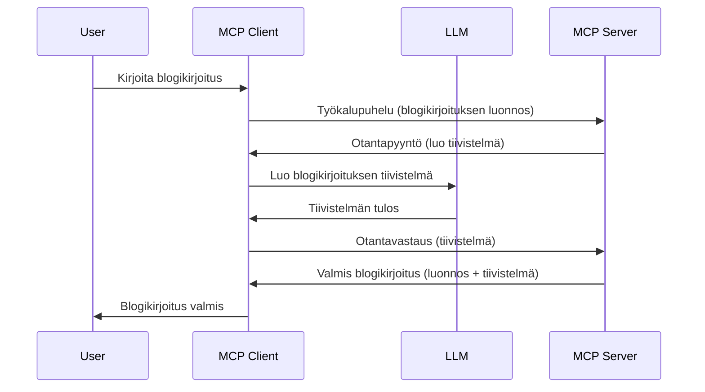

# Näyteotto - ominaisuuksien delegointi asiakkaalle

Joskus MCP-asiakkaan ja MCP-palvelimen täytyy tehdä yhteistyötä yhteisen tavoitteen saavuttamiseksi. Saatat törmätä tilanteeseen, jossa palvelin tarvitsee apua asiakkaalla sijaitsevalta LLM:ltä. Tällaisessa tilanteessa kannattaa käyttää näyteottoa.

Tutustutaanpa joihinkin käyttötapauksiin ja siihen, miten näyteottamiseen perustuva ratkaisu rakennetaan.

## Yleiskatsaus

Tässä oppitunnissa keskitymme selittämään, milloin ja missä näyteottoa käytetään sekä miten se konfiguroidaan.

## Oppimistavoitteet

Tässä luvussa:

- Selitämme, mitä näyteotto on ja milloin sitä käytetään.
- Näytämme, miten näyteotto konfiguroidaan MCP:ssä.
- Tarjoamme esimerkkejä näyteoton käytöstä.

## Mitä näyteotto on ja miksi sitä käytetään?

Näyteotto on edistynyt ominaisuus, joka toimii seuraavasti:


### Näyteottopyyntö

Ok, nyt meillä on laaja yleiskuva uskottavasta skenaariosta, keskustellaan siitä, millainen näyteottopyyntö palvelin lähettää takaisin asiakkaalle. Tässä on esimerkki pyynnöstä JSON-RPC-muodossa:

```json
{
  "jsonrpc": "2.0",
  "id": 1,
  "method": "sampling/createMessage",
  "params": {
    "messages": [
      {
        "role": "user",
        "content": {
          "type": "text",
          "text": "Create a blog post summary of the following blog post: <BLOG POST>"
        }
      }
    ],
    "modelPreferences": {
      "hints": [
        {
          "name": "claude-3-sonnet"
        }
      ],
      "intelligencePriority": 0.8,
      "speedPriority": 0.5
    },
    "systemPrompt": "You are a helpful assistant.",
    "maxTokens": 100
  }
}
```


Tässä on muutama huomionarvoinen asia:

- Kehote, content -> text -kohdassa, on kehotteemme, joka ohjeistaa LLM:ää tiivistämään blogikirjoituksen sisällön.

- **modelPreferences**. Tässä osiossa on suositus eli ehdotus siitä, millaista konfiguraatiota LLM:n kanssa tulisi käyttää. Käyttäjä voi valita, noudattaako näitä suosituksia vai muuttaako niitä. Tässä tapauksessa suositellaan mallia, saatavuutta ja älykkyyden priorisointia.
- **systemPrompt** on normaali järjestelmäkehotteesi, joka antaa LLM:lle persoonallisuuden ja sisältää ohjeistuksia.
- **maxTokens** määrittää, kuinka monta tokenia suositellaan käytettäväksi tässä tehtävässä.

### Näyteottovastaus

Tämä vastaus on se, minkä MCP-asiakas lopulta lähettää takaisin MCP-palvelimelle ja se on seurausta siitä, että asiakas kutsuu LLM:ää, odottaa vastausta ja rakentaa tämän viestin. Tässä esimerkki JSON-RPC-muodossa:

```json
{
  "jsonrpc": "2.0",
  "id": 1,
  "result": {
    "role": "assistant",
    "content": {
      "type": "text",
      "text": "Here's your abstract <ABSTRACT>"
    },
    "model": "gpt-5",
    "stopReason": "endTurn"
  }
}
```


Huomaa, kuinka vastaus on blogikirjoituksen tiivistelmä juuri kuten pyysimme. Huomaa myös, että käytetty `model` ei ole se, mitä pyysimme, vaan "gpt-5" "claude-3-sonnetin" sijaan. Tämä havainnollistaa, että käyttäjä voi muuttaa mieltään ja että näyteottopyyntösi on suositus.

Nyt kun ymmärrämme pääprosessin ja hyödyllisen tehtävän "blogikirjoituksen luonti + tiivistelmä", katsotaan, mitä meidän pitää tehdä, jotta tämä toimisi.

### Viestityypit

Näyteottoviestit eivät rajoitu pelkkään tekstiin, vaan voit lähettää myös kuvia ja ääntä. Tässä kuinka JSON-RPC näyttää erilaiselta:

**Teksti**

```json
{
  "type": "text",
  "text": "The message content"
}
```

**Kuvasisältö**

```json
{
  "type": "image",
  "data": "base64-encoded-image-data",
  "mimeType": "image/jpeg"
}
```

**Äänisisältö**

```json
{
  "type": "audio",
  "data": "base64-encoded-audio-data",
  "mimeType": "audio/wav"
}
```

> HUOM: lisätietoja näyteotosta löytyy [virallisista ohjeista](https://modelcontextprotocol.io/specification/2025-06-18/client/sampling)

## Näyteoton konfigurointi asiakkaassa

> Huom: jos rakennat vain palvelinta, sinun ei tarvitse tehdä tässä juuri mitään.

Asiakkaassa sinun tulee määritellä seuraava ominaisuus näin:

```json
{
  "capabilities": {
    "sampling": {}
  }
}
```


Tämä otetaan käyttöön, kun valittu asiakas alustetaan palvelimen kanssa.

## Esimerkki näyteoton käytöstä – Luo blogikirjoitus

Tehdään yhdessä näyteottopalvelin, sinun pitää tehdä seuraavat asiat:

1. Luo työkalu palvelimelle.
1. Työkalun tulee luoda näyteottopyyntö.
1. Työkalun pitää odottaa, että asiakkaan näyteottopyyntöön vastataan.
1. Sen jälkeen työkalun tulos tuotetaan.

Katsotaan koodia vaihe vaiheelta:

### -1- Luo työkalu

**python**

```python
@mcp.tool()
async def create_blog(title: str, content: str, ctx: Context[ServerSession, None]) -> str:
    """Create a blog post and generate a summary"""

```

### -2- Luo näyteottopyyntö

Laajenna työkalua seuraavalla koodilla:

**python**

```python
post = BlogPost(
        id=len(posts) + 1,
        title=title,
        content=content,
        abstract=""
    )

prompt = f"Create an abstract of the following blog post: title: {title} and draft: {content} "

result = await ctx.session.create_message(
        messages=[
            SamplingMessage(
                role="user",
                content=TextContent(type="text", text=prompt),
            )
        ],
        max_tokens=100,
)

```

### -3- Odota vastausta ja palauta vastaus

**python**

```python
post.abstract = result.content.text

posts.append(post)

# palauta täydellinen tuote
return json.dumps({
    "id": post.title,
    "abstract": post.abstract
})
```

### -4- Kokonaiskoodi

**python**

```python
from starlette.applications import Starlette
from starlette.routing import Mount, Host

from mcp.server.fastmcp import Context, FastMCP

from mcp.server.session import ServerSession
from mcp.types import SamplingMessage, TextContent

import json


from uuid import uuid4
from typing import List
from pydantic import BaseModel


mcp = FastMCP("Blog post generator")

# app = FastAPI()

posts = []

class BlogPost(BaseModel):
    id: int
    title: str
    content: str
    abstract: str

posts: List[BlogPost] = []

@mcp.tool()
async def create_blog(title: str, content: str, ctx: Context[ServerSession, None]) -> str:
    """Create a blog post and generate a summary"""

    post = BlogPost(
        id=len(posts) + 1,
        title=title,
        content=content,
        abstract=""
    )

    prompt = f"Create an abstract of the following blog post: title: {title} and draft: {content} "

    result = await ctx.session.create_message(
        messages=[
            SamplingMessage(
                role="user",
                content=TextContent(type="text", text=prompt),
            )
        ],
        max_tokens=100,
    )

    post.abstract = result.content.text

    posts.append(post)

    # palauta koko blogikirjoitus
    return json.dumps({
        "id": post.title,
        "abstract": post.abstract
    })

if __name__ == "__main__":
    print("Starting server...")
    # mcp.run()
    mcp.run(transport="streamable-http")

# ajakaa sovellus komennolla: python server.py
```

### -5- Testaa Visual Studio Codessa

Testataksesi tätä Visual Studio Codessa, tee seuraavasti:

1. Käynnistä palvelin terminaalissa
1. Lisää palvelin *mcp.json*:iin (ja varmista, että se on käynnissä), esimerkiksi näin:

   ```json
   "servers": {
      "blog-server": {
        "type": "http",
        "url": "http://localhost:8000/mcp"
      }
   }
   ```

1. Kirjoita kehotteesi:

   ```text
   create a blog post named "Where Python comes from", the content is "Python is actually named after Monty Python Flying Circus"
   ```

1. Salli näyteoto. Kun testaat ensimmäistä kertaa, sinulle tulee lisävalinta, joka pitää hyväksyä, sitten näet normaalin valintaikkunan, jossa kysytään suorittamaan työkalu.

1. Tarkastele tuloksia. Näet tulokset kauniisti renderöityinä GitHub Copilot Chatissa, mutta voit myös tarkastella raakaa JSON-vastausta.

**Bonus**. Visual Studio Coden työkalut tukevat erinomaisesti näyteottoa. Voit konfiguroida näyteoton käyttöoikeuksia asennetulle palvelimellesi näin:

1. Mene laajennukset-osioon.
1. Valitse rataskuvake asennetun palvelimen kohdalla "MCP SERVERS - INSTALLED" -osiossa.
1. Valitse "Configure Model Access", täällä voit valita, mitä malleja GitHub Copilot saa käyttää näyteoton aikana. Voit myös nähdä kaikki viimeaikaiset näyteottopyynnöt valitsemalla "Show Sampling requests".

## Tehtävä

Tässä tehtävässä rakennat hieman erilaisen näyteottointegraation, joka tukee tuotteen kuvauksen generointia. Tässä skenaario:

**Skenaario**: Verkkokaupan back office -työntekijä tarvitsee apua, sillä tuotekuvausten kirjoittaminen vie liikaa aikaa. Sinun tehtäväsi on rakentaa ratkaisu, jossa voit kutsua työkalua "create_product" argumenteilla "title" ja "keywords". Työkalun tulisi tuottaa valmis tuote mukaan lukien kenttä "description", jonka sisältö luodaan asiakkaan LLM:llä.

VINKKI: käytä aiemmin oppimaasi rakentaaksesi tämä palvelin ja sen työkalu näyteottopyyntöä käyttäen.

## Ratkaisu

[Ratkaisu](./solution/README.md)

## Tärkeimmät opit

Näyteotto on tehokas ominaisuus, joka sallii palvelimen delegoida tehtäviä asiakkaalle, kun tarvitaan LLM:n apua.

## Mitä seuraavaksi

- [Luku 4 - Käytännön toteutus](../../04-PracticalImplementation/README.md)

---

<!-- CO-OP TRANSLATOR DISCLAIMER START -->
**Vastuuvapauslauseke**:  
Tämä asiakirja on käännetty käyttäen tekoälypohjaista käännöspalvelua [Co-op Translator](https://github.com/Azure/co-op-translator). Vaikka pyrimme tarkkuuteen, ole hyvä ja huomioi, että automaattiset käännökset saattavat sisältää virheitä tai epätarkkuuksia. Alkuperäinen asiakirja omalla kielellään on se auktoriteettinen lähde. Tärkeässä tiedossa suositellaan ammattimaista ihmiskäännöstä. Emme ole vastuussa mistään väärinymmärryksistä tai virhetulkintojen seurauksista, jotka johtuvat tämän käännöksen käytöstä.
<!-- CO-OP TRANSLATOR DISCLAIMER END -->