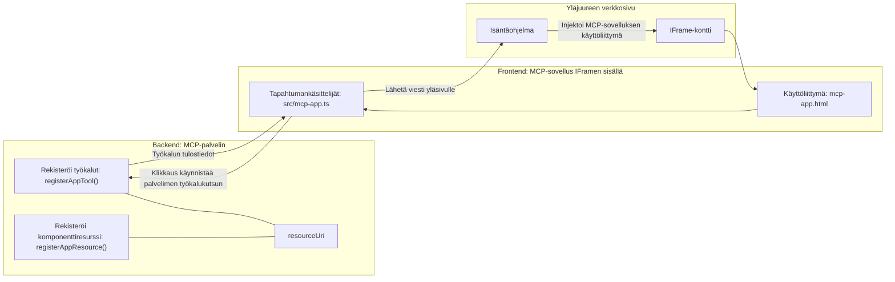

# MCP-sovellukset

MCP-sovellukset ovat uusi paradigma MCP:ssä. Ajatuksena on, että et vain vastaa työkalu-kutsusta tiedolla, vaan tarjoat myös tietoa siitä, miten tähän tietoon tulisi olla vuorovaikutuksessa. Tämä tarkoittaa, että työkalujen tulokset voivat nyt sisältää käyttöliittymätietoa. Miksi haluaisimme näin? No, mieti miten toimit tänään. Todennäköisesti kulutat MCP-palvelimen tuloksia laittamalla jonkinlaisen käyttöliittymän sen eteen, ja tämä on koodia, jota sinun täytyy kirjoittaa ja ylläpitää. Joskus se on se, mitä haluat, mutta joskus olisi hienoa, jos voisit vain tuoda itsenäisen informatiivisen pätkän, joka sisältää kaiken datasta käyttöliittymään.

## Yleiskatsaus

Tämä oppitunti tarjoaa käytännön ohjeita MCP-sovelluksista, kuinka päästä alkuun niiden kanssa ja kuinka integroida ne olemassa oleviin verkkosovelluksiisi. MCP-sovellukset ovat hyvin uusi lisäys MCP-standardiin.

## Oppimistavoitteet

Oppitunnin lopussa osaat:

- Selittää, mitä MCP-sovellukset ovat.
- Milloin käyttää MCP-sovelluksia.
- Rakentaa ja integroida omia MCP-sovelluksiasi.

## MCP-sovellukset – miten ne toimivat

Ajatus MCP-sovelluksissa on tarjota vastaus, joka on pohjimmiltaan komponentti, joka renderöidään. Tällaisella komponentilla voi olla sekä visuaalisia että vuorovaikutuksellisia ominaisuuksia, esim. napin klikkaukset, käyttäjän syötteet ja muuta. Aloitetaan palvelinpuolelta ja MCP-palvelimestamme. MCP-sovelluskomponentin luomiseksi sinun tulee luoda työkalu sekä sovellusresurssi. Nämä kaksi osaa liitetään toisiinsa resourceUri:n avulla.

Tässä esimerkki. Yritetään visualisoida, mitä kaikkea on mukana ja mitkä osat tekevät mitä:

```text
server.ts -- responsible for registering tools and the component as a UI component
src/
  mcp-app.ts -- wiring up event handlers
mcp-app.html -- the user interface
```

Tämä kuvaus esittää arkkitehtuurin komponentin ja sen logiikan luomiseksi.


Kuvataan seuraavaksi vastuut backendille ja frontendille erikseen.

### Backend

Meillä on kaksi asiaa, jotka täytyy toteuttaa:

- Rekisteröidä työkalut, joiden kanssa haluamme olla vuorovaikutuksessa.
- Määritellä komponentti.

**Työkalun rekisteröinti**

```typescript
registerAppTool(
    server,
    "get-time",
    {
      title: "Get Time",
      description: "Returns the current server time.",
      inputSchema: {},
      _meta: { ui: { resourceUri } }, // Linkittää tämän työkalun sen käyttöliittymäresurssiin
    },
    async () => {
      const time = new Date().toISOString();
      return { content: [{ type: "text", text: time }] };
    },
  );

```

Edellinen koodi kuvaa käyttäytymistä, jossa tarjotaan työkalu nimeltä `get-time`. Se ei ota syötteitä, mutta tuottaa nykyisen ajan. Meillä on myös mahdollisuus määritellä `inputSchema` niille työkaluillesi, joissa käyttäjän syöte tarvitaan.

**Komponentin rekisteröinti**

Saman tiedoston sisällä meidän tulee myös rekisteröidä komponentti:

```typescript
const resourceUri = "ui://get-time/mcp-app.html";

// Rekisteröi resurssi, joka palauttaa käyttöliittymän niputetun HTML-/JavaScript-koodin.
registerAppResource(
  server,
  resourceUri,
  resourceUri,
  { mimeType: RESOURCE_MIME_TYPE },
  async () => {
    const html = await fs.readFile(path.join(DIST_DIR, "mcp-app.html"), "utf-8");

    return {
    contents: [
        { uri: resourceUri, mimeType: RESOURCE_MIME_TYPE, text: html },
    ],
    };
  },
);
```

Huomaa, miten mainitsemme `resourceUri` yhdistääksemme komponentin ja sen työkalut. Mielenkiintoinen on myös callback-funktio, jossa ladataan käyttöliittymätiedosto ja palautetaan komponentti.

### Komponentin frontend

Sama kaksijakoisuus kuin backendissä:

- Frontend kirjoitettuna puhtaalla HTML:llä.
- Koodi, joka käsittelee tapahtumia ja mitä tehdä, esim. kutsua työkaluja tai viestiä yläikkunalle.

**Käyttöliittymä**

Katsotaan käyttöliittymää.

```html
<!-- mcp-app.html -->
<!DOCTYPE html>
<html lang="en">
  <head>
    <meta charset="UTF-8" />
    <title>Get Time App</title>
  </head>
  <body>
    <p>
      <strong>Server Time:</strong> <code id="server-time">Loading...</code>
    </p>
    <button id="get-time-btn">Get Server Time</button>
    <script type="module" src="/src/mcp-app.ts"></script>
  </body>
</html>
```

**Tapahtumien liittäminen**

Viimeinen osa on tapahtumien liittäminen. Tämä tarkoittaa, että määritämme mitkä kohdat käyttöliittymässä tarvitsevat tapahtumankäsittelijöitä ja mitä tehdä, jos tapahtumia tapahtuu:

```typescript
// mcp-app.ts

import { App } from "@modelcontextprotocol/ext-apps";

// Hae elementtiviitteet
const serverTimeEl = document.getElementById("server-time")!;
const getTimeBtn = document.getElementById("get-time-btn")!;

// Luo sovellusinstanssi
const app = new App({ name: "Get Time App", version: "1.0.0" });

// Käsittele työkalun tuloksia palvelimelta. Aseta ennen `app.connect()`, jotta vältetään
// alkuperäisen työkalun tuloksen puuttuminen.
app.ontoolresult = (result) => {
  const time = result.content?.find((c) => c.type === "text")?.text;
  serverTimeEl.textContent = time ?? "[ERROR]";
};

// Kytke nappulan klikkaus
getTimeBtn.addEventListener("click", async () => {
  // `app.callServerTool()` antaa käyttöliittymän pyytää uusia tietoja palvelimelta
  const result = await app.callServerTool({ name: "get-time", arguments: {} });
  const time = result.content?.find((c) => c.type === "text")?.text;
  serverTimeEl.textContent = time ?? "[ERROR]";
});

// Yhdistä isäntään
app.connect();
```

Kuten edellä nähdään, tässä on tavallinen koodi DOM-elementtien liittämiseksi tapahtumiin. Kannattaa huomioida kutsu `callServerTool`, joka tarkalleen kutsuu työkalua backendillä.

## Käyttäjän syötteen käsittely

Tähän asti olemme nähneet komponentin, jossa on nappi ja sen klikkaaminen kutsuu työkalua. Katsotaan, voimmeko lisätä lisää käyttöliittymäelementtejä, kuten syötekentän, ja voimmeko lähettää argumentteja työkalulle. Toteutetaan FAQ-toiminnallisuus. Näin sen tulisi toimia:

- Pitäisi olla nappi ja syöte-elementti, johon käyttäjä kirjoittaa hakusanan, esimerkiksi "Shipping". Tämä kutsuu backendillä työkalua, joka suorittaa haun FAQ-datasta.
- Työkalu, joka tukee mainittua FAQ-hakua.

Lisätään ensin tarvittava tuki backendille:

```typescript
const faq: { [key: string]: string } = {
    "shipping": "Our standard shipping time is 3-5 business days.",
    "return policy": "You can return any item within 30 days of purchase.",
    "warranty": "All products come with a 1-year warranty covering manufacturing defects.",
  }

registerAppTool(
    server,
    "get-faq",
    {
      title: "Search FAQ",
      description: "Searches the FAQ for relevant answers.",
      inputSchema: zod.object({
        query: zod.string().default("shipping"),
      }),
      _meta: { ui: { resourceUri: faqResourceUri } }, // Linkittää tämän työkalun sen käyttöliittymäresurssiin
    },
    async ({ query }) => {
      const answer: string = faq[query.toLowerCase()] || "Sorry, I don't have an answer for that.";
      return { content: [{ type: "text", text: answer }] };
    },
  );
```

Tässä näemme, miten täytämme `inputSchema`:n ja annamme sille `zod`-skeeman näin:

```typescript
inputSchema: zod.object({
  query: zod.string().default("shipping"),
})
```

Yllä olevassa skeemassa määrittelemme, että meillä on syöteparametri nimeltä `query` ja se on valinnainen oletusarvolla "shipping".

Ok, siirrytään *mcp-app.html*:iin katsomaan, millainen käyttöliittymän tulisi olla:

```html
<div class="faq">
    <h1>FAQ response</h1>
    <p>FAQ Response: <code id="faq-response">Loading...</code></p>
    <input type="text" id="faq-query" placeholder="Enter FAQ query" />
    <button id="get-faq-btn">Get FAQ Response</button>
  </div>
```

Hienoa, nyt meillä on syöte-elementti ja nappi. Mennään seuraavaksi *mcp-app.ts*:iin liittämään nämä tapahtumat:

```typescript
const getFaqBtn = document.getElementById("get-faq-btn")!;
const faqQueryInput = document.getElementById("faq-query") as HTMLInputElement;

getFaqBtn.addEventListener("click", async () => {
  const query = faqQueryInput.value;
  const result = await app.callServerTool({ name: "get-faq", arguments: { query } });
  const faq = result.content?.find((c) => c.type === "text")?.text;
  faqResponseEl.textContent = faq ?? "[ERROR]";
});
```

Yllä olevassa koodissa me:

- Luomme viitteet vuorovaikutteisiin käyttöliittymäelementteihin.
- Käsittelemme napin klikkauksen, josta puramme syötekentän arvon, ja kutsumme myös `app.callServerTool()` -funktiota `name` ja `arguments` -parametreilla, joista jälkimmäinen välittää `query`-arvon.

Se, mitä varsinaisesti tapahtuu, kun kutsut `callServerTool`-funktiota, on että viesti lähetetään yläikkunalle ja tämä ikkuna kutsuu MCP-palvelinta.

### Kokeile itse

Kokeillessa meidän pitäisi nähdä seuraavaa:


ja tässä kokeillaan syötteellä kuten "warranty"


Ajaaksesi tämän koodin, siirry kohtaan [Code section](./code/README.md)

## Testaus Visual Studio Codessa

Visual Studio Code tukee erinomaisesti MCP-sovelluksia ja on todennäköisesti yksi helpoimmista tavoista testata MCP-sovelluksiasi. Käyttääksesi Visual Studio Codea, lisää palvelinmääritys *mcp.json*-tiedostoon näin:

```json
"my-mcp-server-7178eca7": {
    "url": "http://localhost:3001/mcp",
    "type": "http"
  }
```

Käynnistä sitten palvelin, jotta voit kommunikoida MCP-sovelluksesi kanssa Chat-ikkunan kautta edellyttäen, että sinulla on asennettuna GitHub Copilot.

Voit käynnistää sen kehotteella, esimerkiksi "#get-faq":


Ja aivan kuten ajettaessa selaimessa, se renderöityy samalla tavalla:


## Tehtävä

Luo kivi-paperi-sakset peli. Sen tulisi sisältää seuraavat:

Käyttöliittymä:

- pudotusvalikko vaihtoehdoilla
- nappi valinnan lähettämiseen
- etiketti, joka näyttää kuka valitsi mitä ja kuka voitti

Palvelin:

- pitää olla kivi-paperi-sakset -työkalu, joka ottaa "choice" syötteenä. Sen pitää myös generoida tietokoneen valinta ja määrittää voittaja.

## Ratkaisu

[Ratkaisu](./assignment/README.md)

## Yhteenveto

Opimme tästä uudesta paradigman MCP-sovelluksista. Se on uusi paradigma, joka sallii MCP-palvelimien määrittää mielipiteensä paitsi datasta myös siitä, miten tämä data esitetään.

Lisäksi opimme, että nämä MCP-sovellukset isännöidään IFrameen ja kommunikoidakseen MCP-palvelimien kanssa ne tarvitsevat lähettää viestejä yläverkkosovellukselle. On olemassa useita kirjastoja niin tavalliseen JavaScriptiin, Reactiin ja muihin, jotka helpottavat tätä kommunikaatiota.

## Tärkeimmät opit

Tässä mitä opit:

- MCP-sovellukset ovat uusi standardi, joka voi olla hyödyllinen kun haluat toimittaa sekä dataa että käyttöliittymäominaisuuksia.
- Tällaiset sovellukset ajetaan turvallisuussyistä IFramessa.

## Mitä seuraavaksi

- [Luku 4](../../04-PracticalImplementation/README.md)

---

<!-- CO-OP TRANSLATOR DISCLAIMER START -->
**Vastuuvapauslauseke**:  
Tämä asiakirja on käännetty käyttäen tekoälypohjaista käännöspalvelua [Co-op Translator](https://github.com/Azure/co-op-translator). Vaikka pyrimme tarkkuuteen, huomioithan, että automaattiset käännökset saattavat sisältää virheitä tai epätarkkuuksia. Alkuperäinen asiakirja sen alkuperäiskielellä on virallinen lähde. Tärkeissä asioissa suosittelemme ammattimaista ihmiskäännöstä. Emme ole vastuussa tämän käännöksen käytöstä aiheutuvista väärinkäsityksistä tai tulkinnoista.
<!-- CO-OP TRANSLATOR DISCLAIMER END -->