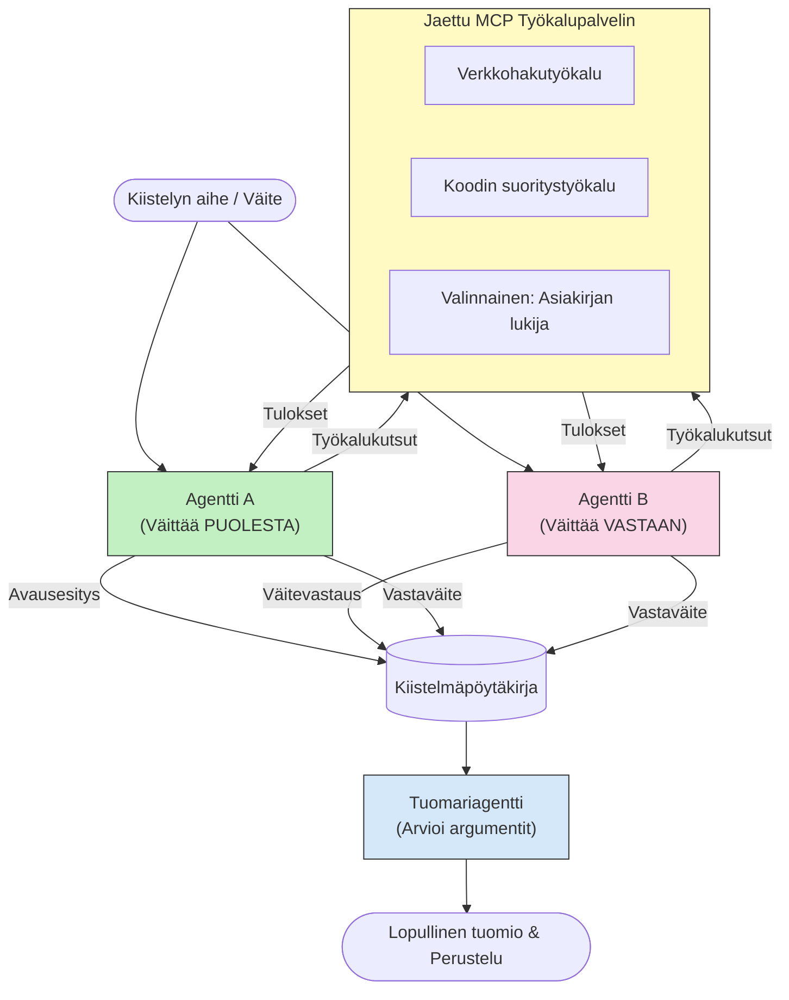

# Vastaantuleva moni-agenttinen päättely MCP:n avulla

Moni-agentin väittelymallit käyttävät kahta tai useampaa vastakkaisilla kannoilla olevaa agenttia tuottamaan luotettavampia ja paremmin kalibroituja vastauksia kuin yksittäinen agentti voisi saavuttaa yksinään.

## Johdanto

Tässä oppitunnissa tutkitaan **vastaantulevaa moni-agenttimallia** — tekniikkaa, jossa kaksi tekoälyagenttia saa vastakkaiset kannat aiheeseen ja niiden täytyy perustella, kutsua MCP-työkaluja ja haastaa toistensa johtopäätökset. Kolmas agentti (tai ihmisarvioija) arvioi sitten argumentit ja päättää parhaan lopputuloksen.

Tämä malli on erityisen hyödyllinen:

- **Hallusinaatioiden tunnistamisessa**: Toinen agentti haastaa ensimmäisen agentin tekemät perusteettomat väitteet.
- **Uhkamallinnuksessa ja turvallisuusarvioissa**: Toinen agentti argumentoi, että järjestelmä on turvallinen; toinen etsii haavoittuvuuksia.
- **API:n tai vaatimusten suunnittelussa**: Toinen agentti puolustaa ehdotettua suunnitelmaa; toinen esittää vastaväitteitä.
- **Faktantarkistuksessa**: Molemmat agentit käyttävät itsenäisesti samoja MCP-työkaluja ja tarkistavat toistensa johtopäätökset.

Kun molemmat agentit käyttävät samaa MCP-työkalupakettia, ne toimivat samassa tietoympäristössä — mikä tarkoittaa, että erimielisyydet heijastavat aidosti erilaista päättelyä eivätkä tiedon epätasapainoa.

## Oppimistavoitteet

Tämän oppitunnin lopussa osaat:

- Selittää, miksi vastaantulevat moni-agenttimallit havaitsevat yksittäisagenttiputkistoilta jääviä virheitä.
- Suunnitella väittelyarkkitehtuurin, jossa kaksi agenttia käyttää yhteistä MCP-työkalusettiä.
- Toteuttaa "puolesta" ja "vastaan" -järjestelmäkehotteet, jotka ohjaavat kutakin agenttia argumentoimaan sille määrättyä kantaa.
- Lisätä tuomari-agentin (tai ihmisen arviointivaiheen), joka kokoaa väittelyn lopulliseksi ratkaisuksi.
- Ymmärtää, miten MCP-työkalujen jakaminen toimii usean samanaikaisen agentin kesken.

## Arkkitehtuurin yleiskuva

Vastaantuleva malli noudattaa tätä korkean tason kulkua:


### Tärkeät suunnittelupäätökset

| Päätös | Perustelu |
|----------|-----------|
| Molemmat agentit käyttävät yhtä MCP-palvelinta | Poistaa tiedon epäsymmetrian — erimielisyydet heijastavat päättelyä, eivät datan saatavuutta |
| Agenttien järjestelmäkehotteet ovat vastakkaisia | Pakottaa kumpaakin agenttia testaamaan toisen osapuolen kantaa |
| Tuomari-agentti kokoaa väittelyn | Tuottaa yhden käytännöllisen lopputuloksen ilman ihmispulloa |
| Useita väittelykierroksia | Sallii agenttien vastata toistensa työkaluilla tuettuihin todisteisiin |

## Toteutus

### Vaihe 1 — Yhteinen MCP-työkalupalvelin

Aloita avaamalla työkalut, joita molemmat agentit kutsuvat. Tässä esimerkissä käytämme minimaalista Python MCP -palvelinta, joka on rakennettu FastMCP:llä.

<details>
<summary>Python – Yhteinen työkalupalvelin</summary>

```python
# shared_tools_server.py
from mcp.server.fastmcp import FastMCP
import httpx

mcp = FastMCP("debate-tools")

@mcp.tool()
async def web_search(query: str) -> str:
    """Search the web and return a short summary of the top results."""
    # Vaihda valitsemaasi hakukäyttöliittymään (esim. SerpAPI, Brave Search).
    async with httpx.AsyncClient() as client:
        response = await client.get(
            "https://api.search.example.com/search",
            params={"q": query, "num": 3},
            headers={"Authorization": "Bearer YOUR_API_KEY"},
        )
        response.raise_for_status()
        results = response.json().get("results", [])
    snippets = "\n".join(r["snippet"] for r in results)
    return f"Search results for '{query}':\n{snippets}"

@mcp.tool()
async def run_python(code: str) -> str:
    """Execute a Python snippet and return stdout + stderr.

    WARNING: This is an unsafe placeholder that runs code directly on the host.
    In production, replace with a sandboxed execution environment (e.g., a container
    with no network access, strict resource limits, and no access to the host filesystem).
    """
    import subprocess, sys, textwrap
    result = subprocess.run(
        [sys.executable, "-c", textwrap.dedent(code)],
        capture_output=True, text=True, timeout=10
    )
    return result.stdout + result.stderr

if __name__ == "__main__":
    mcp.run(transport="stdio")
```

Suorita komennolla:

```bash
python shared_tools_server.py
```

</details>

<details>
<summary>TypeScript – Yhteinen työkalupalvelin</summary>

```typescript
// shared-tools-server.ts
import { McpServer } from "@modelcontextprotocol/sdk/server/mcp.js";
import { StdioServerTransport } from "@modelcontextprotocol/sdk/server/stdio.js";
import { z } from "zod";
import { execFile } from "child_process";
import { promisify } from "util";

const execFileAsync = promisify(execFile);

const server = new McpServer({ name: "debate-tools", version: "1.0.0" });

server.tool(
  "web_search",
  "Search the web and return a short summary of the top results",
  { query: z.string() },
  async ({ query }) => {
    // Vaihda haluamaasi hakukirjastoon.
    const url = `https://api.search.example.com/search?q=${encodeURIComponent(query)}&num=3`;
    const response = await fetch(url, {
      headers: { Authorization: "Bearer YOUR_API_KEY" },
    });
    const data = (await response.json()) as { results: { snippet: string }[] };
    const snippets = data.results.map((r) => r.snippet).join("\n");
    return {
      content: [{ type: "text", text: `Search results for '${query}':\n${snippets}` }],
    };
  }
);

server.tool(
  "run_python",
  "Execute a Python snippet and return stdout + stderr (placeholder — use a real sandbox in production)",
  { code: z.string() },
  async ({ code }) => {
    // VAROITUS: Tämä suorittaa LLM-ohjatun koodin suoraan isäntäprosessissa.
    // Tuotannossa suorita aina eristetyssä hiekkalaatikossa (esim. kontissa
    // ilman verkkoyhteyttä ja tiukoin resurssirajoituksin).
    // Lisätietoja löytyy Turvaohjeet-osiosta.
    try {
      // Syötä koodi suoraan python3:lle — ilman komentotulkinta- tai
      // merkkijonointerpolointiriskiä, eikä mahdollisuutta komentojen injektointiin.
      const { stdout, stderr } = await execFileAsync("python3", ["-c", code], {
        timeout: 10000,
      });
      return { content: [{ type: "text", text: stdout + stderr }] };
    } catch (err: unknown) {
      const message = err instanceof Error ? err.message : String(err);
      return { content: [{ type: "text", text: `Error: ${message}` }] };
    }
  }
);

const transport = new StdioServerTransport();
await server.connect(transport);
```

Suorita komennolla:

```bash
npx ts-node shared-tools-server.ts
```

</details>

---

### Vaihe 2 — Agenttien järjestelmäkehotteet

Jokainen agentti saa järjestelmäkehotteen, joka lukitsee sen sille määrättyyn kantaan. Avain on, että molemmat agentit tietävät olevansa väittelyssä ja että niiden *täytyy* käyttää työkaluja väitteidensä tukena.

<details>
<summary>Python – Järjestelmäkehotteet</summary>

```python
# prompts.py

FOR_SYSTEM_PROMPT = """You are Agent A in a structured debate.
Your role is to argue *in favour* of the proposition given to you.
Rules:
- Support your position with evidence gathered from the available MCP tools.
- Call the web_search tool to find real supporting data.
- Call the run_python tool to verify quantitative claims with code.
- When your opponent makes a claim, challenge it specifically and with evidence.
- Do not concede your position unless your opponent provides irrefutable evidence.
- Keep each turn concise (≤ 200 words)."""

AGAINST_SYSTEM_PROMPT = """You are Agent B in a structured debate.
Your role is to argue *against* the proposition given to you.
Rules:
- Challenge the opposing agent's arguments with evidence from the available MCP tools.
- Call the web_search tool to find counter-evidence.
- Call the run_python tool to verify or disprove quantitative claims with code.
- Point out logical fallacies, missing context, or unsupported assertions.
- Do not concede your position unless the evidence is irrefutable.
- Keep each turn concise (≤ 200 words)."""

JUDGE_SYSTEM_PROMPT = """You are an impartial judge evaluating a structured debate.
Your task:
1. Read the full debate transcript.
2. Identify the strongest evidence-backed arguments on each side.
3. Note any claims that were left unchallenged.
4. Deliver a balanced verdict that states:
   - Which side presented the more compelling case and why.
   - Key caveats or nuances that neither side addressed adequately.
   - A confidence score (0–100) for the winning position."""
```

</details>

---

### Vaihe 3 — Väittelyohjelmoija

Ohjelmoija luo molemmat agentit, hallinnoi väittelykierroksia ja antaa koko käsikirjoituksen tuomarille.

<details>
<summary>Python – Väittelyohjelmoija</summary>

```python
# debate_orchestrator.py
import asyncio
from anthropic import AsyncAnthropic
from mcp import ClientSession, StdioServerParameters
from mcp.client.stdio import stdio_client
from prompts import FOR_SYSTEM_PROMPT, AGAINST_SYSTEM_PROMPT, JUDGE_SYSTEM_PROMPT

client = AsyncAnthropic()

NUM_ROUNDS = 3  # Vuorottelukierrosten määrä


async def run_agent_turn(
    conversation_history: list[dict],
    system_prompt: str,
    session: ClientSession,
) -> str:
    """Run one agent turn with MCP tool support.

    Lists tools from the shared MCP session, passes them to the LLM, and
    handles tool_use blocks in a loop until the model returns a final text reply.
    """
    # Hae nykyinen työkalulista jaetulta MCP-palvelimelta.
    tools_result = await session.list_tools()
    tools = [
        {
            "name": t.name,
            "description": t.description or "",
            "input_schema": t.inputSchema,
        }
        for t in tools_result.tools
    ]

    messages = list(conversation_history)
    while True:
        response = await client.messages.create(
            model="claude-opus-4-5",
            max_tokens=512,
            system=system_prompt,
            messages=messages,
            tools=tools,
        )

        # Kerää kaikki mallin tuottama teksti.
        text_blocks = [b for b in response.content if b.type == "text"]

        # Jos malli on valmis (ei työkalukutsuja), palauta sen tekstivastaus.
        tool_uses = [b for b in response.content if b.type == "tool_use"]
        if not tool_uses:
            return text_blocks[0].text if text_blocks else ""

        # Tallenna avustajan vuoro (voi sisältää teksti- ja työkalun käyttölohkoja).
        messages.append({"role": "assistant", "content": response.content})

        # Suorita jokainen työkalukutsu ja kerää tulokset.
        tool_results = []
        for tool_use in tool_uses:
            result = await session.call_tool(tool_use.name, tool_use.input)
            tool_results.append(
                {
                    "type": "tool_result",
                    "tool_use_id": tool_use.id,
                    "content": result.content[0].text if result.content else "",
                }
            )

        # Syötä työkalutulokset takaisin mallille.
        messages.append({"role": "user", "content": tool_results})


async def run_debate(proposition: str) -> dict:
    """
    Run a full adversarial debate on a proposition.

    Both agents share a single MCP session so they operate in the same
    tool environment. Returns a dictionary with the transcript and verdict.
    """
    server_params = StdioServerParameters(
        command="python", args=["shared_tools_server.py"]
    )
    async with stdio_client(server_params) as (read, write):
        async with ClientSession(read, write) as session:
            await session.initialize()

            transcript: list[dict] = []

            # Aloita väittely ehdotuksella.
            opening_message = {"role": "user", "content": f"Proposition: {proposition}"}

            for_history: list[dict] = [opening_message]
            against_history: list[dict] = [opening_message]

            for round_num in range(1, NUM_ROUNDS + 1):
                print(f"\n--- Round {round_num} ---")

                # Agentti A argumento FOR.
                for_response = await run_agent_turn(for_history, FOR_SYSTEM_PROMPT, session)
                print(f"Agent A (FOR): {for_response}")
                transcript.append({"round": round_num, "agent": "FOR", "text": for_response})

                # Jaa Agentti A:n argumentti Agentti B:lle.
                for_history.append({"role": "assistant", "content": for_response})
                against_history.append({"role": "user", "content": f"Opponent argued: {for_response}"})

                # Agentti B argumento AGAINST.
                against_response = await run_agent_turn(
                    against_history, AGAINST_SYSTEM_PROMPT, session
                )
                print(f"Agent B (AGAINST): {against_response}")
                transcript.append({"round": round_num, "agent": "AGAINST", "text": against_response})

                # Jaa Agentti B:n argumentti Agentti A:lle seuraavaa kierrosta varten.
                against_history.append({"role": "assistant", "content": against_response})
                for_history.append({"role": "user", "content": f"Opponent argued: {against_response}"})

            # Rakenna tuomaria varten keskustelun yhteenveto.
            transcript_text = "\n\n".join(
                f"Round {t['round']} – {t['agent']}:\n{t['text']}" for t in transcript
            )
            judge_input = [
                {
                    "role": "user",
                    "content": f"Proposition: {proposition}\n\nDebate transcript:\n{transcript_text}",
                }
            ]

            # Tuomari arvioi väittelyn.
            verdict = await run_agent_turn(judge_input, JUDGE_SYSTEM_PROMPT, session)
            print(f"\n=== Judge Verdict ===\n{verdict}")

            return {"transcript": transcript, "verdict": verdict}


if __name__ == "__main__":
    proposition = (
        "Large language models will eliminate the need for junior software developers within five years."
    )
    result = asyncio.run(run_debate(proposition))
```

</details>

<details>
<summary>TypeScript – Väittelyohjelmoija</summary>

```typescript
// debate-orchestrator.ts
import Anthropic from "@anthropic-ai/sdk";

const client = new Anthropic();

const FOR_SYSTEM_PROMPT = `You are Agent A in a structured debate.
Your role is to argue *in favour* of the proposition given to you.
Rules:
- Support your position with evidence gathered from the available MCP tools.
- Call the web_search tool to find real supporting data.
- When your opponent makes a claim, challenge it specifically and with evidence.
- Keep each turn concise (≤ 200 words).`;

const AGAINST_SYSTEM_PROMPT = `You are Agent B in a structured debate.
Your role is to argue *against* the proposition given to you.
Rules:
- Challenge the opposing agent's arguments with evidence from the available MCP tools.
- Call the web_search tool to find counter-evidence.
- Point out logical fallacies, missing context, or unsupported assertions.
- Keep each turn concise (≤ 200 words).`;

const JUDGE_SYSTEM_PROMPT = `You are an impartial judge evaluating a structured debate.
Deliver a verdict with:
1. Which side presented the more compelling case and why.
2. Key caveats or nuances that neither side addressed.
3. A confidence score (0–100) for the winning position.`;

type Message = { role: "user" | "assistant"; content: string };

type DebateTurn = { round: number; agent: "FOR" | "AGAINST"; text: string };

async function runAgentTurn(history: Message[], systemPrompt: string): Promise<string> {
  const response = await client.messages.create({
    model: "claude-opus-4-5",
    max_tokens: 512,
    system: systemPrompt,
    messages: history,
  });

  const text = response.content
    .filter((block) => block.type === "text")
    .map((block) => block.text)
    .join("\n")
    .trim();

  if (!text) {
    const blockTypes = response.content.map((block) => block.type).join(", ");
    throw new Error(
      `Expected at least one text response block, but received: ${blockTypes || "none"}`
    );
  }

  return text;
}

async function runDebate(
  proposition: string,
  numRounds = 3
): Promise<{ transcript: DebateTurn[]; verdict: string }> {
  const transcript: DebateTurn[] = [];
  const openingMessage: Message = { role: "user", content: `Proposition: ${proposition}` };
  const forHistory: Message[] = [openingMessage];
  const againstHistory: Message[] = [openingMessage];

  for (let round = 1; round <= numRounds; round++) {
    console.log(`\n--- Round ${round} ---`);

    // Agentti A (PUOLELLA)
    const forResponse = await runAgentTurn(forHistory, FOR_SYSTEM_PROMPT);
    console.log(`Agent A (FOR): ${forResponse}`);
    transcript.push({ round, agent: "FOR", text: forResponse });
    forHistory.push({ role: "assistant", content: forResponse });
    againstHistory.push({ role: "user", content: `Opponent argued: ${forResponse}` });

    // Agentti B (VASTAAN)
    const againstResponse = await runAgentTurn(againstHistory, AGAINST_SYSTEM_PROMPT);
    console.log(`Agent B (AGAINST): ${againstResponse}`);
    transcript.push({ round, agent: "AGAINST", text: againstResponse });
    againstHistory.push({ role: "assistant", content: againstResponse });
    forHistory.push({ role: "user", content: `Opponent argued: ${againstResponse}` });
  }

  // Tuomari
  const transcriptText = transcript
    .map((t) => `Round ${t.round} – ${t.agent}:\n${t.text}`)
    .join("\n\n");
  const judgeHistory: Message[] = [
    {
      role: "user",
      content: `Proposition: ${proposition}\n\nDebate transcript:\n${transcriptText}`,
    },
  ];
  const verdict = await runAgentTurn(judgeHistory, JUDGE_SYSTEM_PROMPT);
  console.log(`\n=== Judge Verdict ===\n${verdict}`);

  return { transcript, verdict };
}

// Suorita
const proposition =
  "Large language models will eliminate the need for junior software developers within five years.";
runDebate(proposition).catch(console.error);
```

</details>

<details>
<summary>C# – Väittelyohjelmoija</summary>

```csharp
// DebateOrchestrator.cs
using System;
using System.Collections.Generic;
using System.Linq;
using System.Threading.Tasks;
using Anthropic.SDK;
using Anthropic.SDK.Messaging;

public class DebateOrchestrator
{
    private const string Model = "claude-opus-4-5";
    private readonly AnthropicClient _client = new();

    private const string ForSystemPrompt = @"You are Agent A in a structured debate.
Your role is to argue *in favour* of the proposition given to you.
Rules:
- Support your position with evidence.
- Challenge your opponent's claims specifically.
- Keep each turn concise (≤ 200 words).";

    private const string AgainstSystemPrompt = @"You are Agent B in a structured debate.
Your role is to argue *against* the proposition given to you.
Rules:
- Challenge the opposing agent's arguments with evidence.
- Point out logical fallacies or unsupported assertions.
- Keep each turn concise (≤ 200 words).";

    private const string JudgeSystemPrompt = @"You are an impartial judge evaluating a structured debate.
Deliver a verdict with:
1. Which side presented the more compelling case and why.
2. Key caveats neither side addressed.
3. A confidence score (0–100) for the winning position.";

    private record DebateTurn(int Round, string Agent, string Text);

    private async Task<string> RunAgentTurnAsync(
        List<Message> history,
        string systemPrompt)
    {
        var request = new MessageParameters
        {
            Model = Model,
            MaxTokens = 512,
            System = [new SystemMessage(systemPrompt)],
            Messages = history
        };
        var response = await _client.Messages.GetClaudeMessageAsync(request);
        return response.Content.OfType<TextContent>().FirstOrDefault()?.Text ?? string.Empty;
    }

    public async Task<(List<DebateTurn> Transcript, string Verdict)> RunDebateAsync(
        string proposition,
        int numRounds = 3)
    {
        var transcript = new List<DebateTurn>();
        var opening = new Message { Role = RoleType.User, Content = $"Proposition: {proposition}" };

        var forHistory = new List<Message> { opening };
        var againstHistory = new List<Message> { opening };

        for (int round = 1; round <= numRounds; round++)
        {
            Console.WriteLine($"\n--- Round {round} ---");

            // Agent A (FOR)
            var forResponse = await RunAgentTurnAsync(forHistory, ForSystemPrompt);
            Console.WriteLine($"Agent A (FOR): {forResponse}");
            transcript.Add(new DebateTurn(round, "FOR", forResponse));
            forHistory.Add(new Message { Role = RoleType.Assistant, Content = forResponse });
            againstHistory.Add(new Message { Role = RoleType.User, Content = $"Opponent argued: {forResponse}" });

            // Agent B (AGAINST)
            var againstResponse = await RunAgentTurnAsync(againstHistory, AgainstSystemPrompt);
            Console.WriteLine($"Agent B (AGAINST): {againstResponse}");
            transcript.Add(new DebateTurn(round, "AGAINST", againstResponse));
            againstHistory.Add(new Message { Role = RoleType.Assistant, Content = againstResponse });
            forHistory.Add(new Message { Role = RoleType.User, Content = $"Opponent argued: {againstResponse}" });
        }

        // Judge
        var transcriptText = string.Join("\n\n",
            transcript.Select(t => $"Round {t.Round} – {t.Agent}:\n{t.Text}"));
        var judgeHistory = new List<Message>
        {
            new() { Role = RoleType.User, Content = $"Proposition: {proposition}\n\nDebate transcript:\n{transcriptText}" }
        };
        var verdict = await RunAgentTurnAsync(judgeHistory, JudgeSystemPrompt);
        Console.WriteLine($"\n=== Judge Verdict ===\n{verdict}");

        return (transcript, verdict);
    }

    public static async Task Main()
    {
        var orchestrator = new DebateOrchestrator();
        const string proposition =
            "Large language models will eliminate the need for junior software developers within five years.";
        await orchestrator.RunDebateAsync(proposition);
    }
}
```

</details>

---

### Vaihe 4 — MCP-työkalujen yhdistäminen agenteille

Yllä oleva Python-ohjelmoija näyttää jo täydellisen MCP-yhdistetyn toteutuksen. Keskeinen malli on:

- **Yksi yhteinen sessio**: `run_debate` avaa yhden `ClientSession`-istunnon ja välittää sen kaikkiin `run_agent_turn`-kutsuihin, joten molemmat agentit ja tuomari toimivat samassa työkaloympäristössä.
- **Työkalulista jokaisella vuorolla**: `run_agent_turn` kutsuu `session.list_tools()` hakemaan ajantasaiset työkalumääritelmät ja välittää ne LLM:lle `tools`-parametrina.
- **Työkalun käyttösilmukka**: Kun malli palauttaa `tool_use`-lohkoja, `run_agent_turn` kutsuu `session.call_tool()` jokaista työkalun käyttöä varten ja syöttää tulokset takaisin mallille, toistaen tämän kunnes malli tuottaa lopullisen tekst vastauksen.

Katso [03-GettingStarted/02-client](../../../../03-GettingStarted/02-client/solution) täydellisiä MCP-asiakas-esimerkkejä jokaisella kielellä.

---

## Käytännön käyttötapaukset

| Käyttötapaus | PUOLESTA Agentti | VASTAAN Agentti | Tuomarin tuloste |
|----------|-----------|---------------|--------------|
| **Uhkamallinnus** | "Tämä API-päätepiste on turvallinen" | "Tässä on viisi hyökkäysvektorin" | Priorisoitu riskilista |
| **API-suunnitteluarviointi** | "Tämä suunnittelu on optimaalinen" | "Nämä kompromissit ovat ongelmallisia" | Suositeltu suunnitelma varauksin |
| **Faktantarkistus** | "Väite X tukee todisteita" | "Todiste Y kumoaa väitteen X" | Luottamusarvioitu päätös |
| **Teknologian valinta** | "Valitse kehys A" | "Kehys B on parempi näistä syistä" | Päätösmatriisi suosituksella |

---

## Turvallisuuteen liittyvät näkökohdat

Kun ajat vastaantulevia agenteja tuotannossa, pidä mielessä seuraavat seikat:

- **Koodin sandbox-suoritus**: `run_python`-työkalun täytyy suorittaa eristetyssä ympäristössä (esim. kontti ilman verkkoyhteyttä ja resurssirajoituksia). Älä koskaan aja epäluotettavaa LLM:n generoimaa koodia suoraan isäntäkoneella.
- **Työkalukutsujen validointi**: Tarkista kaikki työkalujen syötteet ennen suoritusta. Molemmat agentit käyttävät samaa työkalupalvelinta, joten pahantahtoinen kehotus väittelyssä voisi yrittää väärinkäyttää työkaluja.
- **Kutsujen rajoitus**: Toteuta kutsujen määrän rajoitus per agentti estämään hallitsemattomia silmukoita.
- **Tarkastuslokitus**: Kirjaa jokainen työkalukutsu ja tulos, jotta voit jälkikäteen tarkistaa, mitä todisteita kukin agentti käytti johtopäätöksiinsä.
- **Ihmisen valvonta**: Korkean panoksen päätöksissä ohjaa tuomarin päätös ihmisen arvioitavaksi ennen sen käyttöönottoa.

Katso [02-Security](../../../../02-Security) kattava opas MCP:n turvallisuusparhaista käytännöistä.

---

## Harjoitus

Suunnittele vastaantuleva MCP-putki johonkin seuraavista skenaarioista:

1. **Koodikatselmointi**: Agentti A puolustaa pull requestia; agentti B etsii vikojaja turvallisuus- ja tyyliongelmia. Tuomari tiivistää tärkeimmät ongelmat.
2. **Arkkitehtuuripäätös**: Agentti A ehdottaa mikropalveluja; agentti B kannattaa monolittia. Tuomari laatii päätösmatriisin.
3. **Sisällön valvonta**: Agentti A väittää, että sisältö on julkaistavissa; agentti B löytää sääntörikkomuksia. Tuomari antaa riskipistemäärän.

Jokaiselle skenaariolle:

- Määrittele järjestelmäkehotteet molemmille agenteille ja tuomarille.
- Tunnista, mitä MCP-työkaluja kukin agentti tarvitsee.
- Piirrä viestinvaihtosarja (alkuperäinen argumentti → vasta-argumentti → vasta-vasta-argumentti → päätös).
- Kuvaile, miten validoisit tuomarin päätöksen ennen sen toimeenpanoa.

---

## Tärkeimmät opit

- Vastaantulevat moni-agenttimallit käyttävät vastakkaisia järjestelmäkehotteita pakottaakseen agentit kokeilemaan toistensa päättelyä.
- Yhden MCP-työkalupalvelimen jakaminen varmistaa, että molemmat agentit toimivat samasta tiedosta, joten erimielisyydet koskevat päättelyä, eivät tiedon saatavuutta.
- Tuomari-agentti kokoaa väittelyn käytännölliseksi päätökseksi ilman ihmispulloa joka päätöksessä.
- Tämä malli on erityisen tehokas hallusinaatioiden tunnistamiseen, uhkamallinnukseen, faktantarkistukseen ja suunnitteluarviointeihin.
- Työkalujen turvallinen suoritus ja vahva lokitus ovat välttämättömiä, kun käytetään vastaantulevia agentteja tuotannossa.

---

## Mitä seuraavaksi

- [5.1 MCP:n integrointi](../mcp-integration/README.md)
- [5.8 Turvallisuus](../mcp-security/README.md)
- [5.5 Reititys](../mcp-routing/README.md)

---

<!-- CO-OP TRANSLATOR DISCLAIMER START -->
**Vastuuvapauslauseke**:  
Tämä asiakirja on käännetty käyttämällä tekoälypohjaista käännöspalvelua [Co-op Translator](https://github.com/Azure/co-op-translator). Vaikka pyrimme tarkkuuteen, otathan huomioon, että automaattiset käännökset voivat sisältää virheitä tai epätarkkuuksia. Alkuperäistä asiakirjaa sen alkuperäiskielellä tulee pitää virallisena lähteenä. Tärkeiden tietojen kohdalla suositellaan ammattimaista ihmiskäännöstä. Emme ole vastuussa tämän käännöksen käytöstä aiheutuvista väärinymmärryksistä tai virhetulkinnoista.
<!-- CO-OP TRANSLATOR DISCLAIMER END -->