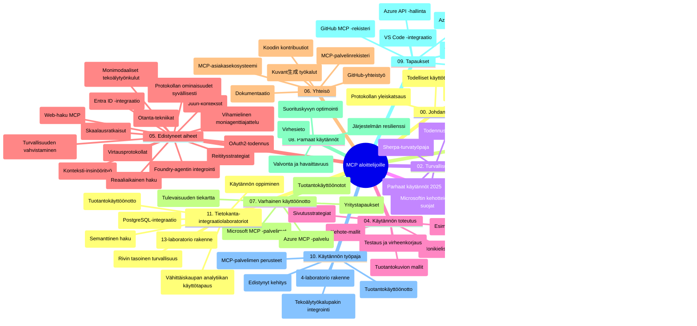

# Model Context Protocol (MCP) aloittelijoille - Opas

Tämä opas tarjoaa yleiskatsauksen "Model Context Protocol (MCP) for Beginners" -opetussuunnitelman arkiston rakenteesta ja sisällöstä. Käytä tätä opasta navigoidaksesi arkistossa tehokkaasti ja hyödyntääksesi saatavilla olevia resursseja parhaalla mahdollisella tavalla.

## Arkiston yleiskatsaus

Model Context Protocol (MCP) on standardoitu kehys tekoälymallien ja asiakassovellusten välisille vuorovaikutuksille. Alun perin Anthropicin luoma MCP ylläpidetään nyt laajemman MCP-yhteisön toimesta virallisessa GitHub-organisaatiossa. Tämä arkisto tarjoaa kattavan opetussuunnitelman, jossa on käytännön koodiesimerkkejä kielillä C#, Java, JavaScript, Python ja TypeScript, suunnattu tekoälykehittäjille, järjestelmäarkkitehdeille ja ohjelmistokehittäjille.

## Visuaalinen opetussuunnitelmakartta

## Arkiston rakenne

Arkisto on järjestetty yhdentoista pääosioon, jotka kukin keskittyvät eri MCP:n osa-alueisiin:

1. **Johdanto (00-Introduction/)**
   - Yleiskatsaus Model Context Protocolliin
   - Miksi standardointi on tärkeää tekoälyputkissa
   - Käytännön käyttötapaukset ja edut

2. **Peruskäsitteet (01-CoreConcepts/)**
   - Asiakas-palvelinarkkitehtuuri
   - Tärkeimmät protokollakomponentit
   - Viestintämallit MCP:ssä

3. **Tietoturva (02-Security/)**
   - MCP-pohjaisten järjestelmien tietoturvauhat
   - Parhaat käytännöt toteutusten suojaamiseksi
   - Autentikointi- ja valtuutusstrategiat
   - **Kattava tietoturvadokumentaatio**:
     - MCP Security Best Practices 2025
     - Azure Content Safety Implementation Guide
     - MCP Security Controls and Techniques
     - MCP Best Practices Quick Reference
   - **Keskeiset tietoturva-aiheet**:
     - Kehoteinjektiot ja työkalujen myrkytyshyökkäykset
     - Istunnonkaappaus ja "confused deputy" -ongelmat
     - Tokenin läpivientivaiheet
     - Liialliset oikeudet ja käyttövalvonta
     - Tekoälykomponenttien toimitusketjun turvallisuus
     - Microsoft Prompt Shields -integraatio

4. **Aloittaminen (03-GettingStarted/)**
   - Ympäristön asetukset ja konfigurointi
   - Perustason MCP-palvelimien ja -asiakkaiden luominen
   - Integraatio olemassa oleviin sovelluksiin
   - Sisältää osiot:
     - Ensimmäinen palvelin toteutus
     - Asiakaskehitys
     - LLM-asiakasintegraatio
     - VS Code -integraatio
     - Server-Sent Events (SSE) -palvelin
     - Edistynyt palvelimen käyttö
     - HTTP-suoratoisto
     - AI Toolkit -integraatio
     - Testausstrategiat
     - Julkaisuohjeet

5. **Käytännön toteutus (04-PracticalImplementation/)**
   - SDK:iden käyttäminen eri ohjelmointikielillä
   - Virheenkorjaus, testaus ja validointitekniikat
   - Uudelleenkäytettävien prompt-mallien ja työnkulkujen luominen
   - Esimerkkiprojekteja toteutusesimerkkien kera

6. **Edistyneet aiheet (05-AdvancedTopics/)**
   - Kontekstisuunnittelutekniikat
   - Foundry-agenttien integrointi
   - Monimodaaliset tekoälytyönkulut
   - OAuth2-autentikointidemot
   - Reaaliaikaiset hakutoiminnot
   - Reaaliaikainen suoratoisto
   - Juuri-kontekstien toteutus
   - Reitityksen strategiat
   - Otannan tekniikat
   - Skaalausmenetelmät
   - Turvallisuusseikat
   - Entra ID -turvallisuusintegraatio
   - Web-haun integrointi
   - Vastaväittäjä-multi-agenttiaajuus (debate-kuviot)

7. **Yhteisön panokset (06-CommunityContributions/)**
   - Kuinka osallistua koodilla ja dokumentaatiolla
   - Yhteistyö GitHubin kautta
   - Yhteisön vetämät parannukset ja palaute
   - Erilaisten MCP-asiakkaiden käyttö (Claude Desktop, Cline, VSCode)
   - Työskentely suosittujen MCP-palvelimien kanssa, mukaan lukien kuvatuotanto

8. **Varhaisen käyttöönoton opit (07-LessonsfromEarlyAdoption/)**
   - Käytännön toteutukset ja menestystarinat
   - MCP-pohjaisten ratkaisujen rakentaminen ja julkaisu
   - Trendit ja tulevaisuuden tiekartta
   - **Microsoft MCP Servers Guide**: Kattava opas 10 tuotantovalmiiseen Microsoft MCP -palvelimeen, sisältäen:
     - Microsoft Learn Docs MCP Server
     - Azure MCP Server (15+ erikoisliitintä)
     - GitHub MCP Server
     - Azure DevOps MCP Server
     - MarkItDown MCP Server
     - SQL Server MCP Server
     - Playwright MCP Server
     - Dev Box MCP Server
     - Azure AI Foundry MCP Server
     - Microsoft 365 Agents Toolkit MCP Server

9. **Parhaat käytännöt (08-BestPractices/)**
   - Suorituskyvyn viritys ja optimointi
   - Vikasietoisten MCP-järjestelmien suunnittelu
   - Testaus- ja resilienssistrategiat

10. **Tapaustutkimukset (09-CaseStudy/)**
    - **Seitsemän kattavaa tapaustutkimusta** osoittamassa MCP:n monipuolisuutta erilaissa tilanteissa:
    - **Azure AI Travel Agents**: Moni-agenttien orkestrointi Azure OpenAI:n ja AI-haun kanssa
    - **Azure DevOps -integraatio**: Työnkulkujen automaatio YouTube-datan päivityksillä
    - **Reaaliaikainen dokumentaation haku**: Python-konsoliasiakas suoratoistavalla HTTP:llä
    - **Interaktiivinen opintosuunnitelman generaattori**: Chainlit-verkkosovellus keskustelevaa tekoälyä käyttäen
    - **Editorin sisäinen dokumentaatio**: VS Code -integraatio GitHub Copilot -työnkulkujen kanssa
    - **Azure API Management**: Yritystason API-integraatio MCP-palvelimen luomisella
    - **GitHub MCP Registry**: Ekosysteemin kehittäminen ja agenttipohjainen integraatioalusta
    - Toteutusesimerkkejä kattavasti yritysintegroinnista, kehittäjätuottavuudesta ja ekosysteemin kehittämisestä

11. **Käytännön työpaja (10-StreamliningAIWorkflowsBuildingAnMCPServerWithAIToolkit/)**
    - Kattava käytännön työpaja, joka yhdistää MCP:n ja AI Toolkitin
    - Älykkäiden sovellusten rakentaminen, jotka yhdistävät tekoälymallit todellisiin työkaluihin
    - Käytännön moduulit kattavat perusteet, mukautetun palvelinkehityksen ja tuotantojulkaisut
    - **Lab-rakenne**:
      - Lab 1: MCP-palvelimen perusteet
      - Lab 2: Edistynyt MCP-palvelinkehitys
      - Lab 3: AI Toolkit -integraatio
      - Lab 4: Tuotantojulkaisu ja skaalaus
    - Lab-pohjainen oppimistapa vaiheittaisilla ohjeilla

12. **MCP-palvelimen tietokantaintegraatiolaboratoriot (11-MCPServerHandsOnLabs/)**
    - **Kattava 13-laboratoriopolku** tuotantovalmiiden MCP-palvelimien rakentamiseen PostgreSQL-integraatiolla
    - **Käytännön jälleenmyynnin analytiikan toteutus** käyttäen Zava Retail -esimerkkiä
    - **Yritystason mallit** kuten rivitason turvallisuus (RLS), semanttinen haku ja monivuokralaisarkkitehtuuri
    - **Kokonaisvaltainen lab-rakenne**:
      - **Labit 00-03: Perusteet** - Johdanto, arkkitehtuuri, tietoturva, ympäristön asennus
      - **Labit 04-06: MCP-palvelimen rakentaminen** - Tietokannan suunnittelu, MCP-palvelimen toteutus, työkalujen kehitys
      - **Labit 07-09: Edistyneet ominaisuudet** - Semanttinen haku, testaus ja virheenkorjaus, VS Code -integraatio
      - **Labit 10-12: Tuotanto ja parhaat käytännöt** - Julkaisu, valvonta, optimointi
    - **Katetut teknologiat**: FastMCP-kehys, PostgreSQL, Azure OpenAI, Azure Container Apps, Application Insights
    - **Oppimistulokset**: Tuotantovalmiit MCP-palvelimet, tietokantaintegraatiomallit, tekoälyvetoiset analytiikat, yritystason tietoturva

## Lisäresurssit

Arkisto sisältää tukimateriaaleja:

- **Kuvat-kansio**: Sisältää koko opetussuunnitelman aikaiset kaaviot ja kuvat
- **Käännökset**: Monikielinen tuki automaattisine dokumentaatiokäännöksineen
- **Viralliset MCP-resurssit**:
  - [MCP-dokumentaatio](https://modelcontextprotocol.io/)
  - [MCP-spesifikaatio](https://spec.modelcontextprotocol.io/)
  - [MCP GitHub-arkisto](https://github.com/modelcontextprotocol)

## Kuinka käyttää tätä arkistoa

1. **Peräkkäinen opiskelu**: Seuraa lukuja järjestyksessä (00–11) rakenteellisen oppimiskokemuksen saamiseksi.
2. **Kielikohtainen painotus**: Jos olet kiinnostunut tietystä ohjelmointikielestä, tutustu sample-kansioihin löytääksesi toteutukset haluamallasi kielellä.
3. **Käytännön toteutus**: Aloita "Getting Started" -osiosta ympäristön asennuksella ja ensimmäisen MCP-palvelimen ja -asiakkaan luomisella.
4. **Edistynyt tutkimus**: Kun perusteet ovat hallussa, sukeltaudu edistyneisiin aiheisiin laajentaaksesi osaamistasi.
5. **Yhteisöosallistuminen**: Liity MCP-yhteisöön GitHub-keskusteluissa ja Discord-kanavilla, ollaksesi yhteydessä asiantuntijoihin ja muihin kehittäjiin.

## MCP-asiakkaat ja työkalut

Opetussuunnitelmassa käsitellään erilaisia MCP-asiakkaita ja työkaluja:

1. **Viralliset asiakkaat**:
   - Visual Studio Code 
   - MCP Visual Studio Codessa
   - Claude Desktop
   - Claude VSCodessa
   - Claude API

2. **Yhteisön asiakkaat**:
   - Cline (päätepohjainen)
   - Cursor (koodieditori)
   - ChatMCP
   - Windsurf

3. **MCP-hallintatyökalut**:
   - MCP CLI
   - MCP Manager
   - MCP Linker
   - MCP Router

## Suositut MCP-palvelimet

Arkisto esittelee useita MCP-palvelimia, mukaan lukien:

1. **Viralliset Microsoft MCP -palvelimet**:
   - Microsoft Learn Docs MCP Server
   - Azure MCP Server (15+ erikoisliitintä)
   - GitHub MCP Server
   - Azure DevOps MCP Server
   - MarkItDown MCP Server
   - SQL Server MCP Server
   - Playwright MCP Server
   - Dev Box MCP Server
   - Azure AI Foundry MCP Server
   - Microsoft 365 Agents Toolkit MCP Server

2. **Viralliset referenssipalvelimet**:
   - Filesystem
   - Fetch
   - Memory
   - Sequential Thinking

3. **Kuvatuotanto**:
   - Azure OpenAI DALL-E 3
   - Stable Diffusion WebUI
   - Replicate

4. **Kehitystyökalut**:
   - Git MCP
   - Terminal Control
   - Code Assistant

5. **Erikoistuneet palvelimet**:
   - Salesforce
   - Microsoft Teams
   - Jira & Confluence

## Osallistuminen

Tämä arkisto toivottaa tervetulleeksi yhteisön panokset. Katso yhteisön panokset -osio saadaksesi ohjeita MCP-ekosysteemiin tehokkaasti osallistumisesta.

----

*Tämä oppaan päivitys tehtiin viimeksi 5. helmikuuta 2026 ja heijastaa viimeisintä MCP Specification 2025-11-25 -versiota sekä arkiston tilannetta kyseisenä päivänä. Arkiston sisältöä voidaan päivittää tämän päivämäärän jälkeen.*

---

<!-- CO-OP TRANSLATOR DISCLAIMER START -->
**Vastuuvapauslauseke**:  
Tämä asiakirja on käännetty käyttämällä tekoälypohjaista käännöspalvelua [Co-op Translator](https://github.com/Azure/co-op-translator). Pyrimme tarkkuuteen, mutta huomioithan, että automaattiset käännökset saattavat sisältää virheitä tai epätarkkuuksia. Alkuperäinen asiakirja sen alkuperäiskielellä on virallinen lähde. Tärkeissä tiedoissa suositellaan ammattimaista ihmiskäännöstä. Emme ole vastuussa tämän käännöksen käytöstä aiheutuvista väärinymmärryksistä tai tulkinnoista.
<!-- CO-OP TRANSLATOR DISCLAIMER END -->