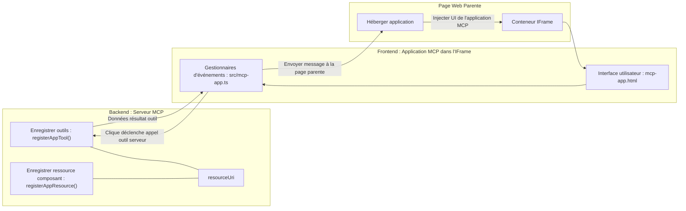

# MCP Apps

MCP Apps est un nouveau paradigme dans MCP. L'idée est que non seulement vous répondez avec des données issues d'un appel d'outil, mais vous fournissez également des informations sur la manière dont ces données doivent être utilisées. Cela signifie que les résultats d'un outil peuvent désormais contenir des informations UI. Pourquoi voudrions-nous cela ? Eh bien, considérez la façon dont vous procédez aujourd'hui. Vous consommez probablement les résultats d'un serveur MCP en plaçant un type d'interface frontend devant, ce qui est du code que vous devez écrire et maintenir. Parfois c'est ce que vous voulez, mais parfois ce serait génial si vous pouviez simplement intégrer un extrait d'information autonome qui contient tout, des données à l'interface utilisateur.

## Aperçu

Cette leçon fournit des conseils pratiques sur MCP Apps, comment commencer avec cela et comment l'intégrer dans vos applications Web existantes. MCP Apps est une nouveauté très récente dans la norme MCP.

## Objectifs d'apprentissage

À la fin de cette leçon, vous serez capable de :

- Expliquer ce que sont les MCP Apps.
- Quand utiliser MCP Apps.
- Construire et intégrer vos propres MCP Apps.

## MCP Apps - comment ça marche

L'idée avec MCP Apps est de fournir une réponse qui est essentiellement un composant à rendre. Un tel composant peut avoir à la fois des éléments visuels et de l'interactivité, par exemple des clics sur des boutons, des entrées utilisateur et plus encore. Commençons par le serveur et notre MCP Server. Pour créer un composant MCP App, vous devez créer un outil mais aussi la ressource application. Ces deux parties sont connectées par un resourceUri.

Voici un exemple. Essayons de visualiser ce qui est impliqué et quelles parties font quoi :

```text
server.ts -- responsible for registering tools and the component as a UI component
src/
  mcp-app.ts -- wiring up event handlers
mcp-app.html -- the user interface
```
  
Cette image décrit l'architecture pour créer un composant et sa logique.


Essayons ensuite de décrire les responsabilités respectives pour le backend et le frontend.

### Le backend

Il y a deux choses que nous devons accomplir ici :

- Enregistrer les outils avec lesquels nous voulons interagir.
- Définir le composant.

**Enregistrer l’outil**

```typescript
registerAppTool(
    server,
    "get-time",
    {
      title: "Get Time",
      description: "Returns the current server time.",
      inputSchema: {},
      _meta: { ui: { resourceUri } }, // Lie cet outil à sa ressource d'interface utilisateur
    },
    async () => {
      const time = new Date().toISOString();
      return { content: [{ type: "text", text: time }] };
    },
  );

```
  
Le code précédent décrit le comportement, où il expose un outil appelé `get-time`. Il ne prend pas d'entrées mais produit l'heure actuelle. Nous avons la possibilité de définir un `inputSchema` pour les outils nécessitant une entrée utilisateur.

**Enregistrer le composant**

Dans le même fichier, nous devons aussi enregistrer le composant :

```typescript
const resourceUri = "ui://get-time/mcp-app.html";

// Enregistrer la ressource, qui retourne le HTML/JavaScript regroupé pour l'interface utilisateur.
registerAppResource(
  server,
  resourceUri,
  resourceUri,
  { mimeType: RESOURCE_MIME_TYPE },
  async () => {
    const html = await fs.readFile(path.join(DIST_DIR, "mcp-app.html"), "utf-8");

    return {
    contents: [
        { uri: resourceUri, mimeType: RESOURCE_MIME_TYPE, text: html },
    ],
    };
  },
);
```
  
Notez comment nous mentionnons `resourceUri` pour connecter le composant à ses outils. Il est aussi intéressant de noter le callback où nous chargeons le fichier UI et retournons le composant.

### Le frontend du composant

Tout comme pour le backend, il y a deux éléments ici :

- Un frontend écrit en pur HTML.
- Du code qui gère les événements et ce qu’il faut faire, ex. appeler des outils ou envoyer des messages à la fenêtre parente.

**Interface utilisateur**

Regardons l’interface utilisateur.

```html
<!-- mcp-app.html -->
<!DOCTYPE html>
<html lang="en">
  <head>
    <meta charset="UTF-8" />
    <title>Get Time App</title>
  </head>
  <body>
    <p>
      <strong>Server Time:</strong> <code id="server-time">Loading...</code>
    </p>
    <button id="get-time-btn">Get Server Time</button>
    <script type="module" src="/src/mcp-app.ts"></script>
  </body>
</html>
```
  
**Connexion des événements**

La dernière pièce est la connexion des événements. Cela signifie que nous identifions quelle partie de notre UI nécessite des gestionnaires d'événements et que faire si des événements sont déclenchés :

```typescript
// mcp-app.ts

import { App } from "@modelcontextprotocol/ext-apps";

// Obtenir les références des éléments
const serverTimeEl = document.getElementById("server-time")!;
const getTimeBtn = document.getElementById("get-time-btn")!;

// Créer une instance de l'application
const app = new App({ name: "Get Time App", version: "1.0.0" });

// Gérer les résultats des outils provenant du serveur. Positionner avant `app.connect()` pour éviter
// de manquer le résultat initial de l'outil.
app.ontoolresult = (result) => {
  const time = result.content?.find((c) => c.type === "text")?.text;
  serverTimeEl.textContent = time ?? "[ERROR]";
};

// Connecter le clic du bouton
getTimeBtn.addEventListener("click", async () => {
  // `app.callServerTool()` permet à l'interface utilisateur de demander des données récentes au serveur
  const result = await app.callServerTool({ name: "get-time", arguments: {} });
  const time = result.content?.find((c) => c.type === "text")?.text;
  serverTimeEl.textContent = time ?? "[ERROR]";
});

// Se connecter à l'hôte
app.connect();
```
  
Comme vous pouvez le voir ci-dessus, c’est un code normal pour connecter des éléments DOM aux événements. Il est important de noter l’appel à `callServerTool` qui finit par appeler un outil sur le backend.

## Gérer les entrées utilisateur

Jusqu’à présent, nous avons vu un composant avec un bouton qui, lorsqu’on clique dessus, appelle un outil. Voyons si nous pouvons ajouter plus d’éléments UI comme un champ de saisie et voir si nous pouvons envoyer des arguments à un outil. Implémentons une fonctionnalité FAQ. Voici comment cela doit fonctionner :

- Il doit y avoir un bouton et un élément input où l'utilisateur tape un mot-clé pour chercher, par exemple "Shipping". Cela doit appeler un outil sur le backend qui effectue une recherche dans les données FAQ.
- Un outil qui supporte la recherche FAQ mentionnée.

Ajoutons d’abord le support nécessaire au backend :

```typescript
const faq: { [key: string]: string } = {
    "shipping": "Our standard shipping time is 3-5 business days.",
    "return policy": "You can return any item within 30 days of purchase.",
    "warranty": "All products come with a 1-year warranty covering manufacturing defects.",
  }

registerAppTool(
    server,
    "get-faq",
    {
      title: "Search FAQ",
      description: "Searches the FAQ for relevant answers.",
      inputSchema: zod.object({
        query: zod.string().default("shipping"),
      }),
      _meta: { ui: { resourceUri: faqResourceUri } }, // Lie cet outil à sa ressource UI
    },
    async ({ query }) => {
      const answer: string = faq[query.toLowerCase()] || "Sorry, I don't have an answer for that.";
      return { content: [{ type: "text", text: answer }] };
    },
  );
```
  
Ce que nous voyons ici, c'est comment nous remplissons `inputSchema` et lui donnons un schéma `zod` ainsi :

```typescript
inputSchema: zod.object({
  query: zod.string().default("shipping"),
})
```
  
Dans le schéma ci-dessus, nous déclarons que nous avons un paramètre d’entrée nommé `query` qui est optionnel avec une valeur par défaut de "shipping".

Ok, passons maintenant à *mcp-app.html* pour voir quelle interface utilisateur nous devons créer pour cela :

```html
<div class="faq">
    <h1>FAQ response</h1>
    <p>FAQ Response: <code id="faq-response">Loading...</code></p>
    <input type="text" id="faq-query" placeholder="Enter FAQ query" />
    <button id="get-faq-btn">Get FAQ Response</button>
  </div>
```
  
Super, maintenant nous avons un élément input et un bouton. Passons à *mcp-app.ts* pour connecter ces événements :

```typescript
const getFaqBtn = document.getElementById("get-faq-btn")!;
const faqQueryInput = document.getElementById("faq-query") as HTMLInputElement;

getFaqBtn.addEventListener("click", async () => {
  const query = faqQueryInput.value;
  const result = await app.callServerTool({ name: "get-faq", arguments: { query } });
  const faq = result.content?.find((c) => c.type === "text")?.text;
  faqResponseEl.textContent = faq ?? "[ERROR]";
});
```
  
Dans le code ci-dessus nous :

- Créons des références aux éléments UI interactifs.
- Gérons un clic sur le bouton pour extraire la valeur de l’élément input et appelons aussi `app.callServerTool()` avec `name` et `arguments` où ce dernier transmet `query` comme valeur.

Ce qui se passe réellement lorsque vous appelez `callServerTool` est qu’un message est envoyé à la fenêtre parente qui finit par appeler le serveur MCP.

### Essayez-le

En essayant cela, nous devrions voir maintenant ce qui suit :


et voici où nous essayons avec une entrée comme "warranty"


Pour exécuter ce code, rendez-vous dans la [section Code](./code/README.md)

## Test dans Visual Studio Code

Visual Studio Code offre un excellent support pour MCP Apps et est probablement une des façons les plus simples de tester vos MCP Apps. Pour utiliser Visual Studio Code, ajoutez une entrée serveur dans *mcp.json* comme ceci :

```json
"my-mcp-server-7178eca7": {
    "url": "http://localhost:3001/mcp",
    "type": "http"
  }
```
  
Puis démarrez le serveur, vous devriez pouvoir communiquer avec votre MCP App via la fenêtre de chat à condition d’avoir installé GitHub Copilot.

Vous pouvez le déclencher via une invite, par exemple "#get-faq" :


et tout comme lorsque vous l’avez lancé via un navigateur web, cela s’affiche de la même façon ainsi :


## Exercice

Créez un jeu pierre-papier-ciseaux. Il doit comporter les éléments suivants :

UI :

- une liste déroulante avec des options
- un bouton pour soumettre un choix
- un label affichant qui a choisi quoi et qui a gagné

Serveur :

- doit avoir un outil pierre-papier-ciseaux qui prend "choice" en entrée. Il doit aussi déterminer le choix de l'ordinateur et le gagnant

## Solution

[Solution](./assignment/README.md)

## Résumé

Nous avons appris ce nouveau paradigme MCP Apps. C’est un nouveau paradigme qui permet aux serveurs MCP d'avoir une opinion non seulement sur les données mais aussi sur la manière dont ces données doivent être présentées.

De plus, nous avons appris que ces MCP Apps sont hébergées dans un IFrame et pour communiquer avec les serveurs MCP, elles doivent envoyer des messages à l’application web parente. Plusieurs bibliothèques existent, tant pour JavaScript pur que pour React et autres, qui facilitent cette communication.

## Points clés à retenir

Voici ce que vous avez appris :

- MCP Apps est une nouvelle norme utile lorsque vous souhaitez livrer à la fois des données et des fonctionnalités UI.
- Ces types d’applications s’exécutent dans un IFrame pour des raisons de sécurité.

## Et après

- [Chapitre 4](../../04-PracticalImplementation/README.md)

---

<!-- CO-OP TRANSLATOR DISCLAIMER START -->
**Avertissement** :  
Ce document a été traduit à l’aide du service de traduction automatique [Co-op Translator](https://github.com/Azure/co-op-translator). Bien que nous nous efforcions d’assurer la précision, veuillez noter que les traductions automatisées peuvent contenir des erreurs ou des inexactitudes. Le document original dans sa langue native doit être considéré comme la source faisant autorité. Pour les informations critiques, une traduction professionnelle humaine est recommandée. Nous déclinons toute responsabilité en cas de malentendus ou de mauvaises interprétations résultant de l’utilisation de cette traduction.
<!-- CO-OP TRANSLATOR DISCLAIMER END -->